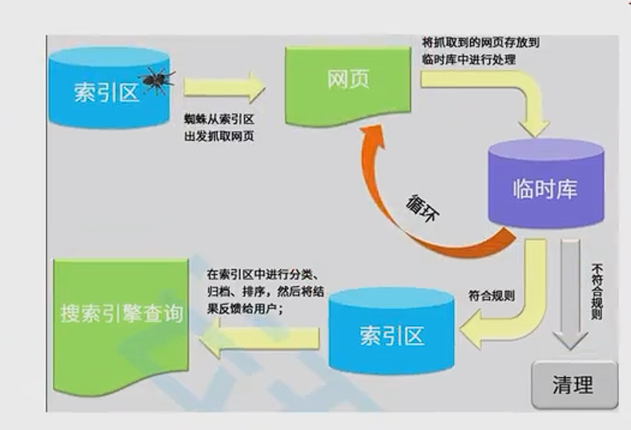

## HTML

### html是什么？

- 超文本标记语言
  - 由无数个**标签**组成
  - 是对**某些内容进行特殊的标记**，以供其他**解释器识别处理**
  - 由**标签和内容**组成的部分称为**元素**

### URL和URI的区别

- URL的标准格式
  - **[协议类型]：//[服务器地址]：[端口号]/[文件路径][文件名]？[查询]#[片段D]**


- **URL**

  `uniform Resource Locator`统一资源**定位符**，俗称**网络地址**，相当于**网络中的门牌号** **(直接定位到地址)**

- **URI**

  `uniform Resource Identifier` 统一资源**标识符**，用于**标识Web技术使用的逻辑或物理资源** （**只是标识到目标**）

  

- ***URL在某一个规则下能把一个资源独一无二的识别出来***

  - URL作为一个网络Web资源的地址,可以唯一将一个资源识别出来，所以URL是一个URI:
  - 所URL是URI的一个子集；
  - 但是URI并不一定是URL,URL一定是URI

**面试说法**：`比如在服务器上有一个图片，URL可以请求到它，URI可以标记识别，但是当这个图片加密时，URL就不能成功请求到，但是UTRI还是可以识别，所以可以说URL是URI的子集`

### HTML结构

```html
<!DOCTYPE html>
文档类型声明，告诉浏览器当前页面是HTML5页面
让浏览器识别内容，必须放在前面不能省略，会出兼容性问题
<html lang="en">
    所有元素的根，也称为根元素，所以元素必须是此元素的后代
    language:帮助语音合成工具确定要使用语言的发音，帮助翻译工具确定要使用的翻译规则。 主要使用"en" or "zh-CN"
<head>
    规定文档相关的配置信息(也称为元数据-metadata	)
  <meta charset="UTF-8">
    可以用于设置网页的字符编码，让测览器更精准地显示每一个文字，不设置或者设置错误会导致乱码：
一般都使用utf-8编码，涵盖了世界上几乎所有的文字；
  <meta http-equiv="X-UA-Compatible" content="IE=edge">
  <meta name="viewport" content="width=device-width, initial-scale=1.0">
  <title>Document</title>
</head>
<body>
  
</body>
</html>
```

### HTML标签

> 它的本质只是浏览器给它加上了一些不同的CSS样式而已。
>
> 理论上来说，所有的HTML元素，我们都可以实现相同的事情，
>
> 但是为了元素语义化，通常用对应的元素实现对应的事情

> H元素通常和SEO优化有关系。因为标题可以吸引用户达到搜索的目的

### 可替换元素

> 即可以被另一种资源替换的元素，比如：image当没有src时没有显示任何东西，有路径时相当于服务器请求路径地址下载替换了img .--=-使用另外一个资源占用当前元素即可替换元素

### 图片的路径

- 方式一：绝对路径（几乎不用）：
  - 从电脑的根目录开始一直找到资源的路径
- 方式二：相对路径（常用）
  - 相当于当前文件的一个路径：
  - **.**代表当前文件夹(1个.)  .可以省略
  - **..**代表上级文件夹(2个.)

### a标签

```html
<a href="./第一个网页.html" target="_blank">跳转到第一个网页
  target:该属性指定在何处显示链接的资源。
_self:默认值，在当前窗口打开URL:
_blank:在一个新的窗口中打开URL:
    其他不常用
</a>
```

**a元素——锚点链接：跳转到网页中的具体位置**

```html
<body>
    <p id="3">哈哈哈哈</p>
    <h2>主题1</h2>
    <h2>主题1</h2>
    <h2>主题1</h2>
    <h2>主题1</h2>

    <a href="#3">跳转到第一个网页</a>
    使用#号为id的意思然后加名称
    <p>呵呵呵呵呵</p>
  </body>
```

**锚点链接有两个重要步骤：**

- 在要跳到的元素上**定义一个id属性：**
- 定义**a元素**，并且a元素的**href指向对应的id;**

### iframe元素

- 利用iframe元素可以实现：在一个HTML文档中嵌入其他HTML文档
- frameborder属性
  - 用于规定是否显示边框

​              1：显示
​              0:不显示

- a元素target的其他值：
  - _parent:在父窗口中打开URL
  - top:在顶层窗口中打开URL

> 有些网站不允许使用iframe使用iframe时打不开是因为，他们在请求头里把iframe禁止了

### 元素语义化

- 语义化的好处
  - 方便代码维护：
  - 减少让开发者之间的沟通成本：
  - 能让语音合成工具正确识别网页元素的用途，以便作出正确的反应；
  - 有利于SEO:
  - .......

### SEO

> 搜索引擎优化（英语：search engine optimization,缩写为SEO)是通过了解搜索引擎的运作规则来调整网站，以及提高网站在有关搜索引擎内排名的方式。

- 搜索引擎的爬虫原理



>  使用爬虫对网页​中的数据进行爬取，然后把数据放在一个临时库里，在制定一些规定，符合规则的数据放入索引区中，写对应的算法排序对数据进行分类最后将用户对应的搜索结果反馈给用户，不符合规矩的数据会被清理。

## HTML高级元素

#### 列表

- HTML提供了3组常用的用来展示列表的元素	
  - 有序列表：**ol (ordered list)、li (list item)**
  - 无序列表：**ul、li**
  - 定义列表：**dl (definition list) 、dt ( d term)每一项、dd(d description)每一项的内容**

#### 表格

- 常用元素

  - table(表格)
  - tr(table roe)
    - 表格中的行
  - td(table data)
    - 行中的单元格

- `border--collapse` CSS属性是用来决定表格的边框是分开的还是合并的。

  ```css
  - table{ border-collapse:collapse;} 
  - 合并单元格的边框
  ```

- **thead**

  - 表格的表头

- **tbody**

  - 表格的主体

- **tfoot**

  - 表格的页脚

- **caption**

  - 表格的标题

- **th**

  - 表格的表头单元格

  单元格合并

- **单元格合并分成两种情况：**

  - 跨列合并：使用`colspan`
    - 在最左边的单元格写上colspan属性并且省略掉合并的td;
  - 跨行合并：使用`rowspan`
  - - 在最上面的单元格写上rowspan.属性并且省略掉后面tr中的td：

#### 表单

- 表单按钮

  - **普通按钮(type=button)**：使用value属性设置按钮文字
  - **重置按钮(type=reset)**:重置它所属form的所有表单元素（包括input、textarea、select)
  - **提交按钮(type=submit)**:提交它所属form的表单数据给服务器（包括input,textarea、select)

  **我们也可以通过按钮来实现：**
  button里有个type属性，输入对应得值即可

- **input和label的关系**

  -  label元素一般跟input配合使用，用来表示input的标题
  -  labe可以跟**某个input绑定**，**点击label**就可以**激活对应的input**变成选中

```html
  <!-- lable与input的联合使用，当lable包裹input时，input有指定id，把这个id给lable的for用于绑定，那么他们就会实现绑定关联
      只要点击在lable内的元素，都会选择到单选框 -->
      <label for="mela"> 男性：<input id="mela" type="radio " /> </label>
      <label for="femela"> 女性：<input id="femela" type="radio " /> </label>
```

>  name值相同的radio才具备单选功能   

```html
  <!-- 只要input的name值设置为相同时才会实现只能选一个radio的功能，还可以设置value值用于提交时参数，
       name相当于提交到服务器的key,value相当于值
         name=value -->
      <label for="mela">
        男性：<input id="mela" type="radio" name="sex" value="mela" />
      </label>
      <label for="femela">
        女性：<input id="femela" type="radio" name="sex" value="female" />
        <button type="submit">提交</button>
      </label>
```

> **checkbox的name和value的功能一样，属于同一种类型的checkbox，name值要保持一致**

- textarea的使用
  - textarea的常用属性：
    - cos:列数
    - roWs:行数
  - 缩放的CSS设置
    - 禁止缩放：resize:none;
    - 水平缩放：resize:horizontal;
    - 垂直缩放：resize:vertical
    - 水平垂直缩放：resize:both;
- select和option的使用
  - option是select的子元素，一个option代表一个选项
  - select常用属性
    - multiple:可以多选
    - size:显示多少项
  - option常用属性
    - selected:默认被选中
- form常见的属性
  - form通常作为表单元素的父元素：
    - form可以将整个表单作为一个**整体来进行操作，**
    - 比如对整个表单**进行重置**，
    - 比如对整个表单的数据**进行提交**，
- form常见的属性如下：
  - **action**
    - 用于提交表单数据的**请求URL**
  - **method**
    - 请求方法(**get和post**),默认是get
  - **target**
    - 在什么地方打开URL(参考a元素的target)


## HTML5语义化元素

- **在HMTL5之前，我们的网站分布层级通常包括哪些部分呢？**
  
  - **header、.nav、main、footer**
- **但是这样做有一个弊端：**
  - 我们往往**过多的使用div**,通过id或class来区分元素；
  - 对于浏览器来说这些**元素不够语义化：**
  - 对于搜索引擎来说，**不利于SEO的优化：**
- **HTML5新增了语义化的元素：**
  - <header>头部元素
  - <nav>:导航元素
  - <section>:定义文档某个区域的元素
  - <article>:内容元素
  - <aside>:侧边栏元素
  - <footer>::尾部元素

## HTML5新增元素 - video

-  **HTML  元素 用于在HTML或者XHTML文档中嵌入媒体播放器，用于支持文档内的视频播放**

```html
<video src="../video/fcrs.mp4"controls></video>
```

- video常见的属性:

  | 常见属性 |      值的方式      |                           属性作用                           |
  | :------: | :----------------: | :----------------------------------------------------------: |
  |   src    |      URL地址       |                      视频播放的URL地址                       |
  |  width   |    pixels(像素)    |                        设置video宽度                         |
  |  height  |    pixels(像素)    |                        设置video高度                         |
  | controls |    Boolean类型     |        是否显示控制栏,包括音量，跨帧，暂停/恢复播放。        |
  | autoplay |    Boolean类型     |    是否视频自动播放(某些浏览器需要添加muted, 比如Chrome)     |
  |  muted   |    Boolean类型     |                         是否静音播放                         |
  | preload  | none/metadata/auto | 是否需要预加载视频. metadata表示预加载元数据(比如视频时长等) |
  |  poster  |      URL地址       |                        一海报帧的URL                         |

- video支持的视频格式

  - 每个视频都会有自己的格式, 浏览器的video并非支持所有的视频格式

### video的兼容性写法

- **在元素中间的内容，是针对浏览器不支持此元素时候的降级处理。**
  - 内容一：通过**<source >元素**元素指定更多视频格式的源;
  -  内容二：通过**p/div等元素**指定在浏览器不支持video元素的情况, 显示的内容;

```html
<video src="../video/fcrs.mp4"controls width="500"autoplay muted>
<source src="./vides/fcrs.webm">
<p>你的浏览器不支持HTML5的video元素，请更换浏览器查看！</p>
</video>
```

## HTML5新增元素 - audio

- **HTML  元素用于在文档中嵌入音频内容, 和video的用法非常类似**

```html
<audio src="../media/yhbk.mp3"controls autoplay muted></audio>
```

- 常见属性:
  - 除了没有宽高和poster其他和video一样

> 同样audio也有支持和视频格式和兼容性写法，使用和video一样

## input元素的扩展内容

- **HTML5对input元素也进行了扩展，在之前我们已经学习过的其中几个属性也是HTML5的特性：**
  -  **placeholder**：输入框的占位文字
  -  **multiple**：多个值
  - **autofocus**：最多输入的内容
- **另外对于input的type值也有很多扩展：**
  - date
  - time
  - number
  - tel
  - color
  - email
  - 等等…
- **查看MDN文档:**
  -  https://developer.mozilla.org/zh-CN/docs/Web/HTML/Element/Input

## 新增全局属性 data-*

- **在HTML5中, 新增一种全局属性的格式 data-*, 用于自定义数据属性:**
  - data设置的属性可以在JavaScript的DOM操作中通过**dataset**轻松获取到；
  - 通常**用于HTML和JavaScript数据之间的传递；**

```html
<div class="box"title="abc" data-name="why"data-age="18">
box
</div>
<script>
const boxEl = document.querySelector(".box")
console.log(boxEl.dataset)
</script>
```

- 在小程序中, 就是**通过data-来传递数据**的, 所以该全局属性必须要掌握.

