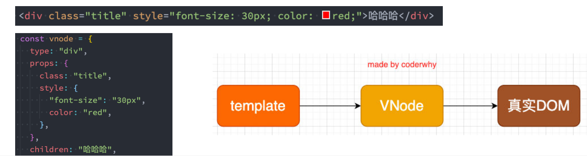
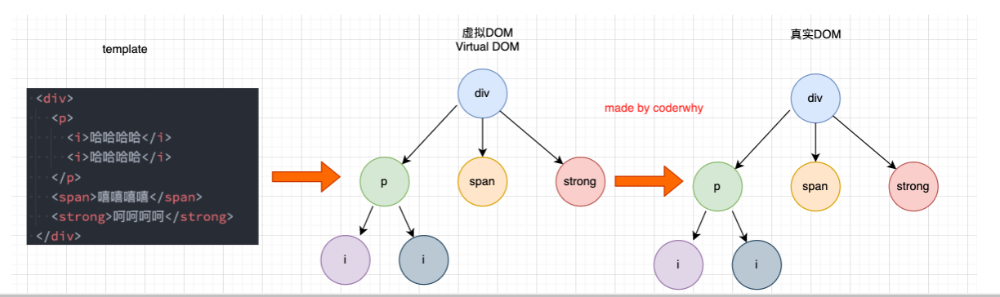

Vue

一个渐进式框架：按照需求安装自己需要的，不会直接安装完整插件

**声明式和命令式：**

命令式编程关注的是 **“how to do”**自己完成整个how的过程 （原生开发）；
声明式编程关注的是 **“what to do”**，由框架(机器)完成 “how”的过程（框架开发）；

## optionsApi

### data属性

-  **data属性是传入一个函数，并且该函数需要返回一个对象：**
  - 在**Vue2.x**的时候，**也可以传入一个对象**（虽然官方推荐是一个函数）；
  -  在**Vue3.x**的时候，**必须传入一个函数**，否则就会直接在浏览器中报错；
- **data中返回的对象会被Vue的响应式系统劫持，之后对该对象的修改或者访问都会在劫持中被处理：**
  - 所以我们在template或者app中**通过 {{counter}} 访问counter**，可以从对象中获取到数据；
  - 所以我们**修改counter的值**时，**app中的 {{counter}}也会发生改变；**

### methods属性

-  **methods属性是一个对象，通常我们会在这个对象中定义很多的方法：**
  - 这些方法可以**被绑定到 模板**中；
  - 在该方法中，我们可以**使用this关键字**来直接访问到data中返回的对象的属性；

> 在methods中不可以使用箭头函数，因为箭头函数没有this，它会向上层作用域进行查找，做好会找到window,这样我们就获取不了data中的数据了
>
> 事实上Vue的源码当中就是对methods中的所有函数进行了遍历，并且通过bind绑定了this：

### computed计算属性

#### 复杂data的处理方式

- **我们知道，在模板中可以直接通过插值语法显示一些data中的数据。**
- 但是在某些情况，我们可能需要**对数据进行一些转化**后再显示，或者需要**将多个数据结合起来**进行显示；
  - 比如我们需要对**多个data数据进行运算、三元运算符来决定结果、数据进行某种转化**后显示；
  - 在模板中使用**表达式，**可以非常方便的实现，但是设计它们的初衷是用于**简单的运算**；
  - 在模板中放入太多的逻辑会让**模板过重和难以维护**；
  - 并且如果多个地方都使用到，那么会有大量重复的代码；
- **我们有没有什么方法可以将逻辑抽离出去呢？**
  - 可以，其中一种方式就是将逻辑抽取到一个**method**中，放到methods的options中；
  - 但是，这种做法有一个直观的弊端，就是所有的data使用过程都会变成了一个**方法的调用；**
  - 另外一种方式就是使用计算属性**computed**；

#### 认识计算属性computed

- **什么是计算属性呢？**
  - 官方并没有给出直接的概念解释；
  - 而是说：对于**任何包含响应式数据的复杂逻辑**，你都应该使用**计算属性**；
  -  **计算属性**将被混入到组件实例中
    - 所有 getter 和 setter 的 this 上下文自动地绑定为组件实例；
  - **计算属性的用法：**
    - **选项**：computed
    - **类型**：{ [key: string]: Function | { get: Function, set: Function } }

- 计算属性看起来像是一个函数，但是我们在使用的时候不需要加()
- **并且计算属性是有缓存的；**

#### 计算属性的缓存

- 计算属性会基于它们的**依赖关系进行缓存**；
- 在**数据不发生变化**时，计算属性是**不需要重新计算**的；
- 但是如果**依赖的数据发生变化**，在使用时，计算属性依然**会重新进行计算；**

> 当数据没有发生变化时，无论使用计算属性多少次，都只会执行一次
>
> 方法每一次都会执行

#### 计算属性的setter和getter

- 计算属性在大多数情况下，只需要一个**getter方法**即可，所以我们会将计算属性直接**写成一个函数。**
  - 平时省略get了
- 但是，如果我们确实想**设置计算属性的值**呢？
  - 这个时候我们也可以给计算属性设置一个**setter的方法；**

```js
computed:{
    fullName:{
     
        get(){
          return this.firstName +""this.lastName;  
        },
set(value){
const names value.split("")
this.firstName names[];
this.lastName names[1];    
}

    }
}
//只有get时，一种语法糖
fullname{
    get(){}
} ===  fullname() {}

```

### 侦听器watch

- **什么是侦听器呢？**
  - 开发中我们在data返回的对象中定义了数据，这个数据通过**插值语法等方式绑定到template**中；
  - 当数据变化时，template会自动进行更新来显示最新的数据；
  - 但是在某些情况下，我们希望在**代码逻辑**中监听某个数据的变化，这个时候就需要用**侦听器watch**来完成了；

- **侦听器的用法如下：**
  - **选项**：watch
  - 类型：{ [key: string]: string | Function | Object | Array}
- **里面为一个个方法，名字为监听数据的名字，默认有2个参数（newvalue,oldvalue）{}**
  - 如果是对象类型，拿到的是proxy代理对象

#### 侦听器watch的配置选项

- **我们先来看一个例子：**
  - 当我们点击按钮的时候会**修改info.name**的值；
  - 这个时候我们**使用watch来侦听info，可以侦听到吗**？答案是**不可以。**
- 这是因为默认情况下，**watch只是在侦听info的引用变化，对于内部属性的变化是不会做出响应的：**
  - 这个时候我们可以使用一个**选项deep**进行更深层的侦听；
  -  注意watch里面侦听的属性对应的也可以是一个Object；
- 还有**另外一个属性，是希望一开始的就会立即执行一次：**
  - 这个时候我们使用**immediate选项；**
  - 这个时候无论后面数据是否有变化，侦听的函数都会有限执行一次；

```js
 watch: {
        //写成对象形式，开启深度监听和立即执行
        info: {
            //handle函数，固定写法
          handler(newvalue, oldvalue) {
            console.log("监听info的变化", newvalue, oldvalue)
          },
          deep: true,
          immediate: true
        },
            //第二种监听属性方法
        "info.name"() {
          console.log('第二种写法字符串形式')
        }
      },
```

## 基本语法

- **React的开发模式：**
  - React使用的jsx，所以对应的代码都是**编写的类似于js的一种语法；**
  - 之后通过Babel将jsx编译成 React.createElement 函数调用；
- **Vue也支持jsx的开发模式：**
  - 但是大多数情况下，使用**基于HTML的模板语法；**
  - 在模板中，允许开发者以声明式的方式将**DOM**和**底层组件实例的数据**绑定在一起；
  - 在底层的实现中，Vue将**模板**编译成**虚拟DOM渲染函数**，这个我会在后续给大家讲到；

- **所以，对于学习Vue来说，学习模板语法是非常重要的。**

### Mustache双大括号语法

- **如果我们希望把数据显示到模板（template）中，使用最多的语法是 “Mustache”语法 (双大括号) 的文本插值。**
  - **在data返回的对象**是有添加到**Vue的响应式系统**中；
  - 当**data中的数据发生改变**时，**对应的内容也会发生更新。**
  - 当然，Mustache中不仅仅可以是data中的属性，也可以是一个**JavaScript的表达式。**

### v-once指令

- **v-once用于指定元素或者组件只渲染一次：**
  - 当数据发生变化时，**元素或者组件以及其所有的子元素**将视为**静态内容**并且跳过；
  - 该指令可以用于**性能优化**；
- **如果是子节点，也是只会渲染一次：**

### v-text指令

- 用于更新元素的 textContent：

### v-html

- 默认情况下，如果我们展示的**内容本身是 html** 的，那么**vue并不会对其进行特殊的解析**。
  - 如果我们希望这个内容**被Vue可以解析出来**，那么可以**使用 v-html** 来展示；

### v-pre

- v-pre用于**跳过元素和它的子元素的编译过程**，显示原始的Mustache标签：
  - 跳过不需要编译的节点，加快编译的速度；

### v-cloak

- **这个指令保持在元素上直到关联组件实例结束编译。**
  - 和 CSS 规则如 [v-cloak] { display: none } 一起用时，这个指令可以隐藏未编译的 Mustache 标签直到组件实例准备完毕。

### v-bind的绑定属性

- **前端讲的一系列指令，主要是将值插入到模板内容中。**
- **但是，除了内容需要动态来决定外，某些属性我们也希望动态来绑定。**
  - 比如动态绑定a元素的href属性；
  - 比如动态绑定img元素的src属性；

- **绑定属性我们使用v-bind：**
  - 缩写：:
  - **用法**：动态地绑定一个或多个 attribute，或一个组件 prop 到表达式。

#### 绑定基本属性

- **v-bind用于绑定一个或多个属性值，或者向另一个组件传递props值**
- 在开发中，有哪些属性需要动态进行绑定呢？
  - 还是有很多的，比如图片的链接src、网站的链接href、动态绑定一些类、样式等等

#### 绑定class介绍

- **在开发中，有时候我们的元素class也是动态的，比如：**
  - 当数据为**某个状态**时，字体显示红色。
  - 当数据**另一个状态**时，字体显示黑色。
- **绑定class有两种方式：**
  - 对象语法
  - 数组语法

##### 绑定class – 对象语法

- 对象语法：我们可以传给 :class (v-bind:class 的简写) 一个对象，以动态地切换 class。
  - {key:value}
    - key:类
    - value为布尔值

```js
<template id="my-app">
<!--·1.普通的绑定方式-->
<div :class="className">{{message}}</div>
<!--·2.对象绑定·-->
<!--·动态切换class.是否加入：·{类（变量）：·boolean(true/false)}·-->
<div class="why" :class="{nba:true,'james':true}"></div>
<!--·3.案例练习-->
    定义一个 isactive属性值为布尔值，在使用click动态切换布尔值
<div :class={active:·isActive}">哈哈哈</div>
<button @click="toggle">切换</button〉
<!--·4.绑定对象·-->
<div :class="classobj">哈哈哈</div>
<!--·5.从methods中获取.-->
    抽取成一个方法，使用
<div· :class="getclass0bj()">呵呵呵</div>
</template>
```

##### 绑定class – 数组语法

- 数组语法：我们可以把一个数组传给 :class，以应用一个 class 列表；
  - 数组中可以使用对象语法

```vue
<template id="my-app">
<!--·1.直接传入一个数组-->
<div :class="['why',nba]">哈哈哈</div>
<!--·2.数组中也可以使用三元运算符或者绑定变量·-->
<div :class="['why',nba,isActive?'active':·']">呵呵呵</div>
<!--·3.数组中也可以使用对象语法·-->
<div :class:="['why',nba,{'actvie':·isActive}]">嘻嘻嘻</div>
</template>
```

#### 绑定style介绍

- 我们可以利用**v-bind:style**来绑定一些**CSS内联样式：**
  - 这次因为某些样式我们需要根据**数据**动态来决定；
  - 比如某段文字的**颜色，大小**等等；
- CSS property 名可以用**驼峰式 (camelCase) 或短横线分隔 (kebab-case，记得用引号括起来)** 来命名；
- **绑定class有两种方式：**
  - 对象语法
  - 数组语法

对象语法：

```vue
<template id="my-app">
<!--·1.基本使用：·传入一个对象，·并且对象内容都是确定的-->
<div :style="{color:'red',fontsize:'30px','background-color':'blue']">{{message}}</div>
<!--·2.变量数据：·传入一个对象，·值会来自于data·-->
<div :style="{color:'red',fontsize:size +'px','background-color':'blue']">{{message]]</div>
<!-·3.对象数据：·直接在data中定义好对象在这里使用·-->
<div :style="styleobj">{{message}}</div>
</template>
```

数组语法：

```vue
<template id="my-app">
写2个对象，对象中定义属性
<div :style="[styleobj1,styleobj2]">{{message]]</div>
</template>
```

#### 动态绑定属性

- 在某些情况下，我们**属性的名称**可能也不是固定的：
  - 前端我们无论绑定src、href、class、style，属性名称都是固定的；
  - 如果**属性名称不是固定**的，我们可以使用 **:[属性名]=“值”** 的格式来定义；
  - 这种绑定的方式，我们称之为**动态绑定属性；**

```vue
<template id="my-app">
<!--·属性的名称是动态的·-->
<div :[name]="value">{{message]]</div>
</template>
```

#### 绑定一个对象

- 如果我们希望将一个对象的所有属性，绑定到元素上的所有属性，应该怎么做呢？
  - 非常简单，我们可以直接使用 v-bind 绑定一个 对象；
- 案例：info对象会被拆解成div的各个属性

### v-on绑定事件

- 前面我们绑定了元素的**内容和属性**，在前端开发中另外一个非常重要的特性就是**交互**。
- **在前端开发中，我们需要经常和用户进行各种各样的交互：**
  - 这个时候，我们就必须监听用户发生的事件，比如**点击、拖拽、键盘事件**等等
  - 在Vue中如何监听事件呢？使用**v-on指令。**

#### v-on的用法

-  **v-on的使用：**
  - **缩写**：@
  - **预期**：Function | Inline Statement | Object
  - **参数**：event
  - **修饰符**：
    - .stop - 调用 event.stopPropagation()。
    - .prevent - 调用 event.preventDefault()。
    - .capture - 添加事件侦听器时使用 capture 模式。
    - .self - 只当事件是从侦听器绑定的元素本身触发时才触发回调。
    - .{keyAlias} - 仅当事件是从特定键触发时才触发回调。
    - .once - 只触发一次回调。
    -  .left - 只当点击鼠标左键时触发。
    - .right - 只当点击鼠标右键时触发。
    - .middle - 只当点击鼠标中键时触发。
    - .passive - { passive: true } 模式添加侦听器
  - **用法**：绑定事件监听

#### v-on参数传递

- **当通过methods中定义方法，以供@click调用时，需要注意参数问题：**
- 情况一：如果该方法不需要额外参数，那么方法后的()可以不添加。
  - 但是注意：如果方法本身中有一个参数，那么会默认将原生事件event参数传递进去
- 情况二：如果需要**同时传入某个参数，同时需要event**时，可以**通过$event传入事件。**

```vue
<!--3.内联语句-->
<!-·默认会把event.对象传入-->
<button @click="btn4Click">按钮4</button>
<!-一·内联语句传入其他属性·-一>
<button @click="btn5click($event,'why')">5</button>


btn4click(event){
console.log(event);
}

btn5click(event,message){
console.log(event,message)
};

```

### 条件渲染

- **在某些情况下，我们需要根据当前的条件决定某些元素或组件是否渲染，这个时候我们就需要进行条件判断了。**
- **Vue提供了下面的指令来进行条件判断：**
  - v-if
  - v-else
  - v-else-if
  - v-show

#### v-if、v-else、v-else-if

- **v-if、v-else、v-else-if用于根据条件来渲染某一块的内容：**
  - 这些内容只有在条件为true时，才会被渲染出来；
  - 这三个指令与JavaScript的条件语句if、else、else if类似；

```vue
<template id="my-app">
<input type="text" v-model.number="score">
<h2 V-if="score > 90">优秀</h2>
<h2 v-else-if="score > 80">良好</h2>
<h2 v-else-if="score > 60">普通</h2>
<h2v-else>不及格</h2>
</template>
```

- **v-if的渲染原理：**
  - v-if是惰性的；
  - 当条件为false时，其判断的内容完全不会被渲染或者会被销毁掉；
  - 当条件为true时，才会真正渲染条件块中的内容；

#### template元素

- **因为v-if是一个指令，所以必须将其添加到一个元素上：**
  - 但是如果我们希望切换的是多个元素呢？
  - 此时我们渲染div，但是我们并不希望div这种元素被渲染；
  - 这个时候，我们可以选择使用template；
- **template元素可以当做不可见的包裹元素，并且在v-if上使用，但是最终template不会被渲染出来：**
  - 有点类似于小程序中的block

```vue
<template id="my-app">
<template v-if="showHa">
<h2>哈哈哈哈</h2>
<h2>哈哈哈哈</h2>
<h2>哈哈哈哈</h2>
</template>
<template v-else>
<h2>呵呵呵呵</h2>
<h2>呵呵呵呵</h2>
<h2>呵呵呵呵</h2>
</template>
<button @click="toggle">切换</button>
</template>
```

#### v-show

-  **v-show和v-if的用法看起来是一致的，也是根据一个条件决定是否显示元素或者组件：**

#### v-show和v-if的区别

- **首先，在用法上的区别：**
  - v-show是不支持template；
  -  v-show不可以和v-else一起使用；
- **其次，本质的区别：**
  - v-show元素无论是否需要显示到浏览器上，它的DOM实际都是有存在的，只是通过CSS的display属性来进行切换；
  - v-if当条件为false时，其对应的原生压根不会被渲染到DOM中；
- **开发中如何进行选择呢？**
  - 如果我们的原生需要在显示和隐藏之间频繁的切换，那么使用v-show；
  - 如果不会频繁的发生切换，那么使用v-if；

### 列表渲染

- **在真实开发中，我们往往会从服务器拿到一组数据，并且需要对其进行渲染。**
  - 这个时候我们可以使用**v-for**来完成；
  - v-for类似于JavaScript的for循环，可以用于遍历一组数据；

#### v-for基本使用

-  v-for的基本格式是 **"item in 数组"**：
  - 数组通常是来自**data或者prop**，也可以是其他方式；
  - item是我们给每项元素起的一个**别名**，这个别名可以自定来定义；
- 我们知道，在遍历一个数组的时候会经常需要拿到**数组的索引**：
  - 如果我们需要索引，可以使用格式： **"(item, index) in 数组"；**
  - 注意上面的顺序：数组元素项item是在前面的，索引项index是在后面的

#### v-for支持的类型

- **v-for也支持遍历对象，并且支持有一二三个参数：**
  - 一个参数： "value in object";
  - 二个参数： "(value, key) in object";
  - 三个参数： "(value, key, index) in object";
- **v-for同时也支持数字的遍历：**
  - 每一个item都是一个数字；
- **v-for也可以遍历其他可迭代对象(Iterable)**

#### template元素

- **类似于v-if，你可以使用 template 元素来循环渲染一段包含多个元素的内容：**
  - 我们使用template来对多个元素进行包裹，而不是使用div来完成；

#### 数组更新检测

- **Vue 将被侦听的数组的变更方法进行了包裹，所以它们也将会触发视图更新。**
- **这些被包裹过的方法包括：**
  - push()
  - pop()
  - shift()
  - unshift()
  - splice()
  - sort()
  - reverse()

- **替换数组的方法**
  - 上面的方法会直接修改原来的数组；
  - 但是某些方法不会替换原来的数组，而是会生成新的数组，比如 filter()、concat() 和 slice()；
    - 生成新数组不能进行侦听

#### v-for中的key是什么作用？

- 在使用v-for进行列表渲染时，我们通常会给元素或者组件绑定一个key属性。
- 这个key属性有什么作用呢？我们先来看一下**官方的解释**：
  - key属性主要用在Vue的**虚拟DOM算法**，在**新旧nodes**对比时辨识**VNodes；**
  - 如果**不使用key**，Vue会使用一种最大限度减少动态元素并且尽可能的尝试就地**修改/复用相同类型元素**的算法；
  - 而**使用key**时，它会基于key的变化**重新排列元素顺序**，并且会**移除/销毁key**不存在的元素；

> 使用key可以提高性能
>
> Vue事实上会对于有key和没有key会调用两个不同的方法；
> 有key，那么就使用 patchKeyedChildren方法；
>
> 没有key，那么久使用 patchUnkeyedChildren方法；
>
> 当没有key时：
>
> 我们在中间添加，删除元素那么后面的元素会重新排列布局，不会进行复用
>
> 当有key时：
>
> 对里面得到每一项虚拟节点进行遍历，发现key和老节点key一样，那么会直接保留进行复用
>
> 1.从头部开始遍历，遇到相同的节点就继续，遇到不同的就跳出循环
>
> 2.从尾部开始遍历，遇到相同的节点就继续，遇到不同的就跳出循环
>
> 3.如果最后新节点更多，那么就添加新节点
>
> 4.如果旧节点更多，那么就移除旧节点
>
> 5**.如果中间存在不知道如何排列的位置序列，那么就使用key建立索引图**
> **最大限度的使用旧节点**

#### 认识VNode

- **VNode的全称**是**Virtual Node**，也就是**虚拟节点**；
- 事实上，无论是**组件还是元素**，它们最终**在Vue中表示出来的都是一个个VNode**；
- **VNode的本质是一个JavaScript的对象；**



> 先把template模板解析成VNodes对象，在转换成真实dom

#### 虚拟DOM

- **如果我们不只是一个简单的div，而是有一大堆的元素，那么它们应该会形成一个VNode Tree：**



> 对个VNodes可以组成虚拟Dom,然后在转换成真实DOm
>
> 好处：
>
> 1.利用虚拟dom进行diff算法
>
> 2.利用虚拟dom可以进行跨平台开发

### v-model表单

- 表单提交是开发中非常常见的功能，也是和用户交互的重要手段：
  - 比如用户在**登录、注册**时需要提交账号密码；
  - 比如用户在**检索、创建、更新**信息时，需要提交一些数据；
- 这些都要求我们可以在**代码逻辑中获取到用户提交的数据**，我们通常会使用**v-model指令**来完成：
  - **v-model**指令可以在表单 input、textarea以及select元素上创建**双向数据绑定；**
  - 它会根据**控件类型**自动选取正确的方法来更新元素；
  - 尽管有些神奇**，但 v-model 本质上不过是语法糖**，它**负责监听用户的输入事件来更新数据**，并在某种极端场景下进行一些特殊处理；

```html

  <div id="app">
      //实现双向数据绑定，input中输入什么，message显示什么
    <input type="text" name="" id="" v-model="message">
    <h2>{{message}} </h2>
  </div>
```

#### v-model的原理

- 官方有说到，v-model的原理其实是背后有两个操作：
  - **v-bind绑定value属性**的值；
  - **v-on绑定input事件**监听到函数中，函数会获取最新的值赋值到绑定的属性中；

```html

<input v-model="searchText"/>
等价于：
<input value="searchText" @input="searchText = $event.target.value"/>
```

> 通过用于获取用户输入表单内容，发送网络请求

#### v-model绑定checkbox

- **单个勾选框：**
  - v-model即为**布尔值。**
  - 此时input的value属性并不影响v-model的值。
- **多个复选框：**
  - 当是**多个复选框**时，因为可以选中多个，所以对应的**data中属性是一个数组**。
  - 当选中某一个时，就会**将input的value添加到数组**中

> select和它一样，值放在数组中，需要给个value，会自动传到数组中
>
> radio需要相同的name互斥，或者v-model的值一样也可以达到一样效果

#### v-model修饰符

**lazy**：

- 将绑定的事件切换为 **change 事件，**只有在提交时（比如回车）才会触发
  - 表单失去焦点时才会提交

**number**：

- 将值转换为Number类型

**trim**：

- 去除首位空格

## 组件化

### 父子组件之间通信的方式

- **父子组件之间如何进行通信呢？**
  - 父组件传递给子组件：**通过props属性**；
  - 子组件传递给父组件：**通过$emit触发事件**；

#### 父组件传递给子组件

- 在开发中很常见的就是**父子组件之间通信**，比如父组件有一些数据，需要子组件来进行展示：
  - 这个时候我们可以**通过props来完成组件之间的通信；**
- **什么是Props呢？**
  - Props是你可以在组件上**注册一些自定义的attribute**；
  - 父组件给**这些attribute赋值，子组件通过attribute的名称获取到对应的值；**
- Props有两种常见的用法：
  - **方式一：字符串数组**，数组中的字符串就是attribute的名称；
  - **方式二：对象类型**，对象类型我们可以在指定attribute名称的同时，指定它需要传递的类型、是否是必须的、默认值等等；

props数组用法：

```html
在子组件内定义别人需要传入的props属性
productItem.vue
props: [
    'title', 'content'
  ],

在父组件的子组件上使用子组件定义的属性给子组件传递数据
<productItem title="我是title" content="我是内容"></productItem>
```

**Props的对象用法:**

- 数组用法中我们**只能说明传入的attribute的名称**，并**不能对其进行任何形式的限制**，接下来我们来看一下**对象的写法**是如何让我们的props变得更加完善的。
- **当使用对象语法的时候，我们可以对传入的内容限制更多：**
  - 比如指定传入的**attribute的类型；**
  - 比如指定传入的**attribute是否是必传的**；
  - 比如指定没有传入时，**attribute的默认值**

```js
  //数组类型
  // props: [
  //   'title', 'content'
  // ],
  //对象类型
  props: {
    title: {
      //传入类型
      type: String,
      //是否是必传的
      required: true,
      //属性的默认值
      default: "我是title的默认值"
    }
  },
```

##### 细节一：type的类型

String 、Number、Boolean、Array、Object、Date、Function、Symbol

##### 细节二：对象类型的其他写法

```js
props:{
    messageInfo:String,
//~基础的类型检查·(`null`·和.`undefined`·会通过任何类型验证)
propA:Number,
//·多个可能的类型
propB:[String,Number],
//·必填的字符串
propc:{
 type:String,
required:true   
}
//带有默认值的数字
propD:{
type:Number,
default:100    
}
//带有默认值的对象
propE:{
    type:object,
//·对象或数组默认值必须写成一个函数来返回
    default(){
     return {message:'hello'}
     },
}
//·自定义验证函数
propF:{
    validator(value){
·//·这个值必须匹配下列字符串中的一个
   return ['success','warning','danger'].includes(value)
   },
}
//·具有默认值的函数
propG:{
    type:Function,
//:与对象或数组默认值不同，这不是一个工厂函数·一·这是一个用作默认值的函数
default(){
return 'Default function'    
}
}

}
```

##### 细节三：Prop 的大小写命名

- **Prop 的大小写命名(camelCase vs kebab-case)**
  - HTML 中的 **attribute 名是大小写不敏感**的，所以**浏览器会把所有大写字符解释为小写字符；**
  - 这意味着当你**使用 DOM 中的模板**时，**camelCase (驼峰命名法) 的 prop 名需要使用其等价的 kebab-case (短横线分隔命名)命名；**

##### 非Prop的Attribute

- **什么是非Prop的Attribute呢？**
  - 当我们**传递给一个组件某个属性**，但是**该属性并没有定义对应的props或者emits**时，就称之为 **非Prop的Attribute；**
  - 常见的包括**class、style、id**属性等；
- **Attribute继承**
  - 当**组件有单个根节点**时，**非Prop的Attribute将自动添加到根节点的Attribute**中：

> 非attribute会自动添加到子组件的根节点上(也就是外面的div)

##### 禁用Attribute根节点继承和多根节点

- 如果我们**不希望组件的根元素继承attribute**，可以在组件中设置 **inheritAttrs: false：**
  - 禁用attribute继承的**常见情况**是**需要将attribute应用于根元素之外的其他元素；**
  - 我们可以通过 **$attrs来访问所有的 非props的attribute；**

```html
<div>
我是NotPropAttribue组件
<h2 :class="$attrs.class"></h2>
</div>
```

- **多个根节点的attribute**
  - **多个根节点的attribute如果没有显示的绑定**，那么会报警告，我们**必须手动的指定要绑定到哪一个属性**上：

```html
<template>
<div :class="$attrs.class">我是NotPropAttribue组件1</div>
<div>我是NotPropAttribue:组件2</div>
<div>我是NotPropAttribue组件3</div>
</template>
```

#### 子组件传递给父组件

- **什么情况下子组件需要传递内容到父组件呢？**
  - 当**子组件有一些事件发生**的时候，比如在组件中发生了点击，父组件需要切换内容；
  - 子组件**有一些内容想要传递给父组件**的时候；
- **我们如何完成上面的操作呢？**
  - 首先，我们需要在**子组件中定义好在某些情况下触发的事件名称；**
    - **使用this.$emit(事件名称)自定义时间**
  - 其次，在**父组件中以v-on的方式传入要监听的事件名称**，并且绑定到对应的方法中；
  - 最后，在子组件中发生某个事件的时候，**根据事件名称触发对应的事件；**

```js
//子组件监听按钮点击，在通过this.$emi自定义事件
<template>
  <div>
    <button @click="decrease">+1 </button>
    <button @click="increase">-1 </button>
  </div>
</template>

<script>
export default {
    //定义所有的自定义事件
  emits: ['add', 'sub'],
  methods: {
    decrease() {
        //使用this.$emit自定义事件
      this.$emit("add")
    },
    increase() {
      this.$emit("sub")
    }
  }
}
</script>


 //父组件中以v-on的方式传入要监听的事件名称，并且绑定到对应的方法中
<emit @add="add" @sub="sub"></emit>

//在子组件中发生某个事件的时候，根据事件名称触发对应的事件；
 methods: {
    add() {
      this.count++
    },
    sub() {
      this.count--
    }
  }
```

**自定义事件的时候，我们也可以传递一些参数给父组件：：**

```js
  decrease() {
      this.$emit("add", 20)
    },
       // 父组件接受参数，在vue3当中，我们可以对传递的参数进行验证：在emits:{}中
       add(num) {
      if (num === 20) {
        this.count++
      }      
   
```

### 插槽Slot

- **在开发中，我们会经常封装一个个可复用的组件：**
  - 前面我们会**通过props传递**给组件一些数据，让组件来进行展示；
  - 但是为了让这个组件具备**更强的通用性**，我们**不能将组件中的内容限制为固定的div、span**等等这些元素；
  - 比如某种情况下我们使用组件，希望组件显示的是一个**按钮**，某种情况下我们使用组件希望显示的是**一张图片**；
  - 我们应该让使用者可以决定**某一块区域到底存放什么内容和元素**；
- **举个栗子：假如我们定制一个通用的导航组件 - NavBar**
  - 这个组件分成三块区域：**左边-中间-右边**，每块区域的内容是不固定；
  - 左边区域可能显示一个菜单图标，也可能显示一个返回按钮，可能什么都不显示；
  - 中间区域可能显示一个搜索框，也可能是一个列表，也可能是一个标题，等等；
  - 右边可能是一个文字，也可能是一个图标，也可能什么都不显示；

- **这个时候我们就可以来定义插槽slot：**
  - 插槽的使用过程其实是**抽取共性、预留不同；**
  - 我们会将**共同的元素、内容依然在组件内**进行封装；
  - 同时会将**不同的元素使用slot作为占位**，让外部决定到底显示什么样的元素；
- **如何使用slot呢？**
  - Vue中将**<slot>  元素作为承载分发内容的出口；**
  - 在封装组件中，使用**特殊的元素<solt>**就可以为封装组件**开启一个插槽；**
  - 该插槽**插入什么内容取决于父组件**如何使用；

#### 插槽的默认内容

- 有时候我们希望在使用插槽时，如果**没有插入对应的内容，那么我们需要显示一个默认的内容：**
  - 当然这个默认的内容只会在没有提供插入的内容时，才会显示；

#### 多个插槽的效果

- **如果一个组件中含有多个插槽，默认情况每个插槽都会获取到我们插入的内容来显示；**

#### 具名插槽的使用

- 事实上，我们希望达到的效果是插槽对应的显示，这个时候我们就可以使用 **具名插槽：**
  - 具名插槽顾名思义就是给**插槽起一个名字**，<slot> 元素有一个**特殊的 attribute：name**；
  - 一个**不带 name 的slot，会带有隐含的名字 default；**
  - **需要使用template模板包裹，在模板上使用v-slot:名字**,进行具名插槽的使用

#### 动态插槽名

- 什么是动态插槽名呢？
  - 目前我们使用的插槽名称都是固定的；
  - 比如 v-slot:left、v-slot:center等等；
  - 我们可以通过 **v-slot:[dynamicSlotName]**方式动态绑定一个名称；

#### 具名插槽使用的时候缩写

- 具名插槽使用的时候缩写：
  - 跟 v-on 和 v-bind 一样，**v-slot 也有缩写；**
  - 即把参数之前的**所有内容 (v-slot:) 替换为字符 #；**

```js
//定义插槽  info组件
  <div>
    <h2>商品展示区</h2>
   //占位作用，使用者可以在使用这个组件时传入特有的信息，在这个位置展示
    <slot name="but"></slot>
    <slot name="left"></slot>
  </div>

//使用插槽
<div>
    <h1>App组件-------start </h1>
//使用info组件，在组件内定义的内容会展示在定义插槽的位置
    <info>
        //使用具名插槽时，插槽名需要在template上使用
      <template #left>
        <slotL :info="'裤子'" :price="288" :kind="'舒服、透气、凉爽'"></slotL>
      </template>

      <template #but>
        <button>我是按钮</button>
      </template>

    </info>
    <h1>App组件-------end </h1>
  </div>

```

#### 作用域插槽

- **在Vue中有渲染作用域的概念：**
  - 父级模板里的所有内容都是**在父级作用域中编译**的；
  - 子模板里的所有内容都是**在子作用域中编译**的；

> 不同的模板有各自的作用域

- 但是有时候我们希望插槽**可以访问到子组件中的内容**是非常重要的：
  - 当一个组件被用来渲染一个**数组元素**时，我们使用插槽，并且**希望插槽中显示每项的内容；**
  - 这个Vue给我们提供了**作用域插槽；**

```js
//在插槽中中自定义属性，内容为需要传递的数据 emit组件
 <div>
    <template v-for="(item, index)  in cloths">
      <slot :item="item"> </slot>
    </template>

  </div>
//父组件使用v-slot:插槽名字="props"接受数据,props里面为传递的所有数据
 <div>
          
    <emit>
                    
      <template v-slot:default="props">
        <button> {{ props.item }} </button>
      </template>

    </emit>

  </div>
```

#### 独占默认插槽的缩写

- **如果我们的插槽是默认插槽default，那么在使用的时候 v-slot:default="slotProps"可以简写为v-slot="slotProps"：**

- **并且如果我们的插槽只有默认插槽时，组件的标签可以被当做插槽的模板来使用，这样，我们就可以将 v-slot 直接用在组件上：**

#### 默认插槽和具名插槽混合

- **但是，如果我们有默认插槽和具名插槽，那么按照完整的template来编写**
- **只要出现多个插槽，请始终为所有的插槽使用完整的基于** 

### 非父子组件的通信

#### Provide和Inject

- Provide/Inject用于**非父子组件之间共享数据：**
  - 比如有**一些深度嵌套的组件，子组件想要获取父组件的部分内**
    **容；**
  - 在这种情况下，如果我们仍然**将props沿着组件链逐级传递**下
    去，就会非常的麻烦；
- 对于这种情况下，**我们可以使用 Provide 和 Inject ：**
  - 无论层级结构有多深，父组件都可以作为其所有子组件的**依赖**
    **提供者；**
  - 父组件有**一个 provide** 选项来提供数据；
  - 子组件有**一个 inject** 选项来开始使用这些数据；
- 实际上，你可以将依赖注入看作是**“long range props”**，除了：
  - 父组件不需要知道哪些子组件使用它 provide 的 property
  - 子组件不需要知道 inject 的 property 来自哪里

**Provide和Inject基本使用:**

```js
//父组件使用provide发出事件
export default {
  components: {
    A
  },
  provide: {
    name: "lwy",
    age: 20
  }
}
//子组件使用inject接收 展示

 <h1>{{ name }} </h1>
    <h1>{{ age }} </h1>
export default {

  inject: ["name", 'age']
}
```

##### Provide函数的写法

- 如果Provide中提供的一些数据是**来自data**，那么我们可能会想要**通过this来获取**
- **这个时候会报错：**
  - 因为定义成一个对象，this会指向window
  - 所以我们需要把provide定义为函数

```js
 provide() {
    return {
      message: this.message,
      title: this.title
    }
  }
```

##### 处理响应式数据

- **如果我们修改了this.message的内容，那么子组件中是没有反应的：**
  - 这是因为当我们修改了message之后，之前在provide中**引入的 this.message 本身并不是响应式的；**

- **那么怎么样可以让我们的数据变成响应式的呢？**
  - 非常的简单，我们可以使用**响应式的一些API**来完成这些功能，比如说computed函数；
  - 这个computed是vue3的新特性

-  **注意：我们在使用message的时候需要获取其中的value**
  - 这是因为**computed返回的是一个ref对象**，需要取出其中的**value来使用；**

```js
 provide() {
    return {
      message: computed(() => this.message),
      title: this.title
    }
  },
      
       <h1>{{ message.value }} </h1>
```

#### 全局事件总线mitt库

- **Vue3从实例中移除了 $on、$off 和 $once 方法，所以我们如果希望继续使用全局事件总线，要通过第三方的库：**
  - Vue3官方有推荐一些库，**例如 mitt 或 tiny-emitter；**

使用方法：

> 1.下载库
>
> 2.导入库
>
> 3.使用库 eventBus.emit(事件,{发出数据}) 发出事件
>
> 4.使用eventBus.on("事件",(data)=>{}是个回调函数,可以接受数据进行操作)，监听事件
>
> 在某些情况下我们可能希望取消掉之前注册的函数监听：
>
> eventBus.off("移除事件"，触发函数)

### 额外知识补充

#### 生命周期

- App/Home/Banner/ShowMessage
  - **beforeCreate**
- 1创建组件实例
  - **created**(重要：1.发送网络请求2.事件监听3.this.$watch0)
- 2.template模板编译
  - **beforeMount**
- 3.挂载到虚拟DOM-->真实的DOM->界面看到h2/div
  - **mounted**(重要：元素已经被挂载获取DOM,使用DOM
- 4.数据更新：message改变
  - **beforeUpdate**
- 根据最新数据生成新的/Node,生成新的虚拟DOM->真实的DOM
  - **updated**
- 5，不再使用v-if="false1
  - **beforeUnmount**
- 将之前挂载在虑拟DOM中VNode从点拟DOM移除
  - **unmounted**(相对重要：回收操作（取消事件监听）
- 将组件实例销毁掉

#### $refs的使用

- 某些情况下，我们在组件中想要直接获取到元素对象或者子组件实例：
  - 在Vue开发中我们是**不推荐进行原生DOM操作**的；
  - 这个时候，我们**可以给元素或者组件绑定一个ref的attribute属性；**
- **组件实例有一个$refs属性：**
  - 它一个对象Object，持有**注册过 ref attribute 的所有 DOM 元素和组件实例**

```js
//元素上使用
//在元素上使用ref=''绑定ref属性
<h3 ref="title">我是h3元素</h3>
//使用this.$refs.属性获取元素
mounted() {
    console.log(this.$refs.title)
  }

//在组件上使用
<A ref="component"></A>
  mounted() {
    //使用$el获取组件中的元素
    console.log(this.$refs.component.$el)
    //在父组件中可以调用子组件的对象方法
    this.$refs.component.changeH3()
  },
```

#### $parent和$root

- **我们可以通过$parent来访问父元素/组件,$root访问根元素/组件**

```js
    console.log(this.$parent)
    console.log(this.$root)
```

#### 动态组件的实现

- 动态组件是使用 **component 组件**，通过一个**特殊的attribute is** 来实现：
  -  全局注册：可以是通过**component函数注册**的组件；
  - 布局注册：在一个**组件对象的components对象中注册的组件；**

```js
<div>
    <template v-for="(item, index) in names">
      <button @click="changeClass(item)" :class="{ active: currentTab === item }">{{ item }} </button>
    </template>

      //动态绑定is为当前currentTab的名称，他会寻找对应的组件名称进行展示
//is='组件名称'，可以是全局也可以是局部
    <component :is="currentTab"></component>
  </div>


export default {
  components: {
    home,
    about,
    category
  },
  data() {
    return {
      names: ['home', 'about', 'category'],
      currentTab: 'home'
    }
  },
  methods: {
    changeClass(item) {
      this.currentTab = item
    }
  }
}
```

#### 动态组件的传值

- 如果是动态组件我们可以给它们传值和监听事件吗？
  - 也是一样的；
  - 只是我们需要将**属性和监听事件**放到component上来使用；

```js
<component name="lwy"
:age="18"
@pageclick="pageclick"
is="currentTab"/>
```

#### keep-alive属性

- 在切换组件时继续保持组件的状态，而不是销毁掉，这个时候我们就可以**使用一个内置组件：keep-alive。**
- **keep-alive有一些属性：**
  - **include** - string | RegExp | Array。只有名称匹配的组件会被缓存；
  - **exclude** - string | RegExp | Array。任何名称匹配的组件都不会被缓存；
  - **max** - number | string。最多可以缓存多少组件实例，一旦达到这个数字，那么缓存组件中最近没有被访问的实例会被销毁；
- **include 和 exclude prop 都允许组件有条件地缓存：**
  - 二者都可以用**逗号分隔字符串、正则表达式或一个数组**来表示；
  - 匹配首先检查组件自身的 **name 选项；**

```html
<!-·逗号分隔字符串·->
<keep-alive include="a,b">
   <component :is="view"></component>
</keep-alive>

<!--regex·(使用.`v-bind)·-->
<keep-alive :include="/ab/">
   <component :is="view"></component>
</keep-alive>

<!-·Array(使用.`v-bind)·-->
<keep-alive :include="['a','b']">
   <component :is="view"></component>
</keep-alive>
```

#### 缓存组件的生命周期

- 对于缓存的组件来说，再次进入时，我们是**不会执行created或者mounted等生命周期函数**的：
  - 但是有时候我们确实希望监听到何时重新进入到了组件，何时离开了组件；
  - 这个时候我们可以使用**activated 和 deactivated** 这两个生命周期钩子函数来监听；

#### Webpack的代码分包

- 默认的打包过程：
  - 默认情况下，在构建整个组件树的过程中，因为组件和组件之间是通过模块化直接依赖的，那么webpack在打包时就会将组件模块打包到一起（比如一个app.js文件中）；
  - 这个时候随着项目的不断庞大，app.js文件的内容过大，会造成首屏的渲染速度变慢；
- 打包时，代码的分包：
  - 所以，对于一些不需要立即使用的组件，我们可以单独对它们进行拆分，拆分成一些小的代码块chunk.js；
  - 这些chunk.js会在需要时从服务器加载下来，并且运行代码，显示对应的内容；
- 那么webpack中如何可以对代码进行分包呢？

#### Vue中实现异步组件

- 如果我们的项目过大了，对于某些组件我们希望通过异步的方式来进行加载（目的是可以对其进行分包处理），那么Vue中给我们提供了一个函数：**defineAsyncComponent**。
- defineAsyncComponent接受两种类型的参数：
  - **类型一**：工厂函数，该工厂函数需要返回一个Promise对象；
  - **类型二**：接受一个对象类型，对异步函数进行配置；

**工厂函数类型一的写法：**

```js
<script>
      //导入defineAsyncComponent函数
import { defineAsyncComponent } from 'vue'
//使用函数定义为一部组件，这样webpack进行分包处理
const asyncCategroy = defineAsyncComponent(()=>import('./components/category.vue'))
export default {
  components: {
    asyncCategroy
  },
    
</script>
```

> 使用import()导入会返回一个promise
>
> 路由懒加载也是一样的原理

#### 组件的v-model

在组件中也是可以使用v-model的

- **当我们在组件上使用的时候，等价于如下的操作：**
  - 我们会发现和**不同的只是属性的名称和事件触发的名称**而已；

```js
<my-input v-model="message"/>
相当于·-->
    //动态绑定props的model-value属性  在通过子组件自定义update:model-value事件把数据传递给父组件
<my-input :model-value="name" @update:model-value="modelvalue" = $event"></my-input>
```

> 父组件使用props把name传递给子组件
>
> 子组件通过this.$emit自定义update事件，对父组件进行传值操作

````js
//子组件
export default {
  props: ['modelValue'],
  emits: ["update:modelValue"],
  methods: {
      //子组件自定义事件，对父组件传值
    changeName() {
      this.$emit("update:modelValue", "啦啦啦")
    }
  }
}

//父组件拿到值进行更改
 modelvalue(modelValue) {
      this.name = modelValue
    }
````

> v-model的props不一定非要固定
>
> 比如名字叫做 Counter
>
> 那么我们在使用时：在v-model:后加上名字即可，所以的modelValue都需要换成自己定义的名字
>
> <my-input  v-model:Counter="name" @update:Counter="modelvalue" = $event"></my-input>

#### Mixin

- 目前我们是使用组件化的方式在开发整个Vue的应用程序，但是**组件和组件之间有时候会存在相同的代码逻辑，**我们希望**对相同的代码逻辑进行抽取。**
- 在Vue2和Vue3中都支持的一种方式就是**使用Mixin来完成：**
  - Mixin提供了一种非常灵活的方式，来**分发Vue组件中的可复用功能；**
  - 一个Mixin对象可以包含**任何组件选项；**
  - 当组件使用Mixin对象时，所有**Mixin对象的选项将被 混合 进入该组件本身的选项**中

##### Mixin的合并规则

- **如果Mixin对象中的选项和组件对象中的选项发生了冲突，那么Vue会如何操作呢？**
  - 这里**分成不同的情况**来进行处理；
- **情况一：如果是data函数的返回值对象**
  - 返回值对象默认情况下会**进行合并；**
  - 如果data返回值对象的属性发生了冲突，那么会**保留组件自身的数据；**
- **情况二：如何生命周期钩子函数**
  - 生命周期的钩子函数**会被合并到数组**中，都会被调用；
- **情况三：值为对象的选项，例如 methods、components 和 directives，将被合并为同一个对象。**
  - 比如都有**methods选项**，并且都定义了方法，那么**它们都会生效；**
  - 但是如果对象的**key相同**，那么**会取组件对象的键值对；**

##### 全局混入Mixin

- **如果组件中的某些选项，是所有的组件都需要拥有的，那么这个时候我们可以使用全局的mixin：**
  - 全局的Mixin可以使用 **应用app的方法 mixin** 来完成注册；
  - 一旦注册，那么**全局混入的选项将会影响每一个组件；**

```js
const mixin = {
  created() {
    console.log(1)
  }
}

createApp({
  created() {
    console.log(2)
  },
    //定义mixin,数组形式
  mixins: [mixin]
})

// => 1
// => 2
```

## CompositionAPI

- 在Vue2中，我们**编写组件的方式是Options API**
  - Options API的一大特点就是在**对应的属性中编写对应的功能模块；**
  - 但是当组件变得更大、更复杂时，代码在每一个功能块时，是很难理解和维护的
  - 所以Composition API们能将**同一个逻辑关注点相关的代码收集在一起**

### setup 函数

-  **setup其实就是组件的另外一个选项，这就是我们用来编写compositionAPI的地方**
  - 只不过这个选项强大到我们可以**用它来替代之前所编写的大部分其他选项；**
  - 比如**methods、computed、watch、data、生命周期**等等；

#### setup函数的参数

- **它主要有两个参数：**
  - 第一个参数：**props**
  - 第二个参数：**context**
- props非常好理解，它其实就是**父组件传递过来的属性**会被**放到props对象**中，我们在**setup中如果需要使用**，那么就可以直接**通过props参数获取：**
  - 对于**定义props的类型**，我们还是**和之前的规则是一样的，在props选项中定义；**
  - 并且**在template中**依然是可以**正常去使用props中的属性**，比如message；
  - 如果我们**在setup函数中想要使用props，那么不可以通过 this 去获取**
  - 因为props有直接**作为参数传递到setup函数**中，所以我们可以**直接通过参数**来使用即可；
- 另外一个参数是context，我们也称之为是一个**SetupContext**，它里面**包含三个属性：**
  - **attrs**：所有的非prop的attribute；
  - **slots**：父组件传递过来的插槽（这个在以渲染函数返回时会有作用，后面会讲到）；
  - **emit**：当我们组件内部需要发出事件时会用到emit（因为我们不能访问this，所以不可以通过 this.$emit发出事件）；

#### setup函数的返回值

- setup既然是一个函数，那么它也可以有**返回值，它的返回值用来做什么呢？**
  - setup的返回值可以在**模板template中被使用；**
  - 也就是说我们可以**通过setup的返回值来替代data选项；**
- 甚至是我们可以**返回一个执行函数**来**代替在methods中定义的方法**

```js
 setup() {
    let counter = 0
    const increase = () => {
      counter--
    }
    const decrease = () => {
      counter++
    }

    return {
      counter,
      decrease,
      increase
    }
  }
```

- 但是，如果我们将 counter 在 increment 或者 decrement进行操作时，**是否可以实现界面的响应式呢？**
  - 答案是**不可以；**
  - 这是因为对于一个**定义的变量**来说，默认情况下，**Vue并不会跟踪它的变化，来引起界面的响应式操作；**

### Reactive API

- 如果想为在setup中定义的数据提供响应式的特性，那么我们可以**使用reactive的函数**

```js
import { reactive } from "vue" 

const state = reactive({
      counter: 0,
      name: 'liweiye'
    })
```

- **那么这是什么原因呢？为什么就可以变成响应式的呢？**
  - 这是因为当我们**使用reactive函数处理我们的数据之后**，数据**再次被使用时**就会**进行依赖收集**；
  - 当**数据发生改变**时，所有**收集到的依赖**都是**进行对应的响应式操作**（比如更新界面）；
  - 事实上，我们编写的**data选项**，也是在内部**交给了reactive函数**将其编程响应式对象的；

### Ref API

- reactive API对**传入的类型是有限制的**，它要求我们必须传入的是**一个对象或者数组类型**：
  
- 如果我们传入一个**基本数据类型（String、Number、Boolean）会报一个警告；**
  
- 这个时候Vue3给我们提供了**另外一个API：ref API**

  - ref 会返回一个**可变的响应式对象**，该对象作为一个 **响应式的引用** 维护着它**内部的值**，这就是**ref名称的来源；**

  - 它内部的值是**在ref的 value 属性**中被维护的；

    ```js
      let message = ref("hello world")
    ```

- **这里有两个注意事项：**
  
  - 在**模板中引入ref的值**时，Vue会**自动帮助我们进行解包**操作，所以我们并**不需要在模板中通过 ref.value** 的方式来使用；
  - 但是在 **setup 函数内部**，它依然是一个 **ref引用**， 所以对其进行操作时，我们依然需要**使用 ref.value**的方式；

> 如果将一个对象赋值给 ref，那么这个对象将通过 [reactive()](https://cn.vuejs.org/api/reactivity-core.html#reactive) 转为具有深层次响应式的对象。这也意味着如果对象中包含了嵌套的 ref，它们将被深层地解包。
>
> 若要避免这种深层次的转换，请使用 [`shallowRef()`](https://cn.vuejs.org/api/reactivity-advanced.html#shallowref) 来替代。

```js

    let counter = ref(0)
    const info = { counter }
    //现在会进行深层解包，这个对象会自动通过reactive转换为深层次的响应式对象
    <h2>{{ info.counter }} </h2>
```

> 1.reactive的应用场景
> 1.1.条件一：reactive,应用于本地的数据
> 1.2.条件二：·多个数据之间是有关系/联系（聚合的数据组织在一起会有特定的作用）
>
> 
>
> 2.ref的应用场景：·其他的场景基本都用ref(computed)
>
> 2.1.定义本地的一些简单数据
>
> 2.2.定义从网络中获取的数据也是使用ref

### 其他方法的使用

#### 认识readonly

- 我们通过**reactive或者ref可以获取到一个响应式的对象**，但是某些情况下，我们传**入给其他地方（组件）**的这个响应式对象希望**在另外一个地方（组件）被使用**，但是**不能被修改**，这个时候**如何防止这种情况**的出现呢？
  - Vue3为我们提供了**readonly的方法；**
  - **readonly会返回原始对象的只读代理**（也就是它依然是一个Proxy，这是一个**proxy的set方法被劫持**，并且不能对其进行修改）；
- **在开发中常见的readonly方法会传入三个类型的参数：**
  - 类型一：**普通对象；**
  - 类型二：**reactive返回的对象；**
  - 类型三：**ref的对象；**

> 一般不会让子组件修改父组件的值，因为这违背了单向数据流的规范readonly的使用

- **在readonly的使用过程中，有如下规则：**
  - readonly**返回的对象都是不允许修改**的；
  - 但是经过readonly处理的**原来的对象**是允许被修改的；
    - 比如 const info = readonly(obj)，**info对象是不允许被修改**的；
    - 当**obj被修改**时，**readonly返回的info对象**也会被修改；
    - 但是我们**不能去修改readonly返回的对象info**；
- 其实本质上就是**readonly返回的对象的setter方法**被劫持了而已；

```js
 setup() {
    const info = {
      name: 'lwy',
      age: 20
    }
    //1.传入普通对象
    const state = readonly(info)

    //2.传入reactive对象
    const state1 = reactive({
      name: 'lwy',
      age: 20
    })
    const state2 = readonly(state1)


    //3.传入ref对象
    const state3 = ref("lwy")
    const state4 = readonly(state3)


    return {
      state
    }

  }
```

#### Reactive判断的API

- **isProxy**
  - 检查对象**是否是由 reactive 或 readonly创建的 proxy。**
- **isReactive**
  - 检查对象**是否是由 reactive创建的响应式代理：**
  - 如果**该代理是 readonly 建的**，但**包裹了由 reactive 创建的另一个代理**，它也会返回 true；
- **isReadonly**
  - 检查对象**是否是由 readonly 创建的只读代理。**
- **toRaw**
  - 返回 **reactive 或 readonly 代理的原始对象**（不建议保留对原始对象的持久引用。请谨慎使用）。
- **shallowReactive**
  - 创建一个响应式代理，它跟踪其自身 property 的响应性，但**不执行嵌套对象的深层响应式转换** (深层还是原生对象)。
- **shallowReadonly**
  - 创建一个 proxy，使其自身的 property 为只读，但**不执行嵌套对象的深度只读转换**（深层还是可读、可写的）。

#### toRefs

- 如果我们使用**ES6的解构语法**，对**reactive返回的对象进行解构获取值**，那么之后无论是**修改结构后的变量，**还是**修改reactive返回的state对象，数据都不再是响应式**的：

```js
const state = reactive({
name:"why",
age:18
})
const {name,age }=state;
```

- 那么有没有办法**让我们解构出来的属性是响应式**的呢？
  - Vue为我们提供了一个**toRefs**的函数，可以将**reactive返回的对象中的属性都转成ref；**
  - 那么我们再次进行结构出来的 **name 和 age 本身都是 ref的；**

```js
//·当我们这样来做的时候，·会返回两个ref对象，它们是响应式的
const {name,age } = toRefs(state);
```

- 这种做法相当于已经在**state.name和ref.value**之间建立了 **链接，任何一个修改都会引起另外一个变化；**

#### toRef

- 如果我们只希望转换一个reactive对象中的属性为ref, 那么可以使用toRef的方法：

```js
//,如果我们只希望转换一个reactive.对象中的属性为ref,·那么可以使用toRef的方法
const name = toRef(state,'name');
const {age}=state;
const changeName = () => state.name "liwieye";
```

#### ref其他的API

- **unref**
- 如果我们想要**获取一个ref引用中的value**，那么也可以**通过unref方法：**
  - **如果参数是一个 ref**，则**返回内部值，否则返回参数本身；**
  - 这是 **val = isRef(val) ? val.value : val** 的语法糖函数；

> 如果是ref对象内部会使用.value进行返回，如果不是直接返回
>
> 可以省略.value操作

- **isRef**
  - 判断值**是否是一个ref对象。**
- **shallowRef**
  - 创建一个**浅层的ref对象；**
- **triggerRef**
  - **手动触发和 shallowRef 相关联的副作用：**

### setup不可以使用this原因

- **官方关于this有这样一段描述**
  - 表达的含义是**this并没有指向当前组件实例；**
  - 并且**在setup被调用之前，data、computed、methods等**都没有被解析；
  - 所以**无法在setup中获取this；**

### computed

- **如何使用computed呢？**
  - **方式一**：默认接收一个**getter函数**，并为 getter 函数返回的值，返回一个不变的 ref 对象；
  - **方式二**：接收一个具有 **get 和 set 的对象**，返回一个可变的（可读写）ref 对象；

方式一：

```js
const num1 = ref(500)
const num2 = ref(20000)

const sum = computed(() => {
  return num1 + num2
})
```

方式二：

```js
const sum = computed({
  get() {
    return num1.value + num2.value
  },
  set(newnum) {
    num1.value = newnum
  }
})

function changeNum() {
  sum.value = 222
}
```

### setup中使用ref

- **在setup中如何使用ref获取元素或者组件？**
  - 其实非常简单，我们只需要定义一个ref对象，绑定到元素或者组件的ref属性上即可；

```js
    <button ref="title">更改sum值</button>

const title = ref()


```

### 生命周期钩子

- **那么setup中如何使用生命周期函数呢？**
  - 可以使用直接导入的 onX 函数注册生命周期钩子；

> 因为setup是围绕beforeCreate和created生命周期钩子运行的，所以不需要显式地定
> 义它们。换句话说，在这些钩子中编写的任何代码都应该直接在setup函数中编写。
>
> setup函数代替了created和beforecreate
>
> 其他的钩子只需要在前面加上on使用
>
> onBeforeMount(() => {})
> onMounted
> onBeforeUpdate
> onUpdated
> onBeforeUnmount
> onUnmounted
> onActivated
> onDeactivated
>
> **基本都是函数的调用**

### Provide函数

- **事实上我们之前还学习过Provide和Inject，Composition API也可以替代之前的 Provide 和 Inject 的选项。**
- **我们可以通过 provide来提供数据：**
  - 可以通过 provide 方法来定义每个 Property；

-  **provide可以传入两个参数：**
  - name：提供的属性名称；
  - value：提供的属性值；

```js
let counter = 100
let info={
name:"why",
age:10
}
provide ("counter",counter)
provide ("info",info)
```

### Inject函数

- **在 后代组件 中可以通过 inject 来注入需要的属性和对应的值：**
  - 可以通过 **inject** 来注入需要的内容
-  **inject可以传入两个参数：**
  - 要 inject 的 property 的 name；
  - 默认值

```js
const counter = inject("counter")
const info = inject("info")
```

### 侦听数据的变化

- 在Options API中，我们可以通过**watch选项**来侦听**data或者props**的数据变化，当数据变化时执行某一些操作。
- 在Composition API中，我们可以使用**watchEffect和watch**来完成响应式数据的侦听；
  - **watchEffect**：用于自动收集响应式数据的依赖；
  - **watch**：需要手动指定侦听的数据源；

#### Watch的使用

- **watch的API完全等同于组件watch选项的Property：**
  - watch需要**侦听特定的数据源**，并且执行其回调函数；
  - 默认情况下它是惰性的，只有当被侦听的源发生变化时才会执行回调；

```js

    let name = ref('kobe')

    watch(name, (newname, oldname) => {
      console.log(newname, oldname)
    })
    const changeName = () => {
      name.value = 'lwy'
    }

    return {
      name,
      changeName
    }
```

> **侦听器还可以使用数组同时侦听多个源：**

#### watch的选项

- 如果我们希望侦听一个深层的侦听，那么依然需要设置 deep 为true：
  - 也可以传入 immediate 立即执行；

```js
 watch(name, (newname, oldname) => {
      console.log(newname, oldname)
    }, {
      deep: true,
      immediate: true
    })
```

#### watchEffect

- **当侦听到某些响应式数据变化时，我们希望执行某些操作，这个时候可以使用 watchEffect。**
- 我们来看一个案例：
  - 首先，watchEffect**传入的函数会被立即执行一次**，并且在执行的过程中会收集依赖；
  - 其次，只有**收集的依赖发生变化时，watchEffect传入的函数才会再次执行；**

```js

    let name = ref('kobe')
    let age = ref(18)
    
    watchEffect(() => {
      console.log('watchEffect执行', name.value, age.value)
    })
```

#### watchEffect的停止侦听

- **如果在发生某些情况下，我们希望停止侦听，这个时候我们可以获取watchEffect的返回值函数，调用该函数即可。**
- 比如在上面的案例中，我们age达到20的时候就停止侦听：

```js
 const stopWatch = watchEffect(() => {
      console.log('watchEffect执行', name.value, age.value)
    })
    const changeName = () => {
      name.value = 'lwy'
      age.value++
      if (age.value > 20) {
        stopWatch()
      }
    }
```

#### watch和watchEffect有什么区别？

- 懒执行副作用（第一次不会直接执行）；
- 更具体的说明当哪些状态发生变化时，触发侦听器的执行；
- 访问侦听状态变化前后的值；
- watch
  - watch可以监听单个数据源，也可以监听多个数据源
  - watch是懒执行，第一次是不会执行的，除非你为其提供第三个参数中的immediate属性为true
  - watch只有等到监听的数据源发生了变化后，才会执行第二个参数（回调）
  - watch可以获取监听数据源的前后变化的值
  - 侦听多个数据源的时候，第一个参数是数组类型
- watchEffect
  - watchEffect会自动收集依赖，收集的依赖是第一个参数，也就是回调函数中有哪些东西是加入响应式的
  - 如果这个值加入了响应式就会被收集起来，当被收集的值发生了变化，就会重新执行这个回调函数
  - watchEffect第一次执行是在DOM挂载前执行的，
  - 所以如果你想在第一次执行时拿到DOM元素，需要传入第二个参数，第二个参数是一个对象，让其flush属性的值为post即可

## script setup语法 

- **<script setup>是在单文件组件 (SFC) 中使用组合式 API 的编译时语法糖，当同时使用 SFC 与组合式 API 时则推荐该语法。**
  - 更少的样板内容，更简洁的代码；
  - 能够使用纯 Typescript 声明 prop 和抛出事件；
  - 更好的运行时性能 ；
  - 更好的 IDE 类型推断性能

- **使用这个语法，需要将 setup attribute 添加到 <script>代码块上**

```js
<script setup>
console.log("Hello World")
</script>
```

- 里面的代码会被编译成组件 setup() 函数的内容：

  - 这意味着与普通的 <script>只在组件被首次引入的时候执行一次不同；

  - <script setup>中的代码会在每次组件实例被创建的时候执行。

### 顶层的绑定会被暴露给模板

- **当使用 <script setup>的时候，任何在<script setup>声明的顶层的绑定 (包括变量，函数声明，以及 import 引入的内容)都能在模板中直接使用：**

```js
<script setup>
    //导入的组件也可以在模板中直接使用
    import ShowInfo from'./ShowInfo.vue'
    
const message = "Hello World"
function btnclick(){
 console.log("btnclick")   
}
</script>

<template>
    <show-info></show-info>
<h2>message:{message }]</h2>
<button@click="btnclick">按钮</button>
</template>
```

- **响应式数据需要通过ref、reactive来创建。**
- **导入的组件也能被直接作为自定义组件的标签名使用**

### defineProps() 和 defineEmits()

- **为了在声明 props 和 emits 选项时获得完整的类型推断支持，我们可以使用 defineProps 和 defineEmits API，它们将自动地在 <script setup>中使用**

  ```js
  
  <script setup>
  
  //使用defineProps定义props，可以使用返回值
  const props = defineProps({
    name: {
      type: String,
      default: ''
    },
    age: {
      type: Number
    }
  })
  
  //使用difineEmits自定义事件
  const emits = defineEmits(["changeAge"])
  
  function changeAge() {
    //使用返回值是个函数，第一个参数要触发的事件，第二个传参
    emits("changeAge", 22)
  }
  
  </script>
  
  <template>
      
       <h2>{{ name }} </h2>
      <h2>{{ age }} </h2>
      <button @click="changeAge"> +1</button>
    </div>
  </template>
  ```

### defineExpose()

- 使用 <script setup>的组件是默认关闭的：
  - **外部组件不可以访问内部属性、实例**
  - 通过模板 ref 或者 $parent 链获取到的组件的公开实例，不会暴露任何在 <script setup>中声明的绑定
- **通过 defineExpose 编译器来显式指定在 <script setup>组件中要暴露出去的 property：**

```js
function foo(){
console.log("foo function")    
}
//暴露需要暴露的实例
defineExpose({
foo
})

//其他组件使用ref获取组件，并且调用获取组件的实例
const showInfoRef = ref(null)

function callShowInfo(){
showInfoRef.value.foo()
}
```

## Vue-Router

### 路由的发展

- 路由的概念在软件工程中出现，最早是在后端路由中实现的，原因是web的发展主要经历了这样一些阶段：
  - 后端路由阶段；
  - 前后端分离阶段；
  - 单页面富应用（SPA）；

#### 后端路由阶段

- 早期的网站开发整个HTML页面是由**服务器来渲染**的.
  - 服务器直接**生产渲染好对应的HTML页面**, 返回给客户端进行展示.
- 但是, 一个网站, **这么多页面服务器如何处理呢?**
  - 一个页面有**自己对应的网址**, 也就是**URL**；
  - URL会发送到服务器, 服务器会通过**正则对该URL进行匹配**, 并且最后交给**一个Controller进行处理；**
  - Controller进行各种处理, 最终生成**HTML或者数据**, 返回给前端.

- 上面的这种操作, 就是**后端路由：**
  - 当我们页面中需要**请求不同的路径内容**时, 交给服务器来进行处理, 服务器渲染好**整个页面**, 并且将**页面返回给客户端.**
  - 这种情况下渲染好的页面, **不需要单独加载任何的js和css**, 可以直接**交给浏览器展示**, 这样也**有利于SEO的优化.**
- **后端路由的缺点:**
  - 一种情况是**整个页面的模块由后端人员来编写和维护**的；
  - 另一种情况是**前端开发人员如果要开发页面, 需要通过PHP和Java等语言来编写页面代码；**
  - 而且通常情况下**HTML代码和数据以及对应的逻辑会混在一起**, 编写和维护都是非常糟糕的事情；

#### 前后端分离阶段

- **前端渲染的理解：**
  - 每次请求涉及到的静态资源都会从**静态资源服务器获取，**这些资源**包括HTML+CSS+JS**，然后**在前端对这些请求回来的资源进行渲染；**
  - 需要注意的是，客户端的每一次请求，都会**从静态资源服务器请求文件**；
  - 同时可以看到，和之前的后端路由不同，这时后端只是**负责提供API**了；

- **前后端分离阶段：**
  - 随着Ajax的出现, 有了**前后端分离的开发模式；**
  - 后端只提供API来返回数据，前端**通过Ajax获取数据**，并且可以**通过JavaScript将数据渲染到页面**中；
  - 这样做最大的优点就是**前后端责任的清晰，后端专注于数据上，前端专注于交互和可视化**上；
  - 并且当**移动端(iOS/Android)**出现后，后端不需要进行任何处理，依然使用之前的一套API即可；
  - 目前比较少的网站采用这种模式开发；
- **单页面富应用阶段:**
  - 其实SPA最主要的特点就是**在前后端分离的基础**上加了一层**前端路由.**
  - 也就是前端来维护一套**路由规则.**
- **前端路由的核心是什么呢？改变URL，但是页面不进行整体的刷新。**

#### URL的hash

- **前端路由是如何做到URL和内容进行映射呢？监听URL的改变。**

- **URL的hash**

  - URL的hash也就是**锚点(#), 本质上是改变window.location的href属性；**
  - 我们可以通过直接赋值location.hash来改变href, 但是页面不发生刷新；

  ```js
  <div id="app">
  <a href="#/home">home</a>
  <a href="#/about">about</a>
  <div class="router-view"></div>
  </div>
  
  //,1,获取router-view
  const routerviewEl = document.querySelector(".router-view");
  //2.监听hashchange
  window.addEventListener("hashchange",()=
    switch(location.hash){
    case "#/home":
    routerViewEl.innerHTML "home";
     break;
    case "#/about":
    routerViewEl.innerHTML "about";
    break;
   default:
  routerviewEl.innerHTML ="default";
  }
  })
  ```

- hash的优势就是兼容性更好，在老版IE中都可以运行，**但是缺陷是有一个#，显得不像一个真实的路径**。

#### HTML5的History

- **history接口是HTML5新增的, 它有六种模式改变URL而不刷新页面：**
  - **replaceState**：替换原来的路径；
  - **pushState**：使用新的路径；
  - **popState**：路径的回退；
  - **go**：向前或向后改变路径；
  - **forward**：向前改变路径；
  - **back**：向后改变路径；

### 认识vue-router

- **Vue Router 是 Vue.js 的官方路由：**
  - 它与 Vue.js 核心深度集成，让用 Vue.js 构建**单页应用（SPA）**变得非常容易；

-  **vue-router是基于路由和组件的**

  - 路由用于设定**访问路径,** 将**路径和组件映射**起来；
  - 在vue-router的单页面应用中, **页面的路径的改变就是组件的切换；**

### 路由的使用步骤

- **使用vue-router的步骤:**
  - 第一步：**创建路由需要映射的组件**（打算显示的页面）；
  - 第二步：**通过createRouter创建路由对象**，并且**传入routes和history模式**；
    - **配置路由映射**: 组件和路径映射关系的routes数组；
    - 创建基于hash或者history的模式；
  - 第三步：使用app注册路由对象（use方法）；
  -  第四步：路由使用: **通过<router-link>和<router-view>；**

> <router-link to='/home'>相当于a标签,to代表跳转的组件
>
> <router-view>表示占位作用，你路由跳转之后要显示的位置

```js
import { createRouter, createWebHashHistory, createWebHistory } from "vue-router"
//导入创建的组件
import Home from "../components/Home.vue"
import About from "../components/About.vue"

//配置路由的映射关系
const router = createRouter({
  routes: [
    //如果为/重定向为home
    { path: "/", redirect: "/home" },
    { path: "/home", component: Home },
    { path: "/about", component: About }
  ],
  //使用路由的模式,一中hash,一种history
  history: createWebHashHistory()
  // history: createWebHistory()
})


export default router
```

main.js

```js
import router from "./07-vue-router的使用/router"
//使用use挂载插件
createApp(App).use(router).mount("#app")
```

App组件

```html
<template>
  <div>
    <h2> App组件</h2>
    <p>
        指定跳转组件，类似a标签
      <router-link to="home">首页</router-link>
      <router-link to="about">关于</router-link>
    </p>
      定义路由组件显示位置
    <router-view></router-view>
  </div>
</template>
```

#### 路由的默认路径

默认跳转页面

- 在routes中在配置了一个映射：
  - path配置的是**根路径: /**
  - **redirect是重定向**, 也就是我们将根路径重定向到/home的路径下, 这样就可以得到我们想要的结果了.

> 代码在上面

#### router-link

- **router-link事实上有很多属性可以配置：**
- **to属性：**
  - 是一个字符串，或者是一个对象
- **replace属性：**
  - 设置 replace 属性的话，当点击时，会调用 router.replace()，而不是 router.push()；
- **active-class属性：**
  - 设置激活a元素后应用的class，默认是router-link-active
  - **使用<route-link>默认加的class，可以重新设置**
- **exact-active-class属性：**
  - 链接精准激活时，应用于渲染的  的 class，默认是router-link-exact-active；

### 路由懒加载

- **当打包构建应用时，JavaScript 包会变得非常大，影响页面加载：**
  - 如果我们能把不同路由对应的组件分割成不同的代码块，然后当路由被访问的时候才加载对应组件，这样就会更加高效；
  - 也可以提高首屏的渲染效率；
- **和webpack的分包知识有关，而Vue Router默认就支持动态来导入组件：**
  - 这是因为component可以传入一个组件，也可以接收一个函数，**该函数 需要返回一个Promise；**
  - **而import函数就是返回一个Promise；**

```js
routes: [
    { path: "/", redirect: "/home" },
    { path: "/home", component: () => import("../components/Home.vue") },
    { path: "/about", component: () => import("../components/About.vue") }
  ],

```

**可以使用魔法注释对分包命名：**

```js
component:() => import(/*webpackchunkName:"home-chunk"*/"../pages/Home.vue")
```

### 路由的其他属性

- name属性：路由记录独一无二的名称；
- meta属性：自定义的数据

```js
  {
      path: "/home",
      name: "home-router",
      component: () => import("../components/Home.vue"),
      meta: {
        name: "lwy",
        age: 20
      }
    },
```

### 动态路由

#### 基本匹配

- **很多时候我们需要将给定匹配模式的路由映射到同一个组件：**
  - 例如，我们可能有一个 User 组件，它应该对所有用户进行渲染，但是用户的ID是不同的；
  - 在Vue Router中，我们可以在路径中使用一个动态字段来实现，我们称之为 路径参数

```js
    {   
      path: "/user/:id", component: () => import("../components/User.vue")
    }
```

- 在router-link中进行如下跳转：

```js
  <router-link to="/user/123">关于</router-link>
      <router-link to="/user/456">关于</router-link>
```

> 每个用户的id是不同的，动态的渲染id

#### 获取动态路由的值

- 那么在User中如何获取到对应的值呢？
  - 在**template**中，直接通过 **$route.params**获取值；
    - 在**created**中，通过 **this.$route.params**获取值；
    - 在**setup**中，我们要使用 **vue-router库给我们提供的一个hook useRoute；**
      - 该Hook会返回一个Route对象，对象中保存着当前路由相关的值；

```js
 <h2>用户:{{ $route.params.id }} </h2>

created(){
 console.log(this.Sroute.params.id)   
}
```

setup:

```js
import { useRoute } from 'vue-router';
const route = useRoute()
console.log(route.params.id)
```

### NotFound

- 对于哪些没有匹配到的路由**(不存在的路由)**，我们通常会匹配到固定的某个页面
  - 比如NotFound的错误页面中，这个时候我们可编写一个动态路由用于匹配所有的页面；

```js
    {
      path: "/:pathMatch(.*)",
      component: () => import("../components/NotFound.vue")
    },
```

- 我们可以通过 **$route.params.pathMatch**获取到传入的参数：

```html
  <h1>您请求的{{ $route.params.pathMatch }} 页面不存在,请重新输入 </h1>
```

#### 匹配规则加*

- **这里还有另外一种写法：**
  - 注意：**在/:pathMatch(.*)后面又加了一个 *；**

```js
    {
      path: "/:pathMatch(.*)*",
      component: () => import("../components/NotFound.vue")
    },
```

- **它们的区别在于解析的时候，是否解析 /：**

```js
  path: "/:pathMatch(.*)*",  您请求的[ "aaa", "lll" ] 页面不存在,请重新输入
  path: "/:pathMatch(.*)",    您请求的aaa/lll 页面不存在,请重新输入
```

### 路由的嵌套

- **什么是路由的嵌套呢？**
  - 目前我们匹配的Home、About、User等都属于第一层路由，我们在它们之间可以来回进行切换；
- **但是呢，我们Home页面本身，也可能会在多个组件之间来回切换：**
  - 比如Home中包括Product、Message，它们可以在Home内部来回切换；
  - 这个时候我们就需要使用嵌套路由，在**Home中也使用 router-view 来占位之后需要渲染的组件；**

```js
 {
      path: "/home",
      component: () => import("../components/Home.vue"),
      children: [
          //重定向
        { path: '', redirect: '/home/product' },
          //不需要加/
        { path: "product", component: () => import("../components/product.vue") },
        { path: "message", component: () => import("../components/message.vue") }
      ]

    },
```

### 编程式导航

- 除了使用 `<router-link>` 创建 a 标签来定义导航链接，我们还可以借助 router 的实例方法，通过编写代码来实现。

- **在 Vue 实例中，可以通过 $router 访问路由实例。因此可以调用 this.$router.push()。**
- 当你点击 `<router-link>` 时，内部会调用这个方法，所以点击 `<router-link :to="...">` 相当于调用 `router.push(...)` ：

- vue-$router.提供了许多编程式导航API，其中最常用的导航API分别是：
- this.$router.**push**('hash地址')
  - 跳转到指定hash地址，并**增加**一次历史记录

- this.$router.**replace**('hash地址')
  - 跳转到指定的hash地址，并替换掉当前的历史纪录
- this.$router.**go**(数值n)
  - (-1)表示后退一层
  - (1)表示前进一层
  - 在实际开发中，一般只用到前进后退页面，因此vue-router提供了2个便携方法
  - **$router.back()** 在历史记录中，**后退**到上一个页面
  - **$router.forward()**在历史记录中，**前进**到下一个页面

```js
  <button @click="go">点击跳转</button>
    <button @click="$router.go(-1)">点击后退</button>
    <button @click="$router.replace('/about')">点击替换</button>
```

> 写在行内不需要写this

- 当然，我们也可以传入一个对象：

```js
jumpToProfile(){
 this.$router.push({
path:·'/about'
})   
}
```

- 如果是在setup中编写的代码，那么我们可以通过 useRouter 来获取：

```js
import { useRouter } from 'vue-router';

const router = useRouter()

function jumpAbout() {
  router.push("/about")
}
```

- **我们也可以通过query的方式来传递参数：**

```js
function jumpAbout() {
  router.push({
    path: "/about",
    query: {
      name: "lwy",
      age: 20
    }
  })
}
```

- 在界面中通过 **$route.query** 来获取参数：

```html
 <h2>{{ $route.query.name }} -----{{ $route.query.age }} </h2>
```

### 动态添加路由

- **某些情况下我们可能需要动态的来添加路由：**
  - 比如根据用户不同的权限，注册不同的路由；
  - 这个时候我们可以使用一个方法 **addRoute；**

```js
//定义一个路由对象，动态添加路由
const adminRouter = {
  path: "/admin",
  component: () => import("../components/Admin.vue")
}
//通过admin是否存在判断是否添加路由
let admin = true
//如果admin为true则添加
if (admin) {
  router.addRoute(adminRouter)
}

```

- **如果我们是为route添加一个children路由，那么可以传入对应的name：**

```js
const HomeVipRoute = {
  path: "vip",
  component: () => import("../components/HomeVip.vue")
}
//注意：第一个参数name是在路由中为组件起的名字，需要是唯一的 
router.addRoute("home", HomeVipRoute)
```

#### 动态管理路由的其他方法（了解）

- 删除路由有以下三种方式：

  - 方式一：添加一个name相同的路由；

  ```js
  router.addRoute({path:'/about',name:'about',component:About }
  //·这将会删除之前已经添加的路由，因为他们具有相同的名字且名字必须是唯一的
  router.addRoute({path:'/other',name:'about',component:Home }
  ```

  > name相同时，最新的路由会把以前的覆盖掉

  - 方式二：通过removeRoute方法，传入路由的名称；

  ```js
  router.addRoute({path:'/about',name:about',component:About }
  //·删除路由
  router.removeRoute("about)"
  ```

  - 方式三：通过addRoute方法的返回值回调；

```js
const removeRoute = router.addRoute(routeRecord)
removeRoute()"//·删除路由如果存在的话
```

- **路由的其他方法补充：**
  - **router.hasRoute()：**检查路由是否存在。
  - **router.getRoutes()**：获取一个包含所有路由记录的数组。

### 路由导航守卫

- vue-router 提供的导航守卫主要用来通过跳转或取消的方式守卫导航。
- 全局的前置守卫beforeEach是在导航触发时会被回调的：
  - 每一次进行路由跳转时都会触发一次

- 它有两个参数：
  - **to**：即将进入的路由Route对象；
  - **from**：即将离开的路由Route对象；
- **它有返回值：**
  - false：取消当前导航；
  - 不返回或者undefined：进行默认导航；
  - **返回一个路由地址：**
    - 可以是一个string类型的路径；
    - 可以是一个对象，对象中包含path、query、params等信息；
  - **如果返回的是路由地址会直接跳转到对应的路由地址**
- 可选的第三个参数：next（不推荐使用）
  - 在Vue2中我们是通过next函数来决定如何进行跳转的；
  - 但是在Vue3中我们是通过返回值来控制的，不再推荐使用next函数，这是因为开发中很容易调用多次next

**登录守卫功能：**

- 比如我们完成一个功能，只有登录后才能看到其他页面：

```js
//路由守卫
router.beforeEach((to, from) => {
  //如果去的是登录页面执行代码
  if (to.path !== "/login") {
    //获取token
    const token = localStorage.getItem("token")
    //如果当前没有登录，不允许去其他页面
    if (!token) {
      return "/login"
    }
  }
})

```

#### 其他导航守卫

- **Vue-router还提供了很多的其他守卫函数，目的都是在某一个时刻给予我们回调，让我们可以更好的控制程序的流程或者功能：**
  - https://next.router.vuejs.org/zh/guide/advanced/navigation-guards.html
- **完整的导航解析流程：**
  - 导航被触发。
  - 在失活的组件里调用 beforeRouteLeave 守卫。
  - 调用全局的 beforeEach 守卫。
  - 在重用的组件里调用 beforeRouteUpdate 守卫(2.2+)。
  - 在路由配置里调用 beforeEnter。
  - 解析异步路由组件。
  - 在被激活的组件里调用 beforeRouteEnter。
  - 调用全局的 beforeResolve 守卫(2.5+)。
  - 导航被确认。
  - 调用全局的 afterEach 钩子。
  -  触发 DOM 更新。
  - 调用 beforeRouteEnter 守卫中传给 next 的回调函数，创建好的组件实例会作为回调函数的参数传入。

## VueX

- https://vuex.vuejs.org/zh/guide/

### 什么是单一状态树？Vuex如何通过单一状态树管理诸多状态的？(modules)

单一状态树:

- vuex中使用单一状态树

- 通过一个对象就包含了全部的应用层级的状态

- 然后通过模块的形式 区分不同模块中的状态的定义

- ```js
  import {createStore} from "vuex"
  import home from "./home.js"
  import about from "./about.js"
  const store = createStore({
    modules: {
        home,
      	about
     },
    state(){
      return {
       ...
      }
    },
    mutations: {
    ...
    },
    actions: {
     ...
    },
     
  })
    
  ```

### Vuex有哪些核心概念，整理这些核心概念分别的作用是什么？

5个核心概念:

- state函数 返回一个包含定义状态的对象
- mutations 定义改变state的方法(同步) 组件中通过**commit调用mutations中的方法**
- **actions定义这异步请求的函数 组件中通过 dispatch方法调用**
- getters 定义这一些对state中的数据封装后的值 相当于组件中的computed 
- modules 因为vuex是一个单一状态树 所以对应的根状态的下一个层级就是在modules中定义 方便之后的状态的管理和维护

### Vuex中如何发送异步请求，以及组件如何知道异步请求的结果？

在vuex中不能在mutation函数中发送异步请求，因为如果在mutation函数中发送异步请求，devtools无法进行数据追踪，所以需要在action函数中发送异步请求，请求到数据后再提交mutation，提交mutation的同时把请求到的数据一同传递过去。mutation函数接收到action提交的数据后，可以直接修改state，修改完state数据就会被保存在state中

假如组件派发了一个action函数，要想知道action函数在何时结束了异步请求，需要返回一个Promise对象，在这个Promise内部发送网络请求，当发送完网络请求，并把数据提交给mutation函数后，我们可以在Promise内部主动调用resolve，当我们调用resolve后，我们在组件中进行派发action函数的动作就会返回一个Promise对象，我们只需要调用then函数即可拿到resolve的结果，当这个then中有结果或者被调用时，就表明异步请求结束了

组件想要知道异步请求的结果，一是可以通过上面说的resolve，把结果放到resolve中，但是不推荐这样做，没有意义

最好是直接在state中取$store.state.banners

### Vuex如何划分模块？什么是命名空间？

vuex划分模块需要用到modules选项，假如我们有两个模块，分别是home模块和about模块，这两个模块分别管理自己的状态，每个模块都可以有state、getters、mutations、actions、modules，我们把这些东西组织成一个对象再导出给根模块，然后在根模块的modules中进行注册即可

当我们划分模块后，在组件中使用模块中的内容时需要注意，是否划分了命名空间，默认是没有划分的

如果没有划分命名空间，需要注意，模块中定义的名称不要和根模块进行重复，在使用getters时需要这么写

$store.getters.xxx

在提交mutation或者action函数时需要这么写

const store = useStore()

store.commit("xxx")

store.dispatch("xxx")


如果划分了模块名，就是在模块中多加一个namespace选项，值为true

在使用getters时需要这么写：$store.getters["模块名/xxx"]

在提交mutation或者action函数时需要这么写：

store.commit("模块名/xxx")

store.dispatch("模块名/xxx")


但是无论你是否划分了模块名，想要获取state中的值，都需要这么写：$store.state.模块名.xxx

### state为什么要写成一个函数

因为vue内部做了一个判断，如果是一个对象就直接用，如果是一个函数它会调用这个函数，每次会返回一个新的对象

### mapstate

mapstate返回的是一个对象,**但是它本质里面的值返回的是一个个函数**，**所以放在计算属性里，当成一个属性来使用**，它是个函数里面可以为数组或对象，，所以使用时，需要使用展开运算符来展开，

```js
//数组形式,
computed: {
    ...mapState(['count','name']),//==={count:function(){},name:function(){}}
//对象形式
computed: {
    ...mapState({
      Scount: (state) => state.count,
    }),
```

在setup中使用

第一种方法

```js
//先导入一个辅助函数useStore
import { mapState, useStore } from "vuex";
setup() {
    //store相当于可以得到所以store里面的数据
    let store = useStore();
    const Scount = computed(() => store.state.count);
    return {
      Scount,
    };
  },
```

第二种方法

它的本质就是把mapState里面的属性进行遍历得到其中的每一项，因为它里面的每一项是一个函数，所以我们可以赋值给computed属性

```js
     //本质上是使用了mapstate实质上是用了this.$store.state.name来获取
const storestateFns =mapstate(["counter","name","age","height"])
//里面相当于都是一个个函数
//(nome:function,age:function,height:function}

  let store = useStore();

const storeState = {}
    //mapState返回的时一个对象，所以我们可以用keys来得到它的属性
    //先得到storestateFns里面的属性，在遍历每一项
Object.keys(storestateFns).forEach(fnKey =>
           //把storestateFns每一项函数赋值给fn并让它的this指向 $ store                   
const fn =storestateFns[fnKey].bind({$store:store})
    //把storestateFns的属性放在了storeState中 赋值给计算属性，因为computed要求传入的就是一个函数
storeState[fnKey]=computed(fn)
3)

return{
    //展开以后使用时，只需要渲染属性
    ...storeState
}
```

当在项目中使用时，我们可以把它封装成一个hooks进行使用

```js
import { useStore,mapState } from "vuex"
import { computed } from "vue"

export function useState(mapper) {
   //拿到store独享
  const store = useStore()
  
       //获取到对应的对象的function:
  //使用时只需要把想要获取的数据传进去即可
  const storeStateFns = mapState(mapper)
  //对数据进行转换
  const storeState={}
  Object.keys(storeStateFns).forEach(fnkey => {
    const fn = storeStateFns[fnkey].bind({$store:store})
    //使用computed生成ref对象，进行页面展示。使用computed回返回一个ref对象
        storeState[fnkey]= computed(fn)
   }) 

  return storeState
}
```

在组件中使用

```js
import { useState } from "./hooks/index.js";
export default {
  setup() {
    const storeState = useState(["name", "age", "count"]);
    return {
      ...storeState,
    };
  },
};
```

- 在实际使用中state和getters的代码逻辑都是相同的，所以我们可以在抽取一个公共代码

  ```js
  import { useStore } from "vuex"
  import { computed } from "vue"
         
  export function useMapper(mapper,mapFu) {
     //拿到store独享
    const store = useStore()
    
         //获取到对应的对象的function:
    const storeMapFns = mapFu(mapper)
    //对数据进行转换
    const storeMap={}
    Object.keys(storeMapFns).forEach(fnkey => {
      const fn = storeMapFns[fnkey].bind({$store:store})
          storeMap[fnkey]= computed(fn)
     }) 
  
    return storeMap
  }
  ```

  在对于的hook中使用

  ```js
  import { useMapper } from "./useMapper.js";
  import { mapState } from "vuex";
  
  export function useState(mapper) {
      //第一个参数外面使用传过来的参数，第二个为当前使用的map
    return useMapper(mapper,mapState)
  }
  ```

### 为什么在setup()中使用state和getters需要进行转化才能使用，而mutations不需要

- 因为使用mapstate和mapgetters它们返回的是一个对象，里面的每一项其实是个函数，而state和getters需要返回的是一个属性，所以我们就需要computed来进行转化成属性。而mutations返回的就是一个函数所以不需要转化。

### actions

- Action类似于mutation,不同在于：
  - Action:**提交的是mutation,而不是直接变更状态；**
  - **Action可以包含任意异步操作；**
- 这里有一个非常重要的参数context:
  - context是一个和store实例均有相同方法和属性的context对象：
  - 所以我们可以从其中获取到commit方法来提交一个mutation,或者通过context.state和context.getters来
    获取state和getters;

### actions的异步操作

- Action通常是异步的，那么如何知道action什么时候结束呢？
  我们可以通过让action返回Promise,在Promise的then中来处理完成后的操作；

  ```js
  actions:{
      increment(context)
  return new Promise((resolve)=>
  setTimeout(()=>{
      context.commit("increment")
  resolve("异步完成")
  },1000);
  })
  }
  }
  ```

  ```js
  const store useStore();
  const increment=()=>{
  store.dispatch("increment").then(res =
  console.log(res,"异步完成")；
  ])
  )
  ```

### moudels的命名空间

- 默认情况下，模块内部的action和mutation仍然是注册在全局的命名空间中的：
  - 这样使得多个模块能够对同一个action或mutation作出响应；
  - Getter同样也默认注册在全局命名空间；
- 如果我们希望模块具有更高的封装度和复用性，可以添加namespaced:true的方式使其成为带命名空间的模块：
  - 当模块被注册后，它的所有getter、action及mutation都会自动根据模块注册的路径调整命名；

### 在action中修改root中的state

```js
actions: {
    add(context) {
      context.commit('add')
        //提交有第三个参数，root就代表根
        context.commit('add',null,{root:true})
    }
  }
```

### module的辅助函数

- 如果辅助函数有三种使用方法：
  - 方式一：通过完整的模块空间名称来查找：
  - 方式二：第一个参数传入模块空间名称，后面写上要使用的属性,对象或数组的形式；
  - 方式三：通过createNamespacedHelpers生成个模块的辅助函数；
- 在optionsApi中使用

```js
//第一种写法
//写成对象的形式，keys为起的名字，value是使用的属性或方法的完整路径
computed:{
...mapstate({
homeCounter:state =state.home.homeCounter
}),  
...mapGetters({
doubleHomeCounter:"home/doubleHomeCounter"  //还可以直接写成数组形式，完整路径即可
3)
}

methods:{
    ...mapMutations({
incremet:"home/increment"
3),
...mapActions({
incrementAction:"home/incrementAction"
])
}
```

```js
//第二种方法  第一个参数为要使用的module,第二个参数是要使用的属性或方法
computed:{
     ...mapState("use", ["usecount"]),
    ...mapGetters("use", ["count"]),
}
methods:{
    ...mapMutations("use", ["add"]),
      ...mapActions("use",["addaction"])
}
```

```js
//使用module的辅助函数createnamespacedhelpers                  //这里是要使用的module
const { mapstate,mapGetters,mapMutations,mapActions }=createNamespacedHelpers("home")
const hlp=createNamespacedHelpers("home").mapState  //完整写法，上面是进行了解构
//使用时不需要传入模板名称了
computed:{
     ...mapState( ["usecount"]),
    ...mapGetters( ["count"]),
}
methods:{
    ...mapMutations( ["add"]),
      ...mapActions(["addaction"])
}
```

- 在setup中使用

  在setup中使用mapstate和mapgetters时，因为map里面的每一项其实是一个函数，而state和getters返回到页面使用要求是一个属性，而在setup中是没有this指向的，所以不能在computed中使用，因为mapstate(['name'])的本质就是this.$store.state,name获取值的，所以我们需要把它们转化。

  思路就是获取map中的属性把它们每一项进行遍历把取到的函数(map里对象中的每一项是个函数)放入computed中，并使用bind()函数把它的this指向$store

```js
import { useMapper } from "./useMapper.js";
import { mapState } from "vuex";

export function useState(moduleName,mapper) {
  

  //mapState不能写死，因为有时候没有模块
   let mappeFn=mapState
   //还需要判断有moudel的情况下
  if (typeof moduleName === "string" && moduleName.length > 0) {
       //这里如果moduleName有值，我们把state的模块名称等于createNamespacedHelpers()传入的名称,会根据这个名称进行查找
        mappeFn=createNamespacedHelpers(moduleName).mapState
          
    }
 

    //第一个参数外面使用传过来的参数，第二个为当前使用的map
  return useMapper(mapper,mappeFn)
}

//在组件中使用
import {useState} from './hook/index.js'

setup(){
    const state=useState(['home','count'])
}
```

## Pinia

###  什么是Pinia？和Vuex有什么区别？

- **pinia是一个用于对状态进行管理的库，跨组件跨页面对状态进行共享**
  - 与vuex和redux在作用上并无区别
- 区别
  - pinia**没有mutations选项**，因为mutations的出现解决的问题是让devtools进行状态追踪
    - 但是随着技术的发展，pinia已经解决的这个没有mutation依然可以跟踪状态的问题
  - 我们可以在任意组件中**拿到store然后直接修改state中的任意值**
  - **不再需要modules这样的嵌套结构**，取而代之的是可以创建一个个store
    - 想要用时直接拿到store：const homeStore = useHome()，然后直接使用即可
    - 想要拿到别的store，也是直接拿：const aboutStore = useAbout()，然后用就行
    - 你可以在一个组件中拿任意数量的store
    - 除此之外你还可以在某个store中拿另外的store，然后使用store中的任何东西
    - 比如你想在某个store的某个getter函数中使用其他store的某个getter函数，在当前getter函数中可以这么写：
      - const aboutStore = useAbout();
      - aboutStore.某个about中getter函数
  - 使用上的区别
    - 我们在vuex中使用某个state时，需要$store.state.xxx
      - 在pinia中直接拿到store之后store.xxx即可
    - 我们在vuex中使用某个getter函数时，需要$store.getters.xxx
      - 在pinia中拿到store后，store.xxx即可
    - 在vuex中进行异步请求需要派发action函数
      - 在pinia中拿到store后，直接调用action函数即可
    - 在getter函数中，第一个参数是state，可以通过这个参数拿state
      - 除了这个还可以通过this拿到当前的整个store，使用里面state、getter函数或者action函数
    - 在action函数中，没有固定的参数，如果有参数，也是在调用action函数时传递过来的参数
      - 只能通过this拿到当前的store，再拿state进行赋值

### Pinia中有哪些核心概念，如何使用这些核心概念？

- **state**
  
  - state是一个选项，这个选项的值需要是一个函数，函数返回一个对象，对象中存储数据
  
  - 在组件中拿到当前的store直接使用即可，store.xxx
  
  - **方法：**
  
    - **store.$reset()** 将 state 重置为初始值。
  
      ```js
      const store = useStore()
      store.$reset()
      ```
  
    - **改变State：**
  
      - 除了直接用 store.counter++ 修改 store，你还可以调用 **$patch 方法；**
  
      - 它允许您使用部分“state”对象**同时应用多个更改**；
  
        ```js
        const counterstore useCounter()
        counterstore.$patch({
        counter:100,
        name "kobe"
        })
        ```
  
    - **替换State：**
  
      - 您可以通过将其 **$state 属性**设置为新对象来替换 Store 的整个状态：
  
        ```js
        counterstore.$state ={
         counter:1,
        name "lwy"   
        }
        ```
  
- **getters**
  
  - getters也是一个选项，这个选项的值是一个对象，对象中存储着一个个函数，每**个函数可以有一个参数state，通过state可以获取到当前store的state**
  - 除此之外每个函数还可以拿到一个this，这个this就是当前的整个store实例
  - **通过这个this，可以想用谁就用谁**
  - 在组件中使用也是拿到store直接store.xxx即可
  
- **actions**
  
  - 在actions中，主要存放一个个函数，每个函数最主要的工作发送异步请求，获取到数据后直接修改state
  - 每个action函数并不像getter函数一样，第一个参数是state，它可以没有参数
  - 需要通过this拿到state然后再修改state中的值
  - 在组件中拿到store后直接调用即可，store.xxx()
    - 如果你在此时传递参数，那么就可以在action中拿到参数
  
- **没有模块的概念**
  - 在vuex中会有modules的概念
  - 但是在pinia中没有，想要有相同的概念，只需要多创建结构store即可
  - store与store之前没有什么必然的联系
  - 如果你想在某个store中使用另一个store中的内容，只需要拿到那个store使用里面的内容即可，灵活


### 基本使用

1.注册：

```js
/store/index.js
import { createPinia } from "pinia";
//使用createStore
const pinia = createPinia()

export default pinia

//mian.js 注册为插件
import pinia from './pinia'

createApp(App).use(pinia).mount('#app')

```

2.定义需要的store,可以定义多个,

```js
import { defineStore } from "pinia"
import { ref } from "vue"
  //使用defineStore定义一个store,第一个参数为当前store唯一id,第二个参数可以是对象，可以是一个函数
//为对象时类似optionsApi,函数时，类似的setup()中编写

//ref() 就是 state 属性,computed() 就是 getters,function() 就是 actions
//Setup store 比 Option Store 带来了更多的灵活性，因为你可以在一个 store 内创建侦听器，并自由地使用任何组合式函数。不过，请记住，使用组合式函数会让 SSR 变得更加复杂。

const useCountStore = defineStore("count", () => {

  const count = ref(0)

  function decrement() {
    count.value++
  }

  return {
    count,
    decrement
  }
})

export default useCountStore
```

3.在组件中直接使用即可

```js
 <script setup>
import useCountStore from './pinia/count';
//拿到store
const countStore = useCountStore()


const decrement = () => {
    //点击调用decrement
  countStore.decrement()
}

</script>

<template>
  <div>
    <h2>App组件 </h2>
      
    <h2>{{ countStore.count }} </h2>

    <button @click="decrement">+1</button>
  </div>
</template>
```

- **注意Store获取到后不能被解构，那么会失去响应式：**
  - 为了从 Store 中提取属性同时保持其响应式，需要使用**storeToRefs()。**

```js
const·{counter·}·=·counterStore"//,不是响应式的
const {counter:·counter2·} =·toRefs(counterStore)"//,是响应式的
const {counter:"counter3} = storeToRefs(counterStore)//~是响应式的
```

## axios的配置请求和封装

一.配置项

全局的配置

```js
//设置公共的请求路径
axios.defaults.baseURL='公共的请求路径'
//请求超时时间，如果过了这么长时间还没有请求到数据，就说明请求超时了
axios.defaults.timeout=10000
//默认请求头
axios.defaults.headers={}
```

常见的配置选项

- 请求地址
  - **url**:'/user',
- 请求类型
  - **method**:'get,
- 请根路径
  - **baseURL**:'http://www.mt.com/api',
- 请求前的数据处理
  - **transformRequest**:[function(data)()],
- 请求后的数据处理
  - **transformResponse**:[function(data)],
- 自定义的请求头
  - **headers**:['x-Requested-With':'XMLHttpRequest')
- URL查询对象
  - **params**:(id:12 )
- 查询对象序列化函数
  - **paramsSerializer**:function(params){)
- request body
  - **data**:{key:'aa'}
    - 通常发生post请求使用data携带请求数据
- 超时设置
  - **timeout**:1000
- 垮域是否带Token
  - **withCredentials**:false,
- 自定义请求处理
  - **adapter**:function(resolve,reject,config)0
- 身份验证信息
  - **auth**:uname:"pwd:'12'),
- 响应的数据格式json/blob/document/arraybuffer/text/stream
  - **responseType**:'json',

> axios的配置可以配置全局的，也可以配置每个请求中的配置

**发送多个请求:axios.all([请求1，请求2])   它们会一起返回数据，返回的是一个数组**

```js
axios.all([
    axios.get(),
    axios.post()
]).then(res=>{
    //返回的是一个数组	
    console.log(res[0])
     console.log(res[1])
})
```

### axios的创建实例

- **为什么要创建axios的实例呢?**

  - 当我们从axios模块中导入对象时, 使用的实例是**默认的实例；**
  - 当给该实例设置一些默认配置时, 这些配置就被固定下来了.
  - 但是后续开发中, 某些配置可能会不太一样；
  - 比如**某些请求需要使用特定的baseURL或者timeout等.**
  - 这个时候, 我们就可以**创建新的实例**, 并且**传入属于该实例的配置信息.**

  ```js
  const instance = axios.create({
  baseURL:."http://123.207.32.32:1888"
  })
  instance.post("/02_param/postjson",
  name:"why",
  age:18
  }).then(res =>{
  console.log("res:"res)
  })
  ```

### axios的拦截器

在拦截器中我们可以做一些额外的事情，比如携带token和进度条功能，也可以对数据进行预处理

```js
//请求拦截器                      //fn1:请求发送成功会执行的函数   //fn2:请求发送失败会执行的函数
axios.interceptors.request.use(fn1,fn2)
//响应拦截器   //fn1:数据响应成功会执行的函数(服务器正常返回数据)   //fn2:请求响应失败会执行的函数
axios.interceptors.response.use(fn1,fn2)
```

```js
axios.interceptors.request.use((confog)=>{
    //这里可以做一项请求前的操作配置
    //1.给请求添加token
    //2.做isLoading动画
     console.log('请求成功的拦截')
    return confog  //把请求配置返回出去
},fn2)

axios.interceptors.response.use(res=>{
     console.log('响应成功的拦截')
   return res.data //这里可以返回获取数据的一项操作，比如直接获取data数据
}，fn2)
```

### 区分不同的环境

- 在开发中，有时候我们需要根据不同的环境设置不同的环境变量常见的有三种环境：

  - 开发环境：development
  - 生产环境：production:
  - 测试环境：test;

- 如何区分环境变量呢？常见有三种方式：

  - 方式一：手动修改不同的变量：

  - 方式二：根据process.env.NODE_ENV的值进行区分；

    ```js
     const BASE_URL=''
     const BASE_NAME=''
    
    //process.env.NODE_ENV有3个值，在不同的开发环境下有不同的值,我们可以通过判断来区分环境变量
    if(process.env.NODE_ENV==='development'){
        BASE_URL='路径/dev',
        BASE_NAME='lll'    
    }else if(process.env.NODE_ENV==='production'){
           BASE_URL='路径/pro',
        BASE_NAME='aaa'    
    }else{
           BASE_URL='路径/test',
        BASE_NAME='ggg'    
    }
    //这样在不同环境下想要的效果也就不一样了
    
    export {BASE_URL,BASE_NAME}
    ```

    

  - 方式三：编写不同的环境变量配置文件；

在根目录文件中 我们可以创建 .env.development    .env.production    .env.test 3个文件来区别环境

```js
//在文件中设置变量时要使用VUE_APP开头
VUE_APP_MY_NAME="llll"
VUE_APP_BASEURL="路径"
//在ts中使用要在  .d.ts文件中使用 declare进行注册
 declare const VUE_APP_MY_NAME:string
 deeclare const VUE_APP_BASEURL:string
 
 
 //在客户端需要使用process.env来获取
 console.log(process.env.VUE_APP_MY_NAME)
```

**Vite环境配置**

- **Vite** **在一个特殊的** **import.meta.env** **对象上暴露环境变量。这里有一些在所有情况下都可以使用的内建变量：**
  - **import.meta.env.MODE:** {string} 应用运行的模式。
  - **import.meta.env.PROD:** {boolean} 应用是否运行在生产环境。
  - **import.meta.env.DEV:** {boolean} 应用是否运行在开发环境 (永远与 import.meta.env.PROD相反)。
  - **import.meta.env.SSR**: {boolean} 应用是否运行在 server 上
- **Vite** **使用** **dotenv** **从你的 环境目录 中的下列文件加载额外的环境变量：**

```js
env #所有情况下都会加载
env.local #所有情况下都会加载，但会被git忽略
env.[mode] #只在指定模式下加载
env.[mode].local #只在指定模式下加载，但会被git忽略
```

.env.production文件

```js
  VITE_BASE_URL = http://codercba.com/dev:3333
  VITE_TIME_OUT = 10000
```

.env.development文件

```js
VITE_BASE_URL = http://codercba.com/dev:1888
VITE_TIME_OUT = 10000
```

- **只有以** **VITE_** **为前缀的变量才会暴露给经过** **vite** **处理的代码。**

配置axios代码

```js
//基本路径取决于我们不同环境的配置 
const BASE_URL = import.meta.env.VITE_BASE_URL

console.log(import.meta.env.VITE_BASE_URL)
export const TIME_OUT = 10000
export { BASE_URL }

```

> 这样vite就会自动读取我们的.env文件根据不同的环境，使用不同的配置

## 高级语法补充

### 自定义指令

- Vue也允许我们来自定义自己的指令。
  - 注意：在Vue中，**代码的复用和抽象主要还是通过组件；**
  - 通常在某些情况下，你需要**对DOM元素进行底层操作**，这个时候就会用到**自定义指令；**

-  **自定义指令分为两种：**
  - **自定义局部指令：**组件中通过 **directives 选项**，只能在当前组件中使用；
  - **自定义全局指令**：app的 **directive 方法**，可以在任意组件中被使用；

- **比如我们来做一个非常简单的案例：当某个元素挂载完成后可以自定获取焦点**
  - 实现方式一：如果我们使用**默认的实现方式；**
  - 实现方式二：自定义一个 **v-focus 的局部指令；**
  - 实现方式三：自定义一个 **v-focus 的全局指令；**

**默认实现：**

```js
      <input type="text" ref="inputRef">

 {
          
  const inputRef = ref()
   onMounted(() => {
  inputRef.value.focus()
    })
      }

```

- 实现方式二：自定义一个 **v-focus 的局部指令**
  - 这个**自定义指令**实现非常简单，我们只需要在**组件选项**中使用 **directives** 即可；
  - 它是一个对象，在对象中编写我们**自定义指令的名称**（注意：这里不需要加v-）；
  - 自定义指令有一个生命周期，是**在组件挂载后调用的 mounted**，我们可以在其中完成操作；

```js

   <input type="text" v-focus>
<script>
export default {
  directives: {
    focus: {
      mounted(el) {
        console.log(el)
        el.focus()
      }
    }
  }

}
</script>
```

在setup中编写

```js

//必须以v开头，指令名字在后面
const vFocus ={
//生命周期的函数（自定义指令）
mounted(el){
//,consoLe.Log("v-focus应用的元素被挂载了"，·eL)
el?.focus()
}
}
```

- 方式三：自定义全局指令
  - 自定义一个**全局的v-focus指令**可以让我们在任何地方直接使用

```js
app.directive("focus", {
  mounted(el) {
    el.focus()
  }
})
```

#### 指令的生命周期

- **一个指令定义的对象，Vue提供了如下的几个钩子函数：**
  - **created**：在绑定元素的 attribute 或事件监听器被应用之前调用；
  - **beforeMount**：当指令第一次绑定到元素并且在挂载父组件之前调用；
  - **mounted**：在绑定元素的父组件被挂载后调用；
  - **beforeUpdate**：在更新包含组件的 VNode 之前调用；
  - **updated**：在包含组件的 VNode **及其子组件的 VNode** 更新后调用；
  - **beforeUnmount**：在卸载绑定元素的父组件之前调用；
  - **unmounted**：当指令与元素解除绑定且父组件已卸载时，只调用一次；

#### 指令的参数和修饰符

- 如果我们指令需要**接受一些参数或者修饰符**应该如何操作呢？
  - info是参数的名称；
  - aaa-bbb是修饰符的名称；
  - 后面是传入的具体的值；
- 在我们的生命周期中，我们可以**通过 bindings 获取到对应的内容：**

```js
  //:后面时参数，通过value可以拿到参数里的值为绑定的message  
<h1 v-wy:info.aaa.bbb="message">哈哈哈哈哈</h1>
   
//参数等于 v-wy = "" 里面的就是参数 通过bindings.value可以拿到参数

const message = "hello world"
const vWy = {
        //第二个参数为bindings,可以拿到绑定的参数值和修饰符
  mounted(el, bindings) {
    console.log(el, bindings)
    el.textContent = bindings.value
  }

}
```

时间格式化指令

```js
import dayjs from "dayjs"

export default function directiveFtime(app) {

  app.directive("ftime", {
    mounted(el, bindings) {
      //拿到元素的值
      const time = el.textContent
      //拿到自定义指令传来的参数
      let value = bindings.value
      //判断是否有值，如果没有值，则使用默认格式
      if (!value) {
        value = "YYYY-MM-DD HH:mm:ss"
      }
      //使用dayjs对时间进行处理
      const formatTime = dayjs(time).format(value)
      //把处理之后的时间重新展示在页面
      el.textContent = formatTime

    }
  })
}
```

### 内置组件

#### 认识Teleport

- 在组件化开发中，我们**封装一个组件A**，在**另外一个组件B中使用：**
  - 那么**组件A中template的元素**，会**被挂载到组件B中template**的某个位置
  - 最终我们的应用程序会形成**一颗DOM树结构；**
- 但是某些情况下，我们希望**组件不是挂载在这个组件树上**的，可能是**移动到Vue app之外的其他位置**：
  - 比如**移动到body元素上**，或者我们**有其他的div#app之外的元素**上；
  - 这个时候我们就可以**通过teleport来完成；**
- **Teleport是什么呢？**
  - 它是一个**Vue提供的内置组件**，类似于react的Portals；
  - teleport翻译过来是心灵传输、远距离运输的意思；
    - 它有两个属性：
      - **to**：指定将其中的内容移动到的目标元素，可以使用选择器；
      - **disabled**：是否禁用 teleport 的功能；

```vue
<template>
  <div class="app">
    <h2>app</h2>
    <Teleport to="body">
      <home></home>
    </Teleport>
  </div>
</template>

```

#### 异步组件和Suspense

- 注意：**目前（2022-08-01）Suspense显示的是一个实验性的特性，API随时可能会修改。**\
- **Suspense是一个内置的全局组件，该组件有两个插槽：**
  - **default**：如果default可以显示，那么显示default的内容；
  - **fallback**：如果default无法显示，那么会显示fallback插槽的内容；

```vue
<suspense>
<template #default>
   <async-home></async-home>
</template>
<template #fallback>
    <loading/>
</template>
</suspense>
```

### 认识Vue插件

- 通常我们**向Vue全局添加一些功能**时，会采用**插件的模式，它有两种编写方式：**
  - **对象类型**：一个**对象**，但是必须包含一个 **install 的函数**，该**函数会在安装插件时**执行；
  - **函数类型**：一个**function**，这个函数会在**安装插件时自动执行**；
- 插件可以**完成的功能没有限制**，比如下面的几种都是可以的：
  - **添加全局方法或者 property**，通过把它们添加到 **config.globalProperties** 上实现；
  - **添加全局资源：指令/过滤器/过渡**等；
  - 通过**全局 mixin** 来添加**一些组件选项；**
  - **一个库，提供自己的 API**，同时**提供上面提到的一个或多个功能**；

对象写法:

```js

export default{
   name:"why",
    //内部默认传递一个app
   install(app,options){
      console.Log("插件被安装："，app,options);
      console.log(this.name)    
   }    
}

```

> 内部会帮我们执行install

函数写法:

```js
export default function(app,options){
 console.Log("插件被安装："，"app,"options);   
}
```

> 使用app.use的本质

### 认识h函数

**详情可见官方文档**:https://cn.vuejs.org/guide/extras/render-function.html

- Vue推荐在绝大数情况下**使用模板**来创建你的HTML，然后一些特殊的场景，你真的需要**JavaScript的完全编程的能力**，这个时候你可以**使用 渲染函数** ，它**比模板更接近编译器；**

- 前面有**VNode和VDOM**的概念：

  - Vue在生成真实的DOM之前，会**将我们的节点转换成VNode，**而VNode组合在一起形成**一颗树结构**，就是**虚拟DOM（VDOM）；**
  - 事实上，之前编写的 template 中的HTML 最终也是**使用渲染函数**生成**对应的VNode；**
  - 那么，如果你想充分的利用JavaScript的编程能力，我们可以自己来**编写 createVNode 函数**，生成**对应的VNode；**

- 那么我们应该怎么来做呢？**使用 h()函数：**

  - **h() 函数**是一个用于**创建 vnode 的一个函数；**
  - 其实更准确的命名是 **createVNode() 函数**，但是为了简便在Vue将之**简化为 h() 函数**

  > `h()` 是 **hyperscript** 的简称——意思是“能生成 HTML (超文本标记语言) 的 JavaScript”。这个名字来源于许多虚拟 DOM 实现默认形成的约定。一个更准确的名称应该是 `createVnode()`，但当你需要多次使用渲染函数时，一个简短的名字会更省力。

#### H函数的使用

- **h函数可以在两个地方使用：**

  - **render函数选项**中；
  - **setup函数选项**中（setup本身需要是一个函数类型，函数再返回h函数创建的VNode）；

  ```js
  <script >
  import { h } from 'vue';
  export default {
      
    render() {
        
      return h("h2", { class: "bar" }, "我是h2元素")
    }
  }
  </script>
  ```

  ```js
  <script >
  import { h } from 'vue';
  
  export default {
      
    setup() {
  
      return () => h("div", { class: "bar" }, [
        h("span", "我是span元素")
      ])
  
    }
  }
  
  </script>
  ```

- 创建虚拟 DOM 节点 (vnode)。

  ```ts
  import { h } from 'vue'
  
  const vnode = h(
    'div', // type
    { id: 'foo', class: 'bar' }, // props
    [
      /* children */
    ]
  )
  ```

- **类型**

  ```ts
  // 完整参数签名
  function h(
    type: string | Component,
    props?: object | null,
    children?: Children | Slot | Slots
  ): VNode
  
  // 省略 props
  function h(type: string | Component, children?: Children | Slot): VNode
  
  type Children = string | number | boolean | VNode | null | Children[]
  
  type Slot = () => Children
  
  type Slots = { [name: string]: Slot }
  ```

  - **详细信息**

    **第一个参数既可以是一个字符串 (用于原生元素) 也可以是一个 Vue 组件定义。第二个参数是要传递的 prop，第三个参数是子节点。**

    当创建一个组件的 vnode 时，子节点必须以插槽函数进行传递。如果组件只有默认槽，可以使用单个插槽函数进行传递。否则，必须以插槽函数的对象形式来传递。

    为了方便阅读，当子节点不是插槽对象时，可以省略 prop 参数。

- **示例**
  
  - 创建原生元素：

```ts
import { h } from 'vue'

// 除了 type 外，其他参数都是可选的
h('div')
h('div', { id: 'foo' })

// attribute 和 property 都可以用于 prop
// Vue 会自动选择正确的方式来分配它
h('div', { class: 'bar', innerHTML: 'hello' })

// class 与 style 可以像在模板中一样
// 用数组或对象的形式书写
h('div', { class: [foo, { bar }], style: { color: 'red' } })

// 事件监听器应以 onXxx 的形式书写
h('div', { onClick: () => {} })

// children 可以是一个字符串
h('div', { id: 'foo' }, 'hello')

// 没有 prop 时可以省略不写
h('div', 'hello')
h('div', [h('span', 'hello')])

// children 数组可以同时包含 vnode 和字符串
h('div', ['hello', h('span', 'hello')])
```

得到的 vnode 为如下形式：

```ts
const vnode = h('div', { id: 'foo' }, [])

vnode.type // 'div'
vnode.props // { id: 'foo' }
vnode.children // []
vnode.key // null
```

创建组件：

```ts
import Foo from './Foo.vue'

// 传递 prop
h(Foo, {
  // 等价于 some-prop="hello"
  someProp: 'hello',
  // 等价于 @update="() => {}"
  onUpdate: () => {}
})

// 传递单个默认插槽
h(Foo, () => 'default slot')

// 传递具名插槽
// 注意，需要使用 `null` 来避免
// 插槽对象被当作是 prop
h(MyComponent, null, {
  default: () => 'default slot',
  foo: () => h('div', 'foo'),
  bar: () => [h('span', 'one'), h('span', 'two')]
})
```

**使用h函数实现计算器案例:**

```js
<script >
import { h, ref } from 'vue';

export default {


  setup() {

    let counter = ref(0)
    return () => h("div", { class: "bar" }, [
      h("p", null, `当前计数${counter.value}`),
      h("button", {
        onclick() {
          counter.value++
        }
      }, "+1"),
      h("button", {
        onclick() {
          counter.value--
        }
      }, "-1")
    ])

  }
}

```

#### jsx的babel配置

- 如果我们希望**在项目中使用jsx**，那么我们**需要添加对jsx的支持**：
  - jsx我们通常会**通过Babel来进行转换**（React编写的jsx就是通过babel转换的）；
  - 对于Vue来说，我们只需要在**Babel中配置对应的插件**即可；
- 安装**Babel支持Vue的jsx插件：**

`npm install @vue/babel-plugin-jsx -D`

- 如果是Vite环境，需要安装插件：

  `npm install @vitejs/plugin-vue-jsx -D`

- 在**babel.config.js**配置文件中配置插件：

```js
module.exports{
    presets:[
 '@vue/cli-plugin-babel/preset   
]

plugins:[
 "@vue/babel-plugin-jsx"   
]
}
```

```js
<script>
export default {
render(){
 return (<div>Hello Jsx</div> )
}
}
    </script>
```

### Vue3过渡动画的实现

`<Transition>` 是一个内置组件，这意味着它在任意别的组件中都可以被使用，无需注册。它可以将进入和离开动画应用到通过默认插槽传递给它的元素或组件上。进入或离开可以由以下的条件之一触发：

- 由 `v-if` 所触发的切换
- 由 `v-show` 所触发的切换
- 由特殊元素 `<component>` 切换的动态组件
- 改变特殊的 `key` 属性

- transition组件的原理

  **当插入或删除包含在transition组件中的元素时，Vue将会做以下处理**：
  1.自动嗅探**目标元素是否应用了CSS过渡或者动画**，如果有，那么**在怡当的时机添加/删除CSS类名**；
  2.如果transition组件提供了**JavaScript钩子函数**，这些钩子函数将在恰当的时机被调用；
  3.如果**没有找到javaScript钩子并且也没有检测到CSS过渡/动画，DOM插入、删除操作将会立即执行；**

- 过渡动画class

  **我们会发现上面提到了很多个class,事实上Vue就是帮助我们在这些class之间来回切换完成的动画：**
  **v-enter-from（准备进入过渡）**:定义进入过渡的开始状态。在元素被插入之前生效，在元素被插入之后的下一帧移除。
  **v-enter-active（进入过渡中）**:定义进入过渡生效时的状态。在整个进入过渡的阶段中应用，在元素被插入之前生效，在过渡/动画完成之后移除。这个类可以被用来定义进入过渡的过程时间，延迟和曲线函数。
  **v-enter--to（进入过渡结束）**:定义进入过渡的结束状态。在元素被插入
  一帧生效（与此同时v-enter-from被移除），在过渡/动画完成之后移除。
  **v-leave-from（准备离开过渡）**:定义离开过渡的开始状态。在离开过渡被触发时立刻生效，下一帧被移除。
  **v-leave-active（离开过渡中）**:定义离开过渡生效时的状态。在整个离开过渡的阶段中应用，在离开过渡被触发时立刻生效，在过渡/动画完成之后移除。这个类可以被用来定义离开过渡的过程时间，延迟和曲线函数。
  **v-leave-to（离开过渡）:**离开过渡的结束状态。在离开过渡被触发之后下一帧生效（与此同时v-leave-from被删除），在过渡
  动画完成之后移除。

  过渡transition的使用必须要有from和to

```js
/* 
   准备进入和离开的时候显示
*/
.lwy-enter-from,
.lwy-leave-to {
  opacity: 0;
}
/* 
 离开和进入离开的时候
*/
.lwy-leave-from,
.lwy-enter-to {
  opacity: 1;
}
/* 
 进入中和离开中显示
*/
.lwy-enter-active,
.lwy-leave-active {
  transition: opacity 2s ease;
}
```

- **class的name命名规则如下：**
  如果我们使用的是一个没有name的transition,那么所有的class是以v-作为默认前缀；
  如果我们添加了一个name属性，比如<transtion name="lwy">,那么所有的class会以lwy开头

**animation动画的使用**

```js
.lwy-enter-active {
  animation: bounce 1s ease;
}
.lwy-leave-active {
  animation: bounce 1s ease reverse;
}
@keyframes bounce {
  0% {
      //scale实现改变大小的效果
    transform: scale(1);
  }
  50% {
    transform: scale(1.2);
  }
  100% {
    transform: scale(1);
  }
}
```

- 如果同时使用了transition属性和animation属性，同时他们的执行事件又不相同，我们可以在transition组件上设置**type**类型值来指定**transition**和**animation**

还可以指定动画的时间，使用   `:durntion='1000'`，还可写成对象类型`:durntion='{enter:800,leave:1000}'`进入和离开的时间

- 当有2个元素设置了分别显示或隐藏时，我们可以设置**mode**属性设置`out-in`或`in-out`先隐藏后显示或先显示后隐藏

  ```js
    <transition name="lwy" type="transition" mode="out-in">
  ```

- 默认情况下，首次渲染的时候是没有动画的，如果我们希望给他添加上去动画，那么就可以增加另外一个属性appear：

  - appear默认就显示动画值为布尔值

- 在项目中实现动画我们可以使用第三方库**animate.css**

  **animate.css**是一个已经**准备好的跨平台的动画库**为我的wb项目，对于强调、主页、滑动、注意力引导非常有用
  第一步：需要**安装animate.css库；**
  第二步：**导入animate.css库的样式；**
  第三步：**使用animation动画或者animate提供的类；**

- 给transition自定义类名使用animate.css库

  我们可以通过以下attribute来自定义过渡类名
  **enter-from-class**
  **enter-active-class**
  **enter-to-class**
  **leave-from-class**
  **leave-active-class**
  **leave-to-class**

```js
<transition  enter-active-class='animate__animate animate__fadeInDown'
     //前面的animate__animated必须有，后面是的源码里设置的类名
leave-active-class="animate__animated animate__flipInY">></transition>
```

- gsap库

  某些情况下我们希望通过**JavaScript来实现一些动画的效果**，这个时候我们可以选择使用**gsap库**来完
  **什么是gsap呢？**
  GSAP是The GreenSock Animation Platform（GreenSocki动画平台)的缩写；
  它可以**通过javaScript为CSS属性、SVG、Canvas**等设置动画，并且是浏览器兼容的；

- javeScript钩子函数

  ```js
   @before-enter="beforeEnter"
          @enter="Enter"
          @after-enter="afterEnter"
          @before-leave="beforeleave"
          @leave="leave"
          @after-leave="afterEnter"
  
  methods: {
      //可以在对应的钩子里做一些事情
      beforeEnter() {
        console.log("beforeEvter");
      },
      Enter() {
        console.log("Enter");
      },
      afterEnter() {
        console.log("afterEnter");
      },
      beforeLeave() {
        console.log("beforeLeave");
      },
      leave() {
        console.log("leave");
      },
      afterleave() {
        console.log("afterleave");
      },
    },
  ```

- 列表的过渡

  如果渲染的是一个列表`v-for`，这个时候我们要使用<transition-group>组件来完成；
  使用**<transition-group>**有如下的特点：
  默认情况下，**它不会渲染一个元素的包裹器**但是你可以**指定一个元素并以tag  attribute进行渲染**；
  **过渡模式不可用**，因为我们不再相互切换特有的元素；
  内部元素总是**需要提供唯一的key attribute值**；
  **CSS过渡的类将会应用在内部的元素中，而不是这个组/容器本身；**

我们可以通过使用一个**新增的v-move**的**class**来完成动画
**它会在元素改变位置的过程中应用；**
像之前的名字一样，我们可以通过name来自定义前缀；

```js
<template>
  <div>
    <button @click="addnub">增加数字</button>
    <button @click="subnub">减少数字</button>
    <button @click="shuiff">洗牌</button>
      //tag定义了指定元素为p
    <transition-group tag="p" name="lwy">
      <span v-for="item in nubmers" :key="item">
        {{ item }}
      </span>
    </transition-group>
  </div>
</template>

<script>
import _ from "lodash";
export default {
  data() {
    return {
      nubmers: [1, 2, 3, 4, 5, 6, 7, 8, 9],
      shift: 10,
    };
  },
  methods: {
    addnub() {
      this.nubmers.splice(this.sps(), 0, this.shift++);
    },
    subnub() {
      this.nubmers.splice(this.sps(), 1);
    },
    sps() {
      return Math.floor(Math.random() * this.nubmers.length);
    },
    shuiff() {
      this.nubmers = _.shuffle(this.nubmers);
    },
  },
};
</script>

<style scoped>
span {
  margin-right: 10px;
  display: inline-block;
}

.lwy-enter-from,
.lwy-leave-to {
  opacity: 0;
    //从y轴变化
  transform: translateY(30px);
}
.lwy-enter-active,
.lwy-leave-active {
    //
  transition: all 1s ease;
}
.lwy-leave-active {
  position: absolute;
}
.lwy-move {
    //元素该变位置时有过渡
  transition: transform 1s ease;
}
</style>
```

- 使用gsap和js钩子函数实现列表的交错动画

  ```js
  <template>
    <div>
      <input type="text" v-model="keyWord" />
      <transition-group
        tag="ui"
        @enter="enter"
        @leave="leave"
        @before-enter="beforeEnter"
        :css="false"
      >
        <!-- :data-index时自定义属性 -->
        <li v-for="(item, index) in showNames" :key="item" :data-index="index">
          {{ item }}
        </li>
      </transition-group>
    </div>
  </template>
  
  <script>
  import gsap from "gsap";
  export default {
    data() {
      return {
        names: ["aaa", "janm", "shwueux", "zwsxx", "xcedc", "zazsx"],
        keyWord: "",
      };
    },
    computed: {
      showNames() {
        //使用过滤器在使用indexOf判断keyWord的值返回有值的
        return this.names.filter((item) => item.indexOf(this.keyWord) !== -1);
      },
    },
    methods: {
      //使用js的钩子函数
      //进入之前
      beforeEnter(el) {
        //
        (el.style.opacity = 0), (el.style.height = 0);
      },
      //进入中
      enter(el, done) {
        //使用gsap库 el为当前的元素
        gsap.to(el, {
          //透明度
          opacity: 1,
          //高度
          height: "1.5em",
          //延迟显示多少，dataset里面放着data-index自定义属性的值
          delay: el.dataset.index * 0.5,
          //表示完成
          onComplete: done,
        });
      },
      //离开
      leave(el, done) {
        gsap.to(el, {
          opacity: 0,
          height: 0,
          onComplete: done,
        });
      },
    },
  };
  </script>
  ```


## nextTick()

- **等待下一次 DOM 更新刷新的工具方法。**

  - 当你在 Vue 中更改响应式状态时，最终的 DOM 更新并不是同步生效的，而是由 Vue 将它们缓存在一个队列中，直到下一个“tick”才一起执行。这样是为了确保每个组件无论发生多少状态改变，都仅执行一次更新。
  - **和react中setState()类似**
- `nextTick()` 可以在状态改变后立即使用，以等待 DOM 更新完成。你可以传递一个回调函数作为参数，或者 await 返回的 Promise。
  - nextTick是一个微任务 
  - vue内部把nextTick里面的回调放在了promise.then中，如果没有传入回调是把nextTick直接放在了resolve().then()中