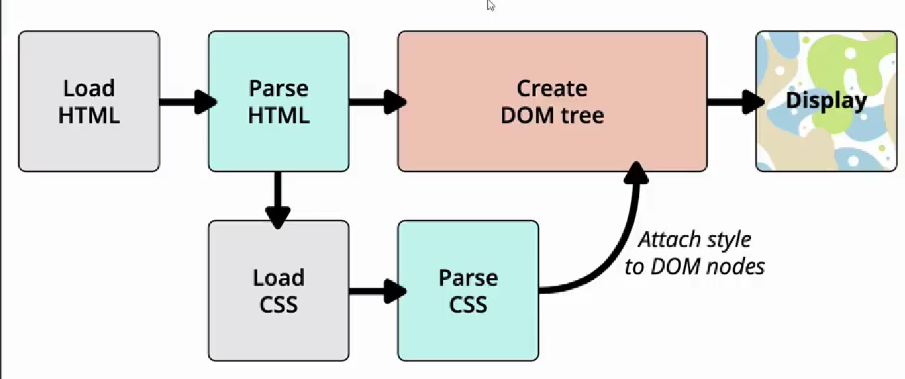
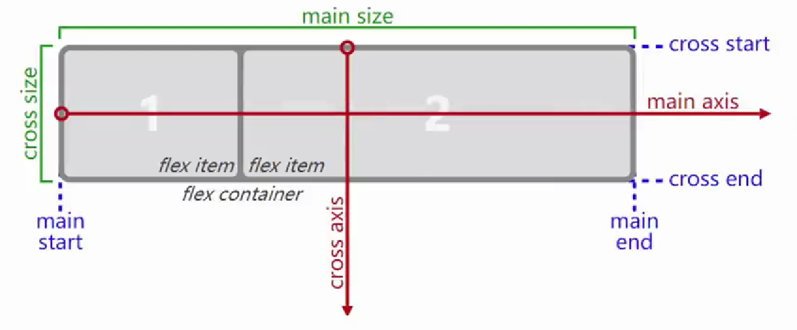
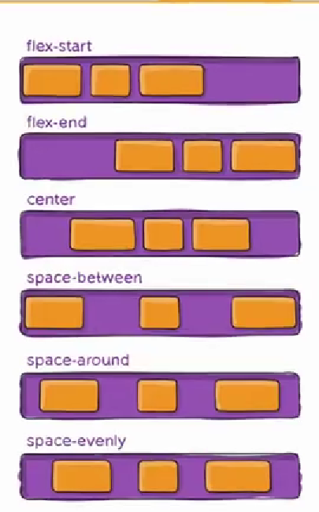
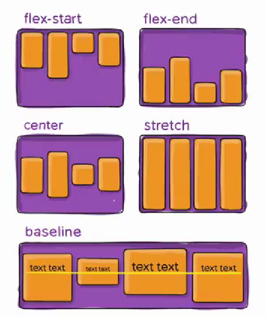
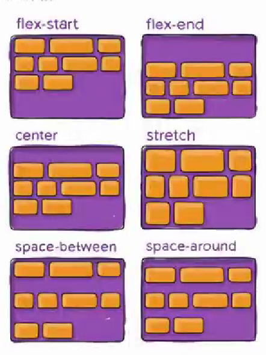

# CSS

css 提供了 3 中方法，可以将 CSs 样式应用到元素上

1.**内联**样式 (inline style)

 - 写在**HTML 元素的 style 属性**中

2.**内部**样式表（internal style sheet)

 - 将 CSS 放在 HTML 文件**<head>元素里的<style>**元素之中

3.**外部**样式表（external style sheet)

 - 将 CSS 编写在一个独立的文件中，并且**通过<link>元素**引入进来

## link 元素

- link 元素是**外部资源链接**元素，规范了**文档与外部资源**的关系

  - link 元素通常在 head 元素中

- 最常用的链接是**样式表(css)**

  - 此外也可以被用来创建**站点图标**(比如"favion"图标)

- **link 元素常见的属性：**

  - **href**：此属性知道被链接资源的 URL。URL 可以是绝对的也可以是相对的。

  - **ref**：知道链接的类型，常见的将链接类型：

    `icon`:站点图标(网站页面头部图标)

    ```css
    <link rel="icon" href="https://pvp.qq.com/favicon.ico">
    ```

    `dns-prefetch`:对一些页面数据进行预加载，用于性能优化(提前从 dns 解析时拿取加载数据)

    stylesheet:CSS 样式:`https://developer.mozilla.org/zh-CN/docs/Web/HTML/Link types`

    > @import
    >
    > 可以在 style 元素或者 CSS 文件中使用@import 导入其他的 CSS 文件

## 浏览器的渲染流程



> 首先浏览器对 HTMl 进行加载然后进行解析(parse)，如果浏览器遇到 CSS 会对 CSS 进行加载(注意：这时候**并不会对 HTML 进行阻塞**)，HTML 这时候任然进行正常解析，解析完成并创建 DOM 树。等 CSS 解析完毕会挂载到 DOM 树上并生成**Render tree** 最后进行成列展示

> 如果有**js 会进行阻塞**，因为 JS 可能会对 HTML 进行操作

## Text 文本属性

- `text-decoration： `**用于设置文字的装饰线**（常用）

  取值

  - **none**:无任何装饰线
    - 可以去除 a 元素默认的下划线
  - **underline**：下划线
  - **overline**：上划线
  - **line-through**:中划线（删除线）

- `text-transform`：**用于设置文字的大小写转换**（不常用）

  取值

  - capitalize:(使首字母大写，资本化的意思)将每个单词的首字符变为大写
  - uppercase：(大写字母)将每个单词的所有字符变为大写
  - lowercase:(小写字母)将每个单词的所有字符变为小写
  - none:没有任何影响

  > 实际开发中使用 Javescript 转化的更多

- `text-indent`：**用于设置第一行内容得到缩进**（不常用）

  - `text-indent:2em`;网刚好是缩进 2 个文字

    > 这里 em 单位相当于是父元素文字的 2 倍大

- `text-align`：**设置文本的对齐方式（重要**）

  **MDN:定义行内内容（例如文字）如何相对它的块父元素对齐：**

  > 上面的 2 个定义都是不准确的,因为`text-align`对 img 图片也是有效的，对块级元素是无效的。
  >
  > 应该是：
  > **text-align 可以对行内块元素设置对齐方式**

  常用的值

  - **left**:左对齐
  - **right**:右对齐
  - **center**:正中间显示
  - **justify**:两端对齐（很少用）

- `letter/word spacing`:分别用于设置字母、单词之间的间距

  - 默认是 0.可以设置为负数

## 字体

- `font-style`:**用于设置文字的常规、斜体显示**
  - norma:常规显示
  - italic(斜体)：用字体的斜体显示（通常会有专门的字体）
  - oblique(倾斜)：文本倾斜显示（仅仅是让文字倾斜）

### line-height

**用来设置一行文本的行高**

严格定义：**两行文字基线（baseline）之间的间距**

> 主要用于文字居中显示（把 line-height 的值设为和容器 height 高度一样即可）

**简单理解：比如有一个 div 高为 100，这时候把文字的 line-hight 设为 100，文字就会居中显示，相当于把这个文字的行高设为了 100，文字永远在中间显示，这样文字就在盒子里居中了**

> ### 两行文字基线之间的间距，等于它的上边距+文字的高度+下边距，正好等于两条基线之间的间距，文字一直都是在中间的所以当你把文字的行高设置于容器高一样时就居中显示了。

### font 缩写属性

- 顺序

  - **font-style font-variant font-weight font-size/line-height font-family**

- 规则-
  - font-style、.font-variant、font-weighti 可以随意调换顺应也可以省略
  - /Iine-height 可以省略，如果不省略，必须跟在 fon-size 后面
  - **font-size、font-family 不可以调换顺序，不可以略**

## CSS 选择器

### 通用选择器

使用 \* 号通配符，可以选中所有的元素

```html
*{}
```

### 属性选择器

- 拥有某一个属性[ attribute] (不常用)

- 属性等于某一值[att=val]

  ```html
  [title] { //也可以直接等于属性名，指定 width: 800px; background-color: #f00; }

  <div title="div ">
    <p>my name is lwy</p>
  </div>
  ```

### 后代选择器

- 一：所有的后代（**直接/间接的后代**）

  - 选择器这几件以**空格**分割

  ```css
  .box1 span {
    color: gray;
  }
  ```

- 二：直接子代选择器（**必须是直接子代**）

  - 选择器之间以 `>` 分割

  ```css
  .box1 > span {
    color: gray;
  }
  ```

### 兄弟选择器

- 一：相邻兄弟选择器、

  - 使用符号`+` 连接

  ```css
  .box1 + .content {
    color: red;
  }
  //这时box1旁边的content会变红色
  ```

- 二：普遍兄弟选择器 `~`

  - 使用 `~`连接

    ```css
      .box1 ~ div {
            color: red;
            box1的所有div兄弟都会变成红色
          }
    ```

### 选择器组-交集选择器

- **交集选择器：需要同时符合两个选择器条件(两个选择器紧密连接)**
  - 在开发中通常为了**精确的选择某一个元素**

```css
  div.box1 {
      即是一个DIV，也必须有一个class为box
      注意中间没有空格
        color: red;
      }
两个选择器类名一样
<div class="box1">6666666</div>
      <p class="box1">哈哈哈哈</p>
```

### 并集选择器

- **符合一个选择器条件即可（两个选择器以`,` 分隔）**
  - 在开发中通常为了给**多个元素设置相同的样式**

```css
body,
div,
p {
  color: aqua;
}
```

### 伪类选择器

> css**伪类**是添加到选择器的关键字，**用于指定所选元素的特殊状态**
>
> 可以说伪类可以对指定的元素进行操作状态。比如苏表悬停时的状态

- 动态伪类

  - `:link`:未访问的链接
  - `:visited`:已访问的链接
  - `:hover`:**鼠标挪动到元素上的状态（重要）**
  - `:active`:激活的链接（鼠标在链接上长按住未松开）
  - `:focus`:指当前**拥有输入焦点的元素**(能接收键盘使用)

- 结构伪类

  `:nth-child(1)`

  - 是父元素中的**第 1 个子元素**

  `:nth-child(2n)  `（n 取值从 0 开始，0，1，2，3，4，5）

  - n 代表任意**正整数和 0**
  - 是父元素中的第偶数个子元素（第 2、4、6、8 个）
  - 跟：nth-child(even)同义

  `:nth-child(2n+ 1)`

  - n 代表任意正整数和 0
  - 是父元素中的第奇数个子元素（第 1、3、5、7.个）
  - 跟：nth-child(odd)同义

  `nth-child(-n +2)`

  - 代表**前 2 个子元素**

  > `:nth-last-child()`的语法跟：nth-child()类似，不同点是：nth-last-child()从最后一个子元素开始往前计数(从后往前)。

  **nth-of-type()用法跟 nth-child()类似**

  - 不同点是**nth-of-type()**计数时只计算**同种类型的元素**

  **nth-last-of-type0 用法跟：nth-of-type()类似**

  - 不同点是：nth-last-of-type()从最后一个这种类型的子元素开始往前计数

  **下面的伪类偶尔会使用：**

  - `：root`,根元素，就是 HTML 元素
  - `：empty`代表里面完全空白的元素

- 否定伪类

  **:not()的格式是：not(x)**

  - X 是一个**简单选择器**
  - 元素选择器、通用选择器、属性选择器、类选择器、选择器、伪类(除否定伪类)

  **:not(x)表示除 x 以外的元素**

### 伪元素（pseudo-elements)

> 伪元素是一个附加至选择器末的关键词，允许你对被选择元素的**特定部分修改样式。**

> 伪元素可以用一个冒号也可以用 2 个，但是为了和伪类区别一般用 2 个冒号：：

- `::first-line`:可以针对**首行文本**设置属性
- `::first-letter`:可以针对**首行字母**设置属性
- `::before`和`::after`:用来在一个元素的**内容之前或之后插入其他内容**(可以是文字、图片)
  - 常通过**content 属性**来为一个元素添加修饰性的内容

> 注意：当你要把元素变成块级元素或行内块时，content 属性是不可以省略的，因为**伪元素是行内级元素**，如果省略则会看不到内容

```html
.item::after {
在实际开发中可以起一个其他的类型，利用类选择器可以起多个类目的特点，实现复用
content: "我是after"; color: red; } .item::before { content: "我是before";
color: orange; }

<div class="box item">伪元素练习</div>
```

### css 继承

css 继承过来的是计算值，而不是设置值（计算值就是父元素设置的那个值)

强制继承：如果你想要元素强制继承父元素的属性可以使用`inherit`

比如

`border:inherit`这样就实现了强制继承

### 选择器的权重

- 按照经验，为了方便比较 CSS 属性的优先级，可以给 CSS 属性所处的环境定义一个权值（权重）
  - !important：10000
  - 内联样式：1000
  - id 选择器：100
  - 类选择、属性选择器、伪类：10
  - 元素选择器、伪元素：1
  - 通配符：0

## 行内替换元素

1.和其他的行内级元素在同一行显示

2.可以设置宽高

> 比如 img 为可替换元素 但是同时拥有 2 个特性 ，说 img 为行内块元素不是很准确的，官方也从来没有说过。

## HTML 元素 4 种隐藏方法

- 方法一：**display 设置为 none**
  - 元素不显示出来，并且也不占据位置，**不占据任何空间（和不存在一样）：**
- 方法二：**visibility 设置为 hidden**
  - 设置为 hidden,虽然元素不可见，但是**会占据元素应该占据的空间**：
  - 默认为 visible,元素是可见的：
- 方法三：**color:rgba 设置颜色，将 a 的值设置为 0**
  - rgba 的 a 设置的是 alpha 值，可以设置透明度，**不影响子元素**(只是字体或者背景透明：**单一**)
  - **a 的值范围是 0~1**
- 方法四：**opacity 设置透明度，设置为 0**
  - 设置整个元素的透明度，**会影响所有的子元素，**（字体背景都会变成透明：**全部**）

## Overflow

- **ovrflow 用于控制内容溢出时的行为**
  - **visible**:溢出的内容照样可见
  - **hidden**:溢出的内容直接裁剪
  - **scroll**:溢出的内容被裁剪，但可以通过滚动机制查看
    - 会一直显示滚动条区域，滚动条区域占用的空间属于 width、height
  - **auto**:自动根据内容是否益出来决定是否提供滚动机制

## 盒子模型

### 上下 margin 的传递（父子元素）

- **margin-top 传递**
  - 如果**块级元素的顶部线和父元素的顶部线重叠**，那么**这个块级元素的 margin-top 值会传递给父元素**
- **margin-bottom 传递**
  - **如果块级元素的底部线和父元素的底部线重写，并且父元素的高度是 auto**,那么**这个块级元素的 margin-bottom 值会传递给父元素**
- **如何防止出现传递间题？**
  - 给**父元素设置 padding-top\padding-bottom**
  - 给**父元素设置 border**
  - 触发 BFC:**设置 overflow 为 auto**
- 建议
  - **margin**一般是用来设置**兄弟元素之间**的间距
  - **padding**一般是用来设置**父子元素之间**的间距

### 上下 margin 的重叠

- **垂直方向（上下）上相邻的 2 个 margin(margin-top、margin-bottom)有可能会合并为 1 个 margin,这种现象叫做 collapse(折叠)**
- **水平（左右）方向上的 margin(margin-left.margin-right)永远不会 collapse**
- 折叠后最终值的计算规则
- 两个值进行比较，**取较大的值**
- 如何防止 margin collapse?
  - **只设置其中一个元素的 margin**

情况

1.**两个兄弟元素**之间**上下 margin 的折叠**

2.**父子块级元素**之间**margin 的折叠**(这种情况很少，一般都设置 padding)

```html
.box { margin-bottom: 30px; } .content { margin-top: 50px;
这里最大值50px生效，而不是相加等于80px，只有上下垂直时才会发生重叠 }
<div class="box"></div>
<div class="content"></div>
```

### 元素的水平居中方案

- 块级元素，有宽度

给块级元素 margin 设置为：0 auto 可以实现水平居中。

```css
/* 把上下固定，左右给个auto浏览器会自动平均分配 */
margin: 0 auto;
```

> 还可以用定位，flex 布局等

- 行内级元素
  - 水平居中：在父元素中设置：`text-align:center`

### 外轮廓-Outline

- outline:表示元素的外轮廓

  - 不占用空间
  - 默认显示在 border 的外面

- 和 border 的属性类似

- 应用实例

  - ### **去除 a 元素、input 元素的 focus 轮廓效果**

```css
 a {
     使用none去掉轮廓效果
        outline: none;
      }
```

### 盒子阴影-box-shadow

- box-shadow 属性可以设置一个或者多个阴影

  - 每个阴影用<shadow>表示
  - 多个阴影之间用逗号隔开，从前到后叠加

- <shadow>的常见格式如下

  none.L<shadow># <shadow>inset?&slength{2,4})&8olor>

  - 第 1 个<length>:**offset-x**,水平方向的偏移，正数往右偏移
  - 第 2 个<length>;**offset-y**,垂直方向的偏移，正数往下偏移
  - 第 3 个<length>;**blur-radius**,,模糊半径
  - 第 4 个<length>:**spread-radius**,延伸半径
  - <color>:**阴影的颜色**，如果没有设置，就跟随 color 属性的颜色

```css
  box-shadow: 5px 5px 10px red, 10px 10px 10px green;
x轴，y轴，blur模糊度,color颜色，以逗号分开可以设置多个阴影
```

> text-shadow 实现和 box-shadow 差不多，只是少了 spread-radius

### 行内非替换元素的注意事项

行内元素

- 以下属性对行内级非替换元素不起作用
  - width、height、margin-top、margin-bottom
- 以下属性对行内级非替换元素的效果比较特殊
  - padding-top、padding-bottom、上下方向的 border

> **行内非替换元素对盒子模型的 margin,padding,border 的上下设置是不生效的，不占据空间，对左右位置是生效的，占据空间**。

## CSS 属性-box-sizing

- **box-sizing 用来设置盒子模型中宽高的行为**
- **content-box**
  - padding、.border 都布置在 width、height 外边（**宽高不包含 border/padding**）
- **border-box**
  - padding、border 都布置在 width、height 里边(**宽高包含 border/padding**)

> content-box 相当于是标准盒模型是 box-sizing 的默认，border--box 相当于把盒子设置成了怪异盒模型又叫 IE 盒模型

**标准盒模型**：**盒子的 width/height=内容的宽高度**。不包括 border/padding。如果设置了 border/padding**盒子会被撑大.**

**怪异盒模型(IE 盒模型)**: **盒子的 width/height = border + padding + 内容的宽度**.无论 border/padding 设置多少它都会被加到盒子的 width/height 里，**盒子不会被撑大**

## border 实现三角形代码

```css
 .box {
        width: 100px;
        height: 100px;
          //边框都为透明 4个边框个占宽高的一般
        border: 50px solid transparent;
值设置一个上边框，把size设置为盒子高度一般这样上边框的高度就站一般就是个三角形了
        border-top: 50px solid red;

        box-sizing: border-box;
      }
```

## 网络字体

### web fonts 的工作原理

- 1.fonts 获取到想要的字体
- 2.在 css 种使用字体 html/css/javeScript/img/fonts
- 3.将所有的资源一起部署到服务器

### 使用 web fonts

- 第一步：在字体天下网站下载一个字体
  - https://www.fonts.net.cn/fonts-zh-1.html
  - 默认下载下来的是 ttf 文件
- 第二步：使用字体：
  - 使用过程如下：
    - 1 将字体放到对应的目录中
    - 2 通过**@font-face**来引入字体，并且设置格式
    - 3.使用字体
- 注意：**@font-face 用于加载一个自定义的字体**

```css
<style>
      /* 将这个字体引入到网页中 */
      @font-face {
        font-family: "lwy";
        src: url("./fonts/TianShiYanTiDaZiKu-1.ttf");
      }
      /* 指定元素使用引入的字体 */
      .box {
        font-family: "lwy";
      }
    </style>
  </head>
  <body>
    <div class="box">我是div元素</div>
  </body>
```

### 字体图标

- 字体图标的好处：
  - 放大不会失真
  - 可以任意切换颜色
  - 用到很多个图标时，文件相对图片较小
- 字体图标的使用：
  - 登录阿里 icons(https/ww.iconfont.cn/)
  - 下载代码，并且拷贝到项目中
- 将字体文件和默认的 css 文件导入到项目中

```css
 //导入      href为下载的代码路径
<link rel="stylesheet" href="./iconfonts/iconfont.css" />

//使用
<i class="iconfont icon-music2"></i>
```

## 精灵图 css Sprite

- **什么是 CSS Sprite**
  - 是一种**CSS 图像合成技术**，将**各种小图片合并到一张图片**上，然后**利用 CSS 的背景定位来显示对应的图片部分**
  - 有人翻泽为：**CSS 雪碧、CSS 精灵**
- 使用 CSS Sprite 的好处
  - 减少网页的**http 请求数量，加快网页响应速度，减轻服务器压力**
  - 减小**图片总大小**
  - 解决了**图片命名的困扰**，只需要针对一张集合的图片命名
- Sprite 图片制作（雪碧图、精灵图）
  - 方法 1：Photoshop,设计人员提供
  - 方法 2：https./www.toptal.com/developers/css/sprite-generator

## Position 定位

### 相对定位(relative)

- **并未脱离正常文档流，不改变页面布局**，使用 top,right,bottom,left,进行移动，未定位时的位置留下空白**,相对于原来的位置进行移动**。
- 应用场景：对元素位置进行微调

### 绝对定位(absolute)

- **元素会被移出正常文档流，并不为元素预留空间**，通过指定元素**相对于最近的非 static（标准文档流） 定位祖先元素的偏移，来确定元素位置，如果没有找到这样的祖先元素，参照对象是视口**。绝对定位的元素可以设置外边距（margins），且不会与其他边距合并。

  > 以最近的定位元素为参照对象，进行偏移

  ### 固定定位(Fixed)

- **元素会被移出正常文档流，并不为元素预留空间，而是通过指定元素相对于屏幕视口（viewport）的位置来指定元素位置。**元素的位置在屏幕滚动时不会改变。打印时，元素会出现在的每页的固定位置。`fixed` 属性会创建新的层叠上下文。当元素祖先的 `transform`、`perspective`、`filter` 或 `backdrop-filter` 属性非 `none` 时，容器由视口改为该祖先。

### 脱离正常文档流(absolute/fixed)元素的特点(一)

- **可以随意设置宽高**
- **宽高默认由内容决定**
- **不再受标准流的钓束**
  - 不再**严格按照从上到下、从左到右**排布
  - 不再**严格区分块级(block)、行内级(inline),行内块级(inline-blck)的很多特性**都会消失
- **不再给父元素汇报宽高数据(它的宽高影响不了父元素)**
- **脱标元素内部默认还是按照标准流布局**

### 脱离正常文档流(absolute/fixed)元素的特点(二)

- **绝对定位元素(absolutely positioned element)**

  - position 值为**absolute**或者**fixed**的元素

- **对于绝对定位元素来说**

  - 定位参照对象的宽度=**left+right+margin-left+margin-right+绝对定位元素的实际占用宽度**
  - 定位参照对象的高度=**top+bottom+margin-top+margin-bottom+绝对定位元素的实际占用高度**

- **如果希望绝对定位元素的宽高和定位参照对象一样。可以给绝对定位元素设置以下属性**

  - left0、right0、top:0、bottom:0、margin:0

    > 相当于与参照对象距离为 0，完全撑起

- **如果希望绝对定位元素在定位参照对象中居中显示，可以给绝对定位元素设置以下属性**

  - left0、right:0、top:0、bottom:0、margin:auto

    > 相当于上下左右都为 0**,margin 的值浏览器会自动等分上下左右就实现了居中**

  - 另外，还得设置具体的宽高值（宽高小于定位参照对象的宽高）

```css
  .box {
        background-color: #f00;
        width: 400px;
        height: 400px;
        position: relative;
      }

      .box1 {
        width: 200px;
        height: 200px;
        background-color: green;
        position: absolute;
        bottom: 0;
        right: 0;
        left: 0;
        top: 0;
        //这里位置公式相当于  margin的位置自动被浏览器处理
        宽 ： 400=0+0+ml:auto+mr:auto
        高 ： 400=0+0+mt:auto+ml:auto
        margin: auto;
      }
<div class="box">
      <div class="box1"></div>
    </div>
```

### auto 效果总结

- width:auto
  - 1.行内非替换元素：width 包裹的内容
  - 2.块级元素：width：包含块的宽度
  - 3.绝对定位元素：width:包裹内容

### 粘性定位—sticky

- 可以看做是**相对定位和固定（绝对）定位的结合体：**
- 它允许被定位的元素**表现得像相对定位一样**，直到它滚动到某个阈值点：
- 当**达到这个阈值点**时，就会**变成固定绝对定位：**

> sticky:是相对于最近的滚动祖先包含滚动视口的位置(the nearest ancestor scroll container's scrollport)

### Z-index

- z-index 属性用来设置定位元素的**层叠顺序**（仅对足位元素有效）
  - 取值可以是**正整数、负整数、0**
- 比较原则
  - 如果是**兄弟关系**
    - **z-index 越大，层叠在越上面**
    - **z-index 相等，写在后面的那个元素层叠在上**
  - 如果**不是兄弟关系**
    - 各自**从元素自己以及祖先元素中，找出最邻近的 2 个定位元素进行比较**
    - 而且**这 2 个定位元素必须有设置 z-index 的具体数值**

## float 浮动

- float 属性可以指定一个元素应**沿其容器的左**侧或**右侧**放置，允许**文本和内联元素环绕它。**
  - float 属性最初只用于在一段文本内**浮动图像，实现文字环绕的效果，**
  - 但是早期的 CSS标准中并没有提供好的**左右布局方案**，因此在一段时间里面它成为**网页多列布局的最常用工具：**
- **绝对定位、浮动都会让元素脱离标准流，以达到灵活布局的效果**
- **可以通 float 属性让元素产生浮动效果，float 的常用取值**
  - **none**:不浮动，默认值
  - **left**:向左浮动
  - **right**:向右浮动

### 浮动规则

- **元素一旦浮动后，脱离标准流**
  - **朝着向左或向右方向移动**，直到**自己的边界紧贴着包含块**（一般是父元素）或者**其他浮动元素的边界**为止
  - **定位元素会层叠在浮动元素上面**
- **浮动元素不能与行内级内容层叠，行内级内容将会被浮动元素推出**
  - 比如行内级元素、inline-block 元素、块级元素的文字内容

> 可以实现图文混排的效果，**脱离标准流之后，子元素不会给父元素汇报高度**

- **行内级元素、inline-block 元素浮动后，其顶部将与所在行的顶部对齐**

### **将多个行内级元素中间的空格（间隙）去除的方法**

- 1.删除换行符(不推荐)
- **2.将父级元素的 font-size 设置为 0，但是需要子元素设置回来**
- **3.通过子元素(span)统一向一个方向浮动即可**
- 4.flex 布局

### 布局一行宽度不够，放不下的解决方案

```css
 .box {
        /* 把box值设置为－值，相当于wrap容器的宽度变成了
         盒子的宽度=ml+mr+容器的width 这时候容器的mr=-10
         所以1190=1200-10   容器的width会变成1200,这样相当于，box的宽度为1200了，这样就可以放下
        */
        margin-right: -10px;
      }
 <div class="wrap">
      <div class="box">
        <div class="item item1">1</div>
        <div class="item item2">2</div>
        <div class="item item3">3</div>
        <div class="item item4">4</div>
        <div class="item item5">5</div>
      </div>
    </div>
```

### 浮动的问题 – 高度塌陷

- 由于浮动元素脱离了标准流，变成了**脱标元素**，所以**不再向父元素汇报高度**
  - 父元素**计算总高度**时，就**不会计算浮动子元素的高度**，导致了**高度坍塌**的问题
- 解决父元素高度坍塌问题的过程，一般叫做**清浮动（清理浮动、清除浮动）**
- 清浮动的目的是
  - 让**父元素计算总高度的时候**，把**浮动子元素的高度算进去**

#### CSS 属性 - clear

- clear 属性可以指定一个元素**是否必须移动**(清除浮动后)**到在它之前的浮动元素**下面;

  #### 常用取值

  - **left**：要求元素的顶部低于之前生成的所有左浮动元素的底部**(清除左浮动)**
  - **right**：要求元素的顶部低于之前生成的所有右浮动元素的底部**(清除右浮动)**
  - **both**：要求元素的顶部低于之前生成的所有浮动元素的底部**(清除全部)**
  - **none**：默认值，无特殊要求

#### 清除浮动的方法

- 方法一: 给父元素设置固定高度
  - 扩展性不好（不推荐）
- 方法二: 在父元素最后增加一个空的块级子元素，并且让它设置 clear: both
- 会增加很多无意义的空标签，维护麻烦
- 违反了结构与样式分离的原则（不推荐）
- 方法三: **给父元素添加一个伪元素**
  - 推荐;
  - 编写好后可以轻松实现清除浮动
- **给父元素增加::after 伪元素**
- 纯 CSS 样式解决，结构与样式分离（推荐）

```css
.clear-fix::after{
    content:""
display:block;
clear:both;
visibility:hidden;/*,浏览器兼容性.*/
height:0; /*,划览器兼容性.*/
}
.clear-fix{
    *Z00m:·1;/*.IE6/7兼容性.*/
}
```

## Flex 布局

- 两个重要的概念：
  - 开启了 flex 布局的元素叫**flex container(开启了 flex 的盒子)**
  - flex container 里面的直接子元素叫做**flex item(盒子里的每一项)**
- **当 flex container 中的子元素变成了 flex item 时，具备一下特点：**
  - flex item 的布局将**受 flex container 属性的设置来进行控制和布局：**
  - flex item.**不再严格区分块级元素和行内级元素：**
  - flex item**默认情况下是包裹内容**的，**但是可以设置宽度和高度：**
- **设置 display 属性为 flex 或者 inline-flex 可以成为 flex container**
  - **flex**:flex container 以**block-level(块级元素)**形式存在
  - **inline-flex**:flex container 以**inline-level(行内级元素）**形式存在

### flex 布局模型



> 左右为主轴，上下交叉轴

### 属性

- 应用在**flex container**上的 CSS 属性

  - flex-flow

    - **flex-flow 属性是 flex-direction 和 flex-wrap 的简写。**
      - 顺序任何，并且都可以省略：

  - **flex-direction(决定了主轴的方向)**

    - **flex items 默认都是沿着 main axis(主轴)从 main start 开始往 main end 方向排布**
      - **flex-dierction**决定了**main axis 的方向**，有 4 个取值
      - **row(默认值,主轴从左到右排列)**、**row-reverse(主轴从右到左排列)**、**column(交叉轴变为主轴）**、**column-reverse(从下到上排列)**

  - **flex-wrap(换行)**

    - **flex-wrap 决定了 flex container 是单行还是多行**
      - **nowrap**(默认)：单行
      - **wrap**:多行
      - wrap-reverse(**对交叉轴方向进行反转并多行**):多行（对比 wrap,**cross start 与 cross end 相反**）

  - **justify-content(决定主轴对齐方式)**

    - **justify-content 决定了 flex items 在 main axis 上的对齐方式**
      - **flex-start**(默认值)：与 main start 对齐
      - **flex-end**:与 main end 对齐
      - **center**:居中对齐
      - **space-between**:
        - flex items 之间的距离相等
        - 与 main start、main end**两端对齐**
      - **space-around**:
        - flex items 之间的距离相等
        - **flex items 与 main start、main end 之间的距离是 flex items 之间距离的一半**
      - **space-evenly:**
        - flex items 之间的距离相等
        - **flex items 与 main start、main end 之间的距离等于 flex items 之间的距离**

    

  - **align-items(决定交叉轴的对齐方式,单行时使用)**

    - a**lign-items 决定了 flex items 在 cross axis 上的对齐方式**
      - normal::在弹性布局中，效果和 stretch 一样
      - stretch:当 flex items 在 cross axis 方向的 size 为 auto 时**(宽为 auto 时)**，会自动拉伸至填充 flex container
      - flex-start:与 cross start 对齐
      - flex-end:与 cross end 对齐
      - **center**:居中对齐
      - baseline:与基准线对齐

    

  - **align-content(决定了多行有剩余空间时，交叉轴的对齐方式)**

    - **align-content 决定了多行 flex items 在 cross axis 上的对齐方式，用法与 justify-content 类似**

      

- 应用在**flex items**上的 CSS 属性

  - flex-grow
    - **flex-grow 决定了 flex items 如何扩展(拉伸/成长)**
      - 可以设置**任意非负数字（正小数、正整数、0），默认值是 0**
      - 当 flex container 在 main axis 方向上有**剩余 size** 时，**flex-grow 属性才会有效**
    - 如果所有 flex items 的 flex-grow **总和 sum 超过 1**，每个 flex item 扩展的 size 为
      - flex container 的剩余 size \* flex-grow / sum**（剩余 size 根据总和分成等比例大小对各个 item 的 flex-grow 的值进行分布，**）
  - flex-basis
    - flex-basis 用来设置 flex items 在 main axis 方向上的 base size
      - auto（默认值）、具体的宽度数值（100px）
  - flex-shrink
    - **flex-shrink 决定了 flex items 如何收缩(缩小)**
    - 使用方法与 flex-grow 类似
  - order(顺序)
    - **order 决定了 flex items 的排布顺序**
      - 可以设置**任意整数**（正整数、负整数、0），**值越小就越排在前面**
      - 默认值是 0
  - **align-self(单独为 item 设置交叉轴的对齐方式)**
    - **flex items 可以通过 align-self 覆盖 flex container 设置的 align-items**
      - **auto**（默认值）：遵从 flex container 的 align-items 设置
      - **stretch、flex-start、flex-end、center、baseline**，效果跟 **align-items** 一致
  - flex
    - flex 是 flex-grow || flex-shrink || flex-basis 的简写,flex 属性可以指定 1 个，2 个或 3 个值。
      - 第一个无单位数 flex-grow,第二个无单位 flex-shrink,第三个值必须为一个有效的宽度值 flex-basis

## css 属性-transform

- **CSS transform.属性允许对某一个元素进行某些形变**，包括**旋转，缩放，倾斜或平移**等。

- transform 是**形变**的意思，transformeri 就是变形金刚；

- 注意事项，**并非所有的盒子都可以进行 transform 的转换（通常行内级元素不能进行形变）**

- 所以，transform 对于**行内级非替换元素是无效的：**

  - 比如对 span、a 元素等；

  #### 属性语法

  transform:function()

  > 后面跟的是一个个函数

- **常见的函数 transform function 有：**

  - **平移**：translate(x,y)
  - **缩放**：scale(x,y)
  - **旋转**：rotate(deg)
  - **倾斜**：skew(deg,deg)

    上面的几个函数，我们可以改变某个元素的形变

### 位移 - translate

- **-平移：translate(x, y)**
  - 这个 CSS 函数用于移动元素在平面上的位置。
  - translate 本身可以表示翻译的意思，在物理上也可以表示平移；
- 值类型：
  - **数字**：100px
  - **百分比**：参照元素本身(refer to the size of bounding box)
- **translate 的百分比可以完成一个元素的水平和垂直居中**

```css
.item {
  height: 120px;
  width: 120px;
  background-color: blue;
  position: relative;
  /* 向下位移父元素的50% */
  top: 50%;
  /* 使元素向上位移自身宽度的50%，实现了垂直居中 */
  transform: translate(0, -50%);
}
```

### 缩放 - scale

- **缩放：scale(x, y)**

  - scale() CSS 函数可改变元素的大小。

- **值类型：**

  - 数字：

    - **1**：保持不变
    - **2**：放大一倍
    - **0.5**：缩小一半

    > **小于 1 缩放，大于 1 扩大**

  - 百分比：百分比不常用(依照以前的宽高进行缩放，扩大)

### 旋转 - rotate

- **旋转：rotate(<angle>)**
- 值个数
  - 一个值时，表示旋转的角度(**deg**)
- 值类型：
  - **常用单位 deg**：旋转的角度（ degrees ）
  - 正数为顺时针
  - 负数为逆时针

### transform-origin

- **transform-origin：形变的原点**
  - 比如在进行 scale 缩放或者 rotate 旋转时，都会有一个原点。
- 一个值：
  - 设置 x 轴的原点
- 两个值：
- 设置 x 轴和 y 轴的原点
- **必须是<length>,<percentage>或 <left>, center, right, top, bottom 关键字中的一个**
- left, center, right, top, bottom 关键字
- length：从左上角开始计算(px)
- 百分比：参考元素本身大小

### 倾斜 - skew

- 倾斜：skew(x, y)
  - **函数定义了一个元素在二维平面上的倾斜转换。**
- 值类型：
  - deg：倾斜的角度
  - 正数为顺时针
  - 负数为逆时针
- **注意：倾斜的原点受 transform-origin 的影响**

> transform，它是可以设置多个 transform-function 的：

```css
.item:hover {
  transform: scale(0.5) rotate(45deg) translate(100px);
}
```

## 过渡动画 - transition

- **什么是 transition 动画呢？**
  - CSS transitions 提供了一种在更改**CSS 属性时**控制**动画速度的方法**。
  - 可以让 CSS 属性变化成为一个**持续一段时间的过程**，而**不是立即生效**的；
  - 比如将一个元素**从一个位置移动到另外一个位置**，默认在修改完 CSS 属性后会立即生效；
  - 但是我们可以通过 CSS transition，让**这个过程加上一定的动画效果**，包括**一定的曲线速率变化；**
- **通常将两个状态之间的过渡称为隐式过渡（implicit transitions），因为开始与结束之间的状态由浏览器决定。**
- **CSS transitions 可以决定**
  - 哪些属性发生动画效果 (明确地列出这些**属性**)
  - 何时开始 (设置 **delay**）
  - 持续多久 (设置 **duration**)
  - 如何动画 (定义 timing function，比如匀速地或先快后慢)。
- transition CSS 属性是 **transition-property，transition-duration，transition-timing-function 和 transition-delay 的一个简写属性。**
- **transition-property**：指定应用过渡属性的名称
  - all：所有属性都执行动画；
  - none：所有属性都不执行动画；
  - CSS 属性名称：要执行动画的 CSS 属性名称，比如 width、left、transform 等；
- **transition-duration**：指定过渡动画所需的时间
  - 单位可以是秒（s）或毫秒（ms）
- **transition-timing-function**：指定动画的变化曲线
- https://developer.mozilla.org/zh-CN/docs/Web/CSS/transition-timing-function
- **transition-delay**：指定过渡动画执行之前的等待时间

```css
 .box {
        width: 100px;
        height: 100px;
        background-color: #f00;
    简写属性
        transition: all 1s ease-in 2s;
      }
      .box:hover {
        width: 200px;
        height: 200px;
        background-color: orange;
        transform: translate(200px);
      }
```

## CSS Animation

- 过度动画的缺点
  - transition**只能定义开始状态和结束状态**，不能定义中间状态，也就是说只有两个状态；
  - transition**不能重复执行**，除非一再触发动画；
  - transition 需要在**特定状态下会触发才能执行**，比如某个属性被修改了；
- 如果我们希望可以有更多状态的变化，我们可以使用**CSS Animation**。
- **CSS Animation 的使用分成两个步骤：**
  - **步骤一**：使用 keyframes 定义动画序列（每一帧动画如何执行）
  - **步骤二**：配置动画执行的名称、持续时间、动画曲线、延迟、执行次数、方向等等

### @keyframes 规则

- **可以使用@keyframes 来定义多个变化状态，并且使用 animation-name 来声明匹配：**
  - 关键帧使用**percentage**来指定动画发生的时间点；
  - **0%**表示动画的第一时刻，**100%**表示动画的最终时刻；
  - 因为这两个时间点十分重要，所以还有特殊的别名：**from 和 to**；
- **也就是说可以使用 from 和 to 关键字**
  - from 相当于 0%
  - to 相当于 100%

### animation 属性

- CSS animation 属性是 **animation-name，animation-duration, animation-timing-function，animation-delay，animationiteration-count，animation-direction，animation-fill-mode 和 animation-play-state 属性的一个简写属性形式。**
  - a**nimation-name**：指定执行哪一个关键帧动画
  - **animation-duration**：指定动画的持续时间
  - **animation-timing-function**：指定动画的变化曲线
  - **animation-delay**：指定延迟执行的时间
  - **animation-iteration-count**：指定动画执行的次数，执行 infinite 表示无限动画
  - **animation-direction**：指定方向，常用值 normal 和 reverse
  - **animation-fill-mode**：执行动画最后保留哪一个值
    - none：回到没有执行动画的位置
    - forwards：动画最后一帧的位置
    - backwards：动画第一帧的位置
  - **animation-play-state**：指定动画运行或者暂停（在 JavaScript 中使用，用于暂停动画）

```css
 .box {
        width: 100px;
        height: 100px;
        background-color: #f00;
         animation的简写属性
        animation: moveAnim 2s ease-in-out 2s 2 forwards;
      }
       //定义关键帧
      @keyframes moveAnim {
        0% {
          transform: translate(0, 0) scale(0.5, 0.5) rotate(45deg);
        }
        33% {
          transform: translate(0, 200px) scale(1, 1) rotate(45deg);
        }
        66% {
          transform: translate(200px, 200px) scale(0.5, 0.5) rotate(45deg);
        }
        100% {
          transform: translate(200px, 0) scale(0.5, 0.5) rotate(45deg);
        }
      }
```

## 深入理解 vertical-align – line boxes

- 官方文档的翻译：vertical-align 会影响 **行内块级元素** 在一个 **行盒(由内容每一行行高的高度)** 中垂直方向的位置

- **思考：一个 div 没有设置高度的时候，会不会有高度？**

- 没有内容，没有高度
- 有内容，内容撑起来高度

- **但是内容撑起来高度的本质是什么呢？**

  - 内容有行高（line-height），撑起来了 div 的高度

- 行高为什么可以撑起 div 的高度？

  - 这是因为**line boxes**的存在，并且 line-boxes 有一个特性，包裹每行的 inline level
  - 而其中的文字是有行高的，必须将整个行高包裹进去，才算包裹这个 line-level

- **那么，进一步思考：**

  - 如果这个 div 中有图片，文字，inline-block，甚至他们设置了 margin 这些属性呢？

  > 如果一行里有文字，图片，行内级盒子，那么图片和盒子会离底部有几个像素，这是因为 vertical-align 默认是 baseline 对齐的，所以盒子与图片默认与文字的基线对齐，就会造底部有多余的间隙问题

- **结论：line-boxes 一定会想办法包裹住当前行中所有的内容。**

- **但是，但是为什么对齐方式千奇百怪呢？**

  - 你认为的千奇百怪，其实有它的内在规律
  - 答案就是**baseline**对齐

- 我们来看官方 vertical-align 的默认值：没错，就是 baseline

- **但是 baseline 都是谁呢？**

- 文本的 baseline 是字母 x 的下方
- Inline-block 默认的 baseline 是 margin-bottom 的底部（没有，就是盒子的底部）
- Inline-block 有文本时，baseline 是最后一行文本的 的下方

- **一切都解释通了**

- **现在，对于不同的取值就非常容易理解了**

  - **baseline**(默认值)：基线对齐（你得先明白什么是基线）
  - **top**：把行内级盒子的顶部跟 line boxes 顶部对齐
  - **middle**：行内级盒子的中心点与父盒基线加上 x-height 一半的线对齐
  - **bottom**：把行内级盒子的底部跟 line box 底部对齐
  - <percentage>：把行内级盒子提升或者下降一段距离（距离相对于 line-height 计算\元素高度）， 0%意味着同 baseline 一样
  - <length>：把行内级盒子提升或者下降一段距离，0cm 意味着同 baseline 一样

- **解决图片下边缘的间隙方法**:

  - **方法一: 设置成 top/middle/bottom**
  - **方法二: 将图片设置为 block 元素**

> **vertical 用来设置行内级元素的对齐方式，默认是 baseline 对齐，这样会造成设置图片和盒子时，底部会留有间隙是为了与文字的基线对齐，当我们遇到这种现象时，我们可以把元素变成 block 元素，因为会独占一行，这样就不会与文字基线对齐了，还可以使 vertical-align 更改对齐方式为 top/middle/bottom**

> 一个文字的行高由上边距+内容+下边距组成，内容底部为 baseline

## meta 元素

- **meta 元素用于定义元数据：**
  - head 中用于**定义元数据**；
  - 比如标题 title、样式 style、link 外部资源等；
  - meta 用于定义那些不能使用其他定元相关（meta-related）元素定义的任何元数据信息；
- **meta 元素定义的元数据的类型包括以下几种：**
  - 如果设置了 **charset** 属性，meta 元素是一个字符集声明，告诉文档使用哪种字符编码。
  - 如果设置了 **http-equiv** 属性，meta 元素则是编译指令。
  - 如果设置了 **name** 属性，meta 元素提供的是文档级别（document-level）的元数据，应用于整个页面。

### meta 元素的 http-equiv 属性

- 告知 IE 浏览器去模仿哪一个浏览器的行为；
  - IE=edge，告知 IE8 区使用最高有效模式来模仿

```css
<meta
http-equiv="X-UA-Compatible"content="IE=edge">
```

### meta 元素的 name 属性

- name 属性的值非常多，具体的内容可以查看文档：
  - https://developer.mozilla.org/zh-CN/docs/Web/HTML/Element/meta/name
- 我们介绍几个常用的：
  - **robots**：爬虫、协作搜寻器，或者 “机器人”，对此页面的处理行为，或者说，应当遵守的规则。
  - **author**：文档作者的名字。
  - **Copyright**：版权声明；
  - **description**：一段简短而精确的、对页面内容的描述。
    - 一些浏览器，比如 Firefox 和 Opera，将其用作书签的默认描述。
  - **keywords**：与页面内容相关的关键词，使用逗号分隔。某些搜索引擎会进行收录；

## CSS 样式的字符编码

- **之前我们有制定过 HTML 页面的编码，但是并没有制定 CSS 样式的编码**。
  - 那么 CSS 样式的字符编码会按照什么规则来使用呢？
- **在样式表中有多种方法去声明字符编码，浏览器会按照以下顺序尝试下边的方法（一旦找到就停止并得出结果）：**
  - 1.文件的开头的 Unicode byte-order（字节顺序标记） 字符值。
    - https://en.wikipedia.org/wiki/Byte_order_mark
  - 2.由 Content-Type：HTTP header 中的 charset 属性给出的值或用于提供样式表的协议中的等效值。
  - 3.CSS @规则 @charset。
  - 4.使用参考文档定义的字符编码： 元素的 charset 属性。
    - 该方法在 HTML5 标准中已废除，无法使用。
  - 5.假设文档是 UTF-8。
- 开发中推荐在 CSS 的开头编写@charset 指定编码：

```css
@charset "UTF-8";
```

## CSS 属性 - white-space

- **white-space 用于设置空白处理和换行规则**
  - normal：合并所有连续的空白，**允许**单词超屏时自动换行
  - **nowrap**：合并所有连续的空白，**不允许**单词超屏时自动换行
  - pre：阻止合并所有连续的空白，**不允许**单词超屏时自动换行
  - pre-wrap：阻止合并所有连续的空白，**允许**单词超屏时自动换行
  - pre-line：合并所有连续的空白（但保留换行），**允许**单词超屏时自动换行

## CSS 属性 - text-overflow

- **text-overflow 通常用来设置文字溢出时的行为**

  - **clip**：溢出的内容直接裁剪掉（字符可能会显示不完整）
  - **ellipsis**：溢出那行的结尾处用省略号表示

- text-overflow 生效的前提是 overflow**不为 visible**

- 常见的是将 white-space、text-overflow、overflow 一起使用

  ```css
  white-space: nowrap;
  text-overflow: ellipsis;
  overflow: hidden;
  ```

## CSS 中的函数

- **在前面我们有使用过很多个 CSS 函数:**
  - 比如**rgb/rgba/translate/rotate/scale**等;
  - CSS 函数通常可以帮助我们**更加灵活**的来编写**样式的值；**
- 下**面我们再学习几个非常好用的 CSS 函数:**
  - **var**: 使用 CSS 定义的变量;
  - **calc**: 计算 CSS 值, 通常用于计算元素的大小或位置;
  - **blur**: 毛玻璃(高斯模糊)效果;
  - **gradient**：颜色渐变函数；

### CSS 函数 - var

- **CSS 中可以自定义属性**
- **属性名**需要以**两个减号（--）**开始;
- **属性值**则可以是**任何有效的 CSS 值;**

```css
html {
  --main-color: #f00;
}
```

- **我们可以通过 var 函数来使用:**

```css
.box {
  color: var(--main-color);
}
```

- **规则集定义的选择器, 是自定义属性的可见作用域(只在选择器内部有效)**
  - 所以推荐将**自定义属性定义在 html 中**，也可以使用 **:root 选择器;**

### CSS 函数 -calc

- **calc() 函数允许在声明 CSS 属性值时执行一些计算。**
  - 计算支持**加减乘除**的运算；
    - +和 - 运算符的**两边必须要有空白字符。**
  - 通常用来**设置一些元素的尺寸或者位置；**

```css
box container2 {
  display: inline-block;
  width: calc(100%-60px);
  height: 100px;
  background-color: #00f;
}
```

### CSS 函数 - blur

- blur() 函数将**高斯模糊**应用于输出图片或者元素;
- **blur(radius)**
- **radius**, 模糊的半径, 用于定义高斯函数的偏差值, 偏差值越大, 图片越模糊;
- **通常会和两个属性一起使用：**
- **filter**: 将模糊或颜色偏移等图形效果应用于元素;
- **backdrop-filter**: 为元素后面的区域添加模糊或者其他效果;

```css
   .container {
        display: inline-block;
        position: relative;
        display: inline-block;
      }
  /* img {
        filter: blur(10px);
      }
      .box {
        width: 100%;
        height: 100%;
        position: absolute;
        left: 0;
        right: 0;
        left: 0;
        bottom: 0;
        background-color: rgba(0, 0, 0, 0.5);
        backdrop-filter: blur(5px);
      }
 <div class="container">
      
      <div class="box"></div>
    </div>
```

> 在项目中通常设置一个盒子遮盖在图片上使用 backdrop-filter 实现效果

### CSS 函数 – gradient

- 是一种**imageCSS 数据类型的子类型**，用于表现**两种或多种颜色的过渡转变**
- CSS 的**image 数据类型**描述的是**2D 图形**；
- 比如 background-image、list-style-image、border-image、content 等；
- image 常见的方式是通过**url 来引入一个图片资源；**
- 它也可以**通过 CSS 的<gradient> 函数**来设置颜色的渐变；
- **常见的函数实现有下面几种：**
  - **linear-gradient()**：创建一个表示两种或多种颜色线性渐变的图片；
  - **radial-gradient()**：创建了一个图像，该图像是由从原点发出的两种或者多种颜色之间的逐步过渡组成；
  - **repeating-linear-gradient()**：创建一个由重复线性渐变组成的 image
  - **repeating-radial-gradient()**：创建一个重复的原点触发渐变组成的 image
  - 等等；

#### linear-gradient 的使用

- linear-gradient：创建一个表示两种或多种颜色线性渐变的图片；

  ```css
  background-image: linear-gradient(blue, red);
  background-image: linear-gradient(to right, blue, red);
  background-image: linear-gradient(to right bottom, blue, □red);
  background-image: linear-gradient(45deg, blue, ▣red);
  background-image: linear-gradient(
    to right,
    ☐blue,
    口red1g%,
    口purple4opx,
    ☐orange
  );
  ```

- **radial-gradient：创建了一个图像，该图像是由从原点发出的两种或者多种颜色之间的逐步过渡组成；**

```css
background-image: radial-gradient(blue, red);
background-image: radial-gradient(at 0%50%, red, yellow);
```

## 浏览器前缀

- 有时候可能会看到有些 CSS 属性名前面带有：**-o-、-xv-、-ms-、mso-、-moz-、-webkit-**
- **官方文档专业术语叫做：vendor-specific extensions（供应商特定扩展）**
- **为什么需要浏览器前缀了？**
  - CSS 属性刚开始**并没有成为标准**，浏览器为了**防止后续会修改名字给新的属性添加了浏览器前缀；**
- **上述前缀叫做浏览器私有前缀，只有对应的浏览器才能解析使用**
  - -o-、-xv-：Opera 等
  - -ms-、mso-：IE 等
  - -moz-：Firefox 等
  - -webkit-：Safari、Chrome 等
- **注意：不需要手动添加，后面学习了模块化打包工具会自动添加浏览器前缀**

## FC – Formatting Context

- **FC 的全称是 Formatting Context，元素在标准流里面都是属于一个 FC 的；**
- **块级元素的布局属于 Block Formatting Context（BFC）**
  - 也就是**block level box**都是在**BFC**中布局的；
- **行内级元素的布局属于 Inline Formatting Context（IFC）**
  - 而**inline level box**都是在**IFC**中布局的；

### BFC – Block Formatting Context

- block level box 都是在 BFC 中布局的，那么这个 BFC 在哪里呢？

- **MDN 上有整理出在哪些具体的情况下会创建 BFC：**

  - 根元素（）

  - 浮动元素（元素的 float 不是 none）

  - 绝对定位元素（元素的 position 为 absolute 或 fixed）

  - 行内块元素（元素的 display 为 inline-block）

  - 表格单元格（元素的 display 为 table-cell，HTML 表格单元格默认为该值），表格标题（元素的 display 为 table-caption，HTML 表格标题默认为该值）

  - 匿名表格单元格元素（元素的 display 为 table、table-row、 table-row-group、table-header-group、table-footer-group（分别是 HTML table、row、tbody、thead、tfoot 的默认属性）或 inline-table）

  - **overflow 计算值(Computed)不为 visible 的块元素**

    > **也就是说 overflow 为 auto 或者 hidder 时可以创建新的 BFC**

  - 弹性元素（display 为 flex 或 inline-flex 元素的直接子元素）

  - 网格元素（display 为 grid 或 inline-grid 元素的直接子元素）

  - display 值为 flow-root 的元素

### BFC 有什么作用呢？

- **简单概况如下**：
  - 在 BFC 中，box 会在**垂直方向上一个挨着一个**的排布；
  - **垂直方向的间距由 margin 属性**决定；
  - 在同一个 BFC 中，**相邻两个 box 之间的 margin 会折叠（collapse）**；
  - 在 BFC 中，每个元素的**左边缘是紧挨着包含块的左边缘的**；
- **那么这个东西有什么用呢？**
  - 解决 margin 的折叠问题；
  - 解决浮动高度塌陷问题；

> **块级元素的布局，它规定了块级元素时如何布局的**

#### BFC 的作用一：解决折叠问题（权威）

- **在同一个 BFC 中，相邻两个 box 之间的 margin 会折叠（collapse）**

- 官方文档明确的有说
- **The vertical distance between two sibling boxes is determined by the 'margin' properties. Vertical margins between adjacent block-level boxes in a block formatting context collapse.**
- 那么如果我们让两个 box 是不同的 BFC 呢？那么就可以解决折叠问题。

> **使用 overflow：auto 形成一个新的块级格式化上下文,这样 2 个盒子就不会造成折叠。**

#### BFC 的作用二：解决浮动高度塌陷（权威）

- **网上有很多说法，BFC 可以解决浮动高度塌陷，可以实现清除浮动的效果。**
- 但是**从来没有给出过 BFC 可以解决高度塌陷的原理或者权威的文档说明；**
- 他们也压根没有办法解释，为什么可以解决浮动高度的塌陷问题，但是**不能解决绝对定位元素的高度塌陷问题**呢？
- **事实上，BFC 解决高度塌陷需要满足两个条件：**
  - 浮动元素的父元素触发 BFC，**形成独立的块级格式化上下文（Block Formatting Context）**；
  - **浮动元素的父元素的高度是 auto 的；**
- **BFC 的高度是 auto 的情况下，是如下方法计算高度的**
  - 1.如果只有 inline-level，是行高的顶部和底部的距离；
  - 2.如果有 block-level，是由最底层的块上边缘和最底层块盒子的下边缘之间的距离
  - 3.如果有绝对定位元素，将被忽略；
  - 4**.如果有浮动元素(overflow)，那么会增加高度以包括这些浮动元素的下边缘**

> **如果是绝对定位元素，那么不会给父元素汇报高度将会忽略，这时候父元素如果有浮动元素时，那么会增加高度包括这些浮动元素的下边缘,形成独立的块级格式化上下文**
>
> 前提父元素的高度为 auto

> BFC 用来规定块级元素的布局
>
> 我们可以用他来解决 2 个问题
>
> 1.解决 margin 的折叠
>
> 因为 BFC 规定相邻的两个 box 之间 margin 会折叠，所以我们可以使用 overflow:auto 来给其中一个元素创建一个新的 BFC 这样他们就不在一个 BFC 中就解决了折叠的问题
>
> 2.解决高度塌陷的问题
>
> 因为元素脱离了标准文档流，不占据原来的位置，而且子元素不再给父元素汇报宽高，所以会造成高度塌陷
>
> 但是我们如果给父元素设置了浮动元素父元素就会接收到子元素的高度，在 BFC 中有规定：**如果有浮动元素(overflow)，那么会增加高度以包括这些浮动元素的下边缘**，这样就解决了高度塌陷的问题

## 媒体查询

- 媒体查询是一种提供给**开发者**针对**不同设备需求**进行**定制化开发**的一个接口。

- 你可以根据**设备的类型（比如屏幕设备、打印机设备）或者特定的特性（比如屏幕的宽度）**来修改你的页面

- **媒体查询的使用方式主要有三种：**

  - 方式一：通过**@media 和@import**使用不同的 CSS 规则（常用）；

    ```css
    @media 媒体类型默认为all (max-width: 800px) 括号里面的为媒体特性 {
      body {
        background-color: orange;
      }
    }
    /*使用media*/

    /* @import url(./css/05-body-媒体查询.css) (max-width: 800px); 
          使用@import
          */
    ```

  - 方式二：使用 media)属性为<style>,<link>,<source>和其他 HTML 元素指定特定的媒体类型；

```css
 <link rel="stylesheet" media="(max-width:800px)"href="./css/05-body-媒体查询.css" />
    使用link
```

- - 方式三：使用 Window.matchMedia() 和 MediaQueryList.addListener() 方法来测试和监控媒体状态；
- **比较常用的是通过@media 来使用不同的 CSS 规则，目前掌握这个即可；**

### 媒体查询 - 媒体类型（Media types）

- **在使用媒体查询时，你必须指定要使用的媒体类型。**
  - **媒体类型是可选的，并且会（隐式地）应用 all 类型。**
- **常见的媒体类型值如下：**
- **all**：适用于所有设备。
- **print**：适用于在打印预览模式下在屏幕上查看的分页材料和文档。
- **screen**（掌握）：主要用于屏幕。
- **speech**：主要用于语音合成器。
- **被废弃的媒体类型：**
  - CSS2.1 和 Media Queries 3 定义了一些额外的媒体类型(tty, tv, projection, handheld, braille, embossed, 以及 aural)；
  - 但是他们在 Media Queries 4 中已经被废弃，并且不应该被使用；
  - aural 类型被替换为具有相似效果的 speech。

### 媒体查询 – 媒体特性（Media features）

- 媒体特性（Media features）描述了 浏览器、输出设备，或是预览环境的具体特征；

  - **通常会将媒体特性描述为一个表达式；**
  - **每条媒体特性表达式都必须用括号括起来**；

  | 特征                         | 价值                               | 最大/最小 | 描述               |
  | ---------------------------- | ---------------------------------- | --------- | ------------------ |
  | **宽度 width**               | **长度**                           | **是的**  | **渲染表面的宽度** |
  | **高度**                     | **长度**                           | **是的**  | **渲染表面的高度** |
  | 颜色 color                   | 整数                               | 是的      | 每个颜色分量的位数 |
  | 设备比例 device-aspect-ratio | 整数/整数                          | 是的      | 长宽比             |
  | 设备高度 device-width        | 长度                               | 是的      | 输出设备的高度     |
  | 设备宽度 device-height       | 长度                               | 是的      | 输出设备的宽度     |
  | 方向 orientation             | “portrait”或“landscape”            | 不        | 屏幕方向           |
  | 分辨率 resolution            | 分辨率（“ dpi”，“ dpcm”或“ dppx”） | 是的      | 解析度             |

### 媒体查询 – 逻辑操作符（logical operators）

- **媒体查询的表达式最终会获得一个 Boolean 值，也就是真（true）或者假（false）**。
  - 如果结果为真（**true**），那么就会生效；
  - 如果结果为假（**false**），那么就不会生效；
- **如果有多个条件，我们可以通过逻辑操作符联合复杂的媒体查询：**
  - **and**：and 操作符用于将多个媒体查询规则组合成单条媒体查询
  - not：not 运算符用于否定媒体查询，如果不满足这个条件则返回 true，否则返回 false。
  - only：only 运算符仅在整个查询匹配时才用于应用样式。
  - , (逗号)：逗号用于将多个媒体查询合并为一个规则。
- **比如下面的媒体查询，表示：屏幕宽度大于 500，小于 700 的时候，body 背景颜色为红色；**

```css
@media screen and (min-width:500px)and (max-width:700px){
body
background-color:#f00;
}
```

```css
@media screen and (min-width: 360px) {
  .box {
    font-size: 16px;
  }
}
@media screen and (min-width: 500px) + {
  .box {
    font-size: 40px;
  }
}
@media screen and (min-width: 600px) {
  .box {
    font-size: 80px;
  }
}
```

## CSS 中的单位

### CSS 中的绝对单位（ Absolute length units ）

- 绝对单位：
  - 它们**与其他任何东西都没有关系**，通常**被认为总是相同的大小。**
  - 这些值中的大多数在**用于打印时**比用于屏幕输出时更有用，例如，我们通常不会在屏幕上使用 cm。
  - 惟一一个您经常使用的值，就是**px(像素)**。

### CSS 中的相对单位（ Relative length units ）

- **相对长度单位**
  主要 - 相对长度单位**相对于其他一些东西；**
  - 比如**父元素的字体大小**，或者**视图端口的大小**；
  - 使用相对单位的好处是，经过一些**仔细的规划**，您可以**使文本或其他元素的大小与页面上的其他内容相对应**；
- **em**：**在 font-size 中使用是相对于父元素的字体大小，在其他属性中使用是相对于自身的字体大小，如 width**
- **rem：根元素的字体大小**
- **vw/wh：视窗宽/高度的 1%**
  - 10vw 就是相当于当前视口的 10% 可以用来做适配

### 像素的不同分类（一）

- **像素单位常见的有三种像素名称：**
  - **设备像素（也称之为物理像素）；**
  - **设备独立像素（也称之为逻辑像素）；**
  - **CSS 像素；**

### 物理像素和逻辑像素

- **设备像素，也叫物理像素。**
  - 设备像素指的是**显示器上的真实像素，每个像素的大小是屏幕固有的属性，屏幕出厂以后就不会改变了；**
  - 我们在购买**显示器或者手机的时候**，提到的**设备分辨率就是设备像素的大小；**
  - 比如**iPhone X 的分辨率 1125x2436，指的就是设备像素；**
- **设备独立像素，也叫逻辑像素**。
  - 如果**面向开发者**我们使用**设备像素显示一个 100px 的宽度**，那么在**不同屏幕上显示效果会是不同的；**
  - 开发者**针对不同的屏幕**很难进行较好的适配，编写程序必须**了解用户的分辨率**来进行开发；
  - 所以在设备像素之上，**操作系统为开发者进行抽象，提供了逻辑像素的概念；**
  - 比如你购买了一台显示器，在**操作系统上是以 1920x1080 设置的显示分辨率**，那么无论你购买的是**2k、4k 的显示器**，对于开发者来说，都是 1920x1080 的大小。
- **CSS 像素**
  - CSS 中我们经常**使用的单位也是 pixel，**它在**默认情况下等同于设备独立像素**（也就是逻辑像素）；
  - 毕竟逻辑像素才是面向我们开发者的；
- 我们可以通过 JavaScript 中的**screen.width 和 screen.height**获取到电脑的逻辑分辨率：

### DPR、PPI

- **DPR：device pixel ratio**
  - 2010 年，iPhone4 问世，不仅仅带来了**移动互联网**，还带来了**Retina 屏幕**；
  - Retina 屏幕翻译为**视网膜显示屏**，可以为用户带来**更好的显示**；
  - 在 Retina 屏幕中，一**个逻辑像素在长度上**对应**两个物理像素**，这个比例称之为**设备像素比**（device pixel ratio）；
  - 我们可以通过**window.devicePixelRatio**获取到当前屏幕上的 DPR 值；
- **PPI（了解）：每英寸像素（英语：Pixels Per Inch，缩写：PPI）**
  - 通常用来表示一个打印图像或者显示器上像素的密度；
  - 前面我们提过 1 英寸=2.54 厘米，在工业领域被广泛应用；

## 常见的 CSS 预处理器

- 社区为了解决 CSS 面临的大量问题, 出现了一系列的**CSS 预处理器(CSS_preprocessor)**
  - CSS 预处理器是一个能让你通过**预处理器自己独有的语法**来生成 CSS 的程序;
  - 市面上有很多**CSS 预处理器可供选择**，且绝大多数 CSS 预处理器会**增加一些原生 CSS 不具备的特性;**
  - 代码最终会**转化为 CSS 来运行**, 因为**对于浏览器来说只识别 CSS;**
- 常见的预处理器有哪些呢? 目前使用较多的是**三种预处理器:**
- **Sass/Scss：**
  - 2007 年诞生，最早也是最成熟的 CSS 预处理器，拥有 ruby 社区的支持，是属于 Haml（一种模板系统）的一部分;
  - 目前受 LESS 影响，已经进化到了**全面兼容 CSS 的 SCSS;**
- **Less**:2009 年出现，受 SASS 的影响较大，但又**使用 CSS 的语法**，让大部分**开发者更容易上手;**
  - 比起 SASS 来，可编程功能不够，不过优点是使用方式简单、便捷，兼容 CSS，并且已经足够使用；
  - 另外反过来也影响了 SASS 演变到了 SCSS 的时代；
  - 著名的 Twitter Bootstrap 就是采用 LESS 做底层语言的，也包括 React 的 UI 框架 AntDesign。
- **Stylus:**
  - 2010 年产生，来自 Node.js 社区，主要用来给 Node 项目进行 CSS 预处理支持;
  - 语法偏向于 Python, 使用率相对于 Sass/Less 少很多

### 认识 Less

- **什么是 Less 呢? 我们来看一下官方的介绍:**
  - It's CSS, with just a little more.
- **Less （Leaner Style Sheets 的缩写） 是一门 CSS 扩展语言, 并且兼容 CSS。**
  - Less 增加了很多**相比于 CSS 更好用的特性;**
  - 比如**定义变量、混入、嵌套、计算**等等；
  - **Less 最终需要被编译成 CSS 运行于浏览器**中（包括部署到服务器中）；

### less 代码的编译

- 这段代码如何被编译成 CSS 代码运行呢？
- **方式一：下载 Node 环境，通过 npm 包管理下载 less 工具，使用 less 工具对代码进行编译；**
  - 因为目前我们还没有学习过 Node，更没有学习过 npm 工具；
  - 所以先阶段不推荐大家使用 less 本地工具来管理；
  - 后续我们学习了 webpack 其实可以自动完成这些操作的；
- **方法二：通过 VSCode 插件来编译成 CSS 或者在线编译**
  - https://lesscss.org/less-preview/
- **方式三：引入 CDN 的 less 编译代码，对 less 进行实时的处理；**

```css
<link rel="stylesheet/less"href="./less/01less.less">
注意 需要加上/less 因为如果不加会认为是css文件，加了才是less文件
<script src="https://cdn.jsdelivr.net/npm/less@4"></script>
```

- **方式四：将 less 编译的 js 代码下载到本地，执行 js 代码对 less 进行编译；**

### Less 语法一：Less 兼容 CSS

- **Less 语法一：Less 是兼容 CSS 的**
  - 所以我们可以在 Less 文件中编写所有的 CSS 代码；
  - 只是将 css 的**扩展名改成了.less**结尾而已；

> 使用方法和 less 语法详情看 less 官方文档
>
> https://less.devjs.cn/

### 认识 Sass 和 Scss

- **事实上，最初 Sass 是 Haml 的一部分，Haml 是一种模板系统，由 Ruby 开发者设计和开发。**
- 所以，Sass 的语法使用的是**类似于 Ruby 的语法，没有花括号，没有分号，具有严格的缩进；**
- 我们会发现它的语法和 CSS 区别很大，后来官方**推出了全新的语法 SCSS，意思是 Sassy CSS**，他是**完全兼容 CSS 的。**
- 目前在前端学习 SCSS 直接学习 SCSS 即可：
  - SCSS 的语法也包括**变量、嵌套、混入、函数、操作符、作用域**等；
  - 通常也包括**更为强大的控制语句、更灵活的函数、插值语法**等；
  - 大家可以根据之前学习的 less 语法来学习一些 SCS 语法；
  - https://sass-lang.com/guide

## 认识视口 viewport

- **视口的概念：**
  - 在一个浏览器中，我们可以**看到的区域就是视口（viewport）；**
  - 我们说过**fixed 就是相对于视口来进行定位**的；
  - 在**PC 端的页面**中，我们是**不需要对视口进行区分**，因为我们的**布局视口和视觉视口**是同一个；
- **但是在移动端，不太一样，你布局的视口和你可见的视口是不太一样的。**
  - 这是因为**移动端的网页窗口往往比较小**，我们可能会**希望一个大的网页在移动端可以完整的显示；**
  - 所以在默认情况下，**移动端的布局视口是大于视觉视口**的；
- **所以在移动端，我们可以将视口划分为三种情况：**
  - **布局视口（layout viewport）**
  - **视觉视口（visual layout）**
  - **理想视口（ideal layout）**
- 这些概念的区分，事实上来自 ppk，他也是对前端贡献比较大的一个人（特别是在移动端浏览器）
  - https://www.quirksmode.org/mobile/viewports2.html

### 布局视口和视觉视口

- **布局视口（layout viewport）**
- **默认情况下，一个在 PC 端的网页在移动端会如何显示呢？**
  - 第一，它会**按照宽度为 980px 来布局一个页面的盒子和内容；**
  - 第二，为了**显示可以完整的显示在页面中，对整个页面进行缩小；**
- **我们相对于 980px 布局的这个视口，称之为布局视口（layout viewport）；**
  - 布局视口的默认宽度是**980px；**
- **视觉视口（visual viewport）**
  - 如果默认情况下，我们按照 980px 显示内容，那么**右侧有一部分区域就会无法显示，** **所以手机端浏览器会默认对页面进行缩放以显示到用户的可见区域**中；
  - 那么**显示在可见区域的这个视口**，就是**视觉视口（visual viewport）**
- **在 Chrome 上按 shift+鼠标左键可以进行缩放。**

### 理想视口（ideal viewport）

- **如果所有的网页都按照 980px 在移动端布局，那么最终页面都会被缩放显示。**
  - 事实上这种方式是**不利于我们进行移动的开发**的，我们希望的是**设置 100px，那么显示的就是 100px；**
  - **如何做到这一点呢？**通过设置**理想视口（ideal viewport）**；
- **理想视口（ideal viewport）：**
- 默认情况下的**layout viewport 并不适合我们进行布局；**
- 我们可以对**layout viewport 进行宽度和缩放的设置**，以满足**正常在一个移动端窗口的布局；**
- 这个时候可以设置**meta 中的 viewport**

| 值             | 可能的附加值                         | 描述                                                                  |
| -------------- | ------------------------------------ | --------------------------------------------------------------------- |
| width          | 一个正整数，或者字符串 device-width  | 定义 viewport 的宽度。                                                |
| heigh          | 一个正整数，或者字符串 device-height | 定义 viewport 的高度。未被任何浏览器使用。                            |
| initial-scale  | 一个 0.0 和 10.0 之间的正数          | 定义设备宽度与 viewport 大小之间的缩放比例                            |
| maximum-scale  | 一个 0.0 和 10.0 之间的正数          | 定义缩放的最大值，必须大于等于 minimum-scale，否则表现将不可预测。    |
| minnimum-scale | 一个 0.0 和 10.0 之间的正数          | 定义缩放的最小值，必须小于等于 maximum-scale，否则表现将不可预测。    |
| user-scalable  | yes 或者 no                          | 默认为 yes，如果设置为 no，将无法缩放当前页面。浏览器可以忽略此规则； |

```css
  <meta  name="viewport" content="width=device-width, initial-scale=1.0 , user scalable=no,maximun-scale=1.0,minimum=1.0"/>
```

> 布局视口宽默认是 980px，但是手机屏幕可以不会完全看到布局宽度，手机会缩小布局 视口就会变成了视角视口完全占据手机屏幕，但是有时候在实际开发中我们不想使用 980px 时，我们可以设置 viewport meta 来进行设置
>
> meta 的 viewport 主要用于移动端适配

## 移动端适配方案

- **移动端的屏幕尺寸通常是非常繁多的，很多时候我们希望在不同的屏幕尺寸上显示不同的大小；**
  - 比如我们设置一个 100x100 的盒子
    - 在 375px 的屏幕上显示是 100x100;
    - 在 320px 的屏幕上显示是 90+x90+;
    - 在 414px 的屏幕上显示是 100+x100+;
  - 其他尺寸也是类似，比如**padding、margin、border、left，甚至是 font-size**等等；
- **这个时候，我们可能可以想到一些方案来处理尺寸：**
  - **方案一：百分比设置；**
    - 因为不同属性的百分比值，相对的可能是不同参照物，所以百分比往往很难统一；
    - 所以百分比在移动端适配中使用是非常少的；
  - **方案二：rem 单位+动态 html 的 font-size；**
  - **方案三：vw 单位；**
  - **方案四：flex 的弹性布局；**

### 适配方案 – rem+动态 html 的 font-size

- **rem 单位是相对于 html 元素的 font-size 来设置的，那么如果我们需要在不同的屏幕下有不同的尺寸，可以动态的修改 html 的 font-size 尺寸。**
- 比如如下案例：
- **1.设置一个盒子的宽度是 2rem；**
- **2.设置不同的屏幕上 html 的 font-size 不同；**
- **这样在开发中，我们只需要考虑两个问题：**
  - 问题一：针对**不同的屏幕，设置 html 不同的 font-size；**
  - 问题二：将**原来要设置的尺寸，转化成 rem 单位；**

#### rem 的 font-size 尺寸

- **方案一：媒体查询**

  - 可以通过**媒体查询来设置不同尺寸范围内的屏幕 html 的 font-size 尺寸；**

  - **缺点：**

    - 1.我们需要**针对不同的屏幕编写大量的媒体查询；**
    - 2.如果**动态改变尺寸，不会实时的进行更新；**

    ```css
    @media screen and (min-width:320px){
        html font-size:32px;}
    @media screen and (min-width:375px){
        html font-size:37.5px}
    @media screen and (min-width:414){
        html font-size:41.1px;
    }
    ```

- **方案二：编写 js 代码**

  - 如果希望**实时改变屏幕尺寸时，font-size 也可以实时更改，可以通过 js 代码；**

  - 方法：

    - 1.根据 html 的宽度计算出**font-size 的大小**，并且**设置到 html**上；
    - 2.监听**页面的实时改变**，并且**重新设置 font-size 的大小到 html**上；

    ```css
    const htmlEl document.documentElement
    function setRemUnit(){
    const unit htmlEl.clienthidth 10
        htmlEl.style.fontsize unit "px"}
    setRemUnit()
    window.addEventListener("resize",function(){
    setRemUnit()
    })
    window.addEventListener("pageshow",function(e){
    if (e.persisted){
    setRemUnit()
        }
    })
    ```

- **方案三：lib-flexible 库**

- 事实上，**lib-flexible 库做的事情是相同的**，你也可以直接引入它；

#### rem 的单位换算

- 方案一：手动换算

  - 比如有一个在 375px 屏幕上，100px 宽度和高度的盒子；
  - 我们需要将 100px 转成对应的 rem 值；
  - 100/37.5=2.6667，其他也是相同的方法计算即可；

- 方案二：less/scss 函数

  ```css
  pxToRem(@px) {
    result: (@px / @htmlFontsize) 1rem;
  }
  .box {
    width: .pxToRem(100) [result];
    font-size: .pxToRem(18) [result];
  }
  ```

- 方案三：postcss-pxtorem（后续学习）

  - 目前在前端的工程化开发中，我们可以借助于 webpack 的工具来完成自动的转化；

- 方案四：VSCode 插件

  - px to rem 的插件，在编写时自动转化；

### 适配方案 - vw

- 在 flexible GitHub 上已经有写过这样的一句话：

  > 由于 viewport 单位得到众多浏览器的兼容，Iib-f1exib1e 这个过渡方案已经可以放弃使用，不管是现在的版本还是以前的版本，都存有一定的问题。建议大家开始使用 viewport 来替代此方。

- 所以它更推荐使用 viewport 的两个单位 vw、wh。

#### vw 和 rem 的对比

- **rem 事实上是作为一种过渡的方案，它利用的也是 vw 的思想。**
  - 前面不管是我们**自己编写的 js，还是 flexible 的源码；**
  - 都是将**1rem 等同于设计稿的 1/10**，在利用**1rem 计算相对于整个屏幕的尺寸大小；**
  - 那么我们来思考，**1vw 不是刚好等于屏幕的 1/100**吗？
  - 而且**相对于 rem 还更加有优势；**
- **vw 相比于 rem 的优势**：
  - **优势一**：不需要去计算 html 的 font-size 大小，也不需要给 html 设置这样一个 font-size；
  - **优势二**：不会因为设置 html 的 font-size 大小，而必须给 body 再设置一个 font-size，防止继承；
  - **优势三**：因为不依赖 font-size 的尺寸，所以不用担心某些原因 html 的 font-size 尺寸被篡改，页面尺寸混乱；
  - **优势四**：vw 相比于 rem 更加语义化，1vw 刚才是 1/100 的 viewport 的大小;
  - **优势五**：可以具备 rem 之前所有的优点；
- **vw 我们只面临一个问题，将尺寸换算成 vw 的单位即可；**
- 所以，目前相比于 rem，更加**推荐大家使用 vw**（但是理解 rem 依然很重要）

#### vw 的单位换算

- 方案一：手动换算

  - 比如有一个在 375px 屏幕上，100px 宽度和高度的盒子；
  - 我们需要将 100px 转成对应的 vw 值；
  - 100/3.75=26.667，其他也是相同的方法计算即可；

- 方案二：less/scss 函数

  ```css
  @vwUnit: 3.75;
  .pxToVw(@px) {
    result: (@px / @vwUnit) 1vw;
  }
  .box {
    width: .pxToVw(100) [result];
    height: .pxToVw(100) [result];
  }
  ```

- 方案三：postcss-px-to-viewport-8-plugin（后续学习）

  - 和 rem 一样，在前端的工程化开发中，我们可以借助于 webpack 的工具来完成自动的转化；

- 方案四：VSCode 插件

  - px to vw 的插件，在编写时自动转化；

> 移动端适配方案主要使用 rem 单位和 vw,rem 是根据 html 的 font-size 设置尺寸的大小，可是使用媒体查询的方式，设置不同设备的尺寸不同 font-size 的大小。但是因为书写了很多媒体查询还有不能根据动态实时更新尺寸，这样的方式是有缺点的
>
> vw 是根据当前 viewport 视口的尺寸进行设置的所以它是比 rem 更有优势的，也是现在进行移动端适配的流行方案
