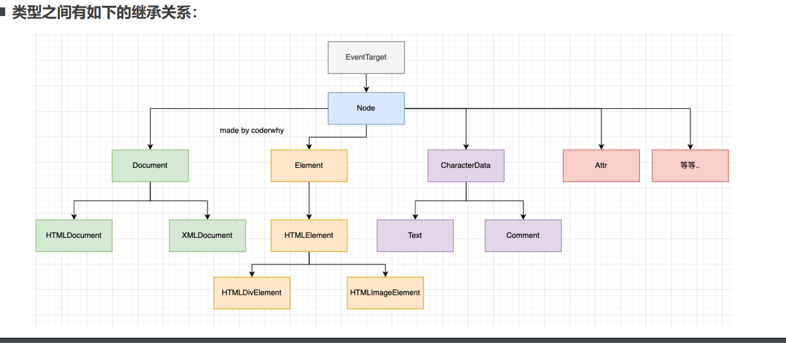

# JavaScript

编程语言的特点

1.数据和数据结构

2.指令及流程控制

3.引用机制和重用机制

4.设计哲学

> 可以向计算机发出指令，一种能够让程序员准确地定义计算机所需要使用数据的计算机语言，并精确地定义在不同情况下所应当采取的行动。

- **ECMAScript是一种规范，而JavaScript是这种规范的一种实现**
  - JavaScript**成为**了**ECMAScript**最著名的实现之一;
  - 除此之外，**ActionScript和JScript**也都是ECMAScript规范的实现语言；
- JavaScript的组成
  - **ECMAScript**：定义语言规范
  - **DOM：**用于操作文档的API
  - **BOM**：用于操作浏览器的API

> js代码被浏览器解析运行，chrome里面是使用V8引擎来对js进行解析并转化为机器语言使cpu识别解析

## JavaScript的编写方式

1.HTML代码内(不推荐)

2.script标签中

3.外部script文件内

<noscript>元素

- 用于不支持Javascript的浏览器提供替代内容

```html
 <noscript>
      <p>您的浏览器不支持javaScript</p>
    </noscript>
```

## 数据类型

-  JavaScript 中有八种基本的数据类型（前七种为**基本数据类型，也称为原始类型**，而 **object 为复杂数据类型，也称为引用类型**）。
  -  **number：** 用于任何类型的数字：整数或浮点数。
     - 除了常规的数字，还包括所谓的“特殊数值（“special numeric values”）”也属于Number类型（了解）
       - **Infinity**：代表数学概念中**的 无穷大 ∞**，也可以表示-Infinity；
         - 比如 1/0 得到的就是无穷大；
       - **NaN**（not a number）：NaN 代表一个**计算错误**，它是一个**错误的操作**所得到的结果；
         - 比如 字符串和一个数字相乘；
       - **数字表示的范围：**
         - 最小正数值：Number.MIN_VALUE，这个值为： 5e-324，小于这个的数字会被转化为0
         - 最大正数值：Number.MAX_VALUE，这个值为： 1.7976931348623157e+308
       - **isNaN()**
         - 用于判断是否不是一个数字。不是数字返回true，是数字返回false。
  - **string** ：用于字符串：一个字符串可以包含 0 个或多个字符，所以没有单独的单字符类型。
  - **boolean** ：用于 true 和 false。
  - **undefined** ：用于未定义的值 —— 只有一个 undefined 值的独立类型(**只定义变量没有赋值，显示为undefined)。**
  - **object** ：用于更复杂的数据结构。
  - **null** ：用于未知的值 —— 只有一个 null 值的独立类型**(一个对象为空时，为null)**。
    - null类型通常用来表示**一个对象为空**，所以通常我们在**给一个对象进行初始化时**，会赋值为**null**；
  - BigInt
  - Symbol

  ###  null和undefined的关系：

  - undefined通常只有在一个变量声明但是**未初始化**时，它的默认值是**undefined**才会用到；

  - 并且我们不**推荐直接给一个变量赋值为undefined**，所以很少主动来使用；

  - **null值非常常用**，当一个变量准备保存一个对象，但是**这个对象不确定时，我们可以先赋值初始化为null**

    > **给一个变量初始化为null时他是个对象类型，而且当做If语句判断时Js会默认进行隐式操作转化布尔值为ture，如果初始化(不知道给数据什么值，先给个0或者空的)其他原始数据类型时js会把它转化成为布尔值false，也就是说if语句不会执行**
    >
    > 对象类型中没有值初始化时做判断js会默认进行隐式转化为true，而原始类型会转换为false
    >
    > 当给一个对象为null时。在内存中它不会创建一个内存，而初始化为空对象时，他会占据内存
    >
    > 所有一般初始化为Null,它也一般用于对象初始化

### typeof操作符

- 因为 ECMAScript 的类型系统是**松散的**，所以需要一种手段来**确定任意变量的数据类型。**
  - **typeof 操作符**就是为此而生的。
- **它可以返回Js中的所有基本数据类型**
  - "undefined"表示值未定义;
  -  "boolean"表示值为布尔值;
  - "string"表示值为字符串;
  - "number"表示值为数值;
  - "object"表示值为对象(而不是函数)或 null;
  - "function"表示值为函数;
  - “symbol”表示值为符号；
- **typeof()的用法：**
  - 你可能还会遇到另一种语法**：typeof(x)，它与 typeof x 相同；**
  - typeof是一个**操作符，并非是一个函数，()只是将后续的内容当做一个整体而已；**

```js
  var name = "liweiye";
      var num = 4444;
      var Un;
       typrof(name)
      console.log(typeof num);
      console.log(typeof name);
      console.log(typeof Un);
```

> **操作符使用时，后面可以没有小括号,有小括号也只是把后面内容当做一个整体**

### 数据类型的转换

- **String:**

转换方式一：隐式转换

1.一个字符串和其他类型进行+操作

2.某些函数的执行也会自动将参数转为字符串类型

​    比如cosole.log函数

转换方式二：显式转换

 调用**String()**函数；
 调用**toString()**方法

- **Number**

  隐式转换使用+运算，并且其中一边有字符串，那么还是按照字符串来连接的；

  使用**Number()函数**进行显示转换

  其他规则：

  | 值          | 转换后的值                                                   |
  | ----------- | ------------------------------------------------------------ |
  | undefined   | NaN                                                          |
  | null        | 0                                                            |
  | true和false | 1 and 0                                                      |
  | string      | 如果字符串中有纯数字，则会进行转为数字类型，如果字符串为空会转换为0。如果不是则为NaN |

- **Boolean**

通过调用 **Boolean(value)** 显式地进行转换。

转换规则如下：

​       - 直观上为“空”的值（如 0、空字符串、null、undefined 和 NaN）将变为 false。

​       -  其他值变成 true。

| 值                          | 转换后 |
| --------------------------- | ------ |
| 0, null, undefined, NaN, "" | false  |
| 其他值                      | true   |

注意：包含 0 的字符串 "0" 是 true

  - 一些编程语言（比如 PHP）视 "0" 为 false。但在 JavaScript 中，非空的字符串总是 true。

    > 还可以使用逻辑 非(!)进行取反，对一个字符串先取值为false,在使用一次！取值为true。进行布尔值的转换

### 三元运算符

- 这个运算符通过**问号 ?** 表示；
  - 有时它被称为**三元运算符**，被称为“三元”是因为该运算符中有**三个操作数（运算元）**；
  - 实际上它是 JavaScript 中唯一一个有这么多操作数的运算符；


- 使用格式如下:

  - 计算条件结果，如果结果为真，则返回 value1，否则返回 value2。

    **var result = condition ? value1 : value2;**

    ```js
     var result = function (age) {
            return age > 18 ? "已成年" : "未成年";
          };
          console.log(result(18));//返回”已成年“
    ```

### 逻辑或的本质

`var result = a || b`

1.先将运算元转成BooLean类型
2.对转成的booLean类型进行判断**(从左到右)**
    如果为**true**,直接将第一个运算元（元类型)返回
   如果为**faLse**,进行第二个运算元的判断
   以此类推
3.如果找到最后，也没有找到，那么返回最后一个运算元

-  **换句话说，一个或运算 || 的链，将返回第一个真值，如果不存在真值，就返回该链的最后一个值。**

> 在实际开发中我们可以利用这一特性，给变量设置一个默认值
>
> **var result = info || "我是默认值"**   这样当第一个运算元没有接收到，会使用第二个运算元

### 逻辑与的本质

`运算元1 && 运算元2 && 运算元3`
也可以脱离条件判断来使用
**逻辑与的本质**
1.拿到第一个运算元，将运算元转BooLean类型
2.对运算元的BooLean类型进行判断
     如果为**false**,返回运算元（原始值）
     如果**true**,查找下一个继续来运算
     以此类推
3.如果查找了所有的都为true,那么返回最后一个运算元（原始值）

> 在实际使用中可以一些对象中的方法进行有值判断
>
> obj && obj.friend && obj.friend()
>
> **如果第一个运算元存在那么会执行下一个，如果没有直接返回**

### !（非）

- **逻辑非运算符接受一个参数，并按如下运算：**
  - 步骤一：将**操作数转化为布尔类型**：true/false；
  - 步骤二：**返回相反的值；**
- 两个非运算 **!!** 有时候用来将某个值转化为布尔类型：
  - 也就是，第一个**非运算将该值转化为布尔类型并取反，第二个非运算再次取反。**
  - 最后我们就得到了**一个任意值到布尔值的转化。**

### switch语句

- **switch是分支结构的一种语句：**
  - 它是通过判断**表达式的结果（或者变量）**是否等于**case语句的常量，**来执行相应的分支体的；
- 与if语句不同的是，switch语句**只能做值的相等判断**（使用全等运算符 ===），而**if语句可以做值的范围判断**；
- **switch的语法**：
  -  switch 语句有至少一个 case 代码块和一个可选的 default 代码块。
- **case穿透问题：**
  - 一条case语句结束后，会自动执行下一个case的语句；
  - 这种现象被称之为case穿透；
- **注意事项：这里的相等是严格相等。**
  - 被比较的值必须是相同的数据类型才能进行匹配

```js
  var age = 10;
      switch (age变量) {
                //常量1
        case 10:
          console.log("您小于18");
          break;
        //值相等时才会执行对应代码
        case 18常量2:
          console.log("恭喜您，可以进入");
          break;
              //默认
        default:
          "这是默认文本";
      }
```

## 循环语句

### while循环

- while循环的语法如下：
  - 当**条件成立**时，**执行代码块；**
  - 当**条件不成立**时，**跳出代码块；**
- 如果条件一直成立（为true），那么会产生**死循环。**
  - 这个时候必须通过**关闭页面来停止死循环；**
  - 开发中一定**要避免死循环**的产生；

```js
   //和if不同，它只有一个判断条件，为true时才进入循环
     //变量和进行循环之后的操作需要单独定义
while(循环条件){
    //循环代码块
}
```

### do..while循环

- **do..while循环和while循环非常像，二者经常可以相互替代**(不常用)
  - 但是do..while的特点是不管条件成不成立，**do循环体都会先执行一次；**

```js
do{ 
    //循环代码块
    //无论循环条件是否成立，这里的代码都会执行一次
}while(循环条件)
```

### for循环

for 循环更加复杂，但它是**最常使用的循环形式。**

```js
 for (var i = 0; i < 3; i++) {
      alert(i)
     //他的本质也是while循环，只不过把变量都放里面了
      }
for (begin;condition;step){
//循环代码块
    body
}
```

>  begin 执行一次，然后进行迭代：每次检查 condition 后，执行 body 和 step
>
> 1.先执行begin的代码(开始执行一次)，检查是否满足条件，如果满足执行body的内容
>
> 2.接着执行step代码，在进行条件判断，如果为true接着执行body内容，否则跳出循环

### 循环的跳转控制

- **break**: 直接跳出循环, 循环结束
  - break 某一条件满足时，退出循环，不再执行后续重复的代码


- **continue**: 跳过本次循环次, 执行下一次循环体
  - continue 指令是 break 的“轻量版”。
  -  continue 某一条件满足时，不执行后续重复的代码


## 函数

### arguments

- **事实上在函数有一个特别的对象：arguments对象**
  - 默认情况下，**arguments对象**是所有（非箭头）函数中都可用的**局部变量；**
  - 它可以**接受所有函数被调用时传入的参数**，**它是个对象**但可以**使用数组的方法对其使用**(类数组对象)
  - 如果调用者传入的参数多余函数接收的参数，可以通过arguments去获取所有的参数；

> 使用var声明的变量不会生成块级作用域，因为var是直接挂载到window上的，也就是说无论在都一样访问到，除了在函数内定义的，**因为函数有它自己的块级作用域**
>
> var声明的全局变量会在window对象上添加一个属性

## 对象

### 对象的遍历

- 对象的遍历（迭代）：表示获取对象中所有的属性和方法。
  - **Object.keys()** 方法会**返回一个由一个给定对象的自身可枚举属性组成的数组；**
- **遍历方式一：普通for循环**

```js
 var objKey = Object.keys(obj);
      for (var i = 0; i < objKey.length; i++) {
          //拿到 objKey中的每一项key
        var key = objKey[i];
          //通过key中每一项的值，在obj中查询对应的值
        var value = obj[key];
        console.log(`Key值为:${key},value为:${value}`);
      }
```

-  **遍历方式二：for in 遍历方法**

```js
   //key为对象里里面的每一项key,obj为要遍历的对象
  //也就是对里面的每一项进行遍历
for (var key in obj) {
        var key = key;
        var value = obj[key];
        console.log(`Key值为:${key},value为:${value}`);
      }
```

### 栈内存(stack)和堆内存(heap)

-  **原始类型(值类型)**占据的空间是在**栈内存中**分配的；

- **引用数据类型**占据的空间是在**堆内存中**分配的；

  > 值类型(原始类型):在变量中保存的是值本身,占据的空间是在栈内存中分配的
  >
  > 引用类型(对象类型):在变量中保存的是对象的“引用(内存地址)”,占据的空间是在堆内存中分配的

### this

- 两个this判断方法
  - 以**默认的方式 ( foo ( ) )**调用一个函数,**this指向window**
  - 通过**对象调用( obj.foo() )**，this指向**调用对象**

### 构造函数(类) 和 new关键字

- 在javaScript中构造函数即是类：简单可以理解类为一种事物的总称

  - 比如：定义一个Person类，那么它可分为 男女
  - 类相当于一个设计图，使用它可以建造很多房子，并且可以根据设计图进行改造

- 构造函数和普通函数从形式表现上没有区别，但是当一个**普通的函数被使用new操作符**来调用了，那么**这个函数就称之为是一个构造函数；**

- 我们可以通过**new关键字调用这个类**，如果一个函数被使用new操作符调用了，那么**它会执行如下操作：**

  - 1.在内存中创建一个新对象
  - 2.这个对象内部的[[prototype]]属性会被赋值为该构造函数的prototype属性
  - 3.构造函数内部的this，会指向创建出来的新对象
  - 4.指向函数的内部代码(函数体代码)
  - 5.如果构造函数没有返回非空对象，则会返回创建出来的新对象

  ```js
      function Student(sex, name, age) {
          //var this = {} 创建新对象
          this.sex = sex;  //这里this会指向新对象
          this.name = name;
          this.age = age;        
          //return this 返回对象
        }
        var stu = new Student("男", "kebi", 30);
        var stu1 = new Student("女", "小芳", 20);
        var stu2 = new Student("男", "小明", 18);
        console.log(stu);
        console.log(stu1);
        console.log(stu2);
  ```

> 在ES6之后就可以使用Class关键字来定义类了

## 内置类

- JavaScript的原始类型**并非对象类型**，所以从理论上来说，它们是**没有办法获取属性或者调用方法**的。
- 但是开发中原始类型可以获取属性和调用方法
- 这是因为JavaScript为了可以**使其可以获取属性和调用方法，对其封装了对应的包装类型；**
- 常见的**包装类**型有：**String、Number、Boolean、Symbol、BigInt**类型

### 包装类的使用过程

- 默认情况，当我们**调用一个原始类型的属性或者方法**时，会进行如下操作：
  - 根据**原始值，创建一个原始类型对应的包装类型对象；**
  - **调用对应的属性或者方法，返回一个新的值；**
  - 创**建的包装类对象被销毁；**
  - 通常JavaScript**引擎会进行很多的优化，它可以跳过创建包装类的过程在内部直接完成属性的获取或者方法的调用。**
- 注意事项：**null、undefined没有任何的方法，也没有对应的“对象包装类”；**

### Number类的补充

- Number属性补充：
  - Number.MAX_SAFE_INTEGER：JavaScript 中最大的安全整数 (2^53 - 1)；
  - Number.MIN_SAFE_INTEGER：JavaScript 中最小的安全整数 -(2^53 - 1)
- Number实例方法**(通过对象调用)**补充：
  - 方法一：**toString(base)**，将数字转成字符串，并且按照base进制进行转化
    - base 的范围可以从 2 到 36，默认情况下是 10；
    - 注意：如果是直接对一个数字操作，需要使用..运算符；
  - 方法二：**toFixed(digits)**，格式化一个数字，保留digits位的小数**,默认四舍五入**；
    - digits的范围是0到20（包含）之间；
    - 返回值是字符串类型
- Number类方法补充：
  - 方法一：**Number.parseInt(string[, radix])**，将字符串解析成整数，也有对应的全局方法parseInt；
  - 方法二：**Number. parseFloat(string)**，将字符串解析成浮点数(小数点)，也有对应的全局方法parseFloat；

### Math对象

- Math常见的属性：
  - Math.PI：圆周率，约等于 3.14159；
- Math常见的方法：
  - **Math.floor**：向下舍入取整
  - **Math.ceil**：向上舍入取整
  -  **Math.round**：四舍五入取整
  - **Math.random**：生成0~1的随机数（包含0，不包含1）
  - **Math.pow(x, y)**：返回x的y次幂

### String

 **length**：获取字符串的长度；

- **操作一：访问字符串的字符**
  - 使用方法一：通过字符串的索引 **str[0]**
  - 使用方法二：通过**str.charAt(pos)**方法
  - 它们的区别是**索引的方式没有找到会返回undefined，而charAt没有找到会返回空字符串；**

**字符串的遍历:**

方式一：普通for循环
方式二：for..of遍历

> 字符串和数组可以使用for..of遍历，因它们是可迭代对象。对象不可以

- **操作二：修改字符串**

  - 字符串的不可变性：
    - 字符串在**定义后是不可以修改的**
  - **所以，在我们改变很多字符串的操作中，都是生成了一个新的字符串；**
    - 比如改变字符串大小的两个方法
    - **toLowerCase()**：将所有的字符转成小写；
    - **toUpperCase()** ：将所有的字符转成大写；

- **操作三：查找字符串**

  - **在开发中我们经常会在一个字符串中查找或者获取另外一个字符串，String提供了如下方法**：
  -  **方法一：查找字符串位置(str.indexOf("searchString",FromIndex))**
    - **从FromIndex开始，查找字符串的索引**；
    - **如果没有找到，那么返回-1**；
    - 有一个相似的方法，叫lastIndexOf，从最后开始查找（用的较少）
  - **方法二：是否包含字符串(str.includes("value"))**
    -  从position位置开始查找searchString， **根据情况返回 true 或 false**
    - 这是ES6新增的方法

- **操作四：开头和结尾**

  - **方法三：：以xxx开头 （str.startsWith("value",positon)）**
    - 从position位置开始，判断字符串是否以searchString开头；
    - 这是ES6新增的方法，下面的方法也一样；
    - 返回布尔值
  - **方法四：：以xxx结尾 （str.endsWith("value",length)）**
    - 在length长度内，判断字符串是否以searchString结尾；
  - **方法五：替换字符串（str.replace('value',"respaceValue")）**
    -  查找到对应的字符串，并且使用新的字符串进行替代；
    - 这里也可以传入一个正则表达式来查找，也可以传入一个函数来替换；

- **操作五：获取子字符串**

  - **方法六：获取子字符串**

    | 方法                  | 选择方式...                           | 负值参数           |
    | --------------------- | ------------------------------------- | ------------------ |
    | slice(start, end)     | 从 start 到 end（不含 end）           | 允许(负值从后往前) |
    | substring(start, end) | 从 start 到 end（不含 end）           | 负值代表 0         |
    | substr(start, length) | 从 start 开始获取长为 length 的字符串 | 允许 start 为负数  |

    >  开发中推荐使用slice方法

- **操作：其他方法**

  - **方法七：拼接字符串（str.concat("value")）**
  - **方法八：删除首尾空格（str.trim()）**
  - **方法九：字符串分割 （str.split(separator,limit)）**
    -  separator：以什么字符串进行分割，也可以是一个正则表达式；
    - limit：限制返回片段的数量；
    - 返回值为数组

- 更多的字符串的补充内容，可以查看MDN的文档：

  - https://developer.mozilla.org/zh-CN/docs/Web/JavaScript/Reference/Global_Objects/String

> 常用：
>
> inedxOf:返回字符串下标，如果没有返回 -1
>
> slice:获取子字符串 ,2个参数，开始和结束下标
>
> slipt:对字符串进行分割，第一个参数为以哪个值分割，第二个参数为获取几个值返回一个数组

## Array

数组是一种特殊的对象类型

- **数组的添加、删除方法（一）**

  - **在数组的尾端添加或删除元素：**
    - **push** 在末端添加元素（可以添加多个）.
    - **pop** 从末端取出一个元素（只能删除一个）.
  - **在数组的首端添加或删除元素**
    -  **shift** 取出队列首端的一个元素，整个数组元素向前前移动；
    - **unshift** 在首端添加元素，整个其他数组元素向后移动；
  - **push/pop** 方法运行的比较快，而 **shift/unshift** 比较慢。

- **数组的添加、删除方法（二）**

  - 如果我们希望在中间某个位置添加或者删除元素应该如何操作呢？

  - **arr.splice 方法**可以说是处理数组的利器，它可以做所有事情：**添加，删除和替换元素**

  - arr.splice的语法结构如下：

    `array.splice(start[,deleteCount[,iteml[,item2[,···]]])`

    -  从**start**位置开始，处理数组中的元素；
    - **deleteCount**：要删除元素的个数，如果为0或者负数表示不删除；
    - **item1, item2, ...**：在添加元素时，需要添加的元素；

  - **注意：这个方法会修改原数组**

- **数组的遍历**

1.for循环

2.for..in 遍历，获取到索引值：

3.for...of遍历，获取到每一个元素

- **数组方法 – slice、concat、 join**

  - **arr.slice** 方法：用于对数组进行截取（类似于字符串的slice方法）
  -  **arr.concat**方法：创建一个新数组，其中包含来自于其他数组和其他项的值。
  - **arr.join**方法： 将一个数组的所有元素连接成一个字符串并返回这个字符串。

- **数组方法 – 查找元素**

  - **arr.indexOf**方法： 查找某个元素的索引（和字符串indexOf方法类似）
  - **arr.includes**方法：判断数组是否包含某个元素
  - **find 和 findIndex** 直接查找元素或者元素的索引（ES6之后新增的语法）它们是高阶函数

- **数组的排序 – sort/reverse**

  -  **sort方法**也是一个高阶函数，用于对数组进行排序，并且生成一个排序后的新数组：

    `arr.sort([compareFunction(a,b) ]`

    - 如果 compareFunction(a, b) 小于 0 ，那么 a 会被排列到 b 前面；
    - 如果 compareFunction(a, b) 等于 0 ， a 和 b 的相对位置不变；
    - 如果 compareFunction(a, b) 大于 0 ， b 会被排列到 a 前面；
    - **也就是说，谁小谁排在前面；**

  - **reverse() 方法将数组中元素的位置颠倒，并返回该数组。**

- **数组的其他高阶方法（高阶函数）**

  - **arr.forEach**
    - 遍历数组，并且让数组中每一个元素都执行一次对应的方法；
  - **arr.map**
    - map() 方法创建一个新数组；
    - 这个新数组由原数组中的每个元素都调用一次提供的函数后的返回值组成；
  - **arr.filter**
    - filter() 方法创建一个新数组；
    - 新数组中只包含每个元素调用函数返回为true的元素；
  - **arr.reduce**
    - 用于计算数组中所有元素的总和；
    - 对数组中的每个元素按序执行一个由您提供的 **reducer** 函数；
    - 每一次运行 **reducer** 会将先前元素的计算结果作为参数传入，最后将其结果汇总为单个返回值

  > 高阶函数，在函数中传入使用另一个函数

## Date对象

https://developer.mozilla.org/zh-CN/docs/Web/JavaScript/Reference/Global_Objects/Date

语法

```js
new Date();//当前时间
new Date(value); //传入的是毫秒数，~表示从1970-01-0100：00：00UTc经过的毫秒数，可以转化时间戳 	
new Date(dateString);//,传入的是datestring,"日期的字符串值
new Date(year, monthIndex [, day [, hours [, minutes [, seconds [, milliseconds]]]]]);
//具体日期
```

- **dateString时间的表示方式**

  - 日期的表示方式有两种：**RFC 2822 标准** 或者 **ISO 8601 标准。**

  - **默认打印的时间格式是RFC 2822标准的：**

    > new Date()
    > Fri May13202217:14:52GMT+0800

  - **我们也可以将其转化成ISO 8601标准的：**

    > new Date().toIsostring()
    > 2022-05-13T09:15:51,507Z

    - **YYYY**：年份，0000 ~ 9999
    - **MM**：月份，01 ~ 12
    - **DD**：日，01 ~ 31
    - **T**：分隔日期和时间，没有特殊含义，可以省略
    - **HH**：小时，00 ~ 24
    - **mm**：分钟，00 ~ 59
    - **ss**：秒，00 ~ 59
    - .**sss**：毫秒
    - **Z**：时区

- **Date获取信息的方法(获取当前的日期)**

  - **我们可以从Date对象中获取各种详细的信息**：

    - **getFullYear()**：获取年份（4 位数）；
    - **getMonth()**：获取月份，从 0 到 11；
    - **getDate()**：获取当月的具体日期，从 1 到 31（方法名字有点迷）；
    - **getHours()**：获取小时；
    - **getMinutes()**：获取分钟；
    - **getSeconds()**：获取秒钟；
    - **getMilliseconds()**：获取毫秒；

    ```js
     var date1 = new Date();

          var YY = date1.getFullYear();
          var MM = date1.getMonth();
          var DD = date1.getDate();
          var HH = date1.getHours();
          var mm = date1.getMinutes();
          var ss = date1.getSeconds();
          console.log(`${YY}-${MM}-${DD}:${HH}-${mm}-${ss}`);
    ```

  - 获取某周中的星期几：

    - **getDay()**：获取一周中的第几天，从 0（星期日）到 6（星期六）；

- **Date设置信息的方法(设置想要的日期)**

  - **Date也有对应的设置方法：**
    - setFullYear(year, [month], [date])
    - setMonth(month, [date])
    - setDate(date)
    - setHours(hour, [min], [sec], [ms])setMinutes(min, [sec], [ms])
    - setSeconds(sec, [ms])
    - setMilliseconds(ms)
    - setTime(milliseconds)
  - 了解：我们可以设置超范围的数值，它会自动校准。

- **Date获取Unix时间戳**

  - **Unix 时间戳：它是一个整数值，表示自1970年1月1日00:00:00 UTC以来的毫秒数**

  - 在JavaScript中，我们有多种方法可以获取这个时间戳

    - 方式一：**new Date().getTime()**
    - 方式二：**new Date().valueOf()**
    - 方式三：**+new Date()**
    - 方式四：**Date.now()**

  - 获取到Unix时间戳之后，我们可以利用它来测试代码的性能

    ```js
    var startTime Date.now()
    for (var i=0;i<10000;i++){
        console.log(i)
    }
    var endTime Date.now()
    console.log(endTime - startTime)
    ```

- **Date.parse方法**

  - Date.parse(str) 方法可以**从一个字符串中读取日期**，并且**输出对应的Unix时间戳。**
  -  Date.parse(str) ：
    - 作用**等同于 new Date(dateString).getTime() 操作；**
    - **需要符合 RFC2822 或 ISO 8601 日期格式的字符串**；
      - 比如YYYY-MM-DDTHH:mm:ss.sssZ
    - 其他格式也许也支持，但**结果不能保证一定正常；**
    - 如果输入的格式**不能被解析，**那么会返回**NaN**

- **时间格式化的方法**

  ```js
  function formatDate(time,fmt){
  let date new Date(time);
  if (/(y+)/.test(fmt)){
  fmtfmt.replace(RegExp.$1,(date.getFullYear()+').substr(4 -RegExp.$1.length));
  let o ={  
  'M+':date.getMonth()+1,
  'd+':date.getDate(),
  'h+':date.getHours(),
  m+':date.getMinutes(),
  's+':date.getSeconds()
  };
  for (let k in o){
  if (new RegExp(($k})).test(fmt)){
  let str=o[k]+'';
  fmtfmt.replace(RegExp.$1,(RegExp.$1.length ===1)?str:padLeftZero(str));
  }
  return fmt;
  }
  function padLeftZero(str){
  return ('00'str).substr(str.length);
  };
  ```

# DOM

Dom和Bom是浏览器提供给我们开发者对页面、浏览器进行操作

- DOM：**文档对象模型（Document Object Model）**
  - 简称 **DOM**，将**页面所有的内容表示为可以修改的对象**；
- BOM：**浏览器对象模型（Browser Object Model）**
  - 简称 **BOM**，由**浏览器提供的用于处理文档（document）之外的所有内容的其他对象**；
  - 比如**navigator、location、history**等对象；


## 深入理解DOM

- 浏览器会对我们**编写的HTML、CSS进行渲染**，同时它又要考虑我们可能会**通过JavaScript来对其进行操作**：
  - 于是**浏览器将我们编写在HTML中的每一个元素（Element）都抽象成了一个个对象；**
  - 所有这些对象都可以**通过JavaScript来对其进行访问**，那么我们就可以**通过JavaScript来操作页面；**
  - 所以，我们将**这个抽象过程**称之为 **文档对象模型（Document Object Model）**

- **整个文档被抽象到 document 对象中：** 
  - 比如**document.documentElement**对应的是**html元素**
  -  比如**document.body**对应的是**body元素**；
  - 比如**document.head**对应的是**head元素**；

- **所以学习DOM，就是在学习如何通过JavaScript对文档进行操作的**

  

### document对象

- Document节点表示的整个载入的网页，它的实例是全局的**document对象：**
  - 对DOM的所有操作都是**从 document 对象开始**的；
  - 它是**DOM的 入口点**，可以从**document**开始去访问任何节点元素；
- 对于最顶层的html、head、body元素，我们可以直接在document对象中获取到：
  - **html元素**： = document.documentElement
  - **body元素**： = document.body
  - **head元素**： = document.head
  - **文档声明**： = document.doctype

### 节点（Node）之间的导航（navigator）

- 如果我们获取到**一个节点（Node）**后，可以根据**这个节点去获取其他的节点**，我们称之为**节点之间的导航**

- **节点之间存在如下的关系：**

  - 父节点：**parentNode**
  - 前兄弟节点：**previousSibling**
  - 后兄弟节点：**nextSibling**
  - 子节点：**childNodes**
  - 第一个子节点：**firstChild**
  - 第二个子节点：**lastChild**

  >  文本注释换行符(显示为文本)都算一个节点，在网页中的任何一个东西都是节点
  >
  > **大部分都使用元素的导航**

### 元素（Element）之间的导航（navigator）

- 如果我们获取到一个**元素（Element）**后，可以根据**这个元素去获取其他的元素**，我们称之为**元素之间的导航**

- **节点之间存在如下的关系**：

  - 父元素：**parentElement**

  - 前兄弟元素：**previousElementSibling**

  - 后兄弟元素：**nextElementSibling**

  - 子元素：**children**

  - 第一个子元素：**firstElementChild**

  - 最后一个子元素：**lastElementChild**

    > 只有Html元素才算是元素，元素属于节点的一部分
    >
    > 元素继承与节点

### 表格（table）元素的导航（navigator）

- **<table>元素支持 (除了上面给出的，之外) 以下这些属性：**
  - **table.rows** — <tr> 元素的集合；
  - **table.caption/tHead/tFoot** — 引用元素 <caption>，<thead>，<tfoot>；
  - **table.tBodies** —<tbody>  元素的集合；
- **<thead>，<tfoot>，<tbody> 元素提供了 rows 属性：**
  - **tbody.rows** — 表格内部<tr>  元素的集合；
- **<tr>:**
  - **tr.cells** — 在给定<tr>  中的<td>  和<th>  单元格的集合；
  - **tr.sectionRowIndex** — 给定的<tr>  在封闭的<thead> /<tbody>/ <tfoot>中的位置（索引）
  - **tr.rowIndex** — 在整个表格中<tr>  的编号（包括表格的所有行）；
- **<td>和<th>**
  - **td.cellIndex** — 在封闭的 <tr> 中单元格的编号。

### 获取元素的方法

-  当元素彼此靠近或者相邻时，DOM **导航属性（navigation property）**非常有用。

  - 但是，在实际开发中，我们希望可以**任意的获取到某一个元素**应该如何操作呢？

- **DOM为我们提供了获取元素的方法：**

  | 方法名                                 | 搜索方式     | 可以在元素上调用？ | 实时的? |
  | -------------------------------------- | ------------ | ------------------ | ------- |
  | **querySelector**                      | CSS-selector | ✔                  | -       |
  | **querySelectorAll**                   | CSS-selector | ✔                  | -       |
  | **getElementById**                     | id           | -                  | -       |
  | getElementsByName（比如Input里的name） | name         | -                  | ✔       |
  | getElementsByTagName                   | tag or '*'   | ✔                  | ✔       |
  | **getElementsByClassName**             | class        | ✔                  | ✔       |

- **开发中如何选择呢？**

  - 目前最常用的是**querySelector和querySelectAll；**
  - **getElementById**偶尔也会使用或者在适配一些低版本浏览器时；

### 节点的属性 - nodeType(了解)

- **目前，我们已经可以获取到节点了，接下来我们来看一下节点中有哪些常见的属性：**

  - 当然，不同的节点类型有可能有不同的属性；
  - 这里我们主要讨论**节点共有的属性；**

- **nodeType属性：**

  - nodeType 属性提供了一种获取**节点类型**的方法；
  - 它有一个**数值型值**（numeric value）；

- **常见的节点类型有如下：**

  | 常量                    | 值   | 描述                                                        |
  | ----------------------- | ---- | ----------------------------------------------------------- |
  | Node.ELEMENT_NODE       | 1    | 一个元素节点，例如≤p≥和<div2                                |
  | Node.TEXT_NODE          | 3    | Element 或者 Attr 中实际的 文字                             |
  | Node.COMMENT_NODE       | 8    | 一个 Comment 节点。                                         |
  | Node.DOCUMENT_NODE      | 9    | 一个 Document 节点。                                        |
  | Node.DOCUMENT_TYPE_NODE | 10   | 描述文档类型的 DocumentType 节点。例如  就是用于 HTML5 的。 |

  > 主要使用nodeType进行判断根据它返回的值判断它的节点类型

- 其他类型可以查看MDN文档： https://developer.mozilla.org/zh-CN/docs/Web/API/Node/nodeType

### 节点的属性 – nodeName、tagName

- **nodeName：获取node节点的名字；**
- **tagName：获取元素的标签名词；**

```js
var textNode= document.body.firstChild
var itemNode =document.body.childNodes[3]
console.log(textNode.tagName)
console.log(itemNode.nodeName）
```

- **tagName 和 nodeName 之间有什么不同呢？**
  - **tagName** 属性仅适用于 Element 节点；
  - **nodeName** 是为任意 Node 定义的：
    - 对于元素，它的意义与 tagName 相同，所以使用哪一个都是可以的；
    - 对于其他节点类型（text，comment 等），它拥有一个对应节点类型的字符串；

### 节点的属性 - innerHTML、textContent（用的最多）

- innerHTML 属性
  - 将元素中的 HTML 获取为字符串形式；
  - 设置元素中的内容；
- outerHTML 属性
  - 包含了元素的完整 HTML
  - innerHTML 加上元素本身一样；
- textContent 属性
  - 仅仅获取元素中的文本内容；
- innerHTML和textContent的区别：
  - 使用 innerHTML，我们将其**“作为 HTML”插入**，带有所有 HTML 标签。
    - **获取时：带着元素标签一起获取**
    - **插入时：如果插入时内部有元素标签，会带着一起显示**
  - 使用 textContent，我们将其“**作为文本”插入**，所有符号（symbol）均按字面意义处理。
    - **只会获取/插入文本内容**

### 节点的属性 - nodeValue

- **nodeValue/data**
  - 用于获取非元素节点的文本内容

### 节点的其他属性

- hidden属性：**也是一个全局属性，可以用于设置元素隐藏。**
- DOM 元素还有其他属性：
  - **value**
    - <input>,<select>,<textarea>和 （HTMLInputElement，HTMLSelectElement……）的 value。
  - **href**
    - <a href="...">（HTMLAnchorElement）的 href。
  - **id**
    - 所有元素（HTMLElement）的 “id” 特性（attribute）的值。

## 元素的属性和特性

**元素继承与节点，也就是说元素可以使用节点的所有属性**

> 属性和特性：
>
> 元素的class、style
>
> 元素的常见操作
>
> 元素的大小和滚动
>
> window的大小和滚动
>
> 属性太多，详情看ppt或官方文档

- 属性attribute的分类：
  - **标准的attribute**：某些attribute属性是标准的，比如id、class、href、type、value等；
  - **非标准的attribute**：某些attribute属性是自定义的，比如abc、age、height等

> 标准的attribute可以使用property获取属性，但是非标准的不能获取，只能通过attribute的方法获取
>

- **对于标准的attribute，会在DOM对象上创建与其对应的property属性**
- 在大多数情况下，它们是相互作用的
  - 改变**property**，通过**attribute**获取的值，会随着改变；
  - 通过**attribute**操作修改，**property**的值会随着改变；
    - 但是input的value修改只能通过attribute的方法；
- 除非特别情况，大多数情况下，设置、获取attribute，推荐使用property的方式：

> **对象中的属性称为property,元素中的属性称为attribute**
>
> **既然是对象中的属性，所有我们可以通过 . 的方式获取到元素中的标准attribute,并对其操作**

- 浏览器在解析HTML元素时，会**将对应的attribute**也创建出来放到**对应的元素对象**上。
  - 比如**id、class就是全局的attribute**，会有对应的**id、class**属性；
  - 比如**href**属性是针对**a元素**的，**type、value**属性是针对**input**元素的；

### attribute的操作

- **对于所有的attribute访问都支持如下的方法：**
  - **elem.hasAttribute(name)** — 检查特性是否存在。
  - **elem.getAttribute(name)** — 获取这个特性值。
  - **elem.setAttribute(name, value)** — 设置这个特性值。
  - **elem.removeAttribute(name)** — 移除这个特性。
  - **attributes**：attr对象的集合，具有name、value属性；
- attribute具备以下特征：
  - 它们的名字是大小写不敏感的（id 与 ID 相同）。
  - 它们的值总是字符串类型的。

### HTML5的data-*自定义属性

可以通过dataset属性获取

### 元素的className和classList

- 元素的class attribute，对应的property并非叫class，而是**className**：
  - 这是因为JavaScript早期是不允许使用class这种关键字来作为对象的属性，所以DOM规范使用了**className**；
  - 虽然现在JavaScript已经没有这样的限制，但是并不推荐，并且依然在使用**className**这个名称；
- 我们可以对className进行赋值，它会替换整个类中的字符串。
- **如果我们需要添加或者移除单个的class，那么可以使用classList属性**。
- **elem.classList 是一个特殊的对象：**
  - **elem.classList.add (class)** ：添加一个类
  - **elem.classList.remove(class)**：添加/移除类。
  - **elem.classList.toggle(class)** ：如果类不存在就添加类，存在就移除它。
  - **elem.classList.contains(class)**：检查给定类，返回 true/false。
- classList是**可迭代对象**，可以通过**for of**进行遍历。

### 元素的style属性

- **如果需要单独修改某一个CSS属性，那么可以通过style来操作：**
  - 对于**多词**（multi-word）属性，使用**驼峰式** camelCase
- 如果我们将值设置为**空字符串**，那么会使用**CSS的默认样式**：
- 多个样式的写法，我们需要使用cssText属性：
  - 不推荐这种用法，因为它会替换整个字符串；

### 元素style的读取 - getComputedStyle

- 如果我们需要读取样式：
  - 对于**内联样式**，是可以**通过style.***的方式读取到的;
  - 对于**style、css文件中的样式**，是**读取不到**的；
- 这个时候，我们可以通过**getComputedStyle**的全局函数来实现：

```js
console.log(getComputedstyle(boxEl).width)
console.log(getComputedstyle(boxEl).height)
console.log(getComputedstyle(boxEl).backgroundColor)
```

### 创建元素

- **document.createElement(tag)**

### 插入元素

- 插入元素的方式如下：
  - **node.append(...nodes or strings)** —— 在 node 末尾 插入节点或字符串，
  - **node.prepend(...nodes or strings)** —— 在 node 开头 插入节点或字符串，
  - **node.before(...nodes or strings)** —— 在 node 前面 插入节点或字符串，
  - **node.after(...nodes or strings)** —— 在 node 后面 插入节点或字符串，
  - **node.replaceWith(...nodes or strings)** —— 将 node 替换为给定的节点或字符串。

### 移除和克隆元素

- 移除元素我们可以调用元素本身的remove方法：

  ```js
  setTimeout(():=>·{
  h2E1.remove()
  },2000);
  ```

- 如果我们想要复制一个现有的元素，可以通过cloneNode方法：

  - 可以传入一个Boolean类型的值，来决定是否是深度克隆；
  - 深度克隆会克隆对应元素的子元素，否则不会；

```js
var cloneBoxEl boxEl.cloneNode(true）
document.body.append(cloneBoxEl)
```

### 元素的大小、滚动

- **clientWidth**：contentWith+padding（不包含滚动条）
- **clientHeight**：contentHeight+padding
- **clientTop**：border-top的宽度
- **clientLeft**：border-left的宽度
- **offsetWidth**：元素完整的宽度
- **offsetHeight**：元素完整的高度
- **offsetLeft**：距离父元素的x
- **offsetHeigh**t：距离父元素的y
- **scrollHeight**：整个可滚动的区域高度
- **scrollTop**：滚动部分的高度

### window的大小、滚动

- **window的width和height**
  - **innerWidth、innerHeight**：获取window窗口的宽度和高度（包含滚动条）
  - **outerWidth、outerHeight**：获取window窗口的整个宽度和高度（包括调试工具、工具栏）
  - **documentElement.clientHeight、documentElement.clientWidth**：获取html的宽度和高度（不包含滚动条）
- **window的滚动位置**：
  - **scrollX**：X轴滚动的位置（别名pageXOffset）
  - **scrollY**：Y轴滚动的位置（别名pageYOffset）
- **也有提供对应的滚动方法**：
  - **方法 scrollBy(x,y)** ：将页面滚动至 相对于当前位置的 (x, y) 位置；
  - **方法 scrollTo(pageX,pageY)** 将页面滚动至 绝对坐标；

## 事件处理

### 认识事件（Event）

- Web页面需要经常和用户之间进行交互，而交互的过程中我们可能想要捕捉这个交互的过程：
  - 比如**用户点击了某个按钮、用户在输入框里面输入了某个文本、用户鼠标经过了某个位置；**
  - 浏览器需要搭建一条**JavaScript代码和事件之间的桥梁**；
  - 当某个事件发生时，让JavaScript做出对应的响应**（执行某个函数）**，所以我们需要**针对事件编写处理程序**（handler）；
- 如何进行事件监听呢？
  - 事件监听方式一：在script中直接监听（很少使用）；
  - 事件监听方式二：**DOM属性**，通过元素的on来监听事件（一个元素只能使用一个事件监听）；
  - 事件监听方式三：通过EventTarget中的addEventListener来监听（可以实现多个，比较灵活）；

### 常见的事件列表

- 鼠标事件：
  - **click** —— 当鼠标点击一个元素时（触摸屏设备会在点击时生成）。
  - **mouseover / mouseout** —— 当鼠标指针移入/离开一个元素时。
  - **mousedown / mouseup** —— 当在元素上按下/释放鼠标按钮时。
  - **mousemove** —— 当鼠标移动时。
- 键盘事件：
  - **keydown 和 keyup** —— 当按下和松开一个按键时。
- 表单（form）元素事件：
  - **submit** —— 当访问者提交了一个<form>  时。
  - **focus** —— 当访问者聚焦于一个元素时，例如聚焦于一个 <input>。
-  Document 事件：
  - **DOMContentLoaded** —— 当 HTML 的加载和处理均完成，DOM 被完全构建完成时。
- CSS 事件：
  - **transitionend** —— 当一个 CSS 动画完成时。

### 事件冒泡和事件捕获

**冒泡（Event Bubble）：从内层到外层依次传递**     默认情况下是冒泡

**捕获（Event Capture）：从外层到内层的传递**

> **当一个事件产生时会先进入捕获阶段，进入到target里，在进行冒泡**

- 为什么会产生两种不同的处理流呢？
  - 这是因为早期浏览器开发时，不管是IE还是Netscape公司都发现了这个问题;
  - 但是他们采用了完全相反的事件流来对事件进行了传递；
  - IE采用了**事件冒泡的方式**，Netscape采用了**事件捕获的方式**；

> 如果想监听捕获的过程我们要使用 addEventListener("事件",fn,boolean),把第三个参数为true
>
> 当同时存在冒泡和捕获时，首先会执行捕获

### 事件对象（event)

-  **当一个事件发生时，就会有和这个事件相关的很多信息：**
  - 比如**事件的类型是什么**，你点击的是**哪一个元素**，**点击的位置**是哪里等等相关的信息；
  - 那么这些信息会被封装到一个**Event对象**中，这个对象由**浏览器**创建，称之为**event对象**；
  - 该对象给我们提供了想要的一些属性，以及可以通过该对象进行某些操作
- **event对象**会在**传入的事件处理（event handler）函数回调**时，被系统传入；
  - 我们可以在回调函数中拿到这个**event对象**；

```js
  btn.onclick = function (event) {
        console.log("事件对象", event);
        console.log(event.type);
        console.log(event.target);
        console.log(event.currentTarget);
        console.log(event.eventPhase);
      };
```

#### event常见的属性和方法

- 常见的属性：

  - type：事件的类型；

  - **target**：当前事件发生的元素；

    - 只有在冒泡时它和currentTarget才会有区别

    - target是事件发生的元素，如果冒泡，那么target就会是当前点击内层的那个元素

      > 比如div里有个span,给div设置事件元素，如果当前点击span那么会冒泡，target为span
      >
      > div为currentTarget
      >
      > **利用target可以实现事件委托，target就是事件发生的元素（子元素），currentTarget是处理事件的元素(父元素)**

    - currentTarget永远是设置事件的元素

  - **currentTarget**：当前处理事件的元素；

  - eventPhase：事件所处的阶段；

    - 捕获阶段--1
    - 目标阶段--2
    - 冒泡阶段--3

  - offsetX、offsetY：事件发生在元素内的位置；

  - clientX、clientY：事件发生在客户端内的位置；

  - pageX、pageY：事件发生在客户端相对于document的位置；

  - screenX、screenY：事件发生相对于屏幕的位置；

- 常见的方法：

  - **preventDefault**：取消事件的默认行为；
    - 比如阻止a元素的默认跳转行为
  - **stopPropagation**：阻止事件的进一步传递（冒泡或者捕获都可以阻止）；

#### 事件处理中的this

- 在函数中，我们也可以通过this来获取当前的发生元素：

```js
boxEl.addEventListener("click",function(event)
console.log(this === event.currentTarget)//true
})
```

- 这是因为在浏览器内部，调用**event handler是绑定到当前的currentTarget**上的

> 当没有冒泡行为traget和currentTarget相等
>
> 有冒泡行为时,target为触发点击事件的那个元素，currentTarget为绑定点击事件的元素

### EventTarget类

- 我们会发现，**所有的节点、元素都继承自EventTarget**
  - 事实上Window也继承自**EventTarget**；
- 那么这个EventTarget是什么呢？
  - EventTarget是一个**DOM接口**，主要用于**添加、删除、派发Event事件**；
- EventTarget常见的方法：
  - **addEventListener**：注册某个事件类型以及事件处理函数；
  - **removeEventListener**：移除某个事件类型以及事件处理函数；
  - **dispatchEvent**：派发某个事件类型到EventTarget上；

```js
   function foo() {
        console.log("监听到按钮点击");
      }
      btn.addEventListener("click", foo);
      //要移除同一函数，否则不生效
      setTimeout(() => {
        btn.removeEventListener("click", foo);
      }, 5000);
```

```js
boxEl.addEventListener("click",function(){
window.dispatchEvent(new Event("coderwhy"))
})
window.addEventListener("coderwhy",function(event)
console.log("监听到coderwhy事件："，event)
})
```

### 事件委托/代理（event delegation）

**利用事件冒泡，把子元素要做的事情委托给父元素做**

- 事件冒泡在某种情况下可以帮助我们实现强大的事件处理模式 – **事件委托模式**（也是一种设计模式）
- 那么这个模式是怎么样的呢？
  - 因为**当子元素被点击**时，父元素可以**通过冒泡可以监听到子元素的点击**；
  - 并且可**以通过event.target获取到当前监听的元素**

#### 事件委托的标记

- 某些事件委托可能需要对具体的子组件进行区分，这个时候我们可以使用data-*对其进行标记：
- 比如多个按钮的点击，区分点击了哪一个按钮：


### 常见的鼠标事件

- 常见的鼠标事件（不仅仅是鼠标设备，也包括模拟鼠标的设备，比如手机、平板电脑）
- 常见的鼠标事件：

| 属性        | 描述                                         |
| ----------- | -------------------------------------------- |
| click       | 当用户点击某个对象时调用的事件。             |
| contextmenu | 在用户点击鼠标右键打开上下文菜单时触发       |
| dblclick    | 当用户双击某个对象时调用的事件。             |
| mousedown   | 鼠标按钮被按下。                             |
| mouseup     | 鼠标按键被松开。                             |
| mouseover   | 鼠标移到某元素之上。（支持冒泡）             |
| mouseout    | 鼠标从某元素移开。（支持冒泡）               |
| mouseenter  | 当鼠标指针移动到元素上时触发。（不支持冒泡） |
| mouseleave  | 当鼠标指针移出元素时触发。（不支持冒泡）     |
| mousemove   | 鼠标被移动。                                 |

#### mouseover和mouseenter的区别

- mouseenter和mouseleave
  - **不支持冒泡**
  - 进入子元素依然属于在该元素内，没有任何反应
- mouseover和mouseout
  - **支持冒泡**
  - 进入元素的子元素时
    - 先调用父元素的mouseout
    - 再调用子元素的mouseover
    - 因为支持冒泡，所以会将mouseover传递到父元素中；

### 常见的键盘事件

| 属性       | 描述                 |
| ---------- | -------------------- |
| onkeydown  | 某个键盘按键被按下。 |
| onkeypress | 某个键盘按键被按下。 |
| onkeyup    | 某个键盘按键被松开。 |

- **事件的执行顺序是 onkeydown、onkeypress、onkeyup**
  - **down**事件先发生；
  - **press**发生在文本被输入；
  - **up**发生在文本输入完成；
- **我们可以通过key和code来区分按下的键**：
  - **code**：“按键代码”（"KeyA"，"ArrowLeft" 等），特定于键盘上按键的物理位置。
  - **key**：字符（"A"，"a" 等），对于非字符（non-character）的按键，通常具有与 code 相同的值。）

### 常见的表单事件

| 属性     | 描述                                                         |
| -------- | ------------------------------------------------------------ |
| onchange | 该事件在表单元素的内容改变时触发(<input>,<keygen> ,<select> , 和 <textarea>) |
| oninput  | 元素获取用户输入时触发                                       |
| onfocus  | 元素获取焦点时触发                                           |
| onblur   | 元素失去焦点时触发                                           |
| onreset  | 表单重置时触发                                               |
| onsubmit | 表单提交时触发                                               |

### 文档加载事件

- **DOMContentLoaded**：浏览器已完全加载 HTML，并构建了 DOM 树，但像 img和样式表之类的外部资源可能尚未加载完成。
- **load**：浏览器不仅加载完成了 HTML，还加载完成了所有外部资源：图片，样式等。
  - **浏览器全部元素加载完毕才会帮你回调这个函数**

```js
<div>哈哈哈</div>

<script>
window.addEventListener("DOMContentLoaded",function(){
var imgEl document.querySelector("img")
console.log("页面内容加载完毕"，imgEl.offsetWidth,.imgE1.offsetHeight)
})
window.addEventListener("load",function(){
var imgEl document.querySelector("img")
console.log("页面所有内容加载完毕"，imgE1.offsetWidth,imgE1.offsetHeight)
})
</script>
```

- 事件类型：https://developer.mozilla.org/zh-CN/docs/Web/Events

## window定时器方法

- 有时我们并不想立即执行一个函数，而是等待特定一段时间之后再执行，我们称之为**“计划调用**（scheduling a call）”。
- 目前有两种方式可以实现：
  - **setTimeout(fn,[delay],arg1,arg2)** 允许我们将函数**推迟到一段时间间隔之后**再执行。
  - **setInterval** 允许我们**重复运行一个函数**，从一段**时间间隔之后开始运行**，之后以该时间间隔**连续重复运行该函数。**
- 并且通常情况下有提供对应的取消方法：
  - **clearTimeout(要取消的延时器)**：取消setTimeout的定时器；
  - **clearInterval**：取消setInterval的定时器；
- 大多数运行环境都有内置的调度程序，并且提供了这些方法：
  - 目前来讲，**所有浏览器以及 Node.js** 都支持这两个方法；


# BOM

- DOM：浏览器对象模型（Browser Object Model）
  - 简称 **BOM**，由**浏览器提供的用于处理文档（document）之外的所有内容的其他对象；**
  - 比如**navigator、location、history**等对象；
- JavaScript有一个非常重要的运行环境就是浏览器
  - 而且浏览器本身又作为一个应用程序需要对其本身进行操作；
  - 所以通常浏览器会有对应的对象模型（BOM，Browser Object Model）；
  - 我们可以将BOM看成是连接JavaScript脚本与浏览器窗口的桥梁；
- BOM主要包括一下的对象模型：
  - window：包括全局属性、方法，控制浏览器窗口相关的属性、方法；
  - location：浏览器连接到的对象的位置（URL）；
  - history：操作浏览器的历史；
  - navigator：用户代理（浏览器）的状态和标识（很少用到）；
  - screen：屏幕窗口信息（很少用到）；

## window对象

- window对象在浏览器中可以从两个视角来看待：
  - **视角一：全局对象。**
    - 我们知道ECMAScript其实是有一个全局对象的，这个全局对象在Node中是global；
    - 在浏览器中就是**window对象**；
  - **视角二：浏览器窗口对象。**
    - 作为浏览器窗口时，提供了对浏览器操作的相关的API；
- 当然，这两个视角存在大量重叠的地方，所以不需要刻意去区分它们：
  - 事实上对于**浏览器和Node中全局对象名称不一样的情况**，目前已经指定了对应的标准，称之**globalThis**，并且大多数现代浏览器都支持它；
  - 放在**window对象**上的所有属性都可以被访问；
  - 使用**var定义的变量会被添加到window对象**中；
  - window默认给我们提供了全局的函数和类：**setTimeout、Math、Date、Object**等；

## window对象的作用

- **事实上window对象上肩负的重担是非常大的：**
  - 第一：**包含大量的属性**，localStorage、console、location、history、screenX、scrollX等等（大概60+个属性）；
  - 第二：**包含大量的方法**，alert、close、scrollTo、open等等（大概40+个方法）；
  - 第三：**包含大量的事件**，focus、blur、load、hashchange等等（大概30+个事件）；
  - 第四：包含从**EventTarget继承过来的方法**，addEventListener、removeEventListener、dispatchEvent方法；
- **那么这些大量的属性、方法、事件在哪里查看呢？**
  - MDN文档：https://developer.mozilla.org/zh-CN/docs/Web/API/Window
- 查看MDN文档时，我们会发现有很多不同的符号，这里我解释一下是什么意思：
  - **删除符号**：表示这个API已经废弃，不推荐继续使用了；
  - **点踩符号**：表示这个API不属于W3C规范，某些浏览器有实现（所以兼容性的问题）；
  - **实验符号**：该API是实验性特性，以后可能会修改，并且存在兼容性问题；

## location对象常见的属性

- location对象用于表示window上当前链接到的URL信息。
- 常见的属性有哪些呢？
  - **href**: 当前window对应的超链接URL, 整个URL；
  - **protocol**: 当前的协议；
  - **host**: 主机地址；
  - **hostname**: 主机地址(不带端口)；
  - **port**: 端口；
  - **pathname**: 路径；
  - **search**: 查询字符串；
  - **hash**: 哈希值；
  - username：URL中的username（很多浏览器已经禁用）；
  - password：URL中的password（很多浏览器已经禁用）；

## Location对象常见的方法

- 我们会发现location其实是URL的一个抽象实现：
- location有如下常用的方法：
  - **assign**：赋值一个新的URL，并且跳转到该URL中；
  - **replace**：打开一个新的URL，并且跳转到该URL中（不同的是不会在浏览记录中留下之前的记录）；
  - **reload**：重新加载页面，可以传入一个Boolean类型；

## URLSearchParams

- URLSearchParams 定义了一些实用的方法来处理 URL 的查询字符串。
  - 可以将一个字符串转化成**URLSearchParams**类型；
  - 也可以将一个**URLSearchParams**类型转成字符串；

```js
var urlsearch = new URLSearchParams("name=why&age=18&height=1.88")
console.log(urlsearch.get("name"))//why
console.log(urlsearch.tostring())//name=why&age=18&height=1.88
```

- **URLSearchParams常见的方法有如下：**
  - **get**：获取搜索参数的值；
  - **set**：设置一个搜索参数和值；
  - **append**：追加一个搜索参数和值；
  - **has**：判断是否有某个搜索参数；
  -  https://developer.mozilla.org/zh-CN/docs/Web/API/URLSearchParams
- 中文会使用**encodeURIComponent**和**decodeURIComponent**进行编码和解码

## history对象常见属性和方法

- history对象允许我们访问浏览器曾经的会话历史记录。
-  有两个属性：
  - **length**：会话中的记录条数；
  - **state**：当前保留的状态值；
- 有五个方法：
  - **back()**：返回上一页，等价于history.go(-1)；
  - **forward()**：前进下一页，等价于history.go(1)；
  - **go()**：加载历史中的某一页；
  - **pushState()**：打开一个指定的地址；
  - **replaceState()**：打开一个新的地址，并且使用replace；
-  **history和hash目前是vue、react等框架实现路由的底层原理**

## navigator对象（很少使用）

navigator 对象表示用户代理的状态和标识等信息。

## screen对象（很少使用）

screen主要记录的是浏览器窗口外面的客户端显示器的信息：

# JSON

## JSON的由来

- 在目前的开发中，JSON是一种非常重要的**数据格式**，它并不是**编程语言**，而是一种可以在服务器和客户端之间传输的数据格式。
- **JSON的全称是JavaScript Object Notation（JavaScript对象符号）**：
  - JSON是由**Douglas Crockford构想和设计的一种轻量级资料交换格式，算是JavaScript的一个子集**；
  - 但是虽然**JSON被提出来的时候是主要应用JavaScript**中，但是目前已经**独立于编程语言，可以在各个编程语言中使用；**
  - 很多编程语言都实现了**将JSON转成对应模型的方式**；
- **其他的传输格式：**
  - **XML**：在早期的网络传输中主要是使用XML来进行数据交换的，但是这种格式在解析、传输等各方面都弱于JSON，所以目前已经很少在被使用了；
  - **Protobuf**：另外一个在网络传输中目前已经越来越多使用的传输格式是protobuf，但是直到2021年的3.x版本才支持JavaScript，所以目前在前端使用的较少；
- **目前JSON被使用的场景也越来越多：**
  - **网络数据的传输JSON数据；**
  - **项目的某些配置文件；**
  - **非关系型数据库（NoSQL）将json作为存储格式；**

## JSON基本语法

- JSON的顶层支持三种类型的值：
  - **简单值：**数字（Number）、字符串（String，不支持单引号）、布尔类型（Boolean）、null类型；
  - **对象值**：由key、value组成，key是字符串类型，并且必须添加双引号，值可以是简单值、对象值、数组值；
  - **数组值**：数组的值可以是简单值、对象值、数组值；

## JSON序列化

- 某些情况下我们希望将JavaScript中的复杂类型转化成JSON格式的字符串，这样方便对其进行处理：
  - 比如我们希望将一个对象保存到localStorage中；
  - 但是如果我们直接存放一个对象，这个对象会被转化成 [object Object] 格式的字符串，并不是我们想要的结果；

### JSON序列化方法

- 在ES5中引用了JSON全局对象，该对象有两个常用的方法：
  - **stringify方法**：将JavaScript类型转成对应的JSON字符串；
  - **parse方法**：解析JSON字符串，转回对应的JavaScript类型；
- 上面的代码我们可以通过如下的方法来使用：

```js
//·转成字符串保存
const objstring JSON.stringify(obj)
localstorage.setItem("info",objstring)
//·获取字符串转回对象
const itemString = localStorage.getItem("info")
const info =  JSON.parse(itemString)
console.log(info)
```

### Stringify的第二个参数replace

- **JSON.stringify()** 方法将一个 JavaScript 对象或值转换为 JSON 字符串：
  - 如果指定了一个 **replacer(key,value)** 函数，则可以**选择性地替换值**；
  - 如果**指定的 replacer 是数组**，则**可选择性地仅包含数组指定的属性；**

### Stringify的参数space

如果对象本身包含toJSON方法，那么会直接使用toJSON方法的结果

## parse方法

- **JSON.parse() 方法用来解析JSON字符串，构造由字符串描述的JavaScript值或对象。**
  - 提供可选的 **reviver** 函数用以在返回之前对所得到的对象执行变换(操作)。

  >  JSON的方法可以帮我们实现对象的深拷贝：

# 认识Storage

- **WebStorage主要提供了一种机制，可以让浏览器提供一种比cookie更直观的key、value存储方式：**
  - **localStorage**：本地存储，提供的是一种**永久性的存储方法**，在关闭掉网页重新打开时，存储的内容依然保留；
  - **sessionStorage**：会话存储，提供的是**本次会话的存储**，在关闭掉会话时，存储的内容会被清除；

### Storage常见的方法和属性

- Storage有如下的属性和方法：
- 属性：
  - **Storage.length**：只读属性
    - 返回一个整数，表示存储在Storage对象中的数据项数量；
- 方法：
  - **Storage.key()**：该方法接受一个数值n作为参数，返回存储中的第n个key名称；
  - **Storage.getItem()**：该方法接受一个key作为参数，并且返回key对应的value；
  - **Storage.setItem()**：该方法接受一个key和value，并且将会把key和value添加到存储中。
    - 如果key存储，则更新其对应的值；
  - **Storage.removeItem()**：该方法接受一个key作为参数，并把该key从存储中删除；
  - **Storage.clear()**：该方法的作用是清空存储中的所有key


### 区别

- LocalStorage提供一种永久性存储的方法 在网页关闭打开时 依然保留
- SessionStorage: 会话存储 再关闭该网页时 存储的内容被清除
- 区别: 
  - localStorage永久性存储 SessionStorage在关闭当前页面时存储的内容就会失效
  - SessionStorage只能被同一个窗口的同源页面共享 localStorage除非手动删除 否则一直存在