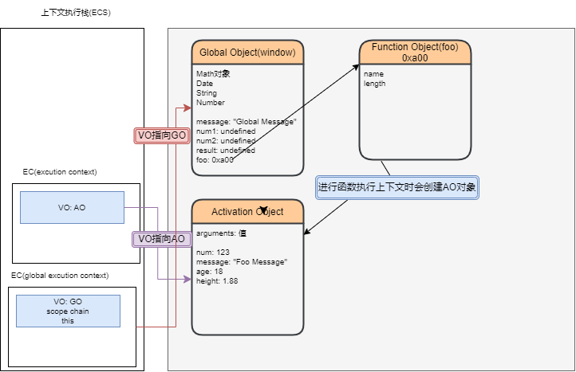
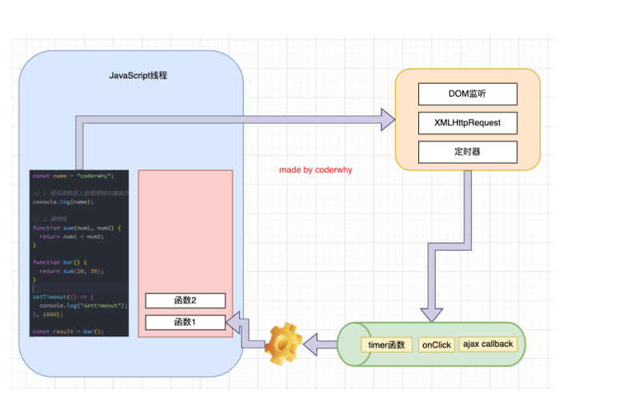

解释性语言：边读边解析

## 浏览器的工作原理

### 浏览器输入域名发生的事情

会经过dns服务器解析(dns是专门做域名解析的)生成对应的ip地址(服务器地址)，根据ip地址找到对应的服务器解析对应的静态资源index.html文件，如果遇到link标签会生成对应的.css文件，遇到script标签会生成对应的.js文件

### 浏览器内核

不同的浏览器有不同的内核

### 浏览器渲染过程

**HTMl在解析中如果遇到js代码，那么会停止HTML解析，去加载js代码**

**HTML和Css进行解析会生成Dom树和对应的css规则，二者结合会成生渲染树，并在浏览器生做对应的布局layout（宽高位置等）绘制Paint（颜色文本等）**

- 注意一：**link元素（css）不会阻塞DOM Tree的构建过程**，但是**会阻塞Render Tree(渲染树)的构建过程**

  - 这是因为Render Tree在构建时，需要对应的CSSOM Tree；
  - 如果dom tree解析完毕时link元素还没有解析完毕并挂载，浏览器可以会报错

- 注意二：**Render Tree和DOM Tree并不是一一对应的关系**，比如对于display为none的元素，压根不会出现在render tree中；

  > 当遇见js代码时，会进行阻塞Dom树的加载，需要先下载js文件对js脚本进行加载等加载完毕后才会继续解析HTML文件
  >
  > 这是因为JavaScript的作用之一就是操作DOM，并且可以修改DOM；
  > 如果我们等到DOM树构建完成并且渲染再执行JavaScript，会造成严重的回流和重绘，影响页面的性能；
  > 所以会在遇到script元素时，优先下载和执行JavaScript代码，再继续构建DOM树；

- 但是这个也往往会带来新的问题，特别是现代页面开发中：

  - 在目前的开发模式中（比如Vue、React），脚本往往比HTML页面更“重”，处理时间需要更长；
  - 所以会造成页面的解析阻塞，在脚本下载、执行完成之前，用户在界面上什么都看不到；

- **为了解决这个问题，script元素给我们提供了两个属性（attribute）：defer和async**。

#### defer属性

- defer 属性告诉浏览器**不要等待脚本下载**，而**继续解析HTML，构建DOM Tree。**
  - 脚本**会由浏览器来进行下载，但是不会阻塞DOM Tree**的构建过程；
  - 如果脚本提前下载好了，它会**等待DOM Tree构建完成，在DOMContentLoaded事件之前先执行defer中的代码；**
- **所以DOMContentLoaded总是会等待defer中的代码先执行完成**
- **另外多个带defer的脚本是可以保持正确的顺序执行的。**
- **从某种角度来说，defer可以提高页面的性能，并且推荐放到head元素中；**
- **注意：defer仅适用于外部脚本，对于script默认内容会被忽略。**

```js
<script defer src="./js/defer-demo.js"></script>
<script>
window.addEventListener("DOMContentLoaded",(=
console.log("DOMContentLoaded")
})
</script>
```

#### async属性

- **async 特性与 defer 有些类似，它也能够让脚本不阻塞页面。**

- **async是让一个脚本完全独立的：**

  > 独立：只要js文件下载完毕，立刻执行。这种操作比较危险，因为当js文件下载完毕可能dom树还没构建完成

  - 浏览器**不会因 async 脚本而阻塞**（与 defer 类似）；
  - **async脚本不能保证顺序，它是独立下载、独立运行，不会等待其他脚本；**
  - **async不会能保证在DOMContentLoaded之前或者之后执行；**

```js
<script>
window.addEventListener("DOMContentLoaded",(=
console.log("DOMContentLoaded")
})
</script>
<script async src="./js/async-demo.js"></script>
```

- **defer通常用于需要在文档解析后操作DOM的JavaScript代码，并且对多个script文件有顺序要求的；**
- **async通常用于独立的脚本，对其他脚本，甚至DOM没有依赖的**

#### 回流和重绘

- **理解回流reflow：（也可以称之为重排）**
  - 第一次确定节点的大小和位置，称之为布局（layout）。
  - 之后**对节点的大小、位置修改重新计算称之为回流。**
- 什么情况下引起回流呢？
  - 比如DOM结构发生改变（添加新的节点或者移除节点）；
  - 比如改变了布局（修改了width、height、padding、font-size等值）
  - 比如窗口resize（修改了窗口的尺寸等）
  - 比如调用getComputedStyle方法获取尺寸、位置信息；
- **理解重绘repaint：**
  - 第一次渲染内容称之为绘制（paint）。
  - 之后**重新渲染称之为重绘。**
- 什么情况下会引起重绘呢？
  - 比如修改背景色、文字颜色、边框颜色、样式等；
- **回流一定会引起重绘，所以回流是一件很消耗性能的事情。**
- 所以在开发中要尽量避免发生回流
  - 1.修改样式时**尽量一次性修改**
    - 比如通过cssText修改，比如通过添加class修改
  - 2.尽量**避免频繁的操作DOM**
    - 我们可以在一个DocumentFragment或者父元素中将要操作的DOM操作完成，再一次性的操作；
  - 3.尽量**避免通过getComputedStyle获取尺寸、位置**等信息；
  - 4.对**某些元素使用position的absolute或者fixed**
    - 并不是不会引起回流，而是开销相对较小，不会对其他元素造成影响。

#### 特殊解析 – composite合成

- **绘制的过程，可以将布局后的元素绘制到多个合成图层中。**
  - 这是浏览器的一种优化手段；
- **默认情况下，标准流中的内容都是被绘制在同一个图层（Layer）中的；**
- **而一些特殊的属性，会创建一个新的合成层（ CompositingLayer ），并且新的图层可以利用GPU来加速绘制；**
  - 因为**每个合成层都是单独渲染的**
- **那么哪些属性可以形成新的合成层呢？常见的一些属性：**
  -  3D transforms
  - video、canvas、iframe
  - opacity 动画转换时
  -  position: fixed
  - will-change：一个实验性的属性，提前告诉浏览器元素可能发生哪些变化；
  - animation 或 transition 设置了opacity、transform；
- **分层确实可以提高性能，但是它以内存管理为代价，因此不应作为 web 性能优化策略的一部分过度使用。**

---

### 为什么需要JavaScripti引擎呢？

- **高级的编程语言**都是需要转成**最终的机器指令来执行**的；


- 事实上我们编写的javaScript无论你交给**浏览器或者Node执行**，最后都是需要被**CPU执行**的；
- 但是CPU只认识自己的指令集，实际上是机器语言，才能被CPU所执行；
- 所以我们需要**JavaScript引擎**帮助我们将**javaScript代码**翻译成**CPU指令**来执行；


- 比较常见的javaScripti引擎有哪些呢？
  - **SpiderMonkey**:第一款JavaScript引擎，由Brendan Eich开发（也就是JavaScript作者）；
  - **Chakra**:微软开发，用于IT浏览器；
  - **JavaScriptCore**:WebKit中的JavaScript擎，Apple公司开发；
  - **V8**:Google开发的强大JavaScript引擎，也帮助Chrome从众多浏览器中脱颖而出；
  - 等等…

#### 浏览器内核和js引擎的关系

- 这里我们先以WebKit为例，WebKit事实上由两部分组成的：
  - **WebCore**：负责HTML解析、布局、渲染等等相关的工作；
  - **JavaScriptCore**:解析、执行javaScript代码；

#### v8引擎原理

- 官方定义
  - V8是用C++编写的Google开源高性能JavaScript和WebAssembly引擎，它用于Chrome和Node,js等。
  - 它实现**ECMAScript**和**WebAssembly**,并在Windows7或更高版本，macOS10.12+和使用x64,IA-32,ARM或MIPS处理器的Linux系统上运行。
  - **V8可以独立运行，也可以嵌入到任何C++应用程序中。**

> js原代码会被解析成**AST(抽象语法树)**，在由AST树转成字节码，在由字节码转成机器代码，之后执行

- V8引擎本身的源码**非常复杂**，大概有超过**100w行C++代码**，通过了解它的架构，我们可以知道它是如何对JavaScript执行的：
- **Parse**模块会将JavaScript代码**转换成AST(抽象语法树)**，这是因为解释器并不直接认识JavaScript代码；
  - 如果函数没有被调用，那么是不会被转换成AST的：
  - Parsel的V8官方文档：**https:lw8.dev/blog/scanner**
- **Ignition**是一个解释器，会将AST**转换成ByteCode(字节码)**
  - 同时会收集TurboFan优化所需要的信息（比如函数参数的类型信&，有了类型才能进行真实的运算）：
  - 如果函数只调用一次，Ignition会执行解释执行ByteCode;
  - Ignition的V8官方文档：https:lw8.dey/blog/ignition-interpreter
- **TurboFan**是一个编译器，可以**将字节码编译为CPU可以直接执行的机器码：**
  - 如果一个函数被多次调用，那么就会被标记为**热点函数**，那么就会经过**TurboFat转换成优化的机器码，提高代码的执行性能；**
  - 但是，**机器码实际上也会被还原为ByteCode**,这是因为如果后续执行函数的过程中，**类型发生了变化（比如sum函数原来执行的是number类型，后来执行变成了string类型)**，之前优化的机器码并不能正确的处理运算，就会逆向的转换成字节码；
  - TurboFan的V8官方文档：**https:lw8.dev/blog/turbofan-it**

#### v8执行的细节

- **那么我们的JavaScript源码是如何被解析（Parse过程)的呢？**
- Blink将源码交给V8引擎，Stream获取到源码并且进行编码转换；
- Scanner会进行**词法分析**(lexical analysis),词法分析会将代码转换成tokens;
- 接下来tokenss会被转换成AST树，经过Parser和PreParser:
  - Parser就是直接将tokens转成AST树架构；
  - PreParser称之为预解析，为什么需要**预解析**呢？
    - 这是因为并不是所有的JavaScript代码在一开始时就会被执行。那么对所有的JavaScript代码进行解析，必然会影响网页的运行效率；
    - 所以V8引擎就实现了**Lazy Parsing（延迟解析)**的方案，它的作用是**将不必要的函数进行预解析**，也就是只解析暂时需要的内容，而对**函数的全量解析**是在**函数被调用**时才会进行；
    - 比如我们在一个函数outerl内部定义了另外一个函数inner,那么inner函数就会进行预解析；

---

## 全局代码的执行过程

### 初始化全局对象

- js引擎会在**执行代码之前**，会在**堆内存中创建一个全局对象**：Global Object(GO)
  - 该对象**所有的作用域(scope)**都可以访问；
  - 里面会包含**Date、Array、String、Number、setTimeout、setInterval**等等；
  - 其中还有一个**window属性**指向自己；

  > 虽然全局对象在堆内存中，里面也有基本数据类型，但是在代码执行时，基本数据类型还是会被放在栈内存中，这是因为V8引擎给我们全局对象做了处理放在堆内存中可以暂时保存基本数据类型

### 执行上下文栈(执行代码的地方)

- js引擎内部有一个**执行上下文栈(Execution Context Stack,简称ECS)**,它是用于执行**代码的调用栈**
- 那么现在它要执行谁呢？执行的是**全局的代码块：**
  - 全局的代码块为了执行会构建一个**Global Execution Context(GEC);**
  - GEC会**被放入到ECS**中执行；
- GEC被放入到ECS中里面包含两部分内容：
  - 第一部分：在代码执行前，在**parser转成AST**的过程中，会将**全局定义的变量、函数**等加入到**GlobalObjec**t中，但是并**不会赋值**；
    - 这个过程也称之为**变量的作用域提升（**hoisting)
  - 第二部分：在代码执行中，对变量赋值，或者执行其他的函数

### 认识VO对象（Variable Object）

- 每一个执行上下文会关联一个**VO（Variable Object，变量对象），变量和函数声明**会被添加到这个VO对象中。

-  **当全局代码被执行的时候，VO就是GO对象了**

  > 在js中执行代码之前会在堆内存中创建一个全局对象(**Global Object(GO)**),在这个对象里可以访问到一些属性，只不过定义的属性都是undefiend，因为我们的代码还没有进行执行并没有进行赋值
  >
  >  在js引擎内部有一个执行上下文栈，每一个执行上下文都会关联到一个VO对象，当代码执行时VO会指向GO对象，这时候VO就成为GO了，这时候我们执行代码时就会把上下文的属性方法对GO里的值进行赋值

要是定义一个基本类型值时，它会在globalObject对象中生成一个undefine，执行代码执行到这个属性时才会进行赋值，否则就是undefine

如果定义的是一个引用类型值，那么这个函数引用类型会指向一个新的内存地址，会为这个函数开辟一个新的内存地址，在GlobalObject对象中指向的就是这个新的内存地址，所以函数是没有变量提升的

**函数执行完之后会从栈中销毁，正在执行的代码会在内存的最上方**

### 遇到函数的执行

- 在执行的过程中**执行到一个函数**时，就会根据函数体创建一个**函数执行上下文(Functional Execution Context,简称FEC**),并且压入到**EC Stack**中。

- **因为每个执行上下文都会关联一个VO，那么函数执行上下文关联的VO是什么呢？**

  - 当进入一个函数执行上下文时，会创建一个**AO对象（Activation Object）**；
  - 这个AO对象会**使用arguments作为初始化**，并且**初始值是传入的参数**；
  - 这个**AO对象会作为执行上下文的VO来存放变量的初始化**

- FEC中包含三部分内容：
  - 第一部分：在解析函数成为AST树结构时，**会创建一个Activation Object(AO):**
    - AO中包含形参、arguments、函数定义和指向函数对象、定义的变量；
  - 第二部分：作用域链：由VO(在函数中就是AO对象)和父级VO组成，查找时会一层层查找；

  > 函数在执行前会先在堆内存中创建一个AO(Activation Object)对象 里面存放这arguments 对应函数的形参 以及在函数中定义的变量 初始值为undefined
  >
  > VO会指向AO

> **只有函数声明才会在内存中提前创建出来,它为一个函数对象**

例子 :求输出接结果

```js
var message='小明'

function foo() {
  console.log(message);
}
foo()
function bar() {
  var message = '小红'
  foo()
}

bar()
```

当前的输出结果是**小明**这是因为在函数的作用域中，在把js原代码编译成AST抽象语法树的时候，文件会生成一个GlobalObject 对象，在函数编译阶段会生成一个新的函数内存地址，**函数的作用域链在编译创建阶段就已经被确定了**，如果当前函数作用域里没有就会像全局查找，查找的是小明，然后会执行代码，所以其实foo在被编译的时候指向的是小明，因为这个函数作用域链在执行阶段就已经被确定了，不是在执行阶段在确定

### 变量环境和记录

- 早期ECMA的版本规范

每一个执行上下文会被关联到一个变量环境(variable object,VO),在源代码中的变量和函数声明会被作为属性添加到VO中。对于函数来说，参数也会被添加到VO中。

- 在最新的ECMA的版本规范中，对于一些词汇进行了修收

每一个执行上下文会关联到一个变量环境(VariableEnvironment!中，在执行代码中变量和函数的声明会作为还填记录(Environment Record)添加到变量环境中
对于函数来说，参数也会被作为环境记录添加到变量环境中

> 在v8引擎中把js原代码编译成AST抽象语法树时，会有一个GlobalObject(GO)的全局对象,在这个全局对象中，有你定义的基本类型值和引用类型值，在编译过程中定义的基本类型值都为undefine,函数类型会在堆内存生成一个AO对象，里面存放这arguments 对应函数的形参 以及在函数中定义的变量 初始值为undefined，在AO中会有一个新的作用域，里面如果有基本类型值也是undefine,在作用域链中查找时的规则是：如果当前的作用域没有对应的属性会前往全局对象中查找，在我们代码被执行的时候会给基本类型值进行赋值
>
> 在执行函数时会创建一个函数的执行上下文，执行上下文里面有作用域和作用域链 
>
> AO是函数在代码指向前在堆内存中生成的，最后VO会指向AO,

### JavaScript的代码的执行流程

- 首先在执行前会现在堆内存中开辟一块空间(GO) 存放一些初始的值 如Number String等等
- 还有代码中定义的一些变量 函数(在parser转成AST树的过程中存放在GO中的 )并没有赋值
- 同时在执行代码时在执行上下文栈(ECS)中存放一个全局执行上下文(GEC) 用于执行代码
  - **GO中对应的函数 也会在堆内存中开辟出空间** 为 Function Object 初始一些数据(name length scope chain等)
- 开始执行代码
- **每个EC（执行上下文）中有着三个重要的内容(VO scope chain 以及this)**
- VO指向对应的作用域(全局作用域(GO) 函数作用域(AO))

> **总结：首先会在堆内存中生成一个全局对象GO并存放一些初始值，其中还有一个window对象指向自己，同时在语法分析转成AST的过程中也会将一些变量 函数 存放在GO中 只是变量的初始值为undefined，js引擎内部有一个执行上下文栈(Execution Context Stack,简称ECS),它是用于执行代码的调用栈，全局代码为了执行会创建一个全局执行上下文栈，会把定义的变量、函数加入到全局执行上下文中，在代码执行前并不会赋值，并且每一个执行上下文栈都会关联一个VO对象，这个VO在代码执行时会指向GO对象，然后开始执行代码进行赋值操作**
>
> **GO对象中的函数执行时会单独在堆内存中开辟一个AO函数对象，它的函数执行上下文也会关联到一个VO对象,这个VO会指向AO,最后执行代码，函数的作用域链在开辟函数对象的时候就已经被确定。**



### GO/AO/VO的理解以及作用域和作用域链的理解

GO

- Global Object JS代码在执行前会现在堆内存中创建一个全局对象(GO)
- 用于存放一些定义好的变量方法等包含Date Array String Number setTimeout等
- 同时有一个window属性指向自己
- 同时**在语法分析转成AST的过程中也会将一些变量 函数 存放在GO中 只是变量的初始值为undefined**

AO 

- 函数在执行前会先在堆内存中创建一个AO(Activation Object)对象 里面存放这arguments 对应函数的形参 以及在函数中定义的变量 初始值为undefined

VO

- Variable Object  在执行函数时 会在执行上下文栈(ECS)中进入一个函数执行上下文(FEC)其中有三个核心 核心之一是VO 指向的是该函数在内存中解析时创建的AO 而在全局执行上下文中指向的是GO

作用域,作用域链

- 当进入到一个执行上下文时 执行上下文会关联一个作用域链
- **通常作用域链在解析时就被确定 因此 作用域链域函数的定义位置有关 而与它的调用位置无关**

> 在ES6中VO名称变成了词法环境（Lexical Environments）

- 词法环境是一种规范类型，用于在词法嵌套结构中定义关联的变量、函数等标识符
- 一个词法环境是由环境记录（Environment Record）和一个外部词法环境（outer Lexical Environment）组成
- 一个词法环境经常用于关联一个函数声明、代码块语句、try-catch语句，当它们的代码被执行时，词法环境被创建出来
- 环境记录分为声明式环境记录和对象式环境记录
  - 声明式环境记录：声明性环境记录用于定义ECMAScript语言语法元素的效果，如函数声明、变量声明和直接将标识符绑定与ECMAScript语言值关联起来的Catch子句
  - 对象式环境记录：对象环境记录用于定义ECMAScript元素的效果，例如WithStatement，它将标识符绑定与某些对象的属性关联起来

## JS的内存管理和闭包

- JavaScript会在**定义变量**时为我们分配内存。
- 但是内存分配方式是一样的吗？
  - JS对于**基本数据类型内存的分配**会在执行时直接在栈空间进行分配：
  - JS对于**复杂数据类型内存的分配**会在堆内存中开辟一块空间，并且将这块空间的指针返回值变量引用

### JS的垃圾回收

- 因为**内存的大小是有限的**，所以当**内存不再需要的时候**，我们需要**对其进行释放**，以便**腾出更多的内存空间**。
- 在**手动管理内存的语言**中，我们需要通过**一些方式自己来释放不再需要的内存，比如free函数：**
  - 但是这种管理的方式其实**非常的低效**，影响我们**编写逻辑的代码的效率；**
  - 并且这种方式对**开发者的要求也很高**，并且**一不小心就会产生内存泄露**；
- 所以大部分**现代的编程语言都是有自己的垃圾回收机制**：
  - 垃圾回收的英文是**Garbage Collection**,简称**GC**;
  - 对于**那些不再使用的对象**，我们都称之为是**垃圾**，它需要被**回收**，以释放更多的内存空间；
  - 而我们的语言运行环境，比如Java的运行环境JVM,JavaScript的运行环境js引擎都会内存**垃圾回收器；**
  - **垃圾回收器**我们也会简称为**GC**,所以在很多地方你看到GC其实指的是垃圾回收器；

### 常见的GC算法-引用计数

在垃圾回收机制中其实是使用了GC算法来管理内存的问题

当一个对象有一个引用指向它时，那么这个对象的引用就+1，当一个对象的引用为0时，这个对象就可以被销
毁掉；
这个算法有一个很大的弊端就是会产生循环引用；

### 常见的GC算法-标记清除

标记清除的核心思路是**可达性（Reachability）**

这个算法是设置一个**根对象(root object)（window）,垃圾回收器**会定期**从这个根**开始，找所有从根开始**有引用到的对象**，对于那些**没有引用到的对象，就认为是不可用的对象,进行清除**；
这个算法**可以很好的解决循环引用**的问题；

> JS引擎比较广泛的采用的就是标记清除算法，当然类似于V8引擎为了进行更好的优化，它在算法的实现细节上也会结合一些其他的算法。

### 常见的GC算法 – 其他算法优化补充

- JS引擎比较广泛的采用的就是可达性中的标记清除算法，当然类似于V8引擎为了**进行更好的优化**，它在算法的实现细节上也会结合一些其他的算法。
- **标记整理（Mark-Compact）** 和“标记－清除”相似；
  - 不同的是，回收期间同时会将保留的存储对象**搬运汇集到连续的内存空间**，从而**整合空闲空间，避免内存碎片化；**
- **分代收集（Generational collection）**—— 对象被分成两组**：“新的”和“旧的”。**
  - 许多对象出现，完成它们的工作并很快死去，它们可以**很快被清理；**
  - 那些长期存活的对象会变得“**老旧**”，而且**被检查的频次也会减少；**
- **增量收集（Incremental collection）**
  - 如果有许多对象，并且我们**试图一次遍历并标记整个对象集，则可能需要一些时间，并在执行过程中带来明显的延迟。**
  - 所以引擎试图**将垃圾收集工作分成几部分来做**，然后**将这几部分会逐一进行处理，这样会有许多微小的延迟而不是一个大的延迟；**
- **闲时收集（Idle-time collection）**
  - 垃圾收集器**只会在 CPU 空闲时尝试运行，以减少可能对代码执行**的影响。

### 闭包

- 函数和方法的区别

  其实它们本质上时一样的，只不过在不同的使用场景叫法不一样，函数在单独定义时那么我们称为函数

  当我们的一个函数属于某个对象时，我们称这个函数是这个对象的方法

#### 数组的高阶函数

1.*1.filter：过滤，有返回值是个布尔值  默认返回true 返回值为true就是返回你判断正确的结果*

大部分该节函数有3个参数，  第一个item 数组的每一项  第二个index 返回查找下标  第三个数组本身

```js
var nums = [10, 20, 1, 5, 9, 7]
```

```js
var newNums1 = nums.filter((item, index,slef) => {
  return    item%2===0
})
console.log(newNums1);
```

2.*2.map：映射  参数同样有3个 有返回值  可以对原数组进行加减等操作*

```js
var newNums2 = nums.map((item) => {
  return item*2
})
```

3.*3.find/findIndex:find可以用于查找，查找数组里的某一项并返回  findIndex返回的是下标*

```js
var p = [
  {name:'小明',age:10},
  {name:'小红',age:30},
  {name:'小军',age:20},
 
]
var newP = p.find((item) => {
    //如果不写return 默认返回undefined,
  return item.name==='小军'
})
console.log(newP);
var newP2= p.findIndex((item) => {
  return item.age===30
})
```

4..forEach:遍历  遍历里面的每一项 没有返回值

```js
nums.forEach((item) => {
  console.log(  item*2);
})
```

5.*5.reduce 用于累加 第一个参数为上一个item ,第二个参数是每一项,函数里可以有第二个参数，可以为初始值指定一个值*

```js
var newNums = nums.reduce((preIten, item) => {
  return preIten*item
}, 1)
```

####  闭包的定义

- 这里先来看一下闭包的定义，分成两个：在计算机科学中和在lavaScript中。
- 在计算机科学中对闭包的定义（**维基百科**)：
  - 闭包（英语：Closure),又称**词法闭包(Lexical Closure)**或**函数闭包(function closures);**
  - 是在支持**头等函数**的编程语言中，实现词法绑定的一种技术：
  - 闭包在实现上是一个结构体，它存储了一个函数和一个关联的环境（相当于一个符号查找表）；
  - 闭包跟函数最大的区别在于，当捕捉闭包的时候，它的**自由变量**会在捕捉时被确定，这样即使脱离了捕捉时的上下文，它也能照常运行；
- 闭包的概念出现于60年代，最早实现闭包的程序是Scheme,那么我们就可以理解为什么JavaScript中有闭包：
  - 因为JavaScript中有大量的设计是来源于Schemel的；
- 我们再来看一下**MDN**对avaScript闭包的解释：
  - 一个函数和对其周围状态**(lexical environment,词法环境)**的引用捆绑在一起（或者说函数被引用包围），这样的组合就是**闭包(closure)**;
  - **也就是说，闭包让你可以在一个内层函数中访问到其外层函数的作用域**：
  - 在JavaScript中，每当创建一个函数，闭包就会在函数创建的同时被创建出来；
- 那么我的理解和总结：
  - 一个普通的函数function,如果它可以访问外层作用域的自由变量，那么这个函数就是一个闭包：
  - 从广义的角度来说：JavaScript中的函数都是闭包；
  - 从狭义的角度来说：**JavaScript中一个函数，如果访问了外层作用域的变量，那么它是一个闭包**：

闭包是2部分组成：**函数+可以访问的自由变量**

**在内函数里可以访问到外函数作用域中的变量，在外函数中被执行时它作用域中的变量本该被销毁，但是现在可以由内函数访问到，这时候就形成了闭包**

#### 闭包的内存泄露

在形成闭包时在函数里指向那个自由变量是不会销毁的这样容易造成内存泄露的问题

之所以不会销毁是因为，在我们函数指向这个自由变量的时候，这个自由变量是有引用的，因为它被其他函数引用这所以并不会被销毁会一直在内存中。

我们可以给函数赋值为null这样就可以把内存给释放，因为如果当前函数为null那么我们就不会引用带自由变量，所以原来的函数和变量就会被销毁

## JS函数中的this指向

- 开发中很少直接在全局作用于下去使用this,通常都是在**函数中使用。**
  - 所有的函数在被调用时，都会创建一个执行上下文
  - 这个上下文中记录着函数的调用栈、AO对象等；
  - this也是其中的一条记录；

- 函数在调用时，JavaScript会默认给this绑定一个值：
- this的绑定和定义的位置（编写的位置）没有关系；
- **this的绑定和调用方式以及调用的位置有关系**
- this是在运行时被绑定的；

### this的绑定规则

**绑定一：默认绑定；**

> 独立函数( foo()) 调用，指向window
>
> 严格模式下会是undefined
>
> 独立的函数调用可以理解成函数没有被绑定到某个对象上进行调用；

**绑定二：隐式绑定**

> object对象会被js引擎绑定到fn函数中的this里面
>
> **通过某个对象调用  指向当前的对象**
>
> 也就是它的调用位置中，是通过某个对象发起的函数调用。

**绑定三：显式绑定；**

- 隐式绑定有一个前提条件：

  - 必须**在调用的对象内部有一个对函数的引用**（比如一个属性）：
  - 如果没有这样的引用，在进行调用时，会报找不到该函数的错误；

  - 正是通过这个引用，间接的将this绑定到了这个对象上：

- 如果我们不希望在**对象内部**包含这个**函数的引用**，同时又希望在这个对象上**进行强制调用**，该怎么做呢？

  - JavaScript所有的函数都可以使用**call和apply方法**（这个和Prototype有关）。
    √它们两个的区别这里不再展开；
    √其实非常简单，**第一个参数是相同的，后面的参数为了传入函数额外的实参，apply为数组，call为参数列表；**
  - 这两个函数的第一个参数都要求是一个对象，这个对象的作用是什么呢？就是给this准备的。
  - **在调用这个函数时，会将this绑定到这个传入的对象上。**
  - **call和apply可以指定this的绑定对象**

  >  因为上面的过程，我们明确的绑定了this指向的对象，所以称之为 显式绑定。

```js
func.apply(thisArg,[argsArray])
function.call(thisArg,argl,arg2,··.)
```

***call、apply、bind***

- **通过call或者apply绑定this对象**

  - 显示绑定后，this就会明确的指向绑定的对象

- **如果我们希望一个函数总是显示的绑定到一个对象上，可以怎么做呢？**

  - 使用bind方法，bind() 方法创建一个**新的绑定函数（bound function，BF）**；
  - 绑定函数是一个 **exotic function object（怪异函数对象，ECMAScript 2015 中的术语）**
  - 在 bind() 被调用时，这个新函数的 this 被指定为 bind() 的第一个参数，而其余参数将作为新函数的参数，供调用时使用。
  - **call、apply都是直接调用，bind会返回一个新函数，这个新函数的 this 会一直被指定为 bind() 的第一个参数**

  ```js
  function.bind(thisArg[,argl[,arg2[,...]]]
  ```

**绑定四：new绑定；**

我们通过一个new关键字调用一个函数时（构造器），这个时候this是在调用这个构造器时创建出来的对象
this=创建出来的对象
这个绑定过程就是new绑定

### 规则的优先级

- .默认规则的优先级最低
  - 毫无疑问，默认规则的优先级是最低的，因为存在其他规则时，就会通过其他规则的方式来绑定this
- 显示绑定优先级高于隐式绑定
  - new绑定优先级高于隐式绑定
- new的优先级高于显示绑定
  - new绑定和call、apply是不允许同时使用的，所以不存在谁的优先级更高
  - new绑定可以和bind一起使用，new绑定优先级更高
    - bind的优先级高于apply和call

> new > bind > apply/call > 隐式绑定 > 默认绑定

在this规则中也要一些特殊的规则

**1.忽略显示绑定**

当有显示绑定时，传入的时**null**或者**undefied**时它会把当前的绑定绑定到**window**

**2.间接函数引用**

另外一种情况，创建一个函数的间接引用，这种情况使用默认绑定规则。
赋值(obj2.foo=obj1.foo)的结果是foo函数；
foo函数被直接调用，那么是默认绑定；

**3.箭头函数**

箭头函数是ES6之后增加的一种编写函数的方法，并且它比函数表达式要更加简洁：
箭头函数**不会绑定this、arguments)属性**；

箭头函数是**没有显式原型prototype**的，所以不能作为构造函数，使用new来创建对象；
箭头函数**也不绑定this、arguments、super参数；**

>  根据外层作用域来决定this

箭头函数**不能作为构造函数来使用**（不能和new一起来使用，会抛出错误）；

**箭头函数的编写优化**

- 优化一: 如果只有一个参数()可以省略
- 优化二: 如果函数执行体中只有一行代码, 那么可以省略大括号
  -  并且这行代码的返回值会作为整个函数的返回值
- 优化三: 如果函数执行体只有返回一个对象, 那么需要给这个对象加上()

this面试题可以看coderwhy公众号

### JS模拟实现call,apply,bind


## JS函数式编程

- 我们知道JavaScript中函数也是一个对象，那么对象中就可以有属性和方法。
- 属性name：一个函数的名词我们可以通过name来访问；
- 属性length：属性length用于返回函数参数的个数；
  - rest（剩余参数）参数是不参与参数的个数的；

### arguments类数组

arguments是个类数组，本质其实是个对象，作用和ES6中剩余参数差不多，可以接受外界传来的参数，因为它是个类数组所以它有length长度可以获取数组的长度，还可以通过数组的下标获取对应的值

意味着它不是一个数组类型，而是一个对象类型
但是它却拥有数组的一些特性，比如说length,比如可以通过index索引来访问；
但是它却没有数组的一些方法，比如forEach、map等；

```js
function foo(a, b) {
    //获取参数，返回的是类数组
    console.log(arguments);
    //1.获取当前数组的长度
    console.log(arguments.length);
    //2.通过下标访问
    console.log(arguments[1]);
    //callee可以获取当前arguments所在的函数
    console.log(arguments.callee);
    // arguments.callee()
    
     //使用Array.from() 把arguments转成数组，可以使用数组的方法
    var arr4 = Array.from(arguments)
    console.log(arr4);
}

foo(22,33,22,55,11)
```

在有些时候我们希望arguments可使用数组方法我们可以使用Array.from(arguments)来把arguments转换成数组，这样就可以使用数组的方法了

- **arguments转Array**
  - 转化方式一：
    - 遍历arguments，添加到一个新数组中；
  - 转化方式二：较难理解（有点绕），了解即可
    - 调用数组slice函数的call方法；
  - 转化方式三：ES6中的两个方法
    - Array.from
    - […arguments]

在箭头函数中没有arguments,它会向上层作用域查找，在ES6推荐在箭头函数中使用剩余参数来接受参数

### 剩余(rest)参数

最后一个参数是 ... 为前缀的，那么它会将剩余的参数放到该参数中，并且作为一个数组；

- 那么剩余参数和arguments有什么区别呢？
  - 剩余参数只包含那些**没有对应形参的实参**，而 **arguments 对象包含了传给函数的所有实参；**
  - **arguments对象不是一个真正的数组**，而**rest参数是一个真正的数组，**可以进行数组的所有操作；
  - arguments是**早期的ECMAScript**中为了方便去获取所有的参数提供的一个数据结构，而rest参数是**ES6中**提供并且希望以此来替代arguments的；
- **剩余参数必须放到最后一个位置，否则会报错。**

### 理解JS纯函数

- **函数式编程**中有一个非常重要的概念叫**纯函数**，JavaScript符合**函数式编程的范式**，所以也有**纯函数的概念**，
  - 在**react开发中纯函数是被多次提及**的；
  - 比如**reactr中组件就被要求像是一个纯函数**（为什么是像，因为还有class组件），**redux中有一个reducer的概念**，也是要求必须是一个纯函数；
  - 所以**掌握纯函数对于理解很多框架的设计**是非常有帮助的；
- **纯函数的维基百科定义**：
  - 在程序设计中，若一个函数**符合以下条件**，那么这个函数被称为纯函数：
  - 此函数**在相同的输入值时**，需**产生相同的输出**。
  - 函数的**输出和输入值以外的其他隐藏信息或状态无关**，也和**由I/O设备产生的外部输出**无关。
  - 该函数**不能有语义上可观察的函数副作用**，诸如**“触发事件”，使输出设备输出，或更改输出值以外物件的内容**等。

- **当然上面的定义会过于的晦涩，所以简单总结一下：**
  - **确定的输入，一定会产生确定的输出：**
    - 函数调用时输入什么，那么返回时就要输出什么
  - **函数在执行过程中，不能产生副作用：**

- 副作用理解：
  - **副作用(side effect)**其实本身是医学的一个概念，比如我们经常说吃什么药本来是为了治病，可能会产生一些其他的副作用；
  - 在计算机科学中，也引用了副作用的概念，表示在**执行一个函数**时，除了**返回函数值**之外，还对**调用函数产生了附加的影响**，比如**修改了全局变量，修改参数或改变外部的存储；**
- **纯函数在执行的过程中就是不能产生这样的副作用**：
  - 副作用往往是产生**bug的"温床”**。

比如数组的2个方法

```js
var arrNums = ['acj', 'aaa', 'jiij', 'xcnusu', 'cjsi']
 //不会改变原数组，输入是什么，输出就是什么，所以它是纯函数
var newNums = arrNums.slice(1,3)  //不会改变原数组 ,不会包含最后一项

  //会改变原数组，所以它不是纯函数
 var newNums=arrNums.splice(1,3)   //截取的会包含最后一项
console.log(newNums);
  
console.log(arrNums);
```

### 纯函数的好处

- **为什么纯函数在函数式编程中非常重要呢**？
- 因为你可以**安心的编写**和**安心的使用**：
  - 你在**写的时候**保证了函数的纯度，只是**单纯实现自己的业务逻辑**即可，**不需要关心传入的内容**是如何获得的或者**依赖其他的外部变量**是否已经发生了修改；
  
- 你在**用的时候**，你确定**你的输入内容不会被任意篡改**，并且**自己确定的输入**，一定会**有确定的输出**；

 ### JS柯里化

- **柯里化**也是属于**函数式编程**里面一个非常重要的概念。
- **我们先来看一下维基百科的解释：**
  - 在计算机科学中，**柯里化**（英语：Currying),又译为**卡瑞化**或**加里化**；
  - 是把接收**多个参数的函数**，变成**接受一个单一参数**（最初函数的第一个参数）的函数，并且**返回接受余下的参数**，而且**返回结果的新函数**的技术；
  - 柯里化声称“**如果你固定某些参数，你将得到接受佘下参数的一个函数**”；

- **维基百科的结束非常的抽象，这里做一个总结**：
  - 只**传递给函数一部分参数来调用它**，让**它返回一个函数去处理剩余的参数**；
  - **这个过程就称之为柯里化**；

```js
//末柯里化的函数
function add1(x,y,z){
return x +y z
]
console.Log(add1(10,20,30))
//柯里化处理的函数
function add2(x){
    return function(y){
        return function(z){
            return x+y+ z
        }
    } 
}
console.log(add2(10)(20)(30))
```

> 就是一个函数要求返回另一个函数，第一个参数要求处理一个参数，剩余的参数交给返回的函数去处理
>
> 这个转化的过程就叫做柯里化

可以使用箭头函数简化柯里化的过程

```js
var add2 = x => y => z=> {
     return x+y+z
}
console.log(add2(10)(20)(30));
```

- **那么为什么需要有柯里化呢？**
  - 在函数式编程中，我们其实往往希望**一个函数处理的问题尽可能的单一**，而**不是将一大堆的处理过程交给一个函数来处理；**
  - 那么**我们是否就可以将每次传入的参数在单一的函数中进行处理，**处理完后在**下一个函数中再使用处理后的结果；**

### 组合函数

- **组合(Compose)函数是**在JavaScript开发过程中一种对**函数的使用技巧、模式**：
  - 比如我们现在需要对**某一个数据**进行**函数的调用**，执行**两个函数fn1和fn2**,这**两个函数是依次执行**的；
  - 那么如果每次我们都需要**进行两个函数的调用，操作上就会显得重复**：
  - 那么**是否可以将这两个函数组合起来，自动依次调用**呢？
  - 这个过程就是**对函数的组合**，我们称之为**组合函数(Compose Function);**

with语句也是有作用域的，只不过现在不推荐就使用，在严格模式下会报错

eval函数 可以把字符串转换成js代码

- **内建函数 eval 允许执行一个代码字符串。**
  - eval是一个特殊的函数，它可以将传入的字符串当做JavaScript代码来运行；
  - eval会将最后一句执行语句的结果，作为返回值；


- 不建议在开发中使用eval:
  - eval代码的可读性非常的差（代码的可读性是高质量代码的重要原则）；
  - eval是一个字符串，那么有可能在执行的过程中被刻意篡改，那么可能会造成被攻击的风险；
  - eval的执行必须经过S解释器，不能被Js引擎优化；

### 严格模式

- 在ECMAScript5标准中，JavaScript提出了严格模式的概念(Strict Mode):
  - 严格模式很好理解，是一种**具有限制性的JvaScript模式**，从而使**代码隐式的脱离了”懒散(sloppy)模式**“，
  - **支持严格模式的浏览器**在检测到代码中有严格模式时，会**以更加严格的方式对代码进行检测和执行**；

- 严格模式对正常的)avaScripti语义进行了一些限制：
  - 严格模式通过**抛出错误**来消除一些原有的**静默(silent)**错误；
  - 严格模式让**JS引擎在执行代码时可以进行更多的优化（**不需要对一些特殊的语法进行处理）
  - 严格模式禁用了**在ECMAScript未来版本中可能会定义的一些语法**；

开启严格模式

可以在整个文件中使用`"use strict"`开启严格模式，也可以单独在一个函数中开启严格模式

- 严格模式限制

  **1.无法意外的创建全局变量**
  **2.严格模式会使引起静默失败(silently fail,,注：不报错也有任何效果)的赋值操作抛出异常**
  **3.严格模式下试图删除不可删除的属性**
  **4严格模式不允许函数参数有相同的名称**
  **5.不允许0的八进制语法**
  **6.在严格模式下，不允许使用with**
  **7.在严格模式下，eval不再为上层引用变量**
  **8.严格模式下，this绑定不会默认转成对象**

## JS面对对象

### 面向对象是现实的抽象方式

- 对象是JavaScript中一个非常重要的概念，这是因为对象可以**将多个相关联的数据封装到一起**，更好的**描述一个事物：**
  - **比如我们可以描述一辆车**：Car,具有颜色(color)、速度(speed)、品牌(brand)、价格(price),行驶(travel)等等；
  - **比如我们可以描述一个人**：Person,具有姓名(name)、年龄(age)、身高(height),吃东西(eat)、跑步(run)
    等等；
- 用**对象来描述事物**，更有利于我们**将现实的事物**，抽离成代码中**某个数据结构**：
  - 所以有一些编程语言就是纯面向对象的编程语言，比Java;
  - 你在实现任何现实抽象时都需要先创建一个类，根据类再去创建对象；

### JS的面对对象

- JavaScript其实支持多种编程范式的，包括**函数式编程和面向对象编程**：
  - JavaScript中的对象被设计成一组**属性的无序集合**，像是一个**哈希表**，有key和value组成：
  - **key是一个标识符名称，value可以是任意类型**，也可以是**其他对象或者函数类型；**
  - 如果值**是一个函数**，那么我们可以称之为是**对象的方法**：
- **如何创建一个对象呢？**
- 早期使用创建对象的方式最多的是**使用Object类，**并且**使用new关键字**来创建一个对象：
  - 这是因为早期很多JavaScript开发者是从Java过来的，它们也更习惯于Java中通过new的方式创建一个对象；：
- 后来很多开发者为了方便起见，都是直接**通过字面量的形式来创建对象**：
  - 这种形式看起来更加的简洁，并且对象和属性之间的内聚性也更强，所以这种方式后来就流行了起来：

### 对属性操作控制

- 在前面我们的属性都是**直接定义在对象内部**，或者**直接添加到对象内部的**：
  - 但是这样来做的时候我们就**不能对这个属性进行一些限制**：比如**这个属性是否是可以通过delete删除**的？这个属性**是否在for-in遍历的时候被遍历出来**呢？

- 如果我们想要对**一个属性进行比较精准的操作控制**，那么我们就可以使用**属性描述符。**
  - 通过属性描述符**可以精准的添加或修改对象的属性；**
  - 属性描述符需要使用**Object.defineProperty**来对属性进行添加或者修改；

### Object.defineProperty

- Object.defineProperty0方法会直接在一个对象上定义一个新属性，或者修改一个对象的现有属性，并返回此
  对象。
- 可接收三个参数：
  - obj要定义属性的对象：
  - prop要定义或修改的属性的名称或Symbol;
  - descriptor要定义或修改的属性描述符；
- 返回值：
  - 被传递给函数的对象。

- **属性描述符的类型**有两种：
  - **数据属性(Data Properties)描述符(Descriptor);**
  - **存取属性(Accessor访问器Properties)描述符（Descriptor)**;

### 数据属性描述符

- **数据数据描述符有如下四个特性**：
- **[Configurable]**:表示属性**是否可以通过delete删除属性，是否可以修改它的特性**，或者是否可以将它修改为存取属性描述符；
  - 当我们直接在一个对象上定义某个属性时，这个属性的[[Configurable]为true:
  - 当我们通过属性描述符定义一个属性时，这个属性的[Configurable]默认为false;
- **[Enumerable]】**:表示**属性是否可以通过for-in或者Object.keys()返回该属性**；
  - 当我们直接在一个对象上定义某个属性时，这个属性的[Enumerable]为true;
  - 当我们通过属性描述符定义一个属性时，这个属性的[Enumerable]默认为false;
- **[Writable]**:表示**是否可以修改属性的值**：
  - 当我们直接在一个对象上定义某个属性时，这个属性的[Vritable]为true:
  - 当我们通过属性描述符定义一个属性时，这个属性的[Writable]默认为false;
- **[value]】**:**属性的value值，读取属性时会返回该值，修改属性时，会对其进行修改**；
  - 默认情况下这个值是undefined;

### 存取属性描述符

- **存取属性描述符有如下四个特性：**前2个和数据属性描述符是一样的

- **[Configurable]**:

- **[Enumerable]】**

- [get]:获取属性时会执行的函数。默认为undefined

- [set]:设置属性时会执行的函数。默认为undefined

数据属性操作符

```js
var obj = {
  name: 'kkk',
  age:20
}
 //第一个参数是获取的对象，第二个是添加的属性，第三个参数是属性操作符，分为数据属性操作和存取属性操作
Object.defineProperty(obj, 'address', {
  //value可以为添加的属性赋值，默认是undefiend
  value: '北京市',
  //configurable,决定了是否可以对属性做出配置比如对属性进行删除等操作，默认值是false
  configurable: true,
  //enumerable决定了属性是否可以被遍历获取到值，默认值是false
  enumerable: true,
  //writable决定了属性是否可以被更改，默认是false
  writable:true
})
```

存取属性操作符

```js

//1.隐藏某一私有属性并希望直接被外界使用和赋值
//2.如果我们希望截获某一个属性它访问和设置值的过程时，也会使用存储属性
Object.defineProperty(obj, 'address', {
  configurable: true,
  enumerable: true,
  //在get中进行依赖的收集,this就是obj，会自定调用这个函数
  get() {
    //这里我们把address使用this指向了_address，相当于把_address隐藏了以后使用address可以代替_address
     return this._address
  },
  //set可以把属性进行更改
  set(value) {
    return this._address=value
  }
})

```

- Object.defineProperties()方法直接在一个对象上定义多个新的属性或修改现有属性，并且返回该对象。

```js
var obj = {}
//第二个参数为对象，key是属性名，在对象里可以进行配置
Object.defineProperties(obj, {
  name: {
    value: 'aaa',
    configurable: true,
    enumerable:true
  }
})
```

### 对象方法的补充·

- 获取对象的属性描述符：
  - getOwnPropertyDescriptor
  - getOwnPropertyDescriptors   
- 禁止对象扩展新属性**：preventExtensions**
  - 给一个对象添加新的属性会失败（在严格模式下会报错
- 密封对象，不允许配置和删除属性：**Seal**
  - 实际是调用preventExtensions
  - 并且将现有属性的configurable:fase
- 冻结对象，不允许修改现有属性：**freeze**
  - 实际上是调用seal
  - 并且将现有属性的writable:'fase

### 创建对象的方案-工厂模式

可以使用函数的传参的方式解决，代码的重复问题

### 构造函数

构造函数也称之为构造器(**constructor**),通常是我们在创建对象时会调用的函数
在其他面向的编程语言里面，构造函数是存在于类中的一个方法，称之为构造方法；
但是JavaScriptr中的构造函数有点不太一样

构造函数也是一个普通的函数，从表现形式来说，和千千万万个普通的函数没有任何区别；
那么如果这么一个**普通的函数被使用new操作符来调用**了，**那么这个函数就称之为是一个构造函数；**

- **如果一个函数被使用new操作符调用了，那么它会执行如下操作**：
  - 1.在内存中创建一个新的对象（空对象)；
  - 2.这个对象内部的[prototype]属性会被赋值为该构造函数的prototype属性；
  - 3.构造函数内部的this,会指向创建出来的新对象：
  - 4.执行函数的内部代码（函数体代码）；
  - 5.如果构造函数没有返回非空对象，则返回创建出来的新对象；

缺点：

构造函数也是有缺点的，它在于我们需要为每个对象的函数去**创建一个函数对象实例**：

### 认识对象的原型(隐式原型`__proto_`_)

- JavaScript当中每个对象都有一个特殊的内置属性[prototype]],这个特殊的对象可以指向另外一个对象。
- 那么这个对象有什么用呢？
  - **当我们通过引用对象的属性key来获取一个value时，它会触发[Get]的操作；**
  - **这个操作会首先检查该属性是否有对应的属性，如果有的话就使用它：**
  - **如果对象中没有该属性，那么会访问对象[prototype]内置属性指向的对象上的属性；**
- 那么如果通过字面量直接创建一个对象，这个对象也会有这样的属性吗？如果有，应该如何获取这个属性呢？
  - 答案是有的，只要是对象都会有这样的一个内置属性；
- 获取的方式有两种：
  - 方式一：通过对象的_proto__属性可以获取到（但是这个是早期浏览器自己添加的，存在一定的兼容性问
    题)；
  - 方式二：通过**Object.getPrototypeOf**方法可以获取到；

### 函数的原型(显示原型prototype)

：所有的函数都有一个prototype的属性（注意：不是`__proto__`）

函数的隐式原型（`__proto__`）是new Function(),因为函数也是一个对象

相当于 使用 new Function() 创造出来一个对象

**因为：使用new操作符创建对象时，这个对象内部的[prototype]属性会被赋值为该构造函数的prototype属性**

**所以相当于这个对象的隐式原型会指向构造函数的显式原型**

**相等的关系**

`obj.__proto__ === Person.prototype`

```js
 function foo(){
  console.log('foo');
}
console.log(foo.prototype);
```

> **这里打印原型对象会是个空对象，其实不然，它内部还有个constructor属性，这个constructor指向当前的函数对象；因为他内部是把enumerable设置为false是不可枚举的所以是为空**

- 事实上原型对象上面是有一个属性的：constructor
  - 默认情况下原型上都会添加一个属性叫做constructor，**这个constructor指向当前的函数对象；**


- 重写原型对象

  如果我们需要在原型上添加过多的属性，通常我们会重新整个原型对象：

```js
foo.prototype = {
  name: '小明',
  age: 20,
  heightL:1.99
}  
```

> 前面我们说过，每创建一个函数，就会同时创建它的prototype对象，这个对象也会自动获取constructor属性；
> 而我们这里相当于给prototyp重新赋值了一个对象，那么这个新对象的constructor属性，**会指向Object构造函数，**而不是Person构造函数了

**原型对象的constructor**

- 如果希望constructor指向Person，那么可以手动添加：

- 上面的方式虽然可以, 但是也会造成constructor的[[Enumerable]]特性被设置了true.

  - 默认情况下, 原生的constructor属性是不可枚举的.
  - 如果希望解决这个问题, 就可以使用我们前面介绍的Object.defineProperty()函数了.

  ```js
  Person.prototype = { 
  constructor:Person,
  name:"why",
  age:~18,
  eating:function()
  console.log(this.name+"在吃东西~")}

  Object.defineProperty(Person.prototype,"constructor",{
  enumerable:false,
  value:Person
  }
  )
  ```

### 面向对象的特性-继承

- 面向对象有三大特性：封装、继承、多态
  - 封装：我们前面将属性和方法封装到一个类中，可以称之为封装的过程；
  - 继承：继承是面向对象中非常重要的，不仅仅可以减少重复代码的数量，也是多态前提（纯面向对象中）；
    - **继承可以帮助我们将重复的代码和逻辑抽取到父类中，子类只需要直接继承过来使用即可。**
  - 多态：不同的对象在执行时表现出不同的形态；

#### 原型链

- **当我们查找一个对象上的属性时，如果在这个对象上没有找到，会往原型上进行查找，在原型上没有查找到，会接着往原型对象的原型上进行查找，直到查找到顶层原型对象Object.prototype**

- 每个被创建出来的对象都有一个默认原型的，可以使用`__proto__`来获取到默认的原型，其实在默认原型上还可以使用`__propt_`_获取原型，也就是说默认原型上还是有原型的，在原型查找中我们查找的顶层原型是`Object.prototype`,它是我们所有对象的顶层原型，

**Object的原型**

- 那么什么地方是原型链的尽头呢？比如第三个对象是否也是有原型`__proto__`属性呢？

  ```js
  console.log(obj.__proto__.__proto__.__proto__.__proto__)//[Object:null prototype][
  ```

- **我们会发现它打印的是 [Object: null prototype] {}**

  - 事实上这个原型就是我们最顶层的原型了
  - 从Object直接创建出来的对象的原型都是 [Object: null prototype] {}。

-  **那么我们可能会问题： [Object: null prototype] {} 原型有什么特殊吗？**

  - 特殊一：**该对象有原型属性**，但是它的原型属性已经指向的是null，也就是已经是顶层原型了；

  - 特殊二：**该对象上有很多默认的属性和方法**

**顶层原型为 [Object: null prototype] {}**

- 从我们上面的Object原型我们可以得出一个结论**：原型链最顶层的原型对象就是Object的原型对象(null)**

>  **原型对象默认创建时，隐式原型都是指向Object的显式原型的**(Object=null)

#### 1.通过原型链实现继承

- 有些时候我们代码会重复，这时候我们可以用继承的方式实现代码的复用

```js
//公共父类
function Person() {
  this.name='lwy'
}

Person.prototype.eating = function () {
  console.log(this.name+'正在吃东西');
}

//子类
function Student() {
  this.son=111
}
Student.prototype = new Person()
Student.prototype.studying = function () {
  console.log(this.name+'正在学习');
}

var stu = new Student()
console.log(stu.__proto__.__proto__.__proto__);

// console.log(stu.name);
// stu.eating()
stu.studying()

```

通过原型链的方式主要是使用`Student.prototype = new Person()`来实现继承，这里把Student的原型指向了Person，这样就可以访问到它上面的属性方法了

- 但是目前有一个很大的弊端：某些属性其实是保存在 对象上的；
  - 第一，我们通过直接打印对象是看不到这个属性的：
  - 第二，这个属性会被多个对象共享，如果这个对象是一个引用类型，那么就会造成问题；
  - 第三，不能给Person传递参数，因为这个对象是一次性创建的（没办法定制化）；

#### 2.借用构造函数继承

- 为了解决原型链继承中存在的问题，开发人员提供了一种新的技术：constructor stealing(有很多名称：借用构造函数或者称之为经典继承或者称之为伪造对象)：
  - steal是偷窃、剽窃的意思，但是这里可以翻译成借用；
- 借用继承的做法非常简单：**在子类型构造函数的内部调用父类型构造函数.**
  - 因为函数可以在任意的时刻被调用：
  - **因此通过apply()和call()方法也可以在新创建的对象上执行构造函数；**

```js
//公共父类
function Person(name,age) {
  this.name = name
  this.age=age
}

Person.prototype.eating = function () {
  console.log(this.name+'正在吃东西');
}

//子类
function Student(name, age) {
    //把父类this指向调用者，并把参数传入
  Person.call(this,name,age)
  this.son=111
}
Student.prototype = new Person()
Student.prototype.studying = function () {
  console.log(this.name+'正在学习');
}
var stu = new Student('小明',20)
var stu1 = new Student('小刚',22)

 console.log(stu);
 console.log(stu1);
// console.log(stu.name);
// stu.eating()
stu.studying()

```

借用构造函数实现继承主要是通过call或者apply指定this指向来实现的`Person.call(this,name,age)`,在子类中把父类的this指向子类，子类在new的时候就可以通过传参的方式，获取父类的方法属性

#### 3.寄生组合式继承

- 现在我们来回顾一下之前提出的比较理想的组合继承
  - 组合继承是比较理想的继承方式但是存在两个问题：
  - 问题一：构造函数会被调用两次：一次在创建子类型原型对象的时候一次在创建子类型实例的时候
  - 问题二：父类型中的属性会有两份：一份在原型对象中，一份在子类型实例中事实上，我们现在可以利用寄生式继承将两个问题给解决掉


  - 你需要先明确一点：当我们在子类型的构造函数中调用父类型.call(this,参数这个函数的时候就会将父类型中的属性和方法复制一份到了子类型中.所以父类型本身里面的内容，我们不再需要，
  - 这个时候我们还需要获取到一份父类型的原型对像中的属性和方法，
- **能不能直接让子类型的原型对象=父类型的原型对像呢？**
  - 不要这么做因为这么做意味着以后修改了子类型原型对象的某个引用类型的时候父类型原生对像的引用类型也会被修改
  - 我们使用前面的寄生式思想就可以了

```js
//:定义object函数
function object(o){
    function F(){
F.prototype =o
return new F()
}

//·定义寄生式核心函数   
function inheritPrototype(subType,superType){
    //把子类的prototype指向父类的
superType.prototype =object(superType.prototype)
subType.prototype.constructor =subType
}
inheritPrototype(Student,Person)
```


#### 4.继承-原型式继承-对象

```js
var obj = {
  name: 'lwy',
  ageP:20
}

//实现方法一：使用setPrototypeOf方法实现，第一个参数是要添加的原型，第二个目标原型
function creatObject1(o) {
  var newObj = {}
  Object.setPrototypeOf(newObj, o)
  return newObj
}
//实现方法二:实现函数的方法实现，把一个函数的原型指向指定原型，实现new实现并返回
function creatObject2(o) {
  function Fn() { }
  Fn.prototype = o
  var newObj = new Fn()
  return newObj
 }

// var info = creatObject1(obj)


var info = creatObject2(obj)

   //第三种实现方法：直接使用Object.create()把继承的原型传入即可，creata原理就是上面的2种方法
var info = Object.create(obj)
//再把子类的prototype等于info，子类就可以实现继承
console.log(info.__proto__);
//使用creeat封装
function inherit(subtype,supertype) {
     subtype.prototype = Object.creta(supertype.prototype)
      subtype.prototype.constructor=subtype
}
```

> 这几种方式主要可以实现对象原型的继承

#### 最终ES5实现继承方式

寄生组合式继承

核心思想：
1.必须创造一个对象
2.这个对象的隐式原型必须指向父类的显式原型
3.将这个对像赋值给子类的显式原型

```js
function createObject(o) {
  function F() {}
  F.prototype = o	
  return new F()
}
function inherit(Subtype, Supertype) {
  Subtype.prototype = createObject(Supertype.prototype)
  Object.defineProperty(Subtype.prototype, "constructor", {
    enumerable: false,
    configurable: true,
    writable: true,
    value: Subtype
  })
}
function Person() {}
function Student() {
  Person.call(this)
}
inherit(Student, Person)
```

### JS原型内容的补充

- **hasOwnProperty**
  - 对象是否有某一个属于自己的属性（不是在原型上的属性）
- **in/for in操作符**
  - 判断某个属性是否在某个对象或者对象的原型上
- **instanceof**
  - 用于**检测构造函数的pototype,**是否出现在**某个实例对象的原型链上**
- **isPrototypeOf**
  - 用于检测**某个对象**，是否出现在**某个实例对象的原型链**上

### 原型继承关系

- 在**对象**中可以通过`__proto__`来找到原型(隐式原型)，而在**函数**是使用**prototype**可以得到原型，但是在js中其实函数也是对象定义一个函数时可以理解为new Function() ,所有在函数中也是可以使用`__proto__`的，函数的`__prtoto__`可以找到Function.prototype,它们的顶层原型都是Object.prototype,在函数中使用prototype可以查找到函数的默认原型，在默认原型上使用`__proto__`就可以查找到Object.prototype这个顶层对象了，顶层对象的原型时null

  > 在使用函数查找原型时使用prototype,因为函数也是对象所有查找顶层原型时可以使用`__proto__`
  >
  > 对象查找就使用`__proto__`，构造函数prototype是等于它实例的`__proto__`的，因为在实例创建时，实例的原型会指向构造函数的原型，
  >
  > new foo()的`__proto__`指向构造函数的prototype，构造函数的proto指向Object.prototype

## ES6

### Class类

**在ES6(ECMAScript2015)新的标准中使用了class关键字来直接定义类；**
**但是类本质上依然是前面所讲的构造函数、原型链的语法糖而已；**
**所以学好了前面的构造函数、原型链更有利于我们理解类的概念和继承关系**

- 如果我们希望在创建对象的时候给类传递一些参数，这个时候应该如何做呢？
  - 每个类都可以有一个自己的构造函数（方法），这个方法的名称是固定的constructor;
  - 当我们通过new操作符，操作一个类的时候会调用这个类的构造函数constructor;
  - 每个类只能有一个构造函数，如果包含多个构造函数，那么会抛出异常；
- **当我们通过new关键字操作类的时候，会调用这个constructor函数**，并且执行如下操作：
  - 1.在内存中创建一个新的对象（空对象)：
  - 2.这个对象内部的[prototype]属性会被赋值为该类的prototype,属性；
  - 3.构造函数内部的this,会指向创建出来的新对象；
  - 4.执行构造函数的内部代码（函数体代码）；
  - 5.如果构造函数没有返回非空对象，则返回创建出来的新对象；

#### super关键字

- 注意：在子（派生）类的构造函数中使用this或者返回默认对象之前，**必须先通过supe调用父类的构造函数！**
  - 语法规定，如果不调用会报错
- super的使用位置有三个：**子类的构造函数、实例方法、静态方法**：
  - 在构造方法中使用super可以参数传给父类
  - 在实例方法中使用可以实现通过super.的方式可以访问到父类方法实现复用
  - 在静态方法中使用相当于调用了父类的静态方法同样实现了复用

用法：1.调用   父对象/父类的构造函数

​            2.调用   父对象/父类  上的方法

```js
class Person{
  constructor(name, age) {
    this.name = name
    this.age=age
  }
    //实例方法是定义在原型上
  running() {
    console.log(this.name+'在跑步');
  }
  eating() {
    console.log(this.name+'正在吃东西');
  }

  con() {
    console.log('处理逻辑1');
    console.log('处理逻辑2');
    console.log('处理逻辑3');
  }
  static staticMethods() {
    console.log('父类的静态方法');
  }
}

//使用extends关键字实现继承
class Studen extends Person{
  constructor(name, age, son) {
    //js引擎在解析子类的时候规定，如果我们有实现继承
    //那么子类的构造方法中，在使用this之前必须先通过supe调用父类的构造函数!
    //在super中把参数传给父类
    super(name, age)
    this.son=son
  }
  studying() {
    console.log(this.name+'正在学习');
  }
  con() {
    //在实例方法中使用super相当于调用了父类的方法，实现了复用父类中的处理逻辑
      super.con()
    console.log('处理逻辑4');
    console.log('处理逻辑5');
    console.log('处理逻辑6');
  }
  static staticMethods() {
       //在静态方法中使用super实现复用
    super.staticMethods()
    console.log('子类的静态方法');
  }
}

var p1 = new Studen('小明', 30, 5555)
console.log(p1);

p1.running()
p1.eating()
p1.con()
Studen.staticMethods()
// console.log(Object.getOwnPropertyDescriptors(p1.__proto__));
// console.log(Object.getOwnPropertyDescriptors(p1.__proto__.__proto__.__proto__));
```

> 在类中实例方法是放在原型上的，静态方法是放在类方法上，所有静态方法需要使用类调用

#### 类的访问器方法

我们之前讲对象的属性描述符时有讲过对象可以添加setter和getter函数的，那么类也是可以的：

- **定义get和set之后，使用时可以当做属性使用**

```js
class Person{
    constructor (name){
this._namename
    }
       
set name(newName){
console.Log("调用了name的setter方法")
this.name newName
}
get name(){
console.log("调用了name的getter方法")
return this._name
}
    
}
```

#### 继承内置类

我们可以继承内置类，在自己定义的类上新添加一些方法

```js
//继承了内置类。并在类上添加方法
class wyArray extends Array{
  firsItem() {
    return this[0]
  }
  lastItem() {
    return this[this.length-1]
  }
}

var arr = new wyArray(1,2,3)

console.log(arr.firsItem());
console.log(arr.lastItem());
```

#### 类的混入mixin

- JavaScript的类只支持单继承：也就是只能有一个父类
  - 那么在开发中我们我们需要在一个类中添加更多相似的功能时，应该如何来做呢？
  - 这个时候我们可以使用混入（mixin);

**混入的本质其实就是继承**

```js

//核心就是封装一个函数，由外界传来一个参数并继承它，最后把定义的类返回
function mixins(clLei) {
 return class  extends clLei{
    eating(){
      console.log('z正在吃饭');
     }
   }
}
class Person{
  running() {
    console.log('正在奔跑');
  }
}
//这里把Person类传入mixins相当于mixins继承自Person,Studens继承子mixins，这样自然可以实现多继承了

class Student extends mixins(Person){

}

var p = new Student()
p.eating()
```

> 其实实现多继承可以使用一个a继承b的类，c在继承a的类，这样a相当于也可以访问到b上的属性方法，实现了多继承

#### JS中的多态

- 面向对象的三大特性：封装、继承、多态。
  - 前面两个我们都已经详细解析过了，接下来我们讨论一下JavaScript的多态。
- JavaScript有多态吗？
  - 维基百科对多态的定义：多态（英语：polymorphism)指为不同数据类型的实体提供统一的接口，或使用一个单一的符号来表示多个不同的类型
  - 非常的抽象，个人的总结：不**同的数据类型进行同一个操作，表现出不同的行为，就是多态的体现**。
  - **在严格意义上的面向对象语言中，多态的存在有如下条件**
    - 1.必须有继承(实现接口)
    - 2.必须有父类引用指向子类对象
- 那么从上面的定义来看，JavaScript是一定存在多态的。

### 解构语法

使用解构可以轻松获取里面的值

```js
  var names = ["xzjiaix", "xsxs", "xsxs", "xssx"];
  var obj = {
        name: "小明",
        age: 30,
      };
   var [name1, name2, ...name3] = names;//数组按默认顺序进行解构
      console.log(name1, name2, name3);
   //可以使用：进行重命名
 var {name：Yname, age，height=1.88 } = obj; //对象没有顺序，按照key值进行查找，还可以指定默认值
      console.log(anme,age)
```


### let/const

- 在ES5中我们声明变量都是使用的var关键字，从ES6开始新增了两个关键字可以声明变量：let、const
  - Iet、const在其他编程语言中都是有的，所以也并不是新鲜的关键字；
  - 但是let、const确确实实给JavaScripti带来一些不一样的东西，
- let关键字：
  - 从直观的角度来说，let和var是没有太大的区别的,都是用于声明一个变量
- const:关键字：
  - const关键字是constant的单词的缩写，表示常量、衡量的意思；
  - **它表示保存的数据一旦被赋值，就不能被修改；**
  - 但是如果赋值的是**引用类型**，那么可以**通过引用找到对应的对象，修改对象的内容；**
- 注意：**另外let、const不允许重复声明变量；**

#### let/const作用域提升

作用域提升**：在声明变量的作用域中，如果这个变量可以在声明之前被访问，那么我们可以称之为作用域提升**

- let、const和var的另一个重要区别是作用域提升：
  - 我们知道var声明的变量是会进行作用域提升的：
  - 但是如果我们使用let声明的变量，在声明之前访问会报错；

- 那么是不是意味着和o变量只有在代码执行阶段才会创建的呢？
  - 事实上并不是这样的，我们可以看一下ECMA262对let和const的描述；
  - **这些变量会被创建在包含他们的词法环境被实例化时，但是是不可以访问它们的，直到词法绑定被求值**；

> 根据作用域提升的概念我们可以看出来，let/const其实是没有作用域提升的。
>
> 这是因为let/const会在执行上下文的时候被创建出来但是不能被访问

**在全局通过var声明的变量，会在window上添加一个属性，但是let/const是不会在window上添加属性的**

#### let/const 和window的关系(它们之间没有关系)

- 我们知道，在全局通过var来声明一个变量，事实上会在window.上添加一个属性：

  - **但是let、const是不会给window.上添加任何属性的。**

- 在最新的ECMA标准中我们的执行上下文会被会关联到一个变量环境**(VariableEnvironment)**（VE）中

  (在以前会被关联到VO中),**在执行代码中变量和函数的声明会作为环境记录(Environment Record)添加到变梁环境中，对于函数来说，参数也会被作为环境记录添加到变量环境中。**

##### 变量保存在VariableMap中

- 也就是说我们声明的变量和环境记录是被添加到变量环境中的：
  - 但是标准有没有规定这个对象是window对象或者其他对象呢？
  - 其实并没有，那么JS引擎在解析的时候，其实会有自己的实现：
  - **比如v8中其实是通过VariableMap的一个hashmap:来实现它们的存储的**。
  - 那么window对象呢？**而window对象是早期的GO对象，在最新的实现中其实是浏览器添加的全局对象，并且一直保持了window和var之间值的相等性；**

> 在最新的ECMA标准中我们执行上下文得到变量环境是被保存在VE中，这个VE在V8引擎中实现是使用VariableMap的一个hashmap来保存我们的变量，查找时也是根据这进行查找

#### 块级作用域

在js中使用{}可以定义一个块级作用域，外界访问不到块里面的属性方法，但是使用var定义的变量外界是可以访问到的，不形成作用域，使用let/const会形成作用域

if(){},swith(){},这些带有{}的语句都是有块级作用域的

#### 暂时性死区

- 在ES6中，我们还有一个概念称之为暂时性死区：
  - 它表达的意思是在一个代码中，使用let、const声明的变量，在声明之前，变量都是不可以访问的：
  - 我们将这种现象称之为temporal dead zone(暂时性死区，TDZ);

#### var、let、const的选择

- 那么在开发中，我们到底应该选择使用哪一种方式来定义我们的变量呢？
- 对于var的使用：
  - 我们需要明白一个事实，var所表现出来的特殊性：比如作用域提升、window:全局对象、没有块级作用域等都是一些历史遗留问题；
  - 其实是JavaScript在设计之初的一种语言缺陷；
  - 当然目前市场上也在利用这种缺陷出一系列的面试题，考察大家对JavaScripti语言本身以及底层的理解；
  - 但是在实际工作中，我们可以使用最新的规范来编写，也就是不再使用var来定义变量了；
- 对于let、const:
  - 对于let和const来说，开发中推荐使用的；
  - 我们会优先推荐使用const,这样可以保证数据的安全性不会被随意的篡改；
  - 只有当我们明确知道一个变量后续会需要被重新赋值时，这个时候再使用Iet;
  - 这种在很多其他语言里面也都是一种约定俗成的规范，尽量我们也遵守这种规范：

> 总结：
>
> let/const定义好之后不能重新声明变量
>
> const保存的数据一旦被赋值，就不能被修改
>
> var有作用域提升，let/const没有
>
> let/const有块级作用域 ，var没有
>
> 定义变量时使用let，定义一个不会被重新赋值的常量时使用const

### 标签模板字符串

如果我们使用标签模板字符串，并且在调用的时候插入其他的变量：

- **模板字符串被拆分**了；
- 第一个元素是**数组**，是**被模块字符串拆分的字符串组合**；
- **后面的元素是一个个模块字符串传入的内容**；

```js
function foo(m, n) {
  console.log(m,n);
}

const name = 'lwy'
 var age=20
 //[ 'He', 'llo ', ' Word' ] lwy 20
foo`He${name}llo ${age} Word`
```

#### 剩余参数和argument的区别

- 剩余参数只包含那些没有**对应形参的实参**，而**arguments对象包含了传给函数的所有实参**
- **arguments对象不是一个真正的数组**，**rest参数是一个真正的数组，**可以进行数组的所有操作；
- arguments是**早期的ECMAScripte**中为了方便去获取所有的参数提供的一个数据结构，而rest参数是**ES6中提供**并且希望以此来替代arguments的；

- 剩余参数必须放在最后一位，否则会报错

### 数值的表示

- 在ES6中规范了二进制和八进制的写法

  ```js
  //数值的表示
  const num1=100   //十进制
  const num2=0b100  //二进制
  const num3=0o100   //八进制
  const num4 = 0x100   //十六进制
  
  console.log(num1, num2, num3, num4);
  ```

- 数字过长时，可以使用_作为连接符

```js
//数值过长可以使用_作为连接符
const num5 = 100_0000_000

console.log(num5);
```

### Symbol

- Symbol是什么呢？Symbol是ES6中新增的一个基本数据类型，翻译为符号。
- **那么为什么需要Symbol呢？**
  - 在ES6之前，对象的属性名都是字符串形式，那么很容易**造成属性名的冲突；**
  - 比如原来有一个对象，我们希望在其中**添加一个新的属性和值**，但是我们在不确定它原来内部有什么内容的情况下，**很容易造成冲突，从而覆盖掉它内部的某个属性；**
  - 比如开发中我们使用混入，那么混入中出现了同名的属性，必然有一个会被覆盖掉：
- Symbola就是为了解决上面的问题，用来**生成一个独一无二的值**。
  - Symbol值是通过Symboli函数来生成的，生成后可以作为属性名；
  - 也就是在ES6中，对象的属性名可以使用字符串，也可以使用Symbol值：
- **Symbol即使多次创建值，它们也是不同的**：Symboli函数执行后每次创建出来的值都是独一无二的；
- **我们也可以在创建Symbol值的时候传入一个描述description**:这个是ES2019(ESl0)新增的特性；

- 前面我们讲Symbol的目的是为了创建一个独一无二的值，那么如果我们现在就是想**创建相同的Symbol**应该怎么来做呢？
  - 我们可以使用**Symbol.for**方法来做到这一点：
  - 并且我们可以通过**Symbol.keyFor**方法来获取对应的key;

```js
const f1 = Symbol('sxxs')
//description可以访问到定义Symbol的值
console.log(f1.description);
const obj = {
  [f1]:"abc"
}
//必须使用中括号语法才能访问到，使用.语法会把发解析成字符传查找，Symbol生成的唯一值不是字符串
console.log(obj[f1]);
```

### Set

- 在ES6之前，我们存储数据的结构主要有两种：**数组、对象。**
  - 在ES6中新增了另外**两种数据结构**：Set、Map,以及它们的另外形式WeakSet、WeakMap。
- Set是一个新增的数据结构，可以用来保存数据，类似于数组，但是和数组的区别是**元素不能重复。**
  - 创建Set我们需要通过Set构造函数（暂时没有字面量创建的方式）：
- 我们可以发现Set中存放的元素是不会重复的，那么Set有一个非常常用的功能就是给**数组去重。**

### WeakSet

- 和Set类似的另外一个数据结构称之为WeakSet,也是内部元素不能重复的数据结构。
- **那么和Set有什么区别呢？**
  - 区别一：WeakSet中**只能存放对象类型**，不能存放基本数据类型；
  - 区别二：**WeakSet对元素的引用是弱引用，如果没有其他引用对某个对象进行引用，那么GC可以对该对象进行回收：**
- WeakSet常见的方法：
  - add(value):添加某个元素，返回WeakSet对象本身；
  - delete(value):从WeakSet中删除和这个值相等的元素，返回boolean类型；
  - has(value):判断WeakSet中是否存在某个元素，返回boolean类型；
- 注意：WeakSet不能遍历
  - 因为WeakSet!只是对对象的弱引用，如果我们遍历获取到其中的元素，那么有可能造成对象不能正常的销毁。
  - 所以存储到WeakSet中的对象是没办法获取的；

### Map

- 另外一个新增的数据结构是Map,用于存储映射关系。

- 但是我们可能会想，在之前我们可以使用对象来存储映射关系，他们有什么区别呢？

  - 事实上我们对象存储映射关系只能用字符串（ES6新增了Symbol)作为属性名(key);

- 某些情况下我们可能希望通过其他类型作为key,比如对象，这个时候会自动将对象转成字符串来作为key;

- 那么我们就可以使用map

  > map可以使对象的key变成其他类型值传入
  >
  > 可以直接使一个对象变成它的key

```js
const obj1 = {
  name:'azkk'
}
const obj2 = {
  name:'llol'
}
//以前在对象中的key只能是字符串，使用map可以把对象中的key变成一个对象的形式，map放的是对象类型
const map = new Map([[obj1,'在科技'],[obj2,'杂技']])
//还可以使用set方法添加
map.set(obj3,30)
console.log(map);
//获取某一个key
console.log(map.get(obj1));
//判断有没有这个key
console.log(map.has(obj1));
```

常用方法

- Map常见的属性：
  - size:返回Map中元素的个数；
- Map常见的方法：
  - `set(key,value)`:在Map中添加key、value,并且返回整个Map对象；
  - `get(key)`:根据key获取Map中的value;
  - `has(key)`:判断是否包括某一个key,返回Boolean类型；
  - `delete(key)`:根据key删除一个键值对，返回Boolean类型；
  - `clear()`:清空所有的元素；
  - `forEach(callback,[thisArg])`:通过forEach遍历Map;
- Map也可以通过for of进行遍历。

### WeakMap

- 和Map类型相似的另外一个数据结构称之为WeakMap,也是以键值对的形式存在的
- 那么和Map有什么区别呢？
  - 区别一：WeakMap的key只能使用对象，不接受其他的类型作为key;
  - 区别二：WeakMap的key对对象的引用是弱引用，如果没有其他引用引用这个对象，那么GC可以回收该对象；

- WeakMap常见的方法有四个：
  - set(key,value):在Map中添加key、value,并且返回整个Map对象；
  - get(key):根据key获取Map中的value;
  - has(key):判断是否包括某一个key,返回Boolean类型；
  - delete(key):根据key删除一个键值对，返回Boolean类型：
- 使用场景:vue3响应式原理，有使用weakMap进行数据依赖

```js
const obj1 = {
  name: 'lwy',
  age:20
}
const obj2 = {
  name: 'xkskmx',
  hilt:1.88
}

function obj1NameFn() {
  console.log('obj1NameFn执行了');
}
function obj1AgeFn() {
  console.log('obj1AgeFn');
}
function obj2NameFn() {
  console.log('obj2NameFn');
}
function obj2AgeFn() {
  console.log('obj2AgeFn');
}
//定义weakMap和Map

//创建WeakMap，这里之所以使用WeakMap是因为我们后面的对象说不定会进行销毁
//WeakMap的依赖如果被销毁，那么它内部的数据也会被销毁
const weakMap = new WeakMap()


//2.收集依赖结构
//2.1对obj1收集的数据结构
const obj1Map = new Map()
//在map里添加对象，值为函数
obj1Map.set('name',[obj1NameFn,obj1AgeFn])
obj1Map.set('age', [obj2NameFn, obj2AgeFn])
//在把上面的obj1和我们定义的map对象产生关联
weakMap.set(obj1, obj1Map)
//2.1对obj2收集的数据结构
const obj2Map = new Map()
obj2Map.set('age', [obj1NameFn, obj1AgeFn])
weakMap.set(obj2, obj2Map)

//3.如果obj1name发送改变，实现响应式，后面会进行监视然后进行对应操作，这里只是模拟
obj1.name = 'jaaa'
//这里获取obj1的值，因为上面把obj1和使用Map定义的对象关联了。所有下面我们可以通过obj1获取里面关联对象的key
const targerMap = weakMap.get(obj1)
//通过obj1获取管理对象的key
const Fh1 = targerMap.get('name')
//获取了key使用forEach进行遍历获取里面的每一项，因为上面使用map关联的是一个个函数，所以之间调用每一项执行函数
Fh1.forEach(item => {
  item()
});
```

## ES7~10

###  ES7- Array Includes

- 在ES7之前，如果我们想判断一个数组中是否包含某个元素，需要通过indexOf获取结果，并且判断是否为-1。
- 在ES7中，我们可以通过includes来判断一个数组中是否包含一个指定的元素，根据情况，如果包含则返回true,否则返回false。

```js
const arr = ['abc', 'cas', 'ccs']

if (arr.includes('ccs')) {
  console.log('包含ccs');
}
```

### 指数(乘方)运算符

- 在ES7之前，计算数字的平方需要通过Math.pow方法来完成。
- 在ES7中，增加了*运算符，可以对数字来计算平方。

```js
const result1 = Math.pow(3, 3)
const result2 = 3 ** 3
console.log(result1,result2); //27，27
```

### ES8-Object values

- 之前我们可以通过Object.keys获取一个对象所有的key,在ES8中提供了Object.values来获取所有的value值：

```js
const obj = {
  name: 'xsx',
  age:30
}
console.log(Object.keys(obj));
console.log(Object.values(obj));
```

### Object entries

- 通过Object.entries可以获取到一个数组，数组中会存放可枚举属性的键值对数组。

```js
const obj = {
  name: 'xsx',
  age:30
}

console.log(Object.entries(obj)); //[ [ 'name', 'xsx' ], [ 'age', 30 ] ]
console.log(Object.entries('zaz','zaza')); //[ [ '0', 'z' ], [ '1', 'a' ], [ '2', 'z' ] ]
```

### String Padding

- 某些字符串我们需要对其进行前后的填充，来实现某种格式化效果，ES8中增加了padStart和padEnd方法，分别是对字符串的首尾进行填充的。

```js
const str = 'hello word'
//第一个参数是这个字符串是多少位的，第二个参数是填充的内容
const newstr=str.padStart(15,'a')
console.log(newstr,newstr2);
```

`Object..getOwnProperty Descriptors`,这个在之前已经讲过了，这里不再重复。
`Async Function:async、await。`

### ES9

Async iterators：后续迭代器讲解
Object spread operators:前面讲过了
Promise finally:后续讲Promisei讲解

### ES10- flat  flatMap

- flat()方法会按照一个可指定的深度递归遍历数组，并将所有元素与遍历到的子数组中的元素合并为一个新数组返回。
- flatMap()方法首先使用映射函数映射每个元素，然后将结果压缩成一个新数组。
  - 注意一：flatMap是先进行map操作，再做flat的操作；
  - 注意二：flatMap中的flat相当于深度为1;

```js
const nums = [20, [45, 76], 78, [[29, 99], 88], 88]


//默认是1代表递归一层
const newNums = nums.flat(2) 
/*
[
  20, 45, 76, 78,
  29, 99, 88, 88
]
*/
// console.log(newNums);
//第一个参数是个回调,第二个参数是指定this指向
//和map的区别就是它可以进行帝递归调用
const arr=[20,30,40]
const newNums2 = arr.flatMap(item => {
  return item*2
})
console.log(newNums2);
```

### Object fromEntries

- 在前面，我们可以通过Object.entries将一个对象转换成entries,那么如果我们有一个entries了，如何将其转换成对象呢？
  - ESl0提供了Object.formEntries来完成转换：它可以把数组类型键值对形式转化成对象形式

```js
const obj = {
  name: 'lwy',
  age:20
}
//[ [ 'name', 'lwy' ], [ 'age', 20 ] ]
const newObj = Object.entries(obj)

const newO = Object.fromEntries(newObj)
console.log(newO);//{ name: 'lwy', age: 20 }

```

### trimStart trimEnd

- 去除一个字符串首尾的空格，我们可以通过trim方法，如果单独去除前面或者后面呢？
  - ESl0中给我们提供了trimStart和trimEnd;

```js
const str = '    Hello Word     '
console.log(str.trim()); //去除全部空格
console.log(str.trimStart());//去除首空格
console.log(str.trimEnd());//去除尾空格
```

Symbol description:已经讲过了
Optional catch binding:后面讲解try cach讲解

### ES11 - BigInt

- 在早期的lavaScript中，我们不能正确的表示过大的数字：
  - 大于MAX_SAFE_INTEGER的数值，表示的可能是不正确的。

- 那么ES11中，引入了新的数据类型BigInt,用于表示大的整数：
  - BitInt的表示方法是在数值的后面加上n

```js
const max = Number.MAX_SAFE_INTEGER  //9007199254740991在es6之前有最大数字
console.log(max);
console.log(max + 1);//9007199254740992虽然这里是+1但是当你再次使用+1时，会发现还是这个数字，这是不对的

const bigint = 9007199254740991100n //在es11中使用BigInt(n)可以表示最大整数
console.log(bigint);
```

### 空值合并操作符

- 在Es11之前判断一个值为空时执行后面的逻辑使用逻辑或||，这样是有缺陷的，当你想要的值是空字符串或者0时它也会执行后面的逻辑，这样是不对的，所以在ES11中有了空值合并操作符 ??

```js
const foo
const result1=foo||"默认值"
const result2=foo ?? "默认值"
console.Log(result1)//默认值
console.log(result2)//""
```

### 可选链

- 可选链也是ES1l中新增一个特性，主要作用是让我们的代码在进行nul和undefined判断时更加清晰和简洁：

  在我们编写代码时，可以有的属性不存在，那么会报错，这时候我们可以使用可选链？.表示的意思是这个值是可选的，这样就不会报错了

  ```js
  const obj = {
    name: 'lwy'
  }
  console.log(obj.age?.);
  ```

### globalThis

- 在之前我们希望获取JavaScript环境的全局对象，不同的环境获取的方式是不一样的
  - 比如在浏览器中可以通过this、window来获取；
  - 比如在Node中我们需要通过global来获取；
- 那么在ES11中对获取全局对象进行了统一的规范：**globalThis**

### for ..in标准化

- 在ES11之前，虽然很多浏览器支持for.…in来遍历对象类型，但是并没有被ECMA标准化
- 在ES11中，对其进行了标准化，for.in是用于遍历对象的key的：

`Dynamic Import:`后续ES Module模块化中讲解。
`Promise.allSettled:`后续讲Promisel的时候讲解。
`import meta:`后续ES Module模块化中讲解。

### ES12-FinalizationRegistry

- FinalizationRegistry对象可以让你在对象被垃圾回收时请求一个回调。
  - FinalizationRegistry提供了这样的一种方法：当一个在注册表中注册的对象被回收时，请求在某个时间点上调用一个清理回调。（清理回调有时被称为finalizer):
  - 你可以通过调用register方法，注册任何你想要清理回调的对象，传入该对象和所含的值；

```js
//第一个参数是个回调，第二个参数是外界传来的值
const finalRegister = new FinalizationRegistry((value) => {
  console.log('对象被销毁了',value);
})
let obj = {
  name:'klwi'
}
//调用register方法，第一个参数是确定的对象。第二个参数是传入的值
finalRegister.register(obj, 'obj')
obj = null
```

### ES12-WeakRefs

- 如果我们默认将一个对象赋值给另外一个引用，那么这个引用是一个强引用：
  - 如果我们希望是一个弱引用的话，可以使用WeakRef;

```js
let obj={name:"why"}
let info = new WeakRef(obj)
```

### logical assignment operators

```js
//1.逻辑或运算符
let message =""
//-message =message"hell
message ||="Hello World"
console.log(message)
let obj =
name:"why"
}
//:2.逻辑与操作符
//obj=obj &&obj.foo()
obj &&=obj.name
console.log(obj)
//3.逻辑空运算符
let foo null
fo0??="默认值”
console.log(foo)
```

`Numeric Separator`:讲过了；
`String.replaceAll`:字符串替换；

### ES13 - method .at()

字符串数组，根据下标查询返回

### ES13 - Object.hasOwn(obj, propKey)

- Object中新增了一个静态方法（类方法）： hasOwn(obj, propKey)
  - 该方法用于判断一个对象中是否有某个自己的属性；
- 那么和之前学习的Object.prototype.hasOwnProperty有什么区别呢？
  - 区别一：防止对象内部有重写hasOwnProperty
  - 区别二：对于隐式原型指向null的对象， hasOwnProperty无法进行判断

## Proxy和Reflect

### 监听对象的操作方式一

- 利用Object.defineProperty的存储属性描述符来对属性的操作进行监听。

```js
const obj = {
  name: 'lwy',
  age:20
}

Object.keys(obj).forEach((key) => {
    let value=obj[key]
  Object.defineProperty(obj, key, {
  
    get: function () {
      console.log(`监听到obj对象的${key}属性被访问`);
      return value
    },
    set: function (newValue) {
      console.log(`监听到obj对象的${key}属性被设置`);
      value.newValue
    }
  })
})
console.log(obj.name);
console.log(obj.age);
obj.name='lll'
obj.age=22

```

- **但是这样做有什么缺点呢**？

  - 首先，Object.defineProperty设计的初衷，不是为了去监听截止一个对象中所有的属性的。
    - 我们在定义某些属性的时候，初衷其实是定义普通的属性，但是后面我们强行将它变成了数据属性描述符。

  - 其次，如果我们想监听更加丰富的操作，比如新增属性、删除属性那么Object.defineProperty是无能为力的。
  - 所以我们要知道，存储数据描述符设计的初衷并不是为了去监听一个完整的对象。

### 监听对象的操作方式二

- 在ES6中，新增了一个**Proxy**类，这个类从名字就可以看出来，是用于帮助我们创建一个**代理**的：
  - 也就是说，如果我们希望**监听一个对象的相关操作**，那么我们可以**先创建一个代理对象（Proxy对象)；**
  - 之后对**该对象的所有操作**，都通过**代理对象来完成**，代理对象**可以监听我们想要对原对象进行哪些操作**：
- 我们可以将上面的案例用Proxy来实现一次：
  - 首先，我们需要new Proxy对象，并目传入需要侦听的对象以及一个处理对象，可以称之为handler;
    - const p= new Proxy(target,handler)
  - 其次，**我们之后的操作都是直接对Proyx的操作**，而**不是原有的对象**，因为我们需要在handler里面进行侦听；

```js
const obj = {
  name: 'lwy',
  age:50
}

const objProxy = new Proxy(obj, {
  get: function (target,key) {
    console.log(`监听到obj对象的${key}属性被访问`, target);
    return target[key]
  },
  set: function (target,key,newValue) {
    console.log(`监听到obj对象的${key}属性被设置了`, target);
    target[key]=newValue
  },
  //使用in操作符
  has: function (target, key) {
    console.log('has捕获器',key);
      return key in target
  },
  //删除操作
  deleteProperty: function (target,key) {
    console.log('delete捕获器', key);
    delete target[key]
  }
})
objProxy.name = 'zaa'
console.log(obj.name); //zaa
```

- 如果我们想要侦听某些具体的操作，那么就可以在handler中添加对应的**捕捉器（Trap):**
- **set和get分别对应的是函数类型；**
  - set函数有四个参数：
    - target:目标对象（侦听的对象)；
    - property:将被设置的属性key;
    - value:新属性值；
    - receiver:调用的代理对象；
  - get函数有三个参数：
    - target:目标对象（侦听的对象)；
    - property:被获取的属性key;
    - receiver:调用的代理对象；

### Proxy所有捕获器

- 13个活捉器分别是做什么的呢？
- handler.`getPrototypeOf(）`
  - Object.getPrototypeOf方法的捕捉器。
- handler.`setPrototypeOf()`
  - Object.setPrototypeOf方法的捕捉器。
- handler.`isExtensible()`
  - Object.isExtensible方法的捕捉器。
- handler.`preventExtensions()`
  - Object.preventExtensions方法的捕捉器。
- handler.`getOwnPropertyDescriptor()`
  - Object.getOwnPropertyDescriptor方法的捕捉器
- handler.`defineProperty()`
  - Object..defineProperty方法的捕捉器。

- handler..`ownKeys()`
  - Object.getOwnPropertyNames方法和Object.getOwnPropertySymbols方法的捕捉器。
- **handler.`has()`**
  - in操作符的捕捉器。
- **handler.`get()`**
  - 属性读取操作的捕捉器。
- **handler..`set()`**
  - 属性设置操作的捕捉器。
- **handler.`deleteProperty()`**
  - delete操作符的捕捉器。
- handler.`apply()`
  - 函数调用操作的捕捉器。
- handler.`construct()`
  - new操作符的捕捉器。

**Proxy的construct和apply**

 当然，我们还会看到捕捉器中还有construct和apply，它们是应用于函数对象的：

### Reflect的作用

- Reflect也是ES6新增的一个API,它是**一个对象**，字面的意思是**反射.**
- **那么这个Reflect有什么用呢？**
  - 它主要提供了很多**操作JavaScript对象的方法**，有点像**Object中操作对象的方法**；
  - 比如Reflect.getPrototypeOf(target)类似于Object.getPrototypeOf()
  - 比如Reflect.defineProperty(target,propertyKey,attributes)类似于Object.defineProperty();
- 如果我们有Objecti可以做这些操作，那么**为什么还需要有Reflec这样的新增对象**呢？
  - 这是因为在早期的ECMA规范中没有考虑到这种**对对像本身的操作如何设计会更加规范**，所以**将这些API放到了Object.上面；**

  - 但是**Object作为一个构造函数，**这些操作实际上**放到它身上并不合适**；

  - 另外还包含一些**类似于in、delete操作符**，让JS看起来是会有一些奇怪的；：

  - 所以在ES6中**新增了Reflect**,让我们这些操作都集中到了Reflect对象上；

  - **在使用Proxy监听对象时,使用Reflect避免了对原对象的直接操作**

    > 1.好处一：代理对象的目的：不再直接操作原对象
    > 2,好处二：Reflect.set方法有返回BooLean值，可以判断本次操作是否成功
    >
    > 3.好处三：如果我们的源对象(obj)有setter、getter的访问器属性，那么可以通过receiver来改变里面的this;

- 那么Objecti和Reflect对象之间的API关系，可以参考MDN文档：
- **Reflect中有哪些常见的方法呢？它和Proxy是一一对应的，也是13个**

> 在proxy中其实我们还是对原对象进行操作了，这样是不对的，所以我们可以使用Reflect来代替操作，因为Reflect和object上操作对象的方法一样，所以我们可以使用Reflect进行代替

```js
const obj = {
  name: 'lwy',
  age:50
}

const objProxy = new Proxy(obj, {
  get: function (target,key) {
    console.log(`监听到obj对象的${key}属性被访问`, target);
    return Reflect.get(target,key)
  },
  set: function (target,key,newValue) {
    console.log(`监听到obj对象的${key}属性被设置了`, target);
   Reflect.set(target,key,newValue) //set方法会返回一个布尔值
  }
})
objProxy.name = 'zaa'
console.log(obj.name); //zaa
```

> 和以前的效果是一样的，只不过我们使用Reflect就不会之间操作原对象了

- **Reflect.has(target, propertyKey)**
  - 判断一个对象是否存在某个属性，和 in 运算符 的功能完全相同。
- **Reflect.get(target, propertyKey[, receiver])**
  - 获取对象身上某个属性的值，类似于 target[name]。
- **Reflect.set(target, propertyKey, value[, receiver])**
  - 将值分配给属性的函数。返回一个Boolean，如果更新成功，则返回true。
- **Reflect.deleteProperty(target, propertyKey)**
  - 作为函数的delete操作符，相当于执行 delete target[name]。

### Receiver的作用

- 我们发现在使用getter、setter的时候有一个receiver的参数，它的作用是什么呢？
  - 如果我们的源对象(obj)有setter、getter的访问器属性，那么可**以通过receiver来改变里面的this;**
    我们来看这样的一个对象：

> 主要作用可以改变原对象中的this指向，可以更改成当前代理对象

### Reflect construct

它可以改变当前构造函数的类型，相当于实现了继承

```js
function Studen(name,age) {
  this.name = name
  this.age=age
}

function Teatch() {
  
}
const teatch = Reflect.construct(Studen, ['lwy', 20], Teatch)
console.log(teatch);//Teatch { name: 'lwy', age: 20 }
```

> 可以看出当前studen的类型是Teatch,变相实现了继承
>
> 第一个参数·是使用的类，第二个参数是传入的参数是个数组，第三个参数是指定的继承类

## promise使用

- **Promise是一个类**，
  - 可以翻译成**承诺、许诺、期约**；
  - 当我们需要**给予调用者一个承诺**：待会儿**我会给你回调数据时**，就可以**创建一个Promisel的对象**；
  - 在通过new创建Promise对象时，我们需要**传入一个回调函数**，我们称之为**executor**
    - 这个回调函数**会被立即执行**，并且给**传入另外两个回调函数resolve、reject;**
    - 当我们**调用resolve回调函数**时，**会执行Promisex对象的then方法**传入的回调函数：
    - 当我们**调用reject回调函数**时，**会执行Promise对象的catch方法**传入的回调函数；

- Promise使用过程，我们可以将它划分成三个状态：
  - **待定(pending)**:初始状态，既没有被兑现，也没有被拒绝；
    - 当执行executor中的代码时，处于该状态
  - **已兑现(fulfilled)**:意味着操作成功完成；
    - 执行了resolvel时，处于该状态：
  - **已拒绝(rejected)**:意味着操作失败：
    - 执行了reject时，处于该状态；

### Executor

- Executor是在创建Promise时需要传入的一个回调函数，这个**回调函数会被立即执行**，并且**传入两个参数**：
- 通常我们会在Executor中确定我们的Promise状态：
  - 通过**resolve**，可以兑现（**fulfilled**）Promise的状态，我们也可以称之为已决议（resolved）
  - 通过**reject**，可以拒绝（**reject**）Promise的状态；

- **这里需要注意：一旦状态被确定下来，Promise的状态会被锁死，该Promise的状态是不可更改的**
  - 在我们**调用resolve**的时候，如果**resolve传入的值本身不是一个Promise**，那么**会将该Promise的状态变成兑现（fulfilled）**
  - 在**之后我们去调用reject时，已经不会有任何的响应**了（并不是这行代码不会执行，而是无法改变Promise状态)

### resolve不同值的区别

- 情况一：如果resolve传入**一个普通的值或者对象**，那么**这个值会作为then回调的参数**：
- 情况二：如果resolve中传入的是**另外一个Promise**,那么**这个新Promise:会决定原Promisel的状态**：
- 情况三：如果resolve中传入的是**一个对象**，并且这个对象**有实现then方法**，那么**会执行该then方法**，并且根据**then方法的结果来决定Promisel的状态**：

### then方法–接受两个参数

- then方法是Promise对象上的一个方法：它其实是放在Promise的原型上的Promise.prototype.then
- then方法接受两个参数：
  - **fulfilled的回调函数**：当状态变成fulfilled时会回调的函数；
  - **reject的回调函数**：当状态变成reject时会回调的函数；

### then方法–多次调用

- 一个Promise的then方法是可以**被多次调用**的：
  - 每次调用我们都可以**传入对应的fulfilled回调**：
  - 当Promise的状态**变成fulfilled的时候**，这些**回调函数都会被执行；**

### then方法–返回值

- then方法本身是有返回值的，它的返回值是一个Promise,所以我们可以进行如下的链式调用：
  - 但是**then方法返回的Promise到底处于什么样的状态呢**？
  - **没有返回值时是undefined**
- Promise有三种状态，那么这个Promise处于什么状态呢？
  - 当**then方法中的回调函数本身在执行的时候，那么它处于pending**状态；

  - 当**then方法中的回调函数返回一个结果**时，
    - 情况一：返回一个普通的值，那么它**处于fulfilled状态**，并且**会将结果作为resolve的参数；**
    - 情况二：返回一个Promise，由新的promise的状态决定
    - 情况三：返回一个thenable值，会调用then方法，决定状态

  - 当then方法抛出一个异常时，那么它处于reject状态；

    > 在then使用 return时相当于返回了一个promise的fulfilled状态，如果有多个then,那么下一个then会接受上一个then的返回fulfilled

```js
.then(res=>{
    return '111' 
    ====相等
    return new Promise(res => {
        res('111')
    })
})
```

### catch方法–多次调用

- catch方法也是Promise对象上的一个方法：它也是放在Promisel的原型上的Promise.prototype.catch
- 一个Promise的catch方法是可以被多次调用的：
  - 每次调用我们**都可以传入对应的reject回调**；
  - 当**Promisel的状态变成reject的时候，这些回调函数都会被执行；**

### catch方法–返回值

- 在ctach中也是有返回值的，它会返回一个Promise会被then接收，如果是使用reject会被catch抛出异常

### finally方法

- finally是在ES9（ES2018）中新增的一个特性：表示**无论Promise对象无论变成fulfilled还是reject状态，最终都会被执行的代码。**
- finfinally方法是不接收参数的，因为无论前面是fulfilled状态，还是reject状态，它都会执行。

### Promise类的方法 

### resolve方法

- 前面我们学习的then、catch、finally方法都属于**Promise的实例方法**，都是存放在**Promisel的prototype**.上的。
  - 下面我们再来学习一下Promise的类方法。

- 有时候我们已经有一个**现成的内容**了，希望将其**转成Promise**来使用，这个时候我们可以**使用Promise.resolve**方法来完成。
  - **Promise.resolvel的用法相当于new Promise,并且执行resolve:操作：**
  
- resolve参数的形态：
  - 情况一：参数是一个普通的值或者对象
  - 情况二：参数本身是Promise
  - 情况三：参数是一个thenable

### reject方法

- reject方法类似于resolve方法，只是会将Promise对象的状态设置为reject状态。
- Promise.reject的用法相当于new Promise，只是会调用reject：
- Promise.reject传入的参数无论是什么形态，都会直接作为reject状态的参数传递到catch的。

### all方法

- 另外一个类方法是Promise.all：
  - 它的作用是**将多个Promise包裹在一起形成一个新的Promise；**
  - **新的Promise状态由包裹的所有Promise共同决定：**
    - 当**所有的Promise状态变成fulfilled状态**时，**新的Promise状态为fulfilled**，并且会**将所有Promise的返回值组成一个数组；**
    - 当**有一个Promise状态为reject**时**，新的Promise状态为reject**，并且**会将第一个reject的返回值作为参数；**

### allSettled方法

- **all方法有一个缺陷：当有其中一个Promise变成reject状态时，新Promise就会立即变成对应的reject状态。**
  - 那么对于resolved的，以及依然处于pending状态的Promise，我们是获取不到对应的结果的；
  - **该方法会在所有的Promise都有结果（settled），无论是fulfilled，还是rejected时，才会有最终的状态；**
  - 并且**这个Promisel的结果一定是fulfilled**的；


- 我们来看一下打印的结果：
  - pallSettled的结果是一个数组，数组中存放着每一个Promise的结果，并且是对应一个对象的；
  - 这个对象中**包含status状态，以及对应的value值**；allSettled方法

  ```js
  [
    { status: 'rejected', reason: 'p2' },
    { status: 'fulfilled', value: 'p1' },
    { status: 'fulfilled', value: 'p3' },
    { status: 'fulfilled', value: 'aaa' }
  ]
  ```

### race方法

-  如果有一个Promise有了结果，我们就希望决定最终新Promise的状态，那么可以使用race方法：
  - race是竞技、竞赛的意思，表示**多个Promise相互竞争，谁先有结果，那么就使用谁的结果；**

### any方法

- any方法是ESl2中新增的方法，和race方法是类似的：
  - **any方法会等到一个fulfilled状态，才会决定新Promise的状态；**
    - **race方法不管是什么结果都会用，但是any只会等到一个fulfilled状态才会决定promise状态**
      - 如果所有的Promise都是reject的，那么也会等到所有的Promise都变成rejected状态；

- 如果**所有的Promise都是reject的，那么会报一个AggregateError**的错误。

### 手写Promise(只实现了简单then操作)

```js

//定义promise的状态
const PROMISE_STATUS_PEADING='pending'
const PROMISE_STATUS_FULFILLED='fulfilled'
const PROMISE_STATUS_REJECTED='rejected'


class wypromise{

  constructor(executor) {
  //定义初始初始状态
    this.status = PROMISE_STATUS_PEADING
    //保存resolve的参数
    this.value = undefined
    //保存reject的参数
    this.reason = undefined
    //then可会多次使用，定义数组，然后遍历数组里的每一项进行调用
    this.onfulfilledFns = []
    this.onrejectedFns=[]
    //resolve的回调
    const resolve = (value) => {
    //判断状态是否为初始值，如果是则执行
      if (this.status === PROMISE_STATUS_PEADING) {
      //把状态改变那么下面的reject就不会执行
      
        //使用queueMicrotask把这个回调函数变成微任务，最后执行，
        //原因是因为这个函数执行时，下面的then方法还没有被执行我们需要等then执行之后我们这个方法才会存在
        queueMicrotask(() => {
          if(this.status!==PROMISE_STATUS_PEADING) return
          this.status = PROMISE_STATUS_FULFILLED
      this.value=value
      console.log('resolve被调用', value);
        this.onfulfilledFns.forEach(fns => {
          fns(this.value)
        })
    })
   }
    }
    //定义reject,then里面的2个回调，基本逻辑和上面resolve一样
  const reject = (reason) => {
    if (this.status === PROMISE_STATUS_PEADING) {
          
      queueMicrotask(() => {        
         if(this.status!==PROMISE_STATUS_PEADING) return
               this.status = PROMISE_STATUS_REJECTED
          this.reason=reason
          console.log('reject被调用', reason);
            this.onrejectedFns.forEach(fns => {
            fns(this.reason)
          })
         })
   }
    }
    //立即执行函数，里面是2个回调
    executor(resolve,reject)
  }
  //定义then方法里面有2个回调
  then(onfulfilled, onrejected) {
    //判断状态,进行判断更严谨
    if (this.status === PROMISE_STATUS_FULFILLED && onfulfilled) {
      onfulfilled(this.value)
    }
      if (this.status === PROMISE_STATUS_REJECTED && onrejected) {
      onfulfilled(this.reason)
    }
    if (this.status === PROMISE_STATUS_PEADING) {
      //可能会多次使用then方法传入回调，我们把   回调保存在数组中进行遍历调用
     this.onfulfilledFns.push(onfulfilled)
     this.onrejectedFns.push(onrejected)
   }
  }
 }


 

const promise = new wypromise((resolve, reject) => {
    // reject('失败')
 resolve('成功')

})
promise.then((res) => {
  console.log(res);
}, (err) => {
  console.log(err);
})
```

## Iterator-Generator(迭代器、生成器)

### 什么是迭代器？

- **迭代器**(iterator),使用户可在**容器对象(container,例如链表或数组)上遍访的对象**，使用该接口**无需关心对象的内部实现细节。**
  - 其行为**像数据库中的光标**，迭代器最早出现**在1974年设计的CLU编程语言**中：
  - 在各种编程语言的实现中，**迭代器的实现方式各不相同**，但是**基本都有迭代器，比如Java、Python**等；
- **从迭代器的定义我们可以看出来，迭代器是帮助我们对某个数据结构进行遍历的对象。**
- **在JavaScript中，迭代器也是一个具体的对象，这个对象需要符合迭代器协议(iterator protocol):**
  - 迭代器协议定义了**产生一系列值（无论是有限还是无限个）的标准方式：**
  - 那么在js中这个标准就是一个**特定的next方法**；
- next方法有如下的要求：
  - 一个**无参数或者一个参数的函数**，返回一个应当**拥有以下两个属性的对象**：
  - **done(boolean)**
    - 如果迭代器**可以产生序列中的下一个值，则为false**。(这等价于没有指定done这个属性。)
    - 如果迭代器**已将序列迭代完毕，则为true。**这种情况下，value是可选的，如果它依然存在，即为迭代结束之后的默认返回值。
  - **value**
    - 迭代器返回的任何JavaScript值。done为true时可省略。

```js

const names = ['abx', 'xs', 'xsxs', 'xsxs']


let index=0
const namesIterator = {
  next: function () {
    if (index < names.length) {
       return {done:false,value:names[index++]}
    } else {
      return {done:true,value:undefined}
     }
  }
}
//使用next函数可以访问里面的值
console.log(namesIterator.next());
console.log(namesIterator.next());
console.log(namesIterator.next());
console.log(namesIterator.next());

//封装成一个函数
  function creatArrIterator(arr) {
        let index = 0;
        return {
          next: function () {
            if (index < names.length) {
              return { done: false, value: names[index++] };
            } else {
              return { done: true, value: undefined };
            }
          },
        };
      }

      const friendsiterator = creatArrIterator(names);
      console.log(friendsiterator.next());
      console.log(friendsiterator.next());
      console.log(friendsiterator.next());
      console.log(friendsiterator.next());
      console.log(friendsiterator.next());
```

### 可迭代对象

- 但是上面的代码整体来说看起来是有点奇怪的：
  - 我们获取一个数组的时候，需要自己**创建一个index变量**，再**创建一个所谓的迭代器对象；**
  - 事实上**我们可以对上面的代码进行进一步的封装，让其变成一个可迭代对象；**
- **什么又是可迭代对象呢？**
  - **它和迭代器是不同的概念；**
  - 当一个对象**内部实现了iterable protocol**协议时，它就是**一个可迭代对象**；
  - 这个对象的要求是**必须实现 [ Symbol.iterator ](@@interator)方法**，在代码中我们**使用 Symbol.iterator 访问该属性；**
- 当然我们要问一个问题，我们转成这样的一个东西有什么**好处**呢？
  - 当**一个对象变成一个可迭代对象**的时候，就可以**进行某些迭代操作**；
  - 比如 **for...of** 操作时，其实就会调用它的 @@iterator 方法；

```js
   //将Infos变成一个可迭代对象
      /*
       1.必须实现一个特定函数 [Symbol.iterator]
       2.这个函数需要返回一个迭代器(这个迭代器用于迭代当前对象)
          这样就是先了一个可迭代对象
      */
      const infos = {
        friends: ["lwy", "james", "jake", "john"],
        [Symbol.iterator]: function () {
          let index = 0;
          return {
            next: () => {
              if (index < this.friends.length) {
                return { done: false, value: this.friends[index++] };
              } else {
                return { done: true, value: undefined };
              }
            },
          };
        },
      };
                 
      const infosIterator = infos[Symbol.iterator]();
      console.log(infosIterator.next());
      console.log(infosIterator.next());
      console.log(infosIterator.next());
      console.log(infosIterator.next());

      //可迭代对象可以使用for..of遍历
      // for (let value of infos) {
      //   console.log(value);
      // }

      //数组内部就是使用迭代器实现，所有可以使用for..of
      // const arr = ["abc", "ckk", "lll"];
      // console.log(arr[Symbol.iterator]().next());
      // console.log(arr[Symbol.iterator]().next());
      // console.log(arr[Symbol.iterator]().next());
      // console.log(arr[Symbol.iterator]().next());
```

### 原生迭代器对象

- 事实上我们平时创建的很多原生对象已经实现了可迭代协议，会生成一个迭代器对象的：
  - String、Array、Map、Set、arguments对象、NodeList集合；

### 可迭代对象的应用

- 那么这些东西可以被用在哪里呢？
  - JavaScript中语法：**for ...of、展开语法（spread syntax）、yield*（后面讲）、解构赋值（Destructuring_assignment）；**
  - 创建一些对象时：**new Map([Iterable])、new WeakMap([iterable])、new Set([iterable])、new WeakSet([iterable])**;
  - 一些方法的调用：**Promise.all(iterable)、Promise.race(iterable)、Array.from(iterable);**

### 自定义类的迭代

- 在前面我们看到Array、Set、String、Map等类创建出来的对象都是可迭代对象：
  - 在面向对象开发中，我们可以通过**class定义一个自己的类，这个类可以创建很多的对象：**
  - 如果我们也希望**自己的类创建出来的对象默认是可迭代的**，那么**在设计类的时候我们就可以添加上 @@iterator 方法；**

### 迭代器的中断

- 迭代器在某些情况下会在没有完全迭代的情况下中断：
  - 比如遍历的过程中通过**break、return、throw**中断了循环操作；
  - 比如在解构的时候，没有解构所有的值；
- 那么这个时候我们想要监听中断的话，可以添加**return方法**：

> 迭代器：
>
> 帮助某个容器里的数据结构进行遍历的对象叫做迭代器
>
> JS中的迭代器：
>
> 有一个next方法，这个方法返回一个对象{}
>
> 对象中包含done和value2个属性
>
> 可迭代对象：
>
> 1.必须实现一个特定函数 [Symbol.iterator]
>
> 2.这个函数需要返回一个迭代器(这个迭代器用于迭代当前对象)
>
> 这样就是一个可迭代对象

### 什么是生成器？

- 生成器是ES6中新增的一种**函数控制、使用**的方案，它可以让我们**更加灵活的控制函数什么时候继续执行、暂停执行**等。
  - 平时我们会编写很多的函数，这些函数终止的条件通常是返回值或者发生了异常。
- **生成器函数也是一个函数，但是和普通的函数有一些区别**：
  - 首先，**生成器函数需要在function的后面加一个符号：***
  - 其次，**生成器函数可以通过yield关键字来控制函数的执行流程**：
  - 最后，**生成器函数的返回值是一个Generator（生成器）：**
    - **生成器事实上是一种特殊的迭代器；**
    - **MDN：Instead, they return a special type of iterator, called a Generator.**

### 生成器函数执行

- 我们发现下面的生成器函数foo的执行体压根没有执行，它只是返回了一个生成器对象。
  - 那么我们**如何可以让它执行函数中的东西**呢？**调用next**即可；
  - 我们之前学习迭代器时，知道**迭代器的next是会有返回值**的；
  - 但是我们很多时候**不希望next返回的是一个undefined，这个时候我们可以通过yield来返回结果；**

```js
 /*
       生成器函数：
       1.function函数后会你会跟上符号：*
       2.代码执行可以被yield控制,
       3.生成器函数默认在执行时，需要返回一个生成器对象
          *要想执行函数内部的代码，需要生成器对象，调用它的next操作
          *当遇到yield时，就会中断执行
        4.生成器可以传递参数，比如执行第二段代码时，需要传入参数，那么需要在第一个yield定义变量，在第二段代码接收，第一段代码通过函数传值接受收
      */
      function* generator(name1) {
        console.log("111", name1);
        console.log("222");

        const name2 = yield "aa";
        console.log("333", name2);
        console.log("444");

        const name3 = yield "aaa";
        console.log("666", name3);
        console.log("777");
      }
      const Generator = generator("next1");
      //执行到第一个yield并且停止，返回值value =200
      console.log(Generator.next());
      //执行到第二个yield并且停止
      console.log(Generator.next("next2"));
      //执行到第三个yield并且停止
      console.log(Generator.next("next3"));
```

### 生成器传递参数 – next函数

- 函数既然可以暂停来分段执行，那么函数应该是可以传递参数的，我们是否可以给每个分段来传递参数呢？
  - 答案是**可以的**；
  - 我们在**调用next函数的时候，可以给它传递参数，那么这个参数会作为上一个yield语句的返回值；**
  - 注意：**也就是说我们是为本次的函数代码块执行提供了一个值**；

### 生成器提前结束 – return函数

- 还有一个可以给生成器函数传递参数的方法是通过return函数：
  - return传值后这个生成器函数就会结束，之后调用next不会继续生成值了；

```js
  console.log(Generator.return());
      //上面使用return函数，那么这一行代码不会执行
      console.log(Generator.next());
```

### 生成器抛出异常 – throw函数

- 除了给生成器函数内部传递参数之外，也可以给生成器函数内部抛出异常：
  - **抛出异常后我们可以在生成器函数中捕获异常**；
  - 但是在**catch语句中不能继续yield新的值了，但是可以在catch语句外使用yield继续中断函数的执行；**

### 生成器替代迭代器

- 我们发现生成器是一种特殊的迭代器，那么在某些情况下我们可以使用生成器来替代迭代器

```js
 const names = ["james", "kobi", "jake", "john"];
      const nums = [111, 2, 33, 55, 99];

      function* creatArrGenrator(arr) {
        for (let i = 0; i < arr.length; i++) {
          yield arr[i];
        }
      }
      const arrGen = creatArrGenrator(names);
      console.log(arrGen.next());
      console.log(arrGen.next());
      console.log(arrGen.next());
      console.log(arrGen.next());
      console.log(arrGen.next());
```

- 事实上我们还可以使用**yield***来生产一个可迭代对象：
  - 这个时候相当于是一种yield的语法糖，只不过会依次迭代这个可迭代对象，每次迭代其中的一个值；
    - **相当于yield代替了for循环**

### 自定义类迭代 – 生成器实现

- 在之前的自定义类迭代中，我们也可以换成生成器：

  ```js
  class Classroom
      constructor(name,address,initialStudent){
          this.namename
  this.addressaddress
  this.students initialStudent|[]
      
      push(student)·{
      this.students.push(student)
      }

          *[Symbol.iterator](){
              yield* this.students
          }  
      }
  ```

### 异步处理方案

- 我们需要向服务器发送网络请求获取数据，一共需要发送三次请求；
  - 第二次的请求url依赖于第一次的结果；
  - 第三次的请求url依赖于第二次的结果；
  - 依次类推；

#### 使用promise

```js
   function requestData(url) {
        return new Promise((res) => {
          setTimeout(() => {
            res(url);
          }, 2000);
        });
      }

      requestData("lwy")
        .then((res) => {
          console.log(res);
          return requestData(res + "aa");
        })
        .then((res) => {
          console.log(res);
          return requestData(res + "bbb");
        })
        .then((res) => {
          console.log(res);
        });
```

#### Generator方案

```js
 //genrator方案
      //使用yield对每一次的请求进行传参
      function* getData() {
        const res1 = yield requestData("lwy");
        const res2 = yield requestData(res1 + "aa");
        const res3 = yield requestData(res2 + "bbb");
        console.log(res3);
        return undefined;
      }
      const generator = getData();
      generator.next().value.then((res1) => {
        console.log(res1);
        generator.next(res1).value.then((res2) => {
          console.log(res2);
          generator.next(res2).value.then((res3) => {
            generator.next(res3);
          });
        });
      });
```

```js

        //使用 async await可以代替generator,
        //实际上async和await相当于生成器和promise的语法糖
    //await作用等同于yield
      async function getData() {
        const res1 = await requestData("lwy");
        console.log(res1);
        const res2 = await requestData(res1 + "aa");
        console.log(res2);
        const res3 = await requestData(res2 + "bbb");
        console.log(res3);
      }

      const generator = getData();
```

#### 自动执行generator函数

- 目前我们的写法有两个问题：
  - 第一，我们不能确定到底需要调用几层的Promise关系；
  - 第二，如果还有其他需要这样执行的函数，我们应该如何操作呢？
- 所以，我们可以封装一个工具函数execGenerator自动执行生成器函数

```js

      //封装generator执行函数
      function execgenerator(genFn) {
        const generator = genFn();
        function exec(res) {
          const result = generator.next(res);
          if (result.done) return result.value;
          result.value.then((res) => {
            exec(res);
          });
        }
        exec();
      }
      execgenerator()
```

## async、await

### 异步函数 async function

- **async关键字用于声明一个异步函数**：
  - async是asynchronous单词的缩写，异步、非同步；
  - sync是synchronous单词的缩写，同步、同时；

### 异步函数的执行流程

- **异步函数的内部代码执行过程和普通的函数是一致的，默认情况下也是会被同步执行。**
- **异步函数有返回值时，和普通函数会有区别**：
  - **情况一**：异步函数也可以有返回值，但是**异步函数的返回值相当于被包裹到Promise.resolve中**；
  - **情况二**：如果我们的异步函数的返回值是Promise，状态由会由Promise决定；
  - **情况三**：如果我们的异步函数的返回值是一个对象并且实现了thenable，那么会由对象的then方法来决定；
- **如果我们在async中抛出了异常，那么程序它并不会像普通函数一样报错，而是会作为Promise的reject来传递；**

### await关键字

- **async函数另外一个特殊之处**就是可以在它**内部使用await关键字**，而**普通函数中是不可以的**。
- await关键字有什么特点呢？
  - 通常使用await是后面**会跟上一个表达式**，这个**表达式会返回一个Promise；**
  - 那么await会**等到Promise的状态变成fulfilled状态，之后继续执行异步函数**；
    - 相当于使用了.then方法对fulfilled状态进行了接收，只要接收成功之后才会接着执行
- 如果await后面是一个**普通的值**，那么会**直接返回这个值**；
- 如果await后面是一个**thenable的对象**，那么会根据对象的**then方法调用来决定后续的值；**
- 如果await后面的表达式，返回的Promise是**reject的状态**，那么会将这个**reject结果直接作为函数的Promise的reject值；**

> 使用async可以定义一个异步函数，这个异步函数的返回值默认返回Promise.resolve方法
>
> await关键字后跟一个返回Promise的表达式，只有promise的状态变成fulfilled状态才会执行其他的代码，类似与生成器的yield，await可以用于网络请求，只要请求成功时才会执行其他代码
>
> **其实async和await就是generator和Promise的语法糖，await相当于yield**
>
> 使用await相当于省略了then方法用来接受fulfilled参数的操作,可以定义个变量来接收
>
> **使用await 可以直接拿到一个promise的结果**
>
> **await上面的代码和后面的代码会在上一次事件执行，后面的代码只有promise的状态变成fulfilled状态才会执行**

## 进程和线程

- **线程和进程是操作系统中的两个概念：**
  - **进程（process）**：计算机**已经运行的程序**，是**操作系统管理程序**的一种方式；
  - **线程（thread）**：操作系统能够运行**运算调度的最小单位**，通常情况下**它被包含在进程**中；
- **听起来很抽象，这里还是给出我的解释：**
  - **进程**：我们可以认为，启动**一个应用程序**，就会默认**启动一个进程**（也可能是多个进程）；
  - **线程**：每**一个进程**中，都会启动**至少一个线程**用来执行程序中的代码，这个线程被称之为**主线程**；
  -  所以我们也可以说进程是线程的容器；
- 再用一个形象的例子解释：
  - 操作系统类似于一个大工厂；
  - 工厂中里有很多车间，这个车间就是进程；
  - 每个车间可能有一个以上的工人在工厂，这个工人就是线程；

### 操作系统的工作方式

- 操作系统是如何做到同时让多个进程（边听歌、边写代码、边查阅资料）同时工作呢？
  - 这是因为**CPU的运算速度非常快**，它可以**快速的在多个进程之间迅速的切换；**
  - 当我们**进程中的线程**获取到**时间片**时，就可以**快速执行我们编写的代码；**
  - 对于用户来说**是感受不到这种快速的切换**的；
- 你可以在Mac的活动监视器或者Windows的资源管理器中查看到很多进程：

### 浏览器中的JavaScript线程

- 我们经常会说**JavaScript是单线程（可以开启workers）**的，但是**JavaScript的线程应该有自己的容器进程：浏览器或者Node。**
- 浏览器是一个进程吗，它里面只有一个线程吗？
  - 目前**多数的浏览器其实都是多进程的**，当我们**打开一个tab页面时就会开启一个新的进程**，这是为了**防止一个页面卡死而造成所有页面无法响应**，整个浏览器需要强制退出；
  - **每个进程中又有很多的线程**，其中**包括执行JavaScript代码的线程**；
- **JavaScript的代码执行是在一个单独的线程中执行的：**
  - 这就意味着JavaScript的代码，在**同一个时刻只能做一件事；**
  - 如果**这件事是非常耗时的**，就意味着当前的线程就**会被阻塞；**
- **所以真正耗时的操作，实际上并不是由JavaScript线程在执行的**：
  - 浏览器的每个进程是多线程的，那么**其他线程可以来完成这个耗时的操作**；
  - 比如**网络请求、定时器**，我们只需要在特性的时候执行应该有的回调即可；

### 浏览器的事件循环

- 如果在执行JavaScript代码的过程中，有异步操作呢？
  - 中间我们插入了一个setTimeout的函数调用；
  - 这个函数被放到入调用栈中，执行会立即结束，并不会阻塞后续代码的执行；



### 宏任务和微任务

- **但是事件循环中并非只维护着一个队列，事实上是有两个队列：**
  - **宏任务队列（macrotask queue）**：ajax、setTimeout、setInterval、DOM监听、UI Rendering等
  - **微任务队列（microtask queue）**：Promise的then回调、 Mutation Observer API、queueMicrotask()等
- **那么事件循环对于两个队列的优先级是怎么样的呢？**
  - **1.main script中的代码优先执行**（编写的顶层script代码）；
  - 2.在**执行任何一个宏任务之前（不是队列，是一个宏任务），都会先查看微任务队列中是否有任务需要执行**
    - 也就是宏任务执行之前，必须保证微任务队列是空的；
    - 如果不为空，那么就优先执行微任务队列中的任务（回调）；

面试题：

```js
setTimeout(function () {
  console.log("setTimeout1");
  new Promise(function (resolve) {
    resolve();
  }).then(function () {
    new Promise(function (resolve) {
      resolve();
    }).then(function () {
      console.log("then4");
    });
    console.log("then2");
  });
});

new Promise(function (resolve) {
  console.log("promise1");
  resolve();
}).then(function () {
  console.log("then1");
});

setTimeout(function () {
  console.log("setTimeout2");
});

console.log(2);

queueMicrotask(() => {
  console.log("queueMicrotask1")
});

new Promise(function (resolve) {
  resolve();
}).then(function () {
  console.log("then3");
});

// promise1
// 2
// then1
// queueMicrotask1
// then3
// setTimeout1
// then2
// then4
// setTimeout2

```

```js


async function async1 () {
  console.log('async1 start')
  await async2();
  console.log('async1 end')
}

async function async2 () {
  console.log('async2')
}

console.log('script start')

setTimeout(function () {
  console.log('setTimeout')
}, 0)
 
async1();
 
new Promise (function (resolve) {
  console.log('promise1')
  resolve();
}).then (function () {
  console.log('promise2')
})

console.log('script end')

// script start
// async1 start
// async2
// promise1
// script end
// async1 end
// promise2
// setTimeout

```

> 因为JS是单线程的，在同一时刻只能做一件事，如果这件事非常耗时，就意味着当前的线程就会被阻塞（比如网络请求、定时器）；所有真正耗时的操作都是让浏览器来完成的
>
> 在浏览器中有一个事件循环（事件队列），事件循环中维护着2个队列，分别是宏任务和微任务，在执行任何一个宏任务之前（不是队列，是一个宏任务），都会先查看微任务队列中是否有任务需要执行
> ✓ 也就是宏任务执行之前，必须保证微任务队列是空的；
> ✓ 如果不为空，那么就优先执行微任务队列中的任务（回调）；
>
> 宏任务队列（macrotask queue）：**ajax、setTimeout、setInterval、DOM监听、UI Rendering等**
> 微任务队列（microtask queue）：**Promise的then回调、 Mutation Observer API、queueMicrotask()等**

**事件队列**

- 事件队列是一种数据结构，可以存放要执行的任务。它符合**队列**“**先进先出**”的特点   

**宏/微任务**

- 首先它们都是异步任务
- 宏任务列队
  - 用来保存待执行的宏任务（回调）
  - 如: `pajax、setTimeout、setInterval、DOM`监听、`UI Rendering`等 会被加入到宏列队
- 微任务列队
  - 用来保存待执行的微任务（回调）
  - 如: `Promise`的`then`回调、 `Mutation Observer API、queueMicrotask()`等 会被加入到微列队
- `JS`执行时会区别这两个队列
  - `JS`引擎首先必须先执行所有的初始化同步任务代码
  - 每次准备取出第一个宏任务执行前，都要将所有的微任务一个一个取出来执行，
  - 也就是优先级比宏任务高，且与微任务所处的代码位置无关
  - 也就是宏任务执行之前，必须保证微任务队列是空的；
  - 如果不为空，那么就优先执行微任务队列中的任务（回调）

## 什么是正则表达式？

- **我们先来看一下维基百科对正则表达式的解释：**
  - **正则表达式**（英语：Regular Expression，常简写为regex、regexp或RE），又称**正则表示式、正则表示法、规则表达式、	常规表示法**，是计算机科学的一个概念；
  - 正则表达式使用单个字符串来描述、匹配一系列匹配某个句法规则的字符串。
  - 许多程序设计语言都支持利用正则表达式进行字符串操作。
- **简单概况：正则表达式是一种字符串匹配利器，可以帮助我们搜索、获取、替代字符串**；
- **在JavaScript中，正则表达式使用RegExp类来创建，也有对应的字面量的方式：**
  - 正则表达式主要由两部分组成：模式（patterns）和修饰符（flags）

```js
   //类
const regExp = new RegExp();
           //字面量
      const res1 = /abc/gi;
      const message = "lllabc oooABC ijghaAbC xhsABc";

```

### 正则表达式的使用方法

- 有了正则表达式我们要如何使用它呢？
  - JavaScript中的正则表达式被用于 RegExp 的 exec 和 test 方法；
  - 也包括 String 的 match、matchAll、replace、search 和 split 方法；

| 方法      | 描述                                                         |
| --------- | ------------------------------------------------------------ |
| exec      | 一个在字符串中执行查找匹配的 **RegExp 方法**，它返回一个数组（未匹配到则返回 null）。 |
| **test**  | 一个在字符串中测试是否匹配的 **RegExp 方法**，它返回 true 或 false。 |
| **match** | 一个在字符串中执行查找匹配的 String 方法，它返回一个数组，在未匹配到时会返回 null。 |
| matchAll  | 一个在字符串中执行查找所有匹配的 String 方法，它返回一个迭代器（iterator）。 |
| search    | 一个在字符串中测试匹配的 String 方法，它返回匹配到的位置索引，或者在失败时返回-1。 |
| replace   | 一个在字符串中执行查找匹配的 String 方法，并且使用替换字符串替换掉匹配到的子字符串。 |
| split     | 一个使用正则表达式或者一个固定字符串分隔一个字符串，并将分隔后的子字符串存储到数组中的 String 方法 |

```js
  // const res2 = re1.exec(message);
      // console.log(res2);

      // const inputEl = document.querySelector("input");
      // const tipsEl = document.querySelector(".tips");

      // inputEl.oninput = function () {
      //   let value = this.value;
      //   if (/^aaaaa$/.test(value)) {
      //     tipsEl.textContent = "请重新输入";
      //   } else {
      //     tipsEl.textContent = "您输入的正确";
      //   }
      // };
      // const newmessage = message.search(res1);
      // console.log(newmessage);
      // const newmessage = message.replace(res1, "bcc");
      // console.log(newmessage);
      const newmessage = message.split(res1);
      console.log(newmessage);
```

### 修饰符flag的使用

- 常见的修饰符:

| flag | 含义                   |
| ---- | ---------------------- |
| g    | 全部的，给我匹配全部的 |
| i    | 忽略大小写             |
| m    | 多行匹配               |

### 规则 – 字符类（Character classes）

- **字符类（Character classes）** 是一个特殊的符号，匹配特定集中的任何符号。

| 字符                   | 含义                                                         |
| ---------------------- | ------------------------------------------------------------ |
| \d（“d” 来自 “digit”） | 数字：从 0 到 9 的字符。                                     |
| \s（“s” 来自 “space”） | 空格符号：包括空格，制表符 \t，换行符 \n 和其他少数稀有字符，例如 \v，\f 和 \r。 |
| \w（“w” 来自 “word”）  | 单字”字符：拉丁字母或数字或下划线 _。                        |
| . （点）               | 点 . 是一种特殊字符类，它与 “除换行符之外的任何字符” 匹配    |

- **反向类（Inverse classes）**
  - \D 非数字：除 \d 以外的任何字符，例如字母。
  - \S 非空格符号：除 \s 以外的任何字符，例如字母。
  - \W 非单字字符：除 \w 以外的任何字符，例如非拉丁字母或空格。

### 规则 – 锚点（Anchors）

- 符号 ^ 和符号 $ 在正则表达式中具有特殊的意义，它们被称为“锚点”

  - 符号 ^ 匹配文本开头；

  - 符号 $ 匹配文本末尾；

    ```js
     const message = "my name is lwy";
          if (/^my/i.test(message)) {
            console.log("以my开头");
          }
          if (/lwy$/i.test(message)) {
            console.log("以lwy结尾");
          }
    ```

- **词边界（Word boundary）**

  - 词边界 \b 是一种检查，就像 ^ 和 $ 一样，它会检查字符串中的位置是否是词边界。
  - 词边界测试 \b 检查位置的一侧是否匹配 \w，而另一侧则不匹配 “\w”

- 在字符串 Hello, Java! 中，以下位置对应于 \b：

  - ↓       ↓ ↓     ↓
    Hello , Java！

### 规则 – 转义字符串

- 如果要把特殊字符作为常规字符来使用，需要对其进行转义

  - 只需要在它前面加个反斜杠；

- 常见的需要转义的字符

  [    ]     \     ^   $    ·   |     ？    *     +      （  )

  - 斜杠符号 ‘/’ 并不是一个特殊符号，但是在字面量正则表达式中也需要转义；

- **练习：匹配所有以.js或者jsx结尾的文件名**

  ```js
   const fileNames = ["abc.js", "cba.java", "nba.html", "mba.js", "aaa.jsx"];
        const newfile = fileNames.filter((item) => {
            //?号表示X是0个或者一个
          return /\jsx?$/.test(item);
        });
        console.log(newfile);
  ```

- **在webpack当中，匹配文件名时就是以这样的方式。**

### 集合（Sets）和范围（Ranges）

- 有时候我们只要选择多个匹配字符的其中之一就可以：

  - 在方括号 […] 中的几个字符或者字符类意味着“搜索给定的字符中的任意一个”；

- **集合（Sets）**

  - 比如说，[eao] 意味着查找在 3 个字符 ‘a’、‘e’ 或者 `‘o’ 中的任意一个；

- **范围（Ranges）**

  - 方括号也可以包含字符范围；
  - 比如说，[a-z] 会匹配从 a 到 z 范围内的字母，[0-5] 表示从 0 到 5 的数字；
  - [0-9A-F] 表示两个范围：它搜索一个字符，满足数字 0 到 9 或字母 A 到 F；
  - \d —— 和 [0-9] 相同；
  - \w —— 和 [a-zA-Z0-9_] 相同；

- 案例：匹配手机号码

  ```js
  const phonePettern = /1[356789]\d{9}$/
  ```

- **排除范围：除了普通的范围匹配，还有类似 [^…] 的“排除”范围匹配；**

### 量词（Quantifiers）

- 假设我们有一个字符串 +7(903)-123-45-67，并且想要找到它包含的所有数字。
  - 因为它们的数量是不同的，所以我们需要给与数量一个范围；
  - 用来形容我们所需要的数量的词被称为量词（ Quantifiers ）。
- 数量 {n}
  - 确切的位数：{5}
  - 某个范围的位数：{3,5}
- 缩写：
  - +：代表“一个或多个”，相当于 {1,}
  - ?：代表“零个或一个”，相当于 {0,1}。换句话说，它使得符号变得可选；
  - *：代表着“零个或多个”，相当于 {0,}。也就是说，这个字符可以多次出现或不出现；

### 贪婪（ Greedy）和惰性（ lazy）模式

- 如果我们有这样一个需求：匹配下面字符串中所有使用《》包裹的内容

```js
const message=,"我最喜欢的两本书：《黄金时代》和《沉默的大多数》
const results=message.match(/《.+》/g)
console.log(results)
```

- **默认情况下的匹配规则是查找到匹配的内容后，会继续向后查找，一直找到最后一个匹配的内容**
  - 这种匹配的方式，我们称之为**贪婪模式（Greedy）**
- **懒惰模式中的量词与贪婪模式中的是相反的。**
  - 只要获取到对应的内容后，就不再继续向后匹配；
  - 我们可以在量词后面再加一个问号 ‘?’ 来启用它；
  - 所以匹配模式变为 *? 或 +?，甚至将 '?' 变为 ??

### 捕获组（capturing group）

- **模式的一部分可以用括号括起来 (...)，这称为“捕获组（capturing group）”**。
- **这有两个作用：**
  - 它允许将匹配的一部分作为结果数组中的单独项；
  - **它将括号视为一个整体；**
- **方法 str.match(regexp)，如果 regexp 没有 g 标志，将查找第一个匹配并将它作为一个数组返回：**
  - 在索引 0 处：完全匹配。
  - 在索引 1 处：第一个括号的内容。
  - 在索引 2 处：第二个括号的内容。
  -  …等等…

### 捕获组的补充

- **命名组：**
  - 用数字记录组很困难。
  - 对于更复杂的模式，计算括号很不方便。我们有一个更好的选择：给括号起个名字。
  -  这是通过在开始括号之后立即放置 ? 来完成的。

```js
const result message.match(/(?<why>hel)1o/i)
```

- **非捕获组：**
  - 有时我们需要括号才能正确应用量词，但我们不希望它们的内容出现在结果中。
  - 可以通过在开头添加 ?: 来排除组。

```js
const result = message.match(/(?<why>hel)(?:1o){2}/i)
```

- **or是正则表达式中的一个术语，实际上是一个简单的“或”。**
  - 在正则表达式中，它用竖线 | 表示；
  - 通常会和捕获组一起来使用，在其中表示多个值；


> 更多正则查询：
> https://c.runoob.com/front-end/854/

## 防抖和节流函数

### 认识防抖debounce函数

- 理解一下它的过程：
  - 当事件触发时，相应的函数并不会立即触发，而是会等待一定的时间；
  - 当事件密集触发时，函数的触发会被频繁的推迟；
  - 只有等待了一段时间也没有事件触发，才会真正的执行响应函数；

### 认识节流throttle函数

- 理解一下节流的过程
  - 当事件触发时，会执行这个事件的响应函数；
  - 如果这个事件会被频繁触发，那么节流函数会按照一定的频率来执行函数；
  - 不管在这个中间有多少次触发这个事件，执行函数的频繁总是固定的；

### 防抖、节流的理解，他们的区别，应用场景(面试)

**防抖: 将多次执行函数变成最后一次执行 等待固定时间还没有事件触发时才会执行的函数** 

> 比如在搜索东西时，如果没有做防抖处理，那么我们每一次输入东西都会发一次网络请求，这是很消耗性能的，我们可以做防抖处理，只有在最后一次输入完毕时等一段时间才发起网络请求

- 应用场景
  - 按钮的点击
  - 屏幕滚动时的复杂计算
  - 输入框输入时进行搜索
  - 用户缩放浏览器的resize事件
- 简单的防抖函数实现

```js
 const inputEl = document.querySelector("input");
      let count = 0;

      function wydeboundce(fn, delay) {
        //用于记录上一次事件触发的time
        let time = null;
        //触发事件执行的函数
        function debounce(...args) {
          //如果有再次触发(或者多次)事件，那么取消上一次触发事件
          if (time) clearTimeout(time);
          //延迟执行对应的fn函数(传入的回调函数)
          //延迟执行对应的fn函数(传入的回调函数)
          time = setTimeout(() => {
            //绑定this
            fn.apply(this, args);
            time = null; //执行过函数执行重置time
          }, delay);
        }
        return debounce;
      }

      inputEl.oninput = wydeboundce(function (event) {
        console.log(`触发了事件${count++}`, this.value, event);
      }, 3000);
```

**节流: 按照固定的时间频率(间隔)来执行对应的函数** 

> 比如点击轮播图切换效果，如果点击过快图片会切换会很快，我们可以设置为只在固定的时间间隔切换，无论你点击多快，轮播图只会在固定的时间间隔切换

- 应用场景:  

  - 监听页面的滚动事件 通过节流来降低事件调用的频率
  - 鼠标移动
  - 用户频繁点击按钮的操作

- 简单实现

```js
  const inputEl = document.querySelector("input");
      let count = 0;

      function wythrottle(fn, interval) {
        //定义开始时间
        let stratTime = 0;
        function _throttle(...args) {
          //获取当前的时间
          const nowTime = new Date().getTime();
          //用执行时间-（当前时间-开始时间）
          const waitTime = interval - (nowTime - stratTime);
          //如果waitTime时间为=0或小于0说明 执行时间到了，那么我们执行fn
          if (waitTime <= 0) {
            fn.apply(this, args);
            stratTime = nowTime;
          }
        }
        return _throttle;
      }

      inputEl.oninput = wythrottle(function (event) {
        console.log(`触发了事件${count++}`, this.value, event);
      }, 1000);
```

> 在实际开发种可以使用第三方库进行实现
>
> underscore: https://underscorejs.org/

## 对象的引用赋值、浅拷贝、深拷贝的区别

**对象的引用赋值**

- 把源对象指向自身所在堆内存空间的指针给了新对象 两个对象所指向的内存空间是一样的 修改其中一个的值 另一个也会发生改变

**对象的浅拷贝**

- 可以通过{...obj}的方式进行对象的浅拷贝 (Object.assign({},obj))
- 对于obj中的值是原始数据类型的 将对应的值赋值给了newObj中对应的属性
- 对于obj中是复杂数据类型的值 把对应在内存中的指针赋值给了newObj中对应的key 对于复杂数据类型的value修改其中一个另一个也发生改变

**对象的深拷贝(真实开发中使用非常少)**

- newObj与obj中的属性值一样 但是是一个全新的对象 与原对象没有任何关系
- 默认情况下 js没有提供对应的深拷贝的方式 因为深拷贝是非常消耗内存的
- 有对应的库实现了深拷贝
- 实现深拷贝
  - JSON.parse(JSON.stringfy(obj))
    - 缺点: 对于某些属性如 undefined,Symbol,function,Symbol 会自动忽略; 对于set map 会转成对象
  - 自己实现(不带循环引用)


实现简单的深拷贝函数

```js
  //定义一个判断是否是对象的函数
      function isObject(obj) {
        return (
          obj !== null && (typeof obj === "object" || typeof obj === "Function")
        );
        //返回布尔值
      }

      function deepcopy(originValue) {
        //1.如果是原始类型执行返回
        if (!isObject(originValue)) {
          return originValue;
        }
        //2.如果是对象类型才需要创建对象
        //判断是数组还是对象
        const newObj = Array.isArray(originValue) ? [] : {};
        //对象里面还有基本类型值和对象类型，所有进行递归调用
        for (let key in originValue) {
          newObj[key] = deepcopy(originValue[key]);
        }
        //3.如果是函数类型不需要进行深拷贝
        if (typeof originValue === "function") {
          return;
        }

        return newObj;
      }

      const info = {
        name: "lwy",
        age: 18,
        friends: {
          name: "kobe",
          age: 18,
          adress: {
            main: "美国",
            detail: "洛杉矶",
          },
        },
      };
      const infoDeeep = deepcopy(info);
      console.log(infoDeeep);
```


时间总线的基本实现和使用

```js
class myEventBus {
  constructor() {
    this.eventBus = {};
  }

  on(eventName, eventFn) {
    let eventSet = this.eventBus[eventName];
    if (!eventSet) {
      eventSet = new Set();
      this.eventBus[eventName] = eventSet;
    }
    this.eventBus[eventName].add(eventFn);
  }

  off(eventName, eventFn) {
    if (!this.eventBus[eventName]) {
      return;
    }
    const eventSet = this.eventBus[eventName];
    if (eventSet.has(eventFn)) this.eventBus[eventName].delete(eventFn);

    // 如果删除函数后 该事件对应的set为空 则删除该事件
    if (!this.eventBus[eventName].size) {
      delete this.eventBus[eventName];
    }
  }

  emit(eventName, ...payload) {
    if (!this.eventBus[eventName]) {
      return;
    }
    for (const item of this.eventBus[eventName]) {
      item(...payload);
    }
  }
}

const mitt = new myEventBus();
mitt.on("wmm", () => {
  console.log("123");
});
const fn = () => {
  console.log("456");
};
mitt.on("wmm", fn);
mitt.on("wmm", () => {
  console.log("789");
});

setTimeout(() => {
  // 移除事件
  mitt.off("wmm", fn);
}, 1000);
setTimeout(() => {
  mitt.emit("wmm");
}, 2000);
// 123
// 789
```

## 服务端渲染和前后端分离的区别

SSR(server side rendering) 服务端渲染

- 优点: 
  - 更快的响应时间 不用等待所有的js加载完成 也能显示比较完整的页面
  - 更好的SEO 可以将SEO的关键信息直接在后台渲染成html 保证了搜索引擎能爬取到关键数据
  - 无需占用客户端资源 解析模板交给后端工作 对于客户端的资源占用更少
- 缺点
  - 占用服务器资源 一个小小的页面的改动 都需要请求一次完整的html页面 有悖于程序员的=="DRY(Don`t repeat yourself)"==原则 如果短时间访问过多 对服务器造成一定的访问压力
  - 
  - 一些常见的api需要先对运行环境判断再使用

前后端分离

- 优点: 
  - 前端专注于ui界面的开发 后端专注于api的开发 单一
  - 体验更好 
- 缺点: 
  - 第一次响应内容较慢 不如服务端渲染快
  - 不利于SEO优化 只是记录一个页面 对于SEO较差

## HTTP协议的理解

http

- HyperText Transfer Protocol 超文本传输协议
- 超文本传输协议是一种用于分布式协作式的应用层协议
- 定义了客户端和服务器之间交换报文的格式和方式 默认为80端口
- 使用tcp作为传输层协议 保证了数据的可靠性

组成:`一个HTTP请求主要包括: 请求和响应`

- 请求

  - 主要包含: 请求行 请求头 请求体

  - 请求行:

    - 请求方法字段

    - URL字段

    - HTTP协议版本字段

    - ```js
      GET/index.html HTTP/1.1
      ```

  - 请求头:

    - 键值对组成
    - User-Agent: 对应展示的浏览器的类型
    - **Content-type: 对应的请求内容的数据类型**
      - application/x-www-form-urlencoded 数据以&分割 的键值对 键值对用=分割
      - application/json json类型
      - application/xml xml类型
      - text/plain 文本类型
      - multipart/form-data 表示上传文件
    - keep-alive

  - 请求体: get/post所带的内容

- 响应

  - 响应行

    - 由协议版本 状态码 状态码的原因短语组成

    - ```js
      HTTP/1.1 200 OK
      ```

  - 响应头

  - 响应体

请求方法

- get 向服务器获取数据
- post 将响应实体交给指定的资源
- head 请求一个与get请求响应相同的响应 没有响应实体
- put 上传文件 用于替换目标资源的所有
- patch 用于对资源的部分修改
- delete 删除指定的资源
- connect: 建立一个到目标资源标识的服务器的隧道 通常用于代理服务器
- track: 回显服务器收到的请求 主要用于测试和诊断

响应状态码

- 200 表示请求被服务器端正常处理（客户端请求成功)
- 201 post请求 创建新的资源
- 301 永久重定向 表示资源被分配了新的URI 并返回该URI
- 4xx 表示客户端发生错误
  - 400 请求报文存在语法错误(客服端的错误，服务器无法或者不进行请求)
  - 401 未授权的错误 必须携带身份信息
  - 403 没有权限访问，被拒接
  - 404 服务器找不到请求资源
- 5xx 服务器错误
  - 500 服务器遇到不知道如何处理的情况
  - 503 服务器不可用 处于维护或重载状态，暂时无法访问、


## AJAX发送请求

- AJAX 是**异步的 JavaScript 和 XML（Asynchronous JavaScript And XML）**
  - 它可以使用 JSON，XML，HTML 和 text 文本等格式发送和接收数据；
- **如何来完成AJAX请求呢？**
  - 第一步：创建网络请求的AJAX对象（使用**XMLHttpRequest**）
  - 第二步：监听**XMLHttpRequest**对象状态的变化，或者监听**onload**事件（请求完成时触发）；
  - 第三步：配置网络请求（通过**open**方法）；
  - 第四步：发送**send**网络请求；

简单使用

```js
 //1.创建网络请求的AJAX对象
      const xhr = new XMLHttpRequest();
            //宏任务
      //2.监听XMLhttprequest对象状态的变化，或者监听onload事件(请求完成时触发)
      xhr.onreadystatechange = function () {
          //如果准备状态不是done(最后一步)，那么什么都不做
        if (xhr.readyState !== XMLHttpRequest.DONE) return;
        const xhrJson = JSON.parse(xhr.response);
      };
      //3.配置网络请求，使用open方法

      xhr.open("get", "http://123.207.32.32:8000/home/multidata");

      //4.发送send网络请求
      xhr.send();
```

### XMLHttpRequest的state（状态）

- 事实上，我们在一次网络请求中看到状态发生了很多次变化，这是因为对于一次请求来说包括如下的状态

| 值   | 状态             | 描述                                              |
| ---- | ---------------- | ------------------------------------------------- |
| 0    | UNSENT           | 代理被创建，但尚未调用 open() 方法。              |
| 1    | OPENED           | open() 方法已经被调用。                           |
| 2    | HEADERS_RECEIVED | send() 方法已经被调用，并且头部和状态已经可获得。 |
| 3    | LOADING          | 下载中；responseText 属性已经包含部分数据         |
| 4    | DONE             | 下载操作已完成。                                  |

- 注意：这个状态并非是HTTP的相应状态，而是记录的XMLHttpRequest对象的状态变化。
  - http响应状态通过status获取；
- 发送同步请求：
  - 将open的第三个参数设置为false

### XMLHttpRequest其他事件监听

- 除了**onreadystatechange**还有其他的事件可以监听
  - **loadstart**：请求开始。
  - **progress**： 一个响应数据包到达，此时整个 response body 都在 response 中。
  - **abort**：调用 xhr.abort() 取消了请求。
  - **error**：发生连接错误，例如，域错误。不会发生诸如 404 这类的 HTTP 错误。
  - **load**：请求成功完成。
  - **timeout**：由于请求超时而取消了该请求（仅发生在设置了 timeout 的情况下）。、
  - **loadend**：在 load，error，timeout 或 abort 之后触发。
- **我们也可以使用load来获取数据**


### 响应数据和响应类型

- **发送了请求后，我们需要获取对应的结果：response属性**

  - XMLHttpRequest **response** 属性返回响应的正文内容；
  - 返回的类型取决于**responseType**的属性设置；

- **通过responseType可以设置获取数据的类型**

  - 如果将 responseType 的值设置为**空字符串**，则会使用 **text** 作为默认值。

    ```js
    xhr.response = 'json'
    ```

- **和responseText、responseXML的区别：**

  - 早期通常服务器返回的数据是**普通的文本和XML**，所以我们通常会通过responseText、 responseXML来获取响应结果；
  - 之后将它们转化成JavaScript对象形式；
  - 目前服务器基本返回的都是**json数据**，直接设置为json即可；

### GET/POST请求传递参数

- 在开发中，我们使用最多的是GET和POST请求，在发送请求的过程中，我们也可以传递给服务器数据。
- 常见的传递给服务器数据的方式有如下几种：
  - **方式一**：GET请求的query参数**（参数在url后面）**
  - **方式二**：POST请求 x-www-form-urlencoded 格式**(需要把参数放在请求体(send)中)**
  - **方式三**：POST请求 FormData 格式**（使用表单）**
  - **方式四**：POST请求 JSON 格式

```js
//1.get请求传递参数
xhr.open("get","http://192.168.0.110:1888/01_param/get?name=why&age=18")
xhr.send()

//2.post请求(urLencoded)
xhr.open("post","http://192.168.0.110:1888/02_param/posturl")
const urlParam = "name=why&age=18"
//服务器不知道你传入的是什么类型，所有需要使用setRequestHeader设置请求头
xhr.setRequestHeader('Content-type',"application/x-www-form-urlencoded"）
xhr.send(urlParam)

//3.post情求传递参数(form）
xhr.open("post","http://192.168.0.110:1888/02_param/postform")
const infoEl = document.querySelector(".info")
//将form元素转为FormData对象
const form = new FormData(infoEl)
//可以使用append请求传递参数
form.append("height",1.88)
//通过send请求
xhr.send(form)

//4.post清求传递参数(json)
xhr.open("post","http://192.168.0.110:1888/02_param/postjson")
//将数据转为JSON数据类型
const jsonParam = JSON.stringify({name:"whycoder",age:21})
//设置请求头，使服务器识别数据类型，默认utf-8编码
xhr.setRequestHeader('Content-type',application/json;charset=utf-8')
xhr.send(jsonParam)

```

### 延迟时间timeout和取消请求

- 在网络请求的过程中，为了避免过长的时间服务器无法返回数据，通常我们会为请求设置一个超时时间：**timeout**。
  - 当达到**超时时间后依然没有获取到数据**，那么**这个请求会自动被取消掉；**
  - 默认值为0，表示没有设置超时时间；
- 我们也可以通过**abort方法**强制取消请求；


## 封装XMLHttpRequest网络请求

```js
function myAjax(url, {
      method = "GET",
      headers = {},
      timeout = 5000,
      data
    } = {}) {
      const xhr = new XMLHttpRequest()
      const promise = new Promise(function (resolve, reject) {
        xhr.onload = function () {
          if (xhr.status >= 200 && xhr.status < 300) {
            resolve({ status: xhr.status, data: xhr.response })
          } else {
            reject({ status: xhr.status, message: xhr.statusText })
          }
        }
        //设置响应数据类型
        xhr.responseType = "json"
        xhr.timeout = timeout
                 
        if (method.toUpperCase() === "GET") {
            //判断请求是否携带参数？key=value&key2=value2
          if (Object.keys(data).length > 0) {
            const arr = []
            //对data里的参数添加到一个新数组里
            for (const key in data) {
              const value = data[key]
              arr.push(`${key}=${value}`)
            }
              //把参数与原url路径进行拼接，以传参的形式
            url = url + "?" + arr.join("&")
          }
          xhr.open(method, url)
            //对请求头进行设置
          if (Object.keys(headers).length > 0) {
            Object.keys(headers).forEach(key => {
                //post请求设置请求头
              xhr.setRequestHeader(key, headers[key])
            })
          }
          xhr.send()
        } else {
          xhr.open(method, url)
          xhr.setRequestHeader("Content-Type", "application/json")
          if (Object.keys(headers).length > 0) {
            Object.keys(headers).forEach(key => {
              xhr.setRequestHeader(key, headers[key])
            })
          }

          xhr.send(JSON.stringify(data))
        }

      })
      //在promise上添加xhr属性，以便外部可以xhr进行操作
      promise.xhr = xhr
      return promise
    }

    // get
    myAjax("http://123.207.32.32:1888/02_param/get", {
      data: {
        name: "wmm",
        age: 18
      }
    }).then(res => {
      console.log(res);
    })
```

## 认识Fetch和Fetch API

- **Fetch可以看做是早期的XMLHttpRequest的替代方案，它提供了一种更加现代的处理方案：**

  - 比如**返回值是一个Promise**，提供了一种更加优雅的处理结果方式
    - 在请求发送成功时，调用resolve回调then；
    - 在请求发送失败时，调用reject回调catch；
  - 比如**不像XMLHttpRequest一样**，所有的操作都在一个对象上；

- **fetch函数的使用：**

  `Promise<Response>fetch(input[,init]);`

  -  **input**：定义要获取的资源地址，可以是一个URL字符串，也可以使用一个Request对象（实验性特性）类型；
  - **init**：其他初始化参数
    - **method**: 请求使用的方法，如 GET、POST；
    - **headers**: 请求的头信息；
    - **body**: 请求的 body 信息

### Fetch数据的响应（Response）

- **Fetch的数据响应主要分为两个阶段：**
- **阶段一：当服务器返回了响应（response）**
  - fetch 返回的 promise 就使用内建的 Response class 对象来对响应头进行解析；
  - 在这个阶段，我们可以通过检查响应头，来检查 HTTP 状态以确定请求是否成功；
  - 如果 fetch 无法建立一个 HTTP 请求，例如网络问题，亦或是请求的网址不存在，那么 promise 就会 reject；
  - 异常的 HTTP 状态，例如 404 或 500，不会导致出现 error；
- 我们可以在 response 的属性中看到 HTTP 状态：
  - status：HTTP 状态码，例如 200；
  - ok：布尔值，如果 HTTP 状态码为 200-299，则为 true；
- **第二阶段，为了获取 response body，我们需要使用一个其他的方法调用。**
  - **response.text()** —— 读取 response，并以文本形式返回 response；
  - **response.json()** —— 将 response 解析为 JSON；

### Fetch网络请求的演练

**基于Promise的使用方案：**

```js
//.发送fetch请求
fetch("http://192.168.0.110:1888/03_project/products").then(res =
return res.json()
}).then(res =
console.log("res:"res)
})
```

**基于async、await的使用方案：**

```js
//,发送fetch清求
async function getData(){
const response await fetch("http://192.168.0.110:1888/03 project/products")
const data await response.json()
console.log("data:"data)
getData()
```

### Fetch POST请求

- 创建一个 POST 请求，或者其他方法的请求，我们需要使用 fetch 选项：
  - **method**：HTTP 方法，例如 POST，
  - **body**：request body，其中之一：
    - 字符串（例如 JSON 编码的），
    - FormData 对象，以 multipart/form-data 形式发送数据，

```js
async function getData()
const response await fetch("http://192.168.0.110:1888/02_param/posturl",{
    
    method:"post",
    headers:{
        "Content-Type":"application/x-www-form-urlencoded"
    },
    body:"name=why&age=18"
}）
const data await response.json()
console.log("data:"data)
}
```

### XMLHttpRequest文件上传

```js
<form class="fileform">
<input class="file"type="file">
</form>
<button class:="upload">上传</button>
<script>
    
const fileEl =  document.querySelector(".file")
const uploadBtn document.querySelector(".upload")


uploadBtn.onclick function(){
//1.获取文件
const files = fileEl.files
if (!files.length){
alert("请选择要上传的文件")
return
}
const avatarFile =files[0]
const fileForm = new FormData()
fileForm.append("avatar",avatarFile)
//2.开始上传
const xhr  = new XMLHttpRequest()
xhr.upload.onprogress = function(event){
console.log(``${event.loaded}/${event.total}`)
}
xhr.onload = function(){
console.log(xhr.response)
}
xhr.open("POST","http://192.168.0.110:1888/02_param/upload")
xhr.setRequestHeader("Content-Type","multipart/form-data")
xhr.send(fileForm)
```


### Fetch文件上传

````js
const avatarFile files [0]
const fileForm new FormData()
fileForm.append("avatar",avatarFile)
//2.开始上传
fetch("http://192.168.0.118:1888/g2_param/up1oad",{
method:"post",
body:fileForm
}).then(res =
return res.json()
}).then(res =
console.log("res:"res)
3)
````


## 说说XMLHttpRequest和Fetch请求的异同

Fecth提供了一种更加现代的处理方案

- 比如返回一个值是`Promise` 
  - 在请求成功时调用resolve回调
- 与XMLHttpRequest不同 不用把所有操作放在同一个对象上
- 语法简单 更加语义化
- 基于标准的promise实现 支持async/await
- 更加底层

Fetch缺点

- 不支持abort(超时取消请求) 不支持超时控制 
- 没有办法检测请求进度 XHR可以
- 默认不会携带cookie

ajax缺点

- 使用起来比较繁琐


