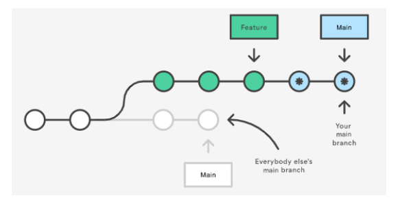

### 认识CDN

- **什么是CDN呢？CDN称之为内容分发网络（Content Delivery Network或Content Distribution Network，缩写：CDN）**
  - CDN它是一组分布在不同地理位置的**服务器相互连接**形成的**网络系统**。
  - 通过这个网络系统，将Web内容存放在**距离用户最近**的服务器。
  - 可以**更快、更可靠**地将Web内容(文件、图片、音乐、视频等)发送给用户。
  - CDN不但可以提高资源的**访问速度**，还可以分担源站的**压力**。
- **更简单的理解CDN：**
  - CDN会**将资源缓存到遍布全球的网站**，用户请求获取资源时；
  - **可就近获取**CDN上缓存的资源，**提高资源访问速度，同时分担源站压力。**
- **常用的CDN服务可以大致分为两种：**
  - 自己购买的CDN服务：需要购买开通CDN服务（会分配一个域名）。
    - 目前阿里、腾讯、亚马逊、Google等都可以购买CDN服务。
  - 开源的CDN服务
    - 国际上使用比较多的是unpkg、JSDelivr、cdnjs、BootCDN等。


# node

## Node基础

### Node.js是什么

- Node.js是一个基于**V8 JavaScript引擎**的**JavaScript运行时环境。**
- **也就是说Node.js基于V8引擎来执行JavaScript的代码，但是不仅仅只有V8引擎：**
  - 前面我们知道**V8可以嵌入到任何C ++应用程序**中，无论是**Chrome还是Node.js**，事实上都是**嵌入了V8引擎来执行JavaScript代码**；
  - 但是在Chrome浏览器中，还需要**解析、渲染HTML、CSS等相关渲染引擎**，另外还需要提供**支持浏览器操作的API、浏览器自己的事件循环**等；
  - 另外，在Node.js中我们也需要进行一些额外的操作，比如**文件系统读/写、网络IO、加密、压缩解压文件**等操作；

**Node.js的架构图：**

- 我们编写的JavaScript代码会经过V8引擎，再通过Node.js的Bindings，将任务放到Libuv的事件循环中；
- libuv（Unicorn Velociraptor—独角伶盗龙）是**使用C语言编写**的库；
- libuv提供了**事件循环、文件系统读写、网络IO、线程池**等等内容


### Node.js的应用场景

- 应用一：目前**前端开发的库都是以node包的形式进行管理；**
- 应用二：**npm、yarn、pnpm工具成为前端开发使用最多的工具**；
- 应用三：越来越多的公司**使用Node.js作为web服务器开发、中间件、代理服务器**；
- 应用四：大量项目需要**借助Node.js完成前后端渲染的同构应用；**
- 应用五：资深前端工程师需要为项目**编写脚本工具**（前端工程师编写脚本通常会使用JavaScript，而不是Python或者shell）；
- 应用六：很多企业在**使用Electron来开发桌面应用程序；**

### Node版本管理工具

- 如果希望快速切换多个版本工具，可以借助一些工具]
  - **nvm**：Node Version Manager；
  - **n**：Interactively Manage Your Node.js Versions（交互式管理你的Node.js版本）

> 但是它们都不支持windows系统

只有nvm在在GitHub上有提供对应的window版本：https://github.com/coreybutler/nvm-windows，需下载安装包

- nvm使用
  - 通过 **nvm install latest** 安装最新的node版本
  - 通过 **nvm list** 展示目前安装的所有版本
  - 通过 **nvm use** 切换版本

- **n的使用:**

  - 直接使用npm安装即可

    ```js
    #安装工具n
    npm install -g n
    #查看安装的版本
    n --version
    ```

  - 安装最新的lts版本：
    - 前面添加的sudo是权限问题；
    - 可以两个版本都安装，之后我们可以通过n快速在两个版本间切换；

```js
#安装最新的]ts版本
n 1ts
#安装最新的版本
n latest
#查看所有的版本
n
```

> 只支持mac电脑

### Node程序传递参数

- 某些情况我们需要传递参数
- 获取参数其实是在**process的内置对象**中的；
  - 如果我们**直接打印这个内置对象**，它里面包含特别的信息：
    - 其他的一些信息，比如**版本、操作系统**
  - 现在，我们先找到其中的**argv**属性：
    - 我们发现它是一个数组，里面包含了我们需要的参数；

```js
const num1 = 100
const num2 = 200
console.log(num1+num2)
//内置对象process,在内置对象中有个argv属性，可以获取参数 
//输入参数(在控制台)： node 02-node输入和输出.js 20 30  后面2位是参数，以空格隔开
const argv1 = process.argv[2]
const argv2 = process.argv[3]
// console.log(process)
console.log(process.argv)
console.log(argv1, argv2)
```

```js
//process.argv打印结果
[
  'C:\\Program Files\\nodejs\\node.exe',
  'C:\\Users\\27595\\Desktop\\前端系统复习\\前端工程化\\Node基础\\02-node输入和输出.js',
  '20',
  '30'
]
```

- **argc**：argument counter的缩写，传递参数的个数；
- **argv**：argument vector（向量、矢量）的缩写，传入的具体参数。
  - vector翻译过来是矢量的意思，在程序中表示的是一种数据结构。
  - 在C++、Java中都有这种数据结构，是一种数组结构
  -  在JavaScript中也是一个数组，里面存储一些参数信息

**Node的输出**

- **console.log**
  - 最常用的输入内容的方式：console.log
- **console.clear**
  - 清空控制台：console.clear
- **console.trace**
  - 打印函数的调用栈：console.trace

## 全局对象

在Node中可以使用global访问全局对象

### 特殊的全局对象

- 为什么称之为特殊的全局对象呢？
  - 这些全局对象实际上是模块中的变量，只是每个模块都有，看来像是全局变量；
  - 在命令行交互中是不可以使用的；
  - 包括：**__dirname、__filename、exports、module、require()**
- **__dirname：获取当前文件所在的路径：**
  - 注意：不包括后面的文件名
-  **__filename**：**获取当前文件所在的路径和文件名称：**
  - 注意：包括后面的文件名称

### 常见的全局对象

- **process对象**：process提供了**Node进程中相关的信息**：
  - 比如Node的运行环境、参数信息等；
- **console对象**：提供了简单的调试控制台，在前面讲解输入内容时已经学习过了。
  - 更加详细的查看官网文档：https://nodejs.org/api/console.html
- **定时器函数**：在Node中使用定时器有好几种方式：
  - **setTimeout(callback, delay[, ...args])**：callback在delay毫秒后执行一次；
  - **setInterval(callback, delay[, ...args])**：callback每delay毫秒重复执行一次；
  - **setImmediate(callback[, ...args])**：callbackI / O事件后的回调的“立即”执行；
    - 这里先不展开讨论它和setTimeout(callback, 0)之间的区别；
    -  因为它涉及到事件循环的阶段问题
  - **process.nextTick(callback[, ...args])**：添加到下一次tick队列中；

### global对象

- global是一个全局对象，事实上前端我们提到的process、console、setTimeout等都有被放到global中：

**global和window的区别:**

- 1.使用var定义变量时，在window中是定义在全局的，而在global只是在当前模块中有一个变量，不会放到全局中：
- **在新的标准中还有一个globalThis，也是指向全局对象的；**
  - 无论实在js还是node中使用都可以访问到全局对象

## 认识模块化开发

**什么是模块化？**

1. 模块化的最终目的是将程序划分成**一个个的结构**
2. 每个结构有属于**自己的逻辑代码和作用域**，定义变量名词时不会影响到其他的结构
3. 这个结构可以将自己希望暴露的**变量、函数、对象等导出给其它结构使用**；
4. 也可以通过某种方式，**导入**另外结构中的**变量、函数、对象**等；

- **上面说提到的结构，就是模块；按照这种结构划分开发程序的过程，就是模块化开发的过程；**

> 早期是没有模块化开发的方案的，直到ES6（2015）才推出了自己的模块化方案ESModule；
>
> 在此之前，为了让JavaScript支持模块化，涌现出了很多不同的模块化规范：**AMD、CMD、CommonJS等；**

### CommomJS

#### CommonJS规范和Node关系

- **CommonJS是一个规范，最初提出来是在浏览器以外的地方使用，并且当时被命名为ServerJS，后来为了体现它的广泛性，修改为CommonJS，平时我们也会简称为CJS**。
  - **Node**是CommonJS在服务器端一个具有代表性的实现；
  - **Browserify**是CommonJS在浏览器中的一种实现；
  - **webpack**打包工具具备对CommonJS的支持和转换；
- 所以，**Node中对CommonJS进行了支持和实现**，让我们在开发node的过程中可以方便的进行模块化开发：
  - 在Node中**每一个js文件都是一个单独的模块**；
  - 这个模块中包括**CommonJS规范的核心变量：exports、module.exports、require；**
  - 我们可以使用这些变量来方便的进行**模块化开发；**
- **前面我们提到过模块化的核心是导出和导入，Node中对其进行了实现**：
  - **exports和module.exports**可以负责**对模块中的内容进行导出；**
  - **require函数**可以帮助我们**导入其他模块（自定义模块、系统模块、第三方库模块）中的内容；**

导出

```js
const name = 'liweiye'
const age = 20

function foo() {
  console.log('foo函数')
}
//导出，导出的为一个对象   {name:name,age:age,foo:foo}
exports.name = name
exports.age = age
exports.foo = foo
```

导入

```js
main.js
//使用requireha函数接收，可以进行解构赋值
const { name, age, foo } = require('./utiles')

console.log(name)
console.log(age)
console.log(foo())
```

- **上面这行完成了什么操作呢？理解下面这句话，Node中的模块化一目了然**

  - 意味着main中的**解构变量等于exports对象；**
  - 也就是require通过各种查找方式，最终找到了exports这个对象；
  - 并且将这个**exports对象赋值给了解构变量；**
  - **解构的变量就是exports对象了；**

  > **本质就是做了个引入赋值，变量指向了exports导出的对象**
  >
  > **exports和require指向是同一个对象: 引入赋值**

#### module.exports导出

- **但是Node中我们经常导出东西的时候，又是通过module.exports导出的：**
  - **module.exports和exports有什么关系或者区别呢？**
- **我们追根溯源，通过维基百科中对CommonJS规范的解析：**
  - CommonJS中是没有**module.exports**的概念的；
  - 但是为了实现模块的导出，Node中使用的是**Module的类，每一个模块都是Module的一个实例，也就是module；**
  - 所以在Node中真正用于导出的其实**根本不是exports**，而是**module.exports**；
  - 因为**module才是导出的真正实现者；**
- **但是，为什么exports也可以导出呢？**
  - 这是因为**module对象的exports属性是exports对象的一个引用**；
  - 也就是说 **module.exports = exports = main中的接受者；**

> 当使用module.exports={} 导出时，在修改exports是没有意义的，这是因为module.exports={} 相当于又指向了一个新的内存地址，exports还是以前的
>
> - module.exports和exports的关系:
>   - 默认指向的是同一个对象
> - require本质查找的module.exports的对象
> - module.exports赋值新的对象
>   - exports就没有什么意义

#### require细节

- 我们现在已经知道，**require是一个函数**，可以帮助我们引入一个文件（模块）中导出的对象。

- **那么，require的查找规则是怎么样的呢？**

  - 这里总结比较常见的查找规则：
  - 导入格式如下：require(X)

- **情况一：X是一个Node核心模块，比如path、http**

  - 直接返回核心模块，并且停止查找

- **情况二：X是以 ./ 或 ../ 或 /（根目录）开头的**

  - **第一步：将X当做一个文件在对应的目录下查找；**

    1.如果有后缀名，按照后缀名的格式查找对应的文件

    2.如果没有后缀名，会按照如下顺序：

    - 1> 直接查找文件X
    - 2> 查找X.js文件
    - 3> 查找X.json文件
    - 4> 查找X.node文件

  -  **第二步：没有找到对应的文件，将X作为一个目录**

    - 查找目录下面的index文件
      - 1> 查找X/**index**.js文件
      - 2.> 查找X/index.json文件 
      - 3> 查找X/index.node文件
      - **如果没有找到，那么报错：not found**

- **情况三：直接是一个X（没有路径），并且X不是一个核心模块**
  - **如果有node_modules文件，那么它会在这个文件中查找**
  - **如果上面的路径中都没有找到，那么报错：not found**

#### 模块的加载过程

- **结论一：模块在被第一次引入时，模块中的js代码会被运行一次**
- **结论二：模块被多次引入时，会缓存，最终只加载（运行）一次**
  - 为什么只会加载运行一次呢？
  - 这是因为每个模块对象module都有一个属性：loaded。
  - **当没有被引入时为false表示还没有加载，被引入为true表示已经加载；**

- **结论三：如果有循环引入，那么加载顺序是什么？**
  - 这种其实是一种数据结构：图结构；
  - 图结构在遍历的过程中，有深度优先搜索（DFS, depth first search）和广度优先搜索（BFS, breadth first search）；
  - Node采用的是深度优先算法（一个接着一个查找）：：main -> aaa -> ccc -> ddd -> eee ->bbb
  
  

#### CommonJS规范缺点

- **CommonJS加载模块是同步的：**
  - 同步的意味着只有等到对应的模块加载完毕，当前模块中的内容才能被运行；
  - 这个在服务器不会有什么问题，因为服务器加载的js文件都是本地文件，加载速度非常快；
- **如果将它应用于浏览器呢？**
  - 浏览器**加载js文件需要先从服务器将文件下载下来**，之后**再加载运行；**
  - 那么采用**同步的就意味着后续的js代码都无法正常运行**，即使是**一些简单的DOM操作；**
- **所以在浏览器中，我们通常不使用CommonJS规范：**
  - 当然在webpack中使用CommonJS是另外一回事；
  - 因为它会将我们的代码转成浏览器可以直接执行的代码；
- 在早期为了可以**在浏览器中使用模块化，通常会采用AMD或CMD**：
  - 但是目前一方面现代的浏览器**已经支持ES Modules**，另一方面借助于webpack等工具可以**实现对CommonJS或者ESModule代码的转换；**
- **AMD和CMD已经使用非常少了**

> 使用module.exports={} 导出，require('路径')接收
>
> require()的本质就是require通过各种查找方式，最终找到了module.exports这个对象；并把内存地址指向它
>
> 通常CommonJS不在浏览器中使用，node中通常使用CommonJs
>
> ESModule可以在浏览器中使用

### ES Module

- JavaScript没有模块化一直是**它的痛点**，所以才会产生我们前面学习的社区规范：CommonJS、AMD、CMD等，所以在ECMA推出自己的模块化系统时，大家也是兴奋异常。
- **ES Module和CommonJS的模块化有一些不同之处**：
  - 一方面它使用了**import**和**export**关键字；
  - 另一方面它采用**编译期的静态分析**，并且也**加入了动态引用的方式**；
- **ES Module模块采用export和import关键字来实现模块化：**
  - **export**负责将模块内的内容**导出**；
  - **import**负责从其他模块**导入**内容；
- **了解：采用ES Module将自动采用严格模式：use strict**

注意：

> 1.在html中使用时，需要给script标签给个type="module"说明它是一个模块
>
> 2.如果你通过本地加载Html 文件 (比如一个 file:// 路径的文件), 你将会遇到 CORS 错误，因为
> Javascript 模块安全性需要；
>
> 你需要通过一个服务器来测试

```js
<script src="./modules/foo.js" type="module"></script>
```

导出：

```js
const name = '小米'
const age = 20
function foo() {
  console.log('foo------')
}

export {
  name,
  age,
  foo
}
```

导入：

```js

import { name, age, foo } from './foo.js'
console.log(name, age, foo())
```

在浏览器运行

```js

  <script src="./foo.js" type="module"></script>
  <script src="./main.js" type="module"></script>
```

#### export关键字

- **export关键字将一个模块中的变量、函数、类等导出；**

- **我们希望将其他中内容全部导出，它可以有如下的方式**：

- **方式一**：在语句声明的前面直接加上export关键字

- **方式二**：将所有需要导出的标识符，放到export后面的 {}中

  - 注意：这里的 {}里面不是ES6的对象字面量的增强写法，{}也不是表示一个对象的；
  - 所以： export {name: name}，是错误的写法；

- **方式三**：导出时给标识符起一个别名

  - 通过as关键字起别名

    ```js
    export {
      name as lll,
      age,
      foo
    ```

#### import关键字

- **import关键字负责从另外一个模块中导入内容**

- **导入内容的方式也有多种：**

- **方式一**：import {标识符列表} from '模块'；

  - 注意：这里的{}也不是一个对象，里面只是存放导入的标识符列表内容；

- **方式二**：导入时给标识符起别名

  - 通过as关键字起别名

    ```js
    import { lll as name, age, foo } from './foo.js'
    console.log(name, age, foo())
    ```

- **方式三**：通过 * 将模块功能放到一个模块功能对象（a module object）上

```js
//给整个导出模块起别名放在一个对象中，可以访问到模块中的属性
import * as foo from './foo.js'

console.log(foo.name)
console.log(foo.age)
console.log(foo.foo())
```

#### export和import结合使用

```js
export {name, age, foo } form "./foo.js"
//相当于省略了import，从一个文件中导出

//导出全部
export * form "./foo.js"
```

- **为什么要这样做呢？**
  - 在开发和封装一个功能库时，通常我们希望将暴露的所有接口放到一个文件中；
  - 这样方便指定统一的接口规范，也方便阅读；
  - 这个时候，我们就可以使用export和import结合使用；

#### default用法(默认导出)

- **有名字的导出（named exports）：**
  - 在导出export时指定了名字；
  - 在导入import时需要知道具体的名字；
- 还有一种导出叫做**默认导出（default export）**
  - 默认导出export时可以**不需要指定名字；**
  - 在**导入时不需要使用 {}**，并且**可以自己来指定名字**；
  - 它也方便我们和现有的CommonJS等规范相互操作；
- **注意：在一个模块中，只能有一个默认导出（default export）；**

```js
//直接导出，不需要起名字
export default function() {
    return 1111
}
//导入，随便起名字
import aa from './foo.js'
```

#### import函数

- **通过import加载一个模块，是不可以在其放到逻辑代码中的，比如：**
- **为什么会出现这个情况呢**？
  - 这是因为**ES Module在被JS引擎解析**时，就**必须知道它的依赖关系**；
  - 由于**这个时候js代码没有任何的运行，**所以**无法在进行类似于if判断中根据代码的执行情况**
  - 甚至**拼接路径的写法也是错误**的：因为我们必须到运行时能确定path的值；
- 但是某些情况下，我们确确实实希望动态的来加载某一个模块：
  - 如果根据不懂的条件，动态来选择加载模块的路径；
  - 这个时候我们需要使用 **import() 函数**来动态加载；
    -  **import函数返回一个Promise，可以通过then获取结果；**

```js
let flag true;
if (flag){
    import('./modules/aaa.js').then(aaa =>{
    aaa.aaa();
})
}else
import('./modules/bbb.js').then(bbb =>{
    bbb.bbb();
})
}
```

#### import meta

- **import.meta是一个给JavaScript模块暴露特定上下文的元数据属性的对象。**
  - 它包含了这个模块的信息，比如说这个模块的URL；
  - 在ES11（ES2020）中新增的特性

#### ES Module的解析流程

- **ES Module是如何被浏览器解析并且让模块之间可以相互引用的呢？**
  - https://hacks.mozilla.org/2018/03/es-modules-a-cartoon-deep-dive/
- **ES Module的解析过程可以划分为三个阶段：**
  - 阶段一：构建（Construction），根据地址查找js文件，并且下载，将其解析成模块记录（Module Record）；
  - 阶段二：实例化（Instantiation），对模块记录进行实例化，并且分配内存空间，解析模块的导入和导出语句，把模块指向对应的内存地址。
  - 阶段三：运行（Evaluation），运行代码，计算值，并且将值填充到内存地址中；

## 包管理工具

npm、yarn、cnpm、npx、pnpm

### 包管理工具npm

 Node Package Manager，也就是**Node包管理器；**

- npm属于node的一个管理工具，所以我们需要先安装Node；
  - node管理工具：https://nodejs.org/en/，安装Node的过程会自动安装npm工具；

- npm管理的包可以在哪里查看、搜索呢？
  - https://www.npmjs.org/
  - 这是我们安装相关的**npm包的官网**
-  npm管理的包存放在哪里呢？
  - 我们发布自己的包其实是**发布到registry**上面的；
  - 当我们安装一个包时其实是**从registry上面下载的包；**

#### npm的配置文件

- 这个配置文件就是**package.json**

  - 每一个项目都会有一个对应的配置文件，无论是前端项目（Vue、React）还是后端项目（Node）；

  - 这个**配置文件会记录着你项目的名称、版本号、项目描述**等；
  - 也会记录着你项目所依赖的**其他库的信息**和**依赖库的版本号；**

- 那么这个配置文件如何得到呢？
  - 方式一：**手动从零创建项目**，npm init –y
  - 方式二：**通过脚手架创建项目**，脚手架会帮助我们生成package.json，并且里面有相关的配置

#### 常见的属性

- **必须填写的属性：name、version**
  - **name**是项目的名称；
  - **version**是当前项目的版本号；
  - **description**是描述信息，很多时候是作为项目的基本描述；
  - **author**是作者相关信息（发布时用到）；
  - **license**是开源协议（发布时用到）；
- **private属性：**
  - **private**属性记录当前的项目是否是私有的；
  - **当值为true时，npm是不能发布它的**，这是防止私有项目或模块发布出去的方式；

- **main属性：**
  - **设置程序的入口。**
    - 比如我们使用axios模块 const axios = require('axios');
    - 如果有main属性，实际上是**找到对应的main属性查找文件**的；

- **scripts属性**
  - **scripts属性用于配置一些脚本命令**，以**键值对的形式**存在；
  - 配置后我们可以通过 **npm run** 命令的key来执行这个命令；
  - npm start和npm run start的区别是什么？
    - 它们是等价的；
    -  对于常用的 start、 test、stop、restart可以省略掉run直接通过 npm start等方式运
- **dependencies属性**
  - dependencies属性是**指定无论开发环境还是生成环境都需要依赖的包；**
  - 通常是**我们项目实际开发用到的一些库模块vue、vuex、vue-router、react、react-dom、axios等等；**
  - **默认都是安装在这里的**
  - 与之对应的是**devDependencies**；
- **devDependencies属性**
  - 一些包**在生成环境是不需要的，比如webpack、babel等；**
  
  - 这个时候我们会**通过 npm install webpack --save-dev**，将它安装到devDependencies属性中；
  
    **简写为:**
  
    ```js
    npm install webpack -D
    ```
- **peerDependencies属性**
  
  - 还有一种项目依赖关系是**对等依赖**，也就是**你依赖的一个包，它必须是以另外一个宿主包为前提**的；
  - 比如element-plus是依赖于vue3的，ant design是依赖于react、react-dom；
- **engines属性**
  
  - engines属性**用于指定Node和NPM的版本号；**
  - 在安装的过程中，**会先检查对应的引擎版本，如果不符合就会报错；**
  - 事实上也可以指定所在的操作系统 "os" : [ "darwin", "linux" ]，只是很少用到；
- **browserslist属性**
  - 用于配置打包后的JavaScript浏览器的兼容情况，参考；
  - 否则我们需要手动的添加polyfills来让支持某些语法；
  - 也就是说它是为webpack等打包工具服务的一个属性（这里不是详细讲解webpack等工具的工作原理，所以不再给出详情）

#### 依赖的版本管理

- 我**们会发现安装的依赖版本出现：^2.0.3或~2.0.3，这是什么意思呢？**
- **npm的包通常需要遵从semver版本规范：**
  - semver：https://semver.org/lang/zh-CN/
  - npm semver：https://docs.npmjs.com/misc/semver
- **semver版本规范是X.Y.Z：**
  - **X主版本号（major）**：当你做了不兼容的 API 修改（可能不兼容之前的版本，**大版本更新**）；
  - **Y次版本号（minor**）：当你做了向下兼容的功能性新增（**新功能增加**，但是兼容之前的版本）；
  - **Z修订号（patch）**：当你做了向下兼容的问题修正（没有新功能，**修复**了之前版本的**bug**）；
- **我们这里解释一下 ^和~的区别：**
  - **x.y.z**：表示**一个明确的版本号**；
  - **^x.y.z**：表示**x是保持不变的**，**y和z永远安装最新的版本**；
  - **~x.y.z**：表示**x和y保持不变的**，**z永远安装最新的版本；**

#### npm install 命令

- 安装npm包分两种情况：

  - **全局安装（global install）**： npm install webpack -g;
  - **项目（局部）安装（local install）**： npm install webpack

- 全局安装

  - 全局安装是直接将某个包安装到全局：

  - 比如全局安装yarn：

    ```js
    npm install yarn -g
    ```

- 但是很多人对全局安装有一些误会：

  - 通常使用**npm全局安装的包都是一些工具包**：yarn、webpack等；
  - **并不是类似于 axios、express、koa等库文件；**
  - 所以全局安装了之后并不能让我们在所有的项目中使用 axios等库；

#### 项目安装

- **项目安装会在当前目录下生成一个 node_modules 文件夹，require查找顺序时有说明这个包在什么情况下被查找；**
- **局部安装分为开发时依赖和生产时依赖**：

```js
# 默认安装开发和生产依赖
npm install axios
npm i axios
# 开发依赖
npm install webpack --save-dev
npm install webpack -D
npm i webpack –D
# 根据package.json中的依赖包
npm install
```

#### npm install 原理


- **npm install会检测是否有package-lock.json文件：**
  - **没有lock文件**
    - 分析依赖关系，这是因为我们可能包会依赖其他的包，并且多个包之间会产生相同依赖的情况；
    - 从registry仓库中下载压缩包（如果我们设置了镜像，那么会从镜像服务器下载压缩包）；
    - 获取到压缩包后会对压缩包进行缓存（从npm5开始有的）；
    - 将压缩包解压到项目的node_modules文件夹中（require的查找顺序会在该包下面查找）
  - **有lock文件**
    - 检测lock中包的版本是否和package.json中一致（会按照semver版本规范检测）；
      - 不一致，那么会重新构建依赖关系，直接会走顶层的流程；
    - 一致的情况下，会去优先查找缓存
      - 没有找到，会从registry仓库下载，直接走顶层流程；
    - 查找到，会获取缓存中的压缩文件，并且将压缩文件解压到node_modules文件夹中

#### package-lock.json

**1.用于锁定（确定死的）依赖包的版本**

2.记录包的依赖关系

> 用于以后下载包时可能会下载最新版的，这里使用lock文件确定一个固定版本

- **package-lock.json文件解析：**
- **name**：项目的名称；
- **version**：项目的版本；
- **lockfileVersion**：lock文件的版本；
- **requires**：使用requires来跟踪模块的依赖关系；
- **dependencies**：项目的依赖
  - 当前项目依赖axios，但是axios依赖follow-redireacts；
  - axios中的属性如下：
    - **version**表示实际安装的axios的版本；
    - **resolved**用来记录下载的地址，registry仓库中的位置；
    - **requires/dependencies**记录当前模块的依赖；
    - **integrity**用来从缓存中获取索引，再通过索引去获取压缩包文件

#### npm其他命令

- 卸载某个依赖包：

```js
npm uninstall package
npm uninstall package --save-dev
npm uninstall package -D
```

- 强制重新build

  - 重新安装所以包

  ```js
  npm rebuild
  ```

- 清除缓存

  ```json
  npm cache clean
  ```

- npm的命令其实是非常多的：
  - https://docs.npmjs.com/cli-documentation/cli
  - 更多的命令，可以根据需要查阅官方文档

### yarn工具

- 另一个node包管理工具yarn：
  - yarn是由**Facebook、Google、Exponent 和 Tilde** 联合推出了一个新的 **JS 包管理工具；**
  - yarn 是为了弥补 **早期npm 的一些缺陷**而出现的；
  - 早期的npm存在很多的缺陷，比如**安装依赖速度很慢、版本依赖混乱等等**一系列的问题；
- 虽然从npm5版本开始，进行了很多的升级和改进，但是依然很多人喜欢使用yarn；

### cnpm工具

- **由于一些特殊的原因，某些情况下我们没办法很好的从 https://registry.npmjs.org下载下来一些需要的包。**

- 查看npm镜像：

  ```js
  npm config get registry # npm config get registry
  ```

-  我们可以直接设置npm的镜像：

```js
npm config set registry https://registry.npm.taobao.org
```

- **但是对于大多数人来说，并不希望将npm镜像修改了：**

  - 第一，**不太希望随意修改npm原本从官方下来包的渠道；**
  - 第二，**担心某天淘宝的镜像挂了或者不维护了，又要改来改去；**

- **这个时候，我们可以使用cnpm，并且将cnpm设置为淘宝的镜像：**

  ```js
  npm install -g cnpm --registry=https://registry.npm.taobao.org
  cnpm config get registry # https://r.npm.taobao.org/
  ```

### npx工具

- **npx是npm5.2之后自带的一个命令。**
  - npx的作用非常多，但是比较常见的是使用**它来调用项目中的某个模块的指令。**
- **我们以webpack为例：**
  - 全局安装的是webpack5.1.3
  - 项目安装的是webpack3.6.0
- **如果我在终端执行 webpack --version使用的是哪一个版本呢？**
  - 显示结果会是 webpack 5.1.3，事实上使用的是全局的，为什么呢？
  - 原因非常简单，在当前目录下找不到webpack时，就会去全局找，并且执行命令；

- 如何解决这个问题呢？
- **那么如何使用项目（局部）的webpack，常见的是两种方式：**
  - 方式一：明确查找到node_module下面的webpack
  - 方式二：在 scripts定义脚本，来执行webpack；
- **方式一：在终端中使用如下命令（在项目根目录下**）

```js
./node_modules/.bin/webpack --version
```

- **方式二：修改package.json中的scripts**

```js
"scripts": {
"webpack": "webpack --version"
}
//scripts查找都是在node_module/.bin目录中查找的

```

- **方式三：使用npx**

  ```js
  npx webpack --version
  ```

- **npx的原理非常简单，它会到当前目录的node_modules/.bin目录下查找对应的命令；**

> npx  webpack 可以对我们项目进行打包，之所以用npx是因为它可以直接使用局部项目中的webpack进行打包，不会使用全局的webpack
>
> 使用npx可以优先进行局部的工具库查找对应命令

### npm发布自己的包

- 注册npm账号：
  - https://www.npmjs.com/
  - 选择sign up
- 在命令行登录：

```js
npm login
```

- 修改package.json

  - 修改作者，自己包的地址等信息

- 发布到npm registry上

  ```js
  npm publish
  ```

- 更新仓库：

  - 1.修改版本号(最好符合semver规范)
  - 2.重新发布

- 删除发布的包：

  - npm unpublish

- 让发布的包过期

  - npm deprecate

### 什么是pnpm呢？

- 什么是pnpm呢？我们来看一下官方的解释：
  - pnpm：我们可以理解成是**performant npm**缩写；

- 哪些公司在用呢？
  - 包括**Vue在内的很多公司或者开源项目的包管理工具都切换到了pnpm**

#### 硬链接和软连接的概念

- **硬链接（hard link）：**
  - **硬链接（英语：hard link）是电脑文件系统中的多个文件平等地共享同一个文件存储单元；**
  - 删除一个文件名字后，还可以用其它名字继续访问该文件；
- **符号链接（软链接soft link、Symbolic link）**：
  
  - **符号链接（软链接、Symbolic link）是一类特殊的文件；**
  
  - **其包含有一条以绝对路径或者相对路径的形式指向其它文件或者目录的引用；**
  
    > 软连接：通过路径形式一层一层查找到指向真实的位置
    >
    > ​         类似于快捷方式
    >
    > 硬链接：平等的共享指向同一个文件


#### pnpm到底做了什么呢

- 当使用 **npm 或 Yarn** 时，如果你有 **100 个项目**，并且所有项目都有一个相同的依赖包，那么， 你在硬盘上就需要**保存 100 份该相同依赖包的副本。**
- 如果是使用 **pnpm**，依赖包将被 **存放在一个统一的位置**，因此：
  - 如果你对**同一依赖包使用相同的版本**，那么**磁盘上只有这个依赖包的一份文件**；
  - 如果你对**同一依赖包需要使用不同的版本**，则仅有 **版本之间不同的文件会被存储起来**；
  - 所有文件都**保存在硬盘上的统一的位置：**
    - 当安装软件包时， 其包含的所有文件都会硬链接到此位置，而不会占用 额外的硬盘空间；
    - 这让你可以在项目之间方便地共享相同版本的 依赖包；
  
  > 把要安装的依赖包放在统一的位置，每次安装相同的依赖包时，所以文件都会硬链接到这个位置


#### **pnpm的node_modules是非扁平化的结构**

- **当使用 npm 或 Yarn Classic 安装依赖包时，所有软件包都将被提升到 node_modules 的 根目录下。**

  - 其结果是，源码可以访问 本不属于当前项目所设定的依赖包；

  **pnpm：**

- **让自己的项目不会随便引入非自己安装的依赖**
- 软连接和硬链接结合
  
  - node_modules下会直接生成工具的文件是一个软连接(快捷方式)，指向.pnpm文件下的真正的工具文件，这个工具文件是一个硬链接，连接到真实磁盘中的文件

| npm命令             | pnpm等价命令      | 描述                       |
| ------------------- | ----------------- | -------------------------- |
| npm install         | pnpm install      | 安装package.json中的依赖包 |
| npm install <pcg>   | pnpm add <pcg>    | 默认安装开发和生产依赖     |
| npm uninstall <pcg> | pnpm remove <pcg> | 卸载某个依赖包             |
| npm run <cmd>       | pnpm <cmd>        | 运行某个脚本               |

更多命令和用法可以参考pnpm的官网：https://pnpm.io/zh/

#### pnpm的存储store

- 我们可以通过一些终端命令获取pnpm储存目录：获取当前活跃的store目录

  ```js
  pnpm store path
  ```

- 另外一个非常重要的store命令是prune（修剪）：从store中删除当前未被引用的包来释放store的空间

  ```js
  pnpm store prune 
  ```

# Webpack

## 内置模块path

- **path模块用于对路径和文件进行处理，提供了很多好用的方法。**
  - 在Mac OS、Linux和window上的路径时不一样的
  - 为了屏蔽他们之间的差异，在开发中对于路径的操作我们可以使用 path 模块；

### path常见的API

- **从路径中获取信息**
  - dirname()：获取文件的父文件夹；
  - basename()：获取文件名；
  - extname()：获取文件扩展名；
- **路径的拼接：path.join()**
  - 如果我们希望将多个路径进行拼接，但是不同的操作系统可能使用的是不同的分隔符；
  - 这个时候我们可以使用path.join函数;
- **拼接绝对路径：path.resolve()**
  - path.resolve() 方法会把一个路径或路径片段的序列解析为一个绝对路径；
  - **给定的路径的序列是从右往左被处理的，后面每个 path 被依次解析，直到构造完成一个绝对路径；**
  - **如果在处理完所有给定path的段之后，还没有生成绝对路径，则使用当前工作目录；**
  - 生成的路径被规范化并删除尾部斜杠，零长度path段被忽略；
  - 如果没有path传递段，path.resolve()将返回当前工作目录的绝对路径；

## Webpack的使用

### 什么是webpack？

- webpack是一个静态的模块化打包工具，为现代的JavaScript应用程序；
- 如下解释
  - **打包bundler**：webpack可以将帮助我们进行打包，所以它是一个打包工具
  - **静态的static**：这样表述的原因是我们最终可以将代码打包成最终的静态资源（部署到静态服务器）
  - **模块化module**：webpack默认支持各种模块化开发，ES Module、CommonJS、AMD等
  - **现代的modern**：我们前端说过，正是因为现代前端开发面临各种各样的问题，才催生了webpack的出现和发展

> Webpack的运行是依赖Node环境的，所以我们电脑上必须有Node环境

### Webpack的安装

- webpack的安装目前分为两个：**webpack、webpack-cli**
- 那么它们是什么关系呢？
  - 执行webpack命令，会执行node_modules下的.bin目录下的webpack
  -  **webpack在执行时是依赖webpack-cli的，如果没有安装就会报错；**
  - **而webpack-cli中代码执行时，才是真正利用webpack进行编译和打包的过程；**
  - 所以在安装webpack时，我们需要同时安装webpack-cli（第三方的脚手架事实上是没有使用webpack-cli的，而是类似于自己的vue-service-cli的东西）

```js
npm install webpack webpack-cli –g # 全局安装
npm install webpack webpack-cli –D # 局部安装
```

### Webpack的默认打包

- 我们可以通过webpack进行打包，之后运行打包之后的代码
  
- 在目录下直接执行 **webpack** 命令
  
- **生成一个dist文件夹，里面存放一个main.js的文件，就是我们打包之后的文件：**
  -  这个文件中的代码被压缩和丑化了；
  - 里面依然存在ES6的语法，比如箭头函数、const等，这是因为默认情况下webpack并不清楚我们打包后的文件是否需要转成ES5之前的语法，后续我们需要通过babel来进行转换和设置；

- **我们发现是可以正常进行打包的，但是有一个问题，webpack是如何确定我们的入口的呢？**
  - 事实上，当我们运行webpack时，webpack会查找当前目录下的 src/index.js作为入口
  -  所以，如果当前项目中没有存在src/index.js文件，那么会报错；

- **当然，我们也可以通过配置来指定入口和出口**

  ```js
  npx webpack --entry ./src/main.js --output-filename bundle.js --output-path ./build 
  ```

### 创建局部的webpack

- 直接执行webpack命令使用的是全局的webpack，如果希望使用局部的可以按照下面的步骤来操作。

- 第一步：创建package.json文件，用于管理项目的信息、库依赖等

  ```js
  npm init
  ```

- 第二步：安装局部的webpack

  ```js
  npm install webpack webpack-cli -D
  ```

- 第三步：使用局部的webpack

```js
npx webpack
```

- 第四步：在package.json中创建scripts脚本，执行脚本打包即可

```js
"scripts":{
    	"build":"webpack"																
}
```

```js
npm run build
```

### Webpack配置文件

- 在通常情况下，webpack需要打包的项目是非常复杂的，并且我们需要一系列的配置来满足要求，默认配置必然是不可以的。
- 我们可以在根目录下创建一个**webpack.config.js文件**，来作为webpack的配置文件：

```js
const path = require('path')
//·导出配置信息
module.exports = {
    //需要打包的文件
    entry:"./src/main.js",
    //打包后的文件
output:{
    //js文件
    filename:"bundle.js",
    //目录文件,path需要是一个绝对路径
path:path.resolve(__dirname,"./dist")
}
    
}
继续执行webpack命令，依然可以正常打包
```

上面的配置等于:

```js
npx webpack --entry ./src/main.js --output-filename bundle.js --output-path ./build 
```

### 指定配置文件

- 但是如果我们的配置文件并不是webpack.config.js的名字，而是其他的名字呢？
  - 比如我们将webpack.config.js修改成了 wk.config.js；
  - 这个时候我们可以通过 --config 来指定对应的配置文件；

```js
webpack --config wk.config.js
```

- 但是每次这样执行命令来对源码进行编译，会非常繁琐，所以我们可以在package.json中增加一个新的脚本：

```js
{
Debug
"scripts":{
 "build":"webpack --config wk.config.js"   
}
"devDependencies":{
 'webpack":."5.14.0",
"webpack-cli":"4.3.1"   
}
}
之后我们执行 npm run build来打包即可
```

### Webpack的依赖图

- webpack到底是如何对我们的项目进行打包的呢？
  - 事实上webpack在处理应用程序时，它会根据	命令或者配置文件找到入口文件；
  - 从入口开始，会生成一个 **依赖关系图**，这个**依赖关系图**会包含应用程序中所需的所有模块（比如.js文件、css文件、图片、字体等）；
  - 然后遍历图结构，打包一个个模块（**根据文件的不同使用不同的loader来解析**）；


## loader的使用

### css-loader的使用

- **loader**是什么呢？
  -  loader 可以用于对**模块的源代码**进行转换；
  - 我们可以**将css文件也看成是一个模块**，我们是**通过import来加载这个模块**的；
  - 在加载这个模块时，**webpack其实并不知道如何对其进行加载**，我们必须制定对应的loader来完成这个功能；

- **那么我们需要一个什么样的loader呢？**
  - 对于加载css文件来说，我们需要一个可以读取css文件的loader；
  - 这个loader最常用的是css-loader；
- **css-loader的安装**

```js
npm install css-loader -D
```

#### css-loader的使用方案

- **如何使用这个loader来加载css文件呢？有三种方式：**
  - 内联方式；
  - CLI方式（webpack5中不再使用）；
  - 配置方式；
- 内联方式：内联方式使用较少，因为不方便管理；
  - 在引入的样式前加上使用的loader，并且使用!分割；

```js
import:"css-loader!../css/style.css";
```

- CLI方式
  - 在webpack5的文档中已经没有了**--module-bind；**
  - 实际应用中也比较少使用，因为不方便管理；

#### loader配置方式

- **配置方式表示的意思是在我们的webpack.config.js文件中写明配置信息：**

  - module.rules中允许我们配置多个loader（因为我们也会继续使用其他的loader，来完成其他文件的加载）；
  - 这种方式可以更好的表示loader的配置，也方便后期的维护，同时也让你对各个Loader有一个全局的概览；

- **module.rules的配置如下：**

- rules属性对应的值是一个数组：**[Rule]**

- 数组中存放的是一个个的Rule，Rule是一个对象，对象中可以设置多个属性：

  - **test属性**：用于对 resource（资源）进行匹配的，通常会设置成正则表达式；

  - **use属性**：对应的值时一个数组：**[UseEntry]**
-  UseEntry是一个对象，可以通过对象的属性来设置一些其他属性
      - **loader**：必须有一个 loader属性，对应的值是一个字符串；
      - **options**：可选的属性，值是一个字符串或者对象，值会被传入到loader中,loader会进行读取；
      - query：目前已经使用options来替代；
    -  **传递字符串（如：use: [ 'style-loader' ]）是 loader 属性的简写方式（如：use: [ { loader: 'style-loader'} ]）；**
    
- **loader属性**： Rule.use: [ { loader } ] 的简写。
  
```js
  const path = require("path")
  
  module.exports = {
    entry: "./src/main.js",
    output: {
      filename: 'bundle.js',
      path: path.resolve(__dirname, './build')
    },
    //对模块进行配置
    module: {
      //配置的规则，是一个数组结构
      rules: [
        //里面是一个个对象，表示有不同的规则
        {
          //对应匹配规则
          test: /\.css$/,
          //使用的loader，是一个数组形式，里面是对象
          use: [
            { loader: 'style-loader' },
            { loader: 'css-loader' }
          ],
          //简写一：如果loader只有一个
          // loader: "css-style"
          //简写二：多个loader不需要其他属性时，可以直接写loader字符串形式
          // use: ["css-loader", "style-loader"]
  
        }
      ]
    }
  }
  ```


#### 认识style-loader

- 已经可以通过css-loader来加载css文件了
  - 你会发现这个css在我们的代码中并没有生效（页面没有效果）。
- 这是为什么呢？
  - css-loader只是负责将.css文件进行解析，并不会将解析之后的css插入到页面中
  -  如果我们希望再完成插入style的操作，那么我们还需要另外一个loader，就是style-loader；
- 安装style-loader：

```js
npm install style-loader -D
```

#### 配置style-loader

- 我们应该如何使用style-loader：
  - 置文件中，添加style-loader；
  - 注意：**因为loader的执行顺序是从右向左（或者说从下到上，或者说从后到前的），所以我们需要将style-loader写到cssloader的前面；**

```js
use:[
    {loader:"style-loader"},
    {  loader:"css-loader"  }
]
//·注意：style-loader,在css-loader的前面
```

### 如何处理less文件？

- 我们可以使用less工具来完成它的编译转换：

  ```js
  npm install less -D
  ```

- 执行如下命令：

  ```js
  npx lessc ./src/css/title.less title.css
  ```

#### less-loader处理

- 但是在项目中我们会编写大量的css，它们如何可以自动转换呢？
  - 这个时候我们就可以使用less-loader，来自动使用less工具转换less到css；

```js
npm install less-loader -D
```

- 配置webpack.config.js

```js
  {
        //less-loader的配置
        test: /\.less$/,
        use: ["style-loader", "css-loader", "less-loader"]
      }
```

### 认识PostCSS工具

- 什么是PostCSS呢？
  - PostCSS是一个通过JavaScript来转换样式的工具；
  - 这个工具可以帮助我们**进行一些CSS的转换和适配，比如自动添加浏览器前缀、css样式的重置；**
  - 但是实现这些功能，我们需要借助于PostCSS对应的插件；
- 如何使用PostCSS呢？主要就是两个步骤：
  - 第一步：查找PostCSS在构建工具中的扩展，比如webpack中的postcss-loader；
  - 第二步：选择可以添加你需要的PostCSS相关的插件

#### postcss-loader

- 我们可以借助于构建工具：
  - 在webpack中使用postcss就是使用postcss-loader来处理的；
- 我们来安装postcss-loader：

```js
npm install postcss-loader -D
```

- 我们修改加载css的loader：
  - 注意：因为postcss需要有对应的插件才会起效果，所以我们需要配置它的plugin；

```js
  use: ["css-loader", "style-loader", {
          loader: "postcss-loader",
          options: {
            postcssOptions: {
              Plugin: [
                require("autoprefixer")
              ]
            }
          }
        }]
```

#### 单独的postcss配置文件

- 因为我们需要添加前缀，所以要安装autoprefixer：

  ```js
  npm install autoprefixer -D
  ```

- 我们可以将这些配置信息放到一个单独的文件中进行管理：
  
  - **在根目录下创建postcss.config.js**

```js
module.exports = {
  Plugin: [
    "autoprefixer"
  ]
}
```

#### postcss-preset-env

- 事实上，在配置postcss-loader时，我们配置插件并不需要使用autoprefixer。
- 我们可以使用另外一个插件：postcss-preset-env
  - postcss-preset-env也是一个postcss的插件；
  - 它可以帮助我们**将一些现代的CSS特性，转成大多数浏览器认识的CSS，并且会根据目标浏览器或者运行时环境添加所需的polyfill；**
  - **也包括会自动帮助我们添加autoprefixer（所以相当于已经内置了autoprefixer）；**
- 首先，我们需要安装postcss-preset-env：

```js
npm install postcss-preset-env -D
```

- 之后，我们直接修改掉之前的autoprefixer即可

```js
module.exports = {
  Plugin: [
    require("postcss-preset-env")
  ]
}
```

注意：我们在使用某些postcss插件时，也可以直接传入字符串

```js
module.exports = {
  Plugin: [
    "postcss-preset-env"
  ]
}
```

## 打包图片_js_vue

### 图片

#### 认识asset module type

- 我们当前使用的webpack版本是webpack5：
  - 在webpack5之前，加载这些资源我们**需要使用一些loader，比如raw-loader 、url-loader、file-loader；**
  - 在webpack5开始，我们可以直接使用**资源模块类型（asset module type）**，来替代上面的这些loader；
- **资源模块类型(asset module type)**，通过添加 4 种新的模块类型，来替换所有这些 loader：
  
  - **asset/resource** 发送一个单独的文件并导出 URL。
    - **打包图片，并且图片有自己的地址，将地址设置到img/bgi中**
      - **缺点：多了对图片的网络请求**
    
    - 之前通过使用 file-loader 实现；
    
  - **asset/inline** 导出一个资源的 data URI。
    
    - **将图片进行base64的编码，并且直接将编码后的源码直接放进打包的js文件中**
      - **缺点：造成js文件非常大，下载JS文件耗费时间长**
    
    - 之前通过使用 url-loader 实现；
    
  - **asset/source** 导出资源的源代码
    - 之前通过使用 raw-loader 实现；
    
  - **asset** 在导出一个 data URI 和发送一个单独的文件之间自动选择。
    
    - **resoure和inline的结合**
    
    - 之前通过使用 url-loader，并且配置资源体积限制实现；

#### asset module type的使用

- 比如加载图片，我们可以使用下面的方式：

```js
{
    test:/\.(png svg|jpg|jpeg gif)s/i,
    type:"asset/resource"
}
```

-  但是，如何可以自定义文件的输出路径和文件名呢？

  - **方式一**：修改output，添加assetModuleFilename属性；

    ```js
    output:{
        filename:"js/bundle.js",
    path:path.resolve(__dirname,"./dist"),
    assetModuleFilename:"img/[name].[hash:6][ext]"
    }
    ```

  - **方式二**：在Rule中，添加一个generator属性，并且设置filename

```js
{
    test:/\.(png|svg|jpg|jpeglgif)s/i,
    type:"asset/resource",
    generator:{
 filename:"img/[name].[hash:6][ext]"   
}
}
```

- 几个最常用的placeholder：
  - **[ext]**： 处理文件的扩展名；
  - **[name]**：处理文件的名称
  -  **[hash]**：文件的内容，使用MD4的散列函数处理，生成的一个128位的hash值（32个十六进制）；

#### url-loader的limit效果

- 开发中我们往往是**小的图片需要转换**，但是**大的图片直接使用图片**即可
  - 这是因为**小的图片转换base64**之后可以**和页面一起被请求，减少不必要的请求过程；**
  - 而**大的图片也进行转换**，反而会**影响页面的请求速度；**
- **我们需要两个步骤来实现：**
  - **步骤一**：将type修改为asset；
  - **步骤二**：添加一个parser属性，并且制定dataUrl的条件，添加maxSize属性；

```js
rules:[
 {
test:A\.(png svg jpg jpeg gif)s/i,
type:"asset",
generator:{
    //使用asset打包后文件的名称
filename:"img/[name].[hash:6][ext]"
},
    //设置转换成base64的最大尺寸
parser:{
dataUrlCondition:{
 maxsize:100*1024   
}
 }   
    
]
```

### JS-babel

#### 为什么需要babel？

- **事实上，在开发中我们很少直接去接触babel，但是babel对于前端开发来说，目前是不可缺少的一部分：**
  - 开发中，我们想要使用ES6+的语法，想要使用TypeScript，开发React项目，它们都是离不开Babel的；
  - 所以，学习Babel对于我们理解代码从编写到线上的转变过程至关重要；
- **那么，Babel到底是什么呢？**
  - Babel是一个**工具链**，主要用于旧浏览器或者环境中将ECMAScript 2015+代码转换为向后兼容版本的JavaScript；
  - 包括：语法转换、源代码转换等；

#### Babel命令行使用

- babel本身可以作为**一个独立的工具（和postcss一样）**，不和webpack等构建工具配置来单独使用。
- 如果我们希望**在命令行尝试使用babel**，需要安装如下库：
  - **@babel/core**：babel的核心代码，必须安装；
  - **@babel/cli**：可以让我们在命令行使用babel

```js
npm install @babel/cli @babel/core -D
```

- 使用babel来处理我们的源代码：
  - src：是源文件的目录；
  -  --out-dir：指定要输出的文件夹dist；

```js
npx babel src --out-dir dist
```

#### 插件的使用

- 比如我们需要转换箭头函数，那么我们就可以使用**箭头函数转换相关的插件：**

```js
npm install @babel/plugin-transform-arrow-functions -D
```

```js
npx babel src --out-dir dist --plugins=@babel/plugin-transform-arrow-functions
```

- 查看转换后的结果：我们会发现 const 并没有转成 var
  - 这是因为 plugin-transform-arrow-functions，并没有提供这样的功能；
  - 我们需要使用 plugin-transform-block-scoping 来完成这样的功能；

```js
npm install @babel/plugin-transform-block-scoping -D 
```

```js
npx babel src --out-dir dist --plugins=@babel/plugin-transform-block-scoping
,@babel/plugin-transform-arrow-functions
```

#### Babel的预设preset

- 但是如果要转换的内容过多，一个个设置是比较麻烦的，我们可以使用预设（preset）：
-  安装@babel/preset-env预设：

```js
npm install @babel/preset-env -D
```

- 执行如下命令：

```js
npx babel src --out-dir dist --presets=@babel/preset-env
```

#### babel-loader

- **在实际开发中，我们通常会在构建工具中通过配置babel来对其进行使用的，比如在webpack中。**
- 那么我们就需要去安装相关的依赖：
  - 如果之前已经安装了@babel/core，那么这里不需要再次安装；

```js
npm install babel-loader -D
```

- 我们可以设置一个规则，在加载js文件时，使用我们的babe

```js
module:{
    
  rules:[
      {
    test:/\.m?jss/,
use:{
 loader:"babel-loader"，
options:{
    plugins:{
 "@babel/plugin-transform-arrow-functions",
"@babel/plugin-transform-block-scoping"   
}
}    
      }
  ]
}
```

> 可以单独放在一个独立文件中,babel.config.js

#### babel-preset

- 如果我们一个个去安装使用插件，那么需要手动来管理大量的babel插件，我们可以直接给webpack提供一个preset，webpack会根据我们的预设来加载对应的插件列表，并且将其传递给babel。
- 比如常见的预设有三个：
  - env
  - react
  - TypeScript
- 安装preset-env：

```js
npm install @babel/preset-env
```

```js
{
     test:/\.m?js$/,
use:{
 loader:"babel-loader"  ,
     options:{
         preset:[
             ["@babel/preset-env"]
         ]
     }
}    
}
```

### Vue

我们需要使用vue-loader：

```js
npm install vue-loader -D
```

在webpack的模板规则中进行配置：

```js
{
    test:"/\.vue$/",
        loader:"vue-loader"
}
```

#### @vue/compiler-sfc

-  打包依然会报错，这是因为我们必须添加@vue/compiler-sfc来对template进行解析：

```js
npm install @vue/compiler-sfc -D
```

- 另外我们需要配置对应的Vue插件

```js
const VueLoaderPlugin }require('vue-loader/dist/index');
```

```js
plugins:[
    new VueLoaderPlugin()
]
```

重新打包即可支持App.vue的写法

## resolve模块解析

- **resolve用于设置模块如何被解析：**
  - 在开发中我们会有各种各样的模块依赖，这些模块可能来自于自己编写的代码，也可能来自第三方库；
  - **resolve可以帮助webpack从每个 require/import 语句中，找到需要引入到合适的模块代码**
  -  webpack 使用 enhanced-resolve 来解析文件路径；
- **webpack能解析三种文件路径：**
- 绝对路径
  - 由于已经获得文件的绝对路径，因此不需要再做进一步解析。
- 相对路径
  - 在这种情况下，使用 import 或 require 的资源文件所处的目录，被认为是上下文目录；
  - 在 import/require 中给定的相对路径，会拼接此上下文路径，来生成模块的绝对路径；
- 模块路径
  - 在 resolve.modules中指定的所有目录检索模块；
    - 默认值是 ['node_modules']，所以默认会从node_modules中查找文件；
  - 我们可以通过设置别名的方式来替换初识模块路径，具体后面讲解alias的配置；

### 确实文件还是文件夹

- 如果是一个文件：
  - 如果文件具有扩展名，则直接打包文件；
  - 否则，将**使用 resolve.extensions选项作为文件扩展名解析；**
- 如果是一个文件夹：
  - 会在文件夹中根据 resolve.mainFiles配置选项中指定的文件顺序查找；
    - resolve.mainFiles的默认值是 ['index']；
    - 再根据 resolve.extensions来解析扩展名；

### extensions和alias配置

- extensions是**解析到文件时**自动添加扩展名：
  - 默认值是 ['.wasm', '.mjs', '.js', '.json']；
  - 所以如果我们代码中想要添加加载 .vue 或者 jsx 或者 ts 等文件时，我们必须自己写上扩展名；
- 另一个非常好用的功能是配置别名alias：
  - 特别是当我们项目的目录结构比较深的时候，或者一个文件的路径可能需要 ../../../这种路径片段；
  - 我们可以给某些常见的路径起一个别名；

```js
 entry: "./src/main.js",
  output: {
    filename: "bundle.js",
    path: path.resolve(__dirname, 'build')
  },
  resolve: {
    extensions: [".js", '.json', '.vue', ".ts", ".jsx"],
    alias: {
      "@": path.resolve(__dirname, './src'),
    }
  },
```

## Webpack常见的插件和模式

### 认识Plugin

- Loader是用于**特定的模块类型**进行转换；
- Plugin可以用于**执行更加广泛的任务**，比如打包优化、资源管理、环境变量注入等；

#### CleanWebpackPlugin

- **以前每次修改了一些配置，重新打包时，都需要手动删除dist文件夹：**
  - 我们可以借助于一个插件来帮助我们完成，这个插件就是**CleanWebpackPlugin；**

-  首先，我们先安装这个插件：

```js
npm install clean-webpack-plugin -D
```

之后在插件中配置：

```js
引入
const { CleanWebpackPlugin } = require("clean-webpack-plugin")

//使用
module.exports = {
    //其他配置省略，与module,resolve等平级
     Plugin: [
    new CleanWebpackPlugin()
  ]
}
```

> 在目前官方稳文档中已经没有clean插件了，直接在output中clean:true,就默认使用clean插件了

#### HtmlWebpackPlugin

- **另外还有一个不太规范的地方：**
  - 我们的HTML文件是编写在根目录下的，而最终打包的**dist文件夹中是没有index.html文件**的。
  - 在**进行项目部署**时，必然也是需要**有对应的入口文件index.html**；
  - 所以我们也需要对**index.html进行打包处理**；
- **对HTML进行打包处理我们可以使用另外一个插件：HtmlWebpackPlugin；**

```js
npm install html-webpack-plugin -D
```

```js
const  HtmlWebpackPlugin = require("html-webpack-plugin")

module.exports = {
    //其他配置省略，与module,resolve等平级
     Plugin: [
    new CleanWebpackPlugin(),
    new HtmlWebpackPlugin({
        //生成html文件的标题
      title: "webpack案例"
    })
  ]
}
```

##### 生成index.html分析

- 我们会发现，现在自动在dist文件夹中，生成了一个index.html的文件：
  - 该文件中也自动添加了我们打包的bundle.js文件；

- **这个文件是如何生成的呢？**
  - 默认情况下是根据**ejs的一个模板**来生成的；
  - 在html-webpack-plugin的源码中，有一个default_index.ejs模块；

##### 自定义HTML模板

- 如果我们想在自己的模块中加入一些比较特别的内容： 

  - 比如添加一个noscript标签，在用户的JavaScript被关闭时，给予响应的提示；

  -  比如在开发vue或者react项目时，我们需要一个可以挂载后续组件的根标签 
  - 比如在开发vue或者react项目时，我们需要一个可以挂载后续组件的根标签 

- 这个我们需要一个属于自己的index.html模块

  ```html
  <:DOCTYPE html>
  <htmtlang="">
  <head>
  <meta charset="utf-8">
  <meta http-equiv="X-UA-Compatible"content="IE=edge">
  <meta name="viewport"content="width=device-width,initial-scale=1.0">
  <link rel="icon"href="<%=BASE_URL %>favicon.ico">
  <title><%=htmlWebpackPlugin.options.title %></title>
  </head>
  <body>
  <noscript>
  <strong>We're sorry but <%htmlWebpackPlugin.options.title %doesn't work properly
  without JavaScript enabled.Please enable it to continue.</strong>
  </noscript>
  <div id="app"></div>
  <!--built files will be auto injected-->
  </body>
  </html>
  ```

##### 自定义模板数据填充

- 上面的代码中，会有一些类似这样的**语法<% 变量 %>**，这个是**EJS模块填充数据**的方式。
- **在配置HtmlWebpackPlugin时，我们可以添加如下配置：**
  - **template**：指定我们要使用的模块所在的路径；
  - **title**：在进行htmlWebpackPlugin.options.title读取时，就会读到该信息；

```js
 Plugins: [
    new HtmlWebpackPlugin({
      title: "webpack案例",
      template: "./index.html"
    })
  ]
```

#### DefinePlugin的介绍

- 但是，这个时候编译还是会报错，因为在我们的模块中还使用到一个**BASE_URL的常量：**

- **这是因为在编译template模块时，有一个BASE_URL：**
  -  **<link rel="icon"href="<%=BASE URL %>favicon.ico">;**
  - 但是我们并没有设置过这个常量值，所以会出现没有定义的错误；
- **这个时候我们可以使用DefinePlugin插件；**；

##### DefinePlugin的使用

- **DefinePlugin允许在编译时创建配置的全局常量，是一个webpack内置的插件（不需要单独安装）：**

```js
const {DefinePlugin } = require('webpack')
module.exports ={
 //·其他省略
plugins:[
 new DefinePlugin({
     //在这里定义的是全局变量，都可以使用
BASE_URL:""./" "，
     name:'lwy'
 })     
]
}

```

 这个时候，编译template就可以正确的编译了，会读取到**BASE_URL的值；**

> 内置的有一个全局变量 proceee.env.NODE_ENV
>
> 可以用来判断当前开发处于什么环境

### Mode配置

- **Mode配置选项，可以告知webpack使用相应模式的内置优化：**
  - 默认值是**production（什么都不设置的情况下）；**
  - 可选值有：**'none' | 'development' | 'production'；**
- 这几个选项有什么样的区别呢？

| 选项        | 描述                                                         |
| ----------- | ------------------------------------------------------------ |
| development | 会将DefinePlugin中process.env.NODE_ENv的值设置为development.为模块和chunk启用有效的名。 |
| production  | 会将DefinepPlugin中process.env.NODE_ENv的值设置为production。为模块和chunk启用确定性的混淆名<br/>FlagDependencyusageplugin,FlagIncludedchunksPlugin,ModuleconcatenationPlugin,NoEmitonErrorsPlugin<br/>TerserPlugin。 |
| none        | 不使用任何默认优化选项                                       |

## Webpack搭建本地服务器

为什么要搭建本地服务器？

- 目前我们开发的代码，为了运行需要有两个操作：
  - 操作一：npm run build，编译相关的代码；
  - 操作二：通过live server或者直接通过浏览器，打开index.html代码，查看效果；
- **这个过程经常操作会影响我们的开发效率，我们希望可以做到，当文件发生变化时，可以自动的完成 编译 和 展示；**
- **为了完成自动编译，webpack提供了几种可选的方式**：
  - webpack watch mode；
  - **webpack-dev-server（常用）；**
  - webpack-dev-middleware；

### webpack-dev-server

- **上面的方式可以监听到文件的变化，但是事实上它本身是没有自动刷新浏览器的功能的：**
  - 当然，目前我们可以在VSCode中使用live-server来完成这样的功能；
  - 但是，我们希望在不适用live-server的情况下，可以具备live reloading（实时重新加载）的功能；
- **安装webpack-dev-server**

```js
npm install webpack-dev-server -D
```

- **修改配置文件，启动时加上serve参数：**

```js
 "scripts": {
    "build": "webpack",
    "serve": "webpack serve --config webpack.config.js"
  },
```

- **webpack-dev-server 在编译之后不会写入到任何输出文件，而是将 bundle 文件保留在内存中：**
  - 事实上webpack-dev-server使用了一个库叫memfs（memory-fs webpack自己写的）

### 认识模块热替换（HMR）

- **什么是HMR呢？**
  - HMR的全称是**Hot Module Replacement**，翻译为**模块热替换；**
  - 模块热替换是指在 **应用程序运行过程**中，**替换、添加、删除模块**，而**无需重新刷新整个页面；**
- **HMR通过如下几种方式，来提高开发的速度：**
  - **不重新加载整个页面，这样可以保留某些应用程序的状态不丢失；**
  - **只更新需要变化的内容，节省开发的时间；**
  - **修改了css、js源代码，会立即在浏览器更新**，相当于直接在浏览器的devtools中直接修改样式；
- **如何使用HMR呢？**
  - 默认情况下，webpack-dev-server已经支持HMR，我们只需要开启即可（默认已经开启）；
  - 在不开启HMR的情况下，当我们修改了源代码之后，整个页面会自动刷新，使用的是live reloading；

### 开启HMR

修改webpack的配置：

```js
devServer: {
    //默认为true
    hot: true,
    //更改端口号
    port: 8000,
  },
```

- 是你会发现，当我们修改了某一个模块的代码时，依然是刷新的整个页面：
  - 这是因为**我们需要去指定哪些模块发生更新时，进行HMR；**

```js
if (module.hot){
 module.hot.accept("./util.js",()={
 console.Log("util更新了")；   
}   
}
```

### 框架的HMR

- 有一个问题：在开发其他项目时，我们是否需要经常手动去写入 module.hot.accpet相关的API呢？
  - 比如开发Vue、React项目，我们修改了组件，希望进行热更新，这个时候应该如何去操作呢？
- 事实上社区已经针对这些有很成熟的解决方案了：
  - 比如vue开发中，我们使用vue-loader，此loader支持vue组件的HMR，提供开箱即用的体验；
  - 比如react开发中，有React Hot Loader，实时调整react组件（目前React官方已经弃用了，改成使用react-refresh）；

### devServer配置信息

#### host配置

- **host设置主机地址：**
  - 默认值是localhost；
  - 如果希望其他地方也可以访问，可以设置为 0.0.0.0；
- **localhost 和 0.0.0.0 的区别：**
  - **localhost**：本质上是一个域名，通常情况下会被解析成127.0.0.1;
  - **127.0.0.1**：回环地址(Loop Back Address)，表达的意思其实是我们主机自己发出去的包，直接被自己接收;
    - 正常的数据库包经常 应用层 - 传输层 - 网络层 - 数据链路层 - 物理层 ;
    - 而回环地址，是在网络层直接就被获取到了，是不会经常数据链路层和物理层的;
    - 比如我们监听 127.0.0.1时，在同一个网段下的主机中，通过ip地址是不能访问的;
  - **0.0.0.0**：监听IPV4上所有的地址，再根据端口找到不同的应用程序;
    - 比如我们监听 0.0.0.0时，在同一个网段下的主机中，通过ip地址是可以访问的

#### port、open、compress

-  **port设置监听的端口，默认情况下是8080**

- **open是否打开浏览器：**
  - 默认值是false，设置为true会打开浏览器；
  - 也可以设置为类似于 Google Chrome等值；
- **compress是否为静态文件开启gzip compression：**
  - 默认值是false，可以设置为true 

#### Proxy（Vue项目学习）

- **proxy是我们开发中非常常用的一个配置选项，它的目的设置代理来解决跨域访问的问题：**
  - 比如我们的一个api请求是 http://localhost:8888，但是本地启动服务器的域名是 http://localhost:8000，这个时候发送网络请求就会出现跨域的问题；
  - 那么我们可以将请求先发送到一个代理服务器，代理服务器和API服务器没有跨域的问题，就可以解决我们的跨域问题了；
- **我们可以进行如下的设置：**
  - **target**：表示的是代理到的目标地址，比如 /api-hy/moment会被代理到 http://localhost:8888/api-hy/moment；
  - **pathRewrite**：默认情况下，我们的 /api-hy 也会被写入到URL中，如果希望删除，可以使用pathRewrite；
  - **secure**：默认情况下不接收转发到https的服务器上，如果希望支持，可以设置为false；
  - **changeOrigin**：它表示是否更新代理后请求的headers中host地址；

#### changeOrigin的解析（Vue项目学习）

- **这个 changeOrigin官方说的非常模糊，通过查看源码发现其实是要修改代理请求中的headers中的host属性：**
  - 因为我们真实的请求，其实是需要通过 http://localhost:8888来请求的；
  - 因为使用了代码，默认情况下它的值时 http://localhost:8000；
  - 如果我们需要修改，那么可以将changeOrigin设置为true即可；

#### historyApiFallback （Vue项目学习）

- **historyApiFallback是开发中一个非常常见的属性，它主要的作用是解决SPA页面在路由跳转之后，进行页面刷新时，返回404的错误**。
- **boolean值：默认是false**
  - 如果设置为true，那么在刷新时，返回404错误时，会自动返回 index.html 的内容；
- **object类型的值，可以配置rewrites属性：**
  - 可以配置from来匹配路径，决定要跳转到哪一个页面；
- **事实上devServer中实现historyApiFallback功能是通过connect-history-api-fallback库的：**
  - 可以查看connect-history-api-fallback 文档

## 如何区分开发环境

- **目前我们所有的webpack配置信息都是放到一个配置文件中的：webpack.config.js**
  - 当配置越来越多时，这个文件会变得越来越不容易维护；
  - 并且**某些配置是在开发环境需要使用的**，**某些配置是在生成环境需要使用**的，当然**某些配置是在开发和生成环境都会使用**的；
  - 所以，我们最好**对配置进行划分**，方便我们维护和管理；
- **那么，在启动时如何可以区分不同的配置呢？**
  - 方案一：编写两个不同的配置文件，开发和生成时，分别加载不同的配置文件即可；
  - 方式二：使用相同的一个入口配置文件，通过设置参数来区分它们；

```js
"script":{
    "build":"webpack --config ./config/common.config --env production"
"serve":"webpack serve --config /config/common.config"
}
```

### 入口文件解析

- **我们之前编写入口文件的规则是这样的：./src/index.js，但是如果我们的配置文件所在的位置变成了 config 目录，我们是否应该变成 ../src/index.js呢？**
  - 如果我们这样编写，会发现是报错的，依然要写成 ./src/index.js；
  - 这是因为入口文件其实是和另一个属性时有关的 context；
- **context的作用是用于解析入口（entry point）和加载器（loader）：**
  - 官方说法：默认是当前路径（但是经过我测试，默认应该是webpack的启动目录）
  - 另外推荐在配置中传入一个值；

```js
//,context是配置文件所在目录
//相对于根路径
module.exports ={
 context:path.resolve(__dirname,"./")
entry:"./src/index.js"   
}
```

```js
//,context是上一个目录
module.exports ={
 context:path.resolve(__dirname,"../")
entry:"./src/index.js"   
}
```

### 区分开发和生成环境配置

- 这里我们创建三个文件：
  - webpack.comm.conf.js
  - webpack.dev.conf.js
  - webpack.prod.conf.js

> 对不同的mode进行不同的配置

```js
"scripts": {
    "build": "webpack --config ./config/webpack.prod.js",
    "serve": "webpack serve --config  ./config/webpack.dev.js"
  },
```

# Git

## 版本控制

版本控制在软件开发中，可以帮助程序员进行代码的**追踪、维护、控制**等等一系列的操作。

### 集中式版本控制

- CVS和SVN都是是属于集中式版本控制系统（Centralized Version Control Systems，简称 CVCS）

  - 它们的主要特点是单一的**集中管理的服务器，保存所有文件的修订版本**
  -  协同开发人员通过客户端**连接到这台服务器，取出最新的文件或者提交更新；**

- **这种做法带来了许多好处，特别是相较于老式的本地管理来说，每个人都可以在一定程度上看到项目中的**
  **其他人正在做些什么。**

- 但是集中式版本控制也有一个核心的问题：**中央服务器不能出现故障：**

  - 如果宕机一小时，那么在这一小时内，谁都无法提交更新，也就无法协同工作；
  - 如果中心数据库所在的磁盘发生损坏，又没有做恰当备份，毫无疑问你将丢失所有数据；

  > 集中把代码放在一个地方，出故障时安全性得不到保证

### 分布式版本控制

- **Git是属于分布式版本控制系统（Distributed Version Control System，简**
  **称 DVCS）**

  - 客户端并不只提取最新版本的文件快照， 而是**把代码仓库完整地镜像下**
    **来，包括完整的历史记录；**
  - 这么一来，任何一处协同工作用的**服务器发生故障**，事后都**可以用任何**
    **一个镜像出来的本地仓库恢复；**
  - 因为每一次的克隆操作，实际上都是一次**对代码仓库的完整备份；**

  > 每一次提交或者克隆代码的操作，都相当于把代码仓库完整的镜像到本地仓库中
  >
  > 每台电脑都会有一个本地仓库，提交代码时先提交到本地在提交到代码仓库
  >
  > 代码先提交到本地仓库，然后在提交到远程仓库中

## Git的使用

**Bash – CMD – GUI 区别**

下载git自动安装的

- **Bash，Unix shell 的一种，Linux 与 Mac OS X 都将它作为默认 shell。**
  - Git Bash 就是一个 shell，是 **Windows 下的命令行工具**，可以**执行 Linux 命令；**
  - Git Bash 是**基于 CMD** 的，在 **CMD 的基础上增添一些新的命令与功能；**
  -  所以建议在使用的时候，**用 Bash 更加方便；**
- **Git CMD**
  - 命令行提示符（CMD）是 **Windows 操作系统上的命令行解释程序；**
  - 当你在 Windows 上安装 git 并且习惯使用命令行时，可以使用 cmd 来运行 git 命令；
- **Git GUI**
  - 基本上针对那些不喜欢黑屏（即命令行）编码的人；
  - 它提供了一个**图形用户界面**来运行 git 命令；

### 基本配置

#### Git的配置分类

- **既然已经在系统上安装了 Git，你会需要做几件事来定制你的 Git 环境：**
  - 每台**计算机上只需要配置一次**，程序升级时会保留配置信息；
  - 你可以**在任何时候再次通过运行命令来修改它们；**
- **Git 自带一个 git config 的工具来帮助设置控制 Git 外观和行为的配置变量：**
  - **/etc/gitconfig** 文件：包含系统上每一个用户及他们仓库的通用配置
    - 如果在执行 git config 时带上 --system 选项，那么它就会读写该文件中的配置变量；
    - 由于它是系统配置文件，因此你需要管理员或超级用户权限来修改它。（开发中通常不修改）
  - **~/.gitconfig 或 C/用户/用户名/.gitconfig** 文件：**只针对当前用户**
    - 你可以传递 --global 选项让 Git 读写此文件，这会对你系统上 所有 的仓库生效；
  - **当前使用仓库的 Git 目录中的 config 文件（即 .git/config）**：针对该仓库
    - 你可以传递 --local 选项让 Git 强制读写此文件，虽然默认情况下用的就是它；

> 3种方法可以对git config进行配置或查看，通常使用第二种

#### Git的配置选项

- **安装Git后，要做的第一件事就是设置你的用户名和邮件地址。**
  - 这一点很重要，因为**每一个 Git 提交都会使用这些信息**，它们**会写入到你的每一次提交**中，不可更改；
  - 如果使用了 **--global 选项，那么该命令只需要运行一次**，因为之后无论你在该系统上做任何事情， Git 都会使用那些信息；

```js
coderwhy@CoDERWHYCC9E MINGW64
//配置用户名
git config --global user.name "liweiye'
coderwhy@CoDERWHYCC9E MINGW64
//配置用户邮箱
git config --global user.email "2759536538@qq.com"
```

检测当前的配置信息：git config --list

> 也可以配置分类中的第二种方法在.gitconfig文件中查看自己的配置信息

#### Git的别名（alias）

- **Git 并不会在你输入部分命令时自动推断出你想要的命令：**
  - 如果不想每次都输入完整的 Git 命令，可以通过 git config 文件来轻松地为每一个命令设置一个别名

```js
git config --global alias.co checkout
git config --global alias.br branch
git config --global alias.ci commit
git config --global alias.st status
```

> alias.st ，st为status的别名

#### 获取Git仓库 – git init/git clone

- **我们需要一个Git来管理源代码，那么我们本地也需要有一个Git仓库。**
- **通常有两种获取 Git 项目仓库的方式：**
  - 方式一：**初始化一个Git仓库**，并且可以将当前项目的文件都添加到Git仓库中（目前很多的脚手架在创建项目时都会默认创建一个Git仓库）；
  - 方式二：**从其它服务器 克隆（clone） 一个已存在的 Git 仓库**（第一天到公司通常我们需要做这个操作）；
- **方式一：初始化Git仓库**
- 该命令将创建一个名为 .git 的子目录，这个子目录含有你初始化的 Git 仓库中所有的必须文件，这些文件是 Git 仓库的核心；
- 但是，在这个时候，我们仅仅是做了一个初始化的操作，你的项目里的文件还没有被跟踪；

```js
git init
```

- **方式二：从Git远程仓库**

```js
git clone https://github.com/coderwhy/hy-react-web-music.git
```

### 本地仓库的使用

#### 文件的状态划分

- **现在我们的电脑上已经有一个Git仓库：**
  - 在实际开发中，你需要将**某些文件交由这个Git仓库**来管理；
  - 并且我们之后**会修改文件的内容，**当**达成某一个目标时，想要记录下来这次操作**，就**会将它提交到仓库中；**
- **那么我们需要对文件来划分不同的状态，以确定这个文件是否已经归于Git仓库的管理：**
  - **未跟踪**：默认情况下，Git仓库下的文件也没有添加到Git仓库管理中，我们需要**通过add命令**来操作；
  - **已跟踪**：添加到Git仓库管理的文件处于已跟踪状态，Git可以对其进行各种跟踪管理；

- **已跟踪的文件又可以进行细分状态划分：**
  - **staged**：暂缓区中的文件状态；
  - **Unmodified**：commit命令，可以将staged中文件提交到Git仓库
  - **Modified**：修改了某个提交文件后，会处于Modified状态；
- **在工作时，你可以选择性地将这些修改过的文件放入暂存区；**
- **然后提交所有已暂存的修改，如此反复；**

#### 检测文件的状态 - git status

- **我们在有Git仓库的目录下新建一个文件，查看文件的状态：**

```js
git status
```

- **Untracked files：未跟踪的文件**
  - 未跟踪的文件意味着 Git 在之前的提交中没有这些文件；
  - Git 不会自动将之纳入跟踪范围，除非你明明白白地告诉它“我需要跟踪该文件”；
- 我们也可以查看更加简洁的状态信息：

```js
git status –s
git status --short
//简短的信息
git status -S
A aaa.js
? bbb.js
```

左栏 A 指明了暂存区的状态，右栏指明了工作区的状态；

#### 文件添加到暂存区 – git add

- 跟踪新文件命令：
  - 使用命令 git add 开始跟踪一个文件。

```js
git add aaa.js
```

- **跟踪修改的文件命令：**
  -  如果我们已经跟踪了某一个文件，这个时候修改了文件也需要重新添加到暂存区中；

- 通过**git add .** 将所有的文件添加到暂存区中：

```js
git add .
```

#### git忽略文件

- **一般我们总会有些文件无需纳入 Git 的管理，也不希望它们总出现在未跟踪文件列表。**
  - 通常都是些**自动生成的文件**，比如日志文件，或者编译过程中创建的临时文件等；
  - 我们可以创建一个名为 .**gitignore** 的文件，列出要忽略的文件的模式；
- 在实际开发中，这个文件通常不需要手动创建，在必须的时候添加自己的忽略内容即可；

#### 文件更新提交 – git commit

- **现在的暂存区已经准备就绪，可以提交了。**
  - 每次准备提交前，先用 git status 看下，你所需要的文件是不是都已暂存起来了；
  - 再运行提交命令 git commit；
  - **可以在 commit 命令后添加 -m 选项，将提交信息与命令放在同一行;**

```js
git commit –m "提交信息"
```

- **如果我们修改文件的add操作，加上commit的操作有点繁琐，那么可以将两个命令结合来使用：**

```js
git commit -a -m "修改了bbb文件
```

#### Git的校验和

- **Git 中所有的数据在存储前都计算校验和，然后以 校验和 来引用。**
  - Git 用以计算校验和的机制叫做 SHA-1 散列（hash，哈希）；
  - 这是一个由 40 个十六进制字符（0-9 和 a-f）组成的字符串，基于 Git 中文件的内容或目录结构计算出来；

#### 查看提交的历史 – git log

- 在提交了若干更新，又或者克隆了某个项目之后，有时候我们想要查看一下所有的历史提交记录。
- 这个时候我们可以使用**git log命令：**
  - 不传入任何参数的默认情况下，git log 会按时间先后顺序列出所有的提交，最近的更新排在最上面；
  - 这个命令会列出每个提交的 SHA-1 校验和、作者的名字和电子邮件地址、提交时间以及提交说明；

```js
git log

//多个分支显示图结构
git log --pretty=oneline --graph

//一行显示
git log --pretty=oneline

```

#### 版本回退 – git reset

- **如果想要进行版本回退，我们需要先知道目前处于哪一个版本：Git通过HEAD指针记录当前版本。**
  - HEAD 是当前分支引用的指针，它总是指向该分支上的最后一次提交；
  - 理解 HEAD 的最简方式，就是将它看做 **该分支上的最后一次提交** 的快照；

- **我们可以通过HEAD来改变Git目前的版本指向：**
  - 上一个版本就是HEAD^，上上一个版本就是HEAD^^；
  - 如果是上1000个版本，我们可以使用HEAD~1000；
  - 我们可以可以指定某一个commit id；

```js
git reset --hard HEAD^
git reset --hard HEAD~1000
git reset --hard 2d44982
```

>  git reflog 可以查看你所有的操作，包括回退版本

### 远程仓库的使用

- **什么是远程仓库（Remote Repository）呢？**
  - 目前我们的代码是保存在一个本地仓库中，也就意味着我们只是在进行本地操作；
  - 在真实开发中，我们通常是多人开发的，所以我们会将管理的代码共享到远程仓库中；
- **那么如何创建一个远程仓库呢？**
  - 远程仓库通常是搭建在某一个服务器上的（当然本地也可以，但是本地很难共享）；
  - 所以我们需要在Git服务器上搭建一个远程仓库；
- **目前我们有如下方式可以使用Git服务器：**
  - 使用第三方的Git服务器：比如GitHub、Gitee、Gitlab等等；
  - 在自己服务器搭建一个Git服务；

#### 远程仓库的验证

- **常见的远程仓库有哪些呢？目前比较流行使用的是三种**：
  - GitHub：https://github.com/
  - Gitee：https://gitee.com/
  - 自己搭建Gitlab：http://152.136.185.210:7888/

- **对于私有的仓库我们想要进行操作，远程仓库会对我们的身份进行验证：**
  - 如果没有验证，任何人都可以随意操作仓库是一件非常危险的事情；
- **目前Git服务器验证手段主要有两种：**
  - 方式一：基于**HTTP的凭证存储（Credential Storage）；**
  - 方式二：基于**SSH的密钥**；

#### 远程仓库的验证 – 凭证

- **因为本身HTTP协议是无状态（不会记录登录信息）的连接，所以每一个连接都需要用户名和密码**：

  - 如果每次都这样操作，那么会非常麻烦；
  - 幸运的是，Git 拥有一个凭证系统来处理这个事情；

- **下面有一些 Git Crediential 的选项：**

  - 选项一：默认所有都不缓存。 每一次连接都会询问你的用户名和密码；

  - 选项二：“cache” 模式会将凭证存放在内存中一段时间。 密码永远不会被存储在磁盘中，并且在15分钟后从内存中清除；

  - 选项三：“store” 模式会将凭证用明文的形式存放在磁盘中，并且永不过期；

  - 选项四：如果你使用的是 Mac，Git 还有一种 “osxkeychain” 模式，它会将凭证缓存到你系统用户的钥匙串中（加密的）；

  - 选项五：**如果你使用的是 Windows，你可以安装一个叫做 “Git Credential Manager for Windows” 的辅助工具；**

    - **在安装git时就已经安装了**

    - 可以在 https://github.com/Microsoft/Git-Credential-Manager-for-Windows 下载。

  > 通过http方式进行远程仓库的链接，需要输入用户名和密码

#### 远程仓库的验证 – SSH密钥

- **Secure Shell（安全外壳协议，简称SSH）是一种加密的网络传输协议，可在不安全的网络中为网络服务提供安全的传输环境。**

- **SSH以非对称加密实现身份验证。**

  - 例如其中一种方法是使用自动生成的公钥-私钥对来简单地加密网络连接，随后使用密码认证进行登录；
  - **另一种方法是人工生成一对公钥和私钥，通过生成的密钥进行认证，这样就可以在不输入密码的情况下登录；**
  - **公钥需要放在待访问的电脑之中，而对应的私钥需要由用户自行保管；**

- **如果我们以SSH的方式访问Git仓库，那么就需要生产对应的公钥和私钥：**

  **使用命令生产公钥和私钥：**

  ```js
  //2种命令，任选其一
  ssh-keygen -t ed25519 -C “your email"
  ssh-keygen -t rsa -b 2048 -C “your email"
  ```

  **通过这个文件拿到密钥设置SSH密钥**：

  `/c/Users/27595/.ssh/id_ed25519`

> 通过SSH密钥方式进行远程仓库的链接，需要人工输入命令声成公钥和私钥，公钥需要放在待访问的电脑之中，而对应的私钥需要由用户自行保管，可以在/c/Users/27595/.ssh/id_ed25519.pub文件中获取公钥，配置在对应的网站的SSH公钥中，不需要输入用户名，密码就可连接远程仓库

#### 管理远程服务器

- **查看远程地址：比如我们之前从GitHub上clone下来的代码，它就是有自己的远程仓库的：**

```js
git remote
git remote –v
-v是—verbose的缩写(冗长的)
```

```js
rigin  https://gitee.com/liweiye11/git-demo.git (fetch)
origin  https://gitee.com/liweiye11/git-demo.git (push)
```

- **添加远程地址：我们也可以继续添加远程服务器（让本地的仓库和远程服务器仓库建立连接）：**

```js
git remote add <shortname>名字 <url>地址
git remote add gitlab http://152.136.185.210:7888/coderwhy/gitremotedemo.git
```

- **重命名远程地址：** 

  ```js
  git remote rename gitlab glab
  ```

- **移除远程地址：**

```js
git remote remove gitlab
```

#### 本地仓库连接远程仓库的问题

使用 git clone不会遇到

##### 本地分支的上游分支（跟踪分支）

- **问题一：当前分支没有track的分支**

```js
If you wish to set tracking information for this branch you can do so with:
git branch --set-upstream-to=origin/<branch>master
```

- **原因：当前分支没有和远程的origin/master分支进行跟踪**
  - 在没有跟踪的情况下，我们直接执行pull操作的时候必须指定从哪一个远程仓库中的哪一个分支中获取内容

- 如果我们想要直接执行git fetch是有一个前提的：**必须给当前分支设置一个跟踪分支：**

```js
git branch --set-upstream-to=origin/master
branch 'master'set up to track 'origin/master'.
```

> 本地分支没有和远程分支建立联系，所以需要给本地分支设置一个跟踪分支，才可以pull远程仓库代码

##### 拒绝合并不相干的历史

- **问题二：合并远程分支时，拒绝合并不相干的历史**

```js
git  merge
fatal:refusing to merge unrelated histories
```

- **原因：我们将两个不相干的分支进行了合并：**
  - https://stackoverflow.com/questions/37937984/git-refusing-to-merge-unrelated-histories-on-rebase
  - 简单来说就是：过去git merge允许将两个没有共同基础的分支进行合并，这导致了一个后果：新创建的项目可能被一个毫不怀疑的维护者合并了很多没有必要的历史，到一个已经存在的项目中，目前这个命令已经被纠正，但是我们**依然可以通过--allow-unrelated-histories选项来逃逸这个限制，来合并两个独立的项目；**

```js
$git merge --allow-unrelated-histories
Merge made by the 'ort'strategy.
```

> 本地分支和远程分支互相没有联系没有共同基础，所以需要 --allow-unrelated-histories选项来逃逸这个限制，来合并两个独立的项目

#### 远程仓库的交互

- **从远程仓库clone代码：将存储库克隆到新创建的目录中；**

```js
git clone http://152.136.185.210:7888/coderwhy/gitremotedemo.git 
```

- **将代码push到远程仓库：将本地仓库的代码推送到远程仓库中；**
  - 默认情况下是将当前分支（比如master）push到origin远程仓库的；

```js
git push
git push origin master
```

> 可以通过git config  push.default  <branch>   设置push的默认行为
>
> 设置<branch>为upstream那么默认就是上游分支
>
> 设置<branch>为current那么默认会自动查找，如果没有就为当前分支的名字

- **从远程仓库fetch代码：从远程仓库获取最新的代码**
  - 默认情况下是从origin中获取代码

```js
git fetch
git fetch origin master
```

​    获取到代码后**默认并没有合并到本地仓库**，我们需要**通过merge来合并**；

```js
git merge
```

- **从远程仓库pull代码：上面的两次操作有点繁琐，我们可以通过一个命令来操作**

```js
git pull 
 = git fetch + git merge(rebase)
```

### Git标签（tag）

#### 创建tag

- **对于重大的版本我们常常会打上一个标签，以表示它的重要性：**
  - Git 可以给仓库历史中的某一个提交打上标签；
  - 比较有代表性的是人们会使用这个功能来标记发布结点（ v1.0 、 v2.0 等等）；
- **创建标签：**
  - Git 支持两种标签：轻量标签（lightweight）与附注标签（annotated）；
  - 附注标签：通过-a选项，并且通过-m添加额外信息；

```shell
$ git tag v1.0

$ git tag -a v1.1  -m"附注标签"
```

- **默认情况下，git push 命令并不会传送标签到远程仓库服务器上。**
  - 在创建完标签后你必须**显式地推送标签到共享服务器上**，当其他人从仓库中克隆或拉取，他们也能得到你的那些标签；

```shell
git push origin v1.0

git push origin --tags
```

#### 删除和检出tag

- **删除本地tag：**
  - 要删除掉你本地仓库上的标签，可以使用命令 **git tag -d  <tagname>**

```shell
git tag -d v1.1
Deleted tag 'v1.1'(was 9d76105)
```

- **删除远程tag：**
  - 要删除远程的tag我们可以通过**git push <remote>  –delete  <tagname>**

```shell
git push origin --delete v1.1

To http://152.136.185.210:7888/coderwhy/gitremotedemo.git
-[deleted]   v1.1
```

- **检出tag：**

  - 如果你想查看某个标签所指向的文件版本，可以使用 **git checkout** 命令；

  - 通常我们在检出tag的时候还会创建一个对应的分支

    ```shell
    git checkout v1.0
    Note:switching to 'v1.0'.
    ```

### 分支

#### Git提交对象（Commit Object）

- **几乎所有的版本控制系统都以某种形式支持分支。**
  - 使用分支意味着你可以把你的工作从开发主线上分离开来，以免影响开发主线。
- **在进行提交操作时，Git 会保存一个提交对象（commit object）：**
  - 提交对象会包含一个指向暂存内容快照的指针；
  - 提交对象还包含了作者的姓名和邮箱、提交时输入的信息以及指向它的父对象的指针；
    - 提交产生的提交对象没有父对象，普通提交操作产生的提交对象有一个父对象
    -  而由多个分支合并产生的提交对象有多个父对象；


#### Git master分支

- **Git 的分支，其实本质上仅仅是指向提交对象的可变指针。**
  - Git 的默认分支名字是 master，在多次提交操作之后，你其实已经有一个指向最后那个提交对象的 master 分支；
  - **master 分支会在每次提交时自动移动，每一次都会指向最新的提交；**
- **Git 的 master 分支并不是一个特殊分支。**
  - 它就跟其它分支完全没有区别；
  - 之所以几乎每一个仓库都有 master 分支，是因为 git init 命令默认创建它，并且大多数人都懒得去改动它；


#### Git创建分支

- Git 是怎么创建新分支的呢？
  - 很简单，它只是为你创建了一个可以移动的新的指针；
- 比如，创建一个 testing 分支， 你需要使用 git branch 命令：

```shell
git branch testing

git checkout testing
切换到testing分支
```

- **那么，Git 又是怎么知道当前在哪一个分支上呢？**
  - 也很简单，它也是通过一个名为 HEAD 的特殊指针；


#### Git分支提交

- **如果我们指向某一个分支，并且在这个分支上提交：**
  - **Head指针会指向当前的分支，并且提交的信息会生成最新的提交对象**

- **你也可以切换回到master分支，继续开发：**

#### 创建分支同时切换

- **创建新分支的同时切换过去**
  - 通常我们会在创建一个**新分支后立即切换过去；**
  - 这可以用 **git checkout -b <newbranchname>**  一条命令搞定；

#### 为什么需要使用分支呢？

- **让我们来看一个简单的分支新建与分支合并的例子，实际工作中你可能会用到类似的工作流。**
  - 开发某个项目，在默认分支master上进行开发；
  - 实现项目的功能需求，不断提交；
  - 并且在一个大的版本完成时，发布版本，打上一个tag v1.0.0；
- **继续开发后续的新功能，正在此时，你突然接到一个电话说有个很严重的问题需要紧急修补， 你将按照如下方式来处理：**
  - 切换到tag v1.0.0的版本，并且创建一个分支hotfix；
- **想要新建一个分支并同时切换到那个分支上，你可以运行一个带有 -b 参数的 git checkout 命令：**

```js
git checkout –b hotfix
```

#### 分支开发和合并

- **分支上开发、修复bug：**
  - 我们可以在创建的hotfix分支上继续开发工作或者修复bug；
  - 当完成要做的工作后，重新打上一个新的tag v1.0.1；
- **切换回master分支，但是这个时候master分支也需要修复刚刚的bug：**
  - 所以我们需要将master分支和hotfix分支进行合并；

```shell
git checkout master
git merge hotfix
```

#### 查看和删除分支

- **如果我们希望查看当前所有的分支，可以通过以下命令：**

```shell
git branch # 查看当前所有的分支
git branch –v # 同时查看最后一次提交
git branch --merged # 查看所有合并到当前分支的分支
git branch --no-merged # 查看所有没有合并到当前分支的分支
```

- **如果某些已经合并的分支我们不再需要了，那么可以将其移除掉：**

```shell
git branch –d hotfix # 删除当前分支
git branch –D hotfix # 强制删除某一个分支
```

#### Git的工作流（git flow）

- **由于Git上分支的使用的便捷性，产生了很多Git的工作流：**
  - 也就是说，在整个项目开发周期的不同阶段，你可以同时拥有多个开放的分支；
  - 你可以定期地把某些主题分支合并入其他分支中；
- **比如以下的工作流：**
  - master作为主分支；
  - develop作为开发分支，并且有稳定版本时，合并到master分支中；
  - topic作为某一个主题或者功能或者特性的分支进行开发，开发完成后合并到develop分支中；


#### Git的远程分支

- **远程分支是也是一种分支结构：**
  - 以 / 的形式命名的；
-  **如果我们刚刚clone下来代码，分支的结构如下：**
- **如果其他人修改了代码，那么远程分支结构如下：**
  - 你需要通过fetch来获取最新的远程分支提交信息；


#### 远程分支的管理

- **操作一：推送分支到远程**
  - 当你想要公开分享一个分支时，需要将其推送到有写入权限的远程仓库上；
  - 运行 git push <remote> <branch>  ；

```shell
git push origin <branch>
```

- **操作二：跟踪远程分支**
  - 当克隆一个仓库时，它通常会自动地创建一个跟踪 origin/master 的 master 分支；
  - 如果你愿意的话可以设置其他的跟踪分支，可以通过运行 git checkout --track <remote> /<branch>
  - 如果你尝试检出的分支 (a) 不存在且 (b) 刚好只有一个名字与之匹配的远程分支，那么 Git 就会为你创建一个跟踪分支；

```shell
git checkout --track <remote>/<branch>
简写形式
git checkout <branch>
```

- **操作三：删除远程分支**
  - 如果某一个远程分支不再使用，我们想要删除掉，可以运行带有 --delete 选项的 git push 命令来删除一个远程分支。

```shell
git push origin --delete <branch>
```

#### Git rebase用法

- **在 Git 中整合来自不同分支的修改主要有两种方法：merge 以及 rebase。**


- 什么是rebase呢？
  - 在上面的图例中，你可以提取在 C4 中引入的补丁和修改，然后在 C3 的基础上应用一次；
  - 在 Git 中，这种操作就叫做 变基（rebase）；
  - 你可以使用 rebase 命令将提交到某一分支上的所有修改都移至另一分支上，就好像“重新播放”一样；
  - rebase这个单词如何理解呢？
    - 我们可以将其理解成改变当前分支的base
    -  比如在分支experiment上执行rebase master，那么可以改变experiment的base为master

```shell
git checkout experiment
git rebase master
```

#### rebase的原理

- rebase是如何工作的呢？

  - 它的原理是首先找到这两个分支（即当前分支 experiment、变基操作的目标基底分支 master） 的最近共同祖先 C2；
  - 然后对比当前分支相对于该祖先的历次提交，提取相应的修改并存为临时文件；
  - 然后将当前分支指向目标基底 C3；
  - 最后以此将之前另存为临时文件的修改依序应用；

-  我们可以再次执行master上的合并操作：

  ```shell
$ git checkout master
$ git merge experiment
  ```


#### rebase和merge的选择

- **开发中对于rebase和merge应该如何选择呢？**
- **事实上，rebase和merge是对Git历史的不同处理方法：**
  - **merge**用于**记录git的所有历史**，那么分支的历史错综复杂，也全部记录下来；
  - **rebase**用于**简化历史记录**，将两个分支的历史简化，整个历史更加简洁；
- **了解了rebase的底层原理，就可以根据自己的特定场景选择merge或者rebase。**
- **注意：rebase有一条黄金法则：永远不要在主分支上使用rebase**
  - 如果**在main上面使用rebase，会造成大量的提交历史在main分支中不同**；
  - 而多人开发时，其他人依然在原来的main中，对于提交历史来说会有很大的变化；



> 使用rebase会把分支添加到main分支最后的提交信息后面
>
> 使用merge会把分支和main分支最后的提交信息合并成一个

## Git中常见的命令总结

基础的命令:

```shell
git clone xxxxxxxx

git add .
git commit -m "xxxx"

git pull ->(git fetch + git merge)
git push
```


进阶的命令:

- main
- develop
- feature

```shell
git checkout develop
# 1.检查服务器是否有origin/develop这个分支
# 2.创建一个本地的develop分支
# 3.让本地的develop分支自动跟踪origin/develop
# 4.切换到develop分支

git add .
git commit -m ""
git pull
git push
```


高级的命令:

```shell
添加版本标签
git tag

创建新分支，并切换到新分支
git checkout -b develop

把本地develop分支提交的远程分支
git push origin develop

合并develop分支
git merge develop
git rebase
```


