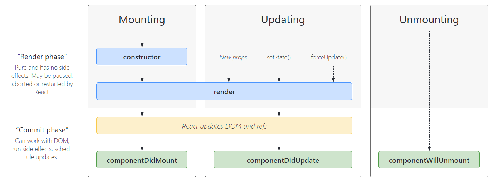

# React

**react是什么?**

-  React：用于构建用户界面的 JavaScript 库；
- React的官网文档：https://zh-hans.reactjs.org/

**React的特点**

- 声明式编程
  - 声明式编程是目前**整个大前端开发的模式**：Vue、React、Flutter、SwiftUI；
  - 它允许我们**只需要维护自己的状态，当状态改变时，React可以根据最新的状态去渲染我们的UI界面**

- 组件化开发
  - 组件化开发页面目前**前端的流行趋势**，我们会将复杂的界面拆分成**一个个小的组件；**
  - 如何**合理的进行组件的划分和设计**也是后面我会讲到的一个重点；

- 多平台适配
  - 2013年，React发布之初主要是**开发Web页面；**
  - 2015年，Facebook推出了**ReactNative**，用于**开发移动端跨平台**；（虽然目前Flutter非常火爆，但是还是有很多公司在使用ReactNative）；
  - 2017年，Facebook推出**ReactVR**，用于开发**虚拟现实Web应用程序**；（VR也会是一个火爆的应用场景）

**react开发依赖:**

- **开发React必须依赖三个库：**
  - **react**：包含react所必须的核心代码
  - **react-dom**：react渲染在不同平台所需要的核心代码
  - **babel**：将jsx转换成React代码的工具
- **第一次接触React会被它繁琐的依赖搞蒙，居然依赖这么多东西： （直接放弃？）**
  - 对于Vue来说，我们只是依赖一个vue.js文件即可，但是react居然要**依赖三个包。**
  - 其实呢，这三个库是**各司其职**的，目的就是**让每一个库只单纯做自己的事情;**
  - 在React的0.14版本**之前是没有react-dom这个概念的**，所有功能都包含在react里；
- **为什么要进行拆分呢？原因就是react-native。**
  - react包中包含了**react web和react-native**所共同拥有的**核心代码。**
  - react-dom针对**web和native**所完成的事情不同：
    - web端：react-dom会将jsx最终渲染成真实的DOM，显示在浏览器中
    - native端：react-dom会将jsx最终渲染成原生的控件（比如Android中的Button，iOS中的UIButton）

**Babel和React的关系:**

- **babel是什么呢？**
  - **Babel** ，又名 **Babel.js。**
  - 是目前前端使用非常广泛的**编译器、转移器。**
  - 比如当下**很多浏览器并不支持ES6的语法**，但是**确实ES6的语法非常的简洁和方便，我们开发时希望使用它**。
  - 那么编写源码时我们就可以**使用ES6来编写**，之后**通过Babel工具，将ES6转成大多数浏览器都支持的ES5的语法。**
- **React和Babel的关系：**
  - 默认情况下**开发React其实可以不使用babel。**
  - 但是前提是我们**自己使用 React.createElement 来编写源代码**，它编写的代码**非常的繁琐和可读性差。**
  - 那么我们就可以直接编写**jsx（JavaScript XML）的语法，并且让babel帮助我们转换成React.createElement。**
    

**React的依赖引入:**

- 所以，我们在编写React代码时，这三个依赖都是必不可少的。
- 那么，如何添加这三个依赖：
  - 方式一：直接CDN引入
  - 方式二：下载后，添加本地依赖
  - 方式三：通过npm管理（后续脚手架再使用）
- 暂时我们直接通过CDN引入，来演练下面的示例程序：
  - 这里有一个crossorigin的属性，这个属性的目的是为了拿到跨域脚本的错误信息

```js
<script src="https://unpkg.com/react@18/umd/react.development.js" crossorigin></script>
<script src="https://unpkg.com/react-dom@18/umd/react-dom.development.js" crossorigin></script>
<script src="https://unpkg.com/babel-standalone@6/babel.min.js"></script> 
```

## Hello  React案例

- 为了演练React，我们可以提出一个小的需求：
  - 在界面显示一个文本：Hello World
  - 点击下方的一个按钮，点击后文本改变为Hello React

```js
 <body>
    <div id="root"></div>

    <script
      src="https://unpkg.com/react@18/umd/react.development.js"
      crossorigin
    ></script>
    <script
      src="https://unpkg.com/react-dom@18/umd/react-dom.development.js"
      crossorigin
    ></script>
    <script src="https://unpkg.com/babel-standalone@6/babel.min.js"></script>

    <script type="text/babel">
      //定义变量
      let message = "hello world";

      //定义按钮函数
      function btnClick() {
        message = "hello React";
        //注意更改数据时，并不会实时刷新，需要重新调用函数
        rootRender();
      }
      //创建react根，并且将渲染的内容挂载到html元素上
      const root = ReactDOM.createRoot(document.querySelector("#root"));
      //使用jsx语法
      //注意：
      // 1.定义变量和函数都需要使用 {}语法
      //2.onClick要大写

      rootRender();
      function rootRender() {
        root.render(
          <div>
            <h2> {message} </h2>
            <button onClick={btnClick}>按钮</button>
          </div>
        );
      }
    </script>
  </body>
```

- **第一步：在界面上通过React显示一个Hello World**
  - 注意：这里我们编写React的script代码中，必须添加 type="text/babel"，作用是可以让babel解析jsx的语法

-  **ReactDOM. createRoot函数：用于创建一个React根，之后渲染的内容会包含在这个根中**
  - 参数：将渲染的内容，挂载到哪一个HTML元素上
    - 这里我们已经提定义一个id为app的div
- **root.render函数:**
  - 参数：要渲染的根组件
- **我们可以通过{ }语法来引入外部的变量或者表达式**

### Hello React – 组件化开发

- **整个逻辑其实可以看做一个整体，那么我们就可以将其封装成一个组件：**
  - 我们说过**root.render** 参数是一个**HTML元素或者一个组件；**
  - 所以我们可以先将之前的业务逻辑封装到**一个组件**中，然后传入到 ReactDOM.render 函数中的第一个参数；
- **在React中，如何封装一个组件呢？**这里我们暂时使用**类的方式**封装组件：
  - **1.定义一个类**（类名大写，组件的名称是必须大写的，小写会被认为是HTML元素），**继承自React.Component**
  - **2.实现当前组件的render函数**
    - render当中返回的jsx内容，就是之后React会帮助我们渲染的内容

```js
 <script type="text/babel">
      //使用类实现组件化
      class App extends React.Component {
        //定义数据
        constructor() {
          //调用super关键字，使用父类属性
          super();
          this.state = {
            message: "Hello World",
          };
          //也可以提前在constructor中显示绑定this,这样不需要每一次都显示绑定
          this.btnClick = this.btnClick.bind(this);
        }
        //定义方法(实例方法)
        btnClick() {
          //这里直接使用this,会拿到undefined，因为这里函数相当与被默认调用了
          //click = this.btnClick  相当于把btnClick的内存地址引用赋值给clickl了，在由click进行默认调用
          // click() 在类中和babel中会自动开启严格默认，所以默认调用this会指向undefined
          //我们需要使用显示绑定，这样就可以获取正确的this,
          //this.btnClick.bind(this),这里this,指向render函数的this,而他的this是app组件，所以可以正确获取
          // console.log("----", this);
          //更改state时，需要调用 一个内部函数setState，内部帮我们完成2件事 1.将state中的message修改掉，2.自动重新执行render函数
          this.setState({
            message: "Hello React",
          });
        }

        //渲染内容render方法
        render() {
          return (
            <div>
              <h2>{this.state.message}</h2>
              <button onClick = {this.btnClick.bind(this)}>更改内容</button>
            </div>
          );
        }
      }

      const root = ReactDOM.createRoot(document.querySelector("#root"));
      //可以放元素，同样也可以放组件
      root.render(<App />);
    </script>
```

**组件化 - 数据依赖:**

- 组件化问题一：**数据在哪里定义？**
- **在组件中的数据，我们可以分成两类：**
  - **参与界面更新的数据**：当数据变量时，需要更新组件渲染的内容；
  - **不参与界面更新的数据**：当数据变量时，不需要更新将组建渲染的内容；
- **参与界面更新的数据我们也可以称之为是参与数据流，这个数据是定义在当前对象的state中**
  - 我们可以通过在**构造函数中 this.state = {定义的数据}**
  - 当**我们的数据发生变化**时，我们可以**调用 this.setState 来更新数据**，并且通知React进行update操作；
    - 在进行update操作时，就会**重新调用render函数**，并且使用最新的数据，来渲染界面

**组件化 – 事件绑定:**

- **组件化问题二：事件绑定中的this**
  - 在类中直接定义一个函数，并且将这个函数绑定到**元素的onClick事件**上，当前**这个函数的this指向的是谁**呢？
- **默认情况下是undefined**
  - 很奇怪，居然是**undefined**；
  - 因为在正常的DOM操作中，监听点击，监听函数中的this其实是节点对象（比如说是button对象）；
  - 这次因为React并不是直接渲染成真实的DOM，我们所编写的button只是一个语法糖，它的本质React的Element对象；
  - 那么在这里发生监听的时候，react在执行函数时并没有绑定this，默认情况下就是一个undefined；
- **我们在绑定的函数中，可能想要使用当前对象，比如执行 this.setState 函数，就必须拿到当前对象的this**
  - 我们就需要在传入函数时，给这个函数直接绑定this
  - 类似于下面的写法： ` <button onClick={this.btnClick.bind(this)}>更改内容</button>`

电影列表展示:

```js
    <script type="text/babel">
      class MovieList extends React.Component {
        constructor() {
          super();
          this.state = {
            movies: [
              "大话西游",
              "星际穿越",
              "巨齿鲨",
              "成龙历险记",
              "米奇妙妙屋",
            ],
          };
        }

        render() {
          return (
            <ul>
              {this.state.movies.map((item) => {
                return <li key={item}> {item} </li>;
              })}
            </ul>
          );
        }
      }

      const root = ReactDOM.createRoot(document.querySelector("#root"));

      root.render(<MovieList />);
    </script>
```

计数器案例:

```js
 <script type="text/babel">
      class Count extends React.Component {
        constructor() {
          super();
          this.state = {
            count: 0,
          };
          this.decreatment = this.decreatment.bind(this);
          this.increatment = this.increatment.bind(this);
        }

        increatment() {
          this.setState({
            count: this.state.count + 1,
          });
        }

        decreatment() {
          this.setState({
            count: this.state.count - 1,
          });
        }

        render() {
          return (
            <div>
              <h2>{this.state.count} </h2>

              <button onClick={this.increatment}>+1</button>
              <button onClick={this.decreatment}>-1</button>
            </div>
          );
        }
      }

      const root = ReactDOM.createRoot(document.querySelector("#root"));

      root.render(<Count />);
    </script>
```

## React基础

### JSX语法

```js
const element =<div>Hello World</div>
//2.渲染根组件
const root ReactDOM.createRoot(document.querySelector("#root"))
root.render(element)
```

- **这段element变量的声明右侧赋值的标签语法是什么呢？**
  - 它不是一段字符串（因为没有使用引号包裹）；
  - 它看起来是一段HTML元素，但是我们能在js中直接给一个变量赋值html吗？
  - 其实是不可以的，如果我们将 type="text/babel" 去除掉，那么就会出现语法错误；
  - 它到底是什么呢？其实它是一段**jsx的语法；**
- **JSX是什么？**
  - JSX是**一种JavaScript的语法扩展（eXtension），也在很多地方称之为JavaScript XML，因为看起就是一段XML语法；**
  - 它用于**描述我们的UI界面**，并且其**完成可以和JavaScript融合在一起使用；**
  - 它**不同于Vue中的模块语法**，你**不需要专门学习模块语法中的一些指令**（比如v-for、v-if、v-else、v-bind）

#### 为什么React选择了JSX

- React认为**渲染逻辑**本质上**与其他UI逻辑**存在内在耦合
  - 比如**UI需要绑定事件**（button、a原生等等）；
  - 比如**UI中需要展示数据状态；**
  - 比如**在某些状态发生改变时，又需要改变UI；**
- 他们之间是**密不可分**，所以React**没有将标记分离到不同的文件中**，而是**将它们组合到了一起**，这个地方就是**组件（Component）；**
  - 当然，后面我们还是会继续学习更多组件相关的东西；
- 在这里，我们只需要知道，JSX其实是嵌入到JavaScript中的一种结构语法；
- **JSX的书写规范：**
  - JSX的顶层**只能有一个根元素**，所以**我们很多时候会在外层包裹一个div元素**（或者使用后面我们学习的Fragment）；
  - 为了方便阅读，我们通常在jsx的外层包裹一个小括号()，这样可以方便阅读，并且jsx可以进行换行书写；
  - JSX中的标签可以是**单标签**，也可以是**双标签**；
    - 注意：如果是单标签，必须以/>结尾；

#### JSX的使用

- **jsx中的注释**
- **JSX嵌入变量作为子元素**
  - **情况一**：当变量是**Number、String、Arr ay类型**时，可以直接显示
  - **情况二**：当变量是**null、undefined、Boolean类型**时，内容为空；
    - 如果希望可以显示null、undefined、Boolean，那么需要转成字符串；
    - 转换的方式有很多，比如toString方法、和空字符串拼接，String(变量)等方式；
  - **情况三：Object对象类型不能**作为子元素（not valid as a React child）
-  JSX嵌入表达式
  - **运算表达式**
  - **三元运算符**
  - **执行一个函数**
-  **jsx绑定属性**
  - 如元素都会有**title属性**
  - 比如img元素会有**src属性**
  - 比如a元素会有**href属性**
  - 比如元素可能需要**绑定class**
  - 比如原生使用**内联样式style**

```js
  <script type="text/babel">
      class App extends React.Component {
        constructor() {
          super();
          this.state = {
            message: "Hello world",
            movies: ["星球大战", "流浪地球", "穿越星际"],
            age: 18,
          };
        }

        render() {
          const { message, movies, age } = this.state;
          const isAdult = age >= 18 ? "已成年" : "未成年";
          let isShow = true;
          const className = isShow ? "bbb" : "";

          const classList = ["abc", "cba"];
          if (isShow) classList.push("bbb");
          return (
            <div>
              {/*在JSX中写注释要使用{}语法包裹，并且是多行注释的写法 */}
              <h2>{message}</h2>
              {/*
              情况一：当变量是Number、String、Array类型时，可以直接显示
              情况二：当变量是null、undefined、Boolean类型时，内容为空；
               情况三：Object对象类型不能作为子元素（not valid as a React child）
              */}
              <h2>{movies.join(" ")} </h2>

              {/*嵌入表达式*/}
              <h2> {isAdult} </h2>

              {/*绑定属性
                title/src/href普通的属性，使用{语法即可绑定}

                class选择器要使用className,因为class在js中是关键字
                动态绑定属性时，可以使用模板字符串动态绑定属性，还可以使用 逻辑判断语句，js写法进行绑定
              */}

              <h2 className={`abc cba ${className}`}>哈哈啊哈 </h2>
              <h2 className={classList.join()}>哈哈啊哈 </h2>

              {/*绑定内联样式style
                要写成对象写法才会生效，并且不能使用纯小写
              { } 是一个语法 里面的{ }是一个对象
              */}
              <h2 style={{ color: "red" }}>我是style</h2>
            </div>
          );
        }
      }

      const root = ReactDOM.createRoot(document.querySelector("#root"));

      root.render(<App />);
    </script>
```

#### React事件绑定

-  如果原生DOM原生有一个监听事件，我们可以如何操作呢？
  - 方式一：获取DOM原生，添加监听事件；
  - 方式二：在HTML原生中，直接绑定onclick；
- 在React中是如何操作呢？我们来实现一下React中的事件监听，这里主要有两点不同
  - React 事件的**命名采用小驼峰式（camelCase），而不是纯小写**；
  - 我们需要**通过{ }传入一个事件处理函数**，这个函数会在事件发生时被执行

##### this的绑定问题

- **在事件执行后，我们可能需要获取当前类的对象中相关的属性，这个时候需要用到this**
  - 如果我们这里直接打印this，也会发现它是一个undefined
- **为什么是undefined呢？**
  - 原因是btnClick函数并不是我们主动调用的，而且当button发生改变时，**React内部调用了btnClick函数；**
  - 而它内部调用时，并不知道要如何绑定正确的this，这时候就会是undefined；
- **如何解决this的问题呢？**
  - **方案一**：bind给btnClick显示绑定this
  - **方案二**：使用 ES6 class fields 语法
  - **方案三**：事件监听时传入箭头函数（个人推荐）

##### 事件参数传递

- **在执行事件函数时，有可能我们需要获取一些参数信息：比如event对象、其他参数**
-  **情况一：获取event对象**
  - 很多时候我们需要拿到**event对象**来做一些事情（比如阻止默认行为）
  - 那么默认情况下，**event对象有被直接传入**，函数就可以获取到event对象；
- **情况二：获取更多参数**
  - 有更多参数时，我们最好的方式就是**传入一个箭头函数，主动执行的事件函数，并且传入相关的其他参数**

```js
    <script type="text/babel">
      class App extends React.Component {
        constructor() {
          super();
          this.state = {
            counter: 0,
          };
        }

        btn1Click(event) {
          console.log(this, event);
          this.setState({ counter: this.state.counter + 1 });
        }

        btn2Click = (event) => {
          console.log(this, event);
          this.setState({ counter: this.state.counter + 100 });
        };

        btn3Click(e, name, age) {
          console.log(this, e, name, age);
          this.setState({ counter: this.state.counter + 1000 });
        }
        render() {
          return (
            <div>
              {/*this绑定方式一：bind绑定
               默认 把btn1Click的引用地址赋值给 onClick,react内部帮我们进行默认调用，所以this会指向undefined
              */}
              <h3>{this.state.counter} </h3>
              <button onClick={this.btn1Click.bind(this)}>+1</button>

              {/*this绑定方式二：Es6 Class field
                这里利用了箭头函数，箭头函数内部没有this, 所以在onClick内部进行调用时，不会在react内部找this,会向外层作用域                 也就是App找this
                最后也就找到了当前组件
              */}
              <button onClick={this.btn2Click}>+100</button>

              {/*this绑定方式三：事件监听时传入箭头函数(强烈推荐)
                这里相当于把箭头函数赋值给 onClick， 内部对事件函数进行隐式调用，就不会出现方式一中 引用地址赋值操作
                所以当前this会指向当前组件，进行了隐式调用
                注意：使用箭头函数要获取 event对象时，我们需要通过箭头函数把event传递给我们的事件函数
                这是因为，react内部在进行onClick调用时，对event进行了包装，
                我们是在函数内部又调用了一个函数，所以需要手动传递一下
                方式一和方式二，则没有这个问题
              */}
              <button onClick={(e) => this.btn3Click(e, "lwy", 18)}>
                +1000
              </button>
            </div>
          );
        }
      }
      const root = ReactDOM.createRoot(document.querySelector("#root"));

      root.render(<App />);
    </script>
```

#### React条件渲染

- **某些情况下，界面的内容会根据不同的情况显示不同的内容，或者决定是否渲染某部分内容：**

  - 在vue中，我们会通过指令来控制：比如v-if、v-show；
  - 在React中，**所有的条件判断都和普通的JavaScript代码一致；**

- **常见的条件渲染的方式有哪些呢？**

  - **方式一：条件判断语句**

    - 适合逻辑较多的情况

  - **方式二：三元运算符**

    - 适合逻辑比较简单

  - **方式三：与运算符&&**

    - 适合如果条件成立，渲染某一个组件；如果条件不成立，什么内容也不渲染；

  - **v-show的效果**

    - 主要是控制display属性是否为none

    ```js
     <script type="text/babel">
          class App extends React.Component {
            constructor() {
              super();
              this.state = {
                isShow: true,
                friend: {
                  name: "lwy",
                  age: 20,
                },
              };
            }
    
            changeSHow() {
              this.setState({ isShow: !this.state.isShow });
            }
            render() {
              const { isShow, friend } = this.state;
              let isELs = null;
    
              if (isShow) {
                isELs = <h2>准备开始战斗</h2>;
              } else {
                isELs = <h2>我还没有准备好</h2>;
              }
              return (
                <div>
                  {/*方式一 ：条件判断语句*/}
                  <div>{isELs}</div>
    
                  {/*方式二：三元运算符*/}
    
                  <div>{isShow ? <div>我准备好了</div> : "我还没有准备好"}</div>
    
                  {/*方式三 ：逻辑与 &&与运算符
                   他会展示最后一个条件
                   如果前面不成立，则不会展示
                  */}
                  <h2>{isShow && friend && friend.name} </h2>
                  {/*方式四：模仿 v-show展示*/}
                  <h2 style={{ display: isShow ? "block" : "none" }}>模仿v-show</h2>
    
                  <button onClick={() => this.changeSHow()}>change</button>
                </div>
              );
            }
          }
    
          const root = ReactDOM.createRoot(document.querySelector("#root"));
    
          root.render(<App />);
        </script>
    ```

    

#### React列表渲染

- **真实开发中我们会从服务器请求到大量的数据，数据会以列表的形式存储：**
  - 比如歌曲、歌手、排行榜列表的数据；
  - 比如商品、购物车、评论列表的数据；
  - 比如好友消息、动态、联系人列表的数据；
- **在React中并没有像Vue模块语法中的v-for指令，而且需要我们通过JavaScript代码的方式组织数据，转成JSX：**
  - 很多从**Vue转型到React的同学非常不习惯**，认为**Vue的方式更加的简洁明了；**
  - 但是**React中的JSX正是因为和JavaScript无缝的衔接，让它可以更加的灵活；**
  - 另外我经常会提到**React是真正可以提高我们编写代码能力的一种方式；**
- **如何展示列表呢？**
  - 在React中，展示列表最多的方式就是使用数组的**map高阶函数；**
  - **很多时候我们在展示一个数组中的数据之前，需要先对它进行一些处理：**
    - 比如过滤掉一些内容：**filter函数**
    - 比如截取数组中的一部分内容：**slice函数**

- **列表中的key：**
  - key主要的作用是为了提高diff算法时的效率；

#### JSX的本质

- **实际上，jsx 仅仅只是 React.createElement(component, props, ...children) 函数的语法糖。**
  - 所有的jsx最终都会被转换成**React.createElement**的函数调用。
- **createElement需要传递三个参数：**
- **参数一：type**
  - 当前ReactElement的类型；
  - 如果是标签元素，那么就使用字符串表示 “div”；
  - 如果是组件元素，那么就直接使用组件的名称；
- **参数二：config**
  - 所有jsx中的属性都在config中以对象的属性和值的形式存储；
  - 比如传入className作为元素的class；
- **参数三：children**
  - 存放在标签中的内容，以children数组的方式进行存储；
  - 当然，如果是多个元素呢？React内部有对它们进行处理，处理的源码在下方

- **我们知道默认jsx是通过babel帮我们进行语法转换的，所以我们之前写的jsx代码都需要依赖babel。**
- **可以在babel的官网中快速查看转换的过程**：https://babeljs.io/repl/#?presets=react

**我们自己来编写React.createElement代码：**

- 我们就没有通过jsx来书写了，界面依然是可以正常的渲染。
- 另外，在这样的情况下，你还需要babel相关的内容吗？不需要了
  - 所以，type="text/babel"可以被我们删除掉了；
  - 所以，可以被我们删除掉了；

##### 虚拟DOM的创建过程

```js
return ReactElement(
type,
key,
ref,
self,
source,
ReactCurrentowner.current,
props,
    }
```

- **我们通过 React.createElement 最终创建出来一个 ReactElement对象：**
- **这个ReactElement对象是什么作用呢？React为什么要创建它呢？**
  - 原因是React利用ReactElement对象组成了一个**JavaScript的对象树；**
  - JavaScript的对象树就是**虚拟DOM（Virtual DOM）；**
- **如何查看ReactElement的树结构呢？**
  - 我们可以将**之前的jsx返回结果进行打印；**
- **而ReactElement最终形成的树结构就是Virtual DOM**

> 我们的JSX代码会被babel转换成ReactElement()对象转换成虚拟dom
>
> 如果不使用babel，可以直接编写 react.createElelment()相当于babel帮我们把这个事情做了
>
> 再由虚拟dom转换成真实dom的过程

- **虚拟DOM帮助我们从命令式编程转到了声明式编程的模式**
- **React官方的说法**：Virtual DOM 是一种编程理念。
  - 在这个理念中，UI以一种理想化或者说虚拟化的方式保存在内存中，并且它是一个相对简单的JavaScript对象
  - 我们可以通过ReactDOM.render让 虚拟DOM 和 真实DOM同步起来，这个过程中叫做协调（Reconciliation）；
- 这种编程的方式赋予了React声明式的API：
  - 你只需要告诉React希望让UI是什么状态；
  - React来确保DOM和这些状态是匹配的；
  - 你不需要直接进行DOM操作，就可以从手动更改DOM、属性操作、事件处理中解放出来；

**虚拟dom的好处:**

> 主要有2点:
>
> 1.操作虚拟dom在大多数情况下是比真实dom性能更好的
>
>    如果dom比较少，操作真实dom可能更好
>
>    当进行修改数据等操作时，操作虚拟dom可以只修改部分数据，但是真实dom会把整体进行刷新
>
> ​    react内部会进行diff算法，比较新旧节点的差异，尽可以的减少操作
>
> 
>
> 2.虚拟dom可以进行多平台开发，经过虚拟dom针对不同的平台进行开发

## React脚手架

- React脚手架本身需要依赖node，所以我们需要安装node环境：

- 创建React项目的命令如下：

  - 注意：项目名称**不能包含大写字母**
  - 另外还有更多创建项目的方式，可以参考GitHub的readme

- 首先需要安装脚手架

  ```js
  npm i  create-react-app -g  #全局安装
  ```

  - 创建项目

```js
create-react-app 项目名称
```

- 创建完成后，进入对应的目录，就可以将项目跑起来：

  ```js
  cd 01-test-react
  yarn start
  ```

### 了解PWA

- **整个目录结构都非常好理解，只是有一个PWA相关的概念：**
  - PWA全称**Progressive Web App**，即**渐进式WEB应用；**
  - 一个 PWA 应用首先是**一个网页**, 可以**通过 Web 技术编写出一个网页应用；**
  - 随后添加上 **App Manifest** 和 **Service Worker** 来实现 PWA 的**安装和离线**等功能；
  - 这种Web存在的形式，我们也称之为是 **Web App；**
- **PWA解决了哪些问题呢？**
  - 可以**添加至主屏幕**，点击主屏幕图标可以实现启动动画以及隐藏地址栏；
  - 实现**离线缓存功能**，即使用户手机没有网络，依然可以使用一些离线功能；
  - 实现了**消息推送；**
  - 等等一系列类似于Native App相关的功能；
- **更多PWA相关的知识，可以自行去学习更多；**
  - https://developer.mozilla.org/zh-CN/docs/Web/Progressive_web_apps

### 脚手架中的webpack

- **React脚手架默认是基于Webpack来开发的；**
- **但是，很奇怪：我们并没有在目录结构中看到任何webpack相关的内容？**
  - 原因是React脚手架**将webpack相关的配置隐藏起来了**（其实从Vue CLI3开始，也是进行了隐藏）；
- **如果我们希望看到webpack的配置信息，应该怎么来做呢？**
  - 我们可以执行一个package.json文件中的一个脚本：**"eject": "react-scripts eject"**
  - 这个操作是不可逆的，所以在执行过程中会给与我们提示；

```js
npm eject
```

在index.js中编写代码和在开始HTMl中编写是一样的,只不过需要手动引入react和react-dom

```js
import React from "react";
import ReactDOM from "react-dom/client";

class App extends React.Component {
  constructor() {
    super();
    this.state = {
      message: "Hello React",
    };
  }

  render() {
    const { message } = this.state;
    return <div>{message}</div>;
  }
}

const root = ReactDOM.createRoot(document.querySelector("#root"));

root.render(<App />);

```

## React组件化开发

- **组件化思想的应用：**
  - 有了组件化的思想，我们在之后的开发中就要充分的利用它。
  - 尽可能的将页面拆分成一个个小的、可复用的组件。
  - 这样让我们的代码更加方便组织和管理，并且扩展性也更强。
- **React的组件相对于Vue更加的灵活和多样，按照不同的方式可以分成很多类组件：**
  - **根据组件的定义方式**，可以分为：**函数组件(Functional Component )**和**类组件(Class Component)；**
  - **根据组件内部是否有状态需要维护**，可以分成：**无状态组件(Stateless Component )**和**有状态组件(Stateful Component)；**
  - **根据组件的不同职责**，可以分成：**展示型组件(Presentational Component)**和**容器型组件(Container Component)；**
- **这些概念有很多重叠，但是他们最主要是关注数据逻辑和UI展示的分离：**
  - **函数组件、无状态组件、展示型组件**主要关注UI的展示；
  - **类组件、有状态组件、容器型组件**主要关注数据逻辑；
- **当然还有很多组件的其他概念：比如异步组件、高阶组件等，后续再学习。**

### 类组件

- **类组件的定义有如下要求：**
  - **组件的名称是大写字符开头**（无论类组件还是函数组件）
  - 类组件需要**继承自 React.Component**
  - 类组件必须实现**render函数**
- **在ES6之前，可以通过create-react-class 模块来定义类组件，但是目前官网建议我们使用ES6的class类定义。**
- **使用class定义一个组件：**
  - constructor是可选的，我们通常在constructor中初始化一些数据；
  - this.state中维护的就是我们组件内部的数据；
  - **render()** 方法是 class 组件中**唯一必须实现的方法；**

#### **render函数的返回值**

- **当 render 被调用时，它会检查 this.props 和 this.state 的变化并返回以下类型之一：**
- **React 元素：**
  - 通常通过 JSX 创建。
  -  例如，`<div/>`会被 React 渲染为 DOM 节点，`<MyComponent/>` 会被 React 渲染为自定义组件；
  - 无论是 `<div/>` 还是 `<MyComponent/>` 均为 React 元素
- **数组或 fragments：**使得 render 方法可以返回多个元素。
  - 如果是数组，则会对数组内容进行遍历，按个排序展示
- **Portals**：可以渲染子节点到不同的 DOM 子树中。
- **字符串或数值类型**：它们在 DOM 中会被渲染为文本节点
- **布尔类型或 null**：什么都不渲染。

### 函数组件

- **函数组件是使用function来进行定义的函数，只是这个函数会返回和类组件中render函数返回一样的内容。**
-  **函数组件有自己的特点（当然，后面我们会讲hooks，就不一样了）：**
  - 没有生命周期，也会被更新并挂载，但是没有生命周期函数；
  - this关键字不能指向组件实例（因为没有组件实例）；
  - 没有内部状态（state）；
- **我们来定义一个函数组件:**

```js
function MyFun() {
  return (
    /*
    不可以定义状态
    this不可以指向组件实例
    没有生命周期函数
    */
    <div>
      <h2>我是函数组件</h2>
    </div>
  );
}

export default MyFun;

```

- **在前面的学习中，我们主要讲解类组件，后面学习Hooks时，会针对函数式组件进行更多的学习。**

### 生命周期函数

- 很多的事物都有从创建到销毁的整个过程，这个过程称之为是生命周期；
- React组件也有自己的生命周期，了解组件的生命周期可以让我们**在最合适的地方完成自己想要的功能；**
- **生命周期和生命周期函数的关系：**
- **生命周期是一个抽象的概念，在生命周期的整个过程，分成了很多个阶段；**
  - 比如装载阶段（Mount），组件第一次在DOM树中被渲染的过程；
  - 比如更新过程（Update），组件状态发生变化，重新更新渲染的过程；
  - 比如卸载过程（Unmount），组件从DOM树中被移除的过程；
- **React内部为了告诉我们当前处于哪些阶段，会对我们组件内部实现的某些函数进行回调，这些函数就是生命周期函数：**
  - 比如实现componentDidMount函数：组件已经挂载到DOM上时，就会回调；
  - 比如实现componentDidUpdate函数：组件已经发生了更新时，就会回调；
  - 比如实现componentWillUnmount函数：组件即将被移除时，就会回调；
  - 我们可以在这些回调函数中编写自己的逻辑代码，来完成自己的需求功能；
- 我们谈React生命周期时，主要谈的类的生命周期，因为函数式组件是没有生命周期函数的；（后面我们可以通过hooks来模拟一些生命周期的回调）

**常用的生命周期图:**



- **Constructor**
  - 如果不初始化 state 或不进行方法绑定，则不需要为 React 组件实现构造函数。
  - constructor中通常只做两件事情：
    - 通过给 this.state 赋值对象来初始化内部的state；
    - 为事件绑定实例（this）；
- **componentDidMount**
  - componentDidMount() 会在组件挂载后（插入 DOM 树中）立即调用。
  - componentDidMount中通常进行哪里操作呢？
    - 依赖于DOM的操作可以在这里进行；
    - 在此处发送网络请求就最好的地方；（官方建议）
    - 可以在此处添加一些订阅（会在componentWillUnmount取消订阅）

- **componentDidUpdate**
  - componentDidUpdate() 会在更新后会被立即调用，首次渲染不会执行此方法。 
    - 当组件更新后，可以在此处对 DOM 进行操作；
    - 如果你对更新前后的 props 进行了比较，也可以选择在此处进行网络请求；（例如，当 props 未发生变化时，则不会执行网络请求）。
-  **componentWillUnmount**
  - componentWillUnmount() 会在组件卸载及销毁之前直接调用。
    - 在此方法中执行必要的清理操作；
    - 例如，清除 timer，取消网络请求或清除在 componentDidMount() 中创建的订阅等；

**不常用生命周期函数:**

- **除了上面介绍的生命周期函数之外，还有一些不常用的生命周期函数：**
  - getDerivedStateFromProps：state 的值在任何时候都依赖于 props时使用；该方法返回一个对象来更新state；
  - **getSnapshotBeforeUpdate**：在React更新DOM之前回调的一个函数，**可以获取DOM更新前的一些信息（比如说滚动位置）；**
  - **shouldComponentUpdate**：该生命周期函数很常用，**返回布尔值，可以决定数据更新后是否重新调用render函数,可以用于性能优化；**
  - **forceUpdata**:该生命周期函数会强制更新render函数
- 另外，React中还提供了一些过期的生命周期函数，这些函数已经不推荐使用。
- 更详细的生命周期相关的内容，可以参考官网：https://zh-hans.reactjs.org/docs/reactcomponent.html


```js
import React, { Component } from "react";

class HelloWorld extends Component {
  constructor() {
    super();
    this.state = {
      message: "Hello World",
    };
    console.log("constructor");
  }

  changeText() {
    //当文本更新时会重新执行
    this.setState({ message: "我是新的文本" });
  }
  render() {
    const { message } = this.state;
    console.log("render");
    return (
      <div>
        <h2>{message} </h2>
        <button onClick={(e) => this.changeText()}>更改文本</button>
      </div>
    );
  }
  componentDidMount() {
    console.log("HelloWorld componentDidMount", "我会在Dom挂载完毕执行");
  }
  componentDidUpdate(preProps, preState, getSnapshot) {
    //这里有3个参数，可以获取更新前的props,state,和记录的快照信息
    console.log(
      "HelloWorld componentDidUpdate",
      "我会在数据更新完成执行",
      preProps,
      preState,
      getSnapshot
    );
  }
  componentWillUnmount() {
    console.log("HelloWorld componentWillUnmount", "我会在组件销毁之前执行");
  }
  getSnapshotBeforeUpdate() {
    console.log(
      "HelloWorld getSnapshotBeforeUpdate",
      "我会记录Dom更新之前的一些信息"
    );
    return {
      scrollTop: 1000,
    };
  }
  shouldComponentUpdate() {
    console.log("我会返回布尔值,决定更新执行是否要执行render函数,用于性能优化");
    return false;
  }
}

export default HelloWorld;

```

### 组件之间通信

#### 父传子

- **在开发过程中，我们会经常遇到需要组件之间相互进行通信：**
  - 比如App可能使用了多个Header，每个地方的Header展示的内容不同，那么我们就需要使用者传递给Header一些数据，让其进行展示；
  - 又比如我们在Main中一次性请求了Banner数据和ProductList数据，那么就需要传递给他们来进行展示；
  - 也可能是子组件中发生了事件，需要由父组件来完成某些操作，那就需要子组件向父组件传递事件；
- **总之，在一个React项目中，组件之间的通信是非常重要的环节；**
- **父组件在展示子组件，可能会传递一些数据给子组件：**
  - 父组件通过 **属性=值** 的形式来传递给子组件数据；
  - 子组件通过 **props 参数**获取父组件传递过来的数据

父组件:

```js
import React, { Component } from "react";
import MainBanner from "./mainBanner";
import axios from "axios";
class main extends Component {
  constructor() {
    super();
    this.state = {
      banners: [],
    };
  }
  componentDidMount() {
    axios.get("http://123.207.32.32:8000/home/multidata").then((res) => {
      const banners = res.data.data.banner.list;

      this.setState({ banners: banners });
    });
  }

  render() {
    const { banners } = this.state;
    return (
      <div>
        {/* 父传子：父组件直接通过子组件进行传入数据即可，子组件会在constructor中进行接收
                    使用super进行props的传递给Component类，Component类内部会自动帮我们进行一个props对象的维护
                    this.props = props, 所以在render函数中我们可以通过this.props访问到父组件传递的属性
        */}

        <MainBanner banners={banners} />
        <MainBanner />
      </div>
    );
  }
}

export default main;

```

子组件：

```js
import React, { Component } from "react";

import PropTypes from "prop-types";
class mainBanner extends Component {
  //也可以写成类的静态属性形式,第一种写法
  static propTypes = {
    banners: PropTypes.array.isRequired,
  };
  static defaultProps = {
    banners: [],
  };
  constructor(props) {
    //相当于通过constructor传入数据，在通过super()传给Component类
    //内部帮你维护了一个props对象，所以我们也可以在render函数中访问props对象
    //这种是完整写法，实际可以省略，react内部帮我们做了这些事情，我们可以直接在render函数中使用props
    super(props);
    console.log(props);
  }
  render() {
    const { banners } = this.props;
    return (
      <div>
        <ul>
          {banners.map((item) => {
            return <li key={item.acm}>{item.title}</li>;
          })}
        </ul>
      </div>
    );
  }
}
//第二种写法
//对props进行类型限制
mainBanner.propTypes = {
  banners: PropTypes.array,
};
//对prop 进行默认值设置
mainBanner.defaultProps = {
  banners: [],
};

export default mainBanner;

```

#### 参数propTypes

- 对于传递给子组件的数据，有时候我们可能希望进行验证，特别是对于大型项目来说：
  - 当然，如果你项目中默认继承了Flow或者TypeScript，那么直接就可以进行类型验证；
  - 但是，即使我们没有使用Flow或者TypeScript，也可以通过 prop-types 库来进行参数验证；
- 从 React v15.5 开始，React.PropTypes 已移入另一个包中：prop-types 库
- 更多的验证方式，可以参考官网：https://zh-hans.reactjs.org/docs/typechecking-with-proptypes.html
  - 比如验证数组，并且数组中包含哪些元素；
  - 比如验证对象，并且对象中包含哪些key以及value是什么类型；
  - 比如某个原生是必须的，使用 requiredFunc: PropTypes.func.isRequired
- **如果没有传递，我们希望有默认值呢？**
  - 我们使用defaultProps就可以了

#### 子传父

- 某些情况，我们也需要子组件向父组件传递消息：
  - 在vue中是通过自定义事件来完成的；
  - 在React中同样是通过props传递消息，**只是让父组件给子组件传递一个回调函数，在子组件中调用这个函数即可**；

- 我们这里来完成一个案例：
  - 将计数器案例进行拆解；
  - 将按钮封装到子组件中：CounterButton；
  - CounterButton发生点击事件，将内容传递到父组件中，修改counter的值

父组件:

```js
import React, { Component } from "react";
import AddCount from "./addCount";
class App extends Component {
  constructor() {
    super();
    this.state = {
      count: 100,
    };
  }
  changeCount(count) {
    this.setState({ count: this.state.count + count });
  }
  render() {
    return (
      <div>
        <h2>{this.state.count} </h2>
        {/* 子传父还是利用props,只不过传入的是一个函数，在子组件中需要调用这个函数传入要传递的数据即可 */}
        <AddCount addClick={(count) => this.changeCount(count)} />
      </div>
    );
  }
}

export default App;

```

子组件:

```js
import React, { Component } from "react";

class addCount extends Component {
  addCount(count) {
      //调用props的函数，传入对应的数据
    this.props.addClick(count);
  }
  render() {
    return (
      <div>
        <button
          onClick={() => {
            this.addCount(1);
          }}
        >
          +1
        </button>
        <button
          onClick={() => {
            this.addCount(5);
          }}
        >
          +5
        </button>
        <button
          onClick={() => {
            this.addCount(10);
          }}
        >
          +10
        </button>
      </div>
    );
  }
}

export default addCount;

```

#### React中的插槽（slot）

- **在开发中，我们抽取了一个组件，但是为了让这个组件具备更强的通用性，我们不能将组件中的内容限制为固定的div、span等等**
  **这些元素。**
- **我们应该让使用者可以决定某一块区域到底存放什么内容**

- **这种需求在Vue当中有一个固定的做法是通过slot来完成的，React呢？**
- **React对于这种需要插槽的情况非常灵活，有两种方案可以实现：**
  - 组件的**children**子元素；
  - **props**属性传递React元素

父组件：

```js
import React, { Component } from "react";
import NvaBar1 from "./NvaBar1";
import NvaBar2 from "./NvaBar2";
class App extends Component {
  render() {
    return (
      <div>
        {/* 插槽形式一：children子元素形式 */}
        <NvaBar1>
          <button>按钮</button>
          <span>我是span</span>
          <i>我是i元素</i>
        </NvaBar1>
        {/* 插槽形式二：利用props，进行元素的传递 */}
        <NvaBar2
          // 这里通过函数传参的方式实现了作用域插槽，父组件插槽中的内容由子组件内部的数据决定
          leftSolt={(i) => <button>{i}</button>}
          centerSolt={<span>我是span2</span>}
          rightSolt={<i>我是i元素2</i>}
        />
      </div>
    );
  }
}

export default App;

```

子组件：children实现

- **每个组件都可以获取到 props.children：它包含组件的开始标签和结束标签之间的内容。**

```js
import React, { Component } from "react";
import "./style.css";
//实现方式一：利用props中的children属性实现
export class index extends Component {
  render() {
    // 在props中有一个children属性，在里面可以拿到我们组件的子元素
    //如果只有一个子元素，children会 === 这个元素，如果有多个，children以数组形式保存
    const { children } = this.props;
    return (
      <div className="navbar">
        <div className="left">{children[0]} </div>
        <div className="center">{children[1]} </div>
        <div className="right"> {children[2]}</div>
      </div>
    );
  }
}

export default index;

```

子组件：props实现

- **通过children实现的方案虽然可行，但是有一个弊端：通过索引值获取传入的元素很容易出错，不能精准的获取传入的元素；**
- **另外一个方案就是使用 props 实现：**
  - 通过具体的属性名，可以让我们在传入和获取时更加的精准；

```js
import React, { Component } from "react";
import "./style.css";
//实现方式二：利用props传值进行实现
export class index extends Component {
  render() {
    const { leftSolt, centerSolt, rightSolt } = this.props;
    console.log(this.props);
    return (
      <div className="navbar">
        <div className="left">
          {leftSolt("我是按钮2---通过函数传参的方式实现了作用域插槽")}
        </div>
        <div className="center">{centerSolt} </div>
        <div className="right"> {rightSolt}</div>
      </div>
    );
  }
}

export default index;

```

#### 非父子组件通信-Context

- **非父子组件数据的共享：**
  - 在开发中，比较常见的数据传递方式是通过props属性自上而下（由父到子）进行传递。
  - 但是对于有一些场景：比如一些数据需要在多个组件中进行共享（地区偏好、UI主题、用户登录状态、用户信息等）。
  - 如果我们在顶层的App中定义这些信息，之后一层层传递下去，那么对于一些中间层不需要数据的组件来说，是一种冗余的操作。
- **我们实现一个一层层传递的案例：**
  - 这边顺便补充一个小的知识点：https://zh-hans.legacy.reactjs.org/docs/jsx-in-depth.html
    - 传递一个对象数据时，可以使用展开运算符(...info)进行传递
- **但是，如果层级更多的话，一层层传递是非常麻烦，并且代码是非常冗余的：**
  - React提供了一个**API：Context**；
  - Context 提供了一种**在组件之间共享此类值的方式**，而**不必显式地通过组件树的逐层传递 props；**
  - Context 设计目的是为了**共享那些对于一个组件树而言是“全局”的数据**，例如当前认证的用户、主题或首选语言

##### Context相关API

- **React.createContext**
  - 创建一个需要共享的Context对象：
  - 如果一个组件订阅了Context，那么这个组件会从离自身最近的那个匹配的 Provider 中读取到当前的context值；
  - defaultValue是组件在顶层查找过程中没有找到对应的Provider，那么就使用默认值

```js
export const ThemeConText = React.createContext({ color: "red", size: "30" });
```

- **Context.Provider**
  - 每个 Context 对象都会返回一个 Provider React 组件，它允许消费组件订阅 context 的变化：
  - Provider 接收一个 value 属性，传递给消费组件；
  -  一个 Provider 可以和多个消费组件有对应关系；
  - 多个 Provider 也可以嵌套使用，里层的会覆盖外层的数据；
  - 当 Provider 的 value 值发生变化时，它内部的所有消费组件都会重新渲染；

```js
 <ThemeConText.Provider value={{ color: "blue", size: "50" }}>
          <Home />
 </ThemeConText.Provider>
        {/* AAA组件不在提供value的范围，所以它使用时，会使用默认值 */}
        <AAA />
```

- **Class.contextType**
  - 挂载在 class 上的 contextType 属性会被赋值为一个由 React.createContext() 创建的 Context 对象：
  - 这能让你使用 this.context 来消费最近 Context 上的那个值；
  - 你可以在任何生命周期中访问到它，包括 render 函数中；

```js
home.contextType = ThemeConText;
```

- **Context.Consumer**
  - 这里，React 组件也可以订阅到 context 变更。这能让你在 **函数式组件** 中完成订阅 context。
  - 这里需要 函数作为子元素（function as child）这种做法；
  - 这个函数接收当前的 context 值，返回一个 React 节点；

```js
<ThemeConText.Consumer>
        {(value) => {
          return <h2>{value.size}</h2>;
        }}
   </ThemeConText.Consumer>
```

> 这里就不需要使用 **Class.contextType**对context进行订阅操作
>
> 可以直接使用**Context.Consumer**

- **什么时候使用Context.Consumer呢？**
  - 1.当使用value的组件是一个**函数式组件**时；
  - 2.当组件中需要使用**多个Context**时；

##### **使用步骤**

**一：创建context共享对象：**

```js
export const ThemeConText = React.createContext({ color: "red", size: "30" });
```

**二：使用context.Provider组件包裹要传递value的组件：**

```js
import React, { Component } from "react";
import Home from "./home";
import AAA from "./aaa";
import { ThemeConText } from "./context/context";
//创建上下文，并且传入默认值
class App extends Component {
  render() {
    return (
      <div>
        <ThemeConText.Provider value={{ color: "blue", size: "50" }}>
          <Home />
        </ThemeConText.Provider>
        {/* AAA组件不在提供value的范围，所以它使用时，会使用默认值 { color: "red", size: "30" }*/}
        <AAA />
      </div>
    );
  }
}

export default App;

```

**三：组件对contextType进行订阅操作：**

只有订阅了才可以获取订阅context的值

```js
home.contextType = ThemeConText;
```

或者直接使用Context.Consumer组件

```js
<ThemeConText.Consumer>
        {(value) => {
          return <h2>{value.size}</h2>;
        }}
   </ThemeConText.Consumer>
```

四：进行使用

```js
import React, { Component } from "react";
import { ThemeConText } from "./context/context";

class homeInfo extends Component {
  render() {
    //在类组件中可以使用this.context访问到订阅的context的数据，如果没有被Context.provider组件包裹则使用默认数据
    console.log(this.context);
    return <div>homeInfo - theme: {this.context.color} </div>;
  }
}
//订阅context
homeInfo.contextType = ThemeConText;

export default homeInfo;

```

### setState的详细使用

#### 为什么使用setState?

- **开发中我们并不能直接通过修改state的值来让界面发生更新：**
  - 因为我们修改了state之后，希望React根据最新的State来重新渲染界面，但是这种方式的修改React并不知道数据发生了变
    化；
  - React并没有实现类似于Vue2中的Object.defineProperty或者Vue3中的Proxy的方式来监听数据的变化；
  - 我们**必须通过setState来告知React数据已经发生了变化**；
- **疑惑：在组件中并没有实现setState的方法，为什么可以调用呢？**
  - 原因很简单，**setState方法**是**从Component中继承过来**的

#### setState异步更新

- **setState的更新是异步的？**

  - 最终打印结果是Hello World；
  - 可见setState是异步的操作，我们并不能在执行完setState之后立马拿到最新的state的结果

  ```js
   this.setState(
        {
          message: "你好啊,李银河",
        },
        () => {
          // 这里会拿到最新的值
          console.log("++++", this.state.message);
        }
      );
      // 这里会拿到更改message之前的值
      console.log("----", this.state.message);
  ```

  

- **为什么setState设计为异步呢？**

  - setState设计为异步其实之前在GitHub上也有很多的讨论；
  - React核心成员（Redux的作者）Dan Abramov也有对应的回复，有兴趣的同学可以参考一下；
  - https://github.com/facebook/react/issues/11527#issuecomment-360199710；

- **我对其回答做一个简单的总结：**

- setState设计为异步，可以**显著的提升性能；**

  - 如果每次调用 setState都进行一次更新，那么意味着render函数会被频繁调用，界面重新渲染，这样效率是很低的；
  - 最好的办法应该是获取到多个更新，之后进行批量更新；

- **如果同步更新了state，但是还没有执行render函数，那么state和传入子组件的props不能保持同步；**

  - **异步可以保证state和props的一致性**

  - state和props不能保持一致性，会在开发中产生很多的问题

> 如果想立马获取更改的结果，可以在
>
> 方式一：setState的回调
> setState接受两个参数：第二个参数是一个回调函数，这个回调函数会在更新后会执行；
>  格式如下：setState(partialState, callback)
>
> 方式二：也可以在生命周期函数中获取

#### setState一定是异步吗？（React18之前）

验证一：在setTimeout中的更新：

```js
changeText(){
 setTimeout(() => {
this.setstate({
message:,"你好啊，李银河"
    });
console.log(this.state.message);"//~你好啊，李银河
},0);
}
```

验证二：原生DOM事件：

```js
componentDidMount () {
 const btnEl document.getElementById("btn");
btnEl.addEventListener('click',()= {
this.setstate({
message:"你好啊，李银河"
});
console.log(this.state.message); "//~你好啊，李银河
})   
}
```

- 其实分成两种情况：

  - **React18之前：**

  - 在组件生命周期或React合成事件中，setState是异步；
  - 在setTimeout或者原生dom事件中，setState是同步；

- **在React18之后，默认所有的操作都被放到了批处理中（异步处理）**。

- **如果希望代码可以同步会拿到，则需要执行特殊的flushSync操作：**

```js
flushSync(()=>{
this.setstate({counter:8888 }
  })
    //相当于flushSync帮我们执行了批量操作，所以这里可以拿到最新值
console.log(this.state.counter)
```

**setState的3种使用:**

```js
import React, { Component } from "react";

export class App extends Component {
  constructor() {
    super();
    this.state = {
      message: "Hello World",
      counter: 0,
    };
  }
  changeText() {
    //因为react中没有实现数据劫持，所以需要调用setState方法，实现数据的更新
    // setState的本质其实是使用了 Object.assign(oldState, ...newState)方法，把新的state进行展开，合并到以前的state中，实现了数据更新
    //setState进行数据合并之后还会在合适的时机帮我们调用render函数更新界面
    //1.基本使用
    this.setState({ message: "你好啊,李银河" });

    //2.setState可以传入一个回调函数
    //好处一：可以在回调函数中编写新的state的逻辑
    //好处二：当前的回调函数会将之前的state和props传递进来
    this.setState((state, props) => {
      console.log(state, props);
      return {
        message: "你好啊, 李银河",
      };
    });

    //3.setstate在React的事件处理中是一个异步调用
    //如果希望在数据更新之后（数据合并），获取到对应的结果执行一些逻辑代码
    //那么可以在setstate中传入第二个参数：caLlback
    this.setState(
      {
        message: "你好啊,李银河",
      },
      () => {
        // 这里会拿到最新的值
        console.log("++++", this.state.message);
      }
    );
    // 这里会拿到更改message之前的值
    console.log("----", this.state.message);
  }
  addCounter() {
    this.setState({ counter: this.state.counter + 1 });
  }
  render() {
    const { message, counter } = this.state;
    return (
      <div>
        <h2> {message} </h2>
        <h2>{counter} </h2>
        <button onClick={() => this.changeText()}>改变文本</button>
        <button onClick={() => this.addCounter()}>counter++</button>
      </div>
    );
  }
}

export default App;

```

> 总结：
>
> **setState三种使用方法：**
>
> 1.普通使用：使用对象，内部使用Object.assign进行展开合并 直接更改值
>
> 2.setState可以传入一个回调函数
>     好处一：可以在回调函数中编写新的state的逻辑
>     好处二：当前的回调函数会将之前的state和props传递进来
>
> 3.setstate在React的事件处理中是一个异步调用
>     如果希望在数据更新之后（数据合并），获取到对应的结果执行一些逻辑代码
>     那么可以在setstate中传入第二个参数：caLlback
>
> **异步函数：**
>
> react18之前：
>
> - 在组件生命周期或React合成事件中，setState是异步；
> - 在setTimeout或者原生dom事件中，setState是同步；
>
> react18之后：
>
> - 全部都是异步调用
>
> **异步调用的好处：**
>
> **1.可以批量对state数据进行处理，最后只会执行一次render函数，提高性能**
>
>   如果同步，会每更新一次数据调用一次render函数
>
> **2.保证state和传入子组件的props的数据一致，**
>
> ​    **如果同步更新了state，但是还没有执行render函数，那么state和传入子组件的props不能保持同步，会在开发中产生很多的问题；**


Vue和React对代码编译的方式:

> vue:
>
> 会把template模板经过render函数进行编译，render函数内部返回一个h()函数，把tamplate模板转换成虚拟DOM，在转成真实DOM的过程
>
> React:
>
> 在类组件中render函数，返回了jsx语法，其实本质babel会帮我们使用react.createElement()把节点渲染成虚拟DOM，在转换成真实DOM的过程
>
> 如果不使用babel我们就需要手动使用,react.creatElelment(elelment, config, children)来创建元素
>
> 区别：
>
> Vue内部帮我们封装好了，不可见
>
> react可见

### React性能优化SCU

#### React更新机制

渲染流程：

>  JSX  --> 虚拟DOM --> 真实DOM

更新流程：

> props/state改变 --> render函数重新执行 --> 产生新的DOM树 --> 新旧DOM树进行diff算法 --> 计算出差异进行更新 -->更新到真实的DOM 

#### React的更新流程

- **React在props或state发生改变时，会调用React的render方法，会创建一棵不同的树。**

- **React需要基于这两颗不同的树之间的差别来判断如何有效的更新UI：**
  - 如果一棵树参考另外一棵树进行完全比较更新，那么即使是最先进的算法，该算法的复杂程度为 O(n³)，其中 n 是树中元素的数量；
  - https://grfia.dlsi.ua.es/ml/algorithms/references/editsurvey_bille.pdf；
  - 如果在 React 中使用了该算法，那么展示 1000 个元素所需要执行的计算量将在十亿的量级范围；
  - 这个开销太过昂贵了，React的更新性能会变得非常低效；
- **于是，React对这个算法进行了优化，将其优化成了O(n)，如何优化的呢？**
  - 同层节点之间相互比较，不会垮节点比较；
  - 不同类型的节点，产生不同的树结构；
  - 开发中，可以通过key来指定哪些节点在不同的渲染下保持稳定

#### keys的优化

- 我们在前面遍历列表时，总是会提示一个警告，让我们加入一个key属性：
- 方式一：在最后位置插入数据
  - 这种情况，有无key意义并不大
- 方式二：在前面插入数据
  - 这种做法，在没有key的情况下，所有的li都需要进行修改；
- 当子元素(这里的li)拥有 key 时，React 使用 key 来匹配原有树上的子元素以及最新树上的子元素：
  - 在下面这种场景下，key为111和222的元素仅仅进行位移，不需要进行任何的修改；
  - 将key为333的元素插入到最前面的位置即可；
- key的注意事项：
  - key应该是唯一的；
  -  key不要使用随机数（随机数在下一次render时，会重新生成一个数字）；
  - 使用index作为key，对性能是没有优化的；

#### render函数被调用

- **我们使用之前的一个嵌套案例：**
  - 在App中，我们增加了一个计数器的代码；
  - 当点击+1时，会重新调用App的render函数；
  - 而当App的render函数被调用时，所有的子组件的render函
    数都会被重新调用；
- **那么，我们可以思考一下，在以后的开发中，我们只要是修改了App中的数据，所有的组件都需要重新render，进行diff算法，性能必然是很低的：**
  - 事实上，**很多的组件没有必须要重新render；**
  - 它们调用render应该有一个前提，就是依赖的数据（state、props）发生改变时，再调用自己的render方法；
- **如何来控制render方法是否被调用呢？**
  - 通过**shouldComponentUpdate**方法即可；

#### shouldComponentUpdate

- **React给我们提供了一个生命周期方法 shouldComponentUpdate（很多时候，我们简称为SCU），这个方法接受参数，并且需要有返回值：**
- **该方法有两个参数：**
  - 参数一：**nextProps** 修改之后，最新的props属性
  - 参数二：**nextState** 修改之后，最新的state属性
- **该方法返回值是一个boolean类型：**
  - 返回值为true，那么就需要调用render方法；
  - 返回值为false，那么久不需要调用render方法；
  - 默认返回的是true，也就是只要state发生改变，就会调用render方法；
- **比如我们在App中增加一个message属性：**
  - jsx中并没有依赖这个message，那么它的改变不应该引起重新渲染；
  - 但是因为render监听到state的改变，就会重新render，所以最后render方法还是被重新调用了

```js
  shouldComponentUpdate(nextProp, nextState) {
      //新旧state进行对比，如果不一样才会执行render函数返回布尔值
      //一样则不会执行
      //pureComponent的本质就是使用了shouldComponentUpdata进行新旧state进行比较判断
    if (this.state.message !== nextState.message) {
      return true;
    }

    return false;
  }
```

#### PureComponent

- **如果所有的类，我们都需要手动来实现 shouldComponentUpdate，那么会给我们开发者增加非常多的工作量。**
  - 我们来设想一下shouldComponentUpdate中的各种判断的目的是什么？
  - props或者state中的数据是否发生了改变，来决定shouldComponentUpdate返回true或者false；
- **事实上React已经考虑到了这一点，所以React已经默认帮我们实现好了，如何实现呢？**
  - 将class继承自**PureComponent**。

```js
import React, { PureComponent } from "react";

class Home extends PureComponent {
  render() {
    console.log("home Page");
    return <div>Home</div>;
  }
}
export default Home;

```

> 其实它的内部会调用一个shallowEqual方法,对我们新旧state ||props 进行判断，
>
> 调用 !shallowEqual(oldProps, newProps) || !shallowEqual(oldState, newState)，这个shallowEqual就是
> 进行浅层比较：
>
> 内部是进行了浅层的比较

#### 高阶组件memo

- 目前我们是针对类组件可以使用PureComponent，那么函数式组件呢？

  - 事实上函数式组件我们在props没有改变时，也是不希望其重新渲染其DOM树结构的

- 我们需要使用一个高阶组件memo：

  ```js
  import React, { memo } from "react";
  
  const profile = memo(() => {
    return <div>profile</div>;
  });
  
  export default profile;
  
  ```

#### 不可变数据的力量

```js
 increment(index) {
          //这种直接操作源对象的写法，在purComponent组件中，不会进行页面的刷新
          //因为它内部是进行了浅层的比较，他会觉得 newState和oldState是一个对象，所以不会进行render的调用
          this.state.newBooks[index].counter++;
          this.setState({ books: this.state.newBooks });

          //在react中不推荐直接对源数据进行操作，所以我们对源数据进行浅拷贝
          //对源数据进行了浅拷贝在赋值，是为了内部在进行newState和oldState比较时
          //告诉它我们不是一个对象，让他帮我们执行render函数的调用，进行页面的刷新
          const newBooks = [...this.state.books];
          newBooks[index].counter += 1;
          //重新调用this.setState进行赋值操作
          this.setState({ books: newBooks });
        }
        decrement(index) {
          const newBooks = [...this.state.books];
          newBooks[index].counter -= 1;
          //重新调用this.setState进行赋值
          this.setState({ books: newBooks });
        }
```

> 在pureComponent组件中，我们不可以直接对源数据进行操作
>
> 因为它的内部会调用一个shallowEqual方法,对我们新旧state ||props 进行判断，**只是进行了浅层的比较**
>
> 如果直接操作源数据，在进行赋值，那么它内部会认为新旧state ||props 是一个相同的对象，它就不会帮我们进行函数调用
>
> 只有判断新旧state||props不是一个对象时，才会进行render函数的调用，进行页面的刷新
>
> **所以我们通常将对象浅拷贝赋值给一个新的变量,在将这个新的变量赋值给this.state中的值**

> 总结:
>
> **什么是SCU优化？类组件和函数组件分别如何进行SCU的优化？**
>
> - **shouldComponentUpdate -- SCU** -- React提供给我们的声明周期方法
> - SCU优化就是 一种巧妙的技术,用来减少DOM操作次数,具体为当React元素没有更新时,不会去调用render()方法
> - 可以通过`shouldComponentUpdate`来判断`this.state`中的值是否改变
> - React已经帮我们提供好SCU优化的操作
>   - 类组件: 将class继承自`PureComponent`
>   - 函数组件: 使用一个高阶组件`memo`
>
> **React为什么要强调不可变的力量？如何实现不可变的力量？**
>
> - 不可变的力量: 不要直接去修改this.state中的值(主要指对象),若是想修改的话,应该是将这整个值全部修改掉
>   - 注意: 值类型,在修改的时候,本身就全部替换掉了,所以不需要其他操作,直接改就可以
> - 实现: 将对象浅拷贝赋值给一个新的变量,在将这个新的变量赋值给this.state中的值

### 如何使用ref

- **在React的开发模式中，通常情况下不需要、也不建议直接操作DOM原生，但是某些特殊的情况，确实需要获取到DOM进行某些操作：**
  - **管理焦点，文本选择或媒体播放；**
  - **触发强制动画；**
  - **集成第三方 DOM 库；**
  - 我们可以通过refs获取DOM；
- **如何创建refs来获取对应的DOM呢？目前有三种方式：**
- **方式一：传入字符串**
  - 使用时通过 this.refs.传入的字符串格式获取对应的元素；
- **方式二：传入一个对象**
  - 对象是通过 React.createRef() 方式创建出来的；
  - 使用时获取到创建的对象其中有一个current属性就是对应的元素；
- **方式三：传入一个函数**
  - 该函数会在DOM被挂载时进行回调，这个**函数会传入一个 元素对象**，我们可以自己保存；
  - 使用时，直接拿到之前保存的元素对象即可；

#### ref的类型

- **ref 的值根据节点的类型而有所不同：**
  - 当 ref 属性**用于 HTML 元素**时，构造函数中使用 React.createRef() 创建的 ref 接收**底层 DOM 元素作为其 current 属性；**
  - 当 ref 属性**用于自定义 class 组件**时，ref 对象接收**组件的挂载实例作为其 current 属性；**
  - **你不能在函数组件上使用 ref 属性**，因为他们没有实例；

- **函数式组件是没有实例的，所以无法通过ref获取他们的实例：**
  - 但是某些时候，我们可能想要获取函数式组件中的某个DOM元素；
  - 这个时候我们可以通过 **React.forwardRef高阶函数** 

```js
import React, { PureComponent, createRef, forwardRef } from "react";

//函数组件没有实例，所以不可以拿到ref的实例，但是可以通过forwardRef拿到里面某一个DOM
const Profile = forwardRef(function (props, ref) {
  // 这里可以接收2个参数，props,和ref，都为外界给我们传来的值
  return (
    <div>
      {/* 这里进行了一个转发操作，相当于通过forwardRef把当前的ref转发出去 */}
      <h2 ref={ref}>我是函数组件</h2>
    </div>
  );
});

// 通过ref调用类组件方法
class HelloWorld extends PureComponent {
  test() {
    console.log("test--------");
  }
  render() {
    return <div></div>;
  }
}
class App extends PureComponent {
  constructor() {
    super();
    this.state = {
      message: "Hello World",
    };
    // 方式二：常用
    this.h2Ref = createRef();

    // 方式三：可以利用属性赋值在其他地方访问
    this.HF = null;

    // 拿到组件实例并调用里面方法
    this.HelloRef = createRef();

    // 拿到函数租价中的DOM
    this.ProRef = createRef();
  }

  getNativeDOM() {
    // 方式一：通过在目标元素上定义ref="名字"，使用this.refs.名字接收拿到
    //目前已经废弃
    console.log(this.refs.H2Ref);

    //方式二：通过createRef()函数实现，和vue的Ref类似，元素上绑定ref属性名，使用current访问
    console.log(this.h2Ref.current);

    // 方式三：ref中传入一个函数实现,函数的参数就是目标元素,利用元素赋值可以在这里访问
    console.log(this.HF);

    //拿到组件实例并调用里面方法
    this.HelloRef.current.test();

    // 通过forwardRef高阶函数拿到函数组件中的DOM
    console.log(this.ProRef.current);
  }
  render() {
    const { message } = this.state;
    return (
      <div>
        {/* 方式一：传入字符传 */}
        <h2 ref="H2Ref">{message} </h2>

        {/* 方式二：通过createRef() */}
        <h2 ref={this.h2Ref}>你好啊，李银河 </h2>

        {/* 方式三：通过传入一个函数实现 */}
        <h2 ref={(el) => (this.HF = el)}>你好啊,lwy </h2>
        
        <button onClick={() => this.getNativeDOM()}>拿到ref</button>

        {/* 拿到组件的实例 */}
        <HelloWorld ref={this.HelloRef} />

        {/* 函数组件没有实例,所以无法通过ref拿到，只能获取里面某一个DOM
        这里接收了函数组件中传来的ref
        */}
        <Profile ref={this.ProRef} />
      </div>
    );
  }
}

export default App;

```

### 受控组件和非受控组件

受控组件

- 在 React 中，可变状态通常保存在组件的 state 属性中，并且只能通过使用 setState()来更新
- 我们将两者结合起来，使React的state成为“唯一数据源”
- 渲染表单的 React 组件还控制着用户输入过程中表单发生的操作
- 被 React 以这种方式控制取值的表单输入元素就叫做“受控组件”

```js
this.state = {
  message: ""
}
changeInput(event) {
  console.log(event.target.value)
  this.setState({ message: event.target.value })
}

render(){
   <input type="text" value={message} onChange={(event) => this.changeInput(event)} />
}
//<input type="checkbox" checked = {state}> 和 <input type="radio" checked = {state}> 支持 Checked，<select> 和 <textarea> 支持 Value。
//使用event.target.value更改或者访问值时，也需要把value换成支持的checked或者value
```

> **给表单元素设置value值为state中的值时，这个表单就会变为受控组件否则就是非受控组件**
>
> 这时候表单值必须通过setState()进行重新赋值
>
> 同时表单需要实现onChange事件，获取用户输入的值，进行重新赋值

非受控组件

- 在受控组件中，表单数据是由 React 组件来管理的
- 非受控组件中，表单数据将交由 DOM 节点来处理

```js
//如果要使用非受控组件中的数据，那么我们需要使用 ref 来从DOM节点中获取表单数据。
this.messageRef.current.value

// 在非受控组件中通常使用defaultValue来设置默认值
//同样，<input type="checkbox"> 和 <input type="radio"> 支持 defaultChecked，<select> 和 <textarea> 支持 defaultValue。
render(){
    <input type="text" defaultValue={message} ref={this.messageRef} />
}
```

处理多个输入

- 多处理方式可以像上面处理方式那样进行操作，但是需要多个监听方法：
- 这里我们可以使用ES6的一个语法：**计算属性名（Computed property names）[ ]**监听一个方法即可

### 高阶组件

- **什么是高阶组件呢？**
  - 相信很多同学都知道（听说过？），也用过 **高阶函数**
  - 它们非常相似，所以我们可以先来回顾一下什么是 高阶函数。
- **高阶函数的维基百科定义：至少满足以下条件之一：**
  - 接受一个或多个函数作为输入；
  - 输出一个函数；
- **JavaScript中比较常见的filter、map、reduce都是高阶函数。**
- **那么说明是高阶组件呢？**
  - 高阶组件的英文是 **Higher-Order Components**，简称为 **HOC**；
  - 官方的定义：**高阶组件是参数为组件，返回值为新组件的函数；**
- **我们可以进行如下的解析：**
  - 首先， **高阶组件 本身不是一个组件，而是一个函数；**
  - 其次，**这个函数的参数是一个组件，返回值也是一个组件**

#### 高阶组件的定义

```js
import React, { PureComponent } from "react";
//定义：高阶组件本身是一个函数
//    - 这个函数的参数是一个组件
//     - 返回值是一个新的组件，新的组件对传入的组件进行了包装等参数
//     可以实现复用

//定义高阶组件
function hoc(OldComponent) {
  //1.类组件写法
  class newCpn extends PureComponent {
    render() {
      return <OldComponent />;
    }
  }
  //返回新的组件，新的组件对传入组件进行了包装，可以新添加额外的内容
  //如果由多个组件要使用同一个数据，我们可以进行包装实现复用
  return newCpn;

  //2.函数写法
  return () => {
    return <OldComponent />;
  };
}

const Home = hoc(() => {
  return <div>我是home组件</div>;
});

class App extends PureComponent {
  render() {
    return (
      <div>
        <Home />
      </div>
    );
  }
}

export default App;

```

#### 应用一 – props的增强

```js
import React, { PureComponent } from "react";
//应用一：props的增强实现复用

function enhanced(OldComponent) {
  class neweCpn extends PureComponent {
    constructor() {
      super();
      this.state = {
        userInfo: {
          name: "lwy",
          level: 99,
        },
      };
    }
    render() {
      // 这里把props和state中的值解构传递给传入的组件，那么使用者就可以进行接收使用
      return <OldComponent {...this.props} {...this.state.userInfo} />;
    }
  }

  return neweCpn;
}

// 这里2个不同组件都可以使用相同的数据，实现复用
//并且App组件还可以传给子组件内容，子组件可以进行接收
const Home = enhanced((props) => {
  return (
    <div>
      我是home组件:{props.name} - {props.level}
    </div>
  );
});

const Profile = enhanced((props) => {
  return (
    <div>
      我是profile组件:{props.name} - {props.level} - {props.age}
    </div>
  );
});

class App extends PureComponent {
  render() {
    return (
      <div>
        <Home />
        <Profile age={18} />
      </div>
    );
  }
}

export default App;

```

利用高阶组件来共享Context:

```js
import React, { PureComponent, createContext } from "react";
//定义context
const ThemConText = createContext();

//通过高阶组件实现context主题的复用，只需要写一次，可以多个组件使用
function withConText(OldCpn) {
  return (props) => {
    return (
       //传入的组件，接收使用context 
      <ThemConText.Consumer>
        {(value) => {
          //给传入组件传递数props 
          return <OldCpn {...value} {...props} />;
        }}
      </ThemConText.Consumer>
    );
  };
}

const Home = withConText((props) => {
  return (
    <div>
      我是Home组件 - {props.color} -{props.size}
    </div>
  );
});
const Profile = withConText((props) => {
  return (
    <div>
      我是profilr组件 - {props.color} -{props.size}
    </div>
  );
});

class App extends PureComponent {
  render() {
    return (
      <div>
        //提供context数据
        <ThemConText.Provider value={{ color: "red", size: 30 }}>
          <Home />
          <Profile />
        </ThemConText.Provider>
      </div>
    );
  }
}

export default App;

```

#### 应用二 – 渲染判断鉴权

- **在开发中，我们可能遇到这样的场景：**
  - 某些页面是必须用户登录成功才能进行进入；
  - 如果用户没有登录成功，那么直接跳转到登录页面；
- **这个时候，我们就可以使用高阶组件来完成鉴权操作：**

```js
import React, { PureComponent } from "react";
//通过高阶函数，判断用户是否由对应的权限访问
//这样多个页面一套逻辑就可以实现，不需要每一个组件中都需要进行判断
function LoginAuth(OldCpn) {
  return (props) => {
    const token = localStorage.getItem("token");

    if (token) {
      return <OldCpn {...props} />;
    } else {
      return "您还没有登录，请重新登录";
    }
  };
}

const Home = LoginAuth(() => {
  return <h2>我是Home组件</h2>;
});

class App extends PureComponent {
  login() {
    localStorage.setItem("token", "lwy");
    //这时候页面并没有发生更新，因为render函数没有被重新渲染
    //可以使用forceupdata生命周期函数强制更新render函数
    this.forceUpdate();
  }
  render() {
    return (
      <div>
        <Home />
        <button onClick={() => this.login()}>登录</button>
      </div>
    );
  }
}

export default App;

```

#### 应用三 – 生命周期劫持

- 我们也可以利用高阶函数来劫持生命周期，在生命周期中完成自己的逻辑：

  ```js
  function logRenderTime(Cpn) {
    return class extends PureComponent {
      UNSAFE_componentWillMount() {
        this.startTime = new Date().getTime();
      }
  
      componentDidMount() {
        this.endTime = new Date().getTime();
        this.interval = this.endTime - this.startTime;
  
        console.log(`${Cpn.name}渲染使用事件:${this.interval}ms`);
      }
  
      render() {
        return <Cpn {...this.props} />;
      }
    };
  }
  ```

#### 高阶组件的意义

- **我们会发现利用高阶组件可以针对某些React代码进行更加优雅的处理。**
- **其实早期的React有提供组件之间的一种复用方式是mixin，目前已经不再建议使用：**
  - Mixin 可能会**相互依赖，相互耦合，不利于代码维护；**
  - **不同的Mixin中的方法可能会相互冲突；**
  - Mixin非常多时，组件处理起来会比较麻烦，甚至还要为其做相关处理，这样会给代码造成滚雪球式的复杂性；
- **当然，HOC也有自己的一些缺陷：**
  - HOC需要在**原组件上进行包裹或者嵌套，如果大量使用HOC，将会产生非常多的嵌套，这让调试变得非常困难；**
  - HOC可以**劫持props，在不遵守约定的情况下也可能造成冲突；**
- **Hooks的出现，是开创性的，它解决了很多React之前的存在的问题**
  - 比如this指向问题、比如hoc的嵌套复杂度问题等等；

> 上面的forwardref()和memo也是高阶组件

### Portals的使用

- 某**些情况下，我们希望渲染的内容独立于父组件，甚至是独立于当前挂载到的DOM元素中（默认都是挂载到id为root的DOM**
  **元素上的）。**
- **Portal 提供了一种将子节点渲染到存在于父组件以外的 DOM 节点的优秀的方案：**
  - 第一个参数（child）是**任何可渲染的 React 子元素**，例如一个元素，字符串或 fragment；
  -  第二个参数（container）是**一个 DOM 元素；**

```js
ReactDOM.createPortal(child,elelment.querySelector(元素))
```

- **通常来讲，当你从组件的 render 方法返回一个元素时，该元素将被挂载到 DOM 节点中离其最近的父节点：**
- **然而，有时候将子元素插入到 DOM 节点中的不同位置也是有好处的：**

> **和Vue中的teleport组件作用一样**

### fragment

- **在之前的开发中，我们总是在一个组件中返回内容时包裹一个div元素：**
- **我们又希望可以不渲染这样一个div应该如何操作呢？**
  - 使用Fragment
  - Fragment 允许你将子列表分组，而无需向 DOM 添加额外节点；
- **React还提供了Fragment的短语法(语法糖)：**
  - 它看起来像空标签 `< > </ >` ；
  - 但是，如果我们**需要在Fragment中添加key，那么就不能使用短语法**

### StrictMode

- **StrictMode 是一个用来突出显示应用程序中潜在问题的工具：**
  - 与 Fragment 一样，StrictMode 不会渲染任何可见的 UI；
  - 它为其后代元素触发额外的检查和警告；
  - 严格模式检查仅在开发模式下运行；它们不会影响生产构建；
- **可以为应用程序的任何部分启用严格模式：**
  - 不会对 Header 和 Footer 组件运行严格模式检查；
  - 但是，ComponentOne 和 ComponentTwo 以及它们的所有后代元素都将进行检查；

```js
<Header / > 
<React.StrictMode>
  <div>
     <ComponentOne / >
     <ComponentTwo / >
  </div>
</React.StrictMode>
<Footer / >
```

- **但是检测，到底检测什么呢？**
- 1.识别不安全的生命周期：
- 2.使用过时的ref API
-  3.检查意外的副作用
  - 这个组件的constructor会被调用两次；
  - 这是严格模式下故意进行的操作，让你来查看在这里写的一些逻辑代码被调用多次时，是否会产生一些副作用；
  - 在生产环境中，是不会被调用两次的；
- 4.使用废弃的findDOMNode方法
  - 在之前的React API中，可以通过findDOMNode来获取DOM，不过已经不推荐使用了
- 5.检测过时的context API
  - 早期的Context是通过static属性声明Context对象属性，通过getChildContext返回Context对象等方式来使用Context的；
  - 目前这种方式已经不推荐使用

## React过渡动画实现

#### react-transition-group介绍

- **在开发中，我们想要给一个组件的显示和消失添加某种过渡动画，可以很好的增加用户体验。**
- **当然，我们可以通过原生的CSS来实现这些过渡动画，但是React社区为我们提供了react-transition-group用来完成过渡动画。**
- **React曾为开发者提供过动画插件 react-addons-css-transition-group，后由社区维护，形成了现在的 react-transitiongroup。**
  - 这个库可以帮助我们方便的实现组件的 **入场 和 离场** 动画，使用时需要进行额外的安装：

```js
# npm
npm install react-transition-group --save
# yarn
yarn add react-transition-group
```

- **react-transition-group本身非常小，不会为我们应用程序增加过多的负担。**

#### react-transition-group主要组件

- **react-transition-group主要包含四个组件：**
- **Transition**
  - 该组件是一个和平台无关的组件（不一定要结合CSS）；
  - 在前端开发中，我们一般是结合CSS来完成样式，所以比较常用的是CSSTransition；
- **CSSTransition**
  - 在前端开发中，通常使用CSSTransition来完成过渡动画效果
- **SwitchTransition**
  - 两个组件显示和隐藏切换时，使用该组件
- **TransitionGroup**
  - 将多个动画组件包裹在其中，一般用于列表中元素的动画；

#### CSSTransition

- **CSSTransition是基于Transition组件构建的：**
- **CSSTransition执行过程中，有三个状态：appear、enter、exit；**
- **它们有三种状态，需要定义对应的CSS样式：**
  - 第一类，**开始状态**：对于的类是-appear、-enter、exit；
  - 第二类：**执行动画**：对应的类是-appear-active、-enter-active、-exit-active；
  - 第三类：**执行结束**：对应的类是-appear-done、-enter-done、-exit-done；
- **CSSTransition常见对应的属性：**
- **in：触发进入或者退出状态**
  - 如果添加了**unmountOnExit={true}**，那么该组件**会在执行退出动画结束后被移除掉；**
  - **当in为true时，触发进入状态**，会添加-enter、-enter-acitve的class开始执行动画，当动画执行结束后，会移除两个class，
    并且添加-enter-done的class；
  - **当in为false时，触发退出状态**，会添加-exit、-exit-active的class开始执行动画，当动画执行结束后，会移除两个class，并
    且添加-enter-done的class；

- **classNames：动画class的名称**
  - 决定了在编写css时，对应的class名称：比如card-enter、card-enter-active、card-enter-done；
- **timeout**：
  - 过渡动画的时间
- **appear**：
  - 是否在初次进入添加动画（需要和in同时为true）
- **unmountOnExit：退出后卸载组件**
- **其他属性可以参考官网来学习：**
  - https://reactcommunity.org/react-transition-group/transition
- **CSSTransition对应的钩子函数：主要为了检测动画的执行过程，来完成一些JavaScript的操作**
  - onEnter：在进入动画之前被触发；
  - onEntering：在应用进入动画时被触发；
  - onEntered：在应用进入动画结束后被触发；

```js
import React, { PureComponent } from "react";
import { CSSTransition } from "react-transition-group";
import "./style.css";
class App extends PureComponent {
  constructor() {
    super();
    this.state = {
      isShow: true,
    };
  }
  render() {
    const { isShow } = this.state;
    return (
      <div>
        <CSSTransition
          timeout={2000}
          in={isShow}
          unmountOnExit={true}
          className="lwy"
          appear
        >
          <h2 className="h">我是h2元素</h2>
        </CSSTransition>
        <button onClick={() => this.setState({ isShow: !isShow })}>删除</button>
      </div>
    );
  }
}

export default App;


```

css:

```css
//开始状态
.lwy-apper {
  transform: translateX(-100px);
}
.lwy-apper-active {
  transform: translateX(0);
  transition: all 2s ease;
}
//进行状态
.lwy-enter {
  opacity: 0;
}
.lwy-enter-active {
  opacity: 1;
  transition: all 2s ease;
}
//离开状态
.lwy-exit {
  opacity: 1;
}
.lwy-exit-active {
  opacity: 0;
  transition: all 1s ease;
}

.h {
  color: red;
}

```


#### SwitchTransition

- **SwitchTransition可以完成两个组件之间切换的炫酷动画：**

  - 比如我们有一个按钮需要在on和off之间切换，我们希望看到on先从左侧退出，off再从右侧进入；
  - 这个动画在vue中被称之为 vue transition modes；
  - react-transition-group中使用SwitchTransition来实现该动画；

- **SwitchTransition中主要有一个属性：mode，有两个值**

  - in-out：表示新组件先进入，旧组件再移除；
  - out-in：表示就组件先移除，新组建再进入；

- **如何使用SwitchTransition呢？**

  - SwitchTransition组件里面要有CSSTransition或者Transition组件，不能直接包裹你想要切换的组件；
  - SwitchTransition里面的CSSTransition或Transition组件不再像以前那样接受in属性来判断元素是何种状态，取而代之的是
    **key属性(绑定唯一值)；**

  ```js
   render() {
      const { isLogin } = this.state;
      return (
        <div>
          <SwitchTransition>
            <CSSTransition
              timeout={1000}
              unmountOnExit={true}
              mode="out-in"
              key={isLogin}
              classNames="lwy"
            >
              <button onClick={(e) => this.setState({ isLogin: !isLogin })}>
                {" "}
                {isLogin ? "退出" : "登录"}
              </button>
            </CSSTransition>
          </SwitchTransition>
        </div>
      );
    }
  
  ```

  

#### TransitionGroup

- **当我们有一组动画时，需要将这些CSSTransition放入到一个TransitionGroup中来完成动画：**

```js
   render() {
    const { books } = this.state;
    return (
      <div>
        <TransitionGroup>
          {books.map((item) => {
            return (
              <CSSTransition
                timeout={1000}
                unmountOnExit={true}
                classNames="lwy"
              >
                <li key={item.id}>
                  {item.name} - {item.price}
                </li>
              </CSSTransition>
            );
          })}
        </TransitionGroup>
        <button onClick={() => this.addBooks()}>添加书籍</button>
      </div>
    );
  }
```

## React中的CSS方案

组件化天下的CSS:

- **前面说过，整个前端已经是组件化的天下：**
  - 而CSS的设计就不是为组件化而生的，所以在目前组件化的框架中都在需要一种合适的CSS解决方案。
- **在组件化中选择合适的CSS解决方案应该符合以下条件：**
  - 可以编写局部css：css具备自己的具备作用域，不会随意污染其他组件内的元素；
  - 可以编写动态的css：可以获取当前组件的一些状态，根据状态的变化生成不同的css样式；
  - 支持所有的css特性：伪类、动画、媒体查询等；
  - 编写起来简洁方便、最好符合一贯的css风格特点；
  - 等等...

### React中的CSS

- **事实上，css一直是React的痛点，也是被很多开发者吐槽、诟病的一个点。**
- **在这一点上，Vue做的要好于React：**
  - Vue通过在.vue文件中编写 `<style> </style>` 标签来编写自己的样式；
  - 通过是否添加 scoped 属性来决定编写的样式是全局有效还是局部有效；
  - 通过 lang 属性来设置你喜欢的 less、sass等预处理器；
  - 通过内联样式风格的方式来根据最新状态设置和改变css；
  - 等等...
- **Vue在CSS上虽然不能称之为完美，但是已经足够简洁、自然、方便了，至少统一的样式风格不会出现多个开发人员、多个项目**
  **采用不一样的样式风格。**
- **相比而言，React官方并没有给出在React中统一的样式风格：**
  - 由此，从普通的css，到css modules，再到css in js，有几十种不同的解决方案，上百个不同的库；
  - 大家一致在寻找最好的或者说最适合自己的CSS方案，但是到目前为止也没有统一的方案

### 内联样式

- **内联样式是官方推荐的一种css样式的写法：**
  - style 接受一个采用小驼峰命名属性的 JavaScript 对象，，而不是 CSS 字符串；
  - 并且可以引用state中的状态来设置相关的样式；
- **内联样式的优点:**
  - 1.内联样式, 样式之间不会有冲突
  - 2.可以动态获取当前state中的状态
- **内联样式的缺点：**
  - 1.写法上都需要使用驼峰标识
  - 2.某些样式没有提示
  - 3.大量的样式, 代码混乱
  - 4.某些样式无法编写(比如伪类/伪元素)
- **所以官方依然是希望内联样式和普通的css来结合编写**

```js
  render() {
    const { fontSize } = this.state;
    return (
      <div>
        <h2 style={{ color: "red", fontSize: `${fontSize}px` }}>我是标题</h2>
        <p style={{ color: "blue" }}>哈哈啊哈</p>
        <button
          onClick={() => this.setState({ fontSize: this.state.fontSize + 2 })}
        >
          +1
        </button>
      </div>
    );
  }

```

### 普通的css

- **普通的css我们通常会编写到一个单独的文件，之后再进行引入。**
- **这样的编写方式和普通的网页开发中编写方式是一致的：**
  - 如果我们按照普通的网页标准去编写，那么也不会有太大的问题；
  - 但是组件化开发中我们总是希望组件是一个独立的模块，即便是样式也只是在自己内部生效，不会相互影响；
  - 但是普通的css都属于全局的css，样式之间会相互影响；
- **这种编写方式最大的问题是样式之间会相互层叠掉；**

### css modules

- **css modules并不是React特有的解决方案，而是所有使用了类似于webpack配置的环境下都可以使用的。**
  - 如果在其他项目中使用它，那么我们需要自己来进行配置，比如**配置webpack.config.js中的modules: true**等。
- **React的脚手架已经内置了css modules的配置：**
  - **.css/.less/.scss 等样式文件**都需要**修改成 .module.css/.module.less/.module.scss** 等；
  - 之后就可以引用并且进行使用了；
- **css modules确实解决了局部作用域的问题，也是很多人喜欢在React中使用的一种方案。**
- **但是这种方案也有自己的缺陷：**
  - 引用的类名，**不能使用连接符(.home-title)**，在JavaScript中是不识别的；
  - 所有的**className都必须使用{style.className} 的形式**来编写；
  - 不方便**动态来修改某些样式**，依然**需要使用内联样式的方式；**
- **如果你觉得上面的缺陷还算OK，那么你在开发中完全可以选择使用css modules来编写，并且也是在React中很受欢迎**

文件名：

```js
profile.module.css
```

使用:

```js

import ProfileStyle from "./profile.module.css";
class profile extends PureComponent {
  render() {
    return (
      <div>
        <h2 className={ProfileStyle.title}>Profile </h2>
        <p className={ProfileStyle.subTitle}> hahahah</p>
      </div>
    );
  }
} 
```

如果要使用less,webpack内部帮我们解析但是没有进行编译，所以我们需要自己手动进行配置

1.但是因为react内部把webpack配置隐藏了所以我们可以执行

`npm run eject`命令弹出webpack文件

2.还可以使用`@craco/craco`这个库进行配置

- 1.安装`@craco/crao`和`craco-less`插件

- 2.更改script脚本文件为

  - 执行命令时,craco会帮我们把react-scripts和craco进行合并

  ```js
   "scripts": {
      "start": "craco start",
      "build": "craco build",
      "test": "craco test",
      "eject": "react-scripts eject"
    },
  ```

- 3.在根目录创建craco.config.js文件进行配置

  ```js
  const CracoLessPlugin = require("craco-less");
  
  module.exports = {
    plugins: [
      {
        plugin: CracoLessPlugin,
        options: {
          lessLoaderOptions: {
            lessOptions: {
              modifyVars: {
                "@primary-color": "#1DA57A",
                "@link-color": "#1DA57A",
                "@border-radius-base": "2px",
              },
              javascriptEnabled: true,
            },
          },
        },
      },
    ],
  };
  
  ```

  > 如果配置更改，去gitHub搜索即可

### CSS in JS

- **官方文档也有提到过CSS in JS这种方案：**
  - “CSS-in-JS” 是指一种模式，其中 **CSS 由 JavaScript 生成而不是在外部文件中定义；**
  - 注意此功能并不是 React 的一部分，而是由第三方库提供；
  - React 对样式如何定义并没有明确态度；
- **在传统的前端开发中，我们通常会将结构（HTML）、样式（CSS）、逻辑（JavaScript）进行分离。**
  - 但是在前面的学习中，我们就提到过，React的思想中认为**逻辑本身和UI是无法分离**的，所以**才会有了JSX的语法。**
  - **样式呢？样式也是属于UI的一部分；**
  - 事实上CSS-in-JS的模式就是**一种将样式（CSS）也写入到JavaScript中的方式**，并且**可以方便的使用JavaScript的状态；**
  - 所以React有被人称之为 **All in JS；**
- **当然，这种开发的方式也受到了很多的批评：**
  - Stop using CSS in JavaScript for web development
  - https://hackernoon.com/stop-using-css-in-javascript-for-web-development-fa32fb873dcc

#### 认识styled-components

- **批评声音虽然有，但是在我们看来很多优秀的CSS-in-JS的库依然非常强大、方便：**
  - CSS-in-JS通过**JavaScript来为CSS赋予一些能力**，包括**类似于CSS预处理器一样的样式嵌套、函数定义、逻辑复用、动态修**
    **改状态等等；**
  - 虽然**CSS预处理器也具备某些能力**，但是**获取动态状态依然是一个不好处理的点；**
  - 所以，目前**可以说CSS-in-JS是React编写CSS最为受欢迎的一种解决方案；**
- **目前比较流行的CSS-in-JS的库有哪些呢？**
  - styled-components
  - emotion
  - glamorous
- **目前可以说styled-components依然是社区最流行的CSS-in-JS库，所以我们以styled-components的讲解为主；**
- **安装styled-components：**

```shell
yard add styled-components
```

#### ES6标签模板字符串

- E**S6中增加了模板字符串的语法，这个对于很多人来说都会使用。**
- **但是模板字符串还有另外一种用法：标签模板字符串（Tagged Template Literals）。**
- **我们一起来看一个普通的JavaScript的函数：**
  - 正常情况下，我们都是通过 函数名() 方式来进行调用的，其实函数还有另外一种调用方式

```js
function foo(m, n) {
  console.log(m,n);
}

const name = 'lwy'
 var age=20
 //[ 'He', 'llo ', ' Word' ] lwy 20
foo`He${name}llo ${age} Word`
```

- **如果我们在调用的时候插入其他的变量：**
  - 模板字符串被拆分了；
  - 第一个元素是数组，是被模块字符串拆分的字符串组合；
  - 后面的元素是一个个模块字符串传入的内容；
- **在styled component中，就是通过这种方式来解析模块字符串，最终生成我们想要的样式的**

#### styled的基本使用

- **styled-components的本质是通过函数的调用，最终创建出一个组件：**
  - 这个组件会被自动添加上一个不重复的class；
  - styled-components会给该class添加相关的样式；
- **另外，它支持类似于CSS预处理器一样的样式嵌套：**
  - 支持**直接子代选择器或后代选择器，并且直接编写样式；**
  - 可以**通过&符号获取当前元素；**
  - 直接**伪类选择器、伪元素**等

#### props、attrs属性

- **props可以被传递给styled组件**
  - 获取props需要通过${}传入一个插值函数，props会作为该函数的参数；
  - 这种方式可以有效的解决动态样式的问题；

- **还可以使用attrs添加属性**

  App组件使用：

```js
import React, { PureComponent } from "react";
import { AppWarpper, FooterWapper } from "./style";

class App extends PureComponent {
  constructor() {
    super();

    this.state = {
      color: "red",
      size: "45px",
    };
  }
  render() {
    const { color, size } = this.state;
    return (
      <div>
        {/* 组件形式使用，可以传递props */}
        <AppWarpper size={size} color={color}>
          <div className="header">
            <h2 className="title">我是标题 </h2>
            <p className="subTitle">我是内容</p>
          </div>
          <div className="content">
            <h2 className="content">我是content</h2>
          </div>
          <FooterWapper>
            <div className="footer">
              <p>免责声明</p>
              <p>版权声明</p>
            </div>
          </FooterWapper>
        </AppWarpper>
      </div>
    );
  }
}

export default App;

```

styled组件

```js
import styled from "styled-components";
/*    
1.style.div是通过模板字符串进行函数的调用,内部其实就是返回div元素
2.使用时以组件形式使用，对子元素进行包裹
3.如果子元素样式比较多，也可以在重新定义一个组件进行包裹使用
4.可以在模板字符串中写css样式
5.props可以被传递给styled组件
  获取props需要通过${}传入一个插值函数，props会作为该函数的参数；
  这种方式可以有效的解决动态样式的问题
6.可以通过attrs函数添加自定义属性，实现动态样式,使用通过函数props使用
7.因为是在JS变量中，所以还可以定义常量实现动态样式，定义主题
8.可以通过ThemeProvider组件 设置them属性，传入参数
   使用props.them.属性进行访问
*/
const primaryColor = "red";
export const AppWarpper = styled.div.attrs({
  Tcolor: (props) => props.color || "blue",
})`
  .header {
    border: 1px solid red;
    .title {
      color: ${(props) => props.Tcolor};
      &:hover {
        font-size: ${(props) => props.size};
      }
    }
    .subTitle {
      color: ${primaryColor};
    }
  }
`;

export const FooterWapper = styled.div`
  .footer {
    border: 1px solid purple;
  }
`;

```

#### styled高级特性

- 支持样式的继承

```js
const HYButton = styled.button`
padding:8px 30px;
border-radius:5px;
`
```

```js
const HYWarnButton = styled (HYButton)`
background-color:red;
color:#fff;
`
```

- styled设置主题

  ```js
  import {ThemeProvider} from 'styled-components'
  ```

  ```js
  <ThemeProvider theme={{color:"red",fontsize:"30px"}]>
    <Home />
    <Profile />
  </ThemeProvider>
  ```

  ```js
  const ProfileWrapper = styled.div`
  color:${props => props.theme.color};
  font-size:${ props => props.them }
  `
  ```

### React中添加class

- React在JSX给了我们开发者足够多的灵活性，你可以像编写JavaScript代码一样，通过一些逻辑来决定是否添加某些class：
- 但是有时候这些逻辑编写过于复杂,这个时候我们可以借助于一个第三方的库：classnames
  - 很明显，这是一个用于动态添加classnames的一个库

```js
classNames('foo', 'bar'); // => 'foo bar'
classNames('foo', { bar: true }); // => 'foo bar'
classNames({ 'foo-bar': true }); // => 'foo-bar'
classNames({ 'foo-bar': false }); // => ''
classNames({ foo: true }, { bar: true }); // => 'foo bar'
classNames({ foo: true, bar: true }); // => 'foo bar'

// lots of arguments of various types
classNames('foo', { bar: true, duck: false }, 'baz', { quux: true }); // => 'foo bar baz quux'

// other falsy values are just ignored
classNames(null, false, 'bar', undefined, 0, 1, { baz: null }, ''); // => 'bar 1'
```

> 和Vue中动态添加class类一样的用法，使用时调用classNames()函数传入判断逻辑即可

## redux

### 为什么需要redux

- **JavaScript开发的应用程序，已经变得越来越复杂了：**
  - JavaScript需要**管理的状态越来越多，越来越复杂；**
  - 这些状态包括**服务器返回的数据、缓存数据、用户操作产生的数据**等等，也包括一些**UI的状态**，比如**某些元素是否被选中，是否显示加载动效，当前分页；**
- **管理不断变化的state是非常困难的：**
  - **状态之间相互会存在依赖，一个状态的变化会引起另一个状态的变化，View页面也有可能会引起状态的变化；**
  - 当应用程序复杂时，**state在什么时候，因为什么原因而发生了变化，发生了怎么样的变化**，会变得非常**难以控制和追踪；**
- **React是在视图层帮助我们解决了DOM的渲染过程，但是State依然是留给我们自己来管理：**
  - 无论是**组件定义自己的state**，还是**组件之间的通信通过props进行传递**；也包括**通过Context进行数据之间的共享；**
  - React主要负责帮助我们**管理视图**，state如何维护最终**还是我们自己来决定；**

`       UI render(state)`

- Redux就是一个帮助我们管理State的容器：Redux是**JavaScript的状态容器**，提供了**可预测的状态管理**；
- **Redux除了和React一起使用之外，它也可以和其他界面库一起来使用（比如Vue），并且它非常小（包括依赖在内，只有2kb）**

### Redux的核心理念 - State

- **Redux的核心理念非常简单。**
- **比如我们有一个朋友列表需要管理：**
  - 如果我们**没有定义统一的规范来操作这段数据**，那么**整个数据的变化就是无法跟踪的；**
  - 比如页面的某处通过products.push的方式增加了一条数据；
  - 比如另一个页面通过products[0].age = 25修改了一条数据；
- **整个应用程序错综复杂，当出现bug时，很难跟踪到底哪里发生的变化；**

```js
const initialstate = {
  friends:[
    { name:"why",age:18},
    { name:"kobe",age:40}
    { name:"lilei",age:30 }
]  
    
}
```

### Redux的核心理念 - action

- **Redux要求我们通过action来更新数据：**
  - 所有数据的变化，必须通过**派发（dispatch）action来更新；**
  - **action是一个普通的JavaScript对象**，用来描述这次**更新的type和content；**
- **比如下面就是几个更新friends的action：**
  - 强制使用action的好处是可以**清晰的知道数据到底发生了什么样的变化，所有的数据变化都是可跟追、可预测的；**
  - 当然，目前我们的**action是固定的对象；**
  - 真实应用中，我们**会通过函数来定义，返回一个action；**

### Redux的核心理念 - reducer

- **但是如何将state和action联系在一起呢？答案就是reducer**
  - reducer是**一个纯函数；**
  - reducer做的事情就是**将传入的state和action结合起来生成一个新的state；**

### Redux的三大原则

- **单一数据源**
  - 整个应用程序的**state被存储在一颗object tree中**，并且**这个object tree只存储在一个 store** 中：
  - Redux**并没有强制让我们不能创建多个Store**，但是**那样做并不利于数据的维护；**
  - **单一的数据源**可以让整个应用程序的state变得**方便维护、追踪、修改；**
- **State是只读的**
  - **唯一修改State的方法一定是触发action，不要试图在其他地方通过任何的方式来修改State：**
  - 这样就确保了View或网络请求都**不能直接修改state**，它们只能**通过action来描述自己想要如何修改state；**
  - 这样可以**保证所有的修改都被集中化处理**，并且**按照严格的顺序来执行**，所以**不需要担心race condition（竟态）的问题；**
- **使用纯函数来执行修改**
  - 通过reducer将 **旧state和 actions联系在一起**，并且**返回一个新的State：**
  - 随着**应用程序的复杂度增加**，我们**可以将reducer拆分成多个小的reducers，分别操作不同state tree的一部分；**
  - 但是**所有的reducer都应该是纯函数**，不能产生任何的副作用；

### Redux的使用过程

- **1.创建一个对象，作为我们要保存的状态：**
-  **2.创建Store来存储这个state**
  - 创建store时必须创建reducer；
  - 我们可以通过 store.getState 来获取当前的state；
- **3.通过action来修改state**
  - 通过dispatch来派发action；
  - 通常action中都会有type属性，也可以携带其他的数据；
- **4.修改reducer中的处理代码**
  - 这里一定要记住，reducer是一个纯函数，不需要直接修改state；
  - 后面会说到直接修改state带来的问题；
- **5.可以在派发action之前，监听store的变化**

```js
const { createStore } = require("redux");

//在实际开发中把type类型定义成常数，放在单独文件中
const CHANGE_NAME = "changeName";

//在实际开发中我们可以把type相同的封装在一个函数中，实现复用，并且在开发中针对action类型函数单独放一个文件
const actionCreator = (name) => ({
  type: CHANGE_NAME,
  name,
});

//1.初始化state状态,避免返回undefined
const initialState = {
  name: "lwy",
  age: 20,
};

//reducer是个纯函数，在项目开发中reducer函数逻辑可以会很多，所以会单独放在一个文件
//作用:将传入的state和action结合起来生成一个新的state，并返回
function reducer(state = initialState, action) {
    //4.修改处理代码
  switch (action.type) {
    case "changeName":
      // 更改state时，要以不可变的方式，不推荐直接对state进行修改，必须先复制原来的state
      //Redux 期望所有状态更新都是使用不可变的方式
      return { ...state, name: action.name };
    case "addValue":
      return { ...state, value: action.value };
    default:
      return state;
  }
}

//2.通过createStore传入一个reducer函数可以创建一个store
//遵循单一数据源，一个项目只有一个store
//store中有3个属性
//getState() , dispatch(), subscribe()
const store = createStore(reducer);
 
//3.通过dispatch派发action
store.dispatch(actionCreator("jame"));
console.log(store.getState());

//5.订阅 dispatch action时的变化监听器
const unSubscribe = store.subscribe(() => {
  console.log("subscribe", store.getState());
});
//拿到返回值停止监听
unSubscribe();

store.dispatch({ type: "addValue", value: 30 });
console.log(store.getState());

store.dispatch(actionCreator("kebi"));
console.log(store.getState());

```

### Redux结构划分

- **如果我们将所有的逻辑代码写到一起，那么当redux变得复杂时代码就难以维护。**
  - 接下来，我会对代码进行拆分，将store、reducer、action、constants拆分成一个个文件。
  - 创建**store/index.js**文件：创建store
  - 创建**store/reducer.js**文件：reducer函数,将传入的state和action结合起来生成一个新的state
  - 创建**store/actionCreators.js**文件：把type一样的action封装成函数，实现复用
  - 创建**store/constants.js**文件：把type类型定义为常量，避免写错
- **注意：node中对ES6模块化的支持**
  - 目前我使用的node版本是v12.16.1，从node v13.2.0开始，node才对ES6模块化提供了支持：
  - node v13.2.0之前，需要进行如下操作：
    - 在package.json中添加属性： "type": "module"；
    - 在执行命令中添加如下选项：node --experimental-modules src/index.js;
  - node v13.2.0之后，只需要进行如下操作：
    - 在package.json中添加属性： "type": "module"；
- **注意：导入文件时，需要跟上.js后缀名；**

### Redux使用流程图：

- **我们已经知道了redux的基本使用过程，那么我们就更加清晰来认识一下redux在实际开发中的流程：**


### 计数器案例

store文件

index.js文件:定义store

```js
import { createStore } from "redux";
import reducer from "./reducer";
const store = createStore(reducer);

export default store;

```

reducer.js文件:管理reducer函数，合并state/action组成新的state

```js
import { ADD_NUMBER, SUB_NUMBER } from "./constants";

const initialStore = {
  counter: 100,
};

function reducer(state = initialStore, action) {
  switch (action.type) {
    case ADD_NUMBER:
      return { ...state, counter: state.counter + action.num };
    case SUB_NUMBER:
      return { ...state, counter: state.counter - action.num };
    default:
      return state;
  }
}

export default reducer;

```

constants文件:action的type类型

```js
export const ADD_NUMBER = "Addnumber";
export const SUB_NUMBER = "subnumber";

```

actionCreator:对action同一类型处理函数

```js
import * as actionType from "./constants";

export const addNumber = (num) => ({
  type: actionType.ADD_NUMBER,
  num,
});

export const subNumber = (num) => ({
  type: actionType.SUB_NUMBER,
  num,
});

```

组件使用:

```js
import React, { PureComponent } from "react";
import store from "./store";
import { addNumber } from "./store/actionCreator";
class Home extends PureComponent {
  constructor() {
    super();

    this.state = {
      counter: store.getState().counter,
    };
  }

  componentDidMount() {
      //订阅state变化
    store.subscribe(() => {
      const state = store.getState();
     //数据变化，进行重新赋值
      this.setState({ counter: state.counter });
    });
  }

  addNum(num) {
      //点击事件进行排发更改
    store.dispatch(addNumber(num));
  }
  render() {
    const { counter } = this.state;
    return (
      <div>
        <h2>Home Counter :{counter} </h2>
        <button onClick={(e) => this.addNum(1)}> +1</button>
        <button onClick={(e) => this.addNum(5)}> +5</button>
        <button onClick={(e) => this.addNum(8)}> +8</button>
      </div>
    );
  }
}

export default Home;

```

- **核心代码主要是两个：**
  - 在 componentDidMount 中定义数据的变化，当数据发生变化时重新设置 counter;
  - 在发生点击事件时，调用store的dispatch来派发对应的action；

但是我们以后可能在每一组件都会重复获取store的数据，会编写重复的代码，所以我们可以使用高阶组件实现复用

**定义connectHot高阶组件:**

```js
import { PureComponent } from "react";
import store from "./store";

function connectHot(OldCpt) {
  class newComponent extends PureComponent {
    constructor() {
      super();
      this.state = {
        counter: store.getState().counter,
      };
    }
    componentDidMount() {
      store.subscribe(() => {
        const state = store.getState();

        this.setState({ counter: state.counter });
      });
    }

    render() {
      return <OldCpt {...this.state} {...this.props} />;
    }
  }

  return newComponent;
}

export default connectHot;

```

在组件中使用:

```js
import React, { PureComponent } from "react";
import { subNumber } from "./store/actionCreator";
import connectHot from "./connectHot";

const Profile = connectHot(
  class Profile extends PureComponent {
    subNum(num) {
      store.dispatch(subNumber(num));
    }
    render() {
      const { counter } = this.props;
      return (
        <div>
          <h2>Profile Counter :{counter} </h2>
          <button onClick={(e) => this.subNum(1)}> -1</button>
          <button onClick={(e) => this.subNum(5)}> -5</button>
          <button onClick={(e) => this.subNum(8)}> -8</button>
        </div>
      );
    }
  }
);

export default Profile;

```

> 这样公共的逻辑就会通过高阶组件利用props传递，实现复用

### react-redux使用

- **开始之前需要强调一下，redux和react没有直接的关系，你完全可以在React, Angular, Ember, jQuery, or vanilla**
  **JavaScript中使用Redux。**
- **尽管这样说，redux依然是和React库结合的更好，因为他们是通过state函数来描述界面的状态，Redux可以发射状态的更新，**
  **让他们作出相应。**
- **实际上redux官方帮助我们提供了 react-redux 的库，可以直接在项目中使用，并且实现的逻辑会更加的严谨和高效**

```js
yarn add react-redux
```

1.在根index.js文件中使用Provider组件提供要使用的store

```js

import { Provider } from "react-redux";
import store from "./03-react-redux的使用/store";
const root = ReactDOM.createRoot(document.getElementById("root"));
root.render(
  <React.StrictMode>
    <Provider store={store}>
      <App />
    </Provider>
  </React.StrictMode>
);
```

2.在组件中返回connent函数

```js
import React, { PureComponent } from "react";
import { connect } from "react-redux";
import { addNumber, subNumber } from "./store/actionCreator";
class About extends PureComponent {
  changeNum(num, Issub = false) {
    if (Issub) {
      this.props.subNumber(num);
    } else {
      this.props.addNumber(num);
    }
  }
  render() {
    const { counter } = this.props;
    return (
      <div>
        <h2>About Page : {counter}</h2>
        <button onClick={(e) => this.changeNum(10)}>+10</button>
        <button onClick={(e) => this.changeNum(20, true)}>-20</button>
        <button onClick={(e) => this.changeNum(50)}>+50</button>
      </div>
    );
  }
}

const mapStateToprops = (state) => ({
  counter: state.counter,
});

const mapDispatchToProps = (dispatch) => ({
  addNumber(num) {
    dispatch(addNumber(num));
  },
  subNumber(num) {
    dispatch(subNumber(num));
  },
});
/*
connent(fn1, fn2)(组件)
 第一个调用返回一个新组件,调用参数中可以传入2个函数参数 
  第一个参数可以拿到state，可以通过props的方式为组件映射state中数据,在组件使用中可以通过props拿到映射数据
  第二个参数可以使用dispatch，我们组件要传递数据时，通过调用里面的方法进行传递，相当于让这个函数帮我们进行了dispatch操作

 第二个调用为返回新组件的调用 ，参数为组件名，决定props传递哪个组件

*/

export default connect(mapStateToprops, mapDispatchToProps)(About);

```

> connect高阶函数的本质就是，上面我们自己定义的connextHot组件,只不过外面一层又定义了一个函数参数为2个函数，组件通过props接收store数据
>
> **高阶函数返回高阶组件**

### 手写react-redux-connect

```js
import { PureComponent } from "react";
import { createContext } from "react";
// 使用context接收传来的store,这样我们就不会依赖自己项目中的store,那么当前项目中的connect中的store就会是使用者提供的
export const storeContext = createContext();

export default function connect(mapStateToProp, mapDispatchToProp) {
  //返回高阶组件
  return function (WrapperComponent) {
    class newComponent extends PureComponent {
      constructor(props, context) {
        super();
        // 当前的context就变成了使用者提供的store,从使用者地store中拿state数据
        this.state = mapStateToProp(context.getState());
      }

      componentDidMount() {
        this.unsubscribr = this.context.subscribe(() => {
            //订阅state数据，当state数据改变时，调用setState重新赋值
          this.setState(mapStateToProp(this.context.getState()));
        });
      }
      componentWillUnmount() {
        this.unsubscribr();
      }
      render() {
        //把state和dispatch数据，发送出去，使用者可以在者2个参数中使用
        const state = mapStateToProp(this.context.getState());
        const dispatch = mapDispatchToProp(this.context.dispatch);
        return <WrapperComponent {...this.props} {...state} {...dispatch} />;
      }
    }
    newComponent.contextType = storeContext;

    return newComponent;
  };
}
```

使用者提供store

```js
import { storeContext } from "./04-redux-toolkit的使用/hot/connect";

root.render(
  <React.StrictMode>
    //和react-redux中的使用方法一样，只不过它对value做了封装
    <Provider store={store}>
      <storeContext.Provider value={store}>
        <App />
      </storeContext.Provider>
    </Provider>
  </React.StrictMode>
);
```

### 组件中异步操作

- **在之前简单的案例中，redux中保存的counter是一个本地定义的数据**
  - 我们可以直接通过同步的操作来dispatch action，state就会被立即更新。
  - 但是真实开发中，**redux中保存的很多数据可能来自服务器**，我们需要进行**异步的请求**，再**将数据保存到redux**中。
- **在之前学习网络请求的时候我们讲过，网络请求可以在class组件的componentDidMount中发送，所以我们可以有这样的结构**


```js
 componentDidMount() {
    axios.get("http://123.207.32.32:8000/home/multidata").then((res) => {
      const banners = res.data.data.banner.list;
      const recommends = res.data.data.recommend.list;
      this.props.chanegRecommend(recommends);
      this.props.changeBanners(banners);
    });
  }
```

### redux中异步操作

- **上面的代码有一个缺陷：**
  - 我们必须**将网络请求的异步代码放到组件的生命周期中来完成**；
  - 事实上，**网络请求到的数据也属于我们状态管理的一部分**，更好的一种方式应该是**将其也交给redux来管理**


- **但是在redux中如何可以进行异步的操作呢？**
  - 答案就是使用**中间件（Middleware）；**
  - 学习过Express或Koa框架的童鞋对中间件的概念一定不陌生；
  - 在这类框架中，Middleware可以帮助我们**在请求和响应之间嵌入一些操作的代码**，比如cookie解析、日志记录、文件压缩等操作；

#### 理解中间件

- **redux也引入了中间件（Middleware）的概念：**
  - 这个中间件的目的是**在dispatch的action和最终达到的reducer之间，扩展一些自己的代码；**
  - 比如**日志记录、调用异步接口、添加代码调试功能**等等；
- **我们现在要做的事情就是发送异步的网络请求，所以我们可以添加对应的中间件：**
  - 这里**官网推荐的、包括演示的网络请求的中间件**是**使用 redux-thunk；**
- **redux-thunk是如何做到让我们可以发送异步的请求呢？**
  - 我们知道，**默认情况下的dispatch(action)，action需要是一个JavaScript的对象；**
  - redux-thunk可以让**dispatch(action函数)，action可以是一个函数；**
  - 该函数会被调用，并且会传给**这个函数一个dispatch函数和getState函数；**
    - **dispatch函数**用于我们之后再次派发action；
    - **getState函数**考虑到我们之后的一些操作需要依赖原来的状态，用于让我们可以获取之前的一些状态；

#### **使用redux-thunk：**

- 1.安装redux-thunk

```js
yarn add redux-thunk
```

- 2.在创建store时传入应用了middleware的enhance函数

  - 通过applyMiddleware来结合多个Middleware, 返回一个enhancer；
  - 将enhancer作为第二个参数传入到createStore中；

  ```js
  import { createStore, applyMiddleware } from "redux";
  import thunk from "redux-thunk";
  import reducer from "./reducer";
  //第一个参数是reducer,第二个参数是添加的中间件,可以添加很多
  const store = createStore(reducer, applyMiddleware(thunk));
  
  ```

- 3.定义返回一个函数的action：

  - 注意：这里不是返回一个对象了，而是一个函数；
  - 该函数在dispatch之后会被执行；

```js

//组件中dispatch
const mapDispatchToProps = (dispatch) => ({
  fetchdata() {
    dispatch(getHomeMultidataAction());
  },
});

export default connect(null, mapDispatchToProps)(Category);

```

```js

export const changeBanners = (banners) => ({
  type: actionType.CHANGE_BANNERS,
  banners,
});
export const changeRecommends = (recommends) => ({
  type: actionType.CHANGE_RECOMMENDS,
  recommends,
});

//dispatch时进行网络请求
export const getHomeMultidataAction = () => {
    //本来应该返回一个对象，但是这里利用了中间件返回一个函数，相当于在dispatch之前返回了一个函数发起网络请求
  return (dispatch, getState) => {
    axios.get("http://123.207.32.32:8000/home/multidata").then((res) => {
      const banners = res.data.data.banner.list;
      const recommends = res.data.data.recommend.list;
        
    //使用dispatch传递数据
      dispatch(changeBanners(banners));
      dispatch(changeRecommends(recommends));
    });
  };
};
```

> redux-thunk内部会帮我们判断你dispatch时传入的如果是一个函数，那么它会调用这个函数，并且会把dispatch和getState()传入
>
> 其实底层就是使用了中间件，只不过判断传入的action如果是函数，做不同的操作添加功能而已

### redux-devtools

- **我们之前讲过，redux可以方便的让我们对状态进行跟踪和调试，那么如何做到呢？**
  - redux官网为我们**提供了redux-devtools的工具；**
  - 利用这个工具，我们可以知道**每次状态是如何被修改的，修改前后的状态变化**等等；
- **安装该工具需要两步：**
  - 第一步：在对应的浏览器中安装相关的插件（比如Chrome浏览器扩展商店中搜索Redux DevTools即可）；
  - 第二步：在redux中继承devtools的中间件；

需要进行配置才可以开启

```js
import { createStore, applyMiddleware, compose } from "redux";
import thunk from "redux-thunk";
import reducer from "./reducer";
  //添加这部分代码即可
const composeEnhancers = window.__REDUX_DEVTOOLS_EXTENSION_COMPOSE__ || compose;

const store = createStore(reducer, composeEnhancers(applyMiddleware(thunk)));

export default store;

```

### redux模块划分(combineReducers函数)

- 在项目开发中我们一般会**把不同页面的状态放在不同的reducer中**，所以我们**需要对模板进行划分**
- **但是这就会有很多的reducer，我们怎么把它们放在store中呢?**
- 目前我们合并的方式是通过每次调用reducer函数自己来返回一个新的对象。
- 事实上，redux给我们提供了一个**combineReducers函数可以**方便的让我们**对多个reducer进行合并**

```js

const reducer = combineReducers({
counterInfo:counterReducer,
homeInfo:homeReducer
)}
                                
export default reducer;
```

- **那么combineReducers是如何实现的呢？**
  - 事实上，它也是**将我们传入的reducers合并到一个对象**中，最终**返回一个combination的函数**（相当于我们之前的reducer函
    数了）；
  - 在**执行combination函数的过程**中，它会**通过判断前后返回的数据是否相同来决定返回之前的state还是新的state；**
  - **新的state会触发订阅者发生对应的刷新，而旧的state可以有效的组织订阅者发生刷新；**

```js
//combineReducers实现原理
function reducer(state = {}，action) {
 //把多个reducer函数合并返回成一个对象, 第一个传入的state为undefied，那么每一个reducer函数内部会使用initialState值
    //触发dispatch时，会进行重新赋值
 return{
  counter:counterReducer(state.counter, action),
  home:homeReducer(statehome, action),
  user:userReducer(state.user, action)   
}   
}
```

> 注意：因为我们合并成了一个新对象，所以在一个大对象中有很多的小对象，那么我们在使用时要先找到小对象，才可以访问各个小对象中的属性

### 认识Redux Toolkit

- **Redux Toolkit 是官方推荐的编写 Redux 逻辑的方法。**
  - 在前面我们学习Redux的时候应该已经发现，redux的编写逻辑过于的繁琐和麻烦。
  - 并且代码通常分拆在多个文件中（虽然也可以放到一个文件管理，但是代码量过多，不利于管理）；
  -  Redux Toolkit包旨在成为编写Redux逻辑的标准方式，从而解决上面提到的问题；
  - 在很多地方为了称呼方便，也将之称为“RTK”；

- **安装Redux Toolkit：**

  ```js
  npm install @reduxjs/toolkit react-redux
  ```

- **Redux Toolkit的核心API主要是如下几个：**

  - **configureStore**：包装createStore以提供简化的配置选项和良好的默认值。它可以自动组合你的 slice reducer，添加你提供
    的任何 Redux 中间件，redux-thunk默认包含，并启用 Redux DevTools Extension。
  - **createSlice**：接受reducer函数的对象、切片名称和初始状态值，并自动生成切片reducer，并带有相应的actions。
  - **createAsyncThunk**: 接受一个动作类型字符串和一个返回承诺的函数，并生成一个pending/fulfilled/rejected基于该承诺分
    派动作类型的 thunk

#### store的创建

- **configureStore用于创建store对象，常见参数如下：**
  - **reducer**，将slice中的reducer可以组成一个对象传入此处；
  - **middleware**：可以使用参数，传入其他的中间件（自行了解）；
  - **devTools**：是否配置devTools工具，默认为true；

```js
import { configureStore } from "@reduxjs/toolkit";
import counterReducer from "./counter";

//configureStore内部对 createStore()和combineReducer()进行了包装
//reducer对象就相当于，传入需要进行combineReducer合并操作的reducer

//middleware：可以使用参数，传入其他的中间件（自行了解）；
//devTools：是否配置devTools工具，默认为true
const store = configureStore({
  reducer: { counter: counterReducer },
});

export default store;

```

#### 创建counter的reducer

- **createSlice主要包含如下几个参数：**
- **name**：用户标记slice的名词
  - 在之后的redux-devtool中会显示对应的名词；
- **initialState**：初始化值
  - 第一次初始化时的值；
- **reducers**：相当于之前的reducer函数
  - 对象类型，并且可以添加很多的函数；
  - 函数类似于redux原来reducer中的一个case语句；
  - 函数的参数：
    - 参数一：state
    - 参数二：调用这个action时，传递的action参数；
- **createSlice返回值是一个对象，包含所有的actions；**

```js
import { createSlice } from "@reduxjs/toolkit";

const counterSlice = createSlice({
  //用户标记slice名词，在之后的redux-devtool中会显示对应的名词；
  name: "counter",
  //初始化state值
  initialState: {
    counter: 800,
  },
  //每个slice的reducer函数，里面存放着一个个函数，在dispatch时，进行state和action.payload值的合并
  reducers: {
    //state:redux-toolkit内部对state进行了封装使用了Proxy进行了代理
    //action:{type: 'counter/addNum', payload: 20}
    addNum(state, action) {
      state.counter += action.payload;
    },
    subNum(state, action) {
      state.counter -= action.payload;
    },
  },
});
//在counterSlice中有actions对象，里面存放着我们action与state合并操作，导出为了在组件中dispatch
//相当于以前的actionCreators文件
export const { addNum, subNum } = counterSlice.actions;
//导出reducer函数
export default counterSlice.reducer;

```

在组件中使用:仍然使用connect高阶组件正常的使用

```js
const mapStateToProps = (state) => ({
  counter: state.counter.counter,
});
const mapDispatchToProp = (dispatch) => ({
  addNumber(num) {
    dispatch(addNum(num));
  },
});

export default connect(mapStateToProps, mapDispatchToProp)(Home);
```

> 注意：这里还需要使用react-redux,因为@redux-toolkit只是对我们的store进行了封装，简化了我们创建store和reducer的操作，在其他地方仍然使用redux的方式使用

#### Redux Toolkit的异步操作

- **在之前的开发中，我们通过redux-thunk中间件让dispatch中可以进行异步操作。**
- **Redux Toolkit默认已经给我们继承了Thunk相关的功能：createAsyncThunk**

- **当createAsyncThunk创建出来的action被dispatch时，会存在三种状态：**
  - **pending**：action被发出，但是还没有最终的结果；
  - **fulfilled**：获取到最终的结果（有返回值的结果）；
  - **rejected**：执行过程中有错误或者抛出了异常；
- **我们可以在createSlice的extraReducer中监听这些结果：**

使用方法一：在extraReducer中对象写法直接进行赋值操作

```js
/*
第一个参数是name,触发的异步请求事件,在之后的redux-devtool中会显示对应的名词；
第二个参数是个回调，里面有2个参数
     第一个：可以获取使用者传入的参数
     第二个：可以获取store，可以使用dispatch和getState进行数据的传递和获取操作
*/

export const fetchHomeMultidataAction = createAsyncThunk(
  "home/data",
  async (extraInfo, store) => {
      //发送网络请求获取数据
    const res = await axios.get("http://123.207.32.32:8000/home/multidata");
      
      //返回结构那么action的状态会变成fuifilled状态
    return res.data;
  }
);

const homeSlice = createSlice({
  name: "Home",
  initialState: {
    banners: [],
    recommends: [],
  },
  reducers: {
    changeBanners(state, action) {
      state.banners = action.payload;
    },
    changeRecommends(state, action) {
      state.recommends = action.payload;
    },
  },
  //请求异步数据使用方法一：通过extraReducers对象写法，内部使用计算属性使用
    //第一个参数是state值，第二个参数是action对象，可以获取type和payload
  extraReducers: {
      //pending状态
    [fetchHomeMultidataAction.pending]: (state, action) => {
      console.log("fetchHomeMultidataAction pending ");
    },
      //fulfilled状态
    [fetchHomeMultidataAction.fulfilled]: (state, action) => {
      // console.log("fetchHomeMultidataAction fulfilled ");
      state.banners = action.payload.data.banner.list;
      state.recommends = action.payload.data.recommend.list;
    },
      //rejected状态
    [fetchHomeMultidataAction.rejected]: (state, action) => {
      console.log("fetchHomeMultidataAction  rejected");
    },
  },
});

```

使用方法二：在extraReducer中函数写法直接进行赋值操作

```js
//请求异步数据使用方法二：通过extraReducers函数写法，使用build参数添加addCase方法进行链式调用使用
  //addCase方法，第一个参数是异步请求函数状态，第二个参数是关于状态的回调
  extraReducers: (build) => {
    build
      .addCase(fetchHomeMultidataAction.pending, (state, action) => {
        console.log("fetchHomeMultidataAction pending ");
      })
      .addCase(fetchHomeMultidataAction.fulfilled, (state, action) => {
        state.banners = action.payload.data.banner.list;
        state.recommends = action.payload.data.recommend.list;
      })
      .addCase(fetchHomeMultidataAction.rejected, () => {
        console.log("fetchHomeMultidataAction  rejected");
      });
  },
```

使用方法三：直接在异步请求函数中通过回调函数的参数直接进行dispatch操作

```js
//请求异步数据使用方法三:直接使用回调里面的参数进行dispatch操作
export const fetchHomeMultidataAction = createAsyncThunk(
  "home/data",
  async (extraInfo, store) => {
    const res = await axios.get("http://123.207.32.32:8000/home/multidata");
      
      //取出数据，并且dispatch
    const banners = res.data.data.banner.list;
    const recommends = res.data.data.recommend.list;

    store.dispatch(changeBanners(banners));
    store.dispatch(changeRecommends(recommends));

    return res.data;
  }
```

### Redux Toolkit的数据不可变性

- **在React开发中，我们总是会强调数据的不可变性：**
  - 无论是类组件中的state，还是redux中管理的state；
  - 事实上在整个JavaScript编码过程中，数据的不可变性都是非常重要的；
- **所以在前面我们经常会进行浅拷贝来完成某些操作，但是浅拷贝事实上也是存在问题的：**
  - 比如过大的对象，进行浅拷贝也会造成性能的浪费；
  - 比如浅拷贝后的对象，在深层改变时，依然会对之前的对象产生影响；
- **事实上Redux Toolkit底层使用了immerjs的一个库来保证数据的不可变性。**
- **在我们公众号的一片文章中也有专门讲解immutable-js库的底层原理和使用方法：**
  - https://mp.weixin.qq.com/s/hfeCDCcodBCGS5GpedxCGg
- **为了节约内存，又出现了一个新的算法：Persistent Data Structure（持久化数据结构或一致性**
  **数据结构）；**
  - 用一种数据结构来保存数据；
  - 当**数据被修改**时，**会返回一个对象**，但是**新的对象会尽可能的利用之前的数据结构而不会对内存造成浪费；**

### 中间件原理

#### 打印日志需求

- **前面我们已经提过，中间件的目的是在redux中插入一些自己的操作：**
  - 比如我们现在有一个需求，在dispatch之前，打印一下本次的action对象，dispatch完成之后可以打印一下最新的store state；
  - 也就是我们需要将对应的代码插入到redux的某部分，让之后所有的dispatch都可以包含这样的操作；
- **如果没有中间件，我们是否可以实现类似的代码呢？ 可以在派发的前后进行相关的打印。**
- **但是这种方式缺陷非常明显：**
  - 首先，每一次的dispatch操作，我们都需要在前面加上这样的逻辑代码；
  - 其次，存在大量重复的代码，会非常麻烦和臃肿；
- **是否有一种更优雅的方式来处理这样的相同逻辑呢？**
  
  - 我们可以将代码封装到一个独立的函数中
- **但是这样的代码有一个非常大的缺陷：**
  - 调用者（使用者）在使用我的dispatch时，必须使用我另外封装的一个函数dispatchLog；
  - 显然，对于调用者来说，很难记住这样的API，更加习惯的方式是直接调用dispatch；

- **事实上，我们可以利用一个hack一点的技术：Monkey Patching，利用它可以修改原有的程序逻辑；**

  ```js
  
  function log(store) {
    //保存前一个dispatch，用于调用实际的dispatch
    let next = store.dispatch;
    function dispatchLog(action) {
      console.log("之前的action", action);
      next(action);
      console.log("之后的action", action);
    }
    //把store.dispatch执行执行函数,这样在调用dispatchi时，相当于在调用dispatchLog函数
    store.dispatch = dispatchLog;
  }
  log(store);
  ```

  > 中间件：在做一些事情之前可以通过中间件做一些其他的操作

- **redux-thunk的作用：**
  - 我们知道redux中利用一个中间件redux-thunk可以让我们的dispatch不再只是处理对象，并且可以处理函数；
  - 那么redux-thunk中的基本实现过程是怎么样的呢？事实上非常的简单。

实现thunk:

```js

function Mythunk(store) {
  let next = store.dispatch;
  function thunkDispatch(action) {
    //判断传入的是函数处理逻辑
    if (typeof action === "function") {
      //那么我们调用这个函数，并且把dispatch和getState传入进行
      action(store.dispatch, store.getState);
    } else {
      next(action);
    }
  }

  //把dispatch指向我们函数，那么在调用时，就会指行我们函数
  store.dispatch = thunkDispatch;
}
Mythunk(store);
```

> 其实底层就是使用了中间件，只不过判断传入的action如果是函数，做不同的操作添加功能而已

## React-Router

### 认识react-router

- **目前前端流行的三大框架, 都有自己的路由实现:**
  - **Angular**的**ngRouter**
  - **React**的**ReactRouter**
  - **Vue**的**vue-router**
- **React Router在最近两年版本更新的较快，并且在最新的React Router6.x版本中发生了较大的变化。**
  - 目前React Router6.x已经非常稳定，我们可以放心的使用；
- **安装React Router：**
  - 安装时，我们选择react-router-dom；
  - react-router会包含一些react-native的内容，web开发并不需要；

```js
npm install react-router-dom
```

### Router的基本使用

- **react-router最主要的API是给我们提供的一些组件：**
- **BrowserRouter或HashRouter**
  - Router中包含了对路径改变的监听，并且会将相应的路径传递给子组件；
  - **BrowserRouter**使用history模式；
  - **HashRouter**使用hash模式；

```js
import { HashRouter } from "react-router-dom";

root.render(
    //使用hash模式开启路由
  <HashRouter>
    <App />
  </HashRouter>
);

```

### 路由映射配置

- **Routes：包裹所有的Route，在其中匹配一个路由**
  - Router5.x使用的是Switch组件
- **Route：Route用于路径的匹配；**
  - **path**属性：用于设置匹配到的路径；
  - **element**属性：设置匹配到路径后，渲染的组件；
    - Router5.x使用的是component属性
  - exact：精准匹配，只有精准匹配到完全一致的路径，才会渲染对应的组件；
    - Router6.x不再支持该属性

```js
//router包裹所有的路由，同样是路由默认显示的位置
<Routes>
    //route，用于路径和组件的对应关系
        <Route path="/home" element={<Home />}></Route>
         <Route path="/profile" element={<Profile />}></Route>
   </Routes>

```

### 路由配置和跳转

-  **Link和NavLink：**
  - 通常路径的跳转是使用Link组件，最终会被渲染成a元素；
  - NavLink是在Link基础之上增加了一些样式属性；
  - to属性：Link中最重要的属性，用于设置跳转到的路径；

```js
//Link就是a标签，to就是要跳转的路由路径 
<Link to="/home">Home</Link>
        {/* <Link to="/profile">Profile</Link> */}
  //NavLink和Link的区别就是，使用NavLink会动态添加一个class为active的属性，我们在进行选中的时候可以利用NavLink的active属性动态添加一些样式
   <NavLink to="/profile">profile</NavLink>
```

### Navigate导航

- **Navigate用于路由的重定向，当这个组件出现时，就会执行跳转到对应的to路径中：**
- **我们这里使用这个的一个案例**：
  - 用户跳转到Profile界面；
  - 但是在Profile界面有一个isLogin用于记录用户是否登录：
    - true：那么显示用户的名称；
    -  false：直接重定向到登录界面； 

```js
 return (
      <div>
        <h2>Login Page</h2>
        {!isLogin ? (
          <button onClick={(e) => this.chnagelogin()}>登录</button>
        ) : (
          <Navigate to="/home" />
        )}
      </div>
    );
```

- **我们也可以在匹配到/的时候，直接跳转到/home页面**

```js
 <Routes>
    {/* 相当于Vue中的redirect, 这里重定向到home组件 */}
   <Route path="/" element={<Navigate to="/home" />}></Route>
   <Route path="/home" element={<Home />}></Route>
   <Route path="/profile" element={<Profile />}></Route>
   <Route path="/login" element={<Login />}></Route>
 </Routes>
```

### Not Found页面配置

- **如果用户随意输入一个地址，该地址无法匹配，那么在路由匹配的位置将什么内容都不显示。**
- **很多时候，我们希望在这种情况下，让用户看到一个Not Found的页面。**
- **这个过程非常简单：**
  - 开发一个**Not Found**页面；
  - 配置对应的Route，并且设置**path为***即可；

```js
 <Route path="*" element={<NotFund />}></Route>
```

### 路由的嵌套

- **在开发中，路由之间是存在嵌套关系的。**
- **这里我们假设Home页面中有两个页面内容：**
  - 推荐列表和排行榜列表；
  - 点击不同的链接可以跳转到不同的地方，显示不同的内容；
- `<Outlet/>`组件用于在父路由元素中作为子路由的占位元素

```js
//直接在对应的要嵌套的路由下定义Route组件即可 
<Route path="/home" element={<Home />}>
     <Route path="/home" element={<Navigate to="/home/recommend" />} ></Route>
     <Route path="/home/recommend" element={<HomeRecomend />} ></Route>
     <Route path="/home/ranking" element={<HomeRanking />}></Route>
 </Route>
```

Home组件:

```js
 <div>
        <h2>Home Page</h2>
        <Link to="/home/recommend">recomend</Link>
        <Link to="/home/ranking">Ranking</Link>
        {/* 占位元素，决定了home的路由在哪个位置显示 */}
        <Outlet />
      </div>
```

### 手动路由的跳转

- **目前我们实现的跳转主要是通过Link或者NavLink进行跳转的，实际上我们也可以通过JavaScript代码进行跳转。**
  - 我们知道Navigate组件是可以进行路由的跳转的，但是依然是组件的方式。
  - 如果我们希望通过**JavaScript代码**逻辑进行跳转（比如点击了一个button），那么就**需要获取到navigate对象。**
- **在Router6.x版本之后，代码类的API都迁移到了hooks的写法：**
  - 如果我们希望进行代码跳转，需要通过**useNavigate**的Hook获取到**navigate对象**进行操作；
  - 那么如果是一个**函数式**组件，我们可以直接调用，但是**如果是一个类组件呢？**

- **如果想要在类组件中使用hooks的写法，我们可以使用高阶组件来实现，多进行一层封装来传递hooks**

这里对withRouter进行高阶组件封装：

```js

function withRouter(WrapperComponent) {
  //因为hooks只能在函数式组件中使用，所有这里要写成函数式组件
  function NewComponent(props) {
    //使用Navigatehooks,并且传递给组件
    const navigate = useNavigate();
    const router = { navigate };
    return <WrapperComponent router={router} />;
  }

  return NewComponent;
}

```

使用者：

```js
  NavigateRoute(path) {
    //通过props拿到withRouter高阶组件传来的hooks进行使用实现跳转
    const { router } = this.props;
    router.navigate(path);
  }

  <button onClick={(e) => this.NavigateRoute("/profile")}>
              跳转到profile组件
</button>
```

### 路由参数传递

- **传递参数有二种方式：**
  - 动态路由的方式；
  - search传递参数；
- **动态路由的概念指的是路由中的路径并不会固定：**
  - 比如/detail的path对应一个组件Detail；
  - 如果我们将path在Route匹配时写成/detail/:id，那么 /detail/abc、/detail/123都可以匹配到该Route，并且进行显示；
  - 这个匹配规则，我们就称之为**动态路由；**
  - 通常情况下，使用动态路由可以为路由传递参数。

```js
//动态路由方式   
<Link to="/details/123">详情页</Link>
//参数方式
 <Link to="/user?name=lwy&age=20">用户信息</Link>
```

使用高阶组件传递

```js
import { useNavigate, useParams, useSearchParams } from "react-router-dom";

function withRouter(WrapperComponent) {
  //因为hooks只能在函数式组件中使用，所有这里要写成函数式组件
  function NewComponent(props) {
    //使用Navigatehooks,并且传递给组件
    //1.导航
    const navigate = useNavigate();

    //2.动态路由的参数:details/:id
    const params = useParams();

    //3.查询字符串的参数：/user?name=lwy&age=20
    //3.1可以通过location中的search获取参数，缺点：参数带?和&
    // const location = useLocation();
    //3.2通过useSearchParams获取，他是个标准的hooks，返回值是一个数组，包含两个元素
    //元素一：当前状态的值（第一调用为初始化值）；
    // 元素二：设置状态值的函数；，这里进行了解构
    const [urlSearchParams] = useSearchParams();
    //可以通过.get获取urlSraechParam的值
    // console.log(urlSraechParam.get("name"));
    //还可以把他转化为普通的值，进行传递
    const query = Object.fromEntries(urlSearchParams.entries());

    const router = { navigate, params, query };
    return <WrapperComponent router={router} />;
  }

  return NewComponent;
}

export default withRouter;

```

> https://developer.mozilla.org/zh-CN/docs/Web/API/URLSearchParam
>
> UrlSearckParms是web的一个Api

### 路由的配置文件

- **目前我们所有的路由定义都是直接使用Route组件，并且添加属性来完成的。**
-  **但是这样的方式会让路由变得非常混乱，我们希望将所有的路由配置放到一个地方进行集中管理：**
  - 在早期的时候，Router并且没有提供相关的API，我们需要借助于react-router-config完成；
  - 在Router6.x中，为我们提供了**useRoutes** API可以完成相关的配置；

配置文件：

```js
const routes = [
  {
    path: "/",
    element: <Navigate to="/home" />,
  },
  {
    path: "/home",
    element: <Home />,
    children: [
      { path: "/home/recommend", element: <HomeRecomend /> },
      { path: "/home/ranking", element: <HomeRanking /> },
    ],
  },
  {
    path: "/profile",
    element: <Profile />,
  },
  {
    path: "/login",
    element: <Login />,
  },
  {
    path: "/*",
    element: <NotFund />,
  },
  {
    path: "/details/:id",
    element: <Details />,
  },
  {
    path: "/user",
    element: <User />,
  },
];

export default routes;
```

> 与vue-router写法基本一致

使用userRoutes使用

```js
   {/* <Routes>
              <Route path="/" element={<Navigate to="/home" />}></Route>
              <Route path="/home" element={<Home />}>
                <Route
                  path="/home"
                  element={<Navigate to="/home/recommend" />}
                ></Route>
                <Route
                  path="/home/recommend"
                  element={<HomeRecomend />}
                ></Route>

                <Route path="/home/ranking" element={<HomeRanking />}></Route>
              </Route>
              <Route path="/profile" element={<Profile />}></Route>
              <Route path="/login" element={<Login />}></Route>
              <Route path="*" element={<NotFund />}></Route>
              <Route path="/details/:id" element={<Details />}></Route>
              <Route path="/user" element={<User />}></Route>
            </Routes> */}
          {useRoutes(routes)}
```

> ​     {useRoutes(routes)}等同于上面的代码
>
>   它内部就是把我们的配置文件给解析成上后面代码

- **如果我们对某些组件进行了异步加载（懒加载），那么需要使用Suspense进行包裹：**
- 因为组件进行异步加载，这个组件在第一时间可以不能加载出来，浏览器会认为不存在，所以需要使用Suspense组件，在组件没有加载出来时使用应急方案

```js
const Home = React.lazy(() => import("../page/Home"));
const User = React.lazy(() => import("../page/user"));
```

```js
root.render(
  <HashRouter>
    <Suspense fallback={<div>Loading</div>}>
      <App />
    </Suspense>
  </HashRouter>
);
```

> 和vue中suspense作用一样，fallback为应急加载的组件

## Hooks

- Hook 是 React 16.8 的新增特性，它可以让我们在**不编写class的情况下**使用**state以及其他的React特性**（比如生命周期）。
- **我们先来思考一下class组件相对于函数式组件有什么优势？比较常见的是下面的优势：**
- class组件可以**定义自己的state**，用来**保存组件自己内部的状态；**
  - 函数式组件不可以，因为函数每次调用都会产生新的临时变量；
- class组件有**自己的生命周期**，我们可以在**对应的生命周期中完成自己的逻辑；**
  - 比如在componentDidMount中发送网络请求，并且该生命周期函数只会执行一次；
  - 函数式组件在学习hooks之前，如果在函数中发送网络请求，意味着每次重新渲染都会重新发送一次网络请求；
- class组件可以**在状态改变时只会重新执行render函数**以及**我们希望重新调用的生命周期函数componentDidUpdate等；**
  - 函数式组件在重新渲染时，整个函数都会被执行，似乎没有什么地方可以只让它们调用一次；
- **所以，在Hook出现之前，对于上面这些情况我们通常都会编写class组件。**

**Class组件存在的问题:**

- **复杂组件变得难以理解：**
  - 我们在最初编写一个class组件时，往往逻辑比较简单，并不会非常复杂。但是**随着业务的增多**，我们的**class组件会变得越来越复杂；**
  - 比如componentDidMount中，可能就会包含大量的逻辑代码：包括**网络请求、一些事件的监听**（还需要在
    componentWillUnmount中移除）；
  - 而对于这样的class实际上非常难以拆分：因为**它们的逻辑往往混在一起，强行拆分反而会造成过度设计，增加代码的复杂度**；
- **难以理解的class：**
  - 很多人**发现学习ES6的class是学习React的一个障碍。**
  - 比如在class中，我们**必须搞清楚this的指向到底是谁**，所以需要花很多的精力去学习this；
  - 虽然我认为前端开发人员必须掌握this，但是依然处理起来非常麻烦；
- **组件复用状态很难：**
  - 在前面为了一些状态的复用我们需要**通过高阶组件；**
  - 像我们之前学习的**redux中connect或者react-router中的withRouter**，这些高阶组件设计的目的就是**为了状态的复用；**
  - 或者**类似于Provider、Consumer来共享一些状态**，但是**多次使用Consumer时，我们的代码就会存在很多嵌套；**
  - 这些代码让我们**不管是编写和设计上来说，都变得非常困难；**

**Hook的出现:**

- **Hook的出现，可以解决上面提到的这些问题；**
- **简单总结一下hooks：**
  - **它可以让我们在不编写class的情况下使用state以及其他的React特性；**
  - 但是我们**可以由此延伸出非常多的用法，来让我们前面所提到的问题得到解决；**
- **Hook的使用场景：**
  - Hook的出现**基本可以代替我们之前所有使用class组件的地方；**
  - 但是如果是一个旧的项目，你**并不需要直接将所有的代码重构为Hooks**，因为**它完全向下兼容，你可以渐进式的来使用它；**
  - Hook**只能在函数组件中使用，不能在类组件，或者函数组件之外的地方使用；**
- **在我们继续之前，请记住 Hook 是：**
  - **完全可选的**：你无需重写任何已有代码就可以在一些组件中尝试 Hook。但是如果你不想，你不必现在就去学习或使用 Hook。
  - **100% 向后兼容的**：Hook 不包含任何破坏性改动。
  - **现在可用**：Hook 已发布于 v16.8.0。

### 使用Hooks实现计算器案例

```js
import React, { memo, useState } from "react";

const Counter = memo(() => {
  const [counter, setCounter] = useState(0);

  return (
    <div>
      <h2>当前计数:{counter} </h2>

      <button onClick={(e) => setCounter(counter + 1)}>+1</button>
      <button onClick={(e) => setCounter(counter - 1)}>-1</button>
    </div>
  );
});

export default Counter;

```

#### useState解析

- **那么我们来研究一下核心的一段代码代表什么意思：**
  - **useState来自react**，需要**从react中导入**，它是一个**hook**；
    - **参数：初始化值**，如果**不设置为undefined；**
    - **返回值：数组**，包含**两个元素；**
      - 元素一：**当前状态的值**（第一调用为初始化值）；
      - 元素二：**设置状态值的函数；**
    - 点击button按钮后，会完成两件事情：
      - 调用**setCount**，**设置一个新的值；**
      - **组件重新渲染**，并且**根据新的值返回DOM结构；**
  - **相信通过上面的一个简单案例，你已经会喜欢上Hook的使用了。**
    - Hook 就是 JavaScript 函数，这个函数可以帮助你 **钩入（hook into） React State以及生命周期等特性；**
  - **但是使用它们会有两个额外的规则：**
    - 只能在函数**最外层调用 Hook**。不要**在循环、条件判断或者子函数中调用。**
    - 只能**在 React 的函数组件中**调用 Hook。**不要在其他 JavaScript 函数中调用**

- **Tip：**
  - Hook指的类似于useState、useEffect这样的函数
  - Hooks是对这类函数的统称；

### useState

- **State Hook的API就是 useState，我们在前面已经进行了学习：**
  - **useState**会帮助我们**定义一个 state变量**，useState 是**一种新方法**，它与 **class 里面的 this.state 提供的功能完全相同。**
    - 一般来说，**在函数退出后变量就会”消失”**，而 **state 中的变量会被 React 保留。**
  - useState**接受唯一一个参数**，在**第一次组件被调用时使用来作为初始化值**。（如果没有传递参数，那么初始化值为undefined）。
  - useState的**返回值是一个数组**，我们可以**通过数组的解构**，来完成赋值会非常方便。
    - https://developer.mozilla.org/zh-CN/docs/Web/JavaScript/Reference/Operators/Destructuring_assignment
- **FAQ：为什么叫 useState 而不叫 createState?**
  - “create” 可能不是很准确，因为 **state 只在组件首次渲染的时候被创建。**
  - 在**下一次重新渲染时，useState 返回给我们当前的 state。**
  - **如果每次都创建新的变量，它就不是 “state”了。**
  - 这也是 **Hook 的名字总是以 use 开头的一个原因。**
- **当然，我们也可以在一个组件中定义多个变量和复杂变量（数组、对象）**

### useEffect

- **目前我们已经通过hook在函数式组件中定义state，那么类似于生命周期这些呢？**
  - Effect Hook 可以让你来完成一些**类似于class中生命周期的功能；**
  - 事实上，类似于**网络请求、手动更新DOM、一些事件的监听**，都是**React更新DOM的一些副作用**（Side Effects）；
  - 所以**对于完成这些功能的Hook被称之为 Effect Hook**；
- 假如我们现在有一个需求：**页面的title总是显示counter的数字**

```js
import React, { memo, useEffect, useState } from "react";

const App = memo(() => {
  const [counter, setCounter] = useState(0);

  //可以完成网络请求、手动更新DOM、一些事件的监听，都是React更新DOM的一些副作用
  //他会在DOM更新完成之后执行，如果想要他只执行一次或者依赖state可以传入第二个参数为一个数组，传入一个空数组表示只会执行一次
  //在第一个回调函数中可以返回一个函数，在这个函数可以进行对事件的取消监听等操作比如store.subscribe的取消订阅操作
  //useEffect第一个回调相当于类组件中的componentDidMount，回调中的返回值相当于componentWillUnMount
  //在一个函数式组件中可以使用多个useEffect，会按顺序执行
  useEffect(() => {
    document.title = counter;
  });
  useEffect(() => {
    //组件DOm更新时，这里会执行一次
    console.log("首先执行的counter", counter);

    return () => {
      //这里相当于componentWillUnMount，在下一次DOm更新之前这里会进行执行，相当于以前DOM卸载之前操作
      console.log("取消监听事件", counter);
    };
  }, [counter]);

  //传入空数组，这里只会执行一次
  useEffect(() => {
    console.log("进行网络请求");
  }, []);

  return (
    <div>
      <h2>{counter} </h2>
      <button onClick={(e) => setCounter(counter + 1)}>+1</button>
    </div>
  );
});

export default App;

```

- **useEffect的解析：**
  - 通过useEffect的Hook，可以告诉**React需要在渲染后执行某些操作；**
  - useEffect**要求我们传入一个回调函数**，在React**执行完更新DOM操作之后，就会回调这个函数**；
  - 默认情况下，**无论是第一次渲染之后**，还是每次更新之后，都会**执行这个 回调函数**

#### 需要清除Effect

- **在class组件的编写过程中，某些副作用的代码，我们需要在componentWillUnmount中进行清除：**
  - 比如我们之前的事件**总线或Redux中手动调用subscribe**；
  - 都需要在**componentWillUnmount有对应的取消订阅；**
  - Effect Hook通过什么方式来模拟componentWillUnmount呢？
- **useEffect传入的回调函数A本身可以有一个返回值，这个返回值是另外一个回调函数B：**

```js
type EffectCallback = () => (void | (() => void | undefined));
```

- **为什么要在 effect 中返回一个函数？**
  - 这是 **effect 可选的清除机制。每个 effect 都可以返回一个清除函数；**
  - 如此可以**将添加和移除订阅的逻辑放在一起；**
  - 它们**都属于 effect 的一部分**；
- **React 何时清除 effect？**
  - React **会在组件更新和卸载的时候执行清除操作；**
  - 正如之前学到的，**effect 在每次渲染的时候都会执行；**

- **在一个组件中可以使用多个useEffect，完成不同的操作，进行逻辑分离**

#### Effect性能优化

- **默认情况下，useEffect的回调函数会在每次渲染时都重新执行，但是这会导致两个问题：**
  - 某些代码我们只是**希望执行一次即可**，类似于componentDidMount和componentWillUnmount中完成的事情；（比如网
    络请求、订阅和取消订阅）；
  - 另外，**多次执行也会导致一定的性能问题；**
- **我们如何决定useEffect在什么时候应该执行和什么时候不应该执行呢？**
  - useEffect实际上有两个参数：
  - 参数一：**执行的回调函数**；
  - 参数二：该**useEffect在哪些state发生变化时，才重新执行**；（受谁的影响）
- **但是，如果一个函数我们不希望依赖任何的内容时，也可以传入一个空的数组 []：**
  - 那么这里的两个回调函数分别对应的就是componentDidMount和componentWillUnmount生命周期函数了；

### useContext

- **在之前的开发中，我们要在组件中使用共享的Context有两种方式：**
  - 类组件可以通过 **类名.contextType = MyContext**方式，在类中获取context；
  - 多个Context或者在函数式组件中通过 **MyContext.Consumer** 方式共享context；
- **但是多个Context共享时的方式会存在大量的嵌套：**
  - Context Hook**允许我们通过Hook来直接获取某个Context的值；**

```js
import React, { memo, useContext } from "react";
import { createContext } from "react";
 //这里直接给context设置了默认值，实际使用时，可以使用context.Provider通过数据
const userContext = createContext({ name: "lwy", age: 20 });
const ThemeContext = createContext({ color: "red", size: "30" });

const App = memo(() => {
  const user = useContext(userContext);
  const theme = useContext(ThemeContext);

  return (
    <div>
      <h2>
        用户信息: {user.name} - {user.age}
      </h2>
      <h2>
        主题颜色:{theme.color} -{theme.size}
      </h2>
    </div>
  );
});

export default App;

```

- **注意事项：**
  - 当组件上层最近的`<MyContext.Provider>`  更新时，该 Hook 会触发重新渲染，并使用最新传递给 `MyContext provider` 的context value 值

### useReducer

- **很多人看到useReducer的第一反应应该是redux的某个替代品，其实并不是。**
- **useReducer仅仅是useState的一种替代方案：**
  - 在某些场景下，**如果state的处理逻辑比较复杂，我们可以通过useReducer来对其进行拆分；**
  - **或者这次修改的state需要依赖之前的state时，也可以使用；**

```js
import React, { memo, useReducer } from "react";
//定义处理逻辑
function reducer(state, action) {
  switch (action.type) {
    case "increment":
      return { ...state, counter: state.counter + action.num };
    case "decrement":
      return { ...state, counter: state.counter - action.num };
    default:
      return state;
  }
}

const App = memo(() => {
  //如果state的处理逻辑比较复杂，我们可以通过useReducer来对其进行拆分
  //第一个参数是使用的reducer
  //第二个参数是初始值，可以定义多个,如果使用useState只能定义一个，所有如果在一个组件中有很多state数据时可以使用
  const [state, dispatch] = useReducer(reducer, {
    counter: 0,
    person: { name: "lwy", age: 20 },
  });

  return (
    <div>
      <h2>当前计数:{state.counter} </h2>
      <h2>
        个人信息: {state.person.name} - {state.person.age}{" "}
      </h2>
      <button onClick={(e) => dispatch({ type: "increment", num: 1 })}>
        +1
      </button>
      <button onClick={(e) => dispatch({ type: "decrement", num: 1 })}>
        -1
      </button>
    </div>
  );
});

export default App;

```

- **数据是不会共享的，它们只是使用了相同的Reducer的函数而已。**

- **所以，useReducer只是useState的一种替代品，并不能替代Redux。**

  

### useCallback

- **useCallback实际的目的是为了进行性能的优化。**
- **如何进行性能的优化呢？**
  - useCallback会**返回一个函数的 memoized（记忆的） 值；**
  - 在**依赖不变的情况下，多次定义的时候，返回的值是相同**的，不会重新执行函数；

- **通常使用useCallback的目的是不希望子组件进行多次渲染，并不是为了函数进行缓存；**

```js
import React, { memo, useCallback, useRef, useState } from "react";

const Home = memo((props) => {
  //因为，父组件把点击事件函数传递给当前组件了
  //而且每一次进行点击事件函数都会生成新的函数，所有当前组件会一直会重新渲染
  console.log("home");

  return <div>home</div>;
});

const App = memo(() => {
  const [counter, setCounter] = useState(0);
  //如果不使用useCallback,更改message时子组件也会进行重新渲染操作，但是子组件并没有使用message值
  const [message, setMessage] = useState("你好啊");
  //1.不使用callback Hooks，这里把当前函数传递给子组件，子组件每一次都会进行重新渲染，因为每一次点击都会生成新的函数
  // const increment = () => {
  //   setCounter(counter + 1);
  // };

  //2.使用useCallback
  //第二个参数是当前要依赖的值，如果为空，那么它就不知道我们在依赖哪个值，会形成闭包陷阱，一直都会依赖最开始的counter
  //子组件会认为当前的函数还是开始的函数，组件不会进行重新渲染
  //相当于内部依赖的值，可以根据第二个参数一直拿到最新的值
  const increment = useCallback(function () {
    setCounter(counter + 1);
  }, []);

  //3.但是如果传值的话，因为我们在对counter进行重新赋值操作，并且依赖counter,所有子组件每一次也会进行重新渲染
  // const increment = useCallback(
  //   function () {
  //     setCounter(counter + 1);
  //   },
  //   [counter]
  // );

  //4.最后可以借助ref,在函数还没有执行时就进行赋值操作，这样就可以拿到最新的值
  // 相当于子组件每一次拿到的是相同的函数,子组件也不会每一次都进行重新渲染操作,解决了闭包陷阱的问题
  //ref每一次会生成同一个对象，只是对里面的current值进行赋值
  // const counterRef = useRef();
  // counterRef.current = counter;

  // const increment = useCallback(function () {
  //   setCounter(counterRef.current + 1);
  // }, []);

  return (
    <div>
      <h2>当前计数:{counter} </h2>
      <h2>当前计数:{message} </h2>
      <button onClick={increment}>+1</button>
      <button onClick={(e) => setMessage("你好啊，李银河")}>改变message</button>
      <Home increment={increment} />
    </div>
  );
});

export default App;

```

>   1.当需要把一个函数传递给子组件时，最好使用useCaLLback进行优化，将优化之后的函数，传递给子组件，
>
>     使用useCallback会根据依赖的数据进行子组件的重新渲染，还可以结合useRef使用实现不依赖任何数据变化，子组件只执  行一次
>
>   ​     如果不使用，在父组件的任何state进行更新操作时，每一次子组件也会进行渲染操作，因为子组件每一次拿到的都是一个新的函数

### useMemo

- **useMemo实际的目的也是为了进行性能的优化。**
- 如何进行性能的优化呢？
  - useMemo返回的也是一个 memoized（记忆的） 值；
  - 在依赖不变的情况下，多次定义的时候，返回的值是相同的,不会重新执行函数；

```js
import React, { memo, useMemo, useState } from "react";

function totalSum(num) {
  let total = 0;
  for (let i = 0; i < num; i++) {
    total += i;
  }
  console.log("total被执行了");
  return total;
}

const App = memo(() => {
  const [counter, setCounter] = useState(0);

  //1.不使用memo，当前组件state数据发生变化，函数会重新被执行，那么totalSum函数也会重新被执行
  // const total = totalSum(50);

  //2.使用memo,当前组件state数据发生变化时，totalSum函数不会被重新执行
  //类似Vue中的计算属性,只有依赖的state发生变化时，才会重新执行
  // const total = useMemo(() => {
  //   return totalSum(50);
  // }, []);

  //3.totalSum的参数依赖state
  //因为依赖值发生了改变，所有函数重新执行
  const total = useMemo(() => {
    return totalSum(counter * 2);
  }, [counter]);

  return (
    <div>
      <h2>计算和:{total} </h2>
      <h2>{counter} </h2>
      <button onClick={(e) => setCounter(counter + 1)}>+1</button>
    </div>
  );
});

export default App;

```

> **useCallback(fn,deps)**相当于**useMemo(( ) => fn,deps)。**
>
> useCallback和useMemo类似Vue中的计算属性,
>
> 只不过useCallback返回的是函数，useMemo返回的是计算的结果
>
> 如果依赖发生变化，那么会返回最新的依赖，否则还是使用上一次的，并且不会重新执行

### useRef

- **useRef返回一个ref对象，返回的ref对象再组件的整个生命周期保持不变。**
- **最常用的ref是两种用法：**
  - 用法一：引入DOM（或者组件，但是需要是class组件）元素；
  - 用法二：保存一个数据，这个对象在整个生命周期中可以保存不变；

```js
import React, { memo, useCallback, useRef, useState } from "react";

const App = memo(() => {
  const [counter, setCounter] = useState(0);

  //用法一:拿到组件的Dom, 使用ref定义的数据，每一次都是同一个对象
  const titleRef = useRef();
  // console.log(titleRef.current);

  //用法二：解决闭包陷阱,利用ref提前对需要数据进行赋值，可以实现callback不进行state的依赖，进行组件的渲染
  //正常情况下如果不传入依赖列表，那么对setCounter(counter + 1)进行赋值时，一直会指向最初的counter不会进行赋值操作一直是同一个函数,这个叫做闭包陷阱
  const countRef = useRef();
  countRef.current = counter;
  const increment = useCallback(() => {
    setCounter(countRef.current + 1);
  }, []);
  return (
    <div>
      <h2 ref={titleRef}>Hello World:{counter} </h2>
      <button onClick={increment}> + 1</button>
    </div>
  );
});

export default App;

```

### useImperativeHandle

- **当父组件使用forwardRef获取子组件的DOM元素时，可以对父组件进行的操作进行限制**
- **通过useImperativeHandle可以值暴露固定的操作：**
  - 通过useImperativeHandle的Hook，将传入的ref和useImperativeHandle第二个参数返回的对象绑定到了一起；
  - 所以在父组件中，使用 inputRef.current时，实际上使用的是返回的对象；
  - 比如我调用了 focus函数，甚至可以调用 printHello函数

```js
import React, {
  forwardRef,
  memo,
  useEffect,
  useImperativeHandle,
  useRef,
} from "react";

const MyInput = forwardRef((props, ref) => {
  const inputRef = useRef();
  //决定给父组件拿到组件DOM之后可以进行哪些操作，把返回值赋值给Ref
  useImperativeHandle(ref, () => {
    return {
      focus() {
        console.log("focus");
        inputRef.current.focus();
      },
      setValue(value) {
        inputRef.current.value = value;
      },
    };
  });

  return <input type="text" ref={inputRef} />;
});

const App = memo(() => {
  const inputRef = useRef();

  //DOm创建之后才可以拿到DOM
  useEffect(() => {
    inputRef.current.focus();
    inputRef.current.setValue("哈哈哈哈哈");
  });

  return (
    <div>
      App
      <MyInput ref={inputRef} />
    </div>
  );
});

export default App;

```

### useLayoutEffect

- **useLayoutEffect看起来和useEffect非常的相似，事实上他们也只有一点区别而已：**
  - **useEffect**会在渲染的内容更新到DOM上后执行，**不会阻塞DOM的更新；**
  - **useLayoutEffect**会在渲染的内容更新到DOM上之前执行，**会阻塞DOM的更新**；
- **如果我们希望在某些操作发生之后再更新DOM，那么应该将这个操作放到useLayoutEffect**

- useLayoutEffect会在DOM渲染完成之前执行，也就是会在useEffect之前执行

  

### 自定义Hook

- **自定义Hook本质上只是一种函数代码逻辑的抽取，严格意义上来说，它本身并不算React的特性。**
  - 注意：使用时函数要以use开头

### redux hooks

- **在之前的redux开发中，为了让组件和redux结合起来，我们使用了react-redux中的connect：**
  - 但是这种方式必须使用高阶函数结合返回的高阶组件；
  - 并且必须编写：mapStateToProps和 mapDispatchToProps映射的函数；
- **在Redux7.1开始，提供了Hook的方式，我们再也不需要编写connect以及对应的映射函数了**
- **useSelector的作用是将state映射到组件中：**
  - **参数一**：将state映射到需要的数据中；
  - **参数二**：可以进行比较来决定是否组件重新渲染；
    - **shallowEqual只对当前组件依赖state中的值进行比较，如果其他组件没有依赖当前的state，不会进行重新渲染**
    - **默认会对整个useSelector中的state进行监视，只要在一个组件中的state值进行更改那么使用了state值的组件都会重新渲染**
- **useSelector默认会比较我们返回的两个对象是否相等；**
  - 如何比较呢？ const refEquality = (a, b) => a === b；
  - 也就是我们必须返回两个完全相等的对象才可以不引起重新渲染；
- **useDispatch非常简单，就是直接获取dispatch函数，之后在组件中直接使用即可；**
- **我们还可以通过useStore来获取当前的store对象**；

```js
import React, { memo } from "react";
import { useSelector, useDispatch, shallowEqual } from "react-redux";
import {
  addNumAction,
  changeMessageAction,
  subNumAction,
} from "./store/modules/Counter";

const Home = memo(() => {
  console.log("home");
  //这里如果不使用shallowEqual,那么当App组件中的count进行更改时这个组件也会进行重新渲染
  //使用了shallowEqual就只会对当前组件依赖的值进行比较，App组件在修改其他的值，这个组件不会进行重新渲染
  const { message } = useSelector(
    (state) => ({
      message: state.counter.message,
    }),
    shallowEqual
  );
  return <div>我会home组件:{message} </div>;
}, shallowEqual);

const App = memo((props) => {
  //使用connect要从props中拿数据
  // const { count, message, addNum, subNum, changeMessage } = props;

  //使用hooks
  //1.useSelector第一个参数是个回调，可以拿到参数state，并且返回你需要的state，通过解构拿到值
  //第二个参数用来做性能优化，内部会帮我们比较当前组件依赖的state数据是否发生了变化，如果发生变化那么会对依赖了这个state的组件进行重新渲染
  //如果不使用shallowEqual默认useSelector会监听整个state，只要在一个组件中使用了selector，无论其他组件内部是否依赖了更改的值，都会进行重新渲染
  //使用shallowEqual会对当前组件依赖的值进行浅层比较，只有依赖相同值的组件才会进行重新渲染
  const { count, message } = useSelector(
    (state) => ({
      count: state.counter.count,
      message: state.counter.message,
    }),
    shallowEqual
  );

  //使用useDispatch直接返回个dispatch,使用时直接发送对象action即可
  const dispatch = useDispatch();

  function changeNum(num, isSub = true) {
    if (isSub) {
      dispatch(addNumAction(num));
    } else {
      dispatch(subNumAction(num));
    }
  }
  console.log("App组件");
  return (
    <div>
      <h1>当前计数: {count} </h1>
      <button onClick={(e) => changeNum(1)}>+1</button>
      <button onClick={(e) => changeNum(1, false)}>-1</button>
      <h1>{message} </h1>
      <button onClick={(e) => dispatch(changeMessageAction("你好啊,师兄"))}>
        改变文本
      </button>

      <Home />
    </div>
  );
});

//以前写法
// const mapStateToProps = (state) => ({
//   count: state.counter.count,
//   message: state.counter.message,
// });

// const mapDispatchToProps = (dispatch) => ({
//   addNum(num) {
//     dispatch(addNumAction(num));
//   },
//   subNum(num) {
//     dispatch(subNumAction(num));
//   },
//   changeMessage(value) {
//     dispatch(changeMessageAction(value));
//   },
// });

export default App;

```

> useSelector(state => ({}), shallowEqual)
>
> 如果不使用shallowEqual,那么useSelector默认会对全部的state状态进行监听,只要有一个state中的数据进行了更改，那么所有使用useSelctor()的组件都会进行重新渲染
>
> 如果使用了shallowEqual,useSelector只会对当前组件依赖的state进行浅层比较，只有依赖的相同state的值的组件才会进行重新渲染

### useId

- **官方的解释：useId 是一个用于生成横跨服务端和客户端的稳定的唯一 ID 的同时避免 hydration 不匹配的 hook。**
- **这里有一个词叫hydration，要想理解这个词，我们需要理解一些服务器端渲染（SSR）的概念。**
- **什么是SSR？**
  - SSR（**Server Side Rendering，服务端渲染**），指的是页面在服务器端已经生成了完成的HTML页面结构，不需要浏
    览器解析；
  - 对应的是CSR（**Client Side Rendering，客户端渲染**），我们开发的SPA页面通常依赖的就是客户端渲染；
- **早期的服务端渲染包括PHP、JSP、ASP等方式，但是在目前前后端分离的开发模式下，前端开发人员不太可能再去学习PHP、**
  **JSP等技术来开发网页；**
- **不过我们可以借助于Node来帮助我们执行JavaScript代码，提 前完成页面的渲染；**

#### SSR同构应用

- **什么是同构？**
  - 一套代码既可以在服务端运行又可以在客户端运行，这就是同构应用。
- **同构是一种SSR的形态，是现代SSR的一种表现形式。**
  - 当用户发出请求时，先在服务器通过SSR渲染出首页的内容。
  - 但是对应的代码同样可以在客户端被执行。
  - 执行的目的包括事件绑定等以及其他页面切换时也可以在客户端被渲染；


#### Hydration

- **在进行 SSR 时，我们的页面会呈现为 HTML。**
  - 但仅 HTML 不足以使页面具有交互性。例如，浏览器端 JavaScript 为零的页面不能是交互式的（没有 JavaScript 事件处理程序来响应用户操作，例如单击按钮）。
  - 为了使我们的页面具有交互性，除了在 Node.js 中将页面呈现为 HTML 之外，我们的 UI 框架（Vue/React/...）还在浏览器中加载和呈现页面。（它创建页面的内部表示，然后将内部表示映射到我们在 Node.js 中呈现的 HTML 的 DOM 元素。）
- **这个过程称为hydration**

#### useId的作用

- **我们再来看一遍：useId 是一个用于生成横跨服务端和客户端的稳定的唯一 ID 的同时避免 hydration 不匹配的 hook。**
- **所以我们可以得出如下结论：**
  - useId是用于react的同构应用开发的，前端的SPA页面并不需要使用它；
  - useId可以**保证应用程序在客户端和服务器端生成唯一的ID，这样可以有效的避免通过一些手段生成的id不一致，造成**
    **hydration mismatch；**


> SPA页面的缺点:
>
> 1.SEO优化：因为单页面应用会把整个应用程序放在index.html文件中，所以百度进行网站爬虫时，只会读取index.html中的内容，导致网页中的其他内容百度不会进行爬取，当用户在搜索时自然搜索不到对应的内容
>
> 2.首屏渲染慢：因为都把整个应用都放在index.html文件中，所有浏览器在进行加载时会加载很多文件生成页面,
>
> 而SSR页面在服务器端已经生成了完成的HTML页面结构，不需要浏览器进行解析
>
> 相对的上面2个都是SSR服务端渲染的优点
>
> SSR同构应用：
>
> 一套代码既可以在服务端运行又可以在客户端运行，这就是同构应用。
>
> Hydration：
>
> 在进行SSR时我们的页面会呈现为HTML，但是一些交换逻辑是不会呈现的，为了使我们的页面具有交互性，除了在 Node.js 中将页面呈现为 HTML 之外，我们的 UI 框架（Vue/React/...）还在浏览器中加载和呈现页面，这个过程叫做HYdration
>
> 

### useTransition

- **官方解释：返回一个状态值表示过渡任务的等待状态，以及一个启动该过渡任务的函数。**
  - 事实上官方的说法，还是让人云里雾里，不知所云。
- **useTransition到底是干嘛的呢？它其实在告诉react对于某部分任务的更新优先级较低，可以稍后进行更新。**

```js
import { useState, useTransition } from 'react';

function TabContainer() {
  const [isPending, startTransition] = useTransition();
  const [tab, setTab] = useState('about');

  function selectTab(nextTab) {
      //传入的回调会在其他组件或事件更新完成后在更新
    startTransition(() => {
      setTab(nextTab);
    });
  }

}
```

- `isPending` 标志，告诉你是否存在挂起的转换状态。
- `startTransition` 方法 允许你将状态更新标记为转换状态。

### useDeferredValue

- **官方解释：useDeferredValue 接受一个值，并返回该值的新副本，该副本将推迟到更紧急地更新之后。**
- **在明白了useTransition之后，我们就会发现useDeferredValue的作用是一样的效果，可以让我们的更新延迟。**
- 可以让你延迟更新 UI 的某些部分。

```js
import { useState, useDeferredValue } from 'react';

function SearchPage() {
  const [query, setQuery] = useState('');
    //query的值的更新就会延迟，会在其他事件更新之后更新
  const deferredQuery = useDeferredValue(query);

}
```

## React中的性能优化

### scu性能优化

- 利用shouldConponentUpdata()声明周期函数，它可以决定当前组件是否执行render函数，我们可以利用这一点对state数据进行逻辑判断，比如state发生改变返回true执行render函数，否则不执行
- 但是当在每一个组件中都进行判断，这种操作是繁琐的，所有react帮我们做了这些事情，在类组件中使用PureComponent,函数组件使用meme函数就可以实现同样效果，它们的底层就是做了shouldConponentUpdata的事情

### useEffect性能优化

- useEffct用于处理函数组件中一些副作用，比如声明周期，DOM操作，网络请求等
  - 第一个参数是个回调，相当于声明周期componentDIdMount,并且它的返回值相当与CompoentWillUnMount，可以做一些取消监听等操作
  - 但是useEffect在每一次render函数重新渲染都需要执行一次，所以他的第二个参数可以决定依赖的state数据，只有当依赖的数据发生改变时，才会让useEffcet重新执行，如果希望只执行一次可以传入空数组

### useCallback和useMemo

- 这2个hooks相当于Vue中的计算属性
- 只不过useCallback返回值是个函数，用于父组件把一个函数传递给子组件时做性能优化，第一个参数是个回调，第二个参数决定当前函数依赖的state,如果你想让这个函数只执行一次，可以传入一个空数组，但是当你进行setState操作时，会发现state并不会进行改变，因为这里形成了闭包陷阱的问题，因为useCallback会返回同一个的函数，而你没有依赖state数据，所以进行setState操作时，其实使用的都是最开始指向的state，数据不会发生改变，所有当你想要数据发生改变可以传入你依赖state的值，内部会根据依赖的值，赋值最新的state,这样昂state进行改变时，当前函数也会重新执行
  - 或者可以利用useRef.current提前指向state数据，在setState时，设置Ref.current的值可以做到传入一个空数组不根据state进行重新渲染，这样useCallback函数可以做到只执行一次
  - 不使用useCallback每一次传递给子组件的函数都是一个新的函数，使用useCallback会做到，每一个传递的都是同一个函数
- useMemo返回的是计算结果，默认不使用useMemo时，每一次render函数重新渲染时都会重新计算结果，使用usememo会根据值的变化决定是否重新计算，第一个参数是个回调，第二个参数可以传入依赖值决定是否重新渲染，如果希望只执行一次可以传入空数组

>**useCallback(fn,deps)**相当于**useMemo(( ) => fn,deps)。**
>
>useCallback和useMemo类似Vue中的计算属性,
>
>只不过useCallback返回的是函数，useMemo返回的是计算的结果
>
>如果依赖发生变化，那么会返回最新的依赖，否则还是使用上一次的，并且不会重新执行

### useSelector

- useSelector可以拿到redux state中的数据，默认useSelector对整个state数据都进行监听，无论你在哪一个useSelector中使用了哪一个state,只要一个组件的state进行了改变那么所有使用了selector的组件都会进行重新渲染，这时候可以使用第二个参数shallowEqual,对state进行浅层的比较，实现只有依赖相同的state进行了改变的组件才会进行重新渲染

> useSelector(state => ({}), shallowEqual)
>
> 如果不使用shallowEqual,那么useSelector默认会对全部的state状态进行监听,只要有一个state中的数据进行了更改，那么所有使用useSelctor()的组件都会进行重新渲染
>
> 如果使用了shallowEqual,useSelector只会对当前组件依赖的state进行浅层比较，只有依赖的相同state的值的组件才会进行重新渲染