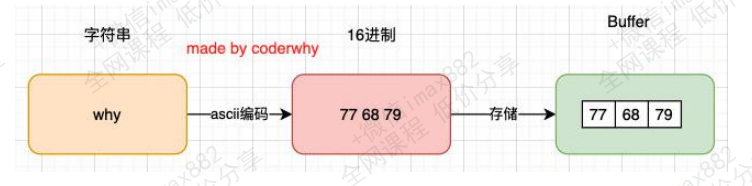
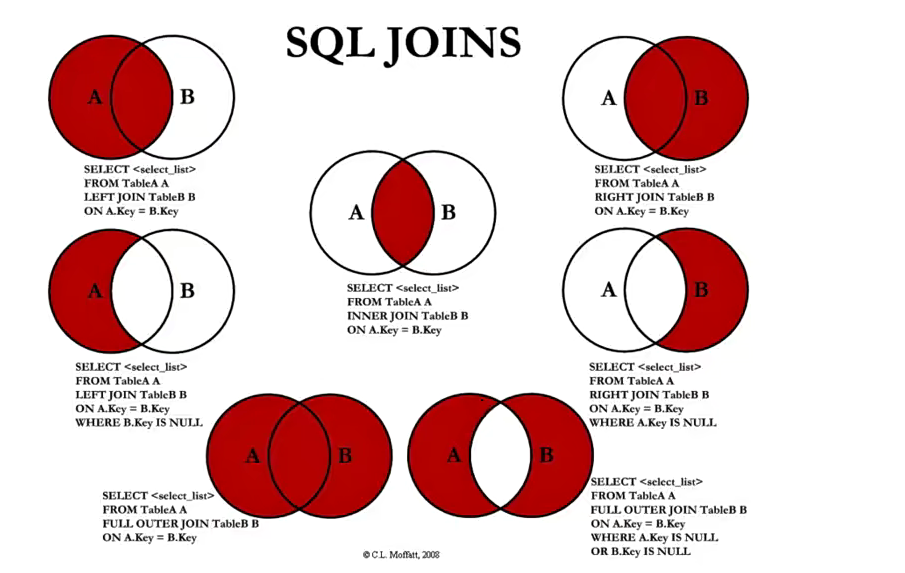

# Node

## Node服务器和常见模块

Node.js是一个基于V8 JavaScript引擎的JavaScript运行时环境。

### 内置模块fs

- **fs是File System的缩写，表示文件系统。**
- **对于任何一个为服务器端服务的语言或者框架通常都会有自己的文件系统**：
  - 因为**服务器需要将各种数据、文件**等放置到不同的地方；
  -  比如**用户数据可能大多数是放到数据库中的**；
  - 比如**某些配置文件或者用户资源（图片、音视频）都是以文件的形式存在于操作系统上**的；
-  **Node也有自己的文件系统操作模块，就是fs：**
  - **借助于Node帮我们封装的文件系统**，我们**可以在任何的操作系统（window、Mac OS、Linux）上面直接去操作文件；**
  - 这也是**Node可以开发服务器的一大原因**，也是**它可以成为前端自动化脚本等热门工具**的原因

#### fs的API介绍

- **Node文件系统的API非常的多：**
  - https://nodejs.org/docs/latest-v16.x/api/fs.html
  - 我们不可能，也**没必要一个个去学习**；
  - 这个更多的应该是**作为一个API查询的手册，等用到的时候查询**即可；
- **但是这些API大多数都提供三种操作方式：**
  - **方式一**：同步操作文件：代码会被阻塞，不会继续执行；
  - **方式二**：异步回调函数操作文件：代码不会被阻塞，需要传入回调函数，当获取到结果时，回调函数被执行；
  - **方式三**：异步Promise操作文件：代码不会被阻塞，通过 fs.promises 调用方法操作，会返回一个Promise，可以通过then、
    catch进行处理；

```js
//在node环境中通常使用CommonJs的方式对模块进行引入
//ESModule通常用于浏览器，如果想使用EsModule需要做一些配置，比如webpack
const fs = require("fs");

//1.同步读取，会造成阻塞，会影响后续代码执行,返回值为读取的内容
//encoding为以什么样的格式对文件进行读取
const res = fs.readFileSync("./abc.txt", { encoding: "utf-8" });
console.log(res);
console.log("后续的代码~");

//2.使用回调函数方式进行读取，不会造成阻塞
//缺点，如果在回调函数中在读取另一个文件，代码阅读性不好
fs.readFile("./abc.txt", { encoding: "utf-8" }, (err, data) => {
  console.log(data);
});

console.log("后续的代码~");

//3.使用promise的方式进行文件的读取,不会造成阻塞
fs.promises
  .readFile("./abc.txt", { encoding: "utf-8" })
  .then((res) => {
    console.log(res);
  })
  .catch((err) => [console.log(err)]);

console.log("后续的代码~");

```

#### 文件描述符

- **文件描述符（File descriptors）是什么呢？**
  - 在常见的操作系统上，对于**每个进程，内核都维护着一张当前打开着的文件和资源的表格**。
  - 每个打开的文件都分配了一个**称为文件描述符的简单的数字标识符**。
  - 在系统层，**所有文件系统操作都使用这些文件描述符来标识和跟踪每个特定的文件。**
  - **Windows 系统使用了一个虽然不同但概念上类似的机制来跟踪资源。**
- **为了简化用户的工作，Node.js 抽象出操作系统之间的特定差异，并为所有打开的文件分配一个数字型的文件描述符**

> 在操作系统中每一个进程中都维护这一张可以打开的文件和资源的表格，每一个打开的文件中都有对应的文件描述符
>
> 这个描述符可以用来标识和跟踪每个特定的文件

```js
const fs = require("fs");

fs.open("b.txt", (err, fd) => {
  if (err) {
    console.log("文件打开发生错误", err);
  }
  //fd是文件属性描述符的数字标识符
  console.log(fd);

  //这里可以通过文件的属性描述符，再次对文件进行读取等操作
  //其实底层就是通过属性描述符对文件进行了读取，只不过node进行了一层封装
  fs.readFile(fd, { encoding: "utf-8" }, (err, data) => {
    console.log(data);
  });

  //可以通过fstat获取文件的状态信息
  fs.fstat(fd, (err, state) => {
    console.log(state);
  });
    //最后可以把文件关闭
  fs.close();
});

```

- **fs.open() 方法用于分配新的文件描述符。**
  - 一旦被分配，则**文件描述符可用于从文件读取数据、向文件写入数据、或请求关于文件的信息。**

#### 文件的读写

- **如果我们希望对文件的内容进行操作，这个时候可以使用文件的读写：**
  - fs.readFile(path[, options], callback)：读取文件的内容；
  - fs.writeFile(file, data[, options], callback)：在文件中写入内容；

```js
const fs = require("fs");

const content = "hello World My name is lwy";

//flag规定了文件的写入方式
fs.writeFile("ccc.txt", content, { encoding: "utf-8", flag: "w" }, (err) => {
  console.log(err);
});

```

- **在上面的代码中，你会发现有一个对象类型，这个是写入时填写的option参数：**
  - **flag**：写入的方式。
  - **encoding**：字符的编码；

#### flag选项

- **flag的值有很多**：https://nodejs.org/dist/latest-v14.x/docs/api/fs.html#fs_file_system_flags
  - w 打开文件写入，默认值；
  - w+打开文件进行读写（可读可写），如果不存在则创建文件；
  - r打开文件读取，读取时的默认值；
  - r+ 打开文件进行读写，如果不存在那么抛出异常；
  - **a**打开要写入的文件，将流放在文件末尾。如果不存在则创建文件；
  - a+打开文件以进行读写（可读可写），将流放在文件末尾。如果不存在则创建文件

- 关于字符编码的文章：https://www.jianshu.com/p/899e749be47c

- **文件读取：**
  - 如果不填写encoding，返回的结果是Buffer；

#### 文件夹操作

- **新建一个文件夹**
  - 使用fs.mkdir()或fs.mkdirSync()创建一个新文件夹

```js
const fs = require("fs");

fs.mkdir("./lwy", (err) => {
  console.log("创建成功");
});

```

- 获取文件夹的内容 fs.readdir

```js
const fs = require("fs");

//默认返回的是数组的字符串形式
//使用withFileTypes 可以展示文件的类型，里面是对象，可以使用更多方法对文件进行操作
fs.readdir("./lwy", { withFileTypes: true }, (err, files) => {
  files.forEach((item) => {
    if (item.isDirectory()) {
      console.log("我是文件夹" + item.name);
    } else {
      console.log("我是文件" + item.name);
    }
  });
});

//还可以写一个递归函数，对多层嵌套的文件进行操作

function readFileFn(path) {
  fs.readdir(path, { withFileTypes: true }, (err, files) => {
    files.forEach((item) => {
      if (item.isDirectory()) {
        readFileFn(`${path}/${item.name}`);
      } else {
        console.log("我是文件" + item.name);
      }
    });
  });
}

readFileFn("./lwy");

```

- 文件重命名

```js

fs.rename("./lwy", "./aaa", (err) => {
  console.log("更名成功");
});
```

### events模块

- **Node中的核心API都是基于异步事件驱动的：**
  - 在这个体系中，某些对象（发射器（Emitters））发出某一个事件；
  - 我们可以监听这个事件（监听器 Listeners），并且传入的回调函数，这个回调函数会在监听到事件时调用；
- **发出事件和监听事件都是通过EventEmitter类来完成的，它们都属于events对象。**
  - **emitter.on(eventName, listener)**：监听事件，也可以使用addListener；
  - **emitter.off(eventName, listener)**：移除事件监听，也可以使用removeListener；
  - **emitter.emit(eventName[, ...args])**：发出事件，可以携带一些参数；

```js
//这里拿到的是events的类
const EventEmitter = require("events");
//events模块类似与事件总线exentBus

//创建event实例
const emitter = new EventEmitter();

function handleLwy(name, age, height) {
  console.log("接收事件成功", name, age, height);
}
//监听事件
emitter.on("lwy", handleLwy);

setTimeout(() => {
  //发出携带参数的事件
  emitter.emit("lwy", "lwy", 20, 188);

  //取消监听事件，这里在第一个延时器中取消监听了lwy事件
  //所有emitter.on就不会在监听到lwy事件
  emitter.off("lwy", handleLwy);
  setTimeout(() => {
    //发出事件
    emitter.emit("lwy");
  }, 1000);
}, 2000);

```

#### 常见的方法

- **EventEmitter的实例有一些属性，可以记录一些信息：**
  - **emitter.eventNames()**：返回当前 EventEmitter对象注册的事件字符串数组；
  - **emitter.getMaxListeners()**：返回当前 EventEmitter对象的最大监听器数量，可以通过setMaxListeners()来修改，默认是
    10；
  - **emitter.listenerCount(事件名称)**：返回当前 EventEmitter对象某一个事件名称，监听器的个数；
  - **emitter.listeners(事件名称)**：返回当前 EventEmitter对象某个事件监听器上所有的监听器数组；

```js
const EventEmitter = require("events");

const emitter = new EventEmitter();

function handleE() {}
emitter.on("lwy", handleE);
emitter.on("kobi", handleE);
emitter.on("yyy", handleE);

console.log(emitter.eventNames());
console.log(emitter.getMaxListeners());
console.log(emitter.listenerCount("lwy"));
console.log(emitter.listeners("yyy"));

```

#### 方法的补充

- **EventEmitter的实例方法补充：**
  - emitter.once(eventName, listener)：事件监听一次
  - emitter.prependListener()：将监听事件添加到最前面
  - emitter.prependOnceListener()：将监听事件添加到最前面，但是只监听一次
  - emitter.removeAllListeners([eventName])：移除所有的监听器

```js
emitter.once("click", () => {
  console.log("我只会执行一次");
});
emitter.prependListener("click", () => {
  console.log("我会优先执行，不会只执行一次");
});
emitter.prependOnceListener("click", () => {
  console.log("我会优先执行,但是我只会执行一次");
});

emitter.emit("click");
emitter.emit("click");
emitter.removeAllListeners("click");
```

### 认识二进制和buffer

- **计算机中所有的内容：文字、数字、图片、音频、视频最终都会使用二进制来表示。**
- **JavaScript可以直接去处理非常直观的数据：比如字符串，我们通常展示给用户的也是这些内容。**
- **不对啊，JavaScript不是也可以处理图片吗？**
  - 事实上在**网页端，图片我们一直是交给浏览器来处理的；**
  - **JavaScript或者HTML，只是负责告诉浏览器一个图片的地址；**
  - 浏览器**负责获取这个图片**，并且**最终将这个图片渲染出来；**
- **但是对于服务器来说是不一样的：**
  - 服务器要处理的**本地文件类型相对较多**;
  - 比如**某一个保存文本的文件并不是使用 utf-8进行编码**的，而是**用 GBK**，那么**我们必须读取到他们的二进制数据，再通过GKB转换成对应的文字；**
  - 比如**我们需要读取的是一张图片数据（二进制）**，再通过某些手段**对图片数据进行二次的处理**（裁剪、格式转换、旋转、添加滤镜），Node中**有一个Sharp的**库，就是**读取图片或者传入图片的Buffer对其再进行处理；**
  - 比如在**Node中通过TCP建立长连接，TCP传输的是字节流**，我们**需要将数据转成字节再进行传入**，并且**需要知道传输字节的大小**（客服端需要根据大小来判断读取多少内容)

#### Buffer和二进制

- 我们会发现，对于前端开发来说，通常**很少会和二进制直接打交道**，但是对于服务器端为了做很多的功能，我们**必须直接去操作其二进制的数据；**
- **所以Node为了可以方便开发者完成更多功能，提供给了我们一个类Buffer，并且它是全局的。**
- **我们前面说过，Buffer中存储的是二进制数据，那么到底是如何存储呢？**
  - 我们可以将Buffer看成是一个**存储二进制的数组**；
  - 这个数组中的**每一项**，可以**保存8位二进制**： 0000 0000
- **为什么是8位呢？**
  - 在计算机中，**很少的情况我们会直接操作一位二进制**，因为**一位二进制存储的数据是非常有限的**；
  - 所以通常会**将8位合在一起作为一个单元**，这个单元称之为**一个字节（byte）**；
  - **也就是说 1byte = 8bit**，1kb=1024byte，1M=1024kb；
  - 比如很多编程语言中的**int类型是4个字节，long类型时8个字节**；
  - 比如**TCP传输的是字节流**，在**写入和读取时都需要说明字节的个数；**
  - 比如**RGB的值分别都是255**，所以**本质上在计算机中都是用一个字节存储**的

> 比如rgb(255,255,255)在底层它们其实就是一个字节
>
> r: 1111 1111
>
> g:1111 1111
>
> b:1111 1111
>
> 一个byte对应8个bit 用2进行表示，所以最大是255,最小是0

> buffer是个全局类，在计算中为了方便展展示，会把2进制的字节转成16进制进行展示

#### Buffer和字符串

- **Buffer相当于是一个字节的数组，数组中的每一项对应一个字节的大小：**
- **如果我们希望将一个字符串放入到Buffer中，是怎么样的过程呢？**



```js

//现在不推荐这种写法
const buffer = new Buffer("hello");
//默认会把字符转换成16进制放在一个buffer数组中
//<Buffer 68 65 6c 6c 6f>
console.log(buffer);

//现在的写法，通过类中的一个方法把字符转换成字节
//一般一个英文1个字节，一个中文3个字节
const buffer02 = Buffer.from("你好啊");
//默认编码：utf-8
console.log(buffer02);
console.log(buffer02.toString()); //可以使用toString把字节转换成字节

//如果写入和转换的编码格式不一致，会造成乱码问题
const buffer03 = Buffer.from("lwy", "utf-8");
console.log(buffer03.toString("utf16le"));

```

#### Buffer.alloc

可以分配字节大小

- 来看一下Buffer.alloc:
  - 我们会发现创建了一个8位长度的Buffer，里面所有的数据默认为00
  - 我们也可以对其进行操作

```js
const fs = require("fs");

//指定8个字节大小
const buffer = Buffer.alloc(8);

//<Buffer 00 00 00 00 00 00 00 00> 默认都是0
console.log(buffer);

//因为buffer是以数组方式储存，所以可以使用数组方式进行操作
buffer[0] = "w".charCodeAt(); //指定字符转换
buffer[1] = 0x66;
buffer[2] = 200;
console.log(buffer); //<Buffer 64 66 c8 00 00 00 00 00>

console.log(buffer.toString());
```

> 文件的读取操作，如果不指定编码，默认就是字节形式表示

>  事实上我们创建Buffer时，并不会频繁的向操作系统申请内存，它会默认先申请一个8 * 1024个字节大小的内存，也就是8kb

## Web服务器开发、文件上传

### 认识Stream

- **什么是Stream（小溪、小河，在编程中通常翻译为流）呢？**
  - 我们的第一反应应该是**流水，源源不断的流动**；
  - 程序中的流也是**类似的含义**，我们可以想象**当我们从一个文件中读取数据时，文件的二进制（字节）数据会源源不断的被读**
    **取到我们程序**中；
  - 而**这个一连串的字节，就是我们程序中的流；**
- **所以，我们可以这样理解流：**
  - 是**连续字节的一种表现形式和抽象概念；**
  - 流应该是**可读的**，也是**可写的；**
- **在之前学习文件的读写时，我们可以直接通过 readFile或者 writeFile方式读写文件，为什么还需要流呢？**
  - 直接**读写文件的方式，虽然简单**，但是**无法控制一些细节的操作**；
  - 比如**从什么位置开始读、读到什么位置、一次性读取多少个字节；**
  - 读到**某个位置**后，**暂停读取，某个时刻恢复继续读取**等等；
  - 或者**这个文件非常**大，比如**一个视频文件，一次性全部读取并不合适**；

#### 文件读写的Stream

- **事实上Node中很多对象是基于流实现的：**
  - **http模块**的**Request**和**Response**对象；
- **官方文档：另外所有的流都是EventEmitter的实例。**
- **那么在Node中都有哪些流呢？**
- **Node.js中有四种基本流类型：**
  - **Writable**：可以**向其写入数据的流**（例如 fs.createWriteStream()）。
  - **Readable**：可以从中读取数据的流（例如 fs.createReadStream()）。
  - **Duplex**：同时为Readable和Writable（例如 net.Socket）。
  - **Transform**：Duplex可以在**写入和读取数据时修改或转换数据的流**（例如zlib.createDeflate()）。
- **主要讲解一下Writable、Readable，另外两个大家可以自行学习一下（官方文档）**

#### Readable

- 之前我们读取一个文件的信息：

```js
const fs = require("fs");

//1.普通方式读取直接一次性读取完
//缺点一：无法精准控制从哪里读取，读取到什么位置
//缺点二：读取到某一个位置时，暂停读取，恢复读取
//缺点三：文件非常大的时候，多次读取
fs.readFile("./abc.txt", (err, data) => {
  console.log(data);
});

```

- **这种方式是一次性将一个文件中所有的内容都读取到程序（内存）中，但是这种读取方式就会出现我们之前提到的很多问题：**
  - **文件过大、读取的位置、结束的位置、一次读取的大小；**
- **这个时候，我们可以使用 createReadStream，我们来看几个参数，更多参数可以参考官网：**
  - **start**：文件读取开始的位置；
  - **end**：文件读取结束的位置；
  - **highWaterMark**：一次性读取字节的长度，默认是64kb；

```js

//2.创建一个可读流
//start:从什么位置开始读(字节的位置) 因为文件内容经过二进制转换会放在一个buffer数组中，所以开始下标为0
//end:结束位置
//highWaterMark:可以决定一次读多少个字节

//这里会返回一个ReadStream
const readStream = fs.createReadStream("./abc.txt", {
  start: 0,
  end: 10,
  highWaterMark: 3,
});
//因为所有的流都是events的实例，所有我们接收数据使用事件监听的方式，结果放在了data中事件中，node内部帮我们封装好了
//内部已经帮我们发出事件
readStream.on("data", (data) => {
  console.log(data.toString());
  readStream.pause(); //使用readStream中提供的方法可以实现暂停读取

  setTimeout(() => {
    readStream.resume(); //还可以恢复读取，这样就实现了每1秒读取一次的效果
  }, 1000);
});

//3.其他事件监听补充
readStream.on("open", (fd) => {
  console.log("文件被打开", fd);
});
readStream.on("end", () => {
  console.log("文件读取完毕");
});
//不需要手动关闭文件，当我们读取文件完毕，会自动帮我们关闭
readStream.on("close", () => {
  console.log("读取完毕，关闭文件");
});

```

#### Writable

- 我们进行一次简单的写入
- 这种方式相当于一次性将所有的内容写入到文件中，但是这种方式也有很多问题：
  - 比如我们希望一点点写入内容，精确每次写入的位置等

```js
//1.一次写入全部内容
fs.writeFile(
  "./bbb.txt",
  "hello world",
  {
    flag: "a+",
  },
  () => {
    console.log("写入成功");
  }
);
```

- **这个时候，我们可以使用 createWriteStream，我们来看几个参数，更多参数可以参考官网：**
  - **flags**：默认是w，如果我们希望是追加写入，可以使用 a或者 a+；
  - start：写入的位置；

```js
	
//2.创建一个写入流
const writeStream = fs.createWriteStream("ccc.txt", {
  flags: "a+",
  start: 5,//如果要实现写入到指定位置操作，在window系统上在使用r+(兼容性问题)
});

writeStream.write("lwy");

writeStream.on("open", (fd) => {
  console.log("文件被打开了", fd);
});

//finish表示写入完成了，和read中的end一个意思
writeStream.on("finish", () => {
  console.log("写入完成");
});

//如果不手动关闭，这里不会执行
writeStream.on("close", () => {
  console.log("文件已关闭");
});

//end方法，会将内容写入到文件，并且帮我们关闭文件
writeStream.end("哈哈哈哈");

//writeStream流不会默认关闭，需要手动控制
// writeStream.close();

```

#### 文件的拷贝操作(pipe方法)

- pipe方法
  - 正常情况下，我们可以将读取到的 输入流，手动的放到 输出流中进行写入：
  - 我们也可以通过pipe来完成这样的操作：

```js
const fs = require("fs");

//方式一:一次性读取和吸入文件
fs.readFile("./foo.txt", (err, data) => {
  console.log("文件读取成功");
  console.log(data);

  fs.writeFile("./foo_copy01.txt", data, (err) => {
    console.log("文件写入成功");
  });
});

//方式二：使用读取流和写入流
const readStream = fs.createReadStream("./foo.txt");
const writeStream = fs.createWriteStream("./foo_copy02.txt");

readStream.on("data", (data) => {
  writeStream.write(data);
});
readStream.on("end", () => {
  //在文件读取完毕后把写入流关闭
  writeStream.close();
});

//方式三：使用pipe,相当于在读和写之间建立一个管道，直接把读到的数据，写入

const readStream01 = fs.createReadStream("./foo.txt");
const writeStream02 = fs.createWriteStream("./foo_copy03.txt");

readStream01.pipe(writeStream02);

```

### http模块web服务

- **什么是Web服务器？**
  - 当应用程序（客户端）需要某一个资源时，可以向一台服务器，通过Http请求获取到这个资源；
  - 提供资源的这个服务器，就是一个Web服务器；

- **目前有很多开源的Web服务器：Nginx、Apache（静态）、Apache Tomcat（静态、动态）、Node.js**

#### http模块

- **在Node中，提供web服务器的资源返回给浏览器，主要是通过http模块。**

**创建服务器:**

- **创建服务器对象，我们是通过 createServer 来完成的**
  - http.createServer会返回**服务器的对象**；
  - 底层其实使用直接 new Server 对象

- **request请求对象，包含请求相关的信息；**
-  **response响应对象，包含我们要发送给客户端的信息**

**监听主机和端口号:**

- **Server**通过**listen方法来开启服务器**，并且**在某一个主机和端口上监听网络请求**：
  - 也就是当我们**通过 ip:port的方式**发送到**我们监听的Web服务器上**时；
  - 我们就可以**对其进行相关的处理**；
- **listen函数有三个参数：**
- **端口port**: 可以不传, 系统会默认分配端, 后续项目中我们会写入到环境变量中；
- **主机host:** 通常可以传入localhost、ip地址127.0.0.1、或者ip地址0.0.0.0，默认是0.0.0.0；
  - **localhost**：本质上是一个域名，通常情况下会被解析成127.0.0.1；
  - **127.0.0.1**：回环地址（Loop Back Address），表达的意思其实是我们主机自己发出去的包，直接被自己接收；
    - 正常的数据库包经常 应用层 - 传输层 - 网络层 - 数据链路层 - 物理层 ；
    - 而回环地址，是在网络层直接就被获取到了，是不会经常数据链路层和物理层的；
    - 比如我们监听 127.0.0.1时，在同一个网段下的主机中，通过ip地址是不能访问的；
  - **0.0.0.0**：
    - 监听IPV4上所有的地址，再根据端口找到不同的应用程序；
    - 比如我们监听 0.0.0.0时，在同一个网段下的主机中，通过ip地址是可以访问的；
- 回调**函数**：服务器启动成功时的回调函数

```js
//使用http模块
const http = require("http");

//创建一个http对应的服务器
//request和respone都是基于流实现的
//所有的流都是EventEmitter的实例。
//request 可读流
//respone: 写入流
const server = http.createServer((request, response) => {
  //~request对象中包含本次客户端请求的所有信息
  //清求的url
  //请求method
  //请求headers
  //请求求携带的数据
     //1.获取请求url
   console.log(req.url);
  //2.获取请求头
   console.log(req.headers);
  //3.获取请求方法
   console.log(req.method);
  //:response对象用于给客户端返回结果的
  //可以使用写入流的end方法,写入数据，并且关闭写入
  response.end("hello World");
});

//开启对应的服务器，并且告知需要监听的端口
//当客服端请求这个端口时，我们就可以通过这个端口返回给客户端数据
//监听端口时，监听1024以上的端口，666535以下的端口
//1025 ~ 65535之间的端口
//2个字节 => 256*256 =>65536=>0 ~ 65535
server.listen(8000, () => {
  console.log("服务器已经开启成功...");
});

```

> 当客服端请求数据时，我们的heep.createServer((req res) =>{}) 回调会执行2次，也就是说客服端进行了2次请求
>
> 这是因为当我们输入url地址回车时，是一次访问，但是浏览器也会默认访问我们的favicon.ico图标，所有执行了2次,这是由浏览器的特性决定的

> 在开启服务器时，当我们修改一次代码，就需要重新关闭开启服务器这是很不方便的，通常我们会使用一个工具
>
> nodemon (monitor)这个工具，他会自动监听我们代码自动关闭开启服务器
>
> npm install nodemon -g

#### Requests参数解析

##### **URL的处理**

- 客户端在发送请求时，会请求不同的数据，那么会传入不同的请求地址：
  - 比如 http://localhost:8000/login；
  - 比如 http://localhost:8000/products;
- 服务器端需要根据不同的请求地址，作出不同的响应：

```js
const http = require("http");

const server = http.createServer((req, rep) => {
  console.log("客户端访问成功~");
  const url = req.url;
  const method = req.method;

  if (url === "/login") {
    if (method == "POST") {
      rep.end("登录成功");
    } else {
      rep.end("请确定您的请求方法是否正确");
    }
  } else if (url == "/products") {
    rep.end("返回商品列表");
  } else if (url == "/lyric") {
    rep.end("天空好像下雨, 我好像住你隔壁");
  }
});

server.listen(8000, () => {
  console.log("服务器开启成功");
});

```

##### URL的解析

- 那么如果用户发送的地址中还携带一些额外的参数呢？
  - http://localhost:8000/login?name=why&password=123;
  - 这个时候，url的值是 /login?name=why&password=123；
- 我们如何对它进行解析呢？使用内置模块url：
- query 信息如何可以获取呢

```js
const http = require("http");
const url = require("url");
const qs = require("querystring");
const server = http.createServer((req, rep) => {
  //1.参数一query类型参数
  ///list?offset=2&size=100
  //使用url进行解析
  const urlString = req.url;
  //通过url模块可以拿到url信息，包括，pathName,query
  const urlInfo = url.parse(urlString);
  console.log(urlInfo.pathname, urlInfo.query);

  //2.使用queryString模块对query参数进行解析
  //返回query对象类型
  const query = qs.parse(urlInfo.query);
  //通过属性访问参数
  console.log(query.offset, query.size);
  rep.end("返回商品列表");
});

server.listen(8000, () => {
  console.log("服务器开启成功~~~");
});

```

**body携带参数:**

- **在Restful规范（设计风格）中，我们对于数据的增删改查应该通过不同的请求方式：**
  - GET：查询数据；
  - POST：新建数据；
  - PATCH：更新数据；
  - DELETE：删除数据；
- **所以，我们可以通过判断不同的请求方式进行不同的处理。**
  - 比如创建一个用户：
  - 请求接口为 /users；
  - 请求方式为 POST请求；
  - 携带数据 username和password；

```js
const http = require("http");

const { parse } = require("path");
const server = http.createServer((req, rep) => {
  //拿到body参数信息，进行判断登录逻辑
  //因为req就是读入流，所有可以在data中拿到body数据
  req.setEncoding("utf-8"); //设置编码格式
  req.on("data", (data) => {
    //对数据进行解析
    //解析JSON数据
    const userInfo = JSON.parse(data);
    //拿到数据进行操作
    const name = userInfo.name;
    const password = userInfo.password;
    let isLogin = false;
    if (name === "liweiye" && password == "123456") {
      isLogin = true;
    } else {
      isLogin = false;
    }
    req.on("end", () => {
      if (isLogin) {
        rep.end("登录成功，欢迎回来");
      } else {
        rep.end("请检查您的用户名与密码");
      }
    });
  });
});

server.listen(8000, () => {
  console.log("服务器开启成功~~~");
});

```

##### Header信息

在request对象的header中也包含很多有用的信息，客户端会默认传递过来一些信息：

```js
{
  'content-type': 'application/json',
  'user-agent': 'PostmanRuntime/7.29.2',
  accept: '*/*',
  'postman-token': '04f1f231-c02e-41d1-aebe-a8e35d865e62',
  host: 'localhost:8000',
  'accept-encoding': 'gzip, deflate, br',
  connection: 'keep-alive',
  'content-length': '54'
}
```

- **content-type是这次请求携带的数据的类型：**
  - **application/x-www-form-urlencoded**：表示数据被编码成以 '&' 分隔的键 - 值对，同时以 '=' 分隔键和值
  - **application/json**：表示是一个json类型；
  - **text/plain**：表示是文本类型；
  - **application/xml**：表示是xml类型；
  - **multipart/form-data**：表示是上传文件

- **content-length：文件的大小长度**
- **keep-alive**：
  - http是基于TCP协议的，但是通常在进行一次请求和响应结束后会立刻中断；
  - 在http1.0中，如果想要继续保持连接：
    - 浏览器需要在请求头中添加 connection: keep-alive；
    - 服务器需要在响应头中添加 connection:keey-alive；
    - 当客户端再次放请求时，就会使用同一个连接，直接一方中断连接；
  - 在http1.1中，所有连接默认是 connection: keep-alive的；
    - 不同的Web服务器会有不同的保持 keep-alive的时间；
    - Node中默认是5s中止；
- **accept-encoding**：告知服务器，客户端支持的文件压缩格式，比如js文件可以使用gzip编码，对应 .gz文件；
- **accept**：告知服务器，客户端可接受文件的格式类型；
- **user-agent**：客户端相关的信息；

#### Respone

##### 返回响应结果

- **如果我们希望给客户端响应的结果数据，可以通过两种方式：**

  - **Write方法**：这种方式是直接写出数据，但是并没有关闭流；
  - **end方法**：这种方式是写出最后的数据，并且写出后会关闭流

  ```js
  //响应数据的方式有两个：
  res.write("Hello World");
  res.write("Hello Response");
  res.end("message end");
  ```

- **如果我们没有调用 end和close，客户端将会一直等待结果：**

  - 所以客户端在发送网络请求时，都会设置超时时间。

##### 响应状态码

- Http状态码（Http Status Code）是用来表示Http响应状态的数字代码：
  - Http状态码非常多，可以根据不同的情况，给客户端返回不同的状态码；
  - MDN响应码解析地址：https://developer.mozilla.org/zh-CN/docs/web/http/status

```js
res.statuscode =400
res.writehead(200);
```

##### 响应头文件

- 返回头部信息，主要有两种方式：
  - **res.setHeader**：一次写入一个头部信息；
  - **res.writeHead**：同时写入header和status；

```js
res.setHeader("Content-Type","application/json;charset=utf8");
res.writeHead (200,{
"Content-Type":"application/json;charset=utf8"
})
```

- **Header设置 Content-Type有什么作用呢？**
  - 默认客户端接收到的是字符串，客户端会按照自己默认的方式进行处理；
  - 我们设置了Content-Type客户端就会按照返回的类型显示

#### http请求

- axios库可以在浏览器中使用，也可以在Node中使用：
  - 在浏览器中，axios使用的是封装xhr；
  - 在Node中，使用的是http内置模块

http请求基础使用:

```js
const http = require("http");
//get默认帮我们调用end说明写入内容完成
http.get("http://localhost:8000", (res) => {
  //从可读流中获取数据
  res.on("data", (data) => {
    //因为拿到的JSON类型，我们需要转换
    const Info = JSON.parse(data);
    console.log(Info);
  });
});
//http默认值提供的get方法进行请求，如果要使用其他方法需要使用request方法
//使用request方法需要手动调用end方法
const req = http.request(
  {
    method: "POST",
    hostname: "localhost",
    port: 8000,
  },
  (res) => {
    res.on("data", (data) => {
      const Info = JSON.parse(data);
      console.log(Info);
    });
  }
);
//手动调用end方法
req.end();

```

axios在node中使用

```js
const axios = require("axios");

//在node中也可以使用axos
//在浏览器中axios时基于XHR封装的，在Node中axios是基于http模块封装的
axios.get("http://localhost:8000").then((res) => {
  console.log(res.data);
});

```

#### 文件上传

错误使用

```js
const { WriteStream } = require("fs");
const http = require("http");
//客户端通过input进行文件或图片的上出传，服务端使用可读流进行读取并写入本地
const server = http.createServer((req, res) => {
  const write = new WriteStream("./foo.png");
  //拿到文件的字节
  req.on("data", (data) => {
    //把文件写入到本地文件
    //这种使用方法会把所有的data数据都写入，客户端请求的数据可能不只是图片的信息，所以图片可能不会正常的展示
    write.write(data);
    //因为req是可读流,所有可以使用pipe直接copy
    // req.pipe(write);
  });

  req.on("end", () => {
    console.log("数据传输完成");
    write.close();
    res.end("文件上传成功");
  });
});

server.listen(8000, () => {
  console.log("开启服务成功");
});

```

> 使用pipe方式进行写入时，如果客户端上传2次可以上传成功，如果只是上传一次图片不能正确显示

正确使用

```js
const http = require("http");
const fs = require("fs");
const qs = require("querystring");

const server = http.createServer((req, res) => {
  //图片文件必须设置为二进制
  req.setEncoding("binary");
  //内容类型
  const contentType = req.headers["content-type"];
  console.log(contentType);
  //获取content-type中的boundary的值
  const boundary = contentType.split("; ")[1].replace("boundary=", "");
  //文件数据，因为文件太大可能不会一下子上传完，所以进行拼接
  let body = "";
  req.on("data", (data) => {
    console.log(data);
    body += data;
  });

  req.on("end", () => {
    console.log(body);
    // 1.对数据进行切割
    const payload = qs.parse(body, "\r\n", ":");
    //获取最后的类型(image/png)
    const fileType = payload["Content-Type"].substring(1);
    //获取要截取的长度
    const fileTypePosition = body.indexOf(fileType) + fileType.length;
    let imageData = body.substring(fileTypePosition);
    imageData = imageData.replace(/^\s\s*/, "");
    imageData = imageData.substring(0, imageData.indexOf(`--${boundary}--`));
    //img数据处理完毕，对文件进行写入
    fs.writeFile("./foo.png", imageData, "binary", (err) => {
      res.end("文件上传成功~");
    });
  });
});

server.listen(8000, () => {
  console.log("服务器启动成功");
});

```

> 因为客户端在进行文件上传时，上传的二进制中会包含其他信息，不是纯文件的二进制，所以在后端我们需要对文件进行处理，经过分割截取等操作，拿到纯文件信息时，这时候文件就可以被正确写入
>
> 在实例开发中一般使用框架提供的插件即可

## express框架

### 认识Web框架

- **前面我们已经学习了使用http内置模块来搭建Web服务器，为什么还要使用框架？**
  - 原生http在进行很多处理时，会较为复杂；
  - 有URL判断、Method判断、参数处理、逻辑代码处理等，都需要我们自己来处理和封装；
  - 并且所有的内容都放在一起，会非常的混乱；
- **目前在Node中比较流行的Web服务器框架是express、koa；**
  - 我们先来学习express，后面再学习koa，并且对他们进行对比；
- **express早于koa出现，并且在Node社区中迅速流行起来：**
  - 我们可以基于express快速、方便的开发自己的Web服务器；
  - 并且可以通过一些实用工具和中间件来扩展自己功能；
- **Express整个框架的核心就是中间件，理解了中间件其他一切都非常简单！**

### Express安装

- **express的使用过程有两种方式：**

  - 方式一：通过express提供的脚手架，直接创建一个应用的骨架；
  - 方式二：从零搭建自己的express应用结构；

- **方式一：安装express-generator**

  ```shell
  
  安装脚手架
  npm install -g express-generator
  创建项目
  express express-demo
  安装依赖
  npm install
  启动项目
  node bin/www
  ```

- **方式二：从零搭建自己的express应用结构；**

  ```js
  npm init -y
  ```

### Express的基本使用

- **我们来创建第一个express项目：**
  - 我们会发现，之后的开发过程中，可以方便的将请求进行分离：
  - 无论是不同的URL，还是get、post等请求方式；
  - 这样的方式非常方便我们已经进行维护、扩展；
  - 当然，这只是初体验，接下来我们来探索更多的用法；
- **请求的路径中如果有一些参数，可以这样表达：**
  - /users/:userId；
  - 在request对象中要获取可以通过 req.params.userId;
- **返回数据，我们可以方便的使用json：**
  - res.json(数据)方式；
  - 可以支持其他的方式，可以自行查看文档；
  - https://www.expressjs.com.cn/guide/routing.html

```js
//导入模块
const express = require("express");

//使用模块,express本质是个函数，内部帮我们调用了http.createServer()并返回一个http
const app = express();
//相比以前的逻辑处理都在createServer()中，并且要单独对不同的url请求方法进行判断
//使用框架变得更加间接，逻辑清晰了

//login的post请求
app.post("/login", (req, res) => {
  res.end("登录成功,欢迎回来");
});
//home的get请求
app.get("/home", (req, res) => {
  res.end("商品列表,轮播图列表");
});

app.listen(9000, () => {
  console.log("服务开启成功");
});

```

### 认识中间件

- **Express是一个路由和中间件的Web框架，它本身的功能非常少：**
  - Express应用程序本质上是一系列中间件函数的调用；
- **中间件是什么呢？**
  - **中间件的本质是传递给express的一个回调函数**；
  - 这个回调函数接受三个参数：
    - 请求对象（request对象）；
    - 响应对象（response对象）；
    - **next函数（在express中定义的用于执行下一个中间件的函数）；**

- **中间件中可以执行哪些任务呢？**
  - 执行任何代码；
  - 更改请求（request）和响应（response）对象；
  - 结束请求-响应周期（返回数据）；
  - 调用栈中的下一个中间件；
- **如果当前中间件功能没有结束请求-响应周期，则必须调用next()将控制权传递给下一个中间件功能，否则，请求将被挂起**

```js
const express = require("express");

const app = express();

//给express创建的app传入一个回调函数
//传入的这个回调函数就称之为是中间件(middleware) 在express中理论上来说，每一个回调函数就是一个中间件
//app.post('/儿ogin',回调函数=>中间件) 这是有逻辑判断的中间件，既要是post请求又要是login
app.post("/login", (req, res, next) => {
  //1.中间件中可以执行任何代码
  console.log("first middleWara");
  /**
   * 打印，查询数据，判断逻辑
   */
  //2.在中间件中修改req/res对象
  req.age = 99;

  //3.可以在中间件中结束响应周期,如果不主动结束请求将会一直被挂起
  res.json({ message: "欢迎回来", state: 0 });

  //4.执行下一个中间件，会找下一个匹配的中间件
  next();
});

//注册一个中间件
app.use((req, res) => {
  console.log("second middlewara");
});

app.listen(8000, () => {
  console.log("开启服务");
});

```

> 在express中理论上来说，每一个回调函数就是一个中间件

#### 中间件使用的4种使用方式

- **那么，如何将一个中间件应用到我们的应用程序中呢？**

  - express主要提供了两种方式：
    - app/router.use；
    - app/router.methods；
  - 可以是 app，也可以是router，router我们后续再学习:
  - methods指的是常用的请求方式，比如： app.get或app.post等；

- **我们先来学习use的用法，因为methods的方式本质是use的特殊情况；**

  - 案例一：最普通的中间件
  - 案例二：path匹配中间件
  - 案例三：path和method匹配中间件
  - 案例四：注册多个中间件

  案例一：最普通的中间件

```js
const express = require("express");

const app = express();
//总结：当express接收到客户端发送的网络请求时·在所有中间间开始进行匹配
//当匹配到第一个符合要求的中间件时，·那么就会执行这个中间件
//通过use方法注册的中间件是最普通的/简单的中间件
//通过use注册的中间件，无论是什么请求方式都可以匹配上
// Login/get
// Login/post
// abc/patch

//use相当与使用http.createServer()这种形式的使用，只要客户端请求就会执行
//而app.post("url")这种相当于进行了url加方法逻辑判断，只有符合的请求才会执行
app.use((req, res, next) => {
  console.log("narmal middlewara 01");
  res.end("返回结果了,不要等了");
  //有了next会找到匹配的中间件
  next();
});
app.use(() => {
  console.log("narmal middlewara 02");
});
app.listen(9000, () => {
  console.log("开启监听服务");
});
```

案例二：注册路径匹配的中间件

```js
const express = require("express");

const app = express();
//注册路径匹配的中间件,第一个参数也可以是一个路径
app.use("/home", (req, res) => {
  console.log("match/home middlewara");
  res.end("home data");
});

app.listen(9000, () => {
  console.log("服务成功开启");
});

```

案例三：path和method匹配中间件

```js
const express = require("express");

const app = express();

app.get("/home", (req, res) => {
  console.log("match method / home");
  res.end("mathch method/home");
});

app.listen(8000, () => {
  console.log("服务开启");
});

```

案例四：注册多个中间件

```js
const express = require("express");

const app = express();

//在回调函数后可以有多个回调，也就是在中间件
//在实际开发中我们使用next()在不同的中间件中完成不同的操作
//比如判断用户是否存在 ——> 查询数据 ——>返回数据
//可以在每一层进行不同的逻辑，如果有一层不符合那么就不next()
app.get(
  "/home",
  (req, res, next) => {
    console.log("many middlemara 01");
    next();
  },
  (req, res, next) => {
    console.log("many middlemara 02");
    next();
  },
  (req, res, next) => {
    console.log("many middlemara 03");
    next();
  },
  (req, res) => {
    console.log("many middlemara 04");
  }
);

app.listen(8000, () => {
  console.log("服务已开启");
});

```

> 中间件永远只会匹配第一个符合的中间件，只有第一个调用了next()时，才会执行下一个符合要求的中间件
>
> 通过use注册的中间件，无论是什么请求方式都可以匹配上，所以如果use请求在最前面，会优先执行
>
> 如果app.method(path)在use前面它会优先执行,调用next()时,use中间件才会执行

#### 内置中间件

- **并非所有的中间件都需要我们从零去编写：**
  - express有内置一些帮助我们完成对request解析的中间件；
  - registry仓库中也有很多可以**辅助我们开发的中间件**；
- **在客户端发送post请求时，会将数据放到body中：**
  - 客户端可以通过json的方式传递；
  - 也可以通过form表单的方式传递；

中间件案例练习:

```js
const express = require("express");

const app = express();
//使用普通中间件对请求的数据进行拦截处理,相当于把公共的逻辑放在了普通的中间件中进行处理，实现复用
app.use((req, res, next) => {
  const header = req.headers;
  if (header["content-type"] === "application/json") {
    req.on("data", (data) => {
      const dataString = data.toString();
      const userInfo = JSON.parse(dataString);
      //在req上添加数据，这样下一个中间件使用时就可以通过body获取数据
      req.body = userInfo;
    });
    req.on("end", () => {
      next();
    });
  } else {
    next();
  }
});

//上面的代码等同与express.json(),express框架内部已经为我们提供好把数据转换成json的中间件了
//只会解析json数据
app.use(express.json());
//内置中间件，可以对usrencode进行解析
//解所传递过来的urLencoded的时候默认使用node内置uerystring模块
//【extended:true}:不再使用内置querystring,而是使用qs第三方库
//application/x-www-form-urlencoded:
app.use(express.urlencoded({extended:true]));

app.post("/login", (req, res) => {
  console.log(req.body);
});

app.post("/register", (req, res) => {
  console.log(req.body);
  res.end("注册成功");
});

app.listen(8000, () => {
  console.log("express服务开启成功");
});

```

> 解析json数据使用express的内置框架 express.json()
>
> 解析application/x-www-form-urlencoded时，使用内置框架app.use(express.urlencoded({extended:true]));
>
> 都会把数据放在req.body中，在使用中间件时直接在body中拿数据即可

#### 第三方中间件

##### 打印日志

- **如果我们希望将请求日志记录下来，那么可以使用express官网开发的第三方库：morgan**
  - 注意：需要单独安装

```js
$ npm i morgan
```

```js
const express = require("express");
const morgan = require("morgan");
const fs = require("fs");
const app = express();

const weiteStream = fs.createWriteStream("./log/access.log", {
  flags: "a+",
});
//创建请求日志,以插件的形式使用
//combined把日志联合放在一个文件中,stream写入流
app.use(morgan("combined", { stream: weiteStream }));
app.post("/login", (req, res) => {
  res.end("登录成功");
});

app.listen(8000, () => {
  console.log("服务创建成功");
});

```

##### 上传文件

- 上传文件，我们可以使用express提供的multer来完成：

```js
const express = require("express");
const multer = require("multer");
const app = express();

//multer是一个函数，返回的对象中包含很多方法(中间件),single单文件上传,array多文件上传
const upload = multer({
  //接收文件放的位置,使用dest方式上传的文件保存时是不带后缀名的
   dest: "./upload",
  //使用storage方式对文件进行保存设置，可以对上传的文件在保存时进行多种设置
  storage: multer.diskStorage({
    //设置文件上传的存储位置
    //req 请求信息， file文件信息，callback对文件存储地址信息进行设置
    destination(req, file, callback) {
      //参数一：是否有错误，参数二：写入文件地址
      callback(null, "./upload");
    },
    //文件名的设置
    filename(req, file, callback) {
      //把写入的文件名设置成当前的事件戳 + 原本的文件名(这样可以实现带后缀名)
      callback(null, Date.now() + "-" + file.originalname);
    },
  }),
});
//单文件上传
//single中的参数是文件上传时的key,不可以写错
//如果写在app.use(upload.single())中，那么默认对所有的文件上传进行解析
app.post("/avatar", upload.single("avatar"), (req, res) => {
  //经过upload.single("avatar")中间件的操作，最后会把文件信息放在req.file属性中
  console.log(req.file);
  res.end("文件上传成功");
});

//多文件上传
app.post("/photos", upload.array("photos"), (req, res) => {
  //经过upload.array("photos")中间件的操作，最后会把文件信息放在req.files属性中
  console.log(req.files);
  res.end("文件上传成功");
});

app.listen(8000, () => {
  console.log("服务开启成功");
});

```

- 如果我们希望借助于multer帮助我们解析一些form-data中的普通数据，那么我们可以使用any：

````js
//对所有的form-data都会解析
app.use(upload.any());

app.use('/login',(req,res,next)=>{
  console.log(req.body);  
})

````

### 客户端发送请求的方式

- **客户端传递到服务器参数的方法常见的是5种：**
  - 方式一：通过get请求中的URL的params；
  - 方式二：通过get请求中的URL的query；
  - 方式三：通过post请求中的body的json格式（中间件中已经使用过）；
  - 方式四：通过post请求中的body的x-www-form-urlencoded格式（中间件使用过）；
  - 方式五：通过post请求中的form-data格式（中间件中使用过）

##### 传递参数params和query

```js
const express = require("express");

const app = express();

//客户端以query方式进行数据请求
//http://localhost:8000/login?name=lwy&age=20
app.get("/login", (req, res) => {
  //express内部已经帮我们解析好了query，可以直接在req上拿
  console.log(req.query);
  res.end("请求成功");
});
//客户端以params方式进行数据请求
//http://localhost:8000/login/333
app.get("/login/:id", (req, res) => {
  //express内部已经帮我们解析好了params，可以直接在req上拿
  const id = req.params.id;
  res.end("请求成功" + id);
});

app.listen(8000, () => {
  console.log("开启服务成功");
});

```

### 响应数据

- **end方法**
  - 类似于http中的response.end方法，用法是一致的
- **json方法**
  - json方法中可以传入很多的类型：object、array、string、boolean、number、null等，它们会被转换成json格式返回；
- **status方法**
  - 用于设置状态码；
  - 注意：这里是一个函数，而不是属性赋值；
- 更多响应的方式：https://www.expressjs.com.cn/4x/api.html#res

### Express的路由

- **如果我们将所有的代码逻辑都写在app中，那么app会变得越来越复杂：**
  - 一方面完整的Web服务器包含非常多的处理逻辑；
  - 另一方面有些处理逻辑其实是一个整体，我们应该将它们放在一起：比如对users相关的处理
    - **获取**用户列表；
    - **获取**某一个用户信息；
    - **创建**一个新的用户；
    - **删除**一个用户；
    - **更新**一个用户；
- **我们可以使用 express.Router来创建一个路由处理程序：**
  - 一个Router实例**拥有完整的中间件和路由系统；**
  - 因此，它也被称为 **迷你应用程序（mini-app）；**

app文件

```js
const express = require("express");
const userRouter = require("./routes/userRouter");
const app = express();

/**用户的接口*/
//以前的方式
//1.将用户的接口直接定义在app中
//app.get('/users',(req,res,next)=>{})
//app.get('/users/:id',(req,res,next)=>{})
//app.post('/users',(req,res,next)=>{})
//app.delete('/users/:id',(req,res,next)=>{})
//app.patch('/users/:id',(req,res,next)=>(}

//让路由生效
//将路由以中间件的方式使用，这样当匹配到user请求时，会在路由中查找
app.use("/users", userRouter);

app.listen(9000, () => {
  console.log("开启服务");
});

```

router/userRouter文件

```js
const express = require("express");
//2.将用户的接口单独定义在路由对象中
//创建路由
const userRouter = express.Router();
//在路由中注册中间件
userRouter.get("/", (req, res) => {
  res.json("用户列表");
});
userRouter.post("/:id", (req, res) => {
  res.json("新建用户" + req.params.id);
});
userRouter.patch("/:id", (req, res) => {
  res.json("更改用户" + req.params.id);
});
userRouter.delete("/:id", (req, res) => {
  res.json("删除用户" + req.params.id);
});
//将路由导出
module.exports = userRouter;

```

### 静态资源服务器

- 部署静态资源我们可以选择很多方式：
  - Node也可以作为静态资源服务器，并且express给我们提供了方便部署静态资源的方法

```js
const express = require("express");

const app = express();
//静态服务器部署成功，我们这里可以是一个开发好的网站
//这样直接就可以在本地访问到网站啦
app.use(express.static("./dist"));

app.listen(9000, () => {
  console.log("静态服务器启动成功");
});

```

### 服务端的错误处理

```js
const express = require("express");

const app = express();

app.use(express.json());
app.post("/login", (req, res, next) => {
  //获取参数
  const { username, password } = req.body;
  //进行逻辑判断
  if (!username || !password) {
    //参数传入错误信息
    next(-1001);
  } else if (username !== "liweiye" || password !== "123456") {
    next(-1002);
  } else {
    res.json({
      code: 0,
      message: "登录成功,欢迎回来",
      token: "2d2d1d5dd5c5s8",
    });
  }
});

//错误处理的中间件
//还有第四个参数，就是对错误处理，next()中的参数就是发送错误信息
app.use((err, req, res, next) => {
  const code = err;
  let message = "";
  switch (code) {
    case -1001:
      message = "账号和密码不能为空";
      break;
    case -1002:
      message = "您的账号密码错误";
      break;
  }
  res.json({ code, message });
});

app.listen(9000, () => {
  console.log("服务器开启");
});

```

> 通过next(err)传入错误信息，在app.use()中的使用第四个参数获取错误信息，进行错误处理

## koa框架

### 认识Koa

- **前面我们已经学习了express，另外一个非常流行的Node Web服务器框架就是Koa。**
- **Koa官方的介绍：**
  - koa：next generation web framework for node.js；
  - koa：node.js的下一代web框架；
- **事实上，koa是express同一个团队开发的一个新的Web框架：**
  - 目前团队的**核心开发者TJ的主要精力也在维护Koa**，express已经交给团队维护了；
  - Koa旨在为Web应用程序和API提供**更小、更丰富和更强大的能力；**
  - 相对于**express具有更强的异步处理能力**（后续我们再对比）；
  - Koa的**核心代码只有1600+行**，是一个**更加轻量级的框架；**
  - 我们**可以根据需要安装和使用中间件**；
- **事实上学习了express之后，学习koa的过程是很简单的**

### Koa初体验

- **我们来体验一下koa的Web服务器，创建一个接口。**
  - koa也是通过注册中间件来完成请求操作的；
- **koa注册的中间件提供了两个参数：**
- **ctx：上下文（Context）对象；**
  - koa并没有像express一样，将req和res分开，而是将它们作为ctx的属性；
  - ctx代表一次请求的上下文对象；
  - ctx.request：获取请求对象；
  - ctx.response：获取响应对象；
- **next：本质上是一个dispatch，类似于之前的next；**

```js
const koa = require("koa");

//这里给我们提供的是类
const app = new koa();

//也是以中间件的方式使用，只不过回调函数中只有2个参数context/next
app.use((ctx, next) => {
  //使用body可以直接返回客户端数据
  ctx.body = "哈哈哈哈哈";
  //1.请求对象
  console.log(ctx.request); //koa封装的请求对象
  console.log(ctx.req); //Node封装的请求对象

  //2.响应对象
  console.log(ctx.respond); //koa封装的响应对象
  console.log(ctx.res); //Node封装的响应对象

  //3.其他属性
  console.log(ctx.query);
  console.log(ctx.params);
    
    console.log("first middlewara");
     next();
});
app.use(() => {
  console.log("second middlewara");
});


app.listen(6000, () => {
  console.log("koa服务器开始");
});

```

> request/respone和req/res的区别
>
> **一个是koa帮我们封装的请求/响应对象，一个是node本身的请求/响应对象**
>
> koa和express基本使用都是一样的

### Koa中间件

- **koa通过创建的app对象，注册中间件只能通过use方法：**
  - Koa并**没有提供methods的方式来注册中间件；**
  - 也**没有提供path中间件来匹配路径；**
  - use中只能使用函数
- **但是真实开发中我们如何将路径和method分离呢？**
  - 方式一：根据**request自己来判断**；
  - 方式二：使用**第三方路由中间件**

方式一：

```js
const Koa = require("koa");

const app = new Koa();

app.use((ctx, next) => {
  //在request中的属性，大部分在ctx中也可以拿到
  // console.log(ctx.request.path);
  // console.log(ctx.path);

  if (ctx.path === "/users") {
    if (ctx.method === "GET") {
      ctx.body = "用户数据";
    } else {
      ctx.body = "您的请求出错";
    }
  } else if (ctx.path === "/login") {
    if (ctx.method === "POST") {
      ctx.body = "登录成功, 欢迎回来";
    } else {
      ctx.body = "请确定您的账号和密码";
    }
  }
});

app.listen(6000, () => {
  console.log("koa服务器开启成功");
});

```

### 路由的使用

- koa官方并没有给我们提供路由的库，我们可以选择第三方库

  ```js
  $ npm install @koa/router
  ```

- 我们可以先封装一个 user.router.js 的文件：

- 在app中将router.routes()注册为中间件：

- 注意：allowedMethods用于判断某一个method是否支持：

  - 如果我们请求 get，那么是正常的请求，因为我们有实现get；
  - 如果我们请求 put、delete、patch，那么就自动报错：Method Not Allowed，状态码：405；
  - 如果我们请求 link、copy、lock，那么就自动报错：Not Implemented，状态码：501；

**方式二：使用第三方路由中间件**

```js
const Koa = require("koa");
//导入@koa/router
const koaRouter = require("@koa/router");

const app = new Koa();
//路由的使用
//1.创建路由对象
const usersRouter = new koaRouter({ prefix: "/users" });

//2.在路由中创建中间件
usersRouter.get("/", (ctx, next) => {
  ctx.body = "get users list data";
});
usersRouter.post("/:id", (ctx, next) => {
  const id = ctx.params.id;
  ctx.body = " post users list data" + id;
});
usersRouter.delete("/:id", (ctx, next) => {
  const id = ctx.params.id;
  ctx.body = "delete users list data" + id;
});
usersRouter.patch("/:id", (ctx, next) => {
  const id = ctx.params.id;
  ctx.body = "change list data" + id;
});

//让路由中间件生效，相当于在内部路由的中间件都是放在routes中的
app.use(usersRouter.routes());
app.use(usersRouter.allowedMethods()); //如果客户端请求的方法我们没有实现，那么通过这个中间件会报错

app.listen(8000, () => {
  console.log("koa的服务开启");
});

```

> 在实际开发中可以把router放在一个单独的文件中

### 参数的5种解析方式

```js
const Koa = require("koa");
const Router = require("@koa/router");
const bodyparser = require("koa-bodyparser");
const multer = require("koa-multer");
const app = new Koa();
const formParser = multer();

//注册bodyparser中间件
app.use(bodyparser());

const userRouter = new Router({ prefix: "/users" });

//1.query解析
userRouter.get("/", (ctx, next) => {
  console.log(ctx.query);
  ctx.body = "get query";
});

//2.parmas解析
userRouter.get("/:id", (ctx, next) => {
  console.log(ctx.params.id);
  ctx.body = "get params";
});
 
//使用最多
//3.json解析 需要借助koa-bodyparser第三方中间件
//npm install koa-bodyparser;
userRouter.post("/json", (ctx, next) => {
  //在请求的body中可以拿到json数据
  console.log(ctx.request.body);
  //直接在body中拿不到数据
  // console.log(ctx.body);
  ctx.body = "get json";
});

//4.参数解析：x-www-form-urlencoded
//使用 koa-bodyparser的中间件
userRouter.post("/urlencoded", (ctx, next) => {
  console.log(ctx.request.body);
  ctx.body = "get x-www-form-urlencoded";
});

//5.body是form-data格式
//我们需要使用multer 文件上传中间件解析
//安装依赖：npm install koa-multer;
//使用 multer中间件；
userRouter.post("/formData", formParser.any(), (ctx, next) => {
  // 在req中获取数据
  console.log(ctx.req.body);
  ctx.body = "get formData";
});

app.use(userRouter.routes());
app.use(userRouter.allowedMethods());
app.listen(8000, () => {
  console.log("开启koa服务器");
});

```

### Multer上传文件

```js
const Koa = require("koa");
const multer = require("koa-multer");
const Router = require("@koa/router");

const app = new Koa();

const avaRouter = new Router({ prefix: "/upload" });

const upload = multer({
  // dest: "./upload",
  storage: multer.diskStorage({
    destination(req, file, cb) {
      cb(null, "./upload");
    },
    filename(req, file, cb) {
      cb(null, Date.now() + "_" + file.originalname);
    },
  }),
});

//单文件上传
avaRouter.post("/", upload.single("avatar"), (ctx, next) => {
  console.log(ctx.req.file);
  ctx.body = "文件上传成功";
});

//多文件上传
avaRouter.post("/photos", upload.array("photos"), (ctx, next) => {
  console.log(ctx.req.files);
  ctx.body = "文件上传成功";
});

app.use(avaRouter.routes());
app.use(avaRouter.allowedMethods());

app.listen(8000, () => {
  console.log("服务开启成功");
});

```

> 基本使用和express中一样，在req中获取文件信息

### 静态服务器

- koa并没有内置部署相关的功能，所以我们需要使用第三方库：

```js
$ npm i koa-static
```

- 部署的过程类似于express：

```js
const Koa = require("koa");
const static = require("koa-static");

const app = new Koa();

app.use(static("./dist"));

app.listen(9000, () => {
  console.log("静态服务器启动成功");
});

```

### 数据的响应

- **输出结果：body将响应主体设置为以下之一：**
  - string ：字符串数据
  - Buffer ：Buffer数据
  - Stream ：流数据
  - Object|| Array：对象或者数组
  - null ：不输出任何内容
  - 如果response.status尚未设置，Koa会自动将状态设置为200或204。
- 请求状态：status

```js
const Koa = require("koa");
const Router = require("@koa/router");
const fs = require("fs");

const app = new Koa();
const userRouter = new Router({ prefix: "/user" });

//数据的响应
userRouter.post("/", (ctx, next) => {
  //1.string ：字符串数据
  ctx.body = "user get list";

  //2.Buffer ：Buffer数据
  ctx.body = Buffer.from("你好啊");

  const readStream = fs.createReadStream("./dist/img/license.d1b53495.png");
  //3.Stream ：流数据
  //默认客户端访问图片的是乱码，需要设置type
  ctx.type = "image/jpeg";
  ctx.body = readStream;

  //4.Object|| Array：对象或者数组
  ctx.body = [
    {
      id: 1,
      name: "lwy",
      age: 20,
    },
  ];

  //5.null ：不输出任何内容
  //如果response.status尚未设置，Koa会自动将状态设置为200或204。
  //如果为空返回204状态码
  ctx.status = 201;
  ctx.body = null;
});

app.use(userRouter.routes());
console.log(userRouter.allowedMethods());
app.listen(8000, () => {
  console.log("服务器开启成功~");
});

```

### 错误处理

```js
const Koa = require("koa");
const Router = require("@koa/router");

const app = new Koa();
const userRouter = new Router({ prefix: "/user" });

userRouter.post("/", (ctx, next) => {
  //真实项目中根据数据库查询返回
  let islogin = false;
  if (islogin) {
    ctx.body = "登录成功，欢迎回来";
  } else {
    //错误处理
    //在ctx中有一个app就是我们的Koa对象，它又是一个EventEmitter所以可以发出一个error事件
    //我们利用这个错误事件发出错误码处理事件
    ctx.app.emit("error", -1002, ctx);
  }
});

app.use(userRouter.routes());
app.use(userRouter.allowedMethods());

//对事件进行处理
//独立的文件 error_handle.js
app.on("error", (code, ctx) => {
  const errCode = code;
  let message = "";
  switch (errCode) {
    case -1001:
      message = "账号或密码错误";
      break;
    case -1002:
      message = "请求参数不正确";
      break;
    case -1003:
      message = "未授权,请检查您的token信息";
      break;
  }

  const body = {
    code: errCode,
    message,
  };
  ctx.body = body;
});

app.listen(9000, () => {
  console.log("服务开启成功");
});

```

## express和koa的区别

- 在学习了两个框架之后，我们应该已经可以发现koa和express的区别：
- **从架构设计上来说：**
- express是完整和强大的，其中帮助我们内置了非常多好用的功能；
- koa是简洁和自由的，它只包含最核心的功能，并不会对我们使用其他中间件进行任何的限制。
  - 甚至是在app中连最基本的get、post都没有给我们提供；
  - 我们需要通过自己或者路由来判断请求方式或者其他功能；
- **因为express和koa框架他们的核心其实都是中间件：**
  - 但是他们的中间件事实上，它们的中间件的执行机制是不同的，特别是针对某个中间件中包含异步操作时；
  - 所以，接下来，我们再来研究一下express和koa中间件的执行顺序问题；

**案例实现:**

- 通过一个需求来演示所有的过程：
  - 假如有三个中间件会在一次请求中匹配到，并且按照顺序执行；
  - 我希望最终实现的方案是：
    - 在middleware1中，在req.message中添加一个字符串 aaa；
    - 在middleware2中，在req.message中添加一个 字符串bbb；
    - 在middleware3中，在req.message中添加一个 字符串ccc；
    - 当所有内容添加结束后，在middleware1中，通过res返回最终的结果；
- 实现方案：
  - Express同步数据的实现；
  - Express异步数据的实现；
  - Koa同步数据的实现；
  - Koa异步数据的实现；

express中执行同步:

```js
const express = require("express");

const app = express();

//同步代码执行时，中间件按照洋葱模型
//从外向内执行，执行完成后在从内向外执行
//相当于先执行next()执行下一个中间件的代码，最后才会返回最外层的res.json()
app.get("/", (req, res, next) => {
  console.log("express middlewara 01");
  req.msg = "aaa";
  next();
  res.json(req.msg); //"aaabbbccc"
});
app.get("/", (req, res, next) => {
  console.log("express middlewara 02");
  req.msg += "bbb";
  next();
});
app.get("/", (req, res, next) => {
  req.msg += "ccc";

  console.log("express middlewara 03");
});

app.listen(9000, () => {
  console.log("服务开启");
});

```

express中执行异步：

```js
const express = require("express");
const axios = require("axios");

const app = express();

//在express中
//异步代码执行时，中间件不会在按照洋葱模型
//next()返回值为void，在进行异步请求时，拿不到异步代码的结果
//awit会等带后面promise的结果在执行后面的代码
//但是next()的返回值为void,所以awit是没有意义的
//所以express在执行异步代码时，不会按照洋葱模型
app.get("/", async (req, res, next) => {
  console.log("express middlewara 01");
  req.msg = "aaa";
  await next();
  //异步执行时，在express中并不会等带异步执行完毕拿到结果在返回
  //这是因为在express中next()返回的时void,所以拿不到值
  res.json(req.msg); //"aaabbb"
});
app.get("/", async (req, res, next) => {
  console.log("express middlewara 02");
  req.msg += "bbb";
  await next();
});
app.get("/", async (req, res, next) => {
  //进行网络请求模拟异步代码
  const resData = await axios.get("http://123.207.32.32:8000/home/mu1tidata");
  req.msg += resData.data.data.banner.list[0].title;
  console.log("express middlewara 03");
});

app.listen(9000, () => {
  console.log("服务开启");
});

```

Koa中执行同步：

```js

const Koa = require("koa");

const app = new Koa();
//在koa中同步代码遵循洋葱模型
app.use((ctx, next) => {
  console.log("koa middlewara01");
  ctx.msg = "aaa";
  next();
  ctx.body = ctx.msg;
});

app.use((ctx, next) => {
  console.log("koa middlewara02");
  ctx.msg += "bbb";
  next();
});
app.use((ctx, next) => {
  ctx.msg += "ccc";
  console.log("koa middlewara03");
});

app.listen(9000, () => {
  console.log("服务开启");
});

```

Koa中执行异步：

```js
const Koa = require("koa");
const axios = require("axios");

//在koa中进行异步执行遵循洋葱模型
//在koa中next()会返回一个promise，所以await会等异步请求有结果在返回执行后面的代码

const app = new Koa();
//在koa中同步代码遵循洋葱模型
app.use(async (ctx, next) => {
  console.log("koa middlewara01");
  ctx.msg = "aaa";
  //如果执行的下一个中间件是一个异步函数，·那么next默认不会等到中间件的结果·就会执行下一步操作
  //如果我们希望等待下一个异步函数的执行结果·那么需要在next函数前面加await
  await next();
  ctx.body = ctx.msg;
});

app.use(async (ctx, next) => {
  console.log("koa middlewara02");
  ctx.msg += "bbb";
  await next();
});
app.use(async (ctx, next) => {
  console.log("koa middlewara03");
  const resData = await axios.get("http://123.207.32.32:8000/home/mu1tidata");
  ctx.msg += resData.data.data.banner.list[0].title;
});

app.listen(8000, () => {
  console.log("服务开启");
});

```

> 总结：
>
> **1.框架的区别：**
>
> Koa比express更加轻量级，express把大部分东西都内置在框架中，比如router
>
> Koa只维护自己的核心功能，使用者如果要使用额外的功能，自己添加即可
>
> **2.执行异步代码的区别:**
>
> koa在执行异步代码时因为next()返回的是promise,所以可以使用await，会等到异步请求完毕在执行后面的代码
>
> 在express中next()返回的是void,所以使用await是没有意义的，所以express在处理异步代码时不会遵守洋葱模型，只能在最后一个中间件中返回异步请求的数据
>
> **3.洋葱模型：**
>
> 代码执行遵守从外到内执行，在从内到外执行
>
> 在express中同步执行会遵守洋葱模型，在异步执行不会遵守洋葱模型
>
> 在koa中无论实在同步还是异步都会遵守洋葱模型

## MySQL数据库

### 核心知识

#### 为什么需要数据库？

- **任何的软件系统都需要存放大量的数据，这些数据通常是非常复杂和庞大的：**
  - 比如用户信息包括姓名、年龄、性别、地址、身份证号、出生日期等等；
  - 比如商品信息包括商品的名称、描述、价格（原价）、分类标签、商品图片等等；
  - 比如歌曲信息包括歌曲的名称、歌手、专辑、歌曲时长、歌词信息、封面图片等等；
- **那么这些信息不能直接存储到文件中吗？可以，但是文件系统有很多的缺点：**
  - 很难以合适的方式组织数据（多张表之前的关系合理组织）；
  - 并且对数据进行增删改查中的复杂操作（虽然一些简单确实可以），并且保证单操作的原子性；
  - 很难进行数据共享，比如一个数据库需要为多个程序服务，如何进行很好的数据共享；
  - 需要考虑如何进行数据的高效备份、迁移、恢复；
  - 等等...

- **数据库通俗来讲就是一个存储数据的仓库，数据库本质上就是一个软件、一个程序。**

#### 常见的数据库有哪些？

- 通常我们将数据划分成两类：**关系型数据库**和**非关系型数据库；**
- **关系型数据库：MySQL、Oracle、DB2、SQL Server、Postgre SQL等；**
  - 关系型数据库通常我们会创建**很多个二维数据**表；
  - 数据表之间相互关联起来，形成**一对一、一对多、多对多**等关系；
  - 之后可以利用**SQL语句**在**多张表中查询**我们所需的数据；
- **非关系型数据库：MongoDB、Redis、Memcached、HBse等；**
  - 非关系型数据库的英文其实是**Not only SQL**，也简称为**NoSQL；**
  - 相当而言**非关系型数据库比较简单一些，存储数据也会更加自由**（甚至我们可以直接将一个复杂的json对象直接塞入到数据
    库中）；
  - NoSQL是**基于Key-Value的对应关系**，并且**查询的过程中不需要经过SQL解析；**
- **如何在开发中选择他们呢？具体的选择会根据不同的项目进行综合的分析，我这里给一点点建议：**
  - 目前在公司进行后端开发（Node、Java、Go等），还是以**关系型数据库**为主；
  - 比较常用的用到非关系型数据库的，在爬取大量的数据进行存储时，会比较常见

> 关系型数据库：通常有一对一，一对多，多对多等关系
>
> 非关系型数据库：储存数据比较自由，可以直接把很多数据塞进数据库

#### 认识MySQL

- **MySQL的介绍：**
  - MySQL原本是一个开源的数据库，原开发者为瑞典的MySQL AB公司；
  - 在2008年被Sun公司收购；在2009年，Sun被Oracle收购；
  - 所以目前MySQL归属于Oracle；
- **MySQL是一个关系型数据库，其实本质上就是一款软件、一个程序：**
  - 这个程序中管理着多个数据库；
  - 每个数据库中可以有多张表；
  - 每个表中可以有多条数据；

- 下载地址：https://dev.mysql.com/downloads/mysql/

> mysql需要在环境变量中配置对应文件的path，才可以在命令行操作mysql

#### 终端操作数据库

##### **终端连接数据库:**

- **我们如果想要操作数据，需要先和数据建立一个连接，最直接的方式就是通过终端来连接；**
- **有两种方式来连接**：
  - 两种方式的区别在于输入密码是直接输入，还是另起一行以密文的形式输入

```js
# 方式一：
mysql -uroot -p密码
# 方式二：
mysql -uroot -p
Enter password: your password
```

##### **显示数据库：**

```js
show databases;
```

```js
+--------------------+
| Database           |
+--------------------+
| information_schema |
| mysql              |
| performance_schema |
| sys                |
+--------------------+
```

- **MySQL默认的数据库：**
  - infomation_schema：信息数据库，其中包括MySQL在维护的其他数据库、表、列、访问权限等信息；
  - performance_schema：性能数据库，记录着MySQL Server数据库引擎在运行过程中的一些资源消耗相关的信息；
  - mysql：用于存储数据库管理者的用户信息、权限信息以及一些日志信息等；
  - sys：相当于是一个简易版的performance_schema，将性能数据库中的数据汇总成更容易理解的形式

##### 创建数据库-表

- 在终端直接创建一个属于自己的新的数据库（一般情况下一个新的项目会对应一个新的数据库）

```js
create database music_db;
```

> 注意：后面的分号不可以省略，代表结束

- 使用我们创建的数据库music_db：

```js
use music_db
```

- 在数据中，创建一张表：

```js
create table user(
    -> name varchar(20),
    -> age int);
```

> **分号一定不可以省略!**

- 查看表

  ```js
  show tables;
  ```

- 在表中插入数据

```js
insert into user (name, age) values ('lwy', 20);
```

- 查看表中的数据

  ```js
  select * from user;
  ```

#### GUI工具的介绍

- **我们会发现在终端操作数据库有很多不方便的地方：**
  - 语句写出来没有高亮，并且不会有任何的提示；
  - 复杂的语句分成多行，格式看起来并不美观，很容易出现错误；
  - 终端中查看所有的数据库或者表非常的不直观和不方便；
  - 等等...
- **所以在开发中，我们可以借助于一些GUI工具来帮助我们连接上数据库，之后直接在GUI工具中操作就会非常方便。**
- **常见的MySQL的GUI工具有很多，这里推荐几款：**
  - **Navicat**：个人最喜欢的一款工作，但是是收费的（有免费的试用时间）；
  - SQLYog：一款免费的SQL工具；
  - TablePlus：常用功能都可以使用，但是会多一些限制（比如只能开两个标签页）；

#### 认识SQL语句

- **我们希望操作数据库（特别是在程序中），就需要有和数据库沟通的语言，这个语言就是SQL：**
  - SQL是**Structured Query Language**，称之为**结构化查询语言**，简称**SQL**；
  - 使用**SQL编写出来的语句**，就称之为**SQL语句**；
  - SQL语句可以用于**对数据库进行操作**；
- **事实上，常见的关系型数据库SQL语句都是比较相似的，所以你学会了MySQL中的SQL语句，之后去操作比如Oracle或者其他**
  **关系型数据库，也是非常方便的。**
- **SQL语句的常用规范：**
  - **通常关键字使用大写的，比如CREATE、TABLE、SHOW等等；**
  - 一条语句结束后，需要**以 ; 结尾**；
  - **如果遇到关键字作为表明或者字段名称，可以使用``包裹;**

#### SQL语句的分类

- **常见的SQL语句我们可以分成四类：**
- **DDL（Data Definition Language）**：数据定义语言；
  - 可以通过DDL语句对数据库或者表进行：**创建**、删除、修改等操作；
- **DML（Data Manipulation Language）**：数据操作语言；
  - 可以通过DML语句对表进行：**添加**、删除、修改等操作；
- **DQL（Data Query Language）**：数据查询语言；
  - 可以通过DQL从数据库中**查询**记录；（重点）
- **DCL（Data Control Language）**：数据控制语言；
  - 对数据库、表格的权限进行相关访问控制操作；

#### DDL

##### 数据库的操作

```sql
-- 对数据库进行操作：
-- 1.查看当前所有的数据库
SHOW DATABASES;
-- 2.使用某一个数据库
use music_db;
-- 3.查看当前正在使用的数据库
SELECT DATABASE;
-- 4.创建一个新的数据库
CREATE DATABASE IF NOT EXISTS test_demo;
-- 4.删除某一个数据库
DROP DATABASE IF EXISTS test_demo;
-- 5.修改数据库	
ALTER DATABASE test_demo CHARACTER SET = utf8 COLLATE = utf8_unicode_ci;
```

##### 数据表的操作

```sql
-- 1.查看当前数据库中有哪些表
  SHOW TABLES;
-- 2.查看某一张表的表结构
DESC user;
-- 3.创建一张新的表
CREATE TABLE IF NOT EXISTS  `user`(
name VARCHAR(20),
age INT,
height DOUBLE
);
-- 4.插入表中的数据
insert into user (name, age) values ('lwy', 20);

-- 5.查看表中的数据
select * from user;
```

##### SQL中的数据类型

###### 数字类型

- **我们知道不同的数据会划分为不同的数据类型，在数据库中也是一样：**
  - MySQL支持的数据类型有：**数字类型，日期和时间类型，字符串（字符和字节）类型**，空间类型和 JSON数据类型。
- **数字类型**
  - MySQL的数字类型有很多：
    - 整数数字类型：**INTEGER，INT(4字节)，SMALLINT(2字节)，TINYINT(1字节)，MEDIUMINT(3字节)，BIGINT(8字节)；**
    - 浮点数字类型：**FLOAT，DOUBLE**（FLOAT是4个字节，DOUBLE是8个字节）；
    - 精确数字类型：**DECIMAL，NUMERIC**（DECIMAL是NUMERIC的实现形式）；

###### 日期类型

- **MySQL的日期类型也很多：**
- YEAR以YYYY格式显示值
  - 范围 1901到2155，和 0000。
- DATE类型用于具有日期部分但没有时间部分的值：
  - DATE以格式YYYY-MM-DD显示值 ；
  - 支持的范围是 '1000-01-01' 到 '9999-12-31'；
- DATETIME类型用于包含日期和时间部分的值：
  - DATETIME以格式'YYYY-MM-DD hh:mm:ss'显示值；
  - 支持的范围是1000-01-01 00:00:00到9999-12-31 23:59:59;
- **TIMESTAMP(时间戳)**数据类型被用于同时包含日期和时间部分的值：
  - TIMESTAMP以格式'YYYY-MM-DD hh:mm:ss'显示值；
  - 但是它的范围是UTC的时间范围：'1970-01-01 00:00:01'到'2038-01-19 03:14:07';
- 另外：DATETIME或TIMESTAMP 值可以包括在高达微秒（6位）精度的后小数秒一部分（了解）
  - 比如DATETIME表示的范围可以是'1000-01-01 00:00:00.000000'到'9999-12-31 23:59:59.999999';

###### 字符串类型

- **MySQL的字符串类型表示方式如下：**
- CHAR类型在创建表时为固定长度，长度可以是0到255之间的任何值；
  - 在被查询时，会删除后面的空格；
- **VARCHAR**类型的值是可变长度的字符串，长度可以指定为0到65535之间的值；
  - 在被查询时，不会删除后面的空格；
- BINARY和VARBINARY 类型用于存储二进制字符串，存储的是字节字符串；
  - https://dev.mysql.com/doc/refman/8.0/en/binary-varbinary.html
- BLOB用于存储大的二进制类型；
- TEXT用于存储大的字符串类型

##### 表约束

- **主键：PRIMARY KEY**
- **一张表中，我们为了区分每一条记录的唯一性，必须有一个字段是永远不会重复，并且不会为空的，这个字段我们通常会将它设置为主键：**
  - **主键是表中唯一的索引；**
  - 并且必须是**NOT NULL**的，如果没有设置 NOT NULL，那么MySQL也会隐式的设置为NOT NULL；
  - 主键也可以是多列索引，**PRIMARY KEY(key_part, ...)**，我们一般称之为**联合主键；**
  - 建议：开发中主键字段应该是和业务无关的，尽量不要使用业务字段来作为主键；
- **唯一：UNIQUE**
  - 某些**字段在开发中我们希望是唯一**的，**不会重复**的，比如手机号码、身份证号码等，这个字段我们可以使用UNIQUE来约束：
  - 使用**UNIQUE约束的字段在表中必须是不同**的；
  - UNIQUE 索引允许NULL包含的列具有多个值NULL

- **不能为空：NOT NULL**
  - 某些字段我们要求用户必须插入值，不可以为空，这个时候我们可以使用 NOT NULL 来约束；
- **默认值：DEFAULT**
  - 某些字段我们希望在没有设置值时给予一个默认值，这个时候我们可以使用 DEFAULT来完成；
- **自动递增：AUTO_INCREMENT**
  - 某些字段我们希望不设置值时可以进行递增，比如用户的id，这个时候可以使用AUTO_INCREMENT来完成；
- **外键约束也是最常用的一种约束手段，我们再讲到多表关系时，再进行讲解；**

```sql
-- 3.1创建完整的表结构
CREATE TABLE IF NOT EXISTS `user`(
id INT PRIMARY KEY AUTO_INCREMENT,
name VARCHAR(20) NOT NULL,
age INT DEFAULT 0,
telPhone VARCHAR(20) DEFAULT '' UNIQUE NOT NULL
);
-- 4 修改表结构
-- 4.1 修改表名
ALTER TABLE `user` RENAME TO `t_user`;
-- 4.2 添加新的字段(filed)
ALTER TABLE  `t_user` ADD createTime TIMESTAMP;
-- 4.3 修改字段的名称(filed名称）
ALTER TABLE `t_user` CHANGE createTime createAt DATETIME;
-- 4.4删除某一个字段(filed列）
ALTER TABLE `t_user` DROP createAt;
-- 4.5修改某一字段类型
ALTER TABLE `t_user` MODIFY id BIGINT;
```

#### DML

```sql
-- 1.新建商品列表
CREATE TABLE IF NOT EXISTS `t-product`(
id INT PRIMARY KEY AUTO_INCREMENT,
 title VARCHAR(20) UNIQUE NOT NULL,
 description VARCHAR(200)  DEFAULT '',
 publishTime DATETIME
);
ALTER TABLE `t-product` ADD price DOUBLE;


-- 2.DML语句：插入数据
INSERT INTO `t-product` (`title`, `description`, `price`, `publishTime`)
VALUES ('iPhone', 'iPhone12只要998', 998.88,'2020-10-10');
INSERT INTO `t-product` (`title`, `description`, `price`, `publishTime`)
VALUES ('小米', '小米只要668', 668.88,'2122-8-10');
INSERT INTO `t-product` (`title`, `description`, `price`, `publishTime`)
VALUES ('华为', '华为只要666', 666.88,'2013-6-10');


-- 3.DML语句：删除数据
-- 3.1 删除表中所有数据(慎用)
DELETE FROM `t-product`;
-- 3.2 根据条件进行删除,比如指定id删除某一条
DELETE FROM `t-product` WHERE id = 4;

-- 4.DML语句：修改数据
-- 4.1 修改表中的所有数据
UPDATE `t-product` SET price = 8888;
-- 4.2根据条件修改某一条数据
UPDATE `t-product` SET price = 1399  WHERE id = 5;
UPDATE `t-product` SET price = 9633, title = '华为至尊版' WHERE id = 6;

-- 5.扩展，当修改一条数据时，使用最新的时间记录
ALTER TABLE `t-product` ADD updateTime TIMESTAMP DEFAULT CURRENT_TIMESTAMP ON UPDATE CURRENT_TIMESTAMP;
```

#### DQL

-  **DQL：Data Query Language（数据查询语言）**
  
  - SELECT用于从一个或者多个表中检索选中的行（Record）
  - 查询的格式如下：
  
  ```js
  SELECT select_expr [, select_expr]...
  [FROM table_references]
  [WHERE where_condition]
  [ORDER BY expr [ASC | DESC]]
  [LIMIT {[offset,] row_count | row_count OFFSET offset}]
  [GROUP BY expr]
  [HAVING where_condition]
  ```

**准备数据：**

- 准备一张表：

```sql
CREATE TABLE IF NOT EXISTS `products` (
id INT PRIMARY KEY AUTO_INCREMENT,
brand VARCHAR(20),
title VARCHAR(100) NOT NULL,
price DOUBLE NOT NULL,
score DECIMAL(2,1),
voteCnt INT,
url VARCHAR(100),
pid INT
);
```

安装maspl2插件，在编辑器中对mysql进行操作

```js
const mysql = require("mysql2");
const connection = mysql.createConnection({
  host: "localhost",
  port: 3306,
  user: "root",
  password: "Liweiye123456",
  database: "music_db", //连接数据库
});
const statement = `INSERT INTO products SET ?;`;
const phoneJson = require("./phone.json");
for (let phone of phoneJson) {
  connection.query(statement, phone);
}
```

> 上面代码可以一次把大量的数据添加到mysql中

**基本使用:**

```sql
CREATE TABLE IF NOT EXISTS `products` (
id INT PRIMARY KEY AUTO_INCREMENT,
brand VARCHAR(20),
title VARCHAR(100) NOT NULL,
price DOUBLE NOT NULL,
score DECIMAL(2,1),
voteCnt INT,
url VARCHAR(100),
pid INT
);
-- 1.基本查询
-- 1.1. 查询所有的数据字段
SELECT * FROM products;

-- 1.2. 查询所有的数据，并且指定对应的字段
SELECT id, price, title FROM products;

-- 1.3. 查询到字段后，给字段重命名,AS关键字可以省略
SELECT id AS phoneId, brand phoneBrand FROM products;

-- 2. 查询条件(比较运算符)
-- 2.1. 查询所有价格小于1000的手机
SELECT * FROM products WHERE price < 1000;
-- 2.2. 查询价格大于等于3000的手机
SELECT * FROM products WHERE price >= 3000;
-- 2.3. 查询价格等于8699的手机
SELECT * FROM products WHERE price = 8699;
-- 2.4. 查询所有华为品牌的手机
SELECT * FROM products WHERE brand = '华为';
-- 2.5. 查询所有不是苹果品牌的商品
SELECT * FROM products WHERE brand != '苹果';

-- 3. 查询条件(逻辑运算符)
-- 3.1. 查询brand为华为并且价格小于2000的手机
SELECT * FROM products WHERE brand = '华为' && price < 2000;
SELECT * FROM products WHERE brand = '华为' AND price < 2000;

-- 3.2. 查询brand为华为，或者价格大于5000的手机
SELECT * FROM products WHERE brand = '华为' || price > 5000;
SELECT * FROM products WHERE brand = '华为' OR price > 5000;

-- 3.3. 查询区间范围
SELECT * FROM products WHERE price >= 1000 && price < 2000;
SELECT * FROM products WHERE price BETWEEN 1000 AND 2000;

-- 3.4. 枚举出多个结果，其中之一
SELECT * FROM products WHERE brand = '小米' OR brand = '华为';
SELECT * FROM products WHERE brand IN ('小米', '华为');

-- 4.查询条件(模糊查询LIKE)
-- 模糊查询使用LIKE关键字，结合两个特殊的符号：
--  %表示匹配任意个的任意字符；
--  _表示匹配一个的任意字符；
-- 4.1. 查询所有title以v开头的商品
SELECT * FROM products WHERE title LIKE 'v%';
-- 4.2. 查询所有title带v的商品
SELECT * FROM products WHERE title LIKE "%v%";
-- 4.3. 查询所有title带M,并且M必须是第三个字符
SELECT * FROM products WHERE title LIKE '__M%';
```

##### 查询结果排序

- **当我们查询到结果的时候，我们希望讲结果按照某种方式进行排序，这个时候使用的是ORDER BY；**
- **ORDER BY有两个常用的值：**
  - **ASC**：升序排列；
  - **DESC**：降序排列；

```sql
-- 5. 对结果进行排序(ORDER BY)
-- 5.1. 查询所有的价格小于1000的手机，并且按照评分的降序获取结果
SELECT * FROM products WHERE price < 1000 ORDER BY score DESC;
-- 升序 
SELECT * FROM products WHERE price < 1000 ORDER BY score ASC;
```

##### 分页查询

- **当数据库中的数据非常多时，一次性查询到所有的结果进行显示是不太现实的：**
  - 在真实开发中，我们都会要求用户传入offset、limit或者page等字段；
  - 它们的目的是让我们可以在数据库中进行分页查询；
  - 它的用法有[LIMIT {[offset,] row_count | row_count OFFSET offset}]

```sql
-- 6. 对表进行分页查询
-- 6.1 默认不偏移(偏移0条数据)
SELECT * FROM products LIMIT 20;
-- 6.2 指定偏移多少条数据
SELECT * FROM products LIMIT 20 OFFSET 40;
```

### 高级特性

#### 聚合函数

- **聚合函数表示对 值的集合 进行操作的 组（集合）函数。**

```sql
-- 1.需求： 计算华为手机的平均价格(AVG)
SELECT AVG(price) FROM products WHERE `brand` = '华为';

-- 2. 需求：计算小米手机的平均评分
SELECT AVG(score) AS MIAVGScore FROM products WHERE `brand` = '小米';

-- 3. 需求：选择手机中评分最高/最低的分数(MAX/MIN)
SELECT MAX(score) FROM products;
SELECT MIN(score) FROM products;

-- 4. 需求：所有的手机一共有多少人投过票(SUM)
SELECT SUM(voteCnt) FROM products;

-- 5. 需求：一共有多少个商品
SELECT COUNT(*) FROM products;
SELECT COUNT(*) FROM products WHERE brand = '华为';
```

#### 认识Group By

- **事实上聚合函数相当于默认将所有的数据分成了一组：**
  - 我们前面使用avg还是max等，都是将所有的结果看成一组来计算的；
  - 那么如果我们希望**划分多个组**：比如华为、苹果、小米等手机分别的平均价格，应该怎么来做呢？
  - 这个时候我们可以使用 **GROUP BY；**
- **GROUP BY通常和聚合函数一起使用：**
  - 表示我们**先对数据进行分组**，再对**每一组数据**，进行聚**合函数的计算；**

- **我们现在来提一个需求：**
  - 根据品牌进行分组；
  - 计算各个品牌中：商品的个数、平均价格；
  - 也包括：最高价格、最低价格、平均评分；
- **如果我们希望给Group By查询到的结果添加一些约束，那么我们可以使用：HAVING。**
- **比如：如果我们还希望筛选出平均价格在4000以下，并且平均分在7以上的品牌：**

```sql
-- 6. GROUP BY:数据根据brand进行分组
SELECT brand , ROUND(AVG(price)), MAX(price), MIN(price),AVG(score) AVGscore FROM products GROUP BY brand HAVING AVGscore > 7 AND AVG(price) < 4000 ;
```

#### 外键

- **假如我们的上面的商品表中，对应的品牌还需要包含其他的信息：**
  - 比如品牌的官网，品牌的世界排名，品牌的市值等等；
- **如果我们直接在商品中去体现品牌相关的信息，会存在一些问题：**
  - 一方面，products表中应该表示的都是商品相关的数据，应该又另外一张表来表示brand的数据；
  - 另一方面，多个商品使用的品牌是一致时，会存在大量的冗余数据；
- **所以，我们可以将所有的品牌数据，单独放到一张表中，创建一张品牌的表：**

```sql
CREATE TABLE IF NOT EXISTS `brand`(
id INT PRIMARY KEY AUTO_INCREMENT,
name VARCHAR(20) NOT NULL,
website VARCHAR(100),
worldRank INT
);
```

- **插入模拟的数据：**
  - 这里刻意有一些商品数据的品牌是没有添加的；
  - 并且也可以添加了一些不存在的手机品牌；

```sql
INSERT INTO `brand` (name, website, worldRank) VALUES ('华为', 'www.huawei.com', 1);
INSERT INTO `brand` (name, website, worldRank) VALUES ('小米', 'www.mi.com', 10);
INSERT INTO `brand` (name, website, worldRank) VALUES ('苹果', 'www.apple.com', 5);
INSERT INTO `brand` (name, website, worldRank) VALUES ('oppo', 'www.oppo.com', 15);
INSERT INTO `brand` (name, website, worldRank) VALUES ('京东', 'www.jd.com', 3);
INSERT INTO `brand` (name, website, worldRank) VALUES ('Google', 'www.google.com', 8);
```

##### 创建外键

- **将两张表联系起来，我们可以将products中的brand_id关联到brand中的id：**
  - 如果是创建表添加外键约束，我们需要在创建表的()最后添加如下语句；

```sql
FOREIGN KEY (brand_id) REFERENCES brand(id)
```

- 如果是表已经创建好，额外添加外键：

```sql
ALTER TABLE `products` ADD `brand_id` INT;
ALTER TABLE `products` ADD FOREIGN KEY (brand_id) REFERENCES brand(id);
```

- **现在我们可以将products中的brand_id关联到brand中的id的值：**

```sql
UPDATE `products` SET `brand_id` = 1 WHERE `brand` = '华为';
UPDATE `products` SET `brand_id` = 4 WHERE `brand` = 'OPPO';
UPDATE `products` SET `brand_id` = 3 WHERE `brand` = '苹果';
UPDATE `products` SET `brand_id` = 2 WHERE `brand` = '小米';
```

##### 外键存在时更新和删除数据

- **我们来思考一个问题：**
  
- 如果products中引用的外键被更新了或者删除了，这个时候会出现什么情况呢？
  
- 我们来进行一个更新操作：比如将华为的id更新为100

  ```sql
  UPDATE `brand` SET id = 100 WHERE id = 1;
  ```

- 这个时候执行代码是报错的：

##### 如何进行更新呢?

- **如果我希望可以更新呢？我们需要修改on delete或者on updatel的值；**
- **我们可以给更新或者删除时设置几个值：**
  - **RESTRICT**(默认属性)：当更新或删除某个记录时，会检查该记录是否有关联的外键记录，有的话会报错的，不允许更新或
    删除；
  - **NO ACTION**：和RESTRICT是一致的，是在SQL标准中定义的；
  - **CASCADE**：当更新或删除某个记录时，会检查该记录是否有关联的外键记录，有的话：
    - 更新：那么会更新对应的记录；
    - 删除：那么关联的记录会被一起删除掉；
  - **SET NULL**：当更新或删除某个记录时，会检查该记录是否有关联的外键记录，有的话，将对应的值设置为NULL；

```sql
SHOW CREATE TABLE `products`; -- 查看table被创建时全部的信息
ALTER TABLE `products` DROP FOREIGN KEY products_ibfk_1;  -- 删除以前的默认属性
ALTER TABLE `products` ADD FOREIGN KEY (brand_id) REFERENCES brand(id) -- 重新添加外键并且手动设置在更新删除时的值
ON UPDATE CASCADE -- 更新
ON DELETE CASCADE; -- 删除
```

#### 多表查询

- **如果我们希望查询到产品的同时，显示对应的品牌相关的信息，因为数据是存放在两张表中，所以这个时候就需要进行多表查询。**
-  **如果我们直接通过查询语句希望在多张表中查询到数据，这个时候是什么效果呢？**

```sql
SELECT * FROM `products`, `brand`;
```

- **我们会发现一共有648条数据，这个数据量是如何得到的呢？**
  - 第一张表的108条 * 第二张表的6条数据；
  - 也就是说第一张表中每一个条数据，都会和第二张表中的每一条数据结合一次；
  - 这个结果我们称之为 **笛卡尔乘积**，也称之为**直积**，表示为 **X*Y**；
- **但是事实上很多的数据是没有意义的，比如华为和苹果、小米的品牌结合起来的数据就是没有意义的，我们可不可以进行筛选呢？**
  - 使用where来进行筛选；
  - 这个表示查询到笛卡尔乘积后的结果中，符合products.brand_id = brand.id条件的数据过滤出来；

```sql
SELECT * FROM `products`, `brand` WHERE `products`.brand_id = `brand`.id;
```

##### 多表之间的连接

- **事实上我们想要的效果并不是这样的，而且表中的某些特定的数据，这个时候我们可以使用 SQL JOIN 操作：**



- 左连接：以左表为准，展示左表的数据，如果右表没有对应的数据则在左表对应数据展示为null
- 右连接：以右表为准
- 内连接：左右表的交集，二个表共有的数据
- 全连接：展示2个表全部的数据

##### 左连接

- **如果我们希望获取到的是左边所有的数据（以左表为主）：**
  - 这个时候就表示无论左边的表是否有对应的brand_id的值对应右边表的id，左边的数据都会被查询出来；
  - 这个也是开发中使用最多的情况，它的完整写法是LEFT [OUTER] JOIN，但是OUTER可以省略的；

```sql
SELECT * FROM `products` LEFT JOIN `brand` ON `products`.brand_id = `brand`.id;
```

```sql
SELECT * FROM `products` LEFT JOIN `brand` ON `products`.brand_id = `brand`.id
WHERE brand.id IS NULL;
```

##### 右连接

- **如果我们希望获取到的是右边所有的数据（以右表为主）：**
  - 这个时候就表示无论左边的表中的brand_id是否有和右边表中的id对应，右边的数据都会被查询出来；
  - 右连接在开发中没有左连接常用，它的完整写法是RIGHT [OUTER] JOIN，但是OUTER可以省略的；
  - **on是连接条件**

```sql
SELECT * FROM `products` RIGHT JOIN `brand` ON `products`.brand_id = `brand`.id;
```

```sql
SELECT * FROM `products` RIGHT JOIN `brand` ON `products`.brand_id = `brand`.id
WHERE products.id IS NULL; 
```

##### 内连接

- **事实上内连接是表示左边的表和右边的表都有对应的数据关联：**
  - 内连接在开发中偶尔也会有一些场景使用，看自己的场景。
  - 内连接有其他的写法：CROSS JOIN或者 JOIN都可以

```sql
SELECT * FROM `products` INNER JOIN `brand` ON `products`.brand_id = `brand`.id;
```

- **我们会发现它和之前的下面写法是一样的效果：**

```sql
SELECT * FROM `products`, `brand` WHERE `products`.brand_id = `brand`.id;
```

- **但是他们代表的含义并不相同：**
  - SQL语句一：内连接，代表的是在两张表连接时就会约束数据之间的关系，来决定之后查询的结果；
  - SQL语句二：where条件，代表的是先计算出笛卡尔乘积，在笛卡尔乘积的数据基础之上进行where条件的帅选

##### 全连接

- **SQL规范中全连接是使用FULL JOIN，但是MySQL中并没有对它的支持，我们需要使用 UNION 来实现：**

```sql
(SELECT * FROM `products` LEFT JOIN `brand` ON `products`.brand_id = `brand`.id)
UNION
(SELECT * FROM `products` RIGHT JOIN `brand` ON `products`.brand_id = `brand`.id);
```

```sql
(SELECT * FROM `products` LEFT JOIN `brand` ON `products`.brand_id = `brand`.id WHERE `brand`.id IS NULL)
UNION
(SELECT * FROM `products` RIGHT JOIN `brand` ON `products`.brand_id = `brand`.id WHERE `products`.id IS NULL);
```

#### 多对多关系表

- **在开发中我们还会遇到多对多的关系：**
  - 比如学生可以选择多门课程，一个课程可以被多个学生选择；
  - 这种情况我们应该在开发中如何处理呢？
- **我们先建立好两张表**

```sql
# 创建学生表
CREATE TABLE IF NOT EXISTS `students`(
id INT PRIMARY KEY AUTO_INCREMENT,
name VARCHAR(20) NOT NULL,
age INT
);
# 创建课程表
CREATE TABLE IF NOT EXISTS `courses`(
id INT PRIMARY KEY AUTO_INCREMENT,
name VARCHAR(20) NOT NULL,
price DOUBLE NOT NULL
);
```

插入数据

```sql
INSERT INTO `students` (name, age) VALUES('why', 18);
INSERT INTO `students` (name, age) VALUES('tom', 22);
INSERT INTO `students` (name, age) VALUES('lilei', 25);
INSERT INTO `students` (name, age) VALUES('lucy', 16);
INSERT INTO `students` (name, age) VALUES('lily', 20);
INSERT INTO `courses` (name, price) VALUES ('英语', 100);
INSERT INTO `courses` (name, price) VALUES ('语文', 666);
INSERT INTO `courses` (name, price) VALUES ('数学', 888);
INSERT INTO `courses` (name, price) VALUES ('历史', 80);
```

##### 创建关系表

- **我们需要一个关系表来记录两张表中的数据关系：**

```sql
# 创建关系表
CREATE TABLE IF NOT EXISTS `students_select_courses`(
id INT PRIMARY KEY AUTO_INCREMENT,
student_id INT NOT NULL,
course_id INT NOT NULL,
FOREIGN KEY (student_id) REFERENCES students(id) ON UPDATE CASCADE,
FOREIGN KEY (course_id) REFERENCES courses(id) ON UPDATE CASCADE
);
```

```sql
# why 选修了 英文和数学
INSERT INTO `students_select_courses` (student_id, course_id) VALUES (1, 1);
INSERT INTO `students_select_courses` (student_id, course_id) VALUES (1, 3);
# lilei选修了 语文和数学和历史
INSERT INTO `students_select_courses` (student_id, course_id) VALUES (3, 2);
INSERT INTO `students_select_courses` (student_id, course_id) VALUES (3, 3);
INSERT INTO `students_select_courses` (student_id, course_id) VALUES (3, 4);
```

##### 查询多对多数据

- **查询多条数据：**

```sql
# 查询所有的学生选择的所有课程
SELECT
stu.id studentId, stu.name studentName, cs.id courseId, cs.name courseName, cs.price coursePrice
FROM `students` stu
JOIN `students_select_courses` ssc
ON stu.id = ssc.student_id
JOIN `courses` cs
ON ssc.course_id = cs.id; -- 全连接
# 查询所有的学生选课情况
SELECT
stu.id studentId, stu.name studentName, cs.id courseId, cs.name courseName, cs.price coursePrice
FROM `students` stu
LEFT JOIN `students_select_courses` ssc  -- 左连接
ON stu.id = ssc.student_id
LEFT JOIN `courses` cs
ON ssc.course_id = cs.id; 
```

- **查询单个学生的课程：**

```sql
# why同学选择了哪些课程
SELECT
stu.id studentId, stu.name studentName, cs.id courseId, cs.name courseName, cs.price coursePrice
FROM `students` stu
JOIN `students_select_courses` ssc
ON stu.id = ssc.student_id
JOIN `courses` cs
ON ssc.course_id = cs.id
WHERE stu.id = 1; -- ！！！限制语句
# lily同学选择了哪些课程(注意，这里必须用左连接，事实上上面也应该使用的是左连接)
SELECT
stu.id studentId, stu.name studentName, cs.id courseId, cs.name courseName, cs.price coursePrice
FROM `students` stu
LEFT JOIN `students_select_courses` ssc
ON stu.id = ssc.student_id
LEFT JOIN `courses` cs
ON ssc.course_id = cs.id
WHERE stu.id = 5;
```

- **查询哪些学生没有选择和哪些课程没有被选择：**

```sql
# 哪些学生是没有选课的
SELECT
stu.id studentId, stu.name studentName, cs.id courseId, cs.name courseName, cs.price coursePrice
FROM `students` stu
LEFT JOIN `students_select_courses` ssc
ON stu.id = ssc.student_id
LEFT JOIN `courses` cs -- 以学生表为主
ON ssc.course_id = cs.id
WHERE cs.id IS NULL; -- 限制
# 查询哪些课程没有被学生选择
SELECT
stu.id studentId, stu.name studentName, cs.id courseId, cs.name courseName, cs.price coursePrice
FROM `students` stu
RIGHT JOIN `students_select_courses` ssc
ON stu.id = ssc.student_id
RIGHT JOIN `courses` cs -- 以课程表为主
ON ssc.course_id = cs.id
WHERE stu.id IS NULL; -- 限制
```

#### 将数据转化成对象或者是数组

##### 查询数据的问题

- 前面我们学习的查询语句，查询到的结果通常是一张表，比如查询手机+品牌信息:

  ```sql
  SELECT * FROM products LEFT JOIN brand ON products.brand_id = brand.id;
  ```

##### 将brand转成对象

- 但是在真实开发中，有些数据应该放在对象中，那么我们可以使用下面的查询方式：
  - 这个时候我们要用 JSON_OBJECT

```sql
-- 3. 多表查询：品牌信息放在一个单独的对象中
SELECT products.id id , products.title title, products.price price, 
 JSON_OBJECT('id', brand.id, 'name', brand.`name`, 'webSite', brand.website, 'rand', brand.worldRank)
FROM products LEFT JOIN brand ON products.brand_id = brand.id WHERE price > 5000;
```

##### 多对多转成数组

- 在多对多关系中，我们希望查询到的是一个数组：
  - 比如一个学生的多门课程信息，应该是放到一个数组中的；
  - 数组中存放的是课程信息的一个个对象；
  - 这个时候我们要 JSON_ARRAYAGG和JSON_OBJECT结合来使用；

```sql
SELECT stu.id, stu.name, stu.age,
JSON_ARRAYAGG(JSON_OBJECT('id', cs.id, 'name', cs.name)) as courses
FROM students stu
LEFT JOIN students_select_courses ssc ON stu.id = ssc.student_id
LEFT JOIN courses cs ON ssc.course_id = cs.id
GROUP BY stu.id;
```

## 在Node中使用Mysql

### 认识mysql2

- **前面我们所有的操作都是在GUI工具中，通过执行SQL语句来获取结果的，那真实开发中肯定是通过代码来完成所有的操作的。**
- **那么如何可以在Node的代码中执行SQL语句来，这里我们可以借助于两个库：**
  - **mysql**：最早的Node连接MySQL的数据库驱动；
  - **mysql2**：在mysql的基础之上，进行了很多的优化、改进；
- **目前相对来说，我更偏向于使用mysql2，mysql2兼容mysql的API，并且提供了一些附加功能**
  - **更快/更好的性能；**
  - **Prepared Statement（预编译语句）：**
    - **提高性能**：将创建的语句模块发送给MySQL，然后MySQL编译（解析、优化、转换）语句模块，并且存储它但是不执行，
      之后我们在真正执行时会给?提供实际的参数才会执行；就算多次执行，也只会编译一次，所以性能是更高的；
    - **防止SQL注入**：之后传入的值不会像模块引擎那样就编译，那么一些SQL注入的内容不会被执行；or 1 = 1不会被执行；
  - **支持Promise**，所以我们可以使用async和await语法
  - 等等....
- 所以后续的学习中我会选择mysql2在node中操作数据。

### 使用mysql2

- **安装mysql2**

  ```js
  npm install mysql2
  ```

- **mysql2的使用过程如下：**
  - 第一步：**创建连接（通过createConnection）**，并且获取连接对象；
  - 第二步：**执行SQL语句**即可（通过query）；

```js
const mysql = require("mysql2");

//1.创建一个连接(连接上数据库)
const connection = mysql.createConnection({
  host: "localhost",
  port: 3306,
  database: "music_db", //连接数据库
  user: "root",
  password: "Liweiye123456",
});

//2.执行操作语句，操作数据库
//mysql会帮我们连接上数据库，执行这个语句
const statement = "SELECT * FROM `brand`;";
  //根据查询语句查询对数据库进行查询
  // err:错误信息，values查询的信息，filed：返回信息字段属性
connection.query(statement, (err, values, filed) => {
  if (err) {
    console.log("查询失败", err);
    return;
  }

  //查看结果
  console.log(values);
  console.log(filed);
});
```

预处理语句的使用：

```js
const mysql = require("mysql2");

const connection = mysql.createConnection({
  host: "localhost",
  port: 3306,
  database: "music_db", //连接数据库
  user: "root",
  password: "Liweiye123456",
});

//1. 预处理语句，使用 ? 相当于占位，mysql会把预处理语句进行储存，只要在使用传值时，才会执行
//提高性能，防止sql注入安全问题
const statement = "SELECT * FROM `products` WHERE price > ? AND score > ? ;";

//2. 执行一个SQL语句：预处理语句，使用execute
//第二个参数，是要传入的条件
connection.execute(statement, [5000, 8], (err, values, filed) => {
  console.log(values);
  console.log(filed);
});
```

### Connection Pools

- **前面我们是创建了一个连接（connection），但是如果我们有多个请求的话，该连接很有可能正在被占用，那么我们是否需要**
  **每次一个请求都去创建一个新的连接呢？**
  - 事实上，mysql2给我们提供了**连接池（connection pools）**；
  - 连接池可以在**需要的时候自动创建连接**，并且**创建的连接不会被销毁**，会**放到连接池**中，后续可以继续使用；
  - 我们可以在创建连接池的时候设置LIMIT，也就是最大创建个数；

```js

const pool = mysql.createPool({
  host: "localhost",
  port: 3306,
  database: "music_db", //连接数据库
  user: "root",
  password: "Liweiye123456",
  connectionLimit: 5, //限制最大的连接数
});

pool.execute(statement, [5000, 8], (err, values, filed) => {
  console.log(values);
  console.log(filed);
});

```

### Promise方式

- **目前在JavaScript开发中我们更习惯Promise和await、async的方式，mysql2同样是支持的：**

```js
const mysql = require("mysql2");

const pool = mysql.createPool({
  host: "localhost",
  port: 3306,
  database: "music_db", //连接数据库
  user: "root",
  password: "Liweiye123456",
  connectionLimit: 5, //限制最大的连接数
});

const statement = "SELECT * FROM `products` WHERE price > ? AND score > ? ;";

pool
  .promise()
  .execute(statement, [5000, 8])
  .then((res) => {
    //res中的数据为数组,可以进行解构
    const [values, files] = res;
    console.log(values);
    console.log(files);
  });
```

## 跨域解决方案

### 什么是跨域？

- **要想理解跨域，要先理解浏览器的同源策略：**
  - 同源策略是一个重要的安全策略，它用于限制一个**origin**的文档或者它加载的脚本如何能与另一个源的资源进行交互。它能帮
    助阻隔恶意文档，减少可能被攻击的媒介。
  - 如果两个 URL 的 **protocol、port (en-US)** (如果有指定的话) 和 **host** 都相同的话，则这两个 URL 是同源。
  - 这个方案也被称为**“协议/主机/端口元组”**，或者直接是“元组”。
- **事实上跨域的产生和前端分离的发展有很大的关系：**
  - 早期的服务器端渲染的时候，是没有跨域的问题的；
  - 但是随着前后端的分离，目前前端开发的代码和服务器开发的API接口往往是分离的，甚至部署在不同的服务器上的；
- **这个时候我们就会发现，访问 静态资源服务器 和 API接口服务器 很有可能不是同一个服务器或者不是同一个端口。**
  - 浏览器发现静态资源和API接口（XHR、Fetch）请求不是来自同一个地方时（同源策略），就产生了跨域。
- **所以，在静态资源服务器和API服务器（其他资源类同）是同一台服务器时，是没有跨域问题的。**
- **前端我们学习了很多服务器开发的知识，接下来，我们就可以演示一下跨域产生和不产生的项目部署区别了。**

> **浏览器规定了同源策略，不允许主机/协议/端口不同的服务器相互之间进行访问，**
>
> **只有主机/协议/端口之间相同的服务器才可以访问**

### 跨域的解决方案总结

- **那么跨域问题如何解决呢？**
  - 所以跨域的解决方案几乎都和服务器有关系，单独的前端基本解决不了跨域（虽然网上也能看到各种方案，都是实际开发基本不会使用）。
  - 你说：老师，不对丫，我明明和配置前端的webpack就可以解决跨域问题了。
  - webpack配置的本质也是在webpack-server的服务器中配置了代理。
- **跨域常见的解决方案：**
  - 方案一：静态资源和API服务器部署在同一个服务器中；
  - 方案二：**CORS**， 即是指跨域资源共享；
  - 方案三：**node代理服务器**（webpack中就是它）；
  - 方案四：**Nginx反向代理**；
- **不常见的方案：**
  - jsonp：现在很少使用了（曾经流行过一段时间）；
  - postMessage：有兴趣了解一下吧；
  - websocket：为了解决跨域，所有的接口都变成socket通信？
  - …..

**跨域解决方案一 - 静态资源和APi服务器部署在同一个服务器中**

在koa中使用koa-static即可实现

```js
app.use(static("./client"));
```

### 跨域解决方案二 - CORS

- **跨源资源共享**（**CORS**， Cross-Origin Resource Sharing跨域资源共享）：
  - 它是一种基于http header的机制；
  - 该机制通过**允许服务器标示除了它自己以外的其它源（域、协议和端口），使得浏览器允许这些 origin 访问加载自己的资源**。
- **浏览器将 CORS 请求分成两类：简单请求和非简单请求。**
- **只要同时满足以下两大条件，就属于简单请求（不满足就属于非简单请求）（了解即可）。**
- 请求方法是以下是三种方法之一：
  - HEAD
  - GET
  - POST
- HTTP 的头信息不超出以下几种字段：
  - Accept
  -  Accept-Language
  - Content-Language
  - Last-Event-ID
  - Content-Type：只限于三个值 application/x-www-form-urlencoded、multipart/form-data、text/plain

```js
app.use(async (ctx, next) => {
  //1.允许简单请求开启CORS
  //1.1 指定目标源(端口/协议/主机)访问
  // ctx.set("Access-Control-Allow-Origin", "http://localhost:52330");
  //1.2 允许全部都可以访问
  ctx.set("Access-Control-Allow-Origin", "*");

  //2.非简单请求需要开启下面的设置
  ctx.set(
    "Access-Control-Allow-Headers",
    "Accept, AcceptEncoding, Connection, Host, Origin"
  );
  ctx.set("Access-Control-Allow-Credentials", true); //cookie设置
  ctx.set(
    "Access-Control-Allow-Methods",
    "PUT, POST, GET, DELETE,PATCH, OPTIONS"
  );
  //3.发起的是一个OPTIONS请求
  if (ctx.method === "OPTIONS") {
    ctx.status = 204;
  } else {
    await next();
  }
});
```

> CORS:
>
> **通过允许服务器设置http headers，设置允许哪些源(域名/主机/端口号)访问当前的服务器，进而使得浏览器允许这些origin访问加载自己的资源，解决跨域的问题**

### 跨域解决方案三 – Node代理服务器

- Node代理服务器是平时开发中前端配置最多的一种方案。

  静态资源请求
  
  ```js
   <script>
        //先对代理服务器进行请求(api是代理服务器的路径)代理服务器在为我们转发请求到真正的地址
        fetch("http://localhost:9000/api/user/list").then(async (res) => {
          const result = await res.json();
          console.log(result);
        });
      </script>
  ```

Node代理服务器

```js
//node服务器代理
//webpack =webpack-dev-server
const express = require("express");
//在webpack中开启代理服务器，也是使用了这个中间件
const { createProxyMiddleware } = require("http-proxy-middleware");
const app = express();

//虽然我们使用了代理服务器，但是在请求我们的代理服务器时，仍然存在跨域问题
//这里仍需要把静态资源和代理服务器部署在一个服务器上，或者使用CORS解决代理服务器跨域的问题
app.use(express.static("./client")); //在webpack中开启代理服务器它默认已经把我们的静态资源和代理服务器部署在一起了
//api是请求代理服务器路径
app.use(
  "/api",
  createProxyMiddleware({
    target: "http://localhost:8000", //target：进行转发请求代理的目标服务器
    pathRewrite: {
      "^/api": "", //因为我们转发开始的路径中带有api,所以这里需要对路径进行重写，把api代替
    },
  })
);

app.listen(9000, () => {
  console.log("proxy代理服务器开启成功");
});

```

请求真正的地址

```js
const userRouter = new Router({ prefix: "/user" });
userRouter.get("/list", (ctx, next) => {
  ctx.body = [
    { id: 110, name: "lwy", age: 20 },
    { id: 110, name: "kobe", age: 18 },
    { id: 110, name: "james", age: 30 },
    { id: 110, name: "curry", age: 25 },
  ];
});
app.use(userRouter.routes());
app.use(userRouter.allowedMethods());

app.listen(8000, () => {
  console.log("服务器开启成功~");
});

```

> **Node代理服务器：**
>
> 本质就是使用了http-proxy-middleware中间件用于转发到真正的请求地址
>
> 代理服务器相当于是一个中间人，客户端先请求到我们的代理服务器，代理服务器在转发请求到真正的服务器
>
> 注意：**因为代理服务器也是一个服务器，所以还是会触发同源策略，这里还是要使用前2种方法解决跨域的问题**
>
> 在真实项目中使用webpack的proxy时，它默认已经把我们的静态资源和代理服务器部署在一起了所以只需要进行转发配置即可

### 跨域解决方案四 – Nginx反向代理

- Nginx反向代理
  - 下载Nginx地址：https://nginx.org/en/download.html

- 实际对项目部署时使用nginx代理服务器

```conf
 location / {
            # root   html
            # index  index.html index.htm;
            add_header Access-Control-Allow-Origin *
            add_header Access-Control-Allow-Headers "Accept,Accept-Encoding,Accept-Language,
            Connection,Content-Length,Content-Type,Host,Origin,Referer,User-Agent";
            add_header Access-Control-Allow-Methods "GET,POST,PUT,OPTIONS";
            add_header Access-Control-Allow-Credentials true;
           if ($request_method 'OPTIONS'){
                     return 204;
        }
        proxy_pass http://localhost:8000
           
        }

```

> Nginx实际也就开启了一个代理服务器，也是需要解决跨域问题

> 总结：
>
> 使用方案一：不存在跨域问题
>
> 方案二：通过设置http headers与允许目标源进行访问，解决跨域问题
>
> 方案三：一般用于本地开发，使用node代理服务器，还是要使用方案一或者方案二解决跨域问题
>
> 方案四：一般用于项目部署时，同样时开启一个代理服务器，需要使用CORS解决跨域问题

