# 数据结构与算法

编程的最终目的:**对数据的处理**

- 数据结构与算法的本质就是**一门专门研究数据如何组织、存储和操作的科目。**
  - **算法+数据结构 = 程序**
- **勿在浮沙筑高台**
  - **只有掌握了扎实的数据结构与算法，我们才能更好的理解编程，编写扎实、高效的程序。**
  - **包括对于程序的理解不再停留于表面，甚至在学习其他的系统或者编程语言时，也可以做到高屋建瓴、势如破竹。**

## 什么是数据结构(Data Structure)？

- **数据结构就是 在计算机中，存储和组织数据的方式**

- **常见的数据结构**

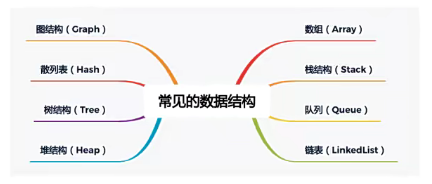

- **常见的数据结构较多**
  - 每一种都有其对应的应用场景，**不同的数据结构** 的 **不同操作** 性能是不同的。
  - 有的**查询性能很快**，有的**插入速度很快**，有的是**插入头和尾速度很快。**
  - 有的**做范围查找很快**，有的**允许元素重复**，有的**不允许重复**等等。
  - 在开发中如何选择，要根据具体的需求来选择。

- **注意：数据结构和语言无关，常见的编程语言都有 直接或者间接 的使用上述常见的数据结构**

## 什么是算法(Algorithm)？

- 解决**问题的过程**中，不仅仅**数据的存储方式会影响效率，算法的优劣也会影响着效率**

- **算法的定义：**
  - 一个有限指令集，每条指令的描述不依赖于语言
  - 接受一些输入（有些情况下不需要输入）
  - 产生输出
  - 一定在有限步骤之后终止
- **算法通俗理解：**
  - **Algorithm**这个单词本意就是**解决问题的办法/步骤逻辑。**
  - **数据结构的实现，离不开算法**

## 线性结构(Linear List)

- **线性结构（英語：Linear List）是由n（n≥0）个数据元素（结点）a[0]，a[1]，a[2]…，a[n-1]组成的有限序列。**

  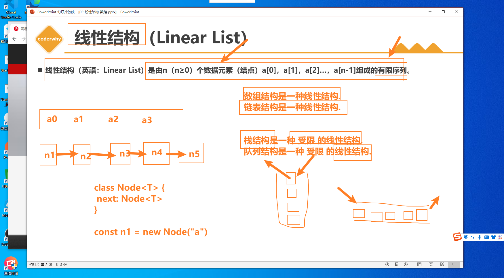

- **其中：**

  - 数据元素的个数n定义为表的长度 = “list”.length() （“list”.length() = 0（表里没有一个元素）时称为空表）。
  - 将非空的线性表（n>=1）记作：（a[0]，a[1]，a[2]，…，a[n-1]）。
  - 数据元素a[i]（0≤i≤n-1）只是个抽象符号，其具体含义在不同情况下可以不同。

- **上面是维基百科对于线性结构的定义，有一点点抽象，其实我们只需要记住几个常见的线性结构即可。**


### 数组（Array）结构

- **数组（Array）结构是一种重要的数据结构：**
  - 几乎是每种编程语言都会提供的一种**原生数据结构（语言自带的）；**
  - 并且我们**可以借助于数组结构来实现其他的数据结构**，比如栈（Stack）、队列（Queue）、堆（Heap）；
- **通常数组的内存是连续的，所以数组在知道下标值的情况下，访问效率是非常高的**

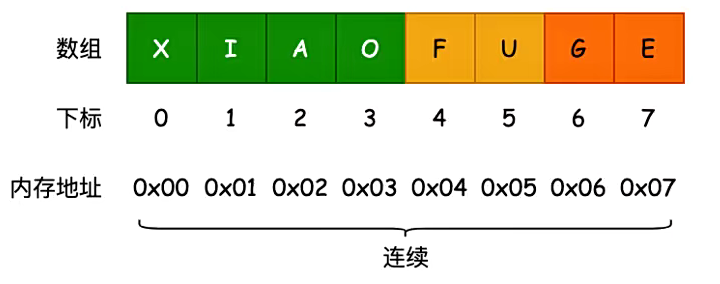

### 栈结构（Stack）

- **栈也是一种 非常常见 的数据结构， 并且在程序中的 应用非常广泛。**
- **数组**
  - 我们知道数组是一种**线性结构**， 并且可以在数组的 **任意位置** 插入和删除数据。
  - 但是有时候， 我们为了实现某些功能， 必须对这种**任意性** 加以 **限制。**
  - 而 **栈和队列** 就是比较常见的 **受限的线性结构**
- **栈结构示意图**

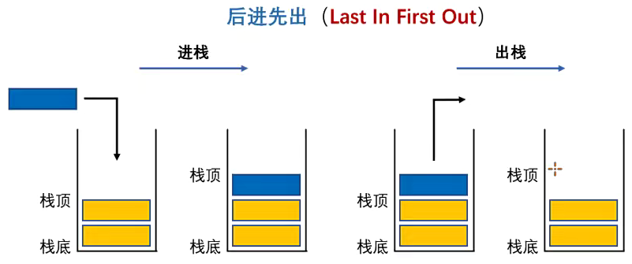

- **栈（stack），它是一种受限的线性结构，后进先出(LIFO)**
  - 其限制是仅允许在 **表的一端** 进行插入和删除运算。这一端被称为**栈顶**，相对地，把另一端称为**栈底。**
  - LIFO(last in first out)表示就是后进入的元素， 第一个弹出栈空间。 类似于自动餐托盘， 最后放上的托盘， 往往先把拿出去使用。
  - 向一个栈插入新元素又称作**进栈、入栈或压栈**，它是把新元素放到栈顶元素的上面，使之成为新的栈顶元素；
  - 从一个栈删除元素又称作**出栈或退栈**，它是把栈顶元素删除掉，使其相邻的元素成为新的栈顶元素。
- **生活中类似于栈的**
  - 自助餐的托盘， 最新放上去的， 最先被客人拿走使用。
  - 收到很多的邮件(实体的)， 从上往下依次处理这些邮件。 (最新到的邮件， 最先处理)
  - 注意: 不允许改变邮件的次序， 比如从最小开始， 或者处于最紧急的邮件， 否则就不再是栈结构了。 而是队列或者优先级队列结构。

#### 栈结构的实现

- **实现栈结构有两种比较常见的方式:**
  
  - 基于**数组**实现
  - 基于**链表**实现
- **什么是链表?**
  
- 也是一种数据结构，目前我们还没有学习，并且**JavaScript中并没有自带链表结构。**
  
- **这里实现的栈结构基于数组。**

- **栈的操作**

  栈常见有哪些操作呢?

  - **push(element):** 添加一个新元素到栈顶位置。
  - **pop()：**移除栈顶的元素，同时返回被移除的元素。
  - **peek()**：返回栈顶的元素，不对栈做任何修改（这个方法不
    会移除栈顶的元素，仅仅返回它）。
  - **isEmpty()**：如果栈里没有任何元素就返回true，否则返回
    false。
  - **size()**：返回栈里的元素个数。这个方法和数组的length属性
    很类似。

```ts
interface IStack<T> {
  push(element: T): void;
  pop(): T | undefined;
  peek(): T | undefined;
  isEmpty(): boolean;
  size(): number;
}

class Stack<T = any> implements IStack<T> {
  private data: T[] = [];
  //push添加元素
  push(element: T) {
    this.data.push(element);
  }
  //pop 移除栈顶元素
  pop(): T | undefined {
    return this.data.pop();
  }
  //peek返回栈顶的元素，不对栈做任何修改（这个方法不会移除栈顶的元素，仅仅返回它）
  peek(): T | undefined {
    return this.data[this.data.length - 1];
  }
  //判断数组中是否有元素，没有返回true
  isEmpty(): boolean {
    return this.data.length === 0;
  }
  //size获取长度
  size(): number {
    return this.data.length;
  }
}

const stack1 = new Stack<string>();
stack1.push("aaa");
stack1.push("bbb");
stack1.push("ccc");
console.log(stack1.peek());
stack1.pop();
stack1.pop();
stack1.pop();
console.log(stack1.isEmpty());
console.log(stack1.size());

const stack2 = new Stack<number>();

stack2.push(111);
stack2.push(222);
stack2.push(333);
console.log(stack2);

```

> 符合栈结构的特点——>后进先出   使用pop()和peek()可以实现删除的拿到最后一个元素

#### 十进制转二进制（面试题）

思路:进制之间的转化要使用除法并且取余数，余数从后往前排列就可以组成转化之后的进制

比如:10进制转2进制，我们需要(值/2)，每一次都取拿到的余数组成2进制,直到最后为0

```ts
比如35
 35/2 = 17 余数为1
 17/2 = 8  余数为1
 8/2 = 4   余数为0
 4/2 = 2   余数为0
 2/2 = 1   余数为0
 1小于2 1  补上最后的1

 随意35转2进制为   100011
```

代码实现:

```typescript
import Stack from "./01-栈结构Stack的封装类";

function decimalToBinary(decimal: number) {
  const stack = new Stack();
   //如果decimal > 0就进入循环
  while (decimal > 0) {
    const result = decimal % 2;
    //push到stack中
    stack.push(result);
    //重新赋值deecimal, 向下取整，最后一次为0
    decimal = Math.floor(decimal / 2);
  }

  let binary = "";
  //如果stack中有值进入循环
  while (!stack.isEmpty()) {
    //进行赋值
    binary += stack.pop();
  }
  return binary;
}

console.log(decimalToBinary(35)); //100011
console.log(decimalToBinary(100)); //1100100

```

> .使用循环：
> while:,不确定次数，·只知道循坏结束跳转
> for:~知道循环的次数时

#### 有效的括号 – 字节、华为等面试题

- **国内字节、华为、京东都考过的面试题。**
- 给定一个只包括 '('，')'，'{'，'}'，'['，']' 的字符串 s ，判断字符串是否有效。
  - Leetcode 20：https://leetcode.cn/problems/valid-parentheses/description
- **有效字符串需满足：**

1. 左括号必须用相同类型的右括号闭合。
2. 左括号必须以正确的顺序闭合。
3. 每个右括号都有一个对应的相同类型的左括号

```typescript
import Stack from "./01-栈结构Stack的封装类";

function isValid(s: string): boolean {
  const stack = new Stack();
  //对字符串进行遍历
  for (let i = 0; i < s.length; i++) {
    //记录拿到的值
    const c = s[i];
    //如果为左边的
    if (c === "(") {
      //我们把对应的右边push保存
      stack.push(")");
    } else if (c === "{") {
      stack.push("}");
    } else if (c === "[") {
      stack.push("]");
    } else {
      //如果为右边的，利用栈后进先出的特性，进行判断是否与做后push的值匹配
      //不匹配返回false
      if (c !== stack.pop()) return false;
    }
  }
  //如果右边的括号全部匹配，说明为为有效的，并且stack中全部移除了，返回true
  return stack.isEmpty();
}

console.log(isValid("{}()[]"));
console.log(isValid("{(})"));
console.log(isValid("([]{})"));

```

### 队列结构（Queue）

- **受限的线性结构：**
  - 我们已经学习了一种**受限的线性结构**：栈结构。
    - 并且已经知道这种受限的数据结构对于解决某些**特定问题**，会有**特别的效果。**
    - 下面，我们再来学习另外一个受限的数据结构：**队列。**
  - **队列(Queue)，它是一种受限的线性表，先进先出(FIFO First In First Out)**
    - 受限之处在于它只允许在队列的**前端**（front）进行删除操作；
    - 而在队列的**后端**（rear）进行插入操作；

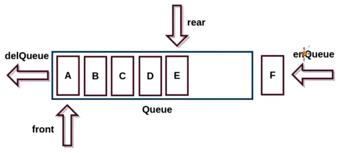

- **生活中类似的队列结构**
  - 生活中类似队列的场景就是非常多了
  - 比如在电影院，商场，甚至是厕所排队。
  - 优先排队的人，优先处理。 （买票，结账，WC）

**开发中队列的应用：**

- **打印队列：**
  - 有五份文档需要打印，这些文档会**按照次序放入**到**打印队列**中。
  - 打印机会依次从队列中取出文档，**优先放入的文档，优先被取出**，并且对该文档进行打印。
  - 以此类推，直到队列中不再有新的文档。
- **线程队列：**
  - 在开发中，为了让任务可以并行处理，通常会**开启多个线程**。
  - 但是，我们不能让大量的线程同时运行处理任务。 (占用过多的资源)
  - 这个时候，如果有需要开启线程处理任务的情况，我们就会使用**线程队列。**
  - 线程队列会**依照次序**来启动线程，并且处理对应的任务

#### 队列结构的实现

- **队列的实现和栈一样，有两种方案：**
  - 基于**数组**实现
  - 基于**链表**实现

- **队列的常见操作**
  - **enqueue(element)** ：向队列尾部添加一个（或多个）新的项。
  - **dequeue()**：移除队列的第一（即排在队列最前面的）项，并返回被移除的元素。
  - **front/peek()**：返回队列中第一个元素——最先被添加，也将是最先被移除的元素。队列不做任何变（不移除元素，只返回元素信息——与Stack类的peek方法非常类似）。
  - **isEmpty()**：如果队列中不包含任何元素，返回true，否则返回false。
  - **size()**：返回队列包含的元素个数，与数组的length属性类似。

```typescript
interface IQueue<T> {
  enqueue(elelment: T): void;
  dequeue(): T | undefined;
  peek(): T | undefined;
  isEmpty(): boolean;
  size(): number;
}

class Queue<T> implements IQueue<T> {
  private data: T[] = [];
  enqueue(elelment: T): void {
    this.data.push(elelment);
  }
  dequeue(): T | undefined {
    return this.data.shift();
  }
  peek(): T | undefined {
    return this.data[0];
  }

  isEmpty(): boolean {
    return this.data.length === 0;
  }
  size(): number {
    return this.data.length;
  }
}

const queue = new Queue<number>();

queue.enqueue(1);
queue.enqueue(2);
queue.enqueue(3);
queue.enqueue(4);
queue.dequeue();

console.log(queue.size());
console.log(queue);

export default Queue;

```

#### 击鼓传花

- **击鼓传花是一个常见的面试算法题： 使用队列可以非常方便的实现最终的结果。**
- **原游戏规则：**
  - 班级中玩一个游戏，所有学生围成一圈，从某位同学手里开始向旁边的同学传一束花。
  - 这个时候某个人(比如班长)，在击鼓，鼓声停下的一颗，花落在谁手里，谁就出来表演节目。
- **修改游戏规则：**
  - 我们来修改一下这个游戏规则。
  - 几个朋友一起玩一个游戏，围成一圈，开始数数，数到某个数字的人自动淘汰。
  - 最后剩下的这个人会获得胜利，请问最后剩下的是原来在哪一个位置上的人?
- **封装一个基于队列的函数：**
  - 参数：所有参与人的姓名，基于的数字；
  - 结果：最终剩下的一人的姓名

```typescript
import Queue from "./01-队列结构的封装类";

function hotPotato(names: string[], num: number) {
  //1.创建队列
  const queue = new Queue();
  //2.把names加入队列
  for (const name of names) {
    queue.enqueue(name);
  }
  //3.只有一个人赢得比赛
  while (queue.size() > 1) {
    //4.游戏规则是，对于喊到num数字的人淘汰，
    /*所以我们把<num数字的人移除之后在加入队列，这样<num的人就会重新排列在队列的最后面，
  我们只需要删除第一个即可，第一个就是喊到对应数字的人
  */
    for (let i = 1; i < num; i++) {
      //移出在加入队列
      const name = queue.dequeue();
      queue.enqueue(name);
    }
    //5.删除第一个
    queue.dequeue();
  }

  return queue.dequeue();
}

const name = hotPotato(["lwy", "james", "jake", "curry", "aaa"], 3);
console.log(name);

```

#### 约瑟夫环问题 – 字节、阿里、谷歌等面试题

- **击鼓传花和约瑟夫环其实是同一类问题，这种问题还会有其他解法（后续讲解）同样的题目在Leetcode上也有：**
  - https://leetcode.cn/problems/yuan-quan-zhong-zui-hou-sheng-xia-de-shu-zi-lcof/
  -  0,1,···,n-1这n个数字排成一个圆圈，从数字0开始，每次从这个圆圈里删除第m个数字（删除后从下一个数字开始计数）。求出这个圆圈里剩下的最后一个数字。
  - 例如，0、1、2、3、4这5个数字组成一个圆圈，从数字0开始每次删除第3个数字，则删除的前4个数字依次是2、0、4、1，因此最后剩下的数字是3

```typescript
function lastRemaining(n: number, m: number): number {
  const data: number[] = [];
  for (let i = 0; i < n; i++) {
    data.push(i);
  }

  while (data.length > 1) {
    for (let i = 1; i < m; i++) {
      const num = data.shift()!;
      data.push(num);
    }

    data.shift();
  }

  return data.shift()!;
}
lastRemaining(5, 3);
lastRemaining(10, 17);

```

####  双端队列（Deque）

- **双端队列在单向队列的基础上解除了一部分限制：允许在队列的两端添加（入队）和删除（出队）元素。**
  - 因为解除了一部分限制，所以在解决一些特定问题时会更加的方便

实现:

```typescript
import Queue from "../02-队列结构Queue/01-队列结构的封装类";

//双端队列的特点:允许在队列的两端添加（入队）和删除（出队）元素。
class deque<T> extends Queue<T> {
  //添加在最前面
  addFront(value: T) {
    this.data.unshift(value);
  }

  //
  removeRear() {
    return this.data.pop();
  }
}

```

#### 优先级队列（Priority Queue）

- **优先级队列(Priority Queue)是一种比普通队列更加高效的数据结构。**
  - 它每次出队的元素都是具有最高优先级的，可以理解为元素按照关键字进行排序。
  - 优先级队列可以用数组、链表等数据结构来实现，但是**堆是最常用的实现方式(最大堆)。**
- **优先级队列的应用**
- 一个现实的例子就是机场**登机的顺序**
  - 头等舱和商务舱乘客的优先级要高于经济舱乘客。
  - 在有些国家，老年人和孕妇（或带小孩的妇女）登机时也享有高于其他乘客的优先级。
- 另一个现实中的例子是医院的（**急诊科**）候诊室。
  - 医生会优先处理病情比较严重的患者。
  - 当然, 一般情况下是按照排号的顺序。
- 计算机中, 我们也可以通过**优先级队列**来重新排序队列中任务的顺序
  - 比如每个线程处理的任务重要性不同, 我们可以通过优先级的大小, 来决定该线程在队列中被处理的次序

实现:

```typescript
import Heap from "../09-堆结构Heap/01-堆结构的实现";
//优先节点，用于堆中生成一个优先队列
class priorityNode<T> {
  constructor(public value: T, public priority: T) {}

  //必须要实现这个方法，为了类内部可以读取到这个值，如果没有堆结构就不知道读取什么值
  //会是[object Object]这种形式
  valueOf() {
    return this.priority;
  }
}

class priorityQueue<T> {
    
  private heap: Heap<priorityNode<T>> = new Heap();

  enqueue(value: T, priority: T) {
      //把信息放入堆中，因为是个对像结构，所以实现valueOf方法告诉堆使用哪个值
    const newNode = new priorityNode(value, priority);
    this.heap.insert(newNode);
  }
  print() {
    this.heap.print();
  }

  dequeue() {
    return this.heap.extract();
  }
}

const priority = new priorityQueue();

priority.enqueue("lwy", 20);
priority.enqueue("kkk", 22);
priority.enqueue("lwy", 23);

priority.print();

```


### 链表结构（LinkedList）

#### 链表以及数组的缺点

- **链表和数组一样，可以用于存储一系列的元素，但是链表和数组的实现机制完全不同。**

- **数组：**
  - 要存储多个元素，数组（或选择链表）可能是**最常用**的数据结构。
  - 几乎每一种编程语言都有默认实现**数组结构。**
- **但是数组也有很多缺点：**
  - 数组的创建通常需要申请一段**连续的内存空间**(一整块的内存)，并且大小是固定的(大多数编程语言数组都是固定的)，所以当当前数组**不能满足容量需求**时，需要**扩容**。 (一般情况下是申请一个更大的数组，比如2倍。 然后将原数组中的元素复制过去)
  - 而且在**数组开头或中间位置插入数据的成本很高**，需要**进行大量元素的位移。**
  - 尽管JavaScript的Array底层可以帮我们做这些事，但背后的原理依然是这样

#### 链表的优势

- **要存储多个元素，另外一个选择就是链表。**
- **但不同于数组，链表中的元素在内存中不必是连续的空间。**
  - 链表的每个元素由一个存储**元素本身的节点**和一个**指向下一个元素的引用**(有些语言称为指针或者链接)组成。
- **相对于数组，链表有一些优点：**
  - **内存空间不是必须连续的。**
    - 可以充分利用计算机的内存，实现灵活的**内存动态管理。**
  - 链表不必在创建时就**确定大小**，并且大小可以**无限的延伸**下去。
  - 链表在**插入和删除**数据时**，时间复杂度**可以达到O(1)。
    - 相对数组效率高很多

- **相对于数组，链表有一些缺点：**
  - 链表访问任何一个位置的元素时，都需要**从头开始访问**。(无法跳过第一个元素访问任何一个元素)。
  - **无法通过下标直接访问元素**，需要从头一个个访问，直到找到对应的元素

#### 链表到底是什么?

- **什么是链表呢?**

  - **链表类似于火车：**有一个火车头，火车头会连接一个节点，节点上有乘客(类似于数据)，并且这个节点会连接下一个节点，以此类推

- **链表的火车结构：**

  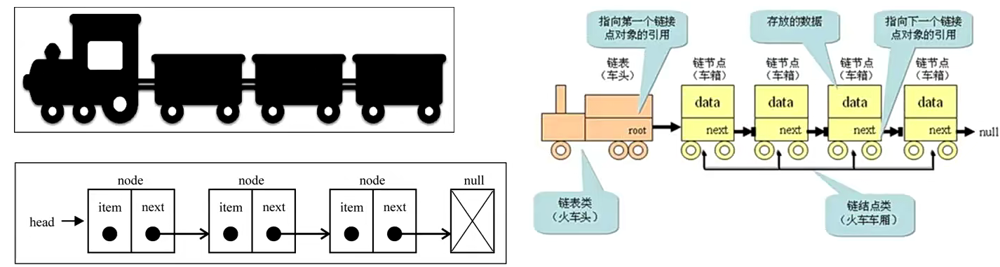

- **head指向第一个节点，next指向下一个节点**

#### 链表结构的封装

```typescript
//链表中有一个一个的节点node，noed中有每一项itme和指向下一个node的next
//所以我们需要封装2个类，整体链表是一个类，一个node是一个

//每一个Node类
class Node<T> {
  value: T;
  next: Node<T> | null;
  constructor(value: T) {
    this.value = value;
    this.next = null;
  }
}

// 封装linkedList类
//里面有2个属性,一个head指向第一个节点，一个size链表的长度
class LinkedList<T> {
  head: Node<T> | null = null;
  private size: number = 0;

  get length() {
    return this.size;
  }

  //添加方法
  append() {}
}

export {};

```

- **代码解析：**
  - 封装一个**Node类**，用于封装每一个节点上的信息（包括值和指向下一个节点的引用），它是一个泛型类。
  - 封装一个**LinkedList类**，用于表示我们的链表结构。 (和Java中的链表同名，不同Java中的这个类是一个双向链表，在第二阶段中我们也会实现双向链表结构)。
  - 链表中我们保存两个属性，一个是**链表的长度**，一个是**链表中第一个节点**

- **链表常见操作**
  - **append(element)**：向链表尾部添加一个新的项
  - **insert(position，element)**：向链表的特定位置插入一个新的项。
  - **get(position)** ：获取对应位置的元素
  - **indexOf(element)**：返回元素在链表中的索引。如果链表中没有该元素则返回-1。
  - **update(position，element)** ：修改某个位置的元素
  - **removeAt(position)**：从链表的特定位置移除一项。
  - **remove(element)**：从链表中移除一项。
  - **isEmpty()**：如果链表中不包含任何元素，返回true，如果链表长度大于0则返回false。
  - **size()**：返回链表包含的元素个数。与数组的length属性类似。

- **整体你会发现操作方法和数组非常类似，因为链表本身就是一种可以代替数组的结构。**

```typescript
//链表中有一个一个的节点node，noed中有每一项itme和指向下一个node的next
//所以我们需要封装2个类，整体链表是一个类，一个node是一个

//每一个Node类
class Node<T> {
  value: T;
  next: Node<T> | null;
  constructor(value: T) {
    this.value = value;
    this.next = null;
  }
}

// 封装linkedList类
//里面有2个属性,一个head指向第一个节点，一个size链表的长度
class LinkedList<T> {
  head: Node<T> | null = null;
  private size: number = 0;

  get length() {
    return this.size;
  }
  //对公共逻辑抽取重构代码,返回的是current节点
  getNode(position: number): Node<T> | null {
    let current = this.head;
    let index = 0;
    while (index++ < position && current) {
      current = current.next;
    }
    return current;
  }
  //添加方法
  append(value: T) {
    const newNode = new Node<T>(value);
    if (!this.head) {
      //1.head为空时
      this.head = newNode;
    } else {
      //2.当head不为null时
      let current = this.head;
      //当有下一个元素时，就会循环
      while (current.next) {
        //把current永远都会指向最后一个元素
        current = current.next;
      }
      //最一个元素的next指向新添加的元素
      current.next = newNode;
    }
    this.size++;
  }
  //链表的遍历方法（traverse）
  traverse() {
    const values: T[] = [];
    //记录head
    let current = this.head;
    //只有current有值，进入循环
    while (current) {
      //把value添加进数组中
      values.push(current.value);
      //改变当前current指向为下一个元素
      current = current.next;
    }
    console.log(values.join("->"));
  }
  //insert插入方法
  insert(value: T, position: number): boolean {
    if (position < 0 || position > this.size) return false;
    const newNode = new Node(value);

    //创建一个指针，用变换当前位置
    let current = this.head;
    //1.插入头部
    if (position === 0) {
      //把新元素的next元素指向head头部,
      newNode.next = current;
      //再把头部 = newhead,这样就放在了第一位
      this.head = newNode;
    } else {
        //重构之前的代码
         //2.插入到其他位置
      //记录位置
      let index = 0;
      //记录current前一个位置
      let previous: Node<T> | null = null;
      //位置进行++操作，并且小于positin
      while (index++ < position && current) {
        //记录当前current位置
        previous = current;
        //current跟随index的值，查找并等于下一个元素
        current = current?.next;
      }
      //index === position
      //把插入元素的next元素指向current，现在的current在要被插入的位置
      newNode.next = current;
      //前一个元素的next=newNode，这样插入的值就会被在2个值中间被引用
      previous!.next = newNode;
        
          //重构之后
      //2.插入到其他位置
      const previous = this.getNode(position - 1);
      newNode.next = previous?.next ?? null;
      previous!.next = newNode;
    }
    this.size++;
    return true;
  }

  removeAt(position: number) {
    if (position < 0 || position > this.size) return false;
    let current = this.head;
    //1.移除第一个元素时
    if (position === 0) {
      //把head指向下一个元素，这样第一个元素就不会被引用，在GC中会自动被回收
      this.head = current?.next ?? null;
    } else {
        //重构之前
          //2.移除其他位置`
      let index = 0;
      let previous: Node<T> | null = null;
      while (index++ < position && current) {
        previous = current;
        current = current.next;
      }
      //前一个next = 后一个的next,相当于中间值就没有被引用，自然被回收
      previous!.next = current?.next ?? null;
        
        
      //2.移除其他位置`
      const current = this.getNode(position);
      const previous = this.getNode(position - 1);
      //前一个next等与后一个的next,相当于中间值就没有被引用，自然被回收
      previous!.next = current?.next ?? null;
    }
    this.size--;
    return current?.value;
  }
  //修改某个位置的元素
  updata(element: T, position: number) {
    if (position < 0 || position > this.size) return false;

    const current = this.getNode(position);
    if (current) {
        //让当前位置value等于传入的value
      current!.value = element;
    }
  }
  //根据元素获取在链表中的位置
  indexOf(element: T) {
    let current = this.head;
    let index = 0;
    while (current) {
        //如果 值相等返回index
      if (current.value === element) {
        return index;
      }
        //否则index和current都进行++操作
      index++;
      current = current.next;
    }
    return -1;
  }

  //isEmpty
  isEmpty() {
    return this.size === 0;
  }
}

const linkedList = new LinkedList();
linkedList.append("aaa");
linkedList.append("bbb");
linkedList.append("ccc");
linkedList.traverse();
linkedList.insert("ddd", 2);
linkedList.traverse();
linkedList.insert("abc", 0);
linkedList.traverse();
linkedList.removeAt(2);
linkedList.traverse();
console.log(linkedList.removeAt(0));
linkedList.traverse();
linkedList.updata("jjj", 0);
linkedList.traverse();
linkedList.indexOf("jjj");
linkedList.traverse();
export {};

```

#### 面试题

##### 设计链表 -字节、腾讯等公司面试题

- https://leetcode.cn/problems/design-linked-list/
  - 上面有实现

##### 删除链表中的节点 – 字节、阿里等公司面试题

- https://leetcode.cn/problems/delete-node-in-a-linked-list/description/

##### 反转链表 – 字节、谷歌等面试题

- https://leetcode.cn/problems/reverse-linked-list/

- **栈结构实现:**

```typescript
class ListNode {
  val: number;
  next: ListNode | null;
  constructor(val?: number, next?: ListNode | null) {
    this.val = val === undefined ? 0 : val;
    this.next = next === undefined ? null : next;
  }
}

function reverseList(head: ListNode | null): ListNode | null {
  if (head === null && head!.next === null) return head;

  const data: ListNode[] = [];

  let current = head;
  while (current) {
    data.push(current);
    current = current.next;
  }

  const newData: ListNode | null = data.pop()!;
  let currentNewData = newData;
  while (data.length) {
    //删除最后一个元素，并且添加到最前面
    const node = data.pop()!;
    currentNewData.next = node;
    currentNewData = currentNewData.next;
  }
  currentNewData.next = null;
  return newData;
}

const node1 = new ListNode(1);
node1.next = new ListNode(2);
node1.next.next = new ListNode(3);

const newnode = reverseList(node1);
let current = newnode;
while (current) {
  console.log(current.val);
  current = current?.next ?? null;
}

export {};

```

**循环实现:**

```typescript
class ListNode {
  val: number;
  next: ListNode | null;
  constructor(val?: number, next?: ListNode | null) {
    this.val = val === undefined ? 0 : val;
    this.next = next === undefined ? null : next;
  }
}

function reverseList(head: ListNode | null): ListNode | null {
  if (head === null && head!.next === null) return head;
  // 1.让current节点指向下一个节点
  // ·目的：保留着下一个节点的引用，可以拿到，并且不会销毁
  // 2.改变head当前指向的节点，指向newHead
  // ·对于第一个节点来说，指向newHead就是指向的null
  // 3.让newHead指向head节点
  // ·目的是下一次遍历时，第二步操作，可以让下一个节点指向第一个节点
  // 4.让head移向下一个节点指向current
  let newHead: ListNode | null = null;

  while (head) {
    let current = head.next;
    //第一个节点指向null
    head.next = newHead;
    // ·目的是下一次遍历时，第二步操作，可以让下一个节点指向第一个节点
    newHead = head;
    head = current;
  }

  return newHead;
}

const node1 = new ListNode(1);
node1.next = new ListNode(2);
node1.next.next = new ListNode(3);

const newnode = reverseList(node1);
let current = newnode;
while (current) {
  console.log(current.val);
  current = current?.next ?? null;
}

export {};

```

**递归实现:**

```typescript
class ListNode {
  val: number;
  next: ListNode | null;
  constructor(val?: number, next?: ListNode | null) {
    this.val = val === undefined ? 0 : val;
    this.next = next === undefined ? null : next;
  }
}

function reverseList(head: ListNode | null): ListNode | null {
  if ((head === null || head!.next) === null) return head;
  //这里可以拿到返回值，因为当head=null时，直接返回当前head
  const newHead = reverseList(head?.next ?? null);
  //这里拿到的是倒数第二个节点,因为，最后一个节点指向null，上面会直接进行返回head,所以这里拿到的是倒数第二个节点
  //我们需要把最后一个节点的next指向当前倒数第二个节点，再把倒数第二个节点的next指向null
  //这样会进行下一次递归操作，下一次递归拿到的head就会是倒数第三个节点，因为倒数第二个节点的next=null了
  //我们再把head的下一个节点指向head,再把head指向null,这样一种递归就可以实现反转操作
  head!.next!.next = head;
  head!.next = null;
  return newHead;
}

const node1 = new ListNode(1);
node1.next = new ListNode(2);
node1.next.next = new ListNode(3);

const newnode = reverseList(node1);
let current = newnode;
while (current) {
  console.log(current.val);
  current = current?.next ?? null;
}

export {};

```

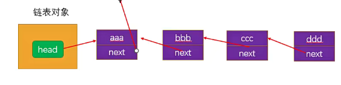

#### 循环链表

- **前面我们已经从零去封装了一个链表结构，其实我们还可以封装更灵活的链表结构：循环链表和双向链表。**
- **循环链表（Circular LinkedList）是一种特殊的链表数据结构：**
  - 在普通链表的基础上，最后一个节点的下一个节点不再是 null，而是指向链表的第一个节点。
  - 这样形成了一个环，使得链表能够被无限遍历。
  - 这样，我们就可以在单向循环链表中**从任意一个节点出发，不断地遍历下一个节点，直到回到起点**

-  **单向循环链表我们有两种实现方式：**
  - 方式一：从零去实现一个新的链表，包括其中所有的属性和方法；
  - 方式二：继承自之前封装的LinkedList，只实现差异化的部分；

```typescript
class circularLinkedList<T> {
  private head: node<T> | null = null;
  private size: number = 0;
  //记录最后一个节点，用来指向第一个节点形成循环
  private tail: node<T> | null = null;

  private isLastNode(node: node<T>) {
    return node === this.tail;
  }
  append(value: T) {
    //1.创建节点
    const newNode = new node(value);
    //2.添加节点
    if (!this.head) {
      this.head = newNode;
    } else {
      this.tail!.next = newNode;
    }
    this.tail! = newNode;
    this.size++;
  }

  traverse() {
    const values: T[] = [];

    let current = this.head;
    while (current) {
      values.push(current.value);
      if (this.isLastNode(current)) {
        current = null;
      } else {
        current = current.next;
      }
    }
    if (this.head) {
      values.push(this.head!.value);
    }
    console.log(values.join("->"));
  }

  private getNode(position: number) {
    let current = this.head;
    let index = 0;
    while (index++ < position) {
      current = current!.next;
    }
    return current;
  }

  insert(value: T, position: number) {
    if (position < 0 && position > this.size) return;

    const newNode = new node(value);
    if (position === 0) {
      newNode.next = this.head;
      this.head = newNode;
      this.tail!.next = this.head;
    } else {
      const previous = this.getNode(position - 1);
      newNode.next = previous?.next ?? null;
      previous!.next = newNode;
    }
    if (position === this.size) {
      this.tail = newNode;
    }
    this.size++;
  }

  removeAt(position: number) {
    if (position < 0 && position > this.size) return;

    let current = this.head;
    if (position === 0) {
      this.head = current?.next ?? null;
      this.tail!.next = this.head;
    } else {
      const previous = this.getNode(position - 1);
      const current = previous?.next;
      previous!.next = current?.next ?? null;
      if (position === this.size) {
        this.tail = previous ?? null;
      }
    }

    if (position === this.size) {
      this.tail!.next = this.head;
    }

    this.size--;
    return current?.value;
  }

  updata(element: T, position: number) {
    if (position < 0 && position > this.size) return;

    const current = this.getNode(position);
    if (current) {
      current.value = element;
    }

    if (position === this.size) {
      this.tail = current;
      this.tail!.next = this.head;
    }
  }

  indexOf(element: T) {
    let current = this.head;
    let index = 0;
    while (current) {
      if (current.value === element) {
        return index;
      }
      if (this.isLastNode(current)) {
        current = null;
      } else {
        current = current.next;
      }
      index++;
    }
  }
}
```

> **主要就是使用tail节点指向最后一个属性，tail的next指向head头部形成循环**
>
> **在每一个方法中对tail做正确的赋值和改变指向即可**

#### 双向链表

- **双向链表:**

  - 既可以**从头遍历到尾**, 又可以**从尾遍历到头.**
  - 也就是链表相连的过程是**双向**的. 那么它的实现原理, 你能猜到吗?
  - 一个节点既有**向前连接的引用prev**, 也有一个**向后连接的引用next.**

- **双向链表有什么缺点呢?**

  - 每次在**插入或删除**某个节点时, 需要处理四个引用, 而不是两个. 也就是实现起来要困难一些
  - ###### 并且相当于单向链表, 必然占用**内存空间**更大一些.
  - 但是这些缺点和我们使用起来的方便程度相比, 是微不足道的.

  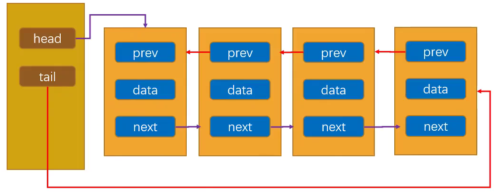

```typescript
class DoublyNode<T> {
  value: T;
  next: DoublyNode<T> | null = null;
    //指向上一个节点
  prev: DoublyNode<T> | null = null;

  constructor(value: T) {
    this.value = value;
  }
}

class DoublyLinkedList<T> {
  private head: DoublyNode<T> | null = null;
  //记录最后节点
  private tail: DoublyNode<T> | null = null;
  private size: number = 0;

  append(value: T) {
    const newNode = new DoublyNode(value);

    if (!this.head) {
      this.head = newNode;
      this.tail = newNode;
    } else {
      this.tail!.next = newNode;
      newNode.prev = this.tail;
      this.tail = newNode;
    }

    this.size++;
  }

  traverse() {
    const values: T[] = [];

    let current = this.head;
    while (current) {
      values.push(current.value);
      current = current.next;
    }

    console.log(values.join("->"));
  }
  //从尾部遍历
  postTraverse() {
    const values: T[] = [];

    let current = this.tail;
    while (current) {
      values.push(current.value);

      current = current.prev;
    }
    console.log(values.join("->"));
  }
  //添加到最前面
  prepend(value: T) {
    const newNode = new DoublyNode(value);

    if (!this.head) {
      this.head = newNode;
      this.tail = newNode;
    } else {
      newNode.next = this.head;
      this.head.prev = newNode;
      this.head = newNode;
    }

    this.size++;
  }

  insert(element: T, position: number) {
    if (position < 0 && position > this.size) return;

    if (position === 0) {
      this.prepend(element);
    } else if (position === this.size) {
      this.append(element);
    } else {
      const newNode = new DoublyNode(element);

      let current = this.head;
      let index = 0;
      while (index++ < position) {
        current = current!.next;
      }
      current!.prev!.next = newNode;
      newNode.prev = current!.prev;
      current!.prev = newNode;
      newNode.next = current;
    }
    this.size++;
  }

  removeAt(position: number) {
    if (position < 0 && position > this.size) return;

    let current = this.head;
    if (position === 0) {
      if (this.size === 1) {
        this.head = null;
        this.tail = null;
      } else {
        this.head = this.head!.next;
        this.head!.prev = null;
      }
    } else if (position === this.size - 1) {
      console.log(this.size);
      current = this.tail;
      this.tail = this.tail!.prev;
      this.tail!.next = null;
    } else {
      let index = 0;
      while (index++ < position) {
        current = current!.next;
      }

      current!.prev!.next = current!.next ?? null;
      current!.next!.prev = current!.prev ?? null;
    }
    this.size--;
    return current?.value;
  }
}

const DLinkedList = new DoublyLinkedList();

DLinkedList.append("aaa");
DLinkedList.append("bbb");
DLinkedList.append("ccc");
DLinkedList.traverse();
DLinkedList.postTraverse();

DLinkedList.prepend("ddd");
DLinkedList.traverse();
DLinkedList.postTraverse();

DLinkedList.insert("iii", 0);
DLinkedList.traverse();
DLinkedList.postTraverse();

DLinkedList.insert("lll", 4);
DLinkedList.traverse();
DLinkedList.postTraverse();

console.log(DLinkedList.removeAt(6));

export {};

```

> **本值就是在每一个节点上定义个prev属性，指向上一个节点**
>
> **在每个方法中正确指向即可**


## 算法的复杂度分析

- **什么是算法复杂度（现实案例）？**
  - **什么是算法？其实就是解决问题的一系列步骤操作、逻辑。**
  - **对于同一个问题，我们往往其实有多种解决它的思路和方法，也就是可以采用不同的算法。**
    - 但是**不同的算法**，其实**效率是不一样的**
  - **举个例子（现实的例子）：在一个庞大的图书馆中，我们需要找一本书。**
    - 在图书已经按照某种方式摆好的情况下（数据结构是固定的）
  - **方式一：顺序查找**
    - 一本本找，直到找到想要的书；（累死）
  - **方式二：先找分类，分类中找这本书**
    - 先找到分类，在分类中再顺序或者某种方式查找；
  - **方式三：找到一台电脑，查找书的位置，直接找到；**
    - 图书馆通常有自己的图书管理系统；
    - 利用图书管理系统先找到书的位置，再直接过去找到

- 什么是算法复杂度（程序案例）？
  - **一个程序中的案例：让我们来比较两种不同算法在查找数组中（数组有序）给定元**
    **素的时间复杂度。**
  - **方式一: 顺序查找**
    - 这种算法**从头到尾遍历整个数组，依次比较每个元素和给定元素的值。**
    - 如果**找到相等的元素，则返回下标**；如果**遍历完整个数组都没找到，则返回-1。**

```typescript
function sequence<T>(arr: number[], num: number) {
  for (let i = 0; i < arr.length; i++) {
    if (arr[i] === num) {
      return i;
    }
  }
  return -1;
}

const result = sequence([1, 2, 3, 55, 99, 111, 222, 333, 444, 555], 99);

console.log(result);

export {};

```

- **方式二：二分查找**
  - 这种**算法假设数组是有序**的，每次**选择数组中间的元素与给定元素进行比较。**
  - 如果**相等，则返回下标**；如果**给定元素比中间元素小，则在数组的左半部分继续查找；**
  - 如果**给定元素比中间元素大，则在数组的右半部分继续查找**；
  - 这样**每次查找都会将查找范围减半，直到找到相等的元素或者查找范围为空；**

```typescript
function binarySearch(arr: number[], num: number) {
  //记录左右的位置
  let left = 0;
  let right = arr.length - 1;
  //只有当left的位置<=right时才会停止循环，因为
  while (left <= right) {
    //第一次去中间
    let mid = Math.floor((left + right) / 2);
    //中间值
    const midNum = arr[mid];
    //相等直接返回
    if (midNum === num) {
      return mid;
    } else if (midNum < num) {
      //中间值 < num 说明目标值在中间值的右边
      //所以改变left的值，并且中间值+1重新获取中间值
      left = mid + 1;
    } else {
      //中间值<num 说明目标值在中间值的左边
      //所以改变right的值，并且中间值-1重新获取中间值
      right = mid - 1;
    }
  }
}

const result = binarySearch([1, 2, 3, 55, 99, 111, 222, 333, 444, 555], 1);

console.log(result);

```

> 顺序查找算法的时间复杂度是O(n)
>
> 二分查找算法的时间复杂度是O(log n)  
>
> 查找数据较多时，效率区别很大

#### 大O表示法（Big O notation）

- **大O表示法（Big O notation）英文翻译为大O符号（维基百科翻译），中文通常翻译为大O表示法（标记法）。**
  - 这个记号则是在**德国数论学家**爱德蒙·兰道的著作中才推广的，因此它有时又称为**兰道符号（Landau symbols）。**
  - 代表**“order of ...”（……阶）**的**大O，**最初是**一个大写希腊字母“Ο”（omicron）**，现今用的是**大写拉丁字母“O”**
- **大O符号在分析算法效率的时候非常有用。**
  - 举个例子，解决**一个规模为n的问题所花费的时间（或者所需步骤的数目）可以表示为**：`T(n)=4n²-2n+2`
    - 当**n增大**时，**n²项**开始**占据主导地位，其他各项可以被忽略；**
  - 举例说明：当n=500
    - **4n²项**是**2n项**的**1000倍大**，因此在大多数场合下，**省略后者对表达式的值的影响将是可以忽略不计**的。
    - 进一步看，如果我们与任一其他级的表达式比较，**n²的系数也是无关紧要**的。

- **我们就说该算法具有n²阶（平方阶）的时间复杂度，表示为O(n²)。**

**常见的对数阶**：

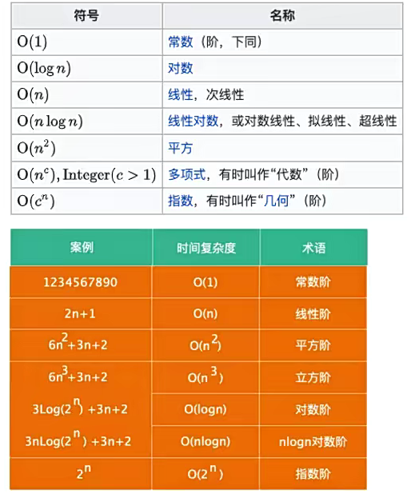

#### 空间复杂度

- **空间复杂度指的是程序运行过程中所需要的额外存储空间。**
  - 空间复杂度**也可以用大O表示法**来表示；
  - **空间复杂度的计算方法与时间复杂度类似**，通常需要分析程序中**需要额外分配的内存空间，如数组、变量、对象、递归调用**等。
- **举个栗子🌰：**
  - 对于一个简单的**递归算法**来说，每次调用都**会在内存中分配新的栈帧，这些栈帧占用了额外的空间。**
    - 因此，该算法的空间复杂度是O(n)，其中n是递归深度。
  - 而对于**迭代算法**来说，在**每次迭代中不需要分配额外的空间**，因此**其空间复杂度为O(1)。**
- **当空间复杂度很大时，可能会导致内存不足，程序崩溃。**
- **在平时进行算法优化时，我们通常会进行如下的考虑：**
  - 使用尽量少的空间（优化空间复杂度）；
  - 使用尽量少的时间（优化时间复杂度）；
  - 特定情况下：**使用空间换时间或使用时间换空间**

#### 数组和链表的复杂度对比

- **接下来，我们使用大O表示法来对比一下数组和链表的时间复杂度：**

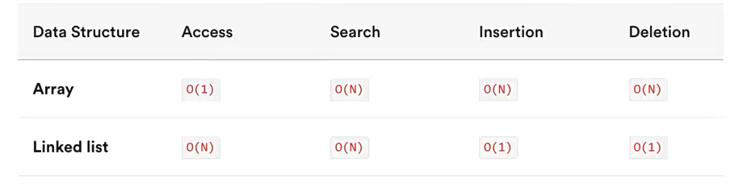

- **数组是一种连续的存储结构，通过下标可以直接访问数组中的任意元素。**
  - **时间复杂度**：对于数组，随机访问时间复杂度为O(1)，插入和删除操作时间复杂度为O(n)。
  - **空间复杂度**：数组需要连续的存储空间，空间复杂度为O(n)。
- **链表是一种链式存储结构，通过指针链接起来的节点组成，访问链表中元素需要从头结点开**
  **始遍历。**
  - **时间复杂度**：对于链表，随机访问时间复杂度为O(n)，插入和删除操作时间复杂度为O(1)。
  - **空间复杂度：**链表需要为每个节点分配存储空间，空间复杂度为O(n)。

- **在实际开发中，选择使用数组还是链表需要根据具体应用场景来决定。**
  - 如果数据量不大，且需要频繁随机访问元素，使用数组可能会更好。
  - 如果数据量大，或者需要频繁插入和删除元素，使用链表可能会更好

## 哈希表

### 哈希表的介绍

- **哈希表是一种非常重要的数据结构，但是很多学习编程的人一直搞不懂哈希表到底是如何实现的。**
  - 在这一章节中，我们就一点点来实现一个自己的哈希表。
  - 通过实现来理解哈希表**背后的原理和它的优势**。
- **几乎所有的编程语言都有直接或者间接的应用这种数据结构。**
- **哈希表通常是基于数组进行实现的，但是相对于数组，它也很多的优势：**
  - 它可以提供非常**快速的插入-删除-查找操作**；
    - 这是因为在插入相同下标时，直接使用链地址法，在创建一个数组保存
  - 无论多少数据，插入和删除值都接近常量的时间：即O(1)的时间复杂度。实际上，只需要**几个机器指令**即可完成；
  - 哈希表的速度**比树还要快**，基本可以瞬间查找到想要的元素；
  - 哈希表相对于树来说编码要容易很多；
- **哈希表相对于数组的一些不足：**
  - 哈希表中的数据是**没有顺序**的，所以不能以一种固定的方式(比如从小到大)来遍历其中的元素（没有特殊处理情况下）。
  - 通常情况下，哈希表中的key是**不允许重复**的，不能放置相同的key，用于保存不同的元素

#### 哈希表到底是什么呢？

- **那么，哈希表到底是什么呢？**

  - 我们只是说了一下它的优势，似乎还是没有说它到底长什么样子？
  - 这也是哈希表不好理解的地方，不像数组和链表，甚至是树一样直接画出你就知道它的结构，甚至是原理了。
  - **它的结构就是数组**，但是它神奇的地方在于对数组**下标值的一种变换**，这种**变换**我们可以使用**哈希函数**，通过哈希函数可以获取到**HashCode。**

- **我们通过二个案例，案例需要你挑选某种数据结构，而你会发现最好的选择就是哈希表**

  - 案例一：公司使用一种数据结构来保存所有员工；
  - 案例二：使用一种数据结构存储单词信息，比如有50000个单词。找到单词后每个单词有自己的翻译&读音&应用等等；

  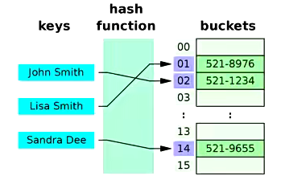

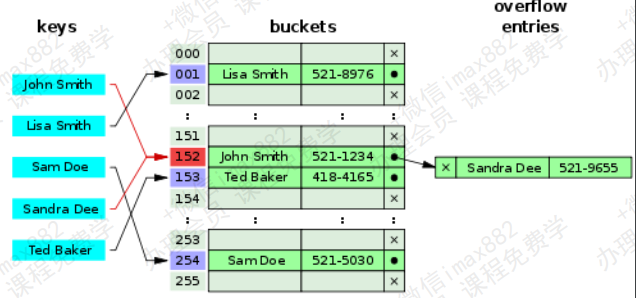

##### 案例一：公司员工存储

- **案例介绍：**
  - 假如一家公司有1000个员工，现在我们需要将这些员工的信息使用某种数据结构来保存起来
  - 你会采用什么数据结构呢？
- **方案一：数组**
  - 一种方案是按照顺序将所有的员工依次存入一个**长度为1000的数组**中。
  - **每个员工的信息都保存在数组的某个位置上。**
  - 但是我们要**查看某个具体员工的信息怎么办呢**？一个个找吗？不太好找。
  - **数组最大的优势是什么？**通过**下标值去获取信息。**
  - 所以为了可以通过数组快速定位到某个员工，最好给员工信息中添加一个**员工编号(工号)，**
    而编号对应的就是**员工的下标值。**
  - 当查找某个员工的信息时，通过**员工编号可以快速定位到员工的信息位置。**
- **方案二：链表**
  - 链表对应插入和删除数据有一定的优势。
  - 但是对于获取员工的信息，每次都必须从头遍历到尾，这种方式显然不是特别适合我们这里

- **最终方案：**
  - 这样看**最终方案似乎就是数组了**。但是数组还是有缺点，什么缺点呢？
  - 但是如果我们**只知道员工的姓名**，比如why，但是**不知道why的员工编号**，你怎么办呢？
- **只能线性查找？效率非常的低**
  - 能不能有一种办法，让**why的名字和它的员工编号**产生直接的关系呢？
  - 也就是通过why这个名字，我们就能**获取到它的索引值**，而再通过索引值我就能获取到why的信息呢？
  - 这样的方案已经存在了，就是使用哈希函数，让**某个key的信息和索引值对应起来**

##### 案例二：50000个单词的存储

- **案例介绍：**
  - 使用**一种数据结构存储单词信息**，比如有**50000个单词。**
  - 找到单词后**每个单词有自己的翻译&读音&应用**等等
- **方案一：数组？**
  - 这个案例**更加明显能感受到数组的缺陷。**
  - 我拿到一个单词 **Iridescent**，我想知道这个单词的**翻译/读音/应用。**
  - 怎么可以**从数组中查到这个单词的位置**呢？
  - 线性查找？50000次比较？
  - 如果你使用数组来实现这个功能，效率会非常非常低，而且你一定没有学习过数据结构。
- **方案二：链表？**
  - 不需要考虑了吧？
- 方案三：有没有一种方案，可以**将单词转成数组的下标值**呢？
  - 如果**单词转成数组的下标**，那么**以后我们要查找某个单词的信息**，直接**按照下标值一步即可访问到想要的元素。**

#### 字母转数字的方案一

- 似乎所有的案例都指向了一目标：**将字符串转成下标值**
- **但是，怎样才能将一个字符串转成数组的下标值呢？**
  - **单词/字符串**转**下标值**，其实就是**字母/文字转数字**
  - 怎么转？
- **现在我们需要设计一种方案，可以将单词转成适当的下标值：**
  - 其实计算机中有**很多的编码方案**就是用数字代替单词的字符。就是**字符编码**。(常见的字符编码？)
  - 比如**ASCII编码**：a是97，b是98，依次类推122代表z
  - 我们也可以设计一个**自己的编码系统**，比如**a是1，b是2，c是3，依次类推，z是26。**
  - 当然我们可以加上**空格用0代替**，就是**27个字符(不考虑大写问题)**
  - 但是，有了编码系统后，一个单词如何转成数字呢？

- **方案一：数字相加**
  - 一种转换单词的**简单方案**就是把单词每个字符的编码求和。
  - 例如单词**cats转成数字**：3+1+20+19=43，那么43就作为cats单词的下标存在数组中。
- **问题：按照这种方案有一个很明显的问题就是很多单词最终的下标可能都是43。**
  - 比如was/tin/give/tend/moan/tick等等。
  - 我们知道数组中**一个下标值**位置**只能存储一个数据**
  - 如果存入后来的数据，必然会造成**数据的覆盖。**
  - 一个下标存储这么多单词显然是**不合理**的。 
  - 虽然后面的方案也会出现，但是要尽量避免

#### 字母转数字的方案二

- **方案二：幂的连乘**
  - 现在，我们想通过一种算法，让cats转成数字后不那么普通。
  - 数字相加的方案就有些过于普通了。
  - 有一种方案就是使用幂的连乘，什么是幂的连乘呢？
  - 其实我们平时使用的大于10的数字，可以用一种幂的连乘来表示它的唯一性：
    比如：`7654 = 7*10³+6*10²+5*10+4`
  - 我们的单词也可以使用这种方案来表示：比如cats =
    `3*27³+1**27²+20*27+17= 60337`
  - 这样得到的数字可以**基本**保证它的**唯一性**，不会和别的单词重复。
-  **问题：如果一个单词是zzzzzzzzzz(一般英文单词不会超过10个字符)。那么得到数字超7000000000000。**
  - 数组可以表示**这么大的下标值**吗？
  - 而且就算**能创建这么大的数组，事实上有很多是无效的单词。**
  - **创建这么大的数组是没有意义的**

-  **两种方案总结：**
  - 第一种方案(把数字相加求和)产生的**数组下标太少。**
  - 第二种方案(与27的幂相乘求和)产生的**数组下标又太多。**

#### 下标的压缩算法

- **现在需要一种压缩方法，把幂的连乘方案系统中得到的巨大整数范围压缩到可接受的数组范围中。**
- **对于英文词典，多大的数组才合适呢？**
  - 如果**只有50000个单词**，可能**会定义一个长度为50000的数组。**
  - 但是实际情况中，往往需要**更大的空间**来存储这些单词。因为**我们不能保证单词会映射到每一个位置。**
  - 比如**两倍的大小：100000。**
- **如何压缩呢？**
  - 现在，就找一种方法，把0到超过7000000000000的范围，**压缩**为从0到100000。
  - 有一种简单的方法就是使用**取余操作符**，它的作用是得到一个数被另外一个数整除后的**余数。**

- **取余操作的实现：**
  - 为了看到这个方法如何工作，我们先来看一个**小点的数字范围**压缩到一个**小点的空间**中。
  - 假设把从0~199的数字，比如使用**largeNumber**代表，压缩为从0到9的数字，比如使用**smallRange**代表。
  - 下标值的结果：index = largeNumber % smallRange;
  - 当一个数被10整除时，余数一定在0~9之间;
  - 比如13%10=3，157%10=7。
  - 当然，这**中间还是会有重复，不过重复的数量明显变小了**。因为我们的数组是100000，而只有50000个单词。
  - 就好比，你在0~199中间选取5个数字，放在这个长度为10的数组中，也会重复，但是重复的概率非常小。(后面我们会讲到真的发生重复了应该怎么解决)

### 哈希表的一些概念

- **认识了上面的内容，相信你应该懂了哈希表的原理了，我们来看看几个概念：**
  - **哈希化：**将**大数字**转化成**数组范围内下标**的过程，我们就称之为**哈希化。**
  - **哈希函数**：通常我们会将**单词**转成**大数字**，**大数字**在进行**哈希化**的代码实现放在一个函数中，这个函数我们称为**哈希函数。**
  - **哈希表**：最终将数据插入到的这个**数组**，对整个**结构的封装**，我们就称之为是一个**哈希表。**


- **但是，我们还有问题需要解决：**
  - 虽然，我们在一个100000的数组中，放50000个单词已经足够。
  - 但是通过哈希化后的**下标值依然可能会 重复**，如何解决这种重复的问题呢？

#### 什么是冲突？

- **尽管50000个单词，我们使用了100000个位置来存储，并且通过一种相对比较好的哈希函数来完成。但**
  **是依然有可能会发生冲突。**
  - 比如melioration这个单词，通过哈希函数得到它数组的下标值后，发现那个位置上已经存在一个单词demystify
  - 因为它经过哈希化后和melioration得到的下标实现相同的。
- **这种情况我们称为冲突。**
- **虽然我们不希望这种情况发生，当然更希望每个下标对应一个数据项，但是通常这是不可能的。**
- **冲突不可避免，我们只能解决冲突**

- **就像之前0~199的数字选取5个放在长度为10的单元格中**
  - 如果我们随机选出来的是33，82，11，45，90，那么最终它们的位置会是3-2-1-5-0，没有发生冲突。
  - 但是如果其中有一个33，还有一个73呢？还是发生了冲突。
- **我们需要针对 这种冲突 提出一些解决方案**
  - 虽然冲突的**可能性比较小**，你依然需要**考虑到这种情况**
  - 以便发生的时候进行对应的**处理代码。**
- 如何解决这种冲突呢？常见的情况有**两种方案。**
  - **链地址法。**
  - **开放地址法。**

#### 链地址法

- **链地址法是一种比较常见的解决冲突的方案。(也称为拉链法)**
  - 其实，如果你理解了为什么产生冲突，看到图后就可以立马理解链地址法是什么含义了。

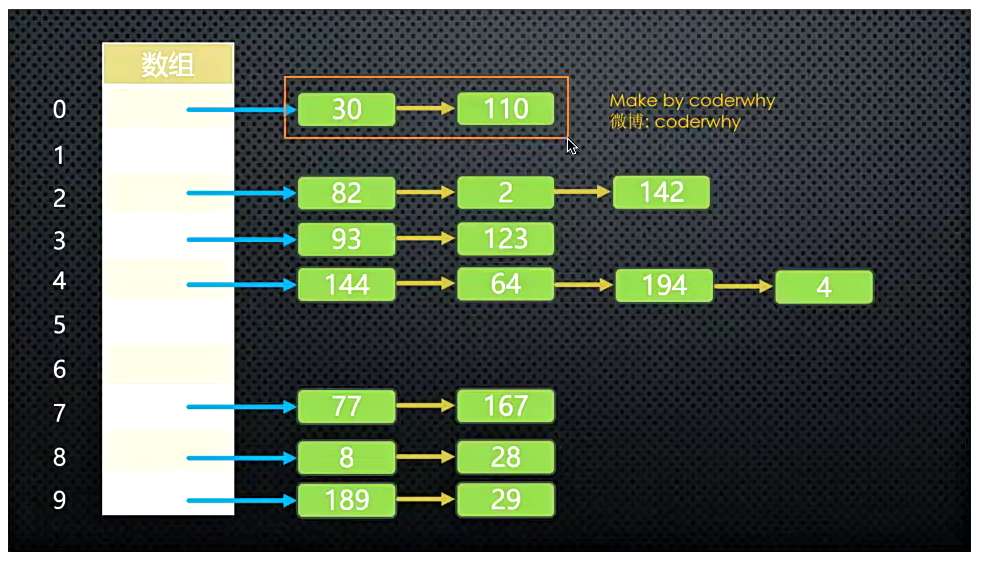

**链地址法解析：**

- **图片解析：**
  - 从图片中我们可以看出，链地址法解决冲突的办法是**每个数组单元**中存储的不再是**单个数据**，而是一个**链条。**
  - 这个链条使用什么数据结构呢？常见的是**数组或者链表。**
  - 比如是**链表**，也就是每个数组单元中存储着一个链表。一旦发现重复，将重复的元素插入到链表的首端或者末端即可。
  - 当查询时，先根据哈希化后的下标值找到对应的位置，再取出链表，依次查询找寻找的数据。
- **数组还是链表呢？**
  - 数组或者链表在这里其实都可以，**效率上也差不多。**
  - 因为根据哈希化的index找出这个数组或者链表时，通常就会使用**线性查找**，这个时候数组和链表的效率是差不多的。
  - 当然在某些实现中，会将新插入的数据放在**数组或者链表的最前面**，因为觉得**新插入的数据**用于**取出的可能性更大。**
  - **这种情况最好采用链表**，因为数组在首位插入数据是需要所有其他项后移的，链表就没有这样的问题。
  - 当然，我觉得出于这个也看**业务需求**，不见得新的数据就访问次数会更多：比如我们微信新添加的好友，可能是刚认识的，联系的频率不见得比我们的老朋友更多，甚至新加的只是聊一两句。
  - 所以，这里个人觉得选择**数组或者链表**都是可以的。

#### 开放地址法(了解)

- **开放地址法的主要工作方式是寻找空白的单元格来添加重复的数据。**
- **我们还是通过图片来了解开放地址法的工作方式。**

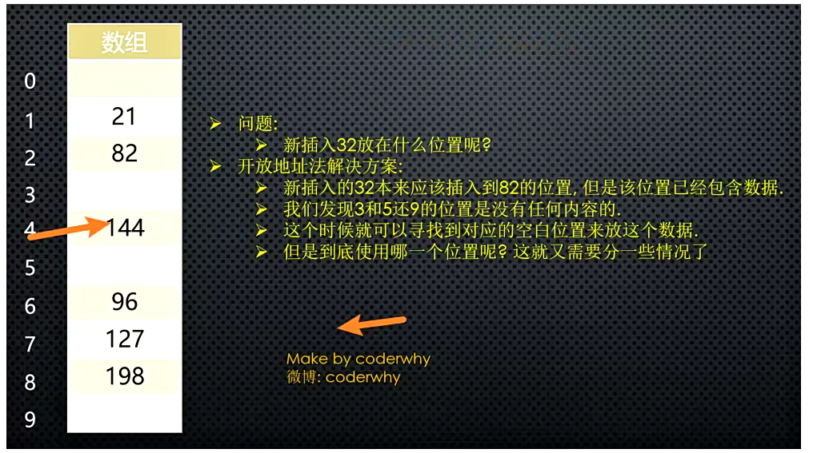

- 图片解析：
  - 从图片的文字中我们可以了解到
  - 开放地址法其实就是要**寻找空白的位置**来放置冲突的数据项。
- 但是探索这个位置的方式不同，有三种方法：
  - **线性探测**
    - 按当前位置+1，查找空白的位置，空的位置就是合适的位置，遇到空的位置就停止，然后添加进去
    - 问题
      - 删除操作和插入查询比较类似，但是也有一个**特别注意点。**
      - 注意：删除操作一个数据项时，**不可以**将这个位置下标的内容**设置为null**，为什么呢？
      - 因为将它设置为null可能会**影响我们之后查询其他操作**，所以通常**删除一个位置的数据项**时，我们可以**将它进行特殊处理**(比如设置为-1)。
      - 当我们之后看到-1位置的数据项时，就知道查询时要**继续查询，**但是插入时这个位置可以放置数据
    - **线性探测还有一个比较严重的问题，就是聚集。什么是聚集呢？**
      - 比如我在没有任何数据的时候，插入的是22-23-24-25-26，那么意味着下标值：2-3-4-5-6的位置都有元素。
      - 这种**一连串填充单元**就叫做**聚集。**
      - 聚集会影响哈希表的**性能**，无论是插入/查询/删除都会影响。
      - 比如我们插入一个32，会发现连续的单元都不允许我们放置数据，并且在这个过程中我们需要探索多次。
      - 二次探测可以解决一部分这个问题，我们一起来看一看
  - **二次探测** 
    - **二次探测在线性探测的基础上进行了优化：**
    - **线性探测**，我们可以看成是**步长为1**的探测，比如从下标值x开始，那么线性测试就是x+1，x+2，x+3依次探测。
    - **二次探测**，对步长做了优化，比如从下标值x开始，x+1²，x+2²，x+3²。
    - 这样就可以**一次性探测比较长的距离**，比避免那些聚集带来的影响。
    - 二次探测的问题：
      - 但是二次探测依然存在问题，比如我们连续插入的是32-112-82-2-192，那么它们依次累加的时候步长的相同的。
      - 也就是这种情况下会造成**步长不一样的一种聚集**。还是会影响效率。(当然这种可能性相对于**连续的数字**会小一些)
      - 怎么根本解决这个问题呢？让**每个人的步长不一样**，一起来看看**再哈希法吧。**
  - **再哈希法**
    - 为了消除线性探测和二次探测中无论步长+1还是步长+平法中存在的问题, 还有一种最常用的解决方案: **再哈希法.**
    - **再哈希法:**
      - 二次探测的算法产生的探测序列步长是固定的: 1, 4, 9, 16, 依次类推.
      - 现在需要一种方法: 产生一种**依赖关键字的探测序列**, 而不是每个关键字都一样.
      - 那么, **不同的关键字**即使映射到**相同的数组下标**, 也可以使用**不同的探测序列.**
      - 再哈希法的做法就是: 把关键字用另外一个哈希函数, **再做一次哈希化**, 用这次哈希化的**结果作为步长.**
      - 对于**指定的关键字**, **步长**在整个探测中是**不变**的, 不过**不同的关键字**使用**不同的步长.**
    - **第二次哈希化需要具备如下特点:**
      - 和**第一个哈希函数不同**. (不要再使用上一次的哈希函数了, 不然结果还是原来的位置)
      - **不能输出为0**(否则, 将没有步长. 每次探测都是原地踏步, 算法就进入了死循环)
    - **其实, 我们不用费脑细胞来设计了, 计算机专家已经设计出一种工作很好的哈希函数:**
      - **stepSize = constant - (key % constant)**
      - 其中constant是质数, 且小于数组的容量.
      - 例如: stepSize = 5 - (key % 5), 满足需求, 并且结果不可能为0.

#### 哈希化的效率

- **哈希表中执行插入和搜索操作效率是非常高的**
  - 如果**没有产生冲突**，那么效率就会更高。
  - 如果**发生冲突**，存取时间就依赖后来的探测长度。
  - 平均探测长度以及平均存取时间，取决于**填装因子**，随着填装因子变大，探测长度也越来越长。
  - 随着填装因子变大，效率下降的情况，在不同开放地址法方案中比链地址法更严重，所以我们来对比一下他们的效率，再决定我们选取的方案。
- **在分析效率之前，我们先了解一个概念：装填因子。**
  - 装填因子表示当前哈希表中已经**包含的数据项**和**整个哈希表长度**的**比值。**
  - **装填因子 = 总数据项 / 哈希表长度。**
  - **开放地址法的装填因子**最大是多少呢？**1**，因为它必须寻找到空白的单元才能将元素放入。
  - **链地址法的装填因子**呢？**可以大于1**，因为拉链法可以无限的延伸下去，只要你愿意。(当**然后面效率就变低了，一般大于0.75时需要进行扩容操作**)

- **链地址法相对来说效率是好于开放地址法的。**
- **所以在真实开发中，使用链地址法的情况较多**
  - 因为它不会因为添加了某元素后性能急剧下降。
  - 比如在Java的HashMap中使用的就是链地址法。

### 哈希函数

内部做的操作：

1.把一个字符串，映射成索引值

数字的操作：

1.幂的连乘

2.取余操作，得到索引值

- **讲了很久的哈希表理论知识，你有没有发现在整个过程中，一个非常重要的东西：哈希函数呢？**
- **好的哈希函数应该尽可能让计算的过程变得简单，提高计算的效率。**
  - 哈希表的主要**优点是它的速度**，所以在速度上不能满足，那么就达不到设计的目的了。
  - 提高速度的一个办法就是让哈希函数中**尽量少的有乘法和除法**。因为它们的**性能是比较**低的。
- **设计好的哈希函数应该具备哪些优点呢？**
  - **快速的计算**
    - 哈希表的优势就在于效率，所以快速获取到对应的hashCode非常重要。
    - 我们需要通过快速的计算来获取到元素对应的hashCode
  - **均匀的分布**
    - 哈希表中，无论是链地址法还是开放地址法，当多个元素映射到同一个位置的时候，都会影响效率。
    - 所以，优秀的哈希函数应该尽可能将元素映射到不同的位置，让元素在哈希表中均匀的分布。

**提高哈希性能方法:**

#### 快速计算：霍纳法则

- **在前面，我们计算哈希值的时候使用的方式**
  - cats = `3*27³+1*27²+20*27+17= 60337`
- **这种方式是直观的计算结果，那么这种计算方式会进行几次乘法几次加法呢？**
  - 当然，我们可能不止4项，可能有更多项
  - 我们抽象一下，这个表达式其实是一个多项式：
  - `a(n)x^n+a(n-1)x^(n-1)+…+a(1)x+a(0)`
- 现在问题就变成了多项式**有多少次乘法和加法：**
  - 乘法次数：`n＋(n－1)＋…＋1＝n(n+1)/2`
  - 加法次数：n次
  - O(N²)

- 多项式的优化：**霍纳法则**
  - 解决这类求值问题的高效算法--**霍纳法则**。在中国，霍纳法则也被称为**秦九韶算法。**
- **通过如下变换我们可以得到一种快得多的算法，即**
  - `Pn(x)= anx^n+a(n－1)x^(n-1)+…+a1x+a0=((…(((anx +an－1)x+an－2)x+ an－3)…)x+a1)x+a0，`
  - 这种求值的方式我们称为**霍纳法则。**
- **变换后，我们需要多少次乘法，多少次加法呢？**
  - 乘法次数：N次
  - 加法次数：N次。
- **如果使用大O表示时间复杂度的话，我们直接从O(N²)降到了O(N)。**

#### 均匀分布

- 均匀的分布
  - 在设计哈希表时，我们已经有办法处理**映射到相同下标值**的情况：链地址法或者开放地址法。
  - 但是无论哪种方案，为了提供效率，最好的情况还是让数据在哈希表中**均匀分布。**
  - 因此，我们需要在**使用常量的地方**，尽量**使用质数。**
  - 哪些地方我们会使用到常量呢？
- **质数的使用：**
  - **哈希表的长度。**
  - **N次幂的底数(我们之前使用的是27)**
- 为什么他们使用质数，会让哈希表分布更加均匀呢？
  - 质数和其他数相乘的结果相比于其他数字更容易产生唯一性的结果，减少哈希冲突。
    - Java中的N次幂的底数选择的是31，是经过长期观察分布结果得出的；

#### N次幂的底数

- **这里采用质数的原因是为了产生的数据不按照某种规律递增。**
  - 比如我们这里有一组数据是按照4进行递增的：0 4 8 12 16，将其映射到长度为8的哈希表中。
  - 它们的位置是多少呢？0 - 4 - 0 - 4，依次类推。
  - 如果我们哈希表本身不是质数，而我们递增的数量可以使用质数，比如5，那么 0 5 10 15 20
  - 它们的位置是多少呢？0 - 5 - 2 - 7 - 4，依次类推。也可以尽量让数据均匀的分布。
  - 我们之前使用的是27，这次可以使用一个接近的数，比如31/37/41等等。一个比较常用的数是31或37。
- **总之，质数是一个非常神奇的数字。**
- **这里建议两处都使用质数：**
  - 哈希表中数组的长度。
  - N次幂的底数。

### 哈希表的实现

**实现思路:**

- 1.把需要储存的key映射成一个大数字，并把大数字**哈希化成数组index下标值(哈希函数)**
  - 利用霍纳计算取幂次方，在取余数
- 2.准备一个**空数组storage**，利用下标值storage[index]进行值的**储存为一个个[ [key, value] ]形式**
- 3.如果生成的**下标值重复**，产生冲突，**使用链地址法进行值的储存[ [ [key,value], [key, value] ] ]**
- 4.如果内部的key重复，那么执行覆盖操作，如果没有那么添加
- 5.优化
  - 装填因子大于0.75时，进行扩容，小于0.25进行缩容
  - 哈希表中数组的长度和 N次幂的底数尽量使用质数

#### 1.哈希函数的实现

```typescript
function hashFunc(str: string, max: number) {
  //1.初始化hashcode
  let hashCode = 0;
  //霍纳计算，计算hashCode的值
  for (let i = 0; i < str.length; i++) {
    hashCode = 31 * hashCode + str.charCodeAt(i);
  }
  //通过取模计算索引值
  let index = hashCode % max;
  return index;
}

console.log(hashFunc("abc", 7));
console.log(hashFunc("kkk", 7));
console.log(hashFunc("nba", 7));

export default hashFunc;

```

#### 2.哈希表的实现

```typescript
// 质数的特点：
// 质数也称为素数。
//  质数表示大于1的自然数中，只能被1和自己整除的数

class hashTable<T = any> {
  //储存数据
  storage: [string, T][][] = [];
  //目前存放的数据
  private count: number = 0;
  //数组的最大长度
  private length: number = 7;

  //判断是否为质数
  private isPrime(num: number) {
    for (let i = 2; i < num; i++) {
      if (num % i === 0) {
        return false;
      }
    }

    return true;
  }

  //扩容/缩容操作
  private resize(newLimit: number) {
    let newPrime = newLimit;
    while (!this.isPrime(newPrime)) {
      newPrime++;
    }
    //1.重置数据
    const oldStorage = this.storage;
    this.length = newPrime;
    this.storage = [];
    this.count = 0;
    //对老数据进行遍历，进行重新添加操作
    oldStorage.forEach((bucket) => {
      if (!bucket) return;
      for (let i = 0; i < bucket.length; i++) {
        const tuple = bucket[i];
        this.put(tuple[0], tuple[1]);
      }
    });
  }

  //哈希函数，获取index
  private getIndex(str: string, max: number) {
    //1.初始化hashcode
    let hashCode = 0;
    //霍纳计算，计算hashCode的值
    for (let i = 0; i < str.length; i++) {
      hashCode = 31 * hashCode + str.charCodeAt(i);
    }
    //通过取模计算索引值
    let index = hashCode % max;
    return index;
  }

  //put 放入数据和修改数据
  put(key: string, value: T) {
    //1.根据key获取index
    const index = this.getIndex(key, this.length);
    //根据索引获当前位置数据
    let bucket = this.storage[index];

    // 2.第一次bucket可以为undefined，需要创建数组
    if (!bucket) {
      bucket = [];
      this.storage[index] = bucket;
    }

    //3.对bucket里面数据进行遍历，判断key是否重复，如果重复进行修改操作
    //如果bucket里面length为0不会执行
    let isCover = false;
    for (let i = 0; i < bucket.length; i++) {
      const tuple = bucket[i];
      const tupleKey = tuple[0];
      if (tupleKey === key) {
        tuple[1] = value;

        isCover = true;
      }
    }
    //4.依然没有覆盖，则进行添加操作
    if (!isCover) {
      bucket.push([key, value]);
      this.count++;
      //数组扩容
      if (this.count / this.length > 0.75) {
        this.resize(this.length * 2);
      }
    }
  }

  //get 获取key 获取数据
  get(key: string): T | undefined {
    //1.根据key获取idnex
    const index = this.getIndex(key, this.length);

    //2.根据idnex获取bucket
    let bucket = this.storage[index];

    //3.进行遍历判断key是否相等
    for (let i = 0; i < bucket.length; i++) {
      const tuple = bucket[i];
      const tupleKey = tuple[0];

      if (tupleKey === key) {
        return tuple[1];
      }
    }
    return undefined;
  }

  //delete根据key删除
  delete(key: string) {
    const index = this.getIndex(key, this.length);

    const bucket = this.storage[index];
    if (!bucket) return undefined;

    for (let i = 0; i < bucket.length; i++) {
      const tuple = bucket[i];
      const tupleKey = tuple[0];
      if (tupleKey === key) {
        bucket.splice(i, 1);
        this.count--;
        //数组缩小容量
        if (this.count / this.length < 0.25 && this.length > 8) {
          this.resize(Math.floor(this.length / 2));
        }

        return tuple[1];
      }
    }
  }
}

const hashtable = new hashTable();

hashtable.put("abc", 111);
hashtable.put("mba", 222);
// hashtable.put("pnm", 3333);
// hashtable.put("lll", 3333);
// hashtable.put("iii", 3333);
// hashtable.put("ppp", 3333);
// // hashtable.put("ccc", 3333);

// console.log(hashtable.storage);
// console.log(hashtable.get("abc"));
// console.log(hashtable.get("pnm"));
// console.log(hashtable.get("ddd"));
// console.log(hashtable.get("ccc"));
// console.log(hashtable.delete("abc"));
// console.log(hashtable.delete("pnm"));
console.log(hashtable.storage);
export {};

```

## 树结构（Tree）

### 树的优点

- 我们之前已经学习了多种数据结构来保存数据，为什么要**使用树结构**来保存数据呢？
- **树结构和数组/链表/哈希表的对比有什么优点呢？**

**数组：**

- **优点：**
  - 数组的主要优点是根据**下标值访问**效率会很高。
  - 但是如果我们希望根据元素来查找对应的位置呢？
  - 比较好的方式是先对数组进行**排序**，再进行**二分查找。**
- **缺点：**
  - 需要先对数组进行**排序，**生成**有序数组**，才能提高查找效率。
  - 另外数组在插入和删除数据时，需要有大量的**位移操作**(插入到首位或者中间位置的时候)，效率很低。

**链表：**

- **优点：**
  - 链表的插入和删除操作效率都很高。
- **缺点：**
  - **查找**效率很低，需要从头开始依次访问链表中的每个数据项，直到找到。
  - 而且即使插入和删除操作效率很高，但是如果要插入和删除中间位置的数据，还是需要重头
    先找到对应的数据。

**哈希表：**

- **优点：**
  - 我们学过哈希表后，已经发现了哈希表的插入/查询/删除效率都是非常高的。
  - 但是哈希表也有很多缺点。
- **缺点：**
  - **空间利用率不高**，底层使用的是数组，并且某些单元是没有被利用的。
  - 哈希表中的元素是**无序**的，不能按照固定的顺序来遍历哈希表中的元素。
  - 不能快速的找出哈希表中的**最大值或者最小值**这些特殊的值。

- **树结构：**
  - 我们不能说树结构比其他结构都要好，因为**每种数据结构都有自己特定的应用场景**
  - 但是**树确实也综合了上面的数据结构的优点**(当然优点不足于盖过其他数据结构，比如效率一般情况下没有哈希表高)。
  - 并且**也弥补了上面数据结构的缺点。**

- **而且为了模拟某些场景，我们使用树结构会更加方便。**
  - 因为数结构的非线性的，可以表示**一对多**的关系
  - 比如**文件的目录结构。**

### 树的术语

- **在描述树的各个部分的时候有很多术语。**
  - 为了让介绍的内容更容易理解，需要知道一些**树的术语。**
  - 不过大部分术语都与真实世界的**树相关**，或者和**家庭关系相关**(如父节点和子节点)，所以它们比较容易理解

.png)


- **树（Tree）：n（n≥0）个节点构成的有限集合。**
  - 当n=0时，称为空树；

- **对于任一棵非空树（n> 0），它具备以下性质：**
  - 树中有一个称为“**根（Root）**”的特殊节点，用 **r** 表示；
  - 其余节点可分为m(m>0)个互不相交的有限集T1，T2，..。，Tm，其中每个集合本身又是一棵树，称为原来树的"**子树（SubTree）**"

**树的术语：**

.png)

- **1.节点的度（Degree）**：节点的**子树个数**。
- **2.树的度 （Degree）** ：树的所有节点中**最大的度数(最多子节点的个数)。**
- **3.叶节点（Leaf）**：**度为0的节点**。(也称为**叶子节点**)
- **4.父节点（Parent）**：有子树的节点是其子树的根节点的父节点
- **5.子节点（Child）**：若A节点是B节点的父节点，则称B节点是A节点的子节点；子节点也称孩子节点。
-  **6.兄弟节点（Sibling）**：具有同一父节点的各节点彼此是兄弟节点。
- **7.路径和路径长度**：从节点n1到nk的路径为一个节点序列n1 ，n2，… ，nk
  - ni是 n(i+1)的父节点
  - 路径所包含 边 的个数为路径的长度。
- **8.节点的层次（Level**）：规定**根节点在1层**，其它任一节点的层数是其父节点的**层数加1。**
- **9.树的深度（Depth）**：对于任意节点n, n的深度为从根到n的唯一路径长，根的深度为0**（从上到下每层+1）。**
- **10.树的高度（Height）**：对于任意节点n,n的高度为从n到一片树叶的最长路径长，所有树叶的高度为0**(从下到上每层+1)**

### 儿子-兄弟表示法旋转

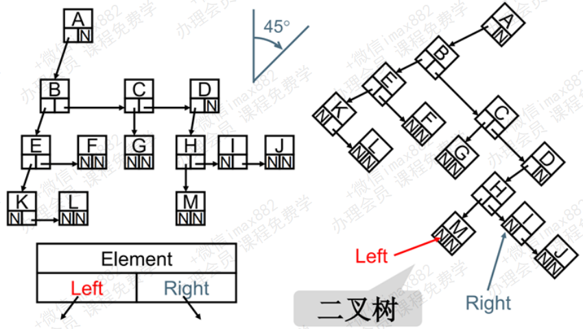

> 其实所有的树本质上都可以使用二叉树模拟出来。
> 所以在学习树的过程中，二叉树非常重要。

### 二叉树的概念

- 如果树中每个节点**最多只能有两个子节点**，这样的树就成为**"二叉树"。**
  - 前面，我们已经提过二叉树的重要性，不仅仅是因为简单，也因为几乎上所有的树都可以表示成二叉树的形式。
- **二叉树的定义**
  - 二叉树**可以为空**，也就是**没有节点**。
  - 若**不为空**，则它是**由根节点** 和 称为其 **左子树TL**和 **右子树TR** 的两个不相交的二叉树组成。
- **二叉树有五种形态：**

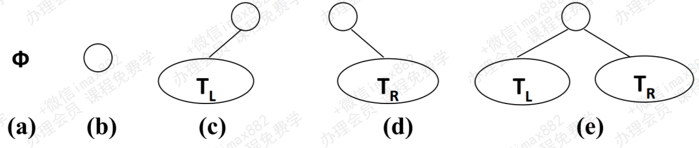

#### 二叉树的特性

- **二叉树有几个比较重要的特性，在笔试题中比较常见：**
  - 一颗二叉树**第 i 层的最大节点数**为：2^(i-1)，i >= 1;
  - 深度**为k的二叉树有最大节点总数**为： 2^k - 1，k >= 1;
  - 对**任何非空二叉树 T**，若n0表示叶节点的个数、n2是度为2的非叶节点个数，那么两者满足关系n0 = n2 + 1。

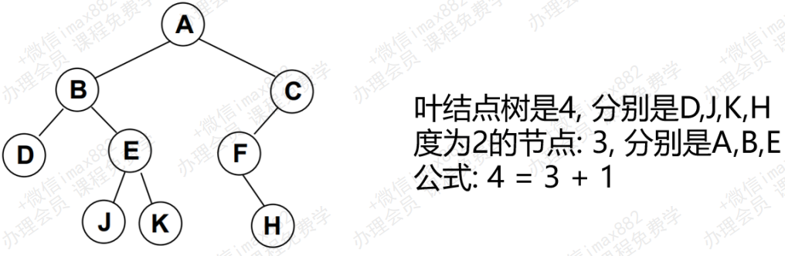

#### 完美二叉树

- **完美二叉树(Perfect Binary Tree) ，也称为满二叉树(Full Binary Tree）**
  - 在二叉树中，除了**最下一层的叶节点外，每层节点都有2个子节点**，就构成了**满二叉树。**

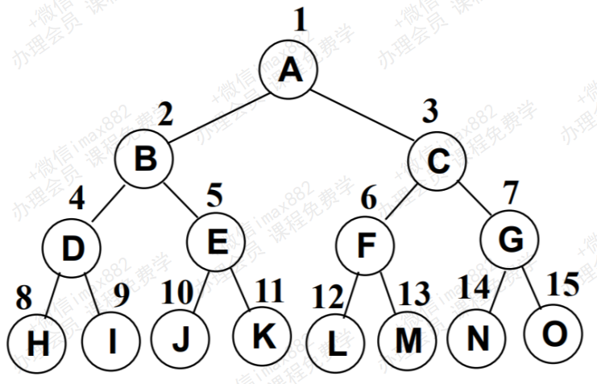

#### 完全二叉树

- **完全二叉树(Complete Binary Tree)**
  - 除**二叉树最后一层外，其他各层的节点数都达到最大个数。**
  - 且**最后一层从左向右的叶节点连续存在，只缺右侧若干节点。**
  - **完美二叉树**是**特殊的完全二叉树。**
- **下面不是完全二叉树，因为D节点还没有右节点，但是E节点就有了左右节点。**

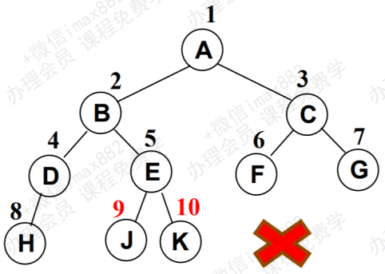

> 最后一层子节点是连续存在的，不能突然在某处缺少

#### 二叉树的存储

- **二叉树的存储常见的方式是数组和链表。**

**使用数组**:

- **完全二叉树**：按从上至下、从左到右顺序存储

  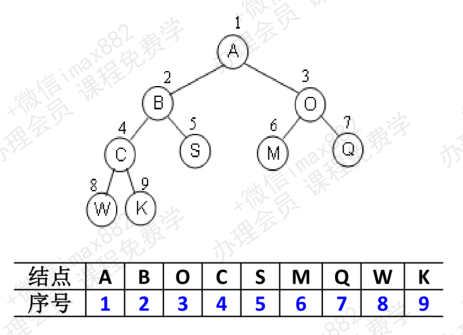

- **非完全二叉树：**
  - 非完全二叉树要转成完全二叉树才可以按照上面的方案存储。
  - 但是会造成很大的空间浪费

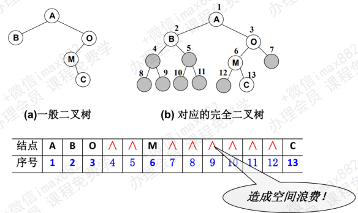

**链表存储:**

- **二叉树最常见的方式还是使用链表存储。**
  - **每个节点封装成一个Node**，Node中**包含存储的数据，左节点的引用，右节点的引用**

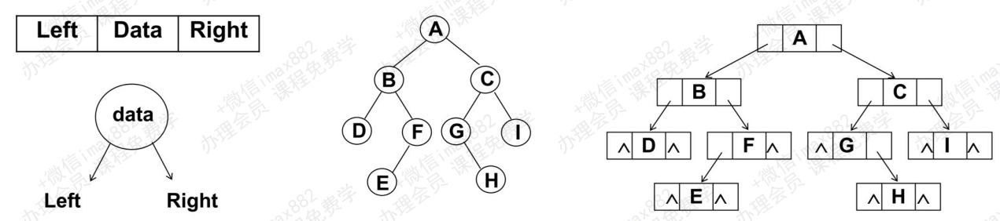

#### 什么是二叉搜索树？

- **二叉搜索树（BST，Binary Search Tree），也称二叉排序树或二叉查找树**

- **二叉搜索树是一颗二叉树，可以为空；**

- **如果不为空，满足以下性质：**

  - 非空左子树的所有键值小于其根节点的键值。
  - 非空右子树的所有键值大于其根节点的键值。
  - 左、右子树本身也都是二叉搜索树。

- **下面哪些是二叉搜索树，哪些不是？**

  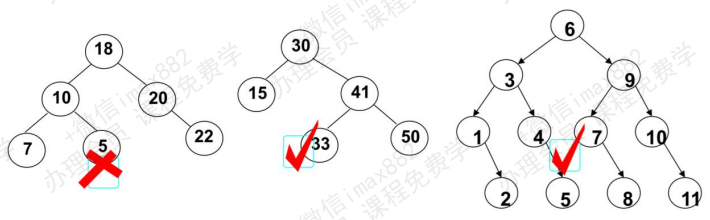

- **二叉搜索树的特点：**

  - 二叉搜索树的特点就是相对**较小的值**总是保存在**左节点**上，相对**较大的值**总是保存在**右节点**上。
  - 那么利用这个特点，我们可以做什么事情呢？
  - 查找效率非常高，这也是**二叉搜索树**中，**搜索的来源**

- **这样的数据结构有什么好处呢？**
  
  - 我们试着**查找一下值为10的节点**
- **这种方式就是二分查找的思想**
  - **查找所需的最大次数**等于**二叉搜索树的深度；**
  - **插入节点**时，也**利用类似的方法，一层层比较大小，找到新节点合适的位置。**

### 二叉搜索树的封装

- **我们像封装其他数据结构一样，先来封装一个BSTree的类**

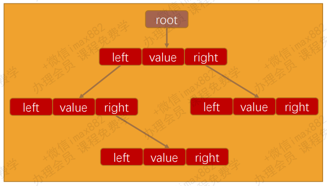

```typescript
class Node<T> {
  value: T;
  left: Node<T> | null = null;
  right: Node<T> | null = null;

  constructor(value: T) {
    this.value = value;
  }
}

class BSTree<T = number> {
  root: Node<T> | null = null;

  //二叉其他方法
}

export {};

```

代码解析:

- 封装BSTree的类；

- 还需要封装一个用于保存每一个节点的类Node。
- 该类包含三个属性：节点对应的value，指向的左子树left，指向的右子树right
- 对于BSTree来说，只需要保存根节点即可，因为其他节点都可以通过根节点找到

#### 二叉搜索树常见操作

- **二叉搜索树有哪些常见的操作呢？**
- **插入操作：**
  - **insert(value)**：向树中插入一个新的数据。
- 查找操作：
  - **search(value)**：在树中查找一个数据，如果节点存在，则返回true；如果不存在，则返回false。
  - **min**：返回树中最小的值/数据。
  - **max**：返回树中最大的值/数据。
- 遍历操作：
  - **inOrderTraverse**：通过中序遍历方式遍历所有节点。
  - **preOrderTraverse**：通过先序遍历方式遍历所有节点。
  - **postOrderTraverse**：通过后序遍历方式遍历所有节点。
  - **levelOrderTraverse**：通过层序遍历方式遍历所有节点。
- **删除操作（有一点点复杂）：**
  - **remove(value)**：从树中移除某个数据

#### 遍历二叉搜索树

- **前面，我们向树中插入了很多的数据，为了能很多的看到测试结果。我们先来学习一下树的遍历。**
  - 注意：这里我们学习的树的遍历，**针对所有的二叉树**都是适用的，**不仅仅是二叉搜索树**。

- **树的遍历：**
  - 遍历一棵树是指访问**树的每个节点**(也可以对每个节点进行某些操作，我们这里就是简单的打印)
  - 但是树和线性结构不太一样，线性结构我们通常按照**从前到后的顺序遍历**，但是树呢？
  - 应该从树的顶端还是底端开始呢？ 从左开始还是从右开始呢？
- 二叉树的遍历常见的有**四种方式：**
  - 先序遍历(**根节点先进行遍历，左右随便**)
  - 中序遍历（**根节点放在中间遍历，左右随便**)）
  - 后序遍历。(**根节点放在最后遍历，左右随便**)
  - 层序遍历(**从根节点开始，一层一层的遍历，可以利用队列结构**)

#### 二叉搜索树的删除

- 我们先从查找要删除的节点入手
  - 1> 先找到要删除的节点，如果没有找到，不需要删除
  - 2> 找到要删除节点
    - **1) 删除叶子节点**
    - **2) 删除只有一个子节点的节点**
    - **3) 删除有两个子节点的节点**

- **情况一：没有子节点：**
  - 这种情况相对比较简单，我们需要检测current的left以及right是否都为null.
  - 都为null之后还要检测一个东西，就是是否current就是根，都为null，并且为跟根，那么相当于要清空叉树(当然，只是清空了根，因为只有它).
  - 否则就把父节点的left或者right字段设置为null即可.
  - 如果只有一个单独的根，直接删除即可

- **情况二：一个子节点：**
  - 这种情况也不是很难.
  - 要删除的current节点，只有2个连接(如果有两个子节点，就是三个连接了)，一个连接父节点，一个连接唯一的子节点.
  - 需要从这三者之间：爷爷 - 自己 - 儿子，将自己(current)剪短，让爷爷直接连接儿子即可.
  - 这个过程要求改变父节点的left或者right，指向要删除节点的子节点.
  - 当然，在这个过程中还要考虑是否current就是根.

- **情况三：两个子节点：**
  - **如果我们要删除的节点有两个子节点，甚至子节点还有子节点，这种情况下我们需要从下面的子节点中找到一个节点，来替换当前的节点.**
  - **但是找到的这个节点有什么特征呢？ 应该是current节点下面所有节点中最接近current节点的**
    - 要么**比current节点小一点点**，要么**比current节点大一点点。**
    - 总之你**最接近current**，你就可以用来**替换current的位置.**
  - **这个节点怎么找呢？**
    - 比current**小一点点的节点**，一定是current**左子树的最大值。**
    - 比current**大一点点的节点**，一定是current**右子树的最小值。**
  - **前驱&后继**
    - 在二叉搜索树中，这两个特别的节点，有两个**特别的名字。**
    -  比current小一点点的节点，称为current节点的**前驱。**
    - 比current大一点点的节点，称为current节点的**后继。**
  - **也就是为了能够删除有两个子节点的current，要么找到它的前驱，要么找到它的后继。**
  - **所以，接下来，我们先找到这样的节点(前驱或者后继都可以，这里以找后继为例)**

```typescript
import { btPrint } from "hy-algokit";

class TreeNode<T> {
  value: T;
  left: TreeNode<T> | null = null;
  right: TreeNode<T> | null = null;
  parent: TreeNode<T> | null = null;
  constructor(value: T) {
    this.value = value;
  }
  //判断是否是左节点
  get isLeft() {
    return this.parent && this.parent.left === this;
  }
  //判断是否是左节点
  get isRight() {
    return this.parent && this.parent.right === this;
  }
}

class BSTree<T = number> {
  private root: TreeNode<T> | null = null;

  //二叉树其他方法
  //遍历树的方法
  print() {
    btPrint(this.root);
  }
  private searchNode(value: T) {
    //1.找到要搜索的节点
    let current = this.root;
    //父节点
    let parent: TreeNode<T> | null = null;

    while (current) {
      //判断value是否相等，相等则返回
      if (current?.value === value) {
        return current;
      }
      //记录父节点
      parent = current;
      //向左右节点进行查找
      if (current.value < value) {
        current = current.right;
      } else {
        current = current.left;
      }
      //对parent属性进行赋值
      if (current) current.parent = parent;
    }
    return current;
  }

  //插入非根节点 TreeNode:插入到那个节点  newTreeNode插入节点名称操作
  private insertTreeNode(TreeNode: TreeNode<T>, newTreeNode: TreeNode<T>) {
    //向左子树插入
    if (newTreeNode.value < TreeNode.value) {
      //左子树没有内容直接赋值
      if (TreeNode.left === null) {
        TreeNode.left = newTreeNode;
      } else {
        //如果左子树有内容，我们进行递归操作，传递给左子树的子节点
        this.insertTreeNode(TreeNode.left, newTreeNode);
      }
    } else {
      // 右子树操作
      //如果有子树没有值，添加值
      if (TreeNode.right === null) {
        TreeNode.right = newTreeNode;
      } else {
        //如果有值，进行递归
        this.insertTreeNode(TreeNode.right, newTreeNode);
      }
    }
  }
  //插入 insert
  insert(value: T) {
    //1.常见新节点
    const newTreeNode = new TreeNode(value);

    //2.判断是否有根节点
    if (!this.root) {
      this.root = newTreeNode;
    } else {
      this.insertTreeNode(this.root, newTreeNode);
    }
  }
  //遍历操作
  //前/中/后之间的区别，在于root遍历的位置不一样
  //先序遍历

  preOredertraverse() {
    this.preOredertraverseNode(this.root);
  }
  private preOredertraverseNode(node: TreeNode<T> | null) {
    if (node) {
      console.log(node.value);
      this.preOredertraverseNode(node.left);
      this.preOredertraverseNode(node.right);
    }
  }

  //中序遍历
  inOredertraverse() {
    this.inOredertraverseNode(this.root);
  }
  private inOredertraverseNode(node: TreeNode<T> | null) {
    if (node) {
      this.inOredertraverseNode(node.left);
      console.log(node.value);
      this.inOredertraverseNode(node.right);
    }
  }

  //后序遍历
  postOredertraverse() {
    this.postOredertraverseNode(this.root);
  }
  private postOredertraverseNode(node: TreeNode<T> | null) {
    if (node) {
      this.postOredertraverseNode(node.left);
      this.postOredertraverseNode(node.right);
      console.log(node.value);
    }
  }

  //层序遍历
  //利用队列结构进行实现
  levelOrderTraverse() {
    //没有根节点之间返回
    if (!this.root) return;

    //创建队列结构，利用先进先出特点
    const queue: TreeNode<T>[] = [];
    queue.push(this.root!);
    //只有队列中有值，进行循环
    while (queue.length !== 0) {
      //拿到第一个元素，返回打印
      const current = queue.shift();
      console.log(current?.value);
      //如果有left，添加进队列中
      if (current?.left !== null) {
        queue.push(current!.left);
      }
      //如果有right，添加进队列中
      if (current?.right !== null) {
        queue.push(current!.right);
      }
    }
  }

  //最大值/最小值，最大值在右边，最小值在左边
  getMinValue() {
    let current = this.root;
    while (current && current.left) {
      current = current.left;
    }
    return current?.value;
  }
  getMaxValue() {
    let current = this.root;
    while (current && current.right) {
      current = current.right;
    }
    return current?.value;
  }

  //search搜索特定的值,返回布尔值
  search(value: T) {
    return !!this.searchNode(value);
  }

  /**
   * 二叉树的删除
   * 三种情况
   *  先找到要删除的节点，如果没有找到，不需要删除
◼ 2> 找到要删除节点
     1) 删除叶子节点
     2) 删除只有一个子节点的节点
     3) 删除有两个子节点的节点 
   * 
   */
  /*
   有获取后继节点
   比current小一点点的节点，称为current节点的前驱。
   比current大一点点的节点，称为current节点的后继
   */
  private getSuccesor(delNode: TreeNode<T>) {
    //后继节点的获取需要往右边找，在往左边找，获取最小值，放在要删除节点的位置
    //获取右子树
    let current = delNode.right;
    //记录后继节点
    let successor: TreeNode<T> | null = null;

    while (current) {
      successor = current;
      current = current.left;
      //给succ的parent赋值
      if (current) {
        current.parent = successor;
      }
    }

    //特殊情况 当successor刚好等于当前节点的右节点时，不需要为succsor的右节点进行赋值
      //只有当不等于右节点时，才需要进行操作
    if (successor !== delNode.right) {
      //我们的succesor节点可能还会有右子节点，右子节点是比succ节点大的，所以我们也需要把对这个节点进行处理
        //把它放在succ父节点的左边
      successor!.parent!.left = successor!.right ?? null;
      successor!.right = delNode.right;
    }

    //一定要进行的操作，将删除节点的left赋值给后继节点的left
    successor!.left = delNode!.left;

    return successor;
  }

  remove(value: T): boolean {
    let current = this.searchNode(value);

    if (!current) return false;

    //2.获取到三个东西：当前节点/父节点/是属于父节点的左子节点，还是右子节点
    //2.如果删除的是叶子节点
    if (current?.left === null && current.right === null) {
      //如果是叶子节点那么left和right都为null
      //根节点
      if (current === this.root) {
        this.root = null;
      } else if (current!.isLeft) {
        //判断是否为左节点
        current!.parent!.left = null;
      } else {
        //右节点
        current!.parent!.right = null;
      }
    }
    //3.只有一个子节点，并且只有左子节点
    else if (current.right === null) {
      if (current === this.root) {
        this.root = current.left;
      } else if (current.isLeft) {
        current.parent!.left = current.left;
      } else {
        current.parent!.right = current.left;
      }
    }
    //3.只有一个子节点，并且只有右子节点
    else if (current.left === null) {
      if (current === this.root) {
        this.root = current.right;
      } else if (current.isLeft) {
        current.parent!.left = current.right;
      } else {
        current.parent!.right = current.right;
      }
    }

    //4.有二个子节点的情况
    else {
      const successor = this.getSuccesor(current);

      if (current === this.root) {
        this.root = successor;
      } else if (current!.isLeft) {
        current!.parent!.left = successor;
      } else {
        current!.parent!.right = successor;
      }
    }
    return true;
  }
}

const bst = new BSTree();

bst.insert(11);
bst.insert(7);
bst.insert(15);
bst.insert(5);
bst.insert(3);
bst.insert(9);
bst.insert(8);
bst.insert(10);
bst.insert(13);
bst.insert(12);
bst.insert(14);
bst.insert(20);
bst.insert(18);
bst.insert(25);
bst.insert(6);

bst.print();
// bst.preOredertraverse();
// bst.inOredertraverse();
// bst.postOredertraverse();
// bst.levelOrderTraverse();
// console.log(bst.getMaxValue());
// console.log(bst.getMinValue());
// console.log(bst.search(8));
// console.log(bst.search(10));
// console.log(bst.search(13));
// console.log(bst.search(30));

// bst.remove(3);
// bst.remove(10);
// bst.remove(14);
// bst.print();
// bst.remove(13);
// bst.print();
// bst.remove(9);
// bst.print();

bst.remove(20);
bst.print();

export {};

```

### 二叉搜索树的缺陷

- **二叉搜索树作为数据存储的结构由重要的优势：**
  - 可以**快速地**找到给定关键字的数据项 并且可以快速地**插入和删除数据项**。

- **但是，二叉搜索树有一个很麻烦的问题：**
  - 如果插入的数据是**有序的数据**，比如下面的情况
  - 有一棵初始化为 9 8 12 的二叉树
  - 插入下面的数据：7 6 5 4 3
- **非平衡树：**
  - 比较好的二叉搜索树数据应该是**左右分布均匀**的
  - 但是插入**连续数据**后，**分布的不均匀**，我称这种树为**非平衡树。**
  - 对于一棵**平衡二叉树**来说，插入/查找等操作的效率是**O(logN)**
  - 对于一棵**非平衡二叉树**，相当于编写了一个链表，查找效率变成了**O(N)**

### 树的平衡性

- **为了能以较快的时间O(logN)来操作一棵树，我们需要保证树总是平衡的：**
  - 至少大部分是平衡的，那么时间复杂度也是接近O(logN)的
    - 也就是说树中**每个节点左边的子孙节点**的个数，应该尽可能的等于右边的子孙节点的个数。
  - 常见的平衡树有哪些呢？
- **AVL树：**
  - AVL树是最早的一种平衡树。它有些办法保持**树的平衡**(每个节点多存储了一个额外的数据)
  - 因为AVL树是**平衡的**，所以时间复杂度也是O(logN)。
  - 但是，每次插入/删除操作相对于红黑树效率都不高，所以**整体效率不如红黑树**
- **红黑树：**
  - 红黑树也通过**一些特性**来保持树的平衡。
  - 因为是平衡树，所以时间复杂度也是在O(logN)。
  - 另外插入/删除等操作，红黑树的性能要优于AVL树，所以现在平衡树的应用基本都是红黑树

## 图结构

- 在计算机程序设计中，**图结构** 也是一种非常常见的数据结构。
  - 但是，**图论**其实是一个非常大的话题
  - 我们通过本章的学习来认识一下关于图的一些内容 - 图的抽象数据类型 – 一些算法实现。
- **什么是图?**
  - 图结构是一种与**树结构**有些相似的数据结构。
  - **图论**是**数学**的一个分支，并且，在数学的概念上，**树是图的一种。**
  - 它以图为研究对象，研究 **顶点** 和 **边** 组成的**图形的数学理论和方法。**
  - 主要研究的目的是**事物之间的关系，顶点**代表**事物，边**代表两个事物间的**关系**
- **我们知道树可以用来模拟很多现实的数据结构**
  - 比如： **家谱/公司组织架构**等等
  - 那么图长什么样子?
  - 或者什么样的数据使用图来模拟更合适呢?

### 图的现实案例

- **人与人之间的关系网。**
  -  甚至科学家们在观察人与人之间的关系网时，还发现了**六度空间理论。**
- **六度空间理论**
  - 理论上认为世界上任何两个互相不认识的两人。
  - 只需要很少的中间人就可以建立起联系。
  - 并非一定要经过6步，只是需要很少的步骤


- **那么，什么是图呢?**
  - 我们会发现，上面的**节点**(其实图中叫**顶点Vertex**)之间的关系，是不能使用树来表示
  - 使用**任何的树结构**都不可以模拟。
  - 这个时候，我们就可以使用图来模拟它们。
- 图通常有什么特点呢?
  - **一组顶点**：通常用 V (Vertex) 表示顶点的集合
  - 一组边：通常用 E (Edge) 表示边的集合
    - 边是顶点和顶点之间的连线
    - 边可以是有向的，也可以是无向的。
    - 比如A --- B，通常表示无向。 A --> B，通常表示有向

### 历史故事

- **18世纪著名古典数学问题之一。**
  - 在哥尼斯堡的一个公园里，**有七座桥将普雷格尔河中两个岛及岛与河岸连接起来**
  - 有人提出问题： 一个人怎样才能不重复、不遗漏地一次走完七座桥，最后回到出发点。
- **1735年，有几名大学生写信给当时正在俄罗斯的彼得斯堡科学院任职的瑞典天才数学家欧拉，请他帮忙解决这一问题。**
  - 欧拉在亲自观察了哥伦斯堡的七桥后，认真思考走法，但是始终没有成功，于是他怀疑七桥问题是不是无解的。
  - 1736年29岁的欧拉向 **彼得斯堡** 科学院递交了《哥尼斯堡的七座桥》的论文，在解答问题的同时，开创了数学的一个新的分支——**图论与几何拓扑**，也由此展开了数学史上的新历程

**欧拉解答:**

- **他不仅解决了该问题，并且给出了 连通图 可以一笔画的充要条件是：**
  - **奇点的数目不是0个就是2 个**
  - 连到一点的**边的数目**如果是**奇数条**，就称为奇点
  - 如果是**偶数条**就称为偶点
  - 要想一笔画成，必须中间点均是偶点
  - 也就是有**来路必有另一条去路，奇点只可能在两端，因此任何图能一笔画成，奇点要么没有要么在两端**
- **个人思考：**
  - 欧拉在思考这个问题的时候，并不是针对某一个特性的问题去考虑，而是将**岛和桥抽象成了点和线。**
  - 抽象是**数学的本质**，而编程我们也一再强调抽象的重要性。
  - 汇编语言是对机器语言的抽象，高级语言是对汇编语言的抽象。
  - 操作系统是对硬件的抽象，应用程序在操作系统的基础上构建

### 图的术语(见上图)

- **关于术语的概述**
  - 我们在学习树的时候，树有很多的**相关术语。**
  - 了解这些术语有助于我们更好的**理解树结构。**
- 我们也来学习一下**图相关的术语。**
  - 但是图的术语其实**非常多**，如果你找一本专门讲图的各个方面的书籍，会发现 **只是术语** 就可以 占据满满的一个章节。
  - 这里，我们先介绍几个**比较常见的术语**，某些术语后面用到的时候，再了解。
  - 没有用到的，在自行深入学习的过程中，可以通过查资料去了解。
- **我们先来看一个抽象出来的图**
  - 用**数字**更容易我们从整体来**观察整个图结构**

- **顶点**：
  - 顶点刚才我们已经介绍过了，表示图中的一个**节点。**
  - 比如地铁站中**某个站/多个村庄中的某个村庄/互联网中的某台主机/人际关系中的人。**
- 边：
  - 边刚才我们也介绍过了，表示**顶点和顶点**之间的**连线。**
  - 比如地铁站中**两个站点之间**的直接连线，就是一个边。
  - 注意： 这里的边不要叫做路径，路径有其他的概念，待会儿我们会介绍到。
  - 之前的图中： 0 - 1有一条边，1 - 2有一条边，0 - 2没有边。
- **相邻顶点：**
  - 由一条边连接在一起的顶点称为**相邻顶点。**
  - 比如0 - 1是相邻的，0 - 3是相邻的。 0 - 2是不相邻的。

- **度：**
  - 一个顶点的度是**相邻顶点的数量**。
  - 比如0顶点和其他两个顶点相连，0顶点的度是2
  - 比如1顶点和其他四个顶点相连，1顶点的度是4
- **路径**：
  - 路径是**顶点v1，v2...，vn的一个连续序列**，比如上图中0 1 5 9就是一条路径。
  - **简单路径**： 简单路径要求不包含重复的顶点。 比如 0 1 5 9是一条简单路径。
  - **回路**： 第一个顶点和最后一个顶点**相同**的路径称为回路。 比如 0 1 5 6 3 0

- **无向图：**
  - 上面的图就是一张无向图，因为**所有的边都没有方向。**
  - 比如 0 - 1之间有变，那么说明这条边可以保证 0 ->1，也可以保证 1 -> 0。
- **有向图：**
  - 有向图表示的**图中的边是有方向的。**
  - 比如 0 -> 1，不能保证一定可以 1 -> 0，要根据方向来定

- **无权图：**
  - 我们上面的图就是**一张无权图**(边没有携带权重)
  - 我们上面的图中的边是**没有任何意义**的
  - 不能说 0 - 1的边，比4 - 9的边更远或者用的时间更长。
- **带权图：**
  - 带权图表示**边有一定的权重**。
  - 这里的权重可以是**任意你希望表示的数据：**
    - **比如距离或者花费的时间或者票价。**

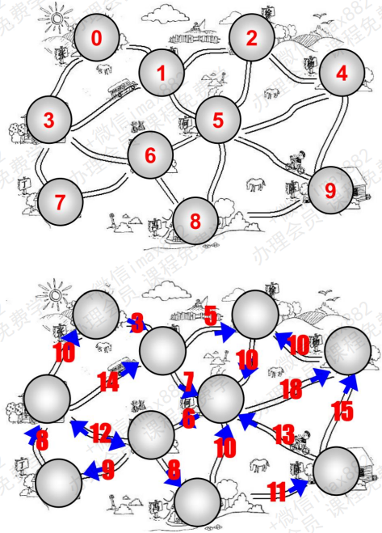

### 图的表示

- **怎么在程序中表示图呢?**
  - 我们知道一个图包含**很多顶点**，另外包含**顶点和顶点之间的连线(边)**
  - 这两个都是非常重要的**图信息**，因此都需要在程序中**体现出来。**
- **顶点的表示**相对简单，我们先讨论顶点的表示。
  - 上面的顶点，我们**抽象成了1 2 3 4**，也可以**抽象成A B C D。**
  - 在后面的案例中，我们使用A B C D。
  - 那么这些A B C D我们可以使用一个**数组**来存储起来(存储所有的顶点)
  - 当然，A，B，C，D也可以表示其他含义的数据(比如村庄的名字).
- **那么边怎么表示呢?**
  - 因为边是**两个顶点之间的关系**，所以**表示起来会稍微麻烦一些。**
  - 下面，我们具体讨论一下常见的**表示方式**

#### 邻接矩阵

- 一种比较常见的表示图的方式： **邻接矩阵。**
  - 邻接矩阵让**每个节点和一个整数项关联，该整数作为数组的下标值。**
  - 我们用一个**二维数组来表示顶点之间的连接。**
  - 二维数组 [0][2] -> A -> C
- **画图演示：**
- 图片解析：
  - 在二维数组中，**0表示没有连线，1表示有连线**。
  - 通过二维数组，我们可以很快的找到**一个顶点和哪些顶点有连线**。(比如A顶点，只需要遍历第一行即可)
  - 另外，A - A，B - B(也就是顶点到自己的连线)，通常使用0表示。
- **邻接矩阵的问题：**
  - 邻接矩阵还有一个比较严重的问题，就是如果图是一个**稀疏图**
  - 那么矩阵中将存在**大量的0**，这意味着我们**浪费了计算机存储空间来表示根本不存在的边**

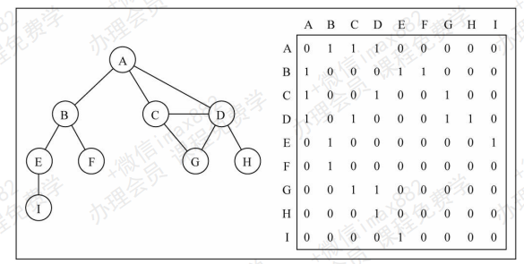

#### 邻接表

- 另外一种常用的表示图的方式： **邻接表**。
  - 邻接表由图中**每个顶点以及和顶点相邻的顶点列表**组成。
  - 这个列表有很多种方式来存储： **数组/链表/字典(哈希表)**都可以。
- **画图演示**
- 图片解析：
  - 其实图片比较容易理解。
  -  比如我们要表示和**A顶点有关联的顶点**(边)，**A和B/C/D有边，**
  - 那么我们可以通过A找到对应的数组/链表/字典，再取出其中的内容就可以啦。
- **邻接表的问题：**
  - 邻接表计算"**出度**"是比较简单的(出度： 指向别人的数量，入度： 指向自己的数量)
  - 邻接表如果需要计算有向图的"**入度**"，那么是一件非常麻烦的事情。
  - 它必须构造一个“**逆邻接表**”，才能有效的计算“入度”。但是开发中“**入度**”相对用的比较少。

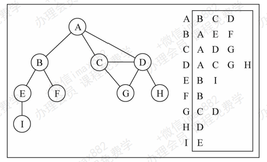

### 类的实现

```typescript
class Graph<T> {
  /**
   * vertexes： 用于存储所有的顶点,我们说过使用一个数组来保存。
✓ adjList： adj是adjoin的缩写,邻接的意思。 adjList用于存储所有的边,我们这里采用邻接表的形式
   */
  vertexes: T[] = [];
  adjList: Map<T, T[]> = new Map();

  //添加顶点
  addVertex(V: T) {
    this.vertexes.push(V);
    this.adjList.set(V, []);
  }
  //添加边
  addEdge(v1: T, v2: T) {
    this.adjList.get(v1)?.push(v2);
    this.adjList.get(v2)?.push(v1);
  }

  //打印
  traverse() {
    this.vertexes.forEach((vertex) => {
      const adjList = this.adjList.get(vertex);
      console.log(`${vertex}-> ${adjList?.join(" ")}`);
    });
  }

  //图的遍历
  //bfs广度优先
  /*
 广度优先算法会从指定的第一个顶点开始遍历图，先访问其所有的相邻点，就像一次访问图的一层。
 换句话说，就是先宽后深的访问顶点，类似树结构的层序遍历
*/
  bfs() {
    //1.判断vertex中是否有值
    if (this.vertexes.length === 0) return;

    //2.创建队列结构，利用先进先出的特性，一层一层进行遍历
    const queue: T[] = [];
    queue.push(this.vertexes[0]);

    //3.利用set判断当前节点是否遍历过
    const visted = new Set();
    visted.add(this.vertexes[0]);

    //4.进行遍历
    while (queue.length) {
      //取第一个
      const vertex = queue.shift()!;
      console.log(vertex);
      //拿到边
      const neighbors = this.adjList.get(vertex);
      if (!neighbors) continue;
      for (const nei of neighbors) {
        if (!visted.has(nei)) {
          visted.add(nei);

          queue.push(nei);
        }
      }
    }
  }

  /*  
    深度优先搜索算法将会从第一个指定的顶点开始遍历图，沿着路径知道这条路径最后被访问了。
   接着原路回退并探索下一条路径。
  广度优先搜索算法我们使用的是队列，这里可以使用栈
   完成，也可以使用递归
  **/
  dfs() {
    const stack: T[] = [];
    stack.push(this.vertexes[0]);

    const visted = new Set();
    visted.add(this.vertexes[0]);

    while (stack.length) {
      const vertex = stack.pop()!;
      console.log(vertex);

      const neighbors = this.adjList.get(vertex);
      if (!neighbors) continue;
      for (let i = neighbors.length - 1; i >= 0; i--) {
        const nei = neighbors[i];

        if (!visted.has(nei)) {
          visted.add(nei);
          stack.push(nei);
        }
      }
    }
  }
}

const graph = new Graph();

graph.addVertex("A");
graph.addVertex("B");
graph.addVertex("C");
graph.addVertex("D");
graph.addVertex("E");
graph.addVertex("F");
graph.addVertex("G");
graph.addVertex("H");
graph.addVertex("I");

graph.addEdge("A", "B");
graph.addEdge("A", "C");
graph.addEdge("A", "D");
graph.addEdge("C", "D");
graph.addEdge("C", "G");
graph.addEdge("D", "G");
graph.addEdge("D", "H");
graph.addEdge("B", "E");
graph.addEdge("B", "F");
graph.addEdge("E", "I");

// graph.traverse();
// graph.bfs();
graph.dfs();
```

#### 广度优先搜索

- **广度优先搜索算法的思路：**
  - 广度优先算法会从指定的第一个顶点开始遍历图，先访问其所有的相邻点，就像一次访问图的一层。
  - 换句话说，就是先宽后深的访问顶点
  - 利用队列

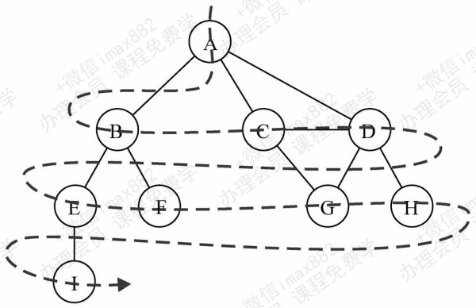

#### 深度优先搜索

- 深度优先搜索的思路：
  - 优先搜索算法将会从第一个指定的顶点开遍历图，沿着路径知道这条路径最后被访问了。
  - 接着原路回退并探索下一条路径。

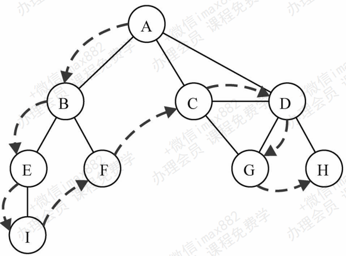

- 深度优先搜索算法的实现：
  - 广度优先搜索算法我们使用的是队列，这里可以使用栈完成，也可以使用递归。
  - 方便代码书写，我们还是使用递归(递归本质上就是函数栈的调用)

### 图的建模

- **对交通流量建模**
  - 顶点可以**表示街道的十字路口，边可以表示街道**。
  - **加权的边**可以表示**限速**或者**车道的数量或者街道的距离。**
  - 建模人员可以用这个系统**来判定最佳路线以及最可能堵车的街道。**
- **对飞机航线建模**
  - 航空公司**可以用图来为其飞行系统建模。**
  - 将**每个机场看成顶点**，将**经过两个顶点的每条航线看作一条边。**
  - **加权的边**可以**表示从一个机场到另一个机场的航班成本，或两个机场间的距离。**
  - 建模人员可以利用这个系统**有效的判断从一个城市到另一个城市的最小航行成本。**

## 堆结构(Heap)

### 什么是堆（Heap）结构？

- **堆是也是一种非常常见的数据结构，但是相对于前面的数据结构来说，要稍微难理解一点。**
  - **堆的本质是一种特殊的树形数据结构，使用完全二叉树来实现：**
    - 堆可以进行**很多分类**，但是平时使用的**基本都是二叉堆；**
    -  二叉堆又可以划分为**最大堆和最小堆；**
- **最大堆和最小堆：**
  - 最小堆：堆中每一个节点都**小于等于（<=）**它的子节点；
  - 最大堆：堆中每一个节点都**大于等于（>=）**它的子节点

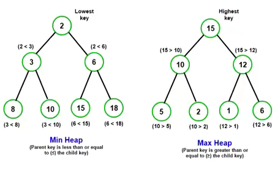

### 为什么需要堆（Heap）结构？

- **但是这个堆东西有什么意义呢？**
  - 对于每一个新的数据结构，我们都需要搞清楚**为什么需要它**，这是我们能够**记住并且把握它的关键。**
  - 它到底**帮助我们解决了什么问题**？
- 如果有一个集合，我们希望获取其中的**最大值或者最小值**，有哪些方案呢？
  - **数组/链表**：获取最大或最小值是O(n)级别的；
    - 可以进行排序，但是我们只是获取最大值或者最小值而已
    - 排序本身就会消耗性能；
  - **哈希表**：不需要考虑了；
  - **二叉搜索树**：获取最大或最小值是O(logn)级别的；
    - 但是二叉搜索树操作较为复杂，并且还要维护树的平衡时才是O(logn)级别；
- 这个时候需要一种数据结构来解决这个问题，就是**堆结构。**

### 认识堆（Heap）结构

- **堆结构通常是用来解决Top K问题的：**
  - Top K问题是指在一组数据中，找出最前面的K个最大/最小的元素；
  - 常用的解决方案有使用排序算法、快速选择算法、堆结构等；
-  **但是我们还是不知道具体长什么样子，以及它是如何实现出来的：**
  - 二叉堆用树形结构表示出来是**一颗完全二叉树；**
  - 通常在实现的时候我们底层会**使用数组来实现；**
- **每个节点在数组中对应的索引i（index）有如下的规律：**
  - 如果 **i = 0** ，它是**根**节点；
  - 父节点的公式：**Math.floor( (n/ 2)  - 1 )**
  - 左子节点：**2i + 1**
  - 右子节点：**2i + 2**

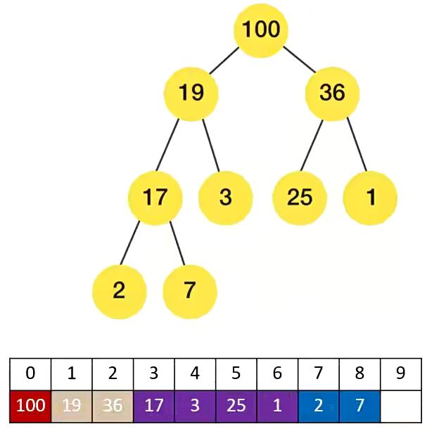

### 堆结构的设计

- **接下来，让我们对堆结构进行设计，看看需要有哪些属性和方法。**
- **常见的属性：**
  - **data**：存储堆中的元素，通常使用数组来实现。
  - **size**：堆中当前元素的数量。
- **常见的方法：**
  - **insert(value)**：在堆中插入一个新元素。
  - **extract/delete()**：从堆中删除最大/最小元素。
  - **peek()**：返回堆中的最大/最小元素。
  - **isEmpty()**：判断堆是否为空。
  - **build_heap(list)**：通过一个列表来构造堆。

```typescript
import { cbtPrint } from "hy-algokit";

class Heap<T> {
  private data: T[] = [];

  private size: number = 0;

  //通过索引交换位置，实现过滤操作
  private swap(i: number, j: number) {
    const temp = this.data[i];
    this.data[i] = this.data[j];
    this.data[j] = temp;
  }

  print() {
    cbtPrint(this.data);
  }

  //：在堆中插入一个新元素。
  insert(value: T) {
    //在数组尾部添加元素
    this.data.push(value);
    this.size++;
    this.heap_up();
  }
  private heap_up() {
    //2.对添加元素，进行上滤操作
    //2.1拿到添加元素索引
    let index = this.size - 1;

    while (index > 0) {
      //2.2根据索引拿到当前节点父节点(非叶子节点)索引
      let parentIndex = Math.floor(((n/2) - 1);

      //2.3根据索引拿到对应的值，如果添加的值>父节点，那么进行值的交换操作
      if (this.data[index] <= this.data[parentIndex]) {
        break;
      }
      //2.4进行位置转换
      this.swap(index, parentIndex);
      //下标改变，可以再次进行过滤操作
      index = parentIndex;
    }
  }

  //删除最大/最小元素
  extract() {
    //1.没有元素或者元素为1的情况
    if (this.size === 0) return null;
    if (this.size === 1) {
      this.size--;
      return this.data.pop();
    }

    //2.获取想要删除的元素
    const max = this.data[0];
    //将最后一个节点等于第一个节点，后面使用下滤操作，实现堆
    //这样可以保证，叶子节点任然是完全二叉树
    this.data[0] = this.data.pop()!;
    this.size--;
    this.heap_down(0);
    return max;
  }

  private heap_down(idx: number) {
    //记录第一个节点下标
    let index = idx;
      //左子节点大于size时停止循环，因为index一直进行赋值的，如果找到最后就会是最后一个元素的下标
    while (2 * index + 1 < this.size) {
      //记录左子节点和右子节点下标
      let leftChildIndex = 2 * index + 1;
      let rightChildIndex = leftChildIndex + 1;

      //记录左右子节点最大的值
      let larageIndex = leftChildIndex;

      if (
        rightChildIndex < this.size &&
        this.data[leftChildIndex] < this.data[rightChildIndex]
      ) {
        larageIndex = rightChildIndex;
      }
      //如果父节点>子节点，则不进行进行操作，否则，进行换位操作
      if (this.data[index] > this.data[larageIndex]) {
        break;
      }

      this.swap(index, larageIndex);

      index = larageIndex;
    }
  }

  //返回堆中最大/最小元素
  peek() {
    return this.data[0];
  }
  //判断是否为空
  isEmpty() {
    return this.data.length === 0;
  }
  //通过一个列表创建堆
  buildHeap(arr: T[]) {
    this.data = arr;
    this.size = arr.length;
    //找到叶子节点的父节点，进行下滤操作
    const start = Math.floor((this.size - 1) / 2);
    for (let i = start; i >= 0; i--) {
      this.heap_down(i);
    }
  }
}

const arr = [19, 100, 36, 17, 3, 25, 1, 2, 7];

const heap = new Heap();

// for (let item of arr) {
//   heap.insert(item);
// }

// for (let item of arr) {
//   console.log(heap.extract());
// }
heap.buildHeap([19, 100, 36, 17, 3, 25, 1, 2, 7]);

heap.print();

export {};

```

> 这里实现的是最大堆，如果要实现最小堆，需要把小的值提到最前面，也就是把新的值 < 子节点时不交换位置

- **如果你想实现一个最大堆，那么可以从实现“insert”方法开始。**
  - 因为每次插入元素后，需要对堆进行重构，以维护最大堆的性质。
  - 这种策略叫做**上滤（percolate up， percolate [ˈpɜːkəleɪt] 是过滤的意思**
- **删除操作也需要考虑在删除元素后的操作：**
  - 因为每次删除元素后，需要对堆进行重构，以维护最大堆的性质。
  - 这种向下替换元素的策略叫作**下滤（percolate down）**
- **这种原地建堆的方式，我们称之为自下而上的下滤。也可以使用自上而下的上滤，但是效率较低**


**数据结构可视化：**

- https://www.cs.usfca.edu/~galles/visualization/Algorithms.html(加利福尼亚N的l旧金山大
- https://visualgo.net/en/heap?slide=1
- http://btv.melezinek.cz/binary-heap.html
  


## 平衡二叉树(AVL树——红黑树)

### 平衡树(Balaanced Tree)

- **平衡树（Balanced Tree）是一种特殊的二叉搜索树：**
  - 其目的是通过一些**特殊的技巧来维护树的高度平衡；**
  - 从而保证**树的搜索、插入、删除等操作的时间复杂度都较低；**
- **为什么需要平衡树呢？**
  - 如果一棵树**退化成链状结构**，那么**搜索、插入、删除等操作的时间复杂度**就会达到最**坏情况，即O(n)**，因此不能满足要求。
  - 平衡树通过**不断调整树的结构**，使得**树的高度尽量平衡，从而保证搜索、插入、删除等操作的时间复杂度都较低**，通常为O(logn)。
  - 因此，如果我们**需要高效地处理大量的数据**，那么**平衡树**就显得非常重要了。
- **平衡树的应用非常广泛，如索引、内存管理、图形学等领域均有广泛使用。**

### **如何让树可以更加平衡呢？**

- **方式一：限制插入、删除的节点（比如在树特性的状态下，不允许插入或者删除某些节点，不现实）**
- **方式二：在随机插入或者删除元素后，通过某种方式观察树是否平衡，如果不平衡通过特定的方式（比如旋转），让树保持平衡**

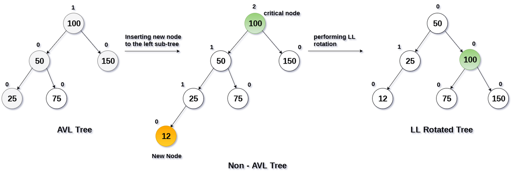

### **常见的平衡二叉搜索树**

- **常见的平衡二叉搜索树有哪些呢？**
  - **AVL树**：这是一种最早的平衡二叉搜索树，在1962年由G.M.Adelson-Velsky7和E.M.Landis发明。
  - **红黑树**：这是一种比较流行的平衡二叉搜索树，由R.Bayer在1972年发明。
  - **Splay树**：这是一种动态平衡二叉搜索树，通过旋转操作对树进行平衡。
  - **Treap**:这是一种随机化的平衡二叉搜索树，是**二叉搜索树和堆**的结合。
  - **B-树**：这是一种适用于磁盘或其他外存存储设备的多路平衡查找树。
- **这些平衡二叉搜索树都用于保证搜索树的平衡**，**从而在插入、删除、查找操作时保证了较低的时间复杂度。**
- **红黑树和AVL树是应用最广泛的平衡二叉搜索树：**
  - 红黑树：红黑树被广泛应用于实现诸如操作系统内核、数据库、编译器等软件中的数据结构，其原因在于它在插入、删除、
    查找操作时都具有较低的时间复杂度。
  - AVL树：AVL树被用于实现各种需要**高效查询的数据结构**，如计算机图形学、数学计算和计算机科学研究中的一些特定算法。

### **AVL树**

- **AVL树(Adelson-elsky and Landis Tree)是由G.M.Adelson-Velsky和E.M.Landis在1962年发明的**
  - 它是一种**自(Self)平衡二叉搜索树。**
  - 它是二叉搜索树的一个变体，在保证二叉搜索树性质的同时，通过**旋转操作保证树的平衡**
- **在AVL树中，每个节点都有一个权值，该权值代表了以该节点为根节点的子树的高度差。**
  - 在AVL树中，**任意节点的权值只有1或-1或0**，因此AVL树**也被称为高度平衡树**。
  - 对于每个节点，它的左子树和右子树的高度差不超过1。
  - 这使得AVL树具有比普通的二叉搜索树更高的查询效率。
  - 当插入或删除节点时，AVL树可以通过旋转操作来重新平衡树，从而保证其平衡性。
- **AVL树的插入和删除操作与普通的二叉搜索树类似，但是在插入或者删除之后，需要继续保持树的平衡。**
  - AVL树需要通过**旋转操作**来维护平衡。
  - 有四种情况旋转操作：左左情况、右右情况、左右情况和右左情况双旋。
  - 具体使用哪一种旋转，要根据不同的情况来进行区分和判断。
- **由于AVL树具有自平衡性，因此其最坏情况下的时间复杂度仅O(logn)。**

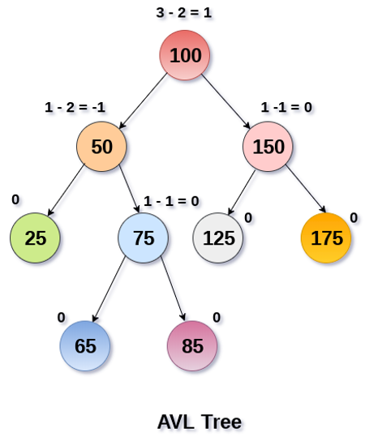

#### AVL树的旋转情况:

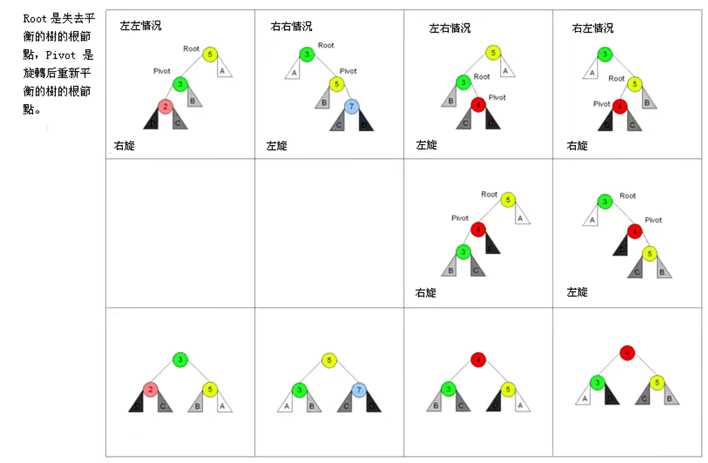

- **如何对AVL树进行旋转呢？**
- **首先，我们需要先找到失衡的节点：**
  - 失衡的节点称之为grandParent
  - 失衡节点的儿子（更高的儿子）称之为parent
  - 失衡节点的孙子（更高的孙子）称之为current
- **如果从grandParent到current的是：**
  - LL：左左情况，那么右旋转；
  - RR：右右情况，那么左旋转；
  - LR：左右情况，那么先对**parent（pivot轴心）**进行左旋转，再对**grandParent(root整体)**进行右旋转；
  - RL：右左情况，那么先对**parent（pivot轴心）**进行右旋转，再对**grandParent(root整体)**进行左旋转

### AVL树结构的封装过程

- 步骤一：学习AVL树节点的封装；
- 步骤二：学习AVL树的旋转情况；
- 步骤三：写出不同情况下进行的不同旋转操作；
- 步骤四：写出插入操作后，树的再平衡操作；
- 步骤五：写出删除操作后，树的再平衡操作；

#### **AVLTreeNode** **–** **节点的封装**

```typescript
//需要继承二叉搜索树，实现树结构
import BSTree from "./00-二叉搜索树的封装";
class AVLTreeNode<T> extends BSTree {
  left: AVLTreeNode<T> | null = null;
  right: AVLTreeNode<T> | null = null;
  parent: AVLTreeNode<T> | null = null;
  //记录树的高度
  height: number = 1;

  //获取树的高度
  private getHeight(): number {
    const leftHeight = this.left ? this.left.getHeight() : 0;
    const rightHeight = this.right ? this.right.getHeight() : 0;

    return Math.max(leftHeight, rightHeight) + 1;
  }

  //根据树的高度计算树的平衡因子，left-right 值只能是 -1, 0 , 1
  //如果是其他值，就要进行旋转操作
  public getBalanceFactor() {
    const leftHeight = this.left ? this.left.getHeight() : 0;
    const rightHeight = this.right ? this.right.getHeight() : 0;
    return leftHeight - rightHeight;
  }
  //判断当前是否平衡
  public get isBalance(): boolean {
    const balanceFactor = this.getBalanceFactor();

    return balanceFactor <= 1 && balanceFactor >= -1;
  }

  //获取更高的子节点,决定树怎么旋转，可以判断是左边不平衡还是右边不平衡
  public get heigherChild(): AVLTreeNode<T> | null {
    const leftHeight = this.left ? this.left.getHeight() : 0;
    const rightHeight = this.right ? this.right.getHeight() : 0;
    if (leftHeight > rightHeight) return this.left;
    if (leftHeight < rightHeight) return this.right;
    //高度一样返回同方向节点
    return this.left ? this.left : this.right;
  }
}

const AVLTree = new AVLTreeNode(10);
AVLTree.right = new AVLTreeNode(15);
AVLTree.right.right = new AVLTreeNode(20);

console.log(AVLTree.right.right.getHeight());
// console.log(AVLTree.right.isBalance);
console.log(AVLTree.heigherChild);

```

#### 右旋转左旋转

```typescript
  //右旋转的操作
   rightRotation() {
    const isLeft = this.isLeft;
    const isRight = this.isRight;

    //1.获取当前节点的轴心,进行操作,这里的this是root
    const pivot = this.left!;
    pivot.parent = this.parent;

    //2.对轴心的右子节点进行操作,让它放在root上
    this.left = pivot.right;
    if (pivot.left) {
      pivot.left.parent = this;
    }

    //3.把pivot设置为root的父节点
    pivot.right = this;
    this.parent = pivot;

    //4.判断是否右父节点
    if (!pivot.parent) {
      //pivot为根节点情况
      return pivot;
    } else if (isLeft) {
      // pivot为根节点的左节点情况
      pivot.parent.left = pivot;
    } else if (isRight) {
      // pivot为根节点的右节点情况
      pivot.parent.right = pivot;
    }

    return pivot;
  }
  //左旋转操作
   leftRotation() {
    const isLeft = this.isLeft;
    const isRight = this.isRight;
    //1.获取轴心
    const pivot = this.right!;
    pivot.parent = this.parent;

    //2.对轴心上的节点进行操作，放在this上
    this.right = pivot.left;
    if (pivot.left) {
      pivot.parent = this;
    }

    //3.把pivot设置为this父节点
    pivot.left = this;
    this.parent = pivot;

    //4.判断是否右父节点
    if (!pivot.parent) {
      //pivot为根节点情况
      return pivot;
    } else if (isLeft) {
      // pivot为根节点的左节点情况
      pivot.parent.left = pivot;
    } else if (isRight) {
      // pivot为根节点的右节点情况
      pivot.parent.right = pivot;
    }

    return pivot;
  }
```

> 实现核心就是获取pivot轴心，把轴心变成当前子节点的根节点即可

#### AVLTree的实现

```typescript

import { TreeNode } from "./00-二叉搜索树的封装";
import BSTree from "./00-二叉搜索树的封装";
import AVLTreeNode from "./01-AVlTreeNode的封装";

class AVLTree<T> extends BSTree<T> {
  //重现父类的方法
  protected creatNode(value: T): TreeNode<T> {
    return new AVLTreeNode(value);
  }

  //如何获取不平衡的节点
  //重新父类方法
  protected checkBalance(node: AVLTreeNode<T>): void {
    let current = node.parent;
    while (current) {
      if (!current.isBalance) {
        this.rebalance(current);
      }
      current = current.parent;
    }
  }
  //获取不平衡的节点，进行平衡操作
  rebalance(root: AVLTreeNode<T>) {
    //获取当前传入node最高的节点，也就是轴心，用来对轴心后的节点进行旋转
    const pivot = root.heigherChild!;
    //轴心的子节点，用于判断是左节点还是右节点
    const current = pivot?.heigherChild;
    let resultNode: AVLTreeNode<T> | null = null;
    if (pivot.isLeft) {
      //L
      if (current?.isLeft) {
        //LL: left left
        //左左情况，直接进行右旋转
        resultNode = root.rightRotation();
      } else {
        //LR : left Right
        //左右情况，先对轴心进行左旋转，在对root整体进行右旋转
        pivot.leftRotation();
        resultNode = root.rightRotation();
      }
    } else {
      //R
      if (current?.isLeft) {
        //RL: right left
        //右左情况，先对轴心进行右旋转，在对root整体进行左旋转
        pivot?.rightRotation();
        resultNode = root.leftRotation();
      } else {
        //RR: right right
        //右右情况进行右旋转
        resultNode = root.rightRotation();
      }
    }
    if (!resultNode.parent) {
      this.root = resultNode;
    }
  }
}

const avlT = new AVLTree(10);
avlT.insert(20);
avlT.insert(15);
avlT.insert(16);
avlT.insert(30);
avlT.insert(135);
avlT.insert(100);
avlT.insert(120);

avlT.print();

```

> 删除节点的在平衡操作未完成，后续..........


### 红黑树

- **首先，红黑树是数据结构中很难的一个知识点，难到什么程度呢？**
  - 基本你跟别人聊数据结构的时候，他不会和你聊红黑树，因为它是数据结构中**一个难点中的难点**
  - 数据结构的学习本来就比较难了，红黑树是又将难度**上升一个档次**的知识点
- **面试的时候经常出现这个场景：**
  - 面试官：你知道红黑树吗？
  - 面试者：知道啊。
  - 面试官：知道原理吗？
  - 面试者：不知道啊。
  - 面试官：那你让不'过来面试我们公司吧，你先回去等通知吧。
- **哪些面试会出现红黑树呢？**
  - 在面试时基本不会让手写红黑树（即使是面试Google、Applei这样的公司，也很少会出现）。
  - 通常是这样问题的（比如腾讯的一次面试题）：为什么已经有平衡二叉树（比如AVL树）了，还需要红黑树呢？

#### **红黑树的介绍**

- **红黑树（英语：Red-black tree)是一种自平衡二叉查找树，是在计算机科学中用到的一种数据结构。**
  - 它在1972年由鲁道夫·贝尔发明，被称为“**对称二叉B树**”，它现代的名字源于孔eoJ.Gubs和罗伯特·塞奇威克于1978年写的一篇论文。
- **红黑树，除了符合二叉搜索树的基本规则外，还添加了一下特性：**
  - **1.节点是红色或黑色。**
  - **2根节点是黑色。**
  - **3.每个叶子节点都是黑色的空节点(NL节点，空节点)**。
    - 第三条性质要求每个叶节点（空节点）是黑色的
    - 这是因为在红黑树中，黑色节点的数量表示从根节点到该节点的黑色节点数量。
  - **4每个红色节点的两个子节点都是黑色。（从每个叶子到根的所有路径上不能有两个连续的红色节点）**
    - 第四条性质保证了红色节点的颜色不会影响树的平衡，同时保证了红色节点的出现不会导致连续的红色节点。
  - **5.从任一节点到其每个叶子的所有路径都包含相同数目的黑色节点。**
    - 第五条性质是最重要的性质，保证了红黑树的平衡性。
- **这些规则会让人一头雾水**
  - 完成**搞不懂规则叠加起来，怎么让一棵树平衡**的。
  - 但是它们还是被一些聪明的人发明出来了。

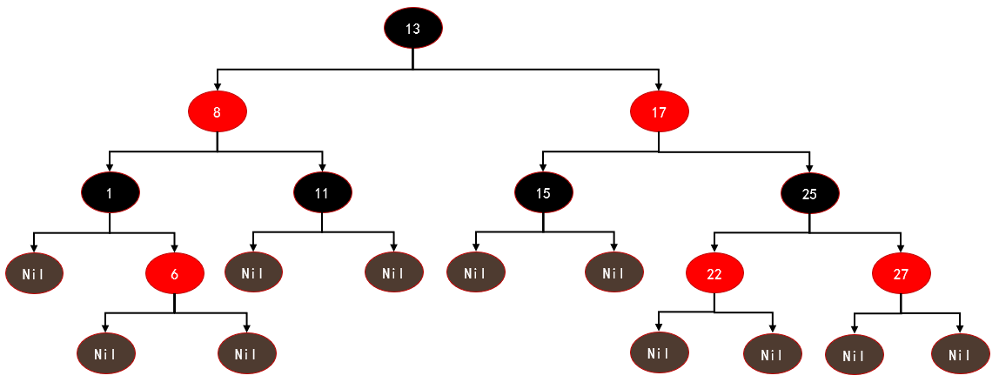

#### **红黑树的相对平衡**

- **前面的性质约束，确保了红黑树的关键特性：**
  - 从**根到叶子的最长可能路径**，不会超过**最短可能路径的两倍长。**
  - 结果就是这个树**基本**是平衡的，
  - 虽然**没有做到绝对的平衡**，但是**可以保证在最坏的情况下，依然是高效**的。
- **为什么可以做到最长路径不超过最短路径的两倍呢？**
  - 性质五决定了最短路径和最长路径必须有相同的黑色节点
  - 路径最短的情况：全部是黑色节点n;
  - 路径最长的情况：首尾解释黑色节点n,中间全部是红色节点n-1:；
    - 性质二：根节点是黑节点
    - 性质三：叶子节点都是黑节点；
    - 性质四：两个红色节点不能相连
  - 最短路径为n-1(边的数量)；
  - 最长路径为(n+n-1)-1=2n-2;
  - 所以最长路径**一定不超过**最短路径的2倍：

#### **红黑树的代码实现**

- **手写一个TypeScript红黑树的详细步骤：**
  - **定义红黑树的节点**：定义一个带有键、值、颜色、左子节点、右子节点和父节点的类；
  - **实现左旋操作**：将一个节点向左旋转，保持红黑树的性质；
  - **实现右旋操作**：将一个节点向右旋转，保持红黑树的性质；
  - **实现插入操作**：在红黑树中插入一个新的节点，并保持红黑树的性质；
  - **实现删除操作**：从红黑树中删除一个节点，并保持红黑树的性质；
  - **实现修复红黑树性质**：在插入或删除操作后，通过旋转和变色来修复红黑树的性质：
  - 其他方法较为简单，可以自行实现：
    

```typescript
import { btPrint } from "hy-algokit";

enum Color {
  RED,
  BLACK,
}

class RedBlackNode<T> {
  value: T;
  color: Color;
  parent: RedBlackNode<T> | null;
  left: RedBlackNode<T> | null;
  right: RedBlackNode<T> | null;

  constructor(
    value: T,
    color: Color = Color.RED,
    parent: RedBlackNode<T> | null = null,
    left: RedBlackNode<T> | null = null,
    right: RedBlackNode<T> | null = null
  ) {
    this.value = value;
    this.color = color;
    this.parent = parent;
    this.left = left;
    this.right = right;
  }
}

class RedBlackTree<T> {
  root: RedBlackNode<T> | null = null;

  /**
   * 插入一个新节点
   * @param value 待插入节点的值
   */
  insert(value: T) {
    // 创建一个新节点
    let newNode = new RedBlackNode(value);

    // 如果红黑树为空，将该节点作为根节点
    if (!this.root) {
      this.root = newNode;
      // 根节点为黑色
      newNode.color = Color.BLACK;
      return;
    }

    // 初始化搜索变量current和parent
    let current: RedBlackNode<T> | null = this.root;
    let parent: RedBlackNode<T> | null = null;

    // 搜索合适的插入位置
    while (current) {
      parent = current;
      // 如果value小于当前节点，则继续往左子树搜索
      if (value < current.value) {
        current = current.left;
        // 否则继续往右子树搜索
      } else {
        current = current.right;
      }
    }

    // 将新节点的父节点设置为搜索到的父节点
    newNode.parent = parent;
    // 将新节点插入到合适的位置
    if (value < parent!.value) {
      parent!.left = newNode;
    } else {
      parent!.right = newNode;
    }

    // 修复插入导致的红黑树性质破坏
    this.fixInsertion(newNode);
  }

  private fixInsertion(node: RedBlackNode<T>) {
    // 当父节点存在且颜色为红时
    while (node.parent && node.parent.color === Color.RED) {
      // 获取祖父节点
      let grandParent = node.parent.parent!;

      // 父节点是祖父节点的左子节点
      if (node.parent === grandParent.left) {
        // 获取叔叔节点
        let uncle = grandParent.right;
        // 叔叔节点存在且颜色为红
        if (uncle && uncle.color === Color.RED) {
          // 将父节点颜色改为黑，叔叔节点颜色改为黑，祖父节点颜色改为红，node节点变为祖父节点，继续循环
          node.parent.color = Color.BLACK;
          uncle.color = Color.BLACK;
          grandParent.color = Color.RED;
          node = grandParent;
        } else {
          // 当前节点是父节点的右子节点
          if (node === node.parent.right) {
            // 将当前节点变为父节点，进行左旋操作
            node = node.parent;
            this.leftRotate(node);
          }
          // 将父节点颜色改为黑，祖父节点颜色改为红，进行右旋操作
          node.parent!.color = Color.BLACK;
          grandParent.color = Color.RED;
          this.rightRotate(grandParent);
        }
      } else {
        // 父节点是祖父节点的右子节点，与上面的同理
        let uncle = grandParent.left;
        // 如果叔叔节点是红色的
        if (uncle && uncle.color === Color.RED) {
          // 父节点设置为黑色
          node.parent.color = Color.BLACK;
          // 叔叔节点设置为黑色
          uncle.color = Color.BLACK;
          // 祖父节点设置为红色
          grandParent.color = Color.RED;
          // 将当前节点设置为祖父节点
          node = grandParent;
        } else {
          // 如果当前节点是父节点的左节点
          if (node === node.parent.left) {
            // 将当前节点设置为父节点
            node = node.parent;
            // 右旋父节点
            this.rightRotate(node);
          }
          // 父节点设置为黑色
          node.parent!.color = Color.BLACK;
          // 祖父节点设置为红色
          grandParent.color = Color.RED;
          // 左旋祖父节点
          this.leftRotate(grandParent);
        }
      }
    }
    // 根节点设置为黑色节点
    this.root!.color = Color.BLACK;
  }

  /**
   * 左旋操作
   *
   * @param node 要进行左旋的结点
   */
  private leftRotate(node: RedBlackNode<T>) {
    // 获取 node 的右子节点
    let rightChild = node.right!;
    // 将右子节点的左子节点赋值给 node 的右子节点
    node.right = rightChild.left;

    // 如果右子节点的左子节点不为空，则将右子节点的左子节点的父节点指向 node
    if (rightChild.left) {
      rightChild.left.parent = node;
    }

    // 将右子节点的父节点指向 node 的父节点
    rightChild.parent = node.parent;
    // 如果 node 的父节点为空，则将右子节点设为根结点
    if (!node.parent) {
      this.root = rightChild;
    }
    // 如果 node 是它父节点的左子节点，则将右子节点设为 node 父节点的左子节点
    else if (node === node.parent.left) {
      node.parent.left = rightChild;
    }
    // 否则，将右子节点设为 node 父节点的右子节点
    else {
      node.parent.right = rightChild;
    }

    // 将 node 的父节点指向 rightChild，并将 rightChild 的左子节点指向 node
    rightChild.left = node;
    node.parent = rightChild;
  }

  /**
   * 右旋转
   * @param node 旋转节点
   */
  private rightRotate(node: RedBlackNode<T>) {
    // 获取旋转节点的左子节点
    let leftChild = node.left!;
    // 将旋转节点的左子节点的右子节点，接到旋转节点的左边
    node.left = leftChild.right;

    // 如果左子节点的右子节点不为空，设置它的父节点为旋转节点
    if (leftChild.right) {
      leftChild.right.parent = node;
    }

    // 将左子节点的父节点设为旋转节点的父节点
    leftChild.parent = node.parent;
    // 如果旋转节点的父节点不存在，说明左子节点变成根节点
    if (!node.parent) {
      this.root = leftChild;
    } else if (node === node.parent.right) {
      // 如果旋转节点是它父节点的右子节点，将父节点的右子节点设为左子节点
      node.parent.right = leftChild;
    } else {
      // 如果旋转节点是它父节点的左子节点，将父节点的左子节点设为左子节点
      node.parent.left = leftChild;
    }

    // 将旋转节点设为左子节点的右子节点
    leftChild.right = node;
    // 将旋转节点的父节点设为左子节点
    node.parent = leftChild;
  }

  // 查找红黑树中的最小值
  minimum(node: RedBlackNode<T> | null = this.root): RedBlackNode<T> | null {
    let current = node;
    while (current && current.left) {
      current = current.left;
    }
    return current;
  }

  // 查找红黑树中的某个节点
  private search(value: T): RedBlackNode<T> | null {
    let node = this.root;
    let parent: RedBlackNode<T> | null = null;
    while (node) {
      if (node.value === value) {
        node.parent = parent;
        return node;
      }
      parent = node;
      if (value < node.value) {
        node = node.left;
      } else {
        node = node.right;
      }
    }
    return null;
  }

  /**
   * 删除红黑树中的某个节点
   *
   * @param value 要删除的节点的值
   */
  delete(value: T) {
    // 先找到要删除的节点
    const nodeToDelete = this.search(value);
    // 如果不存在，就直接退出
    if (!nodeToDelete) {
      return;
    }

    // 否则删除节点
    this._delete(nodeToDelete);
  }

  /**
   * 删除红黑树中的节点
   * @param node 要删除的节点
   */
  private _delete(node: RedBlackNode<T>) {
    // 如果该节点同时存在左右节点，则找到右子树的最小节点作为该节点的后继
    if (node.left && node.right) {
      const successor = this.minimum(node.right);
      node.value = successor!.value;
      node = successor!;
    }

    let child: RedBlackNode<T> | null;
    // 如果该节点存在左节点，则将该左节点作为它的唯一子节点
    if (node.left) {
      child = node.left;
    } else if (node.right) {
      // 如果该节点存在右节点，则将该右节点作为它的唯一子节点
      child = node.right;
    } else {
      child = null;
    }

    // 如果该节点没有子节点，直接删除
    if (!child) {
      // 如果该节点是黑色，则需要特殊处理
      if (node.color === Color.BLACK) {
        this._deleteCase1(node);
      }
      this._removeNode(node);
    } else {
      // 如果该节点是黑色，则需要特殊处理
      if (node.color === Color.BLACK) {
        // 如果该节点的唯一子节点是红色，则将该唯一子节点设置为黑色
        if (child.color === Color.RED) {
          child.color = Color.BLACK;
        } else {
          this._deleteCase1(node);
        }
      }
      // 用该节点的唯一子节点替换该节点
      this._replaceNode(node, child);
    }
  }

  private _deleteCase1(node: RedBlackNode<T>) {
    // 如果有父节点，就进入 Case 2
    if (node.parent) {
      this._deleteCase2(node);
    }
  }

  private _deleteCase2(node: RedBlackNode<T>) {
    // 找到兄弟节点
    const sibling = this._sibling(node);
    // 如果兄弟节点存在且颜色为红色
    if (sibling && sibling.color === Color.RED) {
      // 父节点颜色变为红色
      node.parent!.color = Color.RED;
      // 兄弟节点颜色变为黑色
      sibling.color = Color.BLACK;
      // 如果删除的节点是左子节点
      if (node === node.parent!.left) {
        // 则向左旋转
        this.leftRotate(node.parent!);
      } else {
        // 否则向右旋转
        this.rightRotate(node.parent!);
      }
    }
    this._deleteCase3(node);
  }


  private _deleteCase3(node: RedBlackNode<T>) {
    const sibling = this._sibling(node);
    // 当父节点颜色是黑色，兄弟节点颜色是黑色，兄弟节点的左右子节点都是黑色
    if (
      node.parent!.color === Color.BLACK &&
      sibling &&
      sibling.color === Color.BLACK &&
      (!sibling.left || sibling.left.color === Color.BLACK) &&
      (!sibling.right || sibling.right.color === Color.BLACK)
    ) {
      // 将兄弟节点颜色设置为红色
      sibling.color = Color.RED;
      // 递归处理父节点
      this._deleteCase1(node.parent!);
    } else {
      // 进入下一个情况
      this._deleteCase4(node);
    }
  }

  private _deleteCase4(node: RedBlackNode<T>) {
    const sibling = this._sibling(node);
    // 当父节点为红色，兄弟节点为黑色，且兄弟节点的左右子树为黑色时
    if (
      node.parent!.color === Color.RED &&
      sibling &&
      sibling.color === Color.BLACK &&
      (!sibling.left || sibling.left.color === Color.BLACK) &&
      (!sibling.right || sibling.right.color === Color.BLACK)
    ) {
      // 将兄弟节点涂红色
      sibling.color = Color.RED;
      // 父节点涂黑色
      node.parent!.color = Color.BLACK;
    } else {
      // 否则进入下一个删除 case
      this._deleteCase5(node);
    }
  }  

  private _deleteCase5(node: RedBlackNode<T>) {
    const sibling = this._sibling(node);
    if (sibling && sibling.color === Color.BLACK) {
      // 如果当前节点是它父的左节点，并且兄弟节点的右节点存在且为红色
      if (
        node === node.parent!.left &&
        sibling.right &&
        sibling.right.color === Color.RED
      ) {
        // 将兄弟节点的颜色设置为红色
        sibling.color = Color.RED;
        // 兄弟节点的右节点设置为黑色
        sibling.right!.color = Color.BLACK;
        // 对兄弟节点进行左旋
        this.leftRotate(sibling);
      } else if (
        node === node.parent!.right &&
        sibling.left &&
        sibling.left.color === Color.RED
      ) {
        // 同上
        sibling.color = Color.RED;
        sibling.left!.color = Color.BLACK;
        this.rightRotate(sibling);
      }
    }
    this._deleteCase6(node);
  }


  private _deleteCase6(node: RedBlackNode<T>) {
    const sibling = this._sibling(node);
    // 将兄弟节点颜色设置成父节点颜色
    sibling!.color = node.parent!.color;
    // 将父节点颜色设置成黑色
    node.parent!.color = Color.BLACK;
    if (node === node.parent!.left) {
      // 将兄弟节点的右子节点颜色设置成黑色
      sibling!.right!.color = Color.BLACK;
      // 对父节点左旋
      this.leftRotate(node.parent!);
    } else {
      // 将兄弟节点的左子节点颜色设置成黑色
      sibling!.left!.color = Color.BLACK;
      // 对父节点右旋
      this.rightRotate(node.parent!);
    }
  }

  private _removeNode(node: RedBlackNode<T>) {
    if (!node.parent) {
      this.root = null;
    } else if (node === node.parent.left) {
      node.parent.left = null;
    } else {
      node.parent.right = null;
    }
  }

  private _replaceNode(oldNode: RedBlackNode<T>, newNode: RedBlackNode<T>) {
    if (!oldNode.parent) {
      this.root = newNode;
    } else if (oldNode === oldNode.parent.left) {
      oldNode.parent.left = newNode;
    } else {
      oldNode.parent.right = newNode;
    }
    newNode.parent = oldNode.parent;
  }

  private _sibling(node: RedBlackNode<T>) {
    if (!node.parent) {
      return null;
    }
    return node === node.parent.left ? node.parent.right : node.parent.left;
  }
}

const rbtree = new RedBlackTree<number>();
rbtree.insert(10);
rbtree.insert(20);
rbtree.insert(30);
rbtree.insert(40);
rbtree.insert(50);
rbtree.insert(60);
rbtree.insert(70);
rbtree.insert(80);

rbtree.delete(10);
rbtree.delete(30);
rbtree.delete(20);
btPrint(rbtree.root);

export {};

```


#### 红黑树的性能分析

- **事实上，红黑树的性能在搜索上是不如****AVL树的，为什么呢？

- **我们来看一下右边的红黑树：**

  - 首先，它符合是一颗红黑树吗？符合。

  - 这个时候我们插入 节点30，会被插入到哪里呢？
    - 27的右边，并且节点30是红色节点时，依然符合红黑树的性质。
  - 也就是对于红黑树来说，它不需要进行任何操作；

- **那么AVL树会怎么样呢？**

  - 如果是AVL树必然要对17、25、27节点进行右旋转；
  - 事实上右旋转是一系列的操作；

- **但是红黑树的高度比AVL树要高：**

  - 所以如果同样是搜索30，那么红黑树需要搜索4次，AVL树搜索3次；
  - 所以红黑树相当于牺牲了一点点的搜索性能，来提高了插入和删除的性能；

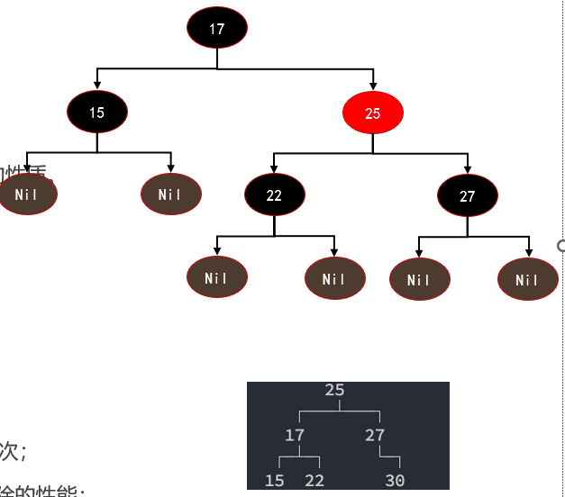

#### **AVL树和红黑树的选择**

- **AVL树和红黑树的性能对比：**
  - AVL树是一种平衡度更高的二叉搜索树，所以在**搜索效率**上会更高；
  - 但是AVL树为了维护这种平衡性，在**插入和删除操作**时，通常会进行更多的旋转操作，所以**效率相对红黑树较低：**
  - 红黑树在平衡度上相较于AVL树没有那么严格，所以**搜索效率上会低一些；**
  - 但是红黑树在**插入和删除操作**时，通常需要更少的旋转操作，所以**效率相对AVL树较高**：
  - 它们的搜索、添加、删除时间复杂度都是OQg),但是细节上会有一些差异；
- **开发中如何进行选择呢？**
  - 选择AVL树还是红黑树，取决于具体的应用需求。
  - 如果需要保证每个节点的高度尽可能地平衡，可以选择AVL树。
  - 如果需要保证删除操作的效率，可以选择红黑树。
- **在早期的时候，很多场景会选择AVL树，目前选择红黑树的越来越多(AVL树依然是一种重要的平衡树)。**
  - 比如操作系统内核中的内存管理；
  - 比如Java的TreeMap、TreeSet底层的源码；

## 排序算法

- **排序算法就是研究如何对数组进行高效排序的算法，也是在面试时非常常见的面试题型之一。**
- **维基百科堆排序算法的解释**：
  - 在计算机科学与数学中，一个**排序算法**（英语：Sorting algorithm)是一种能将**一串资料**依照特定排序方式排列的算法。
  - 虽然排序算法从名称来看非常容易理解，但是从计算机科学发展以来，在此问题上已经有大量的研究。
- 由于**排序非常重要而且可能非常耗时**，所以它已经成为一个计算机科学中**广泛研究的课题**
  - 而且人们已经研究出一套**成熟的方案**来实现排序。
  - 因此，幸运的是你**并不需要是发明某种排序算法**，而是**站在巨人的肩膀**上即可。
- **在计算机科学所使用的排序算法通常依以下标准分类：**
  - **计算的时间复杂度**：使用大O表示法，也可以实际测试消耗的时间；
  - **内存使用量**（甚至是其他电脑资源）：比如外部排序，使用磁盘来存储排序的数据；
  - **稳定性**：稳定排序算法会让原本有相等键值的纪录维持相对次序；
  - **排序的方法**：插入、交换、选择、合并等等；

### **常见的排序算法**

- 常见的排序算法非常多：
  - 冒泡排序
  - 选择排序
  - 插入排序
  - **归并排序**
  - **快速排序**
  - **堆排序**
  - 希尔排序
  - 计数排序
  - 桶排序
  - 基数排序
  - 内省排序
  - 平滑排序

> 主要前五种(重要)

### 排序算法的时间复杂度


### 冒泡排序(bubbleSort)

- **我们要学习非常多种类的排序算法，那么我们可以先从一个最简单的**
  **排序算法入手：冒泡排序。**
- **冒泡排序(Bubble Sort)是一种简单的排序方法。**
  - 基本思路是通过**两两比较相邻的元素并交换它们的位置**，从而**使整个序列按照顺序排列。**
  - 该**算法一趟排序**后，**最大值总是会移到数组最后面**，那么接下来就不用再考虑这个最大值。
  - 一直**重复这样的操作**，最终就可以得到排序完成的数组。
- 这个算法的名字由来是**因为越大的元素会经由交换慢慢“浮”到数组的尾端，故名“冒泡排序”**

#### **冒泡排序的流程**

- **冒泡排序的流程如下：**
  - 从第一个元素开始，逐一比较相邻元素的大小。
  - 如果前一个元素比后一个元素大，则交换位置。
  - 在第一轮比较结束后，最大的元素被移动到了最后一个位置。
  - 在下一轮比较中，不再考虑最后一个位置的元素，重复上述操作。
  - 每轮比较结束后，需要排序的元素数量减一，直到没有需要排序的元素。
  - 排序结束。
  - 这个流程会一直循环，直到所有元素都有序排列为止。


#### 冒泡排序的实现

utils文件：封装公共的方法函数

```typescript

type testSortType = (arr: number[]) => number[];
//交换函数
export function swap(arr: number[], i: number, j: number) {
  const temp = arr[i];
  arr[i] = arr[j];
  arr[j] = temp;
}

//测试排序函数
export function testSort(fn: testSortType) {
  const arr = Array.from({ length: 10 }, () => {
    return Math.floor(Math.random() * 200);
  });
  console.log("排序前的数组", arr);
  fn(arr);
  console.log("排序后的数组", arr);
  console.log("是否正确进行排序", isSort(arr));
}
//判断是否正确进行排序函数
export function isSort(arr: number[]): boolean {
  for (let i = 0; i < arr.length - 1; i++) {
    if (arr[i] > arr[i + 1]) {
      return false;
    }
  }
  return true;
}

```

冒泡排序

```typescript
//核心思路：相邻的两个数进行比较，大的数放在最后，一直进行查找，直到最后

import { swap } from "hy-algokit";
import { testSort } from "./00-utils";

function bubbleSort(arr: number[]): number[] {
  //记录数组长度
  const n = arr.length;
  //优化
  let isBreak = false;

  //外层循环，内层循环只是把一个最大数放在最后面，所以需要外层循环，持续从头比较
  for (let i = 0; i < n; i++) {
    //内层循环，对相邻2数进行比较，大的排后面,
      //因为j为前一个数字，所以 n-1 , 又因为每一次都进行了一个排序
      //那么排好的就不需要进行操作，每次要 - i 循环的次数
    for (let j = 0; j < n - 1 - i; j++) {
      if (arr[j] > arr[j + 1]) {
        swap(arr, j, j + 1);
        isBreak = true;
      }
    }
    //如果为false就不进行操作，说明了一直都是前一个数字比后一个小
    if (!isBreak) break;
  }

  return arr;
}

testSort(bubbleSort);

```

#### **冒泡排序的时间复杂度**

- **在冒泡排序中，每次比较两个相邻的元素，并交换他们的位置，如果左边的元素比右边的元素大，则交换它们的位置。这样的比较和交换的过程可以用一个循环实现。**
- **最好情况：O(n)**
  - 即待排序的序列已经是有序的。
  - 此时仅需遍历一遍序列，不需要进行交换操作。

- **最坏情况：O(n^2)**
  - 即待排序的序列是逆序的。
  - 需要进行n-1轮排序，每一轮中需要进行n-i-1次比较和交换操作。

- **平均情况：O(n^2)**
  - 即待排序的序列是随机排列的。
  - 每一对元素的比较和交换都有1/2的概率发生，因此需要进行n-1轮排序，每一轮中需要进行n-i-1次比较和交换操作。

- **由此可见，冒泡排序的时间复杂度主要取决于数据的初始顺序，最坏情况下时间复杂度是O(n^2)，不适用于大规模数据的排序。**

#### **冒泡排序的总结**

- **冒泡排序适用于数据规模较小的情况，因为它的时间复杂度为O(n^2)，对于大数据量的排序会变得很慢**。
- 同时，**它的实现简单，代码实现也容易理解**，适用于**学习排序算法的初学者。**
- 但是，在实际的应用中，冒泡排序并不常用，因为它的效率较低。
- 因此，在实际应用中，冒泡排序通常被更高效的排序算法代替，如**快速排序、归并排序**等。

### 选择排序(selectionSort)

- **选择排序(Selection Sort)是一种简单的排序算法。**
- **它的基本思想是：**
  - 首先在**未排序的数列中找到最小（大）元素**，然后**将其存放到数列的起始位置：**
  - 接着，再从剩余未排序的元素中**继续寻找最小（大）元素，然后放到已排序序列的末尾。**
  - 以此类推，**直到所有元素均排序完毕。**
- **选择排序的主要优点与数据移动有关。**
  - 如果**某个元素位于正确的最终位置**，则它**不会被移动**。
  - 选择排序**每次交换一对元素**，它们当中至少有一个将被移到其最终位置上，因此对个元素的表进行排序总共进行**至多n-1次交换。**
  - 在所有的完全**依靠交换去移动元素的排序方法**中，**选择排序属于非常好**的一种。
- **选择排序的实现方式很简单，并且容易理解，因此它是学习排序算法的很好的选择。**

#### **选择排序的流程**

- **选择排序的实现思路可以分为以下几个步骤：**
  - 1.遍历数组，找到未排序部分的最小值
    - 首先，将未排序部分的第一个元素标记为最小值
    - 然后，从未排序部分的第二个元素开始遍历，依次和已知的最小值进行比较
    - 如果找到了比最小值更小的元素，就更新最小值的位置
  - 2.将未排序部分的最小值放置到已排序部分的后面
    - 首先，用解构赋值的方式交换最小值和已排序部分的末尾元素的位置
    - 然后，已排序部分的长度加一，未排序部分的长度减一
  - 3.重复执行步骤1和2，直到所有元素都有序


#### 选择排序的实现

```typescript
import { swap } from "hy-algokit";
import { testSort } from "./00-utils";

//核心思路：寻找当前数组中的最小值，把最小值与当前比较的位置进行交换进行排序，开始从第一个进行比较
function selectionSort(arr: number[]): number[] {
  const n = arr.length;

  //外层循环，决定经过多少轮找到最小值
  for (let i = 0; i < n - 1; i++) {
    //默认第一位
    let minIndex = i;
    //内层循环，找到最小值的下标赋值给minIndex
    for (let j = i + 1; j < n; j++) {
      if (arr[j] < arr[minIndex]) {
        minIndex = j;
      }
    }
    //进行交换，因为可能第一位就是最小值，所以 只有i!==minindex时才进行交换
    if (i !== minIndex) {
      swap(arr, i, minIndex);
    }
  }

  return arr;
}

testSort(selectionSort);

```

#### 选择排序的时间复杂度

- **选择排序的时间复杂度是比较容易分析的。**
- **最好情况时间复杂度：O(n^2)**
  - 最好情况是指待排序的数组本身就是有序的。
  - 在这种情况下，内层循环每次都需要比较n-1次，因此比较次数为n(n-1)/2,交换次数为0。
  - 所以，选择排序的时间复杂度为O(n^2)。
- **最坏情况时间复杂度：O(n^2)****
  - 最坏情况是指待排序的数组是倒序排列的。
  - 在这种情况下，每次内层循环都需要比较n-i-1次，因此比较次数为n(n-1)/2,交换次数也为n(n-1)/2。
  - 所以，选择排序的时间复杂度为O(n^2)
- **平均情况时间复杂度：O(n^2)****
  - 平均情况是指待排序的数组是随机排列的。
  - 在这种情况下，每个元素在内层循环中的位置是等概率的，因此比较次数和交换次数的期望值都是(-1)/4。
  - 所以，选择排序的时间复杂度为O(n^2)。

#### 选择排序的总结

- **虽然选择排序的实现非常简单，但是它的时间复杂度较高，对于大规模的数据排序效率较低。**
  - 如果需要对大规模的数据进行排序，通常会选择其他更为高效的排序算法，例如快速排序、归并排序等。
- **总的来说，选择排序适用于小规摸数据的排序和排序算法的入门学习，对于需要高效排序的场合，可以选择其他更为高效的排序算法。**

### 插入排序(insertionSort)

- **插入排序就像我们打扑克牌时，摸到一张新牌需要插入到手牌中的合适位置一样。**
  - 我们会**将新牌和手牌中已有的牌进行比较**，找到一个**合适的位置插入新牌**。
  - 如果**新牌比某张牌小**，那么**我们就把这张牌向右移动一位，为新牌腾出位置**。
  - **一直比较直到找到一个合适的位置将新牌插入**，这样就完成了一次插入操作。
- **与打牌类似，插入排序(Insertion sort)的实现方法是：**
  - 首先假设第一个数据是已经排好序的，接着取出下一个数据，在已经排好序的数据中从后往前扫描，**找到比它小的数的位置，将该位置之后的数整体后移一个单位，然后再将该数插入到该位置。**
  - 不断重复上述操作，直到所有的数据都插入到已经排好序的数据中，排序完成。

#### **插入排序的流程**

- **插入排序的流程如下：**

  1.首先，假设数组的第一个元素已经排好序了，因为它只有一个元素，所以可以认为是有序的。

  2.然后，从第二个元素开始，不断与前面的有序数组元素进行比较。

  3.如果当前元素小于前面的有序数组元素，则把当前元素插入到前面的合适位置。

  4.否则，继续与前面的有序数组元素进行比较。

  5.以此类推，直到整个数组都有序。

  6.循环步骤2~5，直到最后一个元素。

  7.完成排序。


#### 插入排序的代码实现

```typescript
import { testSort } from "hy-algokit";
//核心思路:先把第一个元素看成是有序的，把后的元素与前面元素进行比较
//如果前面元素大于后面，则把后面的元素插入到前面
function insertionSort(arr: number[]): number[] {
  const n = arr.length;
  for (let i = 1; i < n; i++) {
    //newNum为第一个元素后面的元素，用于与前面的元素进行比较
    let newNum = arr[i];
    //j为第一个元素，把他看成是有序的数组
    let j = i - 1;
    //当第一个元素大于后面的元素时，进行循环
    while (arr[j] > newNum && j >= 0) {
      //把大的元素，赋值给后面的元素，进行换位操作，大的元素会一直往后移
      arr[j + 1] = arr[j];
        //j--的目的时为了一直往前面找 < nuewnum的值，直到循环结束
      j--;
    }
    //这里的j === - 1 或者是前面没有比它大的元素下标，所以要+1往后面一位进行插入操作
      //找到 小于newnum的值，在值后面插入newnum
    arr[j + 1] = newNum;
  }

  return arr;
}

testSort(insertionSort);

```

#### 插入排序的复杂度分析

- 插入排序的时间复杂度的分析\
- **最好情况：O(n)**
  - 如果待排序数组已经排好序
  - 那么每个元素只需要比较一次就可以确定它的位置，因此比较的次数为-1，移动的次数为0。
  - 所以最好情况下，插入排序的时间复杂度为线性级别，即O()。
- 最坏情况：**O(n^2)**
  - 如果待排序数组是倒序排列的
  - 那么每个元素都需要比较和移动1次，其中1是元素在数组中的位置。
  - 因此比较的次数为n(n-1)/2,移动的次数也为n(n-1)/2。
  - 所以最坏情况下，插入排序的时间复杂度为平方级别，即O(2)。
- **平均情况：**
  - 一个随机排列的数组，插入排序的时间复杂度也为平方级别，即O(2)。
- **总而言之，如果数组部分有序，插入排序可以比冒泡排序和选择排序更快。**
  - 但是如果数组完全逆序，则插入排序的时间复杂度比较高，不如快速排序或归并排序。

#### 插入排序总结

-  **插入排序是一种简单直观的排序算法，它的基本思想就是将待排序数组分为已排序部分和未排序部分，然后将未排序部分的每个**
  **元素插入到已排序部分的合适位置。**
- **插入排序的时间复杂度为O(n^2),虽然这个复杂度比较高，但是插入排序的实现非常简单，而且在某些情况下性能表现也很好**
  - 比如，如果待排序数组的大部分元素已经排好序，那么插入排序的性能就会比较优秀。
- **总之，插入排序虽然没有快速排序和归并排序等高级排序算法的复杂性和高效性，但是它的实现非常简单，而且在一些特定的场**
  **景下表现也很好。**

### 归并排序(mergeSort)

- **归并排序(merge sort)是一种常见的排序算法：**
  - 它的基本思想是**将待排序数组分成若干个子数组。**
  - 然后将相邻的**子数组归并成一个有序数组。**
  - 最后再将这些有序数组**归并(merge)成一个整体有序的数组。**
- **这个算法最早出现在1945年，由约翰冯诺伊曼(John von Neumann)(又一个天才，现代计算机之父，冯诺依曼结构、普林斯顿结构)首次提出。**
  - 当时他在为美国政府工作，研究原子弹的问题。
  - 由于当时计算机，他在研究中提出了一种高效计算的方法，这个方法就是**归并排序。**
- **归并排序的基本思路是先将待排序数组递归地拆分成两个子数组，然后对每个子数组进行排序，最后将两个有序子数组合并成一个有序数组。**
  - 在实现中，我们可以**使用“分治法”来完成这个过程，即将大问题分解成小问题来解决**。
- **归并排序的算法复杂度为O(nlogn),是一种比较高效的排序算法，因此在实际应用中被广泛使用。**
- **虽然归并排序看起来比较复杂，但是只要理解了基本思路，实现起来并不困难，而且它还是一个非常有趣的算法。**

#### 归并排序的思路

- **归并排序是一种基于分治思想的排序算法，其基本思路可以分为三个步骤：**
- **步骤一：分解(Divide)：归并排序使用递归算法来实现分解过程，具体实现中可以分为以下几个步骤**：
  ①如果待排序数组长度为1，认为这个数组已经有序，直接返回
  ②将待排序数组分成两个长度相等的子数组，分别对这两个子数组进行递归排序；
  ③将两个排好序的子数组合并成一个有序数组，返回这个有序数组。
- **步骤二：合并(Merge)：合并过程中，需要比较每个子数组的元素并将它们有序地合并成一个新的数组：**
  ①可以使用两个指针和j分别指向两个子数组的开头，比较它们的元素大小，并将小的元素插入到新的有序数组中。
  ②如果其中一个子数组已经遍历完，就将另一个子数组的剩余部分直接插入到新的有序数组中。
  ③最后返回这个有序数组。
- **步骤三：归并排序的递归终止条件：**
  - 归并排序使用递归算法来实现分解过程，当子数组的长度为1时，认为这个子数组已经有序，递归结束。
- **总体来看，归并排序的基本思路是分治法，分成子问题分别解决，然后将子问题的解合并成整体的解。**


#### 归并排序的代码实现

```typescript
import { measureSort, testSort } from "hy-algokit";

/***
 * 核心思想:
 * 把一个数组分成若干个子数组，
 * 在把相邻的2个子数组进行排序成新的有序数组，
 * 最后把有序数组排序组合成一个整体的有序数组
 */
function mergeSort(arr: number[]): number[] {
  if (arr.length <= 1) return arr;

  //1.把数组从中间分割成若干个小数组
  const midIndex = Math.floor(arr.length / 2);
  //切割的左数组
  const leftArr = arr.slice(0, midIndex);
  //切割的右数组
  const rightArr = arr.slice(midIndex);

  //1.2把切割后的数组，进行递归操作，直到切割成一个数组一个元素为止
  const newLeftArr = mergeSort(leftArr);
  const newRightArr = mergeSort(rightArr);
  //2.把若干个小数组进行排序，变成一个有序数组
  //2.1拿到切割后的数组进行排序操作(利用双指针 i, j )
  const newArr: number[] = [];
  //定义双指针，分别指向2个数组的头部
  let i = 0;
  let j = 0;

  //2.2如果左边的数组第一个值小于右边的，那么把左边值push进新数组，否则相反
  while (i < newLeftArr.length && j < newRightArr.length) {
    if (newLeftArr[i] < newRightArr[j]) {
      newArr.push(newLeftArr[i]);
      i++;
    } else {
      newArr.push(newRightArr[j]);
      j++;
    }
  }

  //2.3可能会有左边或右边的值添加不进去的情况，因为 当 i++ 或 j++可能会打断循环
  //左边还有剩余
  if (i < newLeftArr.length) {
    newArr.push(...newLeftArr.slice(i));
  }
  //右边还有剩余情况
  if (j < newRightArr.length) {
    newArr.push(...newRightArr.slice(j));
  }
  return newArr;
}

testSort(mergeSort);
// measureSort(mergeSort);

```

#### 归并排序的复杂度分析

- **复杂度的分析过程：**
  - 假设数组长度为n,需要进行logn次归并操作；
  - 每次归并操作需要O()的时间复杂度；
  - 因此，归并排序的时间复杂度为O(lQg小。
- **最好情况：O(logn)**
  - 最好情况下，待排序数组已经是有序的了，那么每个子数组都只需要合并一次，即只需要进行一次归并操作。
  - 因此，此时的时间复杂度是O(log n)。
- **最坏情况：O(nlog n)**
  - 最坏情况下，待排序数组是逆序的，那么每个子数组都需要进行多次合并。
  - 因此，此时的时间复杂度为O(lQgn。
- **平均情况：O(nlog n)**
  - 在平均情况下，我们假设待排序数组中任意两个元素都是等概率出现的。
  - 此时，可以证明归并排序的时间复杂度为O(Qn。

#### 归并排序的总结

- **归并排序是一种非常高效的排序算法，它的核心思想是分治，即将待排序数组分成若干个子数组，分别对这些子数组进行排序**
  **最后将排好序的子数组合并成一个有序数组。**
- **归并排序的时间复杂度为O(nlogn),并且在最好、最坏和平均情况下都可以达到这个时间复杂度。**
- **虽然归并排序看起来比较复杂，但是只要理解了基本思路，实现起来并不困难，而且它是一种非常高效的排序算法。**

### 快速排序(quickSort)

- **快速排序(Quicksort)是一种经典的排序算法，有时也被称为“划分交换排序”(partition-exchange sort),它的发明人是一位名叫Tony Hoare(东尼·霍尔)的计算机科学家。**
  - Tony Hoare在1960年代初期发明了**快速排序**，是在一份**ALGOL60(一种编程语言，作者也是)手稿中。**
  - 为了**让稿件更具可读性**，他采用了这种**新的排序算法。**
  - 当时，快速排序还没有正式命名，后来被Tony Hoare命名为**quicksort**,也就是快速排序的意思。
  - 由于**快速排序的思想非常巧妙**，因此**在计算机科学中得到了广泛的应用：**
- **虽然它的名字叫做“快速排序”，但并不意味着它总是最快的排序算法，它的实际运行速度取决于很多因素，如输入数据的分布情况、待排序数组的长度等等。**

#### 快速排序的定义

- **快速排序(Quick Sort)是一种基于分治思想的排序算法：**
  - 基本思路是将**一个大数组分成两个小数组，然后递归地对两个小数组进行排序。**
  - 具体实现方式是通过**选择一个基准元素(pot),将数组分成左右两部分，左部分的元素都小于或等于基准元素，右部分的元素都大于基准元素。**
  - 然后，对**左右两部分分别进行递归调用快速排序，最终将整个数组排序。**
- **快速排序是一种原地排序算法，不需要额外的数组空间。-**
  - 同时，**快速排序的时间复杂度是O(nlogn),在最坏情况下是O(n2)。**
  - 但是**这种情况出现的概率非常小，因此快速排序通常被认为是一种非常高效的排序算法。**
- **虽然快速排序看起来比较复杂，但是只要理解了基本思路，实现起来并不困难。**

#### 快速排序的思路分析

- **快速排序的思路可以分解成以下几几个步骤：**
  - ①首先，我们需要选择一个**基准元素**，通常选择**第一个或最后一个元素**作为基准元素。
  - ②然后，我们定义**两个指针i和j**,分别**指向数组的左右两端。**
  - ③接下来，我们**从右侧开始**，**向左移动j指针**，直到**找到一个小于或等于基准元素的值**。
  - ④然后，我们**从左侧开始**，**向右移动指针**，直到**找到一个大于或等于基准元素的值。**
  - ⑤如果**i指针小于或等于j指针，交换i和j指针所指向的元素。**
  - ⑥接着，我们**将数组**重复**步骤3-5**，**直到指针大于j指针**，这时，我们**将基准元素与i指针所指向的元素交换位置，将基准元素放到中间位置。**
  - ⑦**分为两部分，左侧部分包含小于或等于基准元素的元素，右侧部分包含大于基准元素的元素。**
  - ⑧然后，**对左右两部分分别进行递归调用快速排序，直到左右两部分只剩下一个元素。**
  - ⑨最终，**整个数组就变得有序**了。


#### 快速排序的代码实现

```typescript
import { swap, testSort } from "hy-algokit";

/**
 * 核心思想:
 * 1.把整个数组分成若干个子数组
 * 2.找到数组中的基准元素，一般为第一个元素或者最后
 * 3.定义双指针： i, j
 * 4.从左侧开始，向右移动i指针，找到 >= 基准元素的值 ，
 *  并且从右向左同时移动 j 指针，找到 < 基准元素的值，
 * 最后 2个值进行交换操作，小的值放在左边，大的值放在右边
 * 5.当 i > = j时， 结束寻找，并且把基准元素放在当前 i 的位置上进行交换
 * 6.在对上面左右数组进行递归操作，重复，返回数组
 */
function quickSort(arr: number[]): number[] {
  //传入 i指针和 就指针的值
  partition(0, arr.length - 1);
  function partition(left: number, right: number) {
    //当left 与right交叉时结束递归
    if (left >= right) return;

    //定义基准元素pivot,取数组中最后一个元素
    let pivot = arr[right];
    //定义i , j指针
    let i = left;
    let j = right - 1;
    while (i <= j) {
      //i是找大于pivot的元素，所以这里是为了获取，大于pivot的坐标
      while (arr[i] < pivot) {
        i++;
      }
      //j是找小于pivot的元素，所以这里是为了获取，小于于pivot的坐标
      while (arr[j] > pivot) {
        j--;
      }

      //在这里获取大于pivot 和小于pivot值的下标,进行交换

      if (i <= j) {
        swap(arr, i, j);
        //这里是一次查找，i++, j--是为了准备下一次查找
        i++;
        j--;
      }
    }

    //i > j 的逻辑，需要把pivot元素与 i的值下标的元素进行交换，在进行下一次递归
    swap(arr, i, right);

    //进行递归操作，对左右2个数组，进行快速递归操作
    partition(left, j);
    partition(i, right);
  }

  return arr;
}

testSort(quickSort);

```

#### 快速排序的复杂度分析

- **快速排序的时间复杂度主要取决于基准元素的选择、数组的划分、递归深度等因素。**
- **下面是快速排序的复杂度算法分析过程：**
- **最好情况：O(nlogn)**
  - 当每次划分后，两部分的大小都相等，即基准元素恰好位于数组的中间位置，此时递归的深度为O(log
    n)。
    - 每一层需要进行n次比较，因此最好	情况下的时间复杂度为o(nlogn)。
- **最坏情况：O(n^2)**
  - 当每次划分后，其中一部分为空，即基准元素是数组中的最大或最小值，此时递归的深度为O(n)。
  - 每一层需要进行n次比较，因此最坏情况下的时间复杂度为O(n^2)。
  - 需要注意的是，采用三数取中法或随机选择基准元素可以有效避免最坏情况的发生。
- **平均情况：O(nlogn)**
  - 在平均情况下，每次划分后，两部分的大小大致相等，此时递归的深度为O(logn)
  - 每一层需要进行大约n次比较，因此平均情况下的时间复杂度为O(nlogn)。
- **需要注意的是，快速排序是一个原地排序算法，不需要额外的数组空间。**

#### 快速排序的总结

- **快速排序的性能优于许多其他排序算法，因为它具有良好的局部性和使用原地排序的优点。**
  - 它在大多数情况下的时间复杂度为O(nlogn),但在最坏情况下会退化到O(n^2)
  - 为了避免最坏情况的发生，可以使用一些优化策略，比如随机选择基准元素和三数取中法。
- **总之，快速排序是一种高效的排序算法，它在实践中被广泛使用。**

### 堆排序(HeapSort)

- **堆排序(Heap Sort)是堆排序是一种基于比较的排序算法，它的核心思想是使用二叉堆来维护一个有序序列。**
  - 二叉堆是一种完全二叉树，其中**每个节点都满足父节点比子节点大（或小）的条件**。
  - 在堆排序中，我们**使用最大堆来进行排序**，也就是**保证每个节点都比它的子节点大。**
- **在堆排序中，我们首先构建一个最大堆。**
  - 然后，我们**将堆的根节点（也就是最大值）与堆的最后一个元素交换**，这样**最大值就被放在了正确的位置上。**
  - 接着，**我们将堆的大小减小一，并将剩余的元素重新构建成一个最大堆**。
  - 我们**不断重复这个过程，直到堆的大小为1。**
  - 这样，我们就**得到了一个有序的序列。**
- **堆排序和选择排序有一定的关系，因为它们都利用了“选择”这个基本操作。**
  - 选择排序的基本思想是**在待排序的序列中选出最小（或最大）的元素，然后将其放置到序列的起始位置。**
  - 堆排序也是**一种选择排序算法，它使用最大堆来维护一个有序序列，然后不断选择出最大的值。**
- **堆排序的时间复杂度为nO(nlogn)。**
- **注意：学习堆排序之前最好先理解堆结构，这样更有利于对堆排序的理解。**

#### 堆排序思路分析

- **堆排序可以分成两大步骤：构建最大堆和排序**
- **构建最大堆：**
  - ①遍历待排序序列，从最后一个非叶子节点开始，依次对每个节点进行调整。
  - ②假设当前节点的下标为1左子节点的下标为2i+1,右子节点的下标为2i+2,父节点的下标为/2)-1。
  - ③对于每个节点比较它和左右子节点的值，找出其中最大的值，并将其与节点进行交换：
  - ④重复进行这个过程，直到节点1满足最大堆的性质。
  - ⑤依次对每个非叶子节点进行上述操作，直到根节点，这样我们就得到了一个最大堆。
- **排序：**
  - ①将堆的根节点（也就是最大值）与堆的最后一个元素交换，这样最大值就被放在了正确的位置上。
  - ②将堆的大小减小一，并将剩余的元素重新构建成一个最大堆。
  - ③重复进行步骤①和步骤②，直到堆的大小为1，这样我们就得到了一个有序的序列。


#### 堆排序代码实现

```typescript

import { cbtPrint, swap, testSort } from "hy-algokit";

//核心思路:创建一个最大堆，最大值永远都是第一个元素
//把最大值放在最后，然后在对堆进行下滤操作，变成一个最大推，
//在取出最大值，重复上面操作
function heapSort(arr: number[]): number[] {
  const n = arr.length;
  //原地建堆操作，拿到当前数组，非叶子节点的下标
  const start = Math.floor(n / 2 - 1);
    //进行i--可以拿到上面所有非叶子节点的下标
  for (let i = start; i >= 0; i--) {
    //对非叶子节点进行下滤操作
    heapity_Down(arr, n, i);
  }
  //把最大堆的最大值，与最后一位交换位置，在重新进行下滤操作重新建堆
  for (let i = n - 1; i > 0; i--) {
    swap(arr, 0, i);
    //对0位置重新进行下滤操作
    heapity_Down(arr, i, 0);
  }

  return arr;
}

/**
 *
 * @param arr 操作的数组
 * @param n   //数组的length
 * @param i   对哪个非叶子节点进行下滤操作
 */
function heapity_Down(arr: number[], n: number, index: number) {
  //小于数组的长度说明，还没有遍历到最后 ， 这里2*index+1是当前非叶子节点的左子节点
  while (2 * index + 1 < n) {
    //非叶子节点的左右2个子节点
    let leftChildIndex = 2 * index + 1;
    let rightChildIndex = 2 * index + 2;

    //记录最大的那一个节点
    let larageIndex = leftChildIndex;
    if (rightChildIndex < n && arr[rightChildIndex] > arr[leftChildIndex]) {
      larageIndex = rightChildIndex;
    }

    //对非叶子节点和它2个子节点值进行判断，如果 >子节点 break ,否则与大的那个子节点进行交换位置
    if (arr[index] >= arr[larageIndex]) {
      break;
    }

    swap(arr, index, larageIndex);
    //对index进行重新赋值，进行下一次循环
    index = larageIndex;
  }
}
testSort(heapSort);

```

#### 堆排序复杂度分析

- **堆排序的时间复杂度分析较为复杂，因为它既涉及到堆的建立过程，也涉及到排序过程。**
- **下面我们分别对这两个步骤的时间复杂度进行分析。**
- **步骤一：堆的建立过程**
  - 堆的建立过程包括**n/2次堆的向下调整操作**，因此它的时间**复杂度为O(n)。**
- **步骤二：排序过程**
  - 排序过程**需要执行n次堆的删除最大值操作**，每次操作都需要**将堆的最后一个元素与堆顶元素交换，然后向下调整堆**。
  - 每次**向下调整操作的时间复杂度为O(Iogn),因此整个排序过程的时间复杂度为O(n log n)。**
- **综合起来，堆排序的时间复杂度为O(n log n)。**
- **需要注意的是，堆排序的空间复杂度为O(1),因为它只使用了常数个辅助变量来存储堆的信息。**

#### 堆排序的总结

- **堆排序是一种高效的排序算法，它利用堆这种数据结构来实现排序。**
- **堆排序具有时间复杂度为O(Iog)的优秀性能，并且由于它只使用了常数个辅助变量来存储堆的信息，因此空间复杂度为O(1)。**
- **但是，由于堆排序的过程是不稳定的，即相同元素的相对位置可能会发生变化，因此在某些情况下可能会导致排序结果不符合要**
  **求。**
- **总的来说，堆排序是一种高效的、通用的排序算法，它适用于各种类型的数据，并且可以应用于大规模数据的排序。**

### 希尔排序(ShellSort)

- **希尔排序(Shell Sort)是一种创新的排序算法，它的名字来源于它的发明者Donald Shell(唐纳德·希尔)，1959年，希尔排序算法诞生了。**
- **在简单排序算法诞生后的很长一段时间内，人们不断尝试发明各种各样的排序算法，但是当时\的排序算法的时间复杂度都是O(N²),看起来很难超越。**
  - 当时计算机学术界充满了**“排序算法不可能突破O(N²)”**的声音，这与人类100米短跑不可能突破10秒大关的想法一样。
  - 这是因为**很多著名的排序算法**，如冒泡排序、选择排序、插入排序等，**它们的时间复杂度都是O(N²)级别的。**
  - 因此，人们普遍认为，除非发生突破性的创新，**否则排序算法的时间复杂度是不可能达到O(N log N)级别的。**
- **在这种情况下，希尔排序的提出成为了一种重要的突破。**
  - 希尔排序**利用了分组和插入排序的思想**，通过**不断缩小间隔的方式**，让**数据不断地接近有序状态，从而达到了较高的排序效率。**
  - 希尔排序的**时间复杂度不仅低于O(N²)**,而且**可以通过调整步长序列来进一步优化**。这一突破性的创新引起了广泛的关注和研究，也为后来的排序算法研究提供了重要的借鉴。

#### 插入排序的回顾

- **回顾插入排序的过程：**
  - 由于希尔排序基于插入排序，所以有必须回顾一下前面的插入排序。
  - 我们设想一下，在插入排序执行到一半的时候，标记符左边这部分数据项都是排好序的，而标识符右边的数据项是没有排序的。
  - 这个时候，取出指向的那个数据项，把它存储在一个临时变量中，接着，从刚刚移除的位置左边第一个单元开始，每次把有序的数据项向右移动一个单元，直到存储在临时变量中的数据项可以成功插入。
- **插入排序的问题：**
  - 假设一个很小的数据项在很靠近右端的位置上，这里本来应该是较大的数据项的位置。
  - 把这个小数据项移动到左边的正确位置，所有的中间数据项都必须向右移动一位。
  - 如果每个步骤对数据项都进行N次移动，平均下来是移动N/2,N个元素就是N*N/2=N2。
  - 所以我们通常认为插入排序的效率是O(N)
  - 如果有某种方式，不需要一个个移动所有中间的数据项，就能把较小的数据项移动到左边，那么这个算法的执行效率就会有很大的改进。

#### 希尔排序的思路

- 希尔排序的做法：
  - 比如下面的数字，81,94,11,96,12,35,17,95,28,58,41,75,15。
  - 我们先让间隔为5，进行排序。(35,81)，(94,17)，(11,95)，(96,28)，(12,58)，(35,41)，(17,75)，(95,15)
    - 排序后的新序列，一定可以让数字离自己的正确位置更近一步。
  - 我们再让间隔位3，进行排序。(35,28,75,58,95)，(17,12,15,81)，(11,41,96,94)
    - 排序后的新序列，一定可以让数字离自己的正确位置又近了一步。
  - 最后，我们让间隔为1，也就是正确的插入排序。这个时候数字都离自己的位置更近，那么需要复制的次数一定会减少很多。


#### 希尔排序的思路

- **希尔排序的基本思想是利用分组插入排序的思想，通过不断缩小间隔来让数据逐步趋于有序。它的步骤思路如下：**
  - ①定义一个增量序列d1,d2,,dk,一般选择增量序列最后一个元素为1，即dk=1;
  - ②以dk为间隔将待排序的序列分成dk个子序列，对每个子序列进行插入排序；
  - ③缩小增量，对缩小后的每个子序列进行插入排序，直到增量为1。
- **其中，第一步的增量序列的选择比较重要，增量序列的不同选择会影响到排序效率的好坏。目前比较常用的增量序列有希尔增量、Hibbard增量、Knuth增量等。**
- **以希尔增量为例，希尔增量的计算方法为：dk=floor(n/2k),其中，k为增量序列的元素下标，n为待排序序列的长度。当k=0时，dk=1。**

#### 希尔排序的代码实现

```typescript
function shellSort(arr: number[]): number[] {
  const n = arr.length;

  // 初始化增量(步长)
  let gap = Math.floor(n / 2);
  while (gap > 0) {
    // 堆每个子序列进行插入排序
    for (let i = gap; i < n; i++) {
      let j = i;
      // 记录第i个位置的数据
      const temp = arr[i];
      // 复制的过程
      while (j > gap - 1 && arr[j - gap] > temp) {
        // 将j - gap位置的数据复制到j为止
        arr[j] = arr[j - gap];
        j -= gap;
      }
      // 将选取位置的元素设置为temp
      arr[j] = temp;
    }

    // 每次循环缩小增量(步长)
    gap = Math.floor(gap / 2);
  }
  return arr;
}

function shellSortHibbard(array: number[]): number[] {
  const n = array.length;

  // 计算 Hibbard 增量序列
  const increments = [1];
  let k = 1;
  while (increments[k - 1] < n) {
    increments.push(2 ** k - 1);
    k++;
  }

  // 对每个增量进行希尔排序
  for (let i = increments.length - 1; i >= 0; i--) {
    const increment = increments[i];

    // 对每个子序列进行插入排序
    for (let j = increment; j < n; j++) {
      const temp = array[j];
      let k = j;
      while (k >= increment && array[k - increment] > temp) {
        array[k] = array[k - increment];
        k -= increment;
      }
      array[k] = temp;
    }
  }

  return array;
}

// testSort(shellSortSedgewick)
// measureSort(shellSort)

```

#### 希尔排序的复杂度

- **希尔排序的效率**
  - 希尔排序的效率很增量是有关系的。
  - 但是，它的效率证明非常困难，甚至某些增量的效率到目前依然没有被证明出来。
  - 但是经过统计，希尔排序使用原始增量，最坏的情况下时间复杂度为O(N2),通常情况下都要好于O(N2)
- **Hibbard增量序列**
  - 增量的算法为2k-1。也就是为1357。。。等等。
  - 这种增量的最坏复杂度为O(N3/2),猜想的平均复杂度为O(N5/4),目前尚未被证明。
- **Sedgewick增量序列**
  - {1,5,19,41,109，…}，该序列中的项或者是9*4i-9*2i+1或者是4i-32i+1
  - 这种增量的最坏复杂度为O(N^4/3),平均复杂度为O(N^7/),但是均未被证明。
- **总之，我们使用希尔排序大多数情况下效率都高于简单排序。**

#### 希尔排序的总结

- **希尔排序是一种改进版的插入排序，从历史的角度来看，它是一种非常非常重要的排序算法，因为它解除了人们对原有排序的固**
  **有认知。**
- **希尔排序的时间复杂度取决于步长序列的选择，目前最优的步长序列还没有被证明，因此希尔排序的时间复杂度依然是一个开放**
  **的问题。**
- **但是现在已经有很多更加优秀的排序算法：归并排序、快速排序等，所以从实际的应用角度来说，希尔排序已经使用的非常非常**
  **少了。**
- **因为，我们只需要了解其核心思想即可。**

## 动态规划(Dynamic programming)

- **什么是动态规划？维基百科的解释**
  - **动态规划（英语：Dynamic programming,简称DP)**是一种在数学、管理科学、计算机科学、经济学和生物信息学中使用的
    通过把原问题分解为相对简单的子问题的方式求解复杂问题的方法。
- **动态规划的名字来源于20世纪50年代的一个美国数学家Richard Bellman。.**
  - 他在**处理一类具有重叠子问题和最优子结构性质的问题**时，想到了**一种“动态”地求解问题**的方法。
  - 它通过**将问题划分为若干个子问题**，并在**计算子问题的基础上，逐步构建出原问题的解。**
  - 他使用“动态规划”这个术语来描述这种方法，并将它应用于各种领域，如控制论、经济学、运筹学等。
- **动态规划(Dynamic Programming,,可以简称DP)是一个非常重要的算法思想：**
  - 在**算法竞赛、数据结构、机器学习**等领域中，动态规划都是必不可少的知识之一。
- **动态规划也是互联网大厂和算法竞赛中非常喜欢考察的一类题目：**
  - 因为通过动态规划可以很好的看出一个人的**思考问题的能力、逻辑的强度、程序和算法的设计**等等。
  - 那么通过学习动态规划，可以**提高算法设计和分析的能力**，为解决复杂问题提供强有力的工具和思路。

### 动态规划的解题思路

- **高深莫测、晦涩难懂？**
  - 很多人第一次接触动态规划时，往往会觉得这类题目**高深莫测、晦涩难懂，不知道从何下手，甚至压根读不懂题意。**
  - 往往会因为还没有完全入门**就产生了困惑、迷茫，甚至是恐惧，最后直接放弃。**
  - 我认为完全没有必要，只要掌握了**动态规划的基本思路和实现方法，就可以很好地应用它解决各种问题。**
- 动态规划的核心思想是“**将问题划分为若干个子问题，并在计算子问题的基础上，逐步构建出原问题的解”。**
- **具体地说，动态规划通常涉及以下四个步骤：**
  - **步骤一：定义状态。**
    - 将原问题划分为若干个子问题，定义状态表示子问题的解，通常使用一个数组或者矩阵来表示。
  - **步骤二：确定状态转移方程。**
    - 在计算子问题的基础上，逐步构建出原问题的解。
    - 这个过程通常使用“状态转移方程”来描述，表示从一个状态转移到另一个状态时的转移规则。
  - **步骤三：初始化状态。**
  - **步骤四：计算原问题的解（最终答案）。**
    - 通过计算状态之间的转移，最终计算出原问题的解。
    - 通常使用递归或者迭代（循环）的方式计算。

### 斐波那契数列

- **我们可以从一个最简单的算法：斐波那契数列开始。**
- **斐波那契数列是一个经典的数列，在自然界中很多地方都可以找到，它的定义如下：**
  - 第0个和第1个斐波那契数分别为0和1，即F0=0,F1=1。
  - 从第2个数开始，每个斐波那契数都是它前面两个斐波那契数之和，即F2 = F0+F1,F3 = F1+F2,F4 = F2+F3,以此类推。
- **那么我们来看一下，如果我们要求斐波那契数列第N个数的值。**
- **那么我们有多少种求解的办法呢？**
  - 方式一：递归算法
  - 方式二：记忆化搜索
  - 方式三：动态规划的方案
  - 方式四：动态规划一状态压缩

递归实现:

```typescript
function feib(n: number): number {
  if (n <= 1) return n;
    //这里会一直计算想相邻2位相加的值，但是有个缺点：他会重复计算相同的值，浪费性能
  return feib(n - 1) + feib(n - 2);
}
console.log(feib(10));
export {};

```

记忆化搜索：对递归进行优化

```typescript
function feib(n: number, memo: number[] = []): number {
  if (n <= 1) return n;

  //如果存在，则返回，减少次数
  if (memo[n]) {
    return memo[n];
  }
  const res = feib(n - 1, memo) + feib(n - 2, memo);
  memo[n] = res;
  return res;
}
console.log(feib(10));
console.log(feib(50));
export {};

```

动态规划：

```typescript
function feib(n: number): number {
  //1.定义状态
  const memo: number[] = [];
  //3.初始化值
  memo[0] = 0;
  memo[1] = 1;

  //2.确定状态转移方程 memo[i] = memo[i - 1] + memo[i - 2];
    //状态转移方程一般情况都是写在循环(for/while)中
  for (let i = 2; i <= n; i++) {
    memo[i] = memo[i - 1] + memo[i - 2];
  }
  //4.计算问题解
  return memo[n];
}
console.log(feib(10));
console.log(feib(50));
export {};

```

状态压缩:与上面相比，减少了空间复杂度和利用

```typescript
function feib(n: number): number {
  if (n <= 1) return n;
  let f0 = 0;
  let f1 = 1;

  for (let i = 2; i <= n; i++) {
    let f2 = f0 + f1;
    f0 = f1;
    f1 = f2;
  }
  return f1;
}
console.log(feib(10));
console.log(feib(50));
export {};

```

509.斐波那契数
https://leetcode.cn/problems/fibonacci-number/

### 动态规划统一解题步骤

- **当遇到需要使用动态规划来解决的问题时，可以按照以下步骤进行解题：**
- **步骤一：定义状态：**
  - 明确状态的含义，通常需要使用一个或多个变量来表示状态。
  - 状态表示问题的解空间中的某个状态。
- **步骤二：找到状态转移方程：**
  - 根据题目的要求和状态的定义，写出状态转移方程。
  - 状态转移方程表示的是从当前状态到下一个状态的转移规律，是动态规划算法的核心。
- **步骤三：确定初始状态：**
  - 确定状态转移过程中的初始状态，也就是问题的边界。
  - 初始状态是转移方程的基础，也是状态转移的起点。
- **步骤四：计算最终状态：**
  - 根据状态转移方程和初始状态，计算出最终状态的值。
  - 最终状态是问题的解，也是状态转移的终点。

### 爬楼梯(跳台阶)

- **爬楼梯（或者称之为跳台阶，我个人一直叫跳台阶）是一道经典的动态规划题目，也是面试常考的一道题目。**
- **爬楼梯**：假设你正在爬楼梯。需要阶你才能到达楼顶。
  - 每次你可以爬1或2个台阶。你有多少种不同的方法可以爬到楼顶呢？
- **跳台阶**：假设有n级台阶，每次可以跳1级或2级台阶，问有多少种不同的跳法可以跳到第n级台阶。
- **题目解析：**
  - 跳台阶问题是一道经典的动态规划问题，其本质是要求出到达第级台阶的跳法数量。
  - 而到达第n级台阶只能由第n-1级台阶或第n-2级台阶跳上来，因此需要借助动态规划算法进行求解。
  - 通过引入状态、设计状态转移方程、初始化状态等方法，可以高效地求解跳台阶尚题。
- **这道题目我们依然采用不同的方案来实现，让大家体会到动态规划的好处：**
  - 方式一：暴力递归；
  - 方式二：记忆化搜索；
  - 方式三：动态规划：
  - 方式四：状态压缩：

动态规划:

```typescript
function jump(n: number): number {
  //-1.定义状态
  //dp·=[每一阶台阶不同的方法]
  //dp[3]=·xx
  //2.确定状态转移方程
  //.dp[i].=.dp[i-1].+dpri-2]
  //3.初始化状态
  //dp[o]=1
  //dp[1]=1
  //思考：dp[2]=2
  //思考：dp[3]=3
  //思考：dp[4]=2+3
  //4.最终的答案：dp[n]
  const dp: number[] = [];
  dp[0] = 1;
  dp[1] = 1;

  for (let i = 2; i <= n; i++) {
    dp[i] = dp[i - 1] + dp[i - 2];
  }

  return dp[n];
}

console.log(jump(3));
console.log(jump(4));

export {};

```

状态压缩:

```typescript
function jump(n: number): number {
  let a = 1;
  let b = 1;

  for (let i = 2; i <= n; i++) {
    let c = a + b;
    a = b;
    b = c;
  }
  return b;
}

console.log(jump(3));
console.log(jump(4));

export {};

```

### 买卖股票的最佳时机

- 121.买卖股票的最佳时机
  - https://leetcode.cn/problems/best-time-to-buy-and-sell-stock/
- 给定一个数组prices,它的第i个元素prices[i)表示一支给定股票第i天的价格。
- 你只能选择某一天买入这只股票，并选择在志来的某一个不同的日子卖出该股票。设计一个算法来计算你所能获取的最大利润。
- 返回你可以从这笔交易中获取的最大利润。如果你不能获取任何利润，返回0。

```typescript
function maxprofit(prices: number[]): number {
  const n = prices.length;
  if (n < 2) return 0;
  //初始化值
  let preValue = 0;
  //前面的最小值
  let minValue = prices[0];
  for (let i = 1; i < n; i++) {
    //比较昨天的最大利润和今天卖出的最大利润
    preValue = Math.max(preValue, prices[i] - minValue);
    minValue = Math.min(minValue, prices[i]);
  }

  return preValue;
}

console.log(maxprofit([7, 1, 5, 3, 6, 0, 4]));
export {};

```

### 最大子数组和

53.最大子数组和
https://leetcode.cn/problems/maximum-subarray/
给你一个整数数组nums，请你找出一个具有最大和的连续子数组（子数组最少包含一个元素），返回其最大和。

```typescript
function maxSum(arr: number[]): number {
  const n = arr.length;
  //记录与前一个值或者子数组比较的最大值
  let preValue = arr[0];

  //记录最大值
  let max = preValue;
  for (let i = 1; i < n; i++) {
    //数组中的值，与前一个值相加比较，获取最大值
    preValue = Math.max(arr[i], arr[i] + preValue);
    //当前的值和前一个值做比较
    max = Math.max(max, preValue);
  }

  return max;
}
console.log(maxSum([-2, 1, -3, 4, -1, 2, 1, -5, 4]));
export {};

```

