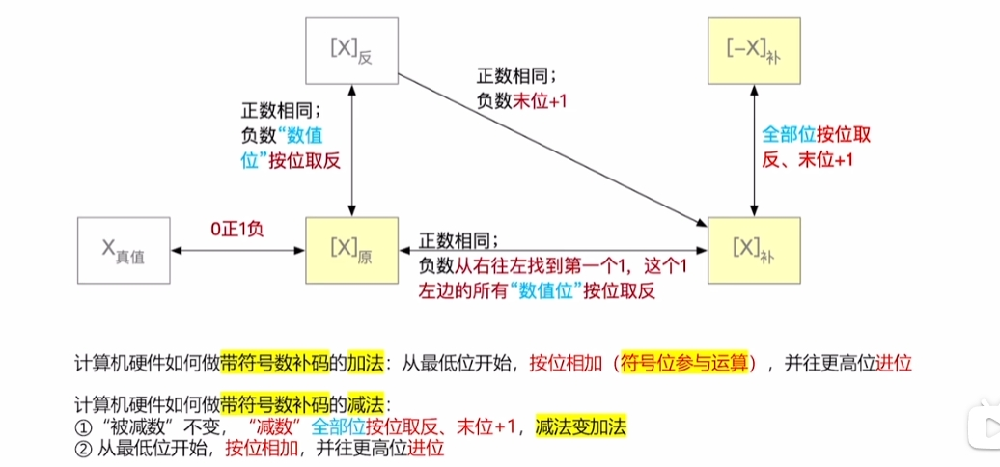
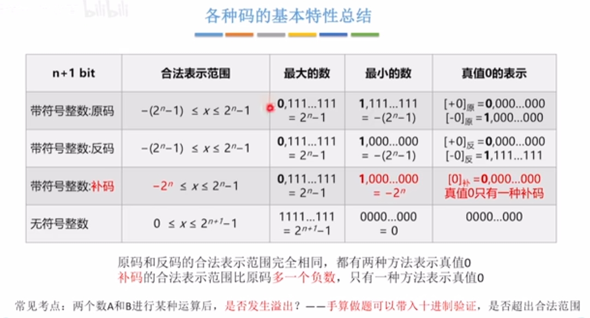

1.无符号整数的加减运算

+号直接按位相加，超出8位溢出丢弃

-号不可以直接相减因为实现造价太昂贵，所有需要变成+号处理

   被除数 - 除数，需要**把除数按位取反最后一位加1 ，然后与被除数相加即可**

```js
被除数     0000 1110
除数       0110 0111
除数变成    1001 1001
```

2.带符号整数的加减运算

原码的缺点：**符号位不能参与运算**，需要设计复杂的硬件电路才能处理,费钱!贵!

所有需要把原码转换为补码，**用补码表示真值——符号位可以参与运算**

```js
+19 0001 0011
-19 1001 0011
不可以直接运算,需要都转换为补码，才可以进行加减运算
+19补 0001 0011
-19补 1110 1101
然后相加即可，符号位可以参与运算相加即可
```

> 补码数值位不能解读为"位权" ,只能转换为原码才解读   位权: 2的n次方，2进制转10进制
>
> **所有想要得到最后的值，需要把得到结果的补码转换为原码**

> 加法直接相加，减法使用无符号整数的方法，全部位按位取反，末位+1 

> **[A]补 - [B]补 = [A]补 + [-B]补**   

> **[B]补  ——> [-B]补   直接按位取反，末位+1即可**
>
> 也可以使用补码转原码的方法，从右边往左开始找到第一个1，1左边的"全部位"按位取反，包括符号位(补码转原码不变符号位)
>
> **补码转原码**:从右往左找到第一个1，这个1左边的所有"数值位"按位取反不包括符号位

```js
移码：补码的基础上将符号位取反。
注意：移码只能用于表示整数
原、反、补可以表示小数
```



原码反码补码特性总结:



> 原码反码的有效范围在 -127 < x < 127
>
> 补码比原码反码多一个负号位 -128 < x <  127

